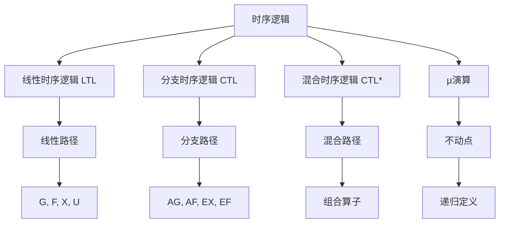
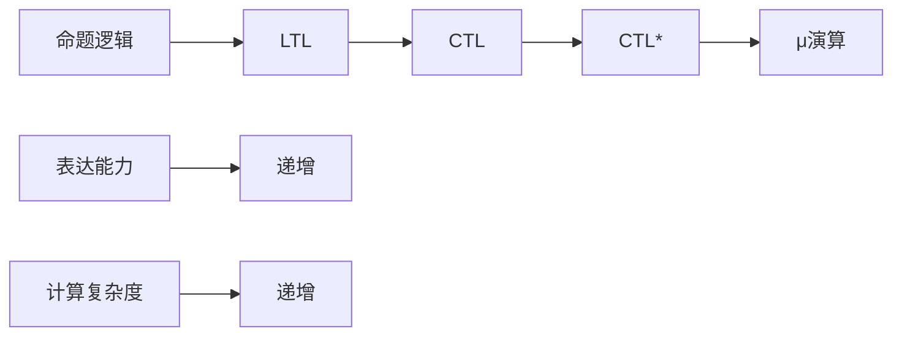
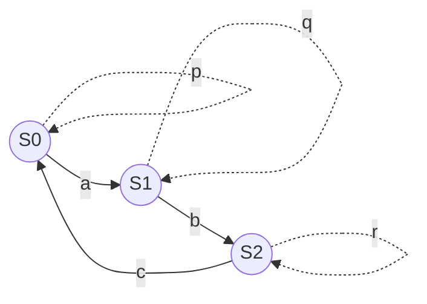
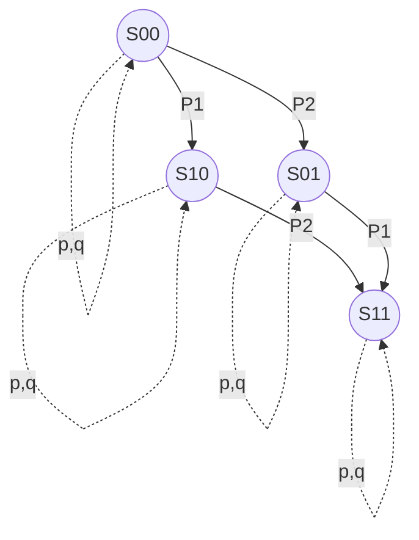
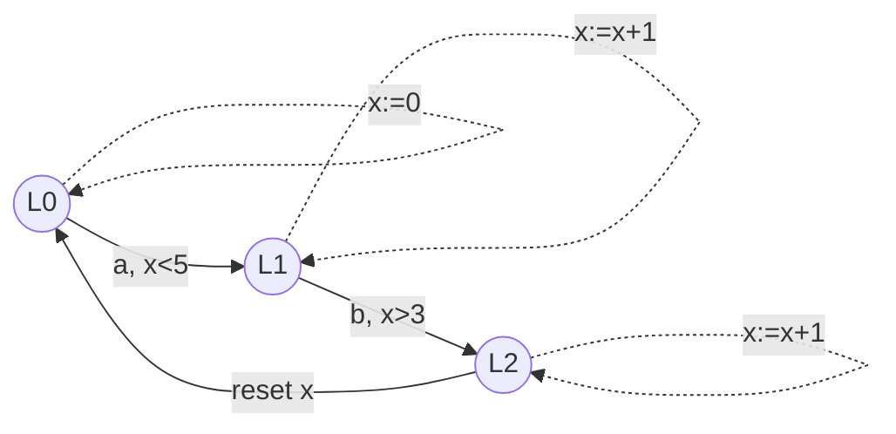
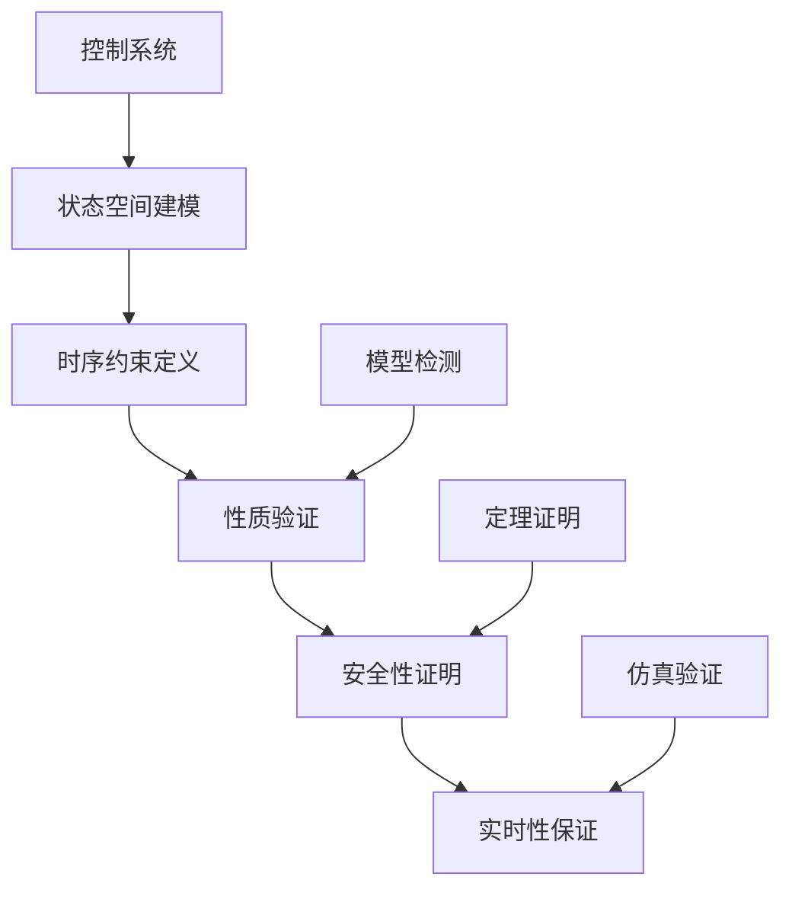
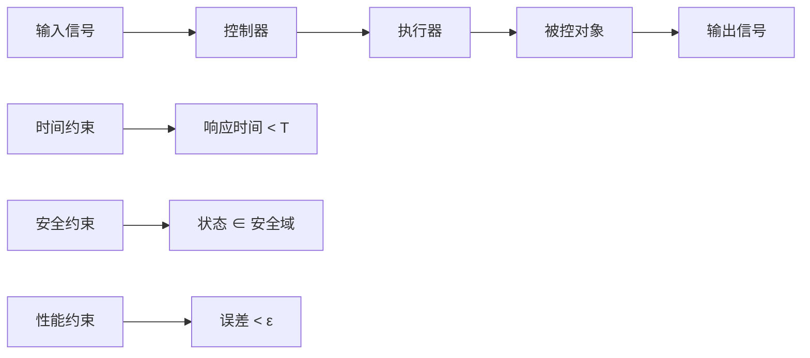
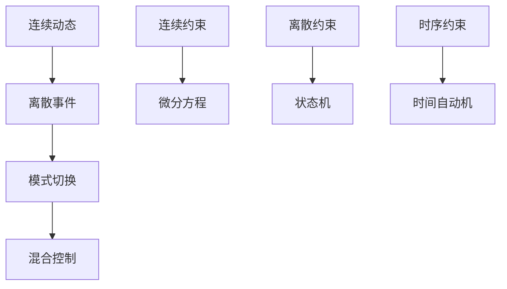

# 1.3.6 图表与多表征

## 目录

1.3.6.1 主题概述  
1.3.6.2 时序逻辑结构图  
1.3.6.3 Kripke结构可视化  
1.3.6.4 控制系统时序约束图  
1.3.6.5 相关性与交叉引用  
1.3.6.6 参考文献与延伸阅读  

---

### 1.3.6.1 主题概述

本节汇总时序逻辑与控制系统相关的图表、可视化与多表征内容，辅助理解复杂结构与流程。

### 1.3.6.2 时序逻辑结构图

#### 时序逻辑分类层次

#### 时序逻辑表达能力比较

### 1.3.6.3 Kripke结构可视化

#### 基本Kripke结构

#### 并发系统Kripke结构

#### 时间自动机结构

### 1.3.6.4 控制系统时序约束图

#### 控制系统验证流程

#### 实时控制系统约束

#### 混合系统控制

### 1.3.6.5 相关性与交叉引用

#### 理论基础

- [1.3.1-时序逻辑基础](./1.3.1-时序逻辑基础.md) - 时序逻辑的基本概念和语法
- [1.3.2-主要时序逻辑系统](./1.3.2-主要时序逻辑系统.md) - LTL、CTL、CTL*等时序逻辑系统
- [1.3.3-时序逻辑建模与验证](./1.3.3-时序逻辑建模与验证.md) - 时序逻辑的建模方法和验证技术

#### 应用领域

- [1.3.4-控制理论与应用](./1.3.4-控制理论与应用.md) - 控制系统中的时序逻辑应用
- [1.3.5-典型工程案例](./1.3.5-典型工程案例.md) - 实际工程中的时序逻辑应用案例

#### 相关理论

- [1.2-类型理论与证明](../1.2-类型理论与证明.md) - 类型论与证明论基础
- [1.4-Petri网与分布式系统](../1.4-Petri网与分布式系统.md) - Petri网和分布式系统理论

#### 工程实践

- [7.2-工程实践案例](../../7-验证与工程实践/7.2-工程实践案例.md) - 形式化验证的工程实践
- [7.1-形式化验证架构](../../7-验证与工程实践/7.1-形式化验证架构.md) - 形式化验证的整体架构

### 1.3.6.6 参考文献与延伸阅读

#### 核心教材

- **《时序逻辑与自动机》** - 时序逻辑的经典教材
- **《Model Checking》**（Clarke, Grumberg, Peled）- 模型检测的权威教材
- **《Principles of Model Checking》**（Baier, Katoen）- 模型检测原理

#### 经典论文

- **Pnueli, A. (1977).** The temporal logic of programs. SFCS 1977.
- **Clarke, E. M., et al. (1986).** Automatic verification of finite-state concurrent systems using temporal logic specifications. ACM TOPLAS.
- **Vardi, M. Y., & Wolper, P. (1986).** An automata-theoretic approach to automatic program verification. LICS.

#### 开源工具

- **NuSMV** - 符号模型检测工具
- **SPIN** - 显式状态模型检测器
- **TLA+** - 时序逻辑动作规范语言
- **UPPAAL** - 实时系统模型检测工具

#### 在线资源

- **Lean 官方文档**：<https://leanprover.github.io/>
- **NuSMV 官网**：<https://nusmv.fbk.eu/>
- **SPIN 官网**：<http://spinroot.com/>
- **arXiv 论文检索**：<https://arxiv.org/>
