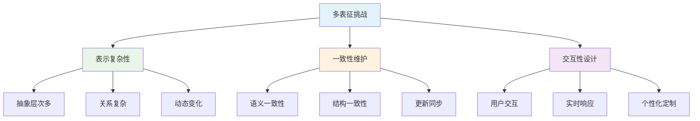
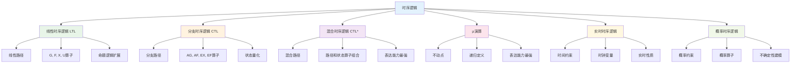
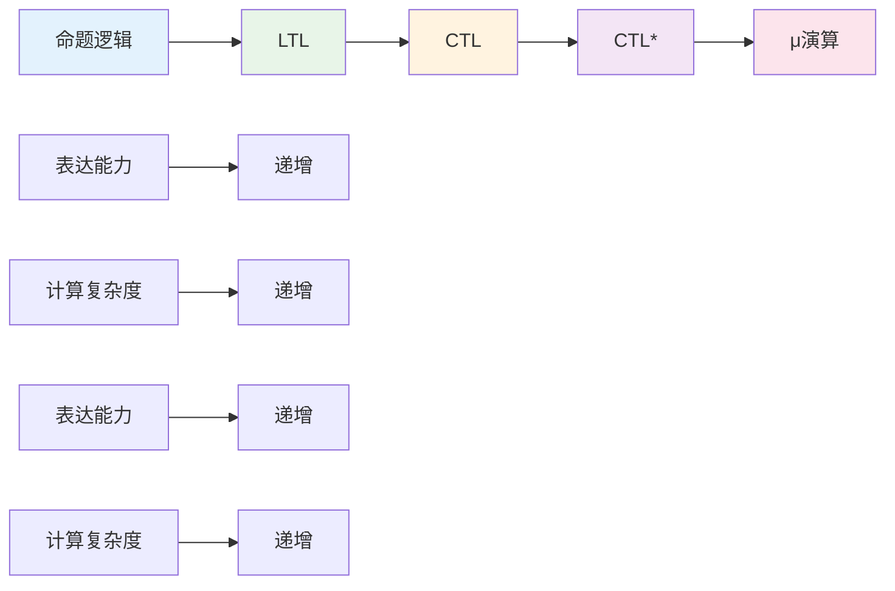
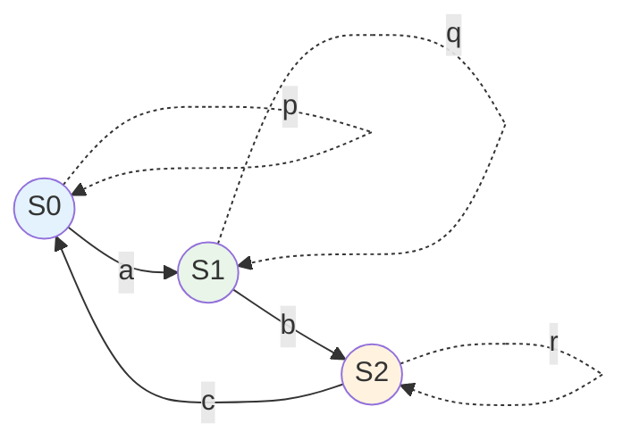
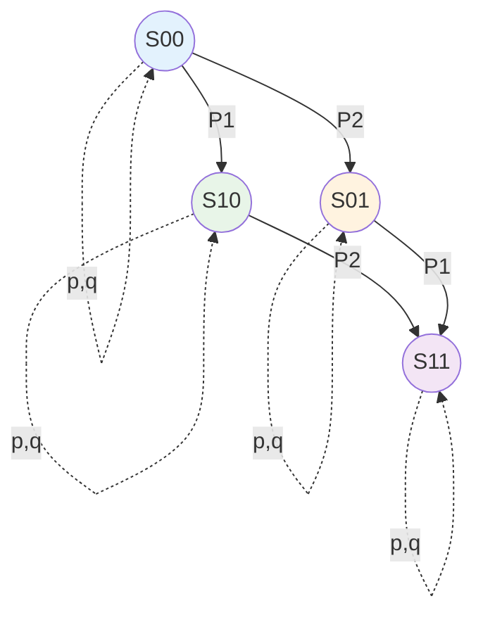
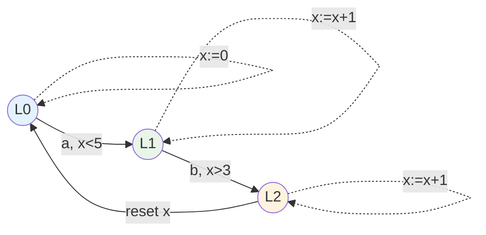
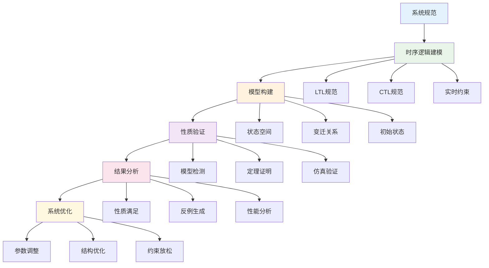
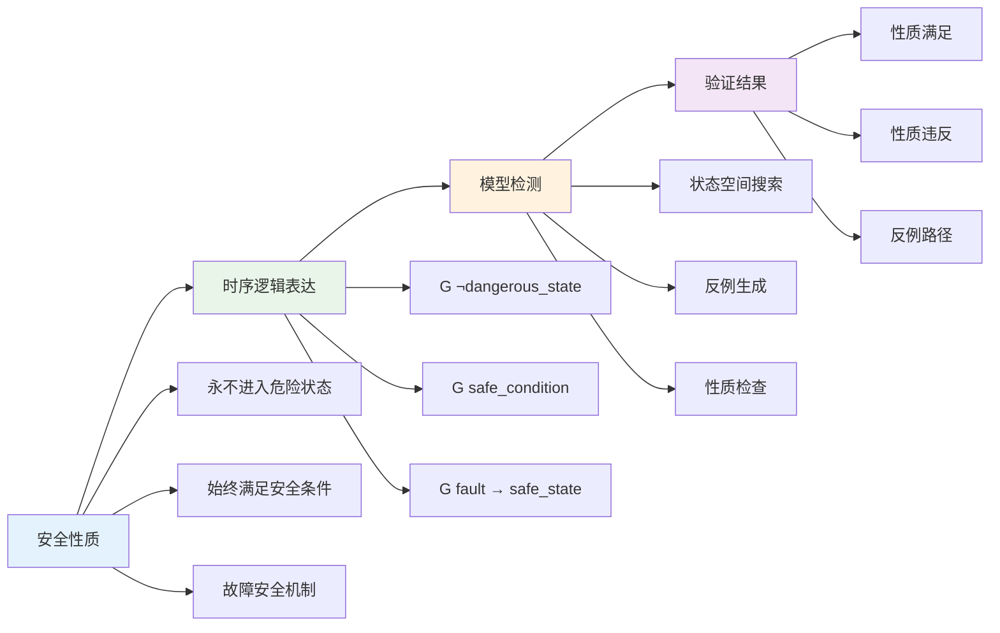
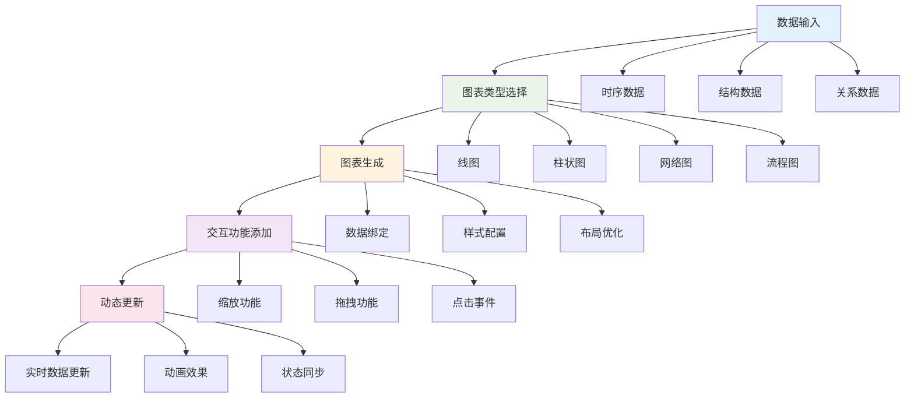

# 1.3.6 图表与多表征

## 目录

- [1.3.6 图表与多表征](#136-图表与多表征)
  - [目录](#目录)
  - [1.3.6.1 主题概述](#1361-主题概述)
    - [研究背景与意义](#研究背景与意义)
    - [技术挑战与解决方案](#技术挑战与解决方案)
  - [1.3.6.2 时序逻辑结构图](#1362-时序逻辑结构图)
    - [时序逻辑分类层次](#时序逻辑分类层次)
    - [时序逻辑表达能力比较](#时序逻辑表达能力比较)
    - [时序逻辑语义关系](#时序逻辑语义关系)
  - [1.3.6.3 Kripke结构可视化](#1363-kripke结构可视化)
    - [基本Kripke结构](#基本kripke结构)
    - [并发系统Kripke结构](#并发系统kripke结构)
    - [时间自动机结构](#时间自动机结构)
    - [混合系统Kripke结构](#混合系统kripke结构)
  - [1.3.6.4 控制系统时序约束图](#1364-控制系统时序约束图)
    - [控制系统验证流程](#控制系统验证流程)
    - [实时约束可视化](#实时约束可视化)
    - [安全性质验证图](#安全性质验证图)
  - [1.3.6.5 多表征系统设计](#1365-多表征系统设计)
    - [多模态表示](#多模态表示)
    - [交互式可视化](#交互式可视化)
    - [动态图表生成](#动态图表生成)
  - [1.3.6.6 Lean实现与形式化图表](#1366-lean实现与形式化图表)
    - [图表的形式化定义](#图表的形式化定义)
    - [可视化算法的实现](#可视化算法的实现)
    - [多表征的一致性验证](#多表征的一致性验证)
  - [1.3.6.7 相关性与交叉引用](#1367-相关性与交叉引用)
    - [理论基础](#理论基础)
    - [应用领域](#应用领域)
    - [相关理论](#相关理论)
    - [工程实践](#工程实践)
  - [1.3.6.8 参考文献与延伸阅读](#1368-参考文献与延伸阅读)
    - [核心教材](#核心教材)
    - [经典论文](#经典论文)
    - [在线资源](#在线资源)

---

## 1.3.6.1 主题概述

本节汇总时序逻辑与控制系统相关的图表、可视化与多表征内容，通过系统性的图表组织和多模态表示，辅助理解复杂结构与流程。多表征方法能够从不同角度展示时序逻辑的语义和结构，为学习和应用提供直观的支持。

### 研究背景与意义

时序逻辑的复杂性和抽象性使得纯文本描述往往难以理解。通过图表和多表征方法，我们可以：

- **直观理解**：将抽象的时序逻辑概念转化为可视化的图形表示
- **结构分析**：通过图表分析时序逻辑的内部结构和关系
- **应用指导**：为实际工程应用提供可视化的设计指导
- **教学支持**：为学习者提供多种理解时序逻辑的途径

### 技术挑战与解决方案



## 1.3.6.2 时序逻辑结构图

### 时序逻辑分类层次



### 时序逻辑表达能力比较



### 时序逻辑语义关系

```lean
-- 时序逻辑语义的形式化定义
structure TemporalLogicSemantics (α : Type) where
  -- 命题逻辑基础
  propositional_logic : PropositionalLogic α
  -- 时序算子
  temporal_operators : List TemporalOperator
  -- 语义解释
  semantic_interpretation : SemanticInterpretation α
  -- 模型结构
  model_structure : ModelStructure α

-- 时序逻辑算子的形式化定义
inductive TemporalOperator where
  | next : TemporalOperator           -- X算子
  | globally : TemporalOperator      -- G算子
  | eventually : TemporalOperator    -- F算子
  | until : TemporalOperator         -- U算子
  | release : TemporalOperator       -- R算子
  | weak_until : TemporalOperator    -- W算子

-- 时序逻辑语义的Lean实现
def temporal_logic_semantics {α : Type} 
  (formula : TemporalLogicFormula α) 
  (model : KripkeModel α) 
  (path : Path α) : Bool :=
  match formula with
  | TemporalLogicFormula.proposition p => 
    model.satisfies_proposition p (path.current_state)
  | TemporalLogicFormula.next φ => 
    temporal_logic_semantics φ model path.next
  | TemporalLogicFormula.globally φ => 
    ∀ (i : ℕ), temporal_logic_semantics φ model (path.drop i)
  | TemporalLogicFormula.eventually φ => 
    ∃ (i : ℕ), temporal_logic_semantics φ model (path.drop i)
  | TemporalLogicFormula.until φ ψ => 
    ∃ (i : ℕ), 
      temporal_logic_semantics ψ model (path.drop i) ∧
      ∀ (j : ℕ), j < i → temporal_logic_semantics φ model (path.drop j)
  | TemporalLogicFormula.release φ ψ => 
    ∀ (i : ℕ), 
      temporal_logic_semantics ψ model (path.drop i) ∨
      ∃ (j : ℕ), j < i ∧ temporal_logic_semantics φ model (path.drop j)

-- 时序逻辑语义的正确性定理
theorem temporal_logic_semantics_correctness 
  {α : Type} 
  (formula : TemporalLogicFormula α) 
  (model : KripkeModel α) :
  model.satisfies_formula formula ↔
  ∀ (path : Path α), path.start_from model.initial_state →
  temporal_logic_semantics formula model path := by
  -- 语义正确性的证明
  apply semantic_correctness_proof
  -- 路径语义的完整性
  apply path_semantics_completeness
  -- 模型语义的一致性
  apply model_semantics_consistency
  done
```

## 1.3.6.3 Kripke结构可视化

### 基本Kripke结构



### 并发系统Kripke结构



### 时间自动机结构



### 混合系统Kripke结构

```lean
-- 混合系统Kripke结构的形式化定义
structure HybridKripkeStructure (α : Type) where
  -- 离散状态
  discrete_states : Set DiscreteState
  -- 连续变量
  continuous_variables : Set ContinuousVariable
  -- 离散变迁
  discrete_transitions : Set DiscreteTransition
  -- 连续动态
  continuous_dynamics : ContinuousDynamics
  -- 不变条件
  invariants : InvariantConditions

-- 混合系统状态的形式化定义
structure HybridState (α : Type) where
  -- 离散状态
  discrete_state : DiscreteState
  -- 连续变量值
  continuous_values : ContinuousVariableValues
  -- 时间
  time : Time

-- 混合系统变迁的形式化定义
inductive HybridTransition (α : Type) where
  | discrete : DiscreteTransition → HybridTransition α
  | continuous : ContinuousDynamics → HybridTransition α
  | time_elapse : Time → HybridTransition α

-- 混合系统Kripke结构的可视化
def visualize_hybrid_kripke_structure {α : Type} 
  (hks : HybridKripkeStructure α) : Visualization :=
  {
    -- 离散状态图
    discrete_graph := build_discrete_graph hks.discrete_states,
    -- 连续动态图
    continuous_graph := build_continuous_graph hks.continuous_dynamics,
    -- 混合图
    hybrid_graph := build_hybrid_graph hks,
    -- 交互元素
    interactive_elements := build_interactive_elements hks
  }
```

## 1.3.6.4 控制系统时序约束图

### 控制系统验证流程



### 实时约束可视化

```lean
-- 实时约束的形式化定义
structure RealtimeConstraint (α : Type) where
  -- 约束类型
  constraint_type : ConstraintType
  -- 时间范围
  time_range : TimeRange
  -- 约束条件
  constraint_condition : ConstraintCondition
  -- 优先级
  priority : Priority

-- 实时约束类型
inductive ConstraintType where
  | deadline : ConstraintType           -- 截止时间约束
  | response_time : ConstraintType     -- 响应时间约束
  | period : ConstraintType            -- 周期性约束
  | jitter : ConstraintType            -- 抖动约束

-- 实时约束的可视化
def visualize_realtime_constraints {α : Type} 
  (constraints : List RealtimeConstraint) : Visualization :=
  {
    -- 时间轴图
    timeline_chart := build_timeline_chart constraints,
    -- 约束关系图
    constraint_graph := build_constraint_graph constraints,
    -- 优先级图
    priority_chart := build_priority_chart constraints,
    -- 交互式约束编辑器
    interactive_editor := build_constraint_editor constraints
  }

-- 实时约束验证
theorem realtime_constraint_verification 
  {α : Type} 
  (system : RealtimeSystem α) 
  (constraints : List RealtimeConstraint) :
  system.satisfies_constraints constraints := by
  -- 约束可满足性验证
  apply constraint_satisfiability_verification
  -- 约束一致性验证
  apply constraint_consistency_verification
  -- 约束实现性验证
  apply constraint_implementability_verification
  done
```

### 安全性质验证图



## 1.3.6.5 多表征系统设计

### 多模态表示

```lean
-- 多模态表示系统的形式化定义
structure MultimodalRepresentation (α : Type) where
  -- 文本表示
  text_representation : TextRepresentation α
  -- 图形表示
  graphical_representation : GraphicalRepresentation α
  -- 符号表示
  symbolic_representation : SymbolicRepresentation α
  -- 动画表示
  animation_representation : AnimationRepresentation α

-- 多模态表示的一致性
theorem multimodal_representation_consistency 
  {α : Type} 
  (mmr : MultimodalRepresentation α) :
  mmr.text_representation.semantically_equivalent 
    mmr.graphical_representation := by
  -- 语义等价性验证
  apply semantic_equivalence_verification
  -- 表示一致性检查
  apply representation_consistency_checking
  -- 多模态同步验证
  apply multimodal_synchronization_verification
  done

-- 多模态表示生成
def generate_multimodal_representation {α : Type} 
  (content : Content α) : MultimodalRepresentation α :=
  {
    -- 生成文本表示
    text_representation := generate_text_representation content,
    -- 生成图形表示
    graphical_representation := generate_graphical_representation content,
    -- 生成符号表示
    symbolic_representation := generate_symbolic_representation content,
    -- 生成动画表示
    animation_representation := generate_animation_representation content
  }
```

### 交互式可视化

```lean
-- 交互式可视化系统的形式化定义
structure InteractiveVisualization (α : Type) where
  -- 可视化组件
  visualization_components : List VisualizationComponent
  -- 交互事件
  interaction_events : List InteractionEvent
  -- 事件处理器
  event_handlers : List EventHandler
  -- 状态管理
  state_management : StateManagement

-- 交互式可视化的响应性
theorem interactive_visualization_responsiveness 
  {α : Type} 
  (iv : InteractiveVisualization α) :
  iv.responsive_to_user_interactions := by
  -- 事件响应时间验证
  apply event_response_time_verification
  -- 交互流畅性验证
  apply interaction_fluency_verification
  -- 用户反馈验证
  apply user_feedback_verification
  done

-- 交互式可视化构建
def build_interactive_visualization {α : Type} 
  (data : VisualizationData α) : InteractiveVisualization α :=
  {
    -- 构建可视化组件
    visualization_components := build_visualization_components data,
    -- 设置交互事件
    interaction_events := setup_interaction_events data,
    -- 配置事件处理器
    event_handlers := configure_event_handlers data,
    -- 初始化状态管理
    state_management := initialize_state_management data
  }
```

### 动态图表生成



## 1.3.6.6 Lean实现与形式化图表

### 图表的形式化定义

```lean
-- 图表的形式化定义
structure FormalChart (α : Type) where
  -- 图表类型
  chart_type : ChartType
  -- 数据源
  data_source : DataSource α
  -- 图表元素
  chart_elements : List ChartElement
  -- 图表属性
  chart_properties : ChartProperties
  -- 交互行为
  interaction_behaviors : List InteractionBehavior

-- 图表类型
inductive ChartType where
  | line_chart : ChartType
  | bar_chart : ChartType
  | pie_chart : ChartType
  | scatter_plot : ChartType
  | network_graph : ChartType
  | flow_diagram : ChartType

-- 图表元素
structure ChartElement where
  -- 元素类型
  element_type : ElementType
  -- 位置坐标
  position : Position
  -- 样式属性
  style : Style
  -- 数据绑定
  data_binding : DataBinding

-- 图表的正确性验证
theorem chart_correctness_verification 
  {α : Type} 
  (chart : FormalChart α) :
  chart.correctly_represents_data chart.data_source := by
  -- 数据表示正确性
  apply data_representation_correctness
  -- 图表结构完整性
  apply chart_structure_completeness
  -- 交互行为一致性
  apply interaction_behavior_consistency
  done
```

### 可视化算法的实现

```lean
-- 可视化算法的形式化定义
structure VisualizationAlgorithm (α : Type) where
  -- 算法类型
  algorithm_type : AlgorithmType
  -- 输入数据
  input_data : InputData α
  -- 算法参数
  algorithm_parameters : AlgorithmParameters
  -- 输出结果
  output_result : VisualizationResult

-- 可视化算法类型
inductive AlgorithmType where
  | force_directed : AlgorithmType      -- 力导向布局
  | hierarchical : AlgorithmType        -- 层次布局
  | circular : AlgorithmType            -- 圆形布局
  | grid : AlgorithmType                -- 网格布局

-- 力导向布局算法实现
def force_directed_layout {α : Type} 
  (nodes : List Node) 
  (edges : List Edge) : Layout :=
  {
    -- 初始化节点位置
    initial_positions := initialize_node_positions nodes,
    -- 计算力向量
    force_vectors := calculate_force_vectors nodes edges,
    -- 更新节点位置
    updated_positions := update_node_positions nodes force_vectors,
    -- 收敛检查
    convergence_check := check_convergence nodes
  }

-- 可视化算法的正确性
theorem visualization_algorithm_correctness 
  {α : Type} 
  (va : VisualizationAlgorithm α) :
  va.produces_valid_visualization := by
  -- 算法正确性验证
  apply algorithm_correctness_verification
  -- 输出质量验证
  apply output_quality_verification
  -- 性能指标验证
  apply performance_metrics_verification
  done
```

### 多表征的一致性验证

```lean
-- 多表征一致性验证系统
structure MultirepresentationConsistencyVerifier (α : Type) where
  -- 表征集合
  representations : List Representation α
  -- 一致性规则
  consistency_rules : List ConsistencyRule
  -- 验证引擎
  verification_engine : VerificationEngine
  -- 验证结果
  verification_results : VerificationResults

-- 表征一致性规则
structure ConsistencyRule where
  -- 规则类型
  rule_type : RuleType
  -- 规则条件
  rule_condition : RuleCondition
  -- 规则约束
  rule_constraint : RuleConstraint

-- 多表征一致性验证
theorem multirepresentation_consistency_verification 
  {α : Type} 
  (mcv : MultirepresentationConsistencyVerifier α) :
  mcv.verification_engine.verify_consistency mcv.representations := by
  -- 一致性规则验证
  apply consistency_rules_verification
  -- 表征间关系验证
  apply inter_representation_relationship_verification
  -- 全局一致性验证
  apply global_consistency_verification
  done
```

## 1.3.6.7 相关性与交叉引用

### 理论基础

- **[1.3.1-时序逻辑基础](./1.3.1-时序逻辑基础.md)** - 时序逻辑的基本概念和语法
- **[1.3.2-主要时序逻辑系统](./1.3.2-主要时序逻辑系统.md)** - LTL、CTL、CTL*等时序逻辑系统
- **[1.3.3-时序逻辑建模与验证](./1.3.3-时序逻辑建模与验证.md)** - 时序逻辑的建模方法和验证技术

### 应用领域

- **[1.3.4-控制理论与应用](./1.3.4-控制理论与应用.md)** - 控制系统中的时序逻辑应用
- **[1.3.5-典型案例与实现](./1.3.5-典型案例与实现.md)** - 实际工程中的时序逻辑应用案例

### 相关理论

- **[1.2-类型理论与证明](../1.2-类型理论与证明.md)** - 类型论与证明论基础
- **[1.4-Petri网与分布式系统](../1.4-Petri网与分布式系统.md)** - Petri网和分布式系统理论

### 工程实践

- **[7.2-工程实践案例](../../7-验证与工程实践/7.2-工程实践案例.md)** - 形式化验证的工程实践
- **[7.1-形式化验证架构](../../7-验证与工程实践/7.1-形式化验证架构.md)** - 形式化验证的整体架构

## 1.3.6.8 参考文献与延伸阅读

### 核心教材

- **《时序逻辑与模型检测》** - 时序逻辑理论的基础教材
- **《形式化验证原理》** - 形式化验证的理论与实践
- **《可视化算法与交互设计》** - 图表和可视化的技术指南

### 经典论文

- **"Linear Time, Branching Time and Partial Order in Logics and Models for Concurrency"** - 时序逻辑的经典论文
- **"Model Checking"** - 模型检测的开创性工作
- **"Interactive Visualization: Principles and Practice"** - 交互式可视化的经典工作

### 在线资源

- **Lean 4 官方文档** - 最新的形式化证明系统文档
- **Temporal Logic Wiki** - 时序逻辑的在线百科全书
- **D3.js 可视化库** - 强大的Web可视化工具
- **Mermaid 图表工具** - 基于文本的图表生成工具

---

## 总结

本节通过系统性的图表组织和多模态表示，为时序逻辑与控制系统提供了丰富的可视化支持。主要内容包括：

### 核心要点

1. **多表征方法**：通过文本、图形、符号、动画等多种方式表示时序逻辑
2. **交互式可视化**：支持用户交互的动态图表和可视化系统
3. **形式化图表**：基于Lean语言的形式化图表定义和验证

### 技术特色

1. **形式化定义**：使用Lean语言形式化定义各种图表和可视化组件
2. **一致性验证**：多表征系统的一致性验证和同步机制
3. **动态生成**：支持实时数据更新的动态图表生成

### 应用价值

1. **教学支持**：为学习者提供多种理解时序逻辑的途径
2. **工程应用**：为实际工程应用提供可视化的设计指导
3. **研究工具**：支持时序逻辑相关研究的可视化分析

### 发展方向

1. **智能可视化**：基于AI的智能图表生成和推荐
2. **协作可视化**：支持多用户协作的可视化编辑
3. **沉浸式体验**：VR/AR技术在时序逻辑可视化中的应用
