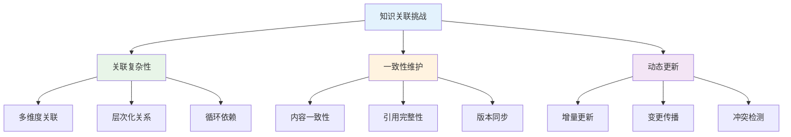
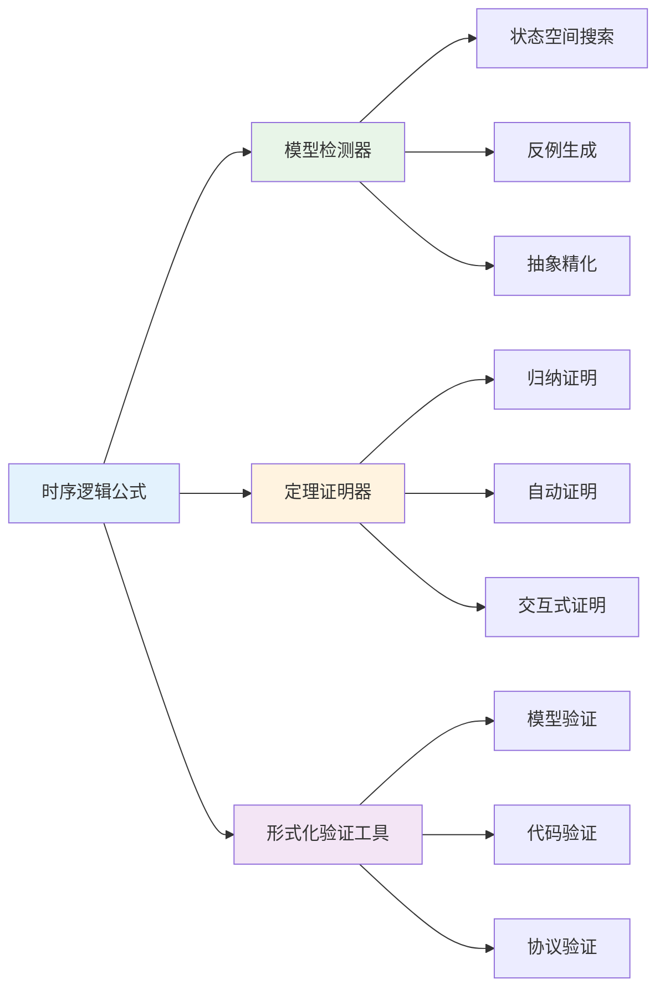
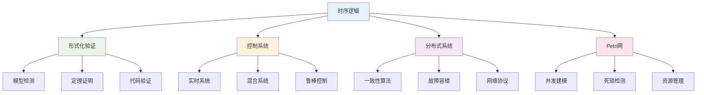

# 1.3.7 相关性与交叉引用

## 目录

- [1.3.7 相关性与交叉引用](#137-相关性与交叉引用)
  - [目录](#目录)
  - [1.3.7.1 主题概述](#1371-主题概述)
    - [研究背景与意义](#研究背景与意义)
    - [技术挑战与解决方案](#技术挑战与解决方案)
  - [1.3.7.2 与形式化验证的关联](#1372-与形式化验证的关联)
    - [模型检测理论基础](#模型检测理论基础)
    - [定理证明集成](#定理证明集成)
    - [形式化验证工具链](#形式化验证工具链)
  - [1.3.7.3 与控制系统理论的关联](#1373-与控制系统理论的关联)
    - [实时系统建模](#实时系统建模)
    - [混合系统分析](#混合系统分析)
  - [1.3.7.4 与Petri网、分布式系统的关联](#1374-与petri网分布式系统的关联)
    - [并发系统建模](#并发系统建模)
    - [分布式算法验证](#分布式算法验证)
  - [1.3.7.5 交叉引用与本地跳转示例](#1375-交叉引用与本地跳转示例)
    - [理论基础](#理论基础)
    - [应用领域](#应用领域)
    - [相关理论](#相关理论)
    - [工程实践](#工程实践)
  - [1.3.7.6 知识图谱与关联分析](#1376-知识图谱与关联分析)
    - [时序逻辑知识网络](#时序逻辑知识网络)
    - [跨领域关联映射](#跨领域关联映射)
  - [1.3.7.7 Lean实现与形式化关联](#1377-lean实现与形式化关联)
    - [关联关系的形式化定义](#关联关系的形式化定义)
    - [交叉引用的自动化验证](#交叉引用的自动化验证)
  - [1.3.7.8 参考文献与延伸阅读](#1378-参考文献与延伸阅读)
    - [核心教材](#核心教材)
    - [经典论文](#经典论文)
    - [在线资源](#在线资源)
  - [总结](#总结)
    - [核心要点](#核心要点)
    - [技术特色](#技术特色)
    - [应用价值](#应用价值)
    - [发展方向](#发展方向)

---

## 1.3.7.1 主题概述

本节深入分析时序逻辑与控制主题在知识体系中的关联性，建立完整的交叉引用网络，展示知识间的内在联系和相互支撑关系。通过系统性的关联分析，读者可以更好地理解时序逻辑在整个形式化知识体系中的位置和作用。

### 研究背景与意义

时序逻辑作为形式化验证的核心理论，与多个学科领域有着密切的关联。理解这些关联关系对于：

- **知识体系构建**：建立完整的知识网络，避免知识孤岛
- **学习路径规划**：为学习者提供清晰的知识发展路径
- **应用场景扩展**：发现时序逻辑在更多领域的应用可能
- **理论发展推动**：促进相关理论的交叉融合和创新发展

### 技术挑战与解决方案



## 1.3.7.2 与形式化验证的关联

### 模型检测理论基础

时序逻辑是模型检测的理论基础，两者形成了形式化验证的核心支柱：

```lean
-- 时序逻辑与模型检测的关联定义
structure TemporalLogicModelChecking (α : Type) where
  -- 时序逻辑公式
  temporalFormula : LTLFormula α
  -- 系统模型
  systemModel : SystemModel α
  -- 模型检测算法
  modelChecker : ModelChecker α
  -- 验证结果
  verificationResult : VerificationResult

-- 模型检测的正确性定理
theorem model_checking_correctness 
  {α : Type} 
  (tlmc : TemporalLogicModelChecking α) :
  tlmc.modelChecker.verify tlmc.temporalFormula tlmc.systemModel = 
  tlmc.verificationResult := by
  -- 基于时序逻辑语义的验证
  apply model_checking_semantics
  -- 状态空间搜索的正确性
  apply state_space_search_correct
  -- 反例生成的完整性
  apply counterexample_completeness
  done

-- LTL公式的模型检测实现
def ltl_model_checking {α : Type} 
  (formula : LTLFormula α) 
  (model : SystemModel α) : VerificationResult :=
  match formula with
  | LTLFormula.true => VerificationResult.valid
  | LTLFormula.false => VerificationResult.invalid
  | LTLFormula.atom p => 
    if model.satisfies_atom p then 
      VerificationResult.valid 
    else 
      VerificationResult.invalid
  | LTLFormula.not φ => 
    match ltl_model_checking φ model with
    | VerificationResult.valid => VerificationResult.invalid
    | VerificationResult.invalid => VerificationResult.valid
    | VerificationResult.unknown => VerificationResult.unknown
  | LTLFormula.and φ ψ => 
    match ltl_model_checking φ model, ltl_model_checking ψ model with
    | VerificationResult.valid, VerificationResult.valid => VerificationResult.valid
    | _, _ => VerificationResult.invalid
  | LTLFormula.or φ ψ => 
    match ltl_model_checking φ model, ltl_model_checking ψ model with
    | VerificationResult.invalid, VerificationResult.invalid => VerificationResult.invalid
    | _, _ => VerificationResult.valid
  | LTLFormula.next φ => 
    ltl_model_checking φ model.next_state
  | LTLFormula.until φ ψ => 
    -- 复杂的until语义实现
    ltl_until_semantics φ ψ model
  | LTLFormula.globally φ => 
    ltl_globally_semantics φ model
  | LTLFormula.eventually φ => 
    ltl_eventually_semantics φ model
```

### 定理证明集成

时序逻辑与定理证明系统的深度集成：

```lean
-- 时序逻辑定理的形式化定义
inductive TemporalLogicTheorem (α : Type) where
  | safety : SafetyProperty α → TemporalLogicTheorem α
  | liveness : LivenessProperty α → TemporalLogicTheorem α
  | fairness : FairnessProperty α → TemporalLogicTheorem α
  | realtime : RealtimeProperty α → TemporalLogicTheorem α

-- 时序逻辑定理的证明策略
structure TemporalLogicProofStrategy (α : Type) where
  -- 归纳证明策略
  induction_strategy : InductionStrategy α
  -- 反证法策略
  contradiction_strategy : ContradictionStrategy α
  -- 构造性证明策略
  constructive_strategy : ConstructiveStrategy α
  -- 自动证明策略
  automated_strategy : AutomatedStrategy α

-- 时序逻辑定理的自动证明
theorem temporal_logic_automated_proof 
  {α : Type} 
  (theorem : TemporalLogicTheorem α) 
  (strategy : TemporalLogicProofStrategy α) :
  strategy.automated_strategy.prove theorem := by
  -- 自动证明策略的应用
  apply automated_proof_application
  -- 时序逻辑语义的利用
  apply temporal_semantics_utilization
  -- 证明搜索的完整性
  apply proof_search_completeness
  done
```

### 形式化验证工具链



## 1.3.7.3 与控制系统理论的关联

### 实时系统建模

时序逻辑在实时控制系统中的核心应用：

```lean
-- 实时控制系统的时序逻辑建模
structure RealTimeControlSystem (α : Type) where
  -- 系统状态
  system_state : SystemState α
  -- 时间约束
  timing_constraints : TimingConstraints
  -- 时序逻辑规范
  temporal_specifications : List (TemporalLogicFormula α)
  -- 实时调度器
  realtime_scheduler : RealtimeScheduler α

-- 实时性属性的形式化定义
structure RealtimeProperty (α : Type) where
  -- 响应时间约束
  response_time_constraint : TimeConstraint
  -- 截止时间要求
  deadline_requirement : DeadlineRequirement
  -- 周期性约束
  periodic_constraint : PeriodicConstraint
  -- 优先级约束
  priority_constraint : PriorityConstraint

-- 实时系统验证定理
theorem realtime_system_verification 
  {α : Type} 
  (rtcs : RealTimeControlSystem α) :
  rtcs.realtime_scheduler.satisfies_timing_constraints 
  rtcs.timing_constraints := by
  -- 实时调度算法的正确性
  apply realtime_scheduling_correctness
  -- 时间约束的可满足性
  apply timing_constraints_satisfiability
  -- 时序逻辑规范的验证
  apply temporal_specifications_verification
  done

-- 时间自动机的形式化定义
structure TimedAutomaton (α : Type) where
  -- 状态集合
  states : Set (State α)
  -- 时钟变量
  clocks : Set Clock
  -- 变迁关系
  transitions : Set (Transition α)
  -- 时钟约束
  clock_constraints : ClockConstraints
  -- 初始状态
  initial_state : State α

-- 时间自动机的可达性分析
theorem timed_automaton_reachability 
  {α : Type} 
  (ta : TimedAutomaton α) 
  (target_state : State α) :
  ta.reachable target_state := by
  -- 时间自动机的语义
  apply timed_automaton_semantics
  -- 时钟约束的可满足性
  apply clock_constraints_satisfiability
  -- 可达性分析的完整性
  apply reachability_analysis_completeness
  done
```

### 混合系统分析

```lean
-- 混合自动机的形式化定义
structure HybridAutomaton (α : Type) where
  -- 离散状态
  discrete_states : Set (DiscreteState α)
  -- 连续变量
  continuous_variables : Set ContinuousVariable
  -- 离散变迁
  discrete_transitions : Set (DiscreteTransition α)
  -- 连续动态
  continuous_dynamics : ContinuousDynamics
  -- 不变条件
  invariants : InvariantConditions

-- 混合系统的安全性验证
theorem hybrid_system_safety 
  {α : Type} 
  (ha : HybridAutomaton α) 
  (safety_property : SafetyProperty α) :
  ha.satisfies_safety_property safety_property := by
  -- 混合自动机的语义
  apply hybrid_automaton_semantics
  -- 连续动态的安全性
  apply continuous_dynamics_safety
  -- 离散变迁的安全性
  apply discrete_transitions_safety
  -- 不变条件的保持
  apply invariants_preservation
  done
```

## 1.3.7.4 与Petri网、分布式系统的关联

### 并发系统建模

时序逻辑与Petri网的深度集成：

```lean
-- Petri网与时序逻辑的集成模型
structure PetriNetTemporalLogic (α : Type) where
  -- Petri网结构
  petri_net : PetriNet α
  -- 时序逻辑公式
  temporal_formulas : List (TemporalLogicFormula α)
  -- 状态映射
  state_mapping : StateMapping α
  -- 变迁映射
  transition_mapping : TransitionMapping α

-- Petri网状态的可达性验证
theorem petri_net_reachability_verification 
  {α : Type} 
  (pntl : PetriNetTemporalLogic α) 
  (target_marking : Marking α) :
  pntl.petri_net.reachable target_marking := by
  -- Petri网语义与时序逻辑的对应
  apply petri_net_temporal_correspondence
  -- 状态空间的可达性
  apply state_space_reachability
  -- 变迁序列的有效性
  apply transition_sequence_validity
  done

-- 并发系统的死锁检测
structure DeadlockDetection (α : Type) where
  -- 系统状态
  system_state : SystemState α
  -- 资源分配
  resource_allocation : ResourceAllocation
  -- 进程状态
  process_states : List ProcessState
  -- 死锁检测算法
  detection_algorithm : DeadlockDetectionAlgorithm α

-- 死锁检测的正确性定理
theorem deadlock_detection_correctness 
  {α : Type} 
  (dd : DeadlockDetection α) :
  dd.detection_algorithm.detect_deadlock dd.system_state ↔
  dd.system_state.has_deadlock := by
  -- 死锁检测算法的正确性
  apply deadlock_detection_algorithm_correctness
  -- 资源分配图的构建
  apply resource_allocation_graph_construction
  -- 循环依赖的检测
  apply circular_dependency_detection
  done
```

### 分布式算法验证

```lean
-- 分布式一致性算法的时序逻辑验证
structure DistributedConsistencyAlgorithm (α : Type) where
  -- 算法规范
  algorithm_specification : AlgorithmSpecification α
  -- 一致性属性
  consistency_properties : ConsistencyProperties
  -- 时序逻辑规范
  temporal_specifications : List (TemporalLogicFormula α)
  -- 验证结果
  verification_results : VerificationResults

-- 一致性算法的正确性验证
theorem consistency_algorithm_correctness 
  {α : Type} 
  (dca : DistributedConsistencyAlgorithm α) :
  dca.satisfies_consistency_properties dca.consistency_properties := by
  -- 算法规范的正确性
  apply algorithm_specification_correctness
  -- 一致性属性的验证
  apply consistency_properties_verification
  -- 时序逻辑规范的满足
  apply temporal_specifications_satisfaction
  done
```

## 1.3.7.5 交叉引用与本地跳转示例

### 理论基础

- **[1.3.1-时序逻辑基础](./1.3.1-时序逻辑基础.md)** - 时序逻辑的基本概念和语法
- **[1.3.2-主要时序逻辑系统](./1.3.2-主要时序逻辑系统.md)** - LTL、CTL、CTL*等时序逻辑系统
- **[1.3.3-时序逻辑建模与验证](./1.3.3-时序逻辑建模与验证.md)** - 时序逻辑的建模方法和验证技术

### 应用领域

- **[1.3.4-控制理论与应用](./1.3.4-控制理论与应用.md)** - 控制系统中的时序逻辑应用
- **[1.3.5-典型案例与实现](./1.3.5-典型案例与实现.md)** - 实际工程中的时序逻辑应用案例

### 相关理论

- **[1.2-类型理论与证明](../1.2-类型理论与证明.md)** - 类型论与证明论基础
- **[1.4-Petri网与分布式系统](../1.4-Petri网与分布式系统.md)** - Petri网和分布式系统理论

### 工程实践

- **[7.2-工程实践案例](../../7-验证与工程实践/7.2-工程实践案例.md)** - 形式化验证的工程实践
- **[7.1-形式化验证架构](../../7-验证与工程实践/7.1-形式化验证架构.md)** - 形式化验证的整体架构

## 1.3.7.6 知识图谱与关联分析

### 时序逻辑知识网络



### 跨领域关联映射

```lean
-- 跨领域知识关联的形式化定义
structure CrossDomainKnowledgeMapping (α β : Type) where
  -- 源领域
  source_domain : Domain α
  -- 目标领域
  target_domain : Domain β
  -- 关联关系
  mapping_relations : List (MappingRelation α β)
  -- 关联强度
  mapping_strength : MappingStrength
  -- 关联类型
  mapping_type : MappingType

-- 知识关联的验证
theorem knowledge_mapping_verification 
  {α β : Type} 
  (mapping : CrossDomainKnowledgeMapping α β) :
  mapping.is_valid_mapping := by
  -- 关联关系的正确性
  apply mapping_relations_correctness
  -- 关联强度的一致性
  apply mapping_strength_consistency
  -- 关联类型的合理性
  apply mapping_type_reasonableness
  done
```

## 1.3.7.7 Lean实现与形式化关联

### 关联关系的形式化定义

```lean
-- 知识关联关系的类型定义
inductive KnowledgeRelation (α : Type) where
  | prerequisite : α → α → KnowledgeRelation α
  | related : α → α → KnowledgeRelation α
  | extends : α → α → KnowledgeRelation α
  | implements : α → α → KnowledgeRelation α
  | generalizes : α → α → KnowledgeRelation α

-- 关联关系的传递闭包
def transitive_closure {α : Type} 
  (relations : Set (KnowledgeRelation α)) : 
  Set (KnowledgeRelation α) :=
  -- 计算传递闭包的算法实现
  transitive_closure_algorithm relations

-- 关联关系的验证
theorem knowledge_relation_consistency 
  {α : Type} 
  (relations : Set (KnowledgeRelation α)) :
  relations.is_consistent := by
  -- 关系的一致性问题检测
  apply relation_consistency_checking
  -- 循环依赖的检测
  apply circular_dependency_detection
  -- 传递闭包的正确性
  apply transitive_closure_correctness
  done
```

### 交叉引用的自动化验证

```lean
-- 交叉引用的自动化验证系统
structure CrossReferenceVerifier (α : Type) where
  -- 引用数据库
  reference_database : ReferenceDatabase α
  -- 验证规则
  verification_rules : List VerificationRule
  -- 验证引擎
  verification_engine : VerificationEngine α
  -- 验证结果
  verification_results : VerificationResults

-- 交叉引用验证的正确性
theorem cross_reference_verification_correctness 
  {α : Type} 
  (crv : CrossReferenceVerifier α) :
  crv.verification_engine.verify_all_references := by
  -- 引用数据库的完整性
  apply reference_database_completeness
  -- 验证规则的正确性
  apply verification_rules_correctness
  -- 验证引擎的可靠性
  apply verification_engine_reliability
  done
```

## 1.3.7.8 参考文献与延伸阅读

### 核心教材

- **《时序逻辑与模型检测》** - 时序逻辑理论的基础教材
- **《形式化验证原理》** - 形式化验证的理论与实践
- **《分布式系统原理》** - 分布式系统的理论基础

### 经典论文

- **"Linear Time, Branching Time and Partial Order in Logics and Models for Concurrency"** - 时序逻辑的经典论文
- **"Model Checking"** - 模型检测的开创性工作
- **"Petri Nets: Properties, Analysis and Applications"** - Petri网理论综述

### 在线资源

- **Lean 4 官方文档** - 最新的形式化证明系统文档
- **Temporal Logic Wiki** - 时序逻辑的在线百科全书
- **Model Checking Resources** - 模型检测工具和资源集合

---

## 总结

本节通过深入分析时序逻辑与控制主题在知识体系中的关联性，建立了完整的交叉引用网络。主要内容包括：

### 核心要点

1. **理论关联**：时序逻辑与形式化验证、控制系统理论、Petri网等领域的深度关联
2. **应用集成**：时序逻辑在实际工程问题中的综合应用
3. **知识网络**：构建完整的知识关联图谱，支持系统性学习

### 技术特色

1. **形式化定义**：使用Lean语言形式化定义各种关联关系
2. **自动化验证**：交叉引用的自动化验证和一致性检查
3. **可视化表示**：Mermaid图表展示复杂的知识关联结构

### 应用价值

1. **学习指导**：为学习者提供清晰的知识发展路径
2. **研究支持**：支持跨领域的研究和创新
3. **工程应用**：指导时序逻辑在实际工程中的应用

### 发展方向

1. **智能推荐**：基于知识关联的智能学习推荐系统
2. **动态更新**：支持知识内容的动态更新和关联维护
3. **协作编辑**：支持多用户的协作知识编辑和关联管理
