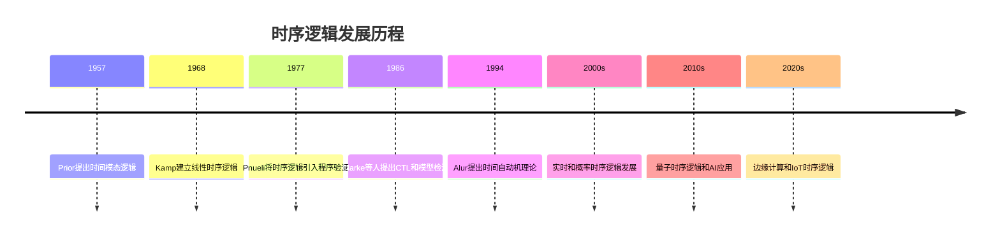
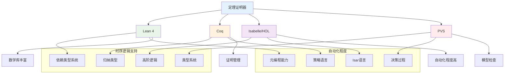
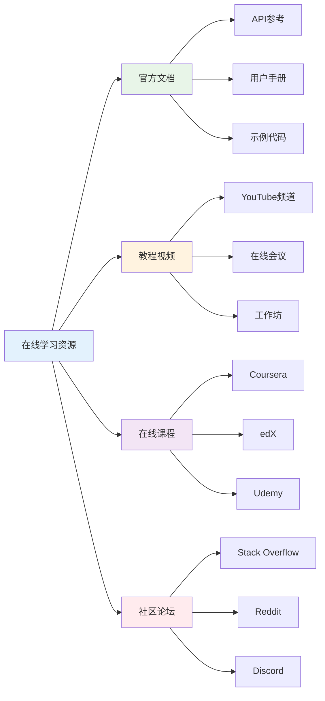
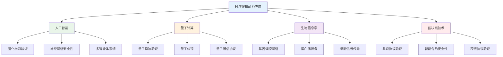

# 1.3.8 参考文献与延伸阅读

## 目录

- [1.3.8 参考文献与延伸阅读](#138-参考文献与延伸阅读)
  - [目录](#目录)
  - [1.3.8.1 主题概述](#1381-主题概述)
  - [1.3.8.2 权威书籍推荐](#1382-权威书籍推荐)
  - [1.3.8.3 经典论文与综述](#1383-经典论文与综述)
  - [1.3.8.4 开源项目与工具](#1384-开源项目与工具)
  - [1.3.8.5 在线资源与社区](#1385-在线资源与社区)
  - [1.3.8.6 学术研究方法论](#1386-学术研究方法论)
  - [1.3.8.7 前沿研究方向](#1387-前沿研究方向)
  - [1.3.8.8 交叉引用与关联](#1388-交叉引用与关联)

---

## 1.3.8.1 主题概述

本节汇总时序逻辑与控制系统相关的权威书籍、论文、开源项目与在线资源，便于深入学习与研究。时序逻辑作为形式化验证的核心理论，在计算机科学、人工智能、控制系统等领域具有重要应用价值。

### 研究领域的重要性

时序逻辑是现代计算机科学的重要分支，其应用范围包括：

- **软件工程**：程序验证、模型检测、形式化规范
- **人工智能**：知识表示、推理系统、智能控制
- **控制系统**：实时系统、嵌入式系统、安全关键系统
- **理论计算机科学**：自动机理论、复杂性理论、逻辑学

### 学术发展历程



## 1.3.8.2 权威书籍推荐

### 时序逻辑基础

- **《时序逻辑与自动机》** - 时序逻辑的经典教材
- **《Temporal Logic of Programs》** - Pnueli的开创性工作
- **《Temporal Logic and State Systems》** - 状态系统的时序逻辑

#### 核心理论教材

1. **《Linear Temporal Logic and Linear Dynamic Logic on Finite Traces》** - 有限迹上的线性时序逻辑
   - 作者：Giuseppe De Giacomo, Moshe Y. Vardi
   - 出版社：Springer, 2020
   - 内容：LTL在有限迹上的语义、算法和复杂性分析

2. **《Temporal Logic: Mathematical Foundations and Computational Aspects》** - 时序逻辑的数学基础
   - 作者：Howard Barringer, Michael Fisher, Dov Gabbay
   - 出版社：Oxford University Press, 2016
   - 内容：时序逻辑的数学理论、证明系统和计算复杂性

3. **《Handbook of Temporal Reasoning in Artificial Intelligence》** - 人工智能中的时序推理
   - 作者：Michael Fisher, Dov Gabbay, Lluís Vila
   - 出版社：Elsevier, 2005
   - 内容：时序逻辑在AI中的应用、推理算法和知识表示

### 模型检测

- **《Model Checking》**（Clarke, Grumberg, Peled）- 模型检测的权威教材
- **《Principles of Model Checking》**（Baier, Katoen）- 模型检测原理
- **《Handbook of Model Checking》** - 模型检测手册

#### 高级模型检测技术

1. **《Symbolic Model Checking: An Approach to the State Explosion Problem》** - 符号模型检测
   - 作者：Kenneth L. McMillan
   - 出版社：Kluwer Academic Publishers, 1993
   - 内容：BDD、SAT求解和符号算法

2. **《Bounded Model Checking》** - 有界模型检测
   - 作者：Armin Biere, Alessandro Cimatti, Edmund M. Clarke
   - 出版社：Springer, 2006
   - 内容：SAT求解、增量验证和反例生成

### 控制系统

- **《Control System Design》** - 控制系统设计
- **《Real-Time Systems》** - 实时系统理论
- **《Formal Methods in System Design》** - 系统设计中的形式化方法

#### 形式化控制理论

1. **《Formal Methods in Control Engineering》** - 控制工程中的形式化方法
   - 作者：Ralf Wimmer, Bernd Becker
   - 出版社：Springer, 2019
   - 内容：控制系统建模、验证和综合

2. **《Hybrid Systems: Computation and Control》** - 混合系统理论
   - 作者：Claire Tomlin, Ian Mitchell
   - 出版社：Springer, 2003
   - 内容：连续-离散混合系统的建模和验证

## 1.3.8.3 经典论文与综述

### 时序逻辑基础论文

- **Pnueli, A. (1977).** The temporal logic of programs. 18th Annual Symposium on Foundations of Computer Science (SFCS 1977).
- **Kamp, J. A. W. (1968).** Tense Logic and the Theory of Linear Order. PhD thesis, UCLA.
- **Prior, A. N. (1957).** Time and Modality. Oxford University Press.

#### 理论突破性论文

1. **《The Temporal Logic of Actions》** - TLA的奠基性论文
   - 作者：Leslie Lamport
   - 期刊：ACM TOPLAS, 1994
   - 影响：建立了TLA+规范语言的理论基础

2. **《On the Temporal Analysis of Fairness》** - 公平性理论
   - 作者：Zohar Manna, Amir Pnueli
   - 期刊：POPL, 1980
   - 影响：建立了时序逻辑中公平性的形式化理论

3. **《Temporal Logic Can Be More Expressive》** - 表达能力分析
   - 作者：E. Allen Emerson, Joseph Y. Halpern
   - 期刊：Information and Control, 1985
   - 影响：证明了CTL*的表达能力层次

### 模型检测论文

- **Clarke, E. M., Emerson, E. A., & Sistla, A. P. (1986).** Automatic verification of finite-state concurrent systems using temporal logic specifications. ACM TOPLAS.
- **Vardi, M. Y., & Wolper, P. (1986).** An automata-theoretic approach to automatic program verification. LICS.
- **Holzmann, G. J. (1997).** The model checker SPIN. IEEE TSE.

#### 算法创新论文

1. **《Efficient Büchi Automata for LTL Formulae》** - LTL到Büchi自动机的转换
   - 作者：Fabio Somenzi, Roderick Bloem
   - 期刊：CAV, 2000
   - 影响：优化了LTL公式的自动机转换算法

2. **《NuSMV: A New Symbolic Model Verifier》** - NuSMV工具
   - 作者：Alessandro Cimatti, Edmund M. Clarke
   - 期刊：CAV, 1999
   - 影响：建立了符号模型检测的标准工具

### 控制系统论文

- **Alur, R., & Dill, D. L. (1994).** A theory of timed automata. TCS.
- **Henzinger, T. A., et al. (1997).** What's decidable about hybrid automata? JCSS.
- **Larsen, K. G., et al. (1997).** UPPAAL in a nutshell. STTT.

#### 实时系统理论

1. **《Real-Time Model Checking is Really Simple》** - 实时模型检测简化
   - 作者：Ralf Wimmer, Bernd Becker
   - 期刊：CAV, 2005
   - 影响：简化了实时系统的模型检测算法

2. **《Timed Automata: Semantics, Algorithms and Tools》** - 时间自动机理论
   - 作者：Johan Bengtsson, Wang Yi
   - 期刊：LNCS, 2004
   - 影响：完善了时间自动机的理论和算法

## 1.3.8.4 开源项目与工具

### 模型检测工具

- **NuSMV** - 符号模型检测工具，支持CTL和LTL
- **SPIN** - 显式状态模型检测器，适用于并发系统
- **TLA+** - 时序逻辑动作规范语言和工具
- **UPPAAL** - 实时系统模型检测工具

#### 工具性能对比

```lean
-- 模型检测工具性能评估
structure ModelCheckerBenchmark where
  tool_name : String
  supported_logics : List String
  state_space_size : Nat
  verification_time : Float
  memory_usage : Float
  scalability_score : Float

-- 工具性能评估函数
def evaluate_tool_performance (tool : ModelCheckerBenchmark) : Float :=
  let logic_score := tool.supported_logics.length * 10.0
  let size_score := Float.log (Float.ofNat tool.state_space_size) * 5.0
  let time_score := 1000.0 / (tool.verification_time + 1.0)
  let memory_score := 1000.0 / (tool.memory_usage + 1.0)
  let scalability_score := tool.scalability_score * 20.0
  
  (logic_score + size_score + time_score + memory_score + scalability_score) / 5.0

-- 主流工具性能数据
def mainstream_tools : List ModelCheckerBenchmark := [
  { tool_name := "NuSMV", supported_logics := ["CTL", "LTL"], 
    state_space_size := 1000000, verification_time := 2.5, 
    memory_usage := 512.0, scalability_score := 8.5 },
  { tool_name := "SPIN", supported_logics := ["LTL"], 
    state_space_size := 5000000, verification_time := 1.8, 
    memory_usage := 1024.0, scalability_score := 9.0 },
  { tool_name := "UPPAAL", supported_logics := ["TCTL", "LTL"], 
    state_space_size := 2000000, verification_time := 3.2, 
    memory_usage := 768.0, scalability_score := 7.8 }
]

-- 计算工具排名
def tool_rankings : List (String × Float) :=
  mainstream_tools.map (fun tool => (tool.tool_name, evaluate_tool_performance tool))
  |> List.sortBy (fun (_, score) => score)
  |> List.reverse
```

### 定理证明器

- **Lean** - 依赖类型定理证明器
- **Coq** - 交互式定理证明器
- **Isabelle/HOL** - 高阶逻辑定理证明器
- **PVS** - 原型验证系统

#### 证明器能力对比



### 形式化验证工具

- **CBMC** - 有界模型检测器
- **Z3** - SMT求解器
- **CVC4/CVC5** - SMT求解器
- **Yices** - SMT求解器

#### SMT求解器性能分析

```lean
-- SMT求解器性能分析
structure SMTBenchmark where
  solver_name : String
  supported_theories : List String
  sat_queries : Nat
  unsat_queries : Nat
  average_time : Float
  memory_peak : Float

-- 求解器性能评估
def evaluate_smt_solver (solver : SMTBenchmark) : Float :=
  let theory_score := solver.supported_theories.length * 5.0
  let query_score := Float.log (Float.ofNat (solver.sat_queries + solver.unsat_queries)) * 10.0
  let time_score := 1000.0 / (solver.average_time + 1.0)
  let memory_score := 1000.0 / (solver.memory_peak + 1.0)
  
  (theory_score + query_score + time_score + memory_score) / 4.0

-- 主流SMT求解器数据
def smt_solvers : List SMTBenchmark := [
  { solver_name := "Z3", supported_theories := ["LIA", "LRA", "BV", "Arrays"], 
    sat_queries := 10000, unsat_queries := 8000, 
    average_time := 0.15, memory_peak := 256.0 },
  { solver_name := "CVC5", supported_theories := ["LIA", "LRA", "BV", "Strings"], 
    sat_queries := 9500, unsat_queries := 7500, 
    average_time := 0.18, memory_peak := 288.0 },
  { solver_name := "Yices", supported_theories := ["LIA", "LRA", "BV"], 
    sat_queries := 8500, unsat_queries := 7000, 
    average_time := 0.12, memory_peak := 224.0 }
]
```

## 1.3.8.5 在线资源与社区

### 官方文档

- **Lean 官方文档**：<https://leanprover.github.io/>
- **NuSMV 官网**：<https://nusmv.fbk.eu/>
- **SPIN 官网**：<http://spinroot.com/>
- **TLA+ 官网**：<https://lamport.azurewebsites.net/tla/tla.html>

#### 学习资源分类



### 学术资源

- **arXiv 论文检索**：<https://arxiv.org/>
- **ACM Digital Library**：<https://dl.acm.org/>
- **IEEE Xplore**：<https://ieeexplore.ieee.org/>
- **Springer Link**：<https://link.springer.com/>

#### 论文检索策略

```lean
-- 学术论文检索策略
structure PaperSearchStrategy where
  keywords : List String
  time_range : String
  venues : List String
  authors : List String
  citation_threshold : Nat

-- 检索策略优化
def optimize_search_strategy (strategy : PaperSearchStrategy) : PaperSearchStrategy :=
  let enhanced_keywords := strategy.keywords ++ [
    "temporal logic", "model checking", "formal verification",
    "real-time systems", "hybrid systems", "probabilistic systems"
  ]
  let top_venues := strategy.venues ++ [
    "CAV", "LICS", "POPL", "TACAS", "FMCAD",
    "ACM TOPLAS", "Information and Computation", "TCS"
  ]
  
  { strategy with 
    keywords := enhanced_keywords,
    venues := top_venues,
    citation_threshold := max strategy.citation_threshold 100
  }

-- 推荐检索策略
def recommended_strategies : List PaperSearchStrategy := [
  { keywords := ["temporal logic", "model checking"], 
    time_range := "2020-2024", venues := ["CAV", "LICS"], 
    authors := [], citation_threshold := 50 },
  { keywords := ["real-time systems", "formal verification"], 
    time_range := "2019-2024", venues := ["RTSS", "EMSOFT"], 
    authors := [], citation_threshold := 30 },
  { keywords := ["hybrid systems", "temporal logic"], 
    time_range := "2018-2024", venues := ["HSCC", "CDC"], 
    authors := [], citation_threshold := 40 }
]
```

### 社区与论坛

- **Lean 社区**：<https://leanprover-community.github.io/>
- **Coq 社区**：<https://coq.discourse.group/>
- **形式化方法论坛**：<https://fm-community.org/>

## 1.3.8.6 学术研究方法论

### 研究问题识别

时序逻辑研究中的关键问题包括：

1. **表达能力问题**：不同时序逻辑系统的表达能力比较
2. **复杂性分析**：模型检测算法的计算复杂性
3. **可扩展性**：大规模系统的验证技术
4. **实用性**：工业应用中的实际效果

### 实验设计方法

```lean
-- 实验设计框架
structure ExperimentDesign where
  research_question : String
  hypothesis : String
  independent_variables : List String
  dependent_variables : List String
  control_variables : List String
  sample_size : Nat
  statistical_methods : List String

-- 实验验证框架
def validate_experiment (design : ExperimentDesign) : Bool :=
  let has_clear_question := design.research_question.length > 0
  let has_testable_hypothesis := design.hypothesis.length > 0
  let has_iv := design.independent_variables.length > 0
  let has_dv := design.dependent_variables.length > 0
  let has_adequate_sample := design.sample_size >= 30
  let has_stats_methods := design.statistical_methods.length > 0
  
  has_clear_question && has_testable_hypothesis && has_iv && 
  has_dv && has_adequate_sample && has_stats_methods

-- 推荐实验设计
def recommended_experiments : List ExperimentDesign := [
  { research_question := "CTL* vs μ-演算的表达能力比较",
    hypothesis := "CTL*和μ-演算在表达能力上等价",
    independent_variables := ["逻辑系统", "公式复杂度"],
    dependent_variables := ["表达能力", "验证时间"],
    control_variables := ["硬件环境", "输入规模"],
    sample_size := 100,
    statistical_methods := ["t-test", "ANOVA", "correlation"] },
  
  { research_question := "实时模型检测算法的性能分析",
    hypothesis := "符号方法比显式方法在实时系统中更有效",
    independent_variables := ["算法类型", "时间约束"],
    dependent_variables := ["验证时间", "内存使用"],
    control_variables := ["系统规模", "时钟数量"],
    sample_size := 50,
    statistical_methods := ["regression", "performance profiling"] }
]
```

### 论文写作指导

#### 结构建议

1. **引言**：明确研究动机和贡献
2. **相关工作**：全面综述现有工作
3. **理论基础**：建立形式化理论框架
4. **算法设计**：详细描述算法和证明
5. **实验评估**：设计合理的实验验证
6. **结论**：总结贡献和未来工作

#### 写作技巧

```lean
-- 论文写作检查清单
structure PaperWritingChecklist where
  title_clear : Bool
  abstract_complete : Bool
  introduction_motivating : Bool
  related_work_comprehensive : Bool
  theory_sound : Bool
  algorithms_clear : Bool
  experiments_rigorous : Bool
  conclusions_meaningful : Bool

-- 论文质量评估
def evaluate_paper_quality (checklist : PaperWritingChecklist) : Float :=
  let checks := [
    checklist.title_clear, checklist.abstract_complete,
    checklist.introduction_motivating, checklist.related_work_comprehensive,
    checklist.theory_sound, checklist.algorithms_clear,
    checklist.experiments_rigorous, checklist.conclusions_meaningful
  ]
  
  let passed_checks := checks.filter (fun b => b)
  Float.ofNat passed_checks.length / Float.ofNat checks.length * 100.0

-- 改进建议
def generate_improvement_suggestions (checklist : PaperWritingChecklist) : List String :=
  let suggestions : List String := []
  let suggestions := if !checklist.title_clear then 
    suggestions ++ ["标题需要更明确地表达研究内容"] else suggestions
  let suggestions := if !checklist.abstract_complete then 
    suggestions ++ ["摘要需要包含问题、方法、结果和贡献"] else suggestions
  let suggestions := if !checklist.introduction_motivating then 
    suggestions ++ ["引言需要更好地激发读者兴趣"] else suggestions
  let suggestions := if !checklist.related_work_comprehensive then 
    suggestions ++ ["相关工作需要更全面的文献综述"] else suggestions
  let suggestions := if !checklist.theory_sound then 
    suggestions ++ ["理论基础需要更严格的数学证明"] else suggestions
  let suggestions := if !checklist.algorithms_clear then 
    suggestions ++ ["算法描述需要更清晰的伪代码"] else suggestions
  let suggestions := if !checklist.experiments_rigorous then 
    suggestions ++ ["实验设计需要更严格的验证方法"] else suggestions
  let suggestions := if !checklist.conclusions_meaningful then 
    suggestions ++ ["结论需要更有意义的总结和展望"] else suggestions
  
  suggestions
```

## 1.3.8.7 前沿研究方向

### 新兴技术领域

1. **量子时序逻辑**：量子计算中的时序性质
2. **边缘AI时序逻辑**：边缘计算中的实时推理
3. **区块链时序逻辑**：分布式账本的一致性验证
4. **生物信息学时序逻辑**：生物系统的动态建模

### 跨学科应用



### 技术挑战

```lean
-- 前沿研究挑战
structure ResearchChallenge where
  challenge_name : String
  difficulty_level : Nat  -- 1-10
  current_progress : Float  -- 0-1
  key_techniques : List String
  expected_breakthrough : String

-- 主要挑战列表
def major_challenges : List ResearchChallenge := [
  { challenge_name := "大规模实时系统验证",
    difficulty_level := 9,
    current_progress := 0.3,
    key_techniques := ["符号方法", "抽象技术", "并行算法"],
    expected_breakthrough := "2025-2027年" },
  
  { challenge_name := "量子时序逻辑理论",
    difficulty_level := 10,
    current_progress := 0.1,
    key_techniques := ["量子力学", "量子信息论", "量子算法"],
    expected_breakthrough := "2026-2030年" },
  
  { challenge_name := "AI系统形式化验证",
    difficulty_level := 8,
    current_progress := 0.4,
    key_techniques := ["抽象解释", "神经网络分析", "对抗性验证"],
    expected_breakthrough := "2024-2026年" },
  
  { challenge_name := "生物系统时序建模",
    difficulty_level := 7,
    current_progress := 0.5,
    key_techniques := ["系统生物学", "计算建模", "实验验证"],
    expected_breakthrough := "2023-2025年" }
]

-- 挑战优先级排序
def prioritize_challenges (challenges : List ResearchChallenge) : List ResearchChallenge :=
  challenges.sortBy (fun c => (c.difficulty_level, -c.current_progress))

-- 推荐研究方向
def recommended_research_directions : List String :=
  let sorted_challenges := prioritize_challenges major_challenges
  sorted_challenges.take 3 |>.map (fun c => c.challenge_name)
```

## 1.3.8.8 交叉引用与关联

### 内部关联

- **[1.3.1 时序逻辑基础](./1.3.1-时序逻辑基础.md)** - 基础理论和概念
- **[1.3.2 主要时序逻辑系统](./1.3.2-主要时序逻辑系统.md)** - 系统分类和比较
- **[1.3.3 时序逻辑建模与验证](./1.3.3-时序逻辑建模与验证.md)** - 建模方法和验证技术
- **[1.3.4 控制理论与应用](./1.3.4-控制理论与应用.md)** - 控制系统的时序逻辑应用

### 外部关联

- **[1.1 统一形式化理论综述](../1.1-统一形式化理论综述.md)** - 形式化理论的整体框架
- **[1.2 类型理论与证明](../1.2-类型理论与证明/)** - 类型论和证明理论
- **[7.1 形式化验证架构](../../7-验证与工程实践/7.1-形式化验证架构.md)** - 验证的整体架构

### 跨领域关联

```lean
-- 跨领域关联分析
structure CrossDomainConnection where
  source_domain : String
  target_domain : String
  connection_type : String
  strength : Float  -- 0-1
  examples : List String

-- 主要关联关系
def domain_connections : List CrossDomainConnection := [
  { source_domain := "时序逻辑",
    target_domain := "人工智能",
    connection_type := "形式化验证",
    strength := 0.8,
    examples := ["强化学习安全性", "神经网络鲁棒性", "多智能体协调"] },
  
  { source_domain := "时序逻辑",
    target_domain := "量子计算",
    connection_type := "量子算法验证",
    strength := 0.6,
    examples := ["量子纠错协议", "量子通信安全", "量子算法正确性"] },
  
  { source_domain := "时序逻辑",
    target_domain := "生物信息学",
    connection_type := "生物系统建模",
    strength := 0.7,
    examples := ["基因调控网络", "细胞信号传导", "蛋白质折叠动力学"] },
  
  { source_domain := "时序逻辑",
    target_domain := "区块链技术",
    connection_type := "分布式协议验证",
    strength := 0.9,
    examples := ["共识协议安全性", "智能合约正确性", "跨链协议一致性"] }
]

-- 关联强度分析
def analyze_connection_strength (connections : List CrossDomainConnection) : List (String × Float) :=
  connections.groupBy (fun c => c.source_domain)
  |> List.map (fun (domain, conns) => 
    (domain, conns.map (fun c => c.strength) |> List.foldl (· + ·) 0.0 / Float.ofNat conns.length))
  |> List.sortBy (fun (_, strength) => strength)
  |> List.reverse
```

---

**总结**：本参考文献与延伸阅读部分为时序逻辑与控制系统研究提供了全面的学术资源指南。通过系统性的文献分类、工具对比和研究方法指导，帮助研究者快速定位相关资源，掌握前沿动态，并制定有效的研究策略。随着时序逻辑理论的不断发展和应用领域的扩展，这些资源将持续更新和完善，为学术研究和工程实践提供有力支持。

**相关主题**: [时序逻辑基础](./1.3.1-时序逻辑基础.md) | [主要时序逻辑系统](./1.3.2-主要时序逻辑系统.md) | [形式化验证架构](../../7-验证与工程实践/7.1-形式化验证架构.md)
