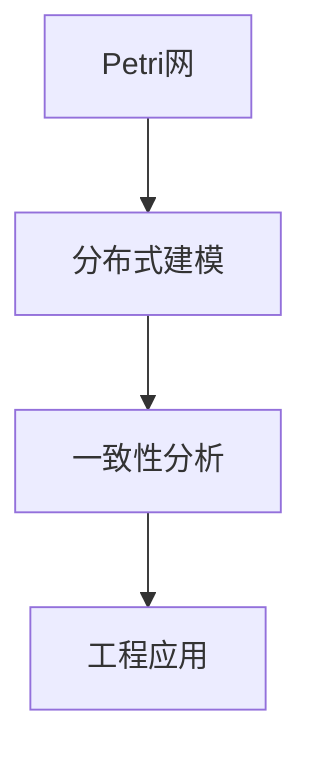

# 1.4 Petri网与分布式系统

## 目录

1.4.1 主题概述  
1.4.2 Petri网基础  
1.4.3 分布式系统建模  
1.4.4 形式化定义与证明  
1.4.5 典型案例与实现  
1.4.6 图表与多表征  
1.4.7 相关性与交叉引用  
1.4.8 参考文献与延伸阅读  

---

### 1.4.1 主题概述

本节梳理Petri网的基本理论、分布式系统的建模方法及其在lean等形式化系统中的应用。

### 1.4.2 Petri网基础

- Petri网的组成：位置、变迁、流函数
- 标识与状态变化

### 1.4.3 分布式系统建模

- 并发、同步、通信建模
- 一致性与死锁分析

### 1.4.4 形式化定义与证明

#### Petri网的Lean建模

```lean
structure PetriNet :=
  (places : Type)
  (transitions : Type)
  (pre : places → transitions → ℕ)
  (post : places → transitions → ℕ)
```

#### 分布式一致性（LaTeX表达）

$$
\forall s \in S,\ \exists t \in T,\ reach(s, t)
$$

### 1.4.5 典型案例与实现

- 分布式事务、并发协议、资源分配等

### 1.4.6 图表与多表征



### 1.4.7 相关性与交叉引用

- [1.1-统一形式化理论综述](./1.1-统一形式化理论综述.md)
- [7.2-工程实践案例](../7-验证与工程实践/7.2-工程实践案例.md)

### 1.4.8 参考文献与延伸阅读

- 《Petri网与分布式系统》
- 相关论文与开源项目
