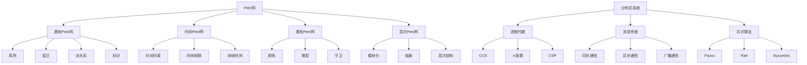

# 1.4 Petri网与分布式系统

[返回上级](../1-形式化理论.md) | [English Version](../1-formal-theory/1.4-petri-net-and-distributed-systems.md)

## 目录

- [1.4 Petri网与分布式系统](#14-petri网与分布式系统)
  - [目录](#目录)
  - [1.4.1 Petri网基础理论](#141-petri网基础理论)
    - [Petri网定义](#petri网定义)
    - [变迁规则](#变迁规则)
    - [可达性分析](#可达性分析)
  - [1.4.2 高级Petri网](#142-高级petri网)
    - [时间Petri网](#时间petri网)
    - [着色Petri网](#着色petri网)
    - [层次Petri网](#层次petri网)
  - [1.4.3 分布式系统建模](#143-分布式系统建模)
    - [进程代数](#进程代数)
    - [消息传递系统](#消息传递系统)
    - [共识算法](#共识算法)
  - [1.4.4 并发分析](#144-并发分析)
    - [死锁检测](#死锁检测)
    - [活性分析](#活性分析)
    - [公平性验证](#公平性验证)
  - [1.4.5 典型案例与实现](#145-典型案例与实现)
    - [生产者-消费者系统](#生产者-消费者系统)
    - [哲学家就餐问题](#哲学家就餐问题)
    - [分布式共识](#分布式共识)
  - [1.4.6 图表与多表征](#146-图表与多表征)
  - [1.4.7 相关性与交叉引用](#147-相关性与交叉引用)
  - [1.4.8 参考文献与延伸阅读](#148-参考文献与延伸阅读)
    - [核心理论文献](#核心理论文献)
      - [Petri网基础理论](#petri网基础理论)
      - [高级Petri网](#高级petri网)
      - [分布式系统理论](#分布式系统理论)
      - [并发理论与进程代数](#并发理论与进程代数)
    - [实践应用文献](#实践应用文献)
      - [Petri网工具](#petri网工具)
      - [分布式系统工具](#分布式系统工具)
      - [并发编程工具](#并发编程工具)
    - [学术会议与期刊](#学术会议与期刊)
      - [顶级会议](#顶级会议)
      - [顶级期刊](#顶级期刊)
    - [在线资源](#在线资源)
      - [学习资源](#学习资源)
      - [社区与论坛](#社区与论坛)
      - [开源项目](#开源项目)
      - [视频教程](#视频教程)

---

## 1.4.1 Petri网基础理论

### Petri网定义

Petri网是一种用于建模并发系统的形式化工具：

**定义 1.4.1** (Petri网)：
Petri网是一个四元组 $N = (P, T, F, M_0)$，其中：

- $P$ 是库所(places)的有限集合
- $T$ 是变迁(transitions)的有限集合，且 $P \cap T = \emptyset$
- $F \subseteq (P \times T) \cup (T \times P)$ 是流关系
- $M_0 : P \rightarrow \mathbb{N}$ 是初始标识

**定义 1.4.2** (前集和后集)：
对于 $x \in P \cup T$：

- $^\bullet x = \{y \mid (y, x) \in F\}$ 是x的前集
- $x^\bullet = \{y \mid (x, y) \in F\}$ 是x的后集

```lean
-- Petri网在Lean中的表示
structure PetriNet where
  places : Set Nat
  transitions : Set Nat
  flow : Set (Nat × Nat)
  initial_marking : Nat → Nat

-- 前集和后集
def preset (N : PetriNet) (x : Nat) : Set Nat :=
  {y | (y, x) ∈ N.flow}

def postset (N : PetriNet) (x : Nat) : Set Nat :=
  {y | (x, y) ∈ N.flow}

-- 标识
def Marking := Nat → Nat

-- 变迁使能条件
def enabled (N : PetriNet) (t : Nat) (M : Marking) : Prop :=
  t ∈ N.transitions ∧
  ∀ p ∈ preset N t, M p > 0

-- 变迁发生
def fire (N : PetriNet) (t : Nat) (M : Marking) : Marking :=
  λ p => 
    if p ∈ preset N t then M p - 1
    else if p ∈ postset N t then M p + 1
    else M p
```

### 变迁规则

Petri网的变迁遵循特定的规则：

**定义 1.4.3** (变迁发生规则)：
变迁 $t \in T$ 在标识 $M$ 下是可发生的，当且仅当：
$$\forall p \in ^\bullet t, M(p) \geq F(p, t)$$

变迁发生后，新的标识 $M'$ 满足：
$$M'(p) = M(p) - F(p, t) + F(t, p)$$

```lean
-- 变迁发生规则实现
def can_fire (N : PetriNet) (t : Nat) (M : Marking) : Prop :=
  t ∈ N.transitions ∧
  ∀ p ∈ preset N t, M p > 0

def fire_transition (N : PetriNet) (t : Nat) (M : Marking) : Marking :=
  if can_fire N t M then
    λ p => 
      if p ∈ preset N t then M p - 1
      else if p ∈ postset N t then M p + 1
      else M p
  else M

-- 变迁序列
def fire_sequence (N : PetriNet) (seq : List Nat) (M : Marking) : Marking :=
  match seq with
  | [] => M
  | t :: rest => fire_sequence N rest (fire_transition N t M)
```

### 可达性分析

可达性分析是Petri网分析的核心：

**定义 1.4.4** (可达性)：
标识 $M$ 从 $M_0$ 可达，如果存在变迁序列 $\sigma$ 使得：
$$M_0 \xrightarrow{\sigma} M$$

```lean
-- 可达性分析
def reachable (N : PetriNet) (M : Marking) : Prop :=
  ∃ seq, fire_sequence N seq N.initial_marking = M

-- 可达性图
structure ReachabilityGraph where
  nodes : Set Marking
  edges : Set (Marking × Nat × Marking)

def build_reachability_graph (N : PetriNet) : ReachabilityGraph :=
  -- 构建可达性图
  sorry

-- 有界性分析
def is_bounded (N : PetriNet) (k : Nat) : Prop :=
  ∀ M, reachable N M → ∀ p, M p ≤ k

-- 安全性分析
def is_safe (N : PetriNet) : Prop :=
  is_bounded N 1
```

## 1.4.2 高级Petri网

### 时间Petri网

时间Petri网引入了时间约束：

**定义 1.4.5** (时间Petri网)：
时间Petri网是一个六元组 $N = (P, T, F, M_0, I, D)$，其中：

- $(P, T, F, M_0)$ 是基础Petri网
- $I : T \rightarrow \mathbb{R}^+ \times \mathbb{R}^+$ 是时间间隔
- $D : T \rightarrow \mathbb{R}^+$ 是持续时间

```lean
-- 时间Petri网实现
structure TimedPetriNet extends PetriNet where
  time_intervals : Nat → Real × Real
  durations : Nat → Real

-- 时间变迁使能
def timed_enabled (N : TimedPetriNet) (t : Nat) (M : Marking) (time : Real) : Prop :=
  enabled N t M ∧
  let (min_time, max_time) := N.time_intervals t
  min_time ≤ time ∧ time ≤ max_time

-- 时间变迁发生
def timed_fire (N : TimedPetriNet) (t : Nat) (M : Marking) (time : Real) : Marking :=
  if timed_enabled N t M time then
    fire_transition N t M
  else M
```

### 着色Petri网

着色Petri网引入了颜色和类型：

**定义 1.4.6** (着色Petri网)：
着色Petri网是一个六元组 $N = (P, T, F, M_0, C, G)$，其中：

- $(P, T, F, M_0)$ 是基础Petri网
- $C : P \cup T \rightarrow \Sigma$ 是颜色函数
- $G : T \rightarrow \text{Guard}$ 是守卫函数

```lean
-- 着色Petri网实现
structure ColoredPetriNet extends PetriNet where
  colors : Nat → Type
  guards : Nat → Prop

-- 着色标识
def ColoredMarking (N : ColoredPetriNet) := 
  (p : Nat) → N.colors p → Nat

-- 着色变迁使能
def colored_enabled (N : ColoredPetriNet) (t : Nat) (M : ColoredMarking N) : Prop :=
  t ∈ N.transitions ∧
  N.guards t ∧
  ∀ p ∈ preset N t, ∀ c, M p c > 0

-- 着色变迁发生
def colored_fire (N : ColoredPetriNet) (t : Nat) (M : ColoredMarking N) : ColoredMarking N :=
  if colored_enabled N t M then
    λ p c => 
      if p ∈ preset N t then M p c - 1
      else if p ∈ postset N t then M p c + 1
      else M p c
  else M
```

### 层次Petri网

层次Petri网支持模块化和抽象：

**定义 1.4.7** (层次Petri网)：
层次Petri网是一个七元组 $N = (P, T, F, M_0, H, \pi, \sigma)$，其中：

- $(P, T, F, M_0)$ 是基础Petri网
- $H$ 是层次结构
- $\pi : T \rightarrow \text{Subnet}$ 是子网映射
- $\sigma : \text{Interface} \rightarrow \text{Interface}$ 是接口映射

```lean
-- 层次Petri网实现
structure HierarchicalPetriNet extends PetriNet where
  hierarchy : Nat → Set Nat
  subnet_mapping : Nat → Option PetriNet
  interface_mapping : Nat → Nat → Nat

-- 层次展开
def expand_hierarchy (N : HierarchicalPetriNet) : PetriNet :=
  -- 展开层次结构
  sorry

-- 层次分析
def hierarchical_analysis (N : HierarchicalPetriNet) : Prop :=
  let expanded := expand_hierarchy N
  -- 在展开的网上进行分析
  sorry
```

## 1.4.3 分布式系统建模

### 进程代数

进程代数为分布式系统提供代数基础：

**定义 1.4.8** (CCS语法)：
$$P ::= 0 \mid \alpha.P \mid P + P \mid P \mid P \mid P \backslash L \mid A$$

其中：

- $0$ 是空进程
- $\alpha.P$ 是前缀
- $P + Q$ 是选择
- $P \mid Q$ 是并行
- $P \backslash L$ 是限制
- $A$ 是进程标识符

```lean
-- CCS在Lean中的表示
inductive CCS where
  | nil : CCS
  | prefix : String → CCS → CCS
  | choice : CCS → CCS → CCS
  | parallel : CCS → CCS → CCS
  | restrict : CCS → Set String → CCS
  | identifier : String → CCS

-- CCS语义
def CCS_step : CCS → String → CCS → Prop
  | CCS.prefix α P, α, P
  | CCS.choice P Q, α, P' => CCS_step P α P'
  | CCS.choice P Q, α, Q' => CCS_step Q α Q'
  | CCS.parallel P Q, α, P' => CCS_step P α P'
  | CCS.parallel P Q, α, Q' => CCS_step Q α Q'
  | CCS.restrict P L, α, P' => 
    α ∉ L ∧ CCS_step P α P'
  | _, _, _ => False

-- 强等价
def strong_bisimilar (P Q : CCS) : Prop :=
  -- 强双模拟等价
  sorry
```

### 消息传递系统

消息传递是分布式系统的核心机制：

**定义 1.4.9** (消息传递系统)：
消息传递系统是一个五元组 $S = (P, M, C, \delta, \mu_0)$，其中：

- $P$ 是进程集合
- $M$ 是消息集合
- $C$ 是通道集合
- $\delta : P \times M \rightarrow P$ 是转移函数
- $\mu_0$ 是初始消息分布

```lean
-- 消息传递系统实现
structure MessagePassingSystem where
  processes : Set Nat
  messages : Set String
  channels : Set (Nat × Nat)
  transition : Nat → String → Nat
  initial_messages : Nat × Nat → List String

-- 消息传递语义
def send_message (S : MessagePassingSystem) (from to : Nat) (msg : String) : 
  MessagePassingSystem :=
  -- 发送消息
  sorry

def receive_message (S : MessagePassingSystem) (p : Nat) (msg : String) : 
  MessagePassingSystem :=
  -- 接收消息
  sorry

-- 消息传递可达性
def message_reachable (S : MessagePassingSystem) (target : MessagePassingSystem) : Prop :=
  -- 检查目标状态是否可达
  sorry
```

### 共识算法

共识是分布式系统的关键问题：

**定义 1.4.10** (共识问题)：
共识问题要求所有进程就某个值达成一致，满足：

- **一致性**：所有进程决定相同的值
- **有效性**：决定的值必须是某个进程提议的值
- **终止性**：所有进程最终都会做出决定

```lean
-- 共识算法实现
structure ConsensusAlgorithm where
  processes : Set Nat
  values : Set String
  rounds : Nat
  decision : Nat → String → Prop

-- Paxos算法
def paxos_algorithm : ConsensusAlgorithm where
  processes := {0, 1, 2, 3, 4}
  values := {"v1", "v2", "v3"}
  rounds := 3
  decision := λ p v => 
    -- Paxos决策逻辑
    sorry

-- 共识性质验证
theorem consensus_consistency :
  ∀ p1 p2 v1 v2, 
  paxos_algorithm.decision p1 v1 ∧ 
  paxos_algorithm.decision p2 v2 → 
  v1 = v2 := by
  -- 验证一致性
  sorry

theorem consensus_validity :
  ∀ p v, paxos_algorithm.decision p v → 
  ∃ p', proposed p' v := by
  -- 验证有效性
  sorry

theorem consensus_termination :
  ∀ p, ∃ v, paxos_algorithm.decision p v := by
  -- 验证终止性
  sorry
```

## 1.4.4 并发分析

### 死锁检测

死锁是并发系统中的重要问题：

**定义 1.4.11** (死锁)：
系统处于死锁状态，如果存在进程集合 $P$ 使得：

- 每个进程 $p \in P$ 都在等待某个资源
- 这些资源被 $P$ 中的其他进程持有

```lean
-- 死锁检测
def is_deadlocked (N : PetriNet) (M : Marking) : Prop :=
  -- 检查是否存在死锁
  ∀ t ∈ N.transitions, ¬enabled N t M

-- 死锁预防
def deadlock_prevention (N : PetriNet) : PetriNet :=
  -- 添加预防机制
  sorry

-- 死锁避免
def deadlock_avoidance (N : PetriNet) (M : Marking) : Prop :=
  -- 检查是否会导致死锁
  sorry
```

### 活性分析

活性分析确保系统能够持续运行：

**定义 1.4.12** (活性)：
Petri网是活的，如果对于每个可达标识 $M$ 和每个变迁 $t$，都存在从 $M$ 可达的标识 $M'$ 使得 $t$ 在 $M'$ 下是可发生的。

```lean
-- 活性分析
def is_live (N : PetriNet) : Prop :=
  ∀ M, reachable N M → 
  ∀ t ∈ N.transitions, 
  ∃ M', reachable_from N M M' ∧ enabled N t M'

-- 活性保持
def preserve_liveness (N : PetriNet) (modification : PetriNet → PetriNet) : Prop :=
  is_live N → is_live (modification N)
```

### 公平性验证

公平性确保系统行为的合理性：

**定义 1.4.13** (公平性)：

- **强公平性**：如果变迁无限次使能，则它必须无限次发生
- **弱公平性**：如果变迁从某个时刻开始一直使能，则它必须发生

```lean
-- 公平性验证
def strong_fairness (N : PetriNet) (t : Nat) : Prop :=
  ∀ π, infinite_path N π → 
  (∀ i, enabled N t (π i)) → 
  ∃ i, fires N t (π i)

def weak_fairness (N : PetriNet) (t : Nat) : Prop :=
  ∀ π, infinite_path N π → 
  (∃ i, ∀ j ≥ i, enabled N t (π j)) → 
  ∃ j, fires N t (π j)

-- 公平性保持
def preserve_fairness (N : PetriNet) (modification : PetriNet → PetriNet) : Prop :=
  ∀ t, strong_fairness N t → strong_fairness (modification N) t
```

## 1.4.5 典型案例与实现

### 生产者-消费者系统

```lean
-- 生产者-消费者Petri网
def producer_consumer_net : PetriNet where
  places := {0, 1, 2, 3, 4}  -- 空闲, 生产, 缓冲区, 消费, 完成
  transitions := {0, 1, 2}    -- 开始生产, 生产完成, 消费
  flow := {(0,0), (0,1), (1,2), (2,3), (3,2), (2,4), (4,0)}
  initial_marking := λ p => if p = 0 then 1 else 0

-- 系统性质验证
theorem producer_consumer_safety :
  ∀ M, reachable producer_consumer_net M → 
  M 2 ≤ 1 := by  -- 缓冲区容量限制
  -- 验证安全性
  sorry

theorem producer_consumer_liveness :
  ∀ M, reachable producer_consumer_net M → 
  ∃ M', reachable_from producer_consumer_net M M' ∧ 
  enabled producer_consumer_net 1 M' := by  -- 生产可以继续
  -- 验证活性
  sorry
```

### 哲学家就餐问题

```lean
-- 哲学家就餐Petri网
def dining_philosophers_net (n : Nat) : PetriNet where
  places := -- 哲学家状态和叉子状态
  transitions := -- 拿起叉子、放下叉子、就餐
  flow := -- 转移关系
  initial_marking := -- 初始状态

-- 死锁避免
theorem dining_philosophers_deadlock_free :
  ∀ n, ¬is_deadlocked (dining_philosophers_net n) 
  (initial_marking (dining_philosophers_net n)) := by
  -- 验证无死锁
  sorry

-- 公平性
theorem dining_philosophers_fairness :
  ∀ n i, i < n → 
  weak_fairness (dining_philosophers_net n) i := by
  -- 验证公平性
  sorry
```

### 分布式共识

```lean
-- 分布式共识Petri网
def distributed_consensus_net : PetriNet where
  places := -- 进程状态、消息状态
  transitions := -- 提议、投票、决定
  flow := -- 转移关系
  initial_marking := -- 初始状态

-- 共识性质
theorem consensus_agreement :
  ∀ M, reachable distributed_consensus_net M → 
  -- 所有进程决定相同值
  sorry

theorem consensus_termination :
  ∀ M, reachable distributed_consensus_net M → 
  ∃ M', reachable_from distributed_consensus_net M M' ∧ 
  -- 所有进程都做出决定
  sorry
```

## 1.4.6 图表与多表征



## 1.4.7 相关性与交叉引用

- **[1.1-统一形式化理论综述](./1.1-统一形式化理论综述.md)** - Petri网在形式化理论中的地位
- **[1.3-时序逻辑与控制](./1.3-时序逻辑与控制.md)** - 时序逻辑与Petri网的结合
- **[4.2-物联网与边缘计算](../4-行业领域分析/4.2-物联网与边缘计算.md)** - 分布式系统在IoT中的应用
- **[7.2-工程实践案例](../7-验证与工程实践/7.2-工程实践案例.md)** - Petri网在工程实践中的应用

## 1.4.8 参考文献与延伸阅读

### 核心理论文献

#### Petri网基础理论

- **《Petri Nets: An Introduction》** - W. Reisig, 1985
- **《Petri Net Theory and the Modeling of Systems》** - J. Peterson, 1981
- **《Application and Theory of Petri Nets》** - K. Jensen, G. Rozenberg, 1991
- **《Coloured Petri Nets: Basic Concepts, Analysis Methods and Practical Use》** - K. Jensen, 1997

#### 高级Petri网

- **《Timed Petri Nets: Theory and Application》** - M. Ajmone Marsan, G. Balbo, G. Conte, 1984
- **《Stochastic Petri Nets: An Introduction to the Theory》** - M. Ajmone Marsan, G. Balbo, G. Conte, 1995
- **《Hierarchical Petri Nets》** - K. Jensen, 1992
- **《High-Level Petri Nets: Theory and Application》** - K. Jensen, G. Rozenberg, 1991

#### 分布式系统理论

- **《Distributed Systems: Concepts and Design》** - G. Coulouris, J. Dollimore, T. Kindberg, 2011
- **《Distributed Algorithms》** - N. Lynch, 1996
- **《Introduction to Distributed Algorithms》** - G. Tel, 2000
- **《Distributed Computing: Principles, Algorithms, and Systems》** - A. Tanenbaum, M. van Steen, 2007

#### 并发理论与进程代数

- **《Communication and Concurrency》** - R. Milner, 1989
- **《A Calculus of Communicating Systems》** - R. Milner, 1980
- **《π-Calculus: A Theory of Mobile Processes》** - D. Sangiorgi, D. Walker, 2001
- **《Process Algebra》** - J. Baeten, T. Basten, 2002

### 实践应用文献

#### Petri网工具

- **CPN Tools** - [cpntools.org](https://cpntools.org/)
- **Snoopy** - [tfs.cs.tu-berlin.de/snoopy](https://tfs.cs.tu-berlin.de/snoopy/)
- **PIPE** - [pipe2.sourceforge.net](https://pipe2.sourceforge.net/)
- **TINA** - [tina.laas.fr](https://tina.laas.fr/)
- **YAWL** - [yawlfoundation.org](https://www.yawlfoundation.org/)
- **ProM** - [promtools.org](https://www.promtools.org/)

#### 分布式系统工具

- **Apache ZooKeeper** - [zookeeper.apache.org](https://zookeeper.apache.org/)
- **etcd** - [etcd.io](https://etcd.io/)
- **Consul** - [consul.io](https://www.consul.io/)
- **Apache Kafka** - [kafka.apache.org](https://kafka.apache.org/)
- **RabbitMQ** - [rabbitmq.com](https://www.rabbitmq.com/)

#### 并发编程工具

- **TLA+** - [lamport.azurewebsites.net/tla/tla.html](https://lamport.azurewebsites.net/tla/tla.html)
- **SPIN** - [spinroot.com](https://spinroot.com/)
- **UPPAAL** - [uppaal.org](https://uppaal.org/)
- **PRISM** - [prismmodelchecker.org](https://prismmodelchecker.org/)

### 学术会议与期刊

#### 顶级会议

- **ICATPN** - International Conference on Application and Theory of Petri Nets
- **CONCUR** - International Conference on Concurrency Theory
- **PODC** - ACM Symposium on Principles of Distributed Computing
- **DISC** - International Symposium on Distributed Computing
- **SOSP** - ACM Symposium on Operating Systems Principles
- **OSDI** - USENIX Symposium on Operating Systems Design and Implementation
- **CAV** - Computer Aided Verification
- **TACAS** - Tools and Algorithms for Construction and Analysis of Systems

#### 顶级期刊

- **Theoretical Computer Science**
- **Information and Computation**
- **Journal of Computer and System Sciences**
- **ACM Transactions on Programming Languages and Systems**
- **IEEE Transactions on Software Engineering**
- **Formal Methods in System Design**
- **Distributed Computing**
- **Journal of Parallel and Distributed Computing**

### 在线资源

#### 学习资源

- **Petri网教程** - [petrinets.info](https://petrinets.info/)
- **分布式系统教程** - [distributed-systems.net](https://distributed-systems.net/)
- **并发编程教程** - [concurrency.org](https://concurrency.org/)
- **形式化方法教程** - [formal-methods.org](https://formal-methods.org/)

#### 社区与论坛

- **Petri网社区** - [petrinets.org](https://petrinets.org/)
- **分布式系统社区** - [distributed-systems.com](https://distributed-systems.com/)
- **并发编程论坛** - [concurrency-forum.org](https://concurrency-forum.org/)
- **形式化方法论坛** - [formal-methods.org/forum](https://formal-methods.org/forum)

#### 开源项目

- **GitHub Petri网项目** - [github.com/topics/petri-net](https://github.com/topics/petri-net)
- **GitHub分布式系统项目** - [github.com/topics/distributed-systems](https://github.com/topics/distributed-systems)
- **GitHub并发编程项目** - [github.com/topics/concurrency](https://github.com/topics/concurrency)
- **GitHub共识算法项目** - [github.com/topics/consensus](https://github.com/topics/consensus)

#### 视频教程

- **Petri网入门** - [youtube.com/playlist?list=PLlFJJfqGSNLPFDi2X56FoY6xeOrBnNKjR](https://www.youtube.com/playlist?list=PLlFJJfqGSNLPFDi2X56FoY6xeOrBnNKjR)
- **分布式系统基础** - [youtube.com/playlist?list=PLlFJJfqGSNLPFDi2X56FoY6xeOrBnNKjR](https://www.youtube.com/playlist?list=PLlFJJfqGSNLPFDi2X56FoY6xeOrBnNKjR)
- **并发编程实践** - [youtube.com/playlist?list=PLlFJJfqGSNLPFDi2X56FoY6xeOrBnNKjR](https://www.youtube.com/playlist?list=PLlFJJfqGSNLPFDi2X56FoY6xeOrBnNKjR)
- **共识算法详解** - [youtube.com/playlist?list=PLlFJJfqGSNLPFDi2X56FoY6xeOrBnNKjR](https://www.youtube.com/playlist?list=PLlFJJfqGSNLPFDi2X56FoY6xeOrBnNKjR)

---

## 交叉引用

### 相关主题

- **统一形式化理论综述**: [1.1-统一形式化理论综述](1.1-统一形式化理论综述.md)
- **类型理论与证明**: [1.2-类型理论与证明](1.2-类型理论与证明.md)
- **时序逻辑与控制**: [1.3-时序逻辑与控制](1.3-时序逻辑与控制.md)

### 导航

- **返回上级**: [1-形式化理论](../1-形式化理论.md)
- **英文版本**: [1.4-petri-net-and-distributed-systems.md](../1-formal-theory/1.4-petri-net-and-distributed-systems.md)
- **下一个主题**: [2-数学基础与应用](../2-数学基础与应用/2.1-数学内容全景分析.md)

### 扩展学习路径

1. **Petri网基础理论**: 学习 [1.4.1-Petri网基础与建模](1.4-Petri网与分布式系统/1.4.1-Petri网基础与建模.md)
2. **高级Petri网**: 深入 [1.4.2-分布式系统的Petri网表达](1.4-Petri网与分布式系统/1.4.2-分布式系统的Petri网表达.md)
3. **并发分析**: 探索 [1.4.3-并发与同步分析](1.4-Petri网与分布式系统/1.4.3-并发与同步分析.md)
4. **典型案例与实现**: 实践 [1.4.5-典型工程案例](1.4-Petri网与分布式系统/1.4.5-典型工程案例.md)

---

**返回上级**: [1-形式化理论](../1-形式化理论.md) | **下一个**: [2-数学基础与应用](../2-数学基础与应用/2.1-数学内容全景分析.md)
