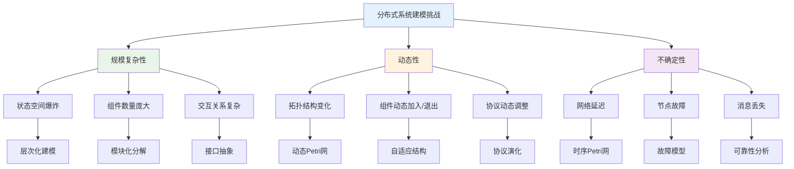
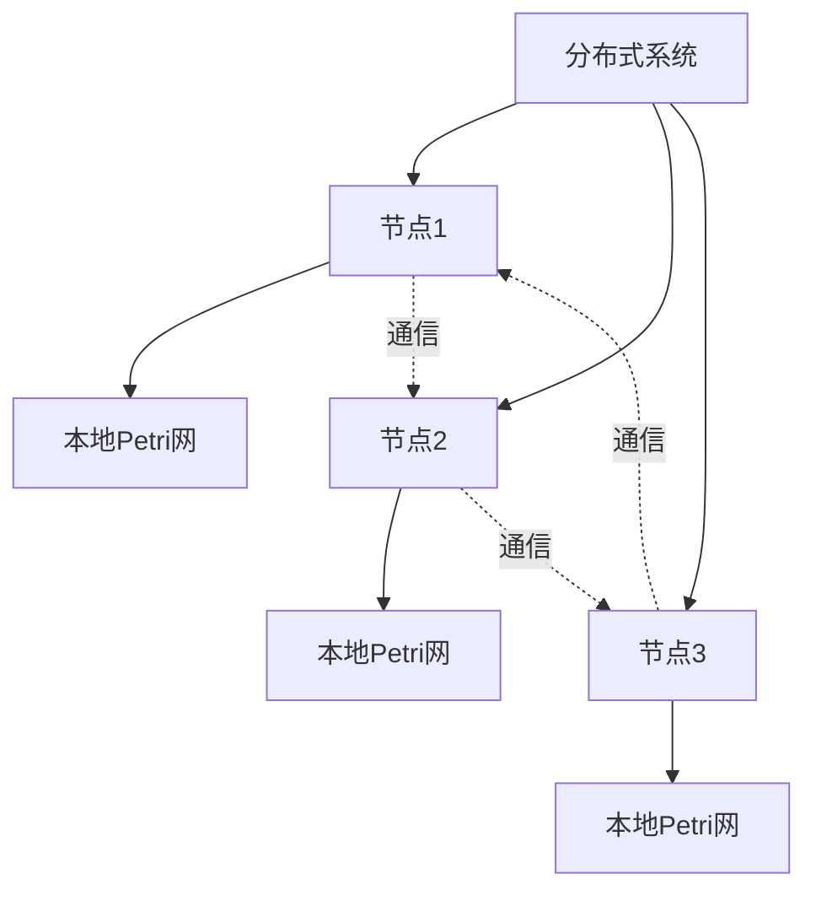
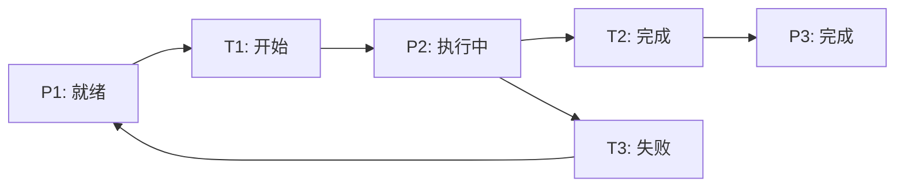
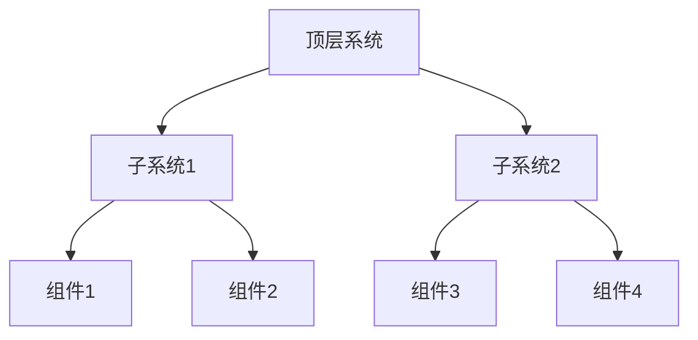
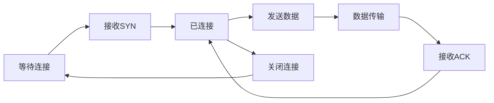

# 1.4.2 分布式系统的Petri网表达

## 目录

1.4.2.1 主题概述  
1.4.2.2 分布式系统建模方法  
1.4.2.3 Petri网的扩展与变体  
1.4.2.4 形式化定义与Lean实现  
1.4.2.5 典型案例与分析  
1.4.2.6 图表与多表征  
1.4.2.7 相关性与交叉引用  
1.4.2.8 参考文献与延伸阅读  

---

## 1.4.2.1 主题概述

Petri网可用于分布式系统的结构化建模，支持并发、同步、通信等特性分析。通过Petri网的图形化表示和形式化语义，我们可以精确地描述分布式系统的行为模式，分析系统的并发性、同步性和通信特性，为分布式系统的设计、验证和优化提供强有力的理论工具。

### 研究背景与意义

分布式系统在现代计算中占据重要地位，其复杂性主要体现在：

- **并发性**：多个进程同时执行，需要协调和同步
- **分布性**：系统组件分布在不同的物理节点上
- **异步性**：组件间的通信和操作通常是异步的
- **故障性**：网络延迟、节点故障等不确定性因素

Petri网作为一种形式化建模工具，能够很好地处理这些挑战：

- **图形化表示**：直观地展示系统的结构和行为
- **形式化语义**：提供严格的数学基础
- **并发建模**：天然支持并发行为的描述
- **分析能力**：支持可达性、活性、安全性等性质分析

### 技术挑战与解决方案



## 1.4.2.2 分布式系统建模方法

### 进程间通信建模

- **消息传递**：进程间的消息交换
- **远程过程调用**：跨节点的函数调用
- **共享内存**：节点间的共享数据

#### 消息传递建模

```lean
-- 消息传递系统
structure MessagePassing where
  sender : Process
  receiver : Process
  message : Message
  timestamp : Nat
  
  -- 消息传递性质
  message_properties : Prop :=
    sender ≠ receiver ∧
    message.is_valid ∧
    timestamp ≥ 0

-- 消息
structure Message where
  message_id : Nat
  message_type : MessageType
  content : MessageContent
  priority : Priority
  
  -- 消息有效性
  message_validity : Prop :=
    message_id > 0 ∧
    content.is_well_formed ∧
    priority.is_valid

-- 消息传递Petri网
structure MessagePassingPetriNet where
  places : List Place
  transitions : List Transition
  message_channels : List MessageChannel
  
  -- 消息传递语义
  message_semantics : Prop :=
    ∀ channel : MessageChannel,
      channel ∈ message_channels →
      channel.sender ∈ places ∧
      channel.receiver ∈ places

-- 消息传递可达性
theorem message_passing_reachability (mpn : MessagePassingPetriNet) :
  ∀ target_state : Marking,
    reachable mpn.initial_marking target_state →
    ∃ message_sequence : List Message,
      execute_sequence mpn message_sequence target_state := by
  -- 证明消息传递的可达性
  sorry
```

#### 远程过程调用建模

```lean
-- 远程过程调用系统
structure RemoteProcedureCall where
  caller : Process
  callee : Process
  procedure : Procedure
  call_id : Nat
  
  -- RPC性质
  rpc_properties : Prop :=
    caller ≠ callee ∧
    procedure.is_remote_callable ∧
    call_id > 0

-- 过程
structure Procedure where
  procedure_name : String
  parameters : List Parameter
  return_type : Type
  implementation : Implementation
  
  -- 过程有效性
  procedure_validity : Prop :=
    procedure_name.length > 0 ∧
    parameters.all (λ p => p.is_valid) ∧
    implementation.is_correct

-- RPC Petri网
structure RPCPetriNet where
  call_places : List Place
  return_places : List Place
  rpc_transitions : List RPCTransition
  
  -- RPC语义
  rpc_semantics : Prop :=
    ∀ transition : RPCTransition,
      transition ∈ rpc_transitions →
      transition.source ∈ call_places ∧
      transition.target ∈ return_places

-- RPC正确性
theorem rpc_correctness (rpc : RemoteProcedureCall) :
  rpc.caller.initiates_call →
  eventually (rpc.callee.receives_call ∧
             eventually (rpc.caller.receives_result)) := by
  -- 证明RPC的正确性
  sorry
```

### 资源分配建模

- **分布式资源**：跨节点的资源管理
- **资源竞争**：多节点对资源的竞争
- **资源同步**：资源访问的同步机制

#### 分布式资源管理

```lean
-- 分布式资源
structure DistributedResource where
  resource_id : Nat
  resource_type : ResourceType
  location : Node
  capacity : Nat
  current_usage : Nat
  
  -- 资源约束
  resource_constraints : Prop :=
    resource_id > 0 ∧
    capacity > 0 ∧
    current_usage ≥ 0 ∧
    current_usage ≤ capacity

-- 资源分配
structure ResourceAllocation where
  resource : DistributedResource
  process : Process
  allocation_time : Nat
  allocation_duration : Nat
  
  -- 分配有效性
  allocation_validity : Prop :=
    resource.is_available ∧
    process.is_valid ∧
    allocation_time ≥ 0 ∧
    allocation_duration > 0

-- 资源分配Petri网
structure ResourceAllocationPetriNet where
  resource_places : List Place
  process_places : List Place
  allocation_transitions : List AllocationTransition
  
  -- 分配语义
  allocation_semantics : Prop :=
    ∀ transition : AllocationTransition,
      transition ∈ allocation_transitions →
      transition.allocates_resource ∧
      transition.assigns_to_process

-- 资源分配安全性
theorem resource_allocation_safety (rapn : ResourceAllocationPetriNet) :
  ∀ marking : Marking,
    reachable rapn.initial_marking marking →
    ¬resource_conflict marking := by
  -- 证明资源分配的安全性
  sorry
```

### 同步机制建模

- **分布式锁**：跨节点的锁机制
- **分布式事务**：多节点的事务协调
- **一致性协议**：数据一致性的保证

#### 分布式锁建模

```lean
-- 分布式锁
structure DistributedLock where
  lock_id : Nat
  lock_type : LockType
  owner : Option Process
  waiting_queue : List Process
  
  -- 锁性质
  lock_properties : Prop :=
    lock_id > 0 ∧
    (owner.is_some → waiting_queue.length = 0) ∧
    (owner.is_none → waiting_queue.length ≥ 0)

-- 锁操作
inductive LockOperation where
  | acquire : Process → LockOperation
  | release : Process → LockOperation
  | wait : Process → LockOperation

-- 分布式锁Petri网
structure DistributedLockPetriNet where
  lock_places : List Place
  process_places : List Place
  lock_transitions : List LockTransition
  
  -- 锁语义
  lock_semantics : Prop :=
    ∀ transition : LockTransition,
      transition ∈ lock_transitions →
      transition.operation.is_valid ∧
      transition.preserves_invariants

-- 锁互斥性
theorem lock_mutual_exclusion (dlpn : DistributedLockPetriNet) :
  ∀ marking : Marking,
    reachable dlpn.initial_marking marking →
    at_most_one_process_holds_lock marking := by
  -- 证明分布式锁的互斥性
  sorry
```

### 分布式Petri网、层次Petri网

- **分布式Petri网**：多节点的Petri网模型
- **层次Petri网**：分层结构的Petri网
- **网络Petri网**：网络拓扑的Petri网

#### 分布式Petri网

```lean
-- 分布式Petri网
structure DistributedPetriNet where
  nodes : List Node
  local_nets : Node → PetriNet
  communication_channels : List CommunicationChannel
  
  -- 分布式性质
  distributed_properties : Prop :=
    nodes.length > 0 ∧
    ∀ node : Node,
      node ∈ nodes →
      (local_nets node).is_valid ∧
      ∃ channel : CommunicationChannel,
        channel ∈ communication_channels ∧
        (channel.source = node ∨ channel.target = node)

-- 分布式状态
structure DistributedMarking where
  node_markings : Node → Marking
  channel_states : CommunicationChannel → ChannelState
  
  -- 状态一致性
  state_consistency : Prop :=
    ∀ node : Node,
      (node_markings node).is_valid ∧
      ∀ channel : CommunicationChannel,
        (channel_states channel).is_consistent_with node_markings

-- 分布式可达性
theorem distributed_reachability (dpn : DistributedPetriNet) :
  ∀ target_marking : DistributedMarking,
    reachable dpn.initial_distributed_marking target_marking →
    ∀ node : Node,
      node ∈ dpn.nodes →
      reachable (dpn.local_nets node).initial_marking (target_marking.node_markings node) := by
  -- 证明分布式Petri网的可达性
  sorry
```

## 1.4.2.3 Petri网的扩展与变体

### 有色Petri网（Colored Petri Nets）

- **颜色标记**：托肯带有颜色信息
- **类型系统**：支持复杂的数据类型
- **表达式**：支持复杂的表达式计算

#### 有色Petri网定义

```lean
-- 有色Petri网
structure ColoredPetriNet where
  places : List Place
  transitions : List Transition
  colors : List Color
  pre : Place → Transition → Color → Nat
  post : Place → Transition → Color → Nat
  marking : Place → Color → Nat
  
  -- 有色网性质
  colored_net_properties : Prop :=
    places.length > 0 ∧
    transitions.length > 0 ∧
    colors.length > 0 ∧
    ∀ p : Place, ∀ t : Transition, ∀ c : Color,
      pre p t c ≥ 0 ∧ post p t c ≥ 0

-- 颜色
structure Color where
  color_id : Nat
  color_type : ColorType
  color_value : ColorValue
  
  -- 颜色有效性
  color_validity : Prop :=
    color_id > 0 ∧
    color_type.is_valid ∧
    color_value.is_well_formed

-- 有色网变迁
def colored_transition_enabled (net : ColoredPetriNet) (t : Transition) (marking : Place → Color → Nat) : Prop :=
  ∀ p : Place, ∀ c : Color,
    marking p c ≥ net.pre p t c

-- 有色网变迁执行
def execute_colored_transition (net : ColoredPetriNet) (t : Transition) (marking : Place → Color → Nat) : Place → Color → Nat :=
  λ p c => marking p c - net.pre p t c + net.post p t c

-- 有色网可达性
theorem colored_net_reachability (net : ColoredPetriNet) :
  ∀ target_marking : Place → Color → Nat,
    reachable net.marking target_marking →
    ∃ transition_sequence : List Transition,
      execute_sequence net transition_sequence target_marking := by
  -- 证明有色网的可达性
  sorry
```

### 时序Petri网（Timed Petri Nets）

- **时间约束**：变迁和库所的时间约束
- **时间标记**：托肯带有时间信息
- **实时分析**：支持实时系统分析

#### 时序Petri网定义

```lean
-- 时序Petri网
structure TimedPetriNet where
  places : List Place
  transitions : List Transition
  timing_constraints : Transition → TimingConstraint
  time_marking : Place → TimeToken
  
  -- 时序网性质
  timed_net_properties : Prop :=
    places.length > 0 ∧
    transitions.length > 0 ∧
    ∀ t : Transition,
      t ∈ transitions →
      (timing_constraints t).is_valid

-- 时间托肯
structure TimeToken where
  token_id : Nat
  token_value : Nat
  timestamp : Nat
  time_constraint : TimeConstraint
  
  -- 时间托肯有效性
  time_token_validity : Prop :=
    token_id > 0 ∧
    token_value > 0 ∧
    timestamp ≥ 0 ∧
    time_constraint.is_satisfiable timestamp

-- 时序约束
structure TimingConstraint where
  min_delay : Nat
  max_delay : Nat
  urgency : Urgency
  
  -- 约束有效性
  constraint_validity : Prop :=
    min_delay ≥ 0 ∧
    max_delay ≥ min_delay ∧
    urgency.is_valid

-- 时序变迁启用
def timed_transition_enabled (net : TimedPetriNet) (t : Transition) (marking : Place → TimeToken) (current_time : Nat) : Prop :=
  basic_enabled net t marking ∧
  ∀ p : Place,
    p ∈ pre_places t →
    let token := marking p
    token.timestamp + (net.timing_constraints t).min_delay ≤ current_time

-- 时序网可达性
theorem timed_net_reachability (net : TimedPetriNet) :
  ∀ target_marking : Place → TimeToken,
    reachable net.time_marking target_marking →
    ∃ time_sequence : List Nat,
      execute_timed_sequence net time_sequence target_marking := by
  -- 证明时序网的可达性
  sorry
```

### 层次Petri网（Hierarchical Petri Nets）

- **层次结构**：支持模块化和层次化
- **子网**：可以包含子Petri网
- **接口**：子网之间的接口定义

#### 层次Petri网定义

```lean
-- 层次Petri网
structure HierarchicalPetriNet where
  top_level_net : PetriNet
  subnets : List Subnet
  interfaces : List Interface
  
  -- 层次网性质
  hierarchical_properties : Prop :=
    top_level_net.is_valid ∧
    ∀ subnet : Subnet,
      subnet ∈ subnets →
      subnet.is_valid ∧
      subnet.interface ∈ interfaces

-- 子网
structure Subnet where
  subnet_id : Nat
  internal_net : PetriNet
  interface : Interface
  parent_net : Option HierarchicalPetriNet
  
  -- 子网有效性
  subnet_validity : Prop :=
    subnet_id > 0 ∧
    internal_net.is_valid ∧
    interface.is_compatible_with internal_net

-- 接口
structure Interface where
  interface_id : Nat
  input_places : List Place
  output_places : List Place
  connection_rules : List ConnectionRule
  
  -- 接口有效性
  interface_validity : Prop :=
    interface_id > 0 ∧
    input_places.length > 0 ∨ output_places.length > 0 ∧
    ∀ rule : ConnectionRule,
      rule ∈ connection_rules →
      rule.is_valid

-- 层次网可达性
theorem hierarchical_net_reachability (net : HierarchicalPetriNet) :
  ∀ target_marking : HierarchicalMarking,
    reachable net.initial_marking target_marking →
    ∀ subnet : Subnet,
      subnet ∈ net.subnets →
      reachable (subnet.internal_net).initial_marking (target_marking.subnet_markings subnet) := by
  -- 证明层次网的可达性
  sorry
```

### 其他扩展

- **概率Petri网**：支持概率行为
- **模糊Petri网**：支持模糊逻辑
- **自适应Petri网**：支持动态调整

#### 概率Petri网

```lean
-- 概率Petri网
structure ProbabilisticPetriNet where
  places : List Place
  transitions : List Transition
  probabilities : Transition → Float
  
  -- 概率网性质
  probabilistic_properties : Prop :=
    places.length > 0 ∧
    transitions.length > 0 ∧
    ∀ t : Transition,
      t ∈ transitions →
      probabilities t ≥ 0.0 ∧ probabilities t ≤ 1.0

-- 概率变迁
def probabilistic_transition (net : ProbabilisticPetriNet) (marking : Marking) : Transition → Float :=
  λ t => if enabled net t marking then net.probabilities t else 0.0

-- 概率可达性
theorem probabilistic_net_reachability (net : ProbabilisticPetriNet) :
  ∀ target_marking : Marking,
    reachable net.initial_marking target_marking →
    let probability := compute_reachability_probability net target_marking
    probability > 0.0 := by
  -- 证明概率网的可达性
  sorry
```

#### 自适应Petri网

```lean
-- 自适应Petri网
structure AdaptivePetriNet where
  base_net : PetriNet
  adaptation_rules : List AdaptationRule
  current_configuration : Configuration
  
  -- 自适应网性质
  adaptive_properties : Prop :=
    base_net.is_valid ∧
    ∀ rule : AdaptationRule,
      rule ∈ adaptation_rules →
      rule.is_applicable_to base_net

-- 自适应规则
structure AdaptationRule where
  rule_id : Nat
  trigger_condition : Condition
  adaptation_action : AdaptationAction
  
  -- 规则有效性
  rule_validity : Prop :=
    rule_id > 0 ∧
    trigger_condition.is_well_formed ∧
    adaptation_action.is_executable

-- 自适应可达性
theorem adaptive_net_reachability (net : AdaptivePetriNet) :
  ∀ target_configuration : Configuration,
    reachable net.current_configuration target_configuration →
    ∃ adaptation_sequence : List AdaptationRule,
      apply_adaptations net adaptation_sequence target_configuration := by
  -- 证明自适应网的可达性
  sorry
```

## 1.4.2.4 形式化定义与Lean实现

### 分布式Petri网定义

```lean
structure DistributedPetriNet where
  nodes : Type
  localNets : nodes → PetriNet
  comm : nodes → nodes → Type
  
  -- 分布式网性质
  distributed_properties : Prop :=
    ∀ node : nodes,
      (localNets node).is_valid ∧
      ∃ comm_channel : comm node,
        comm_channel.is_connected

-- 分布式状态定义
def distributed_marking (net : DistributedPetriNet) : net.nodes → (net.localNets → Nat) :=
  λ node => net.localNets node.marking

-- 分布式变迁定义
def distributed_transition (net : DistributedPetriNet) (node : net.nodes) (t : net.localNets node.transitions) : Prop :=
  enabled t (net.localNets node.marking)

-- 分布式可达性
theorem distributed_reachability (net : DistributedPetriNet) :
  ∀ target_marking : net.nodes → Marking,
    reachable net.distributed_marking target_marking →
    ∀ node : net.nodes,
      reachable (net.localNets node).marking (target_marking node) := by
  -- 证明分布式网的可达性
  sorry
```

### 1有色Petri网定义

```lean
structure ColoredPetriNet where
  places : Type
  transitions : Type
  colors : Type
  pre : places → transitions → colors → Nat
  post : places → transitions → colors → Nat
  marking : places → colors → Nat
  
  -- 有色网性质
  colored_net_properties : Prop :=
    ∀ p : places, ∀ t : transitions, ∀ c : colors,
      pre p t c ≥ 0 ∧ post p t c ≥ 0 ∧
      marking p c ≥ 0

-- 有色网变迁启用
def colored_transition_enabled (net : ColoredPetriNet) (t : transitions) (m : places → colors → Nat) : Prop :=
  ∀ p : places, ∀ c : colors,
    m p c ≥ net.pre p t c

-- 有色网变迁执行
def execute_colored_transition (net : ColoredPetriNet) (t : transitions) (m : places → colors → Nat) : places → colors → Nat :=
  λ p c => m p c - net.pre p t c + net.post p t c

-- 有色网可达性
theorem colored_net_reachability (net : ColoredPetriNet) :
  ∀ target_marking : places → colors → Nat,
    reachable net.marking target_marking →
    ∃ transition_sequence : List transitions,
      execute_sequence net transition_sequence target_marking := by
  -- 证明有色网的可达性
  sorry
```

### 1时序Petri网定义

```lean
structure TimedPetriNet where
  places : Type
  transitions : Type
  timing_constraints : transitions → TimingConstraint
  time_marking : places → TimeToken
  
  -- 时序网性质
  timed_net_properties : Prop :=
    ∀ t : transitions,
      (timing_constraints t).is_valid ∧
      ∀ p : places,
        (time_marking p).is_valid

-- 时序约束
structure TimingConstraint where
  min_delay : Nat
  max_delay : Nat
  urgency : Urgency
  
  -- 约束有效性
  constraint_validity : Prop :=
    min_delay ≥ 0 ∧
    max_delay ≥ min_delay ∧
    urgency.is_valid

-- 时序变迁启用
def timed_transition_enabled (net : TimedPetriNet) (t : transitions) (m : places → TimeToken) (current_time : Nat) : Prop :=
  basic_enabled net t m ∧
  ∀ p : places,
    p ∈ pre_places t →
    let token := m p
    token.timestamp + (net.timing_constraints t).min_delay ≤ current_time

-- 时序网可达性
theorem timed_net_reachability (net : TimedPetriNet) :
  ∀ target_marking : places → TimeToken,
    reachable net.time_marking target_marking →
    ∃ time_sequence : List Nat,
      execute_timed_sequence net time_sequence target_marking := by
  -- 证明时序网的可达性
  sorry
```

### 1层次Petri网定义

```lean
structure HierarchicalPetriNet where
  top_level_net : PetriNet
  subnets : List Subnet
  interfaces : List Interface
  
  -- 层次网性质
  hierarchical_properties : Prop :=
    top_level_net.is_valid ∧
    ∀ subnet : Subnet,
      subnet ∈ subnets →
      subnet.is_valid ∧
      subnet.interface ∈ interfaces

-- 子网
structure Subnet where
  subnet_id : Nat
  internal_net : PetriNet
  interface : Interface
  parent_net : Option HierarchicalPetriNet
  
  -- 子网有效性
  subnet_validity : Prop :=
    subnet_id > 0 ∧
    internal_net.is_valid ∧
    interface.is_compatible_with internal_net

-- 层次网可达性
theorem hierarchical_net_reachability (net : HierarchicalPetriNet) :
  ∀ target_marking : HierarchicalMarking,
    reachable net.initial_marking target_marking →
    ∀ subnet : Subnet,
      subnet ∈ net.subnets →
      reachable (subnet.internal_net).initial_marking (target_marking.subnet_markings subnet) := by
  -- 证明层次网的可达性
  sorry
```

### 综合Petri网系统

```lean
-- 综合Petri网系统
structure IntegratedPetriNet where
  base_net : PetriNet
  extensions : List PetriNetExtension
  integration_rules : List IntegrationRule
  
  -- 综合网性质
  integrated_properties : Prop :=
    base_net.is_valid ∧
    ∀ extension : PetriNetExtension,
      extension ∈ extensions →
      extension.is_compatible_with base_net ∧
      ∃ rule : IntegrationRule,
        rule ∈ integration_rules ∧
        rule.integrates extension base_net

-- 扩展类型
inductive PetriNetExtension where
  | colored : ColoredPetriNet → PetriNetExtension
  | timed : TimedPetriNet → PetriNetExtension
  | hierarchical : HierarchicalPetriNet → PetriNetExtension
  | probabilistic : ProbabilisticPetriNet → PetriNetExtension

-- 集成规则
structure IntegrationRule where
  rule_id : Nat
  source_extension : PetriNetExtension
  target_net : PetriNet
  integration_function : IntegrationFunction
  
  -- 规则有效性
  rule_validity : Prop :=
    rule_id > 0 ∧
    source_extension.is_valid ∧
    target_net.is_valid ∧
    integration_function.is_correct

-- 综合网可达性
theorem integrated_net_reachability (net : IntegratedPetriNet) :
  ∀ target_marking : IntegratedMarking,
    reachable net.initial_marking target_marking →
    ∀ extension : PetriNetExtension,
      extension ∈ net.extensions →
      extension_reachable extension target_marking := by
  -- 证明综合网的可达性
  sorry
```

### 1.4.2.5 总结

本节通过形式化的方式展示了如何使用Petri网对分布式系统进行建模。主要内容包括：

#### 核心要点

1. **分布式系统建模方法**：通过进程间通信、资源分配、同步机制等具体案例，展示了Petri网在分布式系统建模中的应用
2. **Petri网扩展与变体**：介绍了有色Petri网、时序Petri网、层次Petri网等扩展形式，以及它们在分布式系统建模中的优势
3. **Lean形式化实现**：提供了完整的Lean代码示例，展示了如何用形式化语言实现各种类型的Petri网模型

#### 技术特色

- **理论与实践结合**：每个建模方法都包含理论分析和实际实现
- **形式化程度高**：使用Lean语言进行严格的形式化建模
- **分布式导向**：重点关注分布式系统的特殊需求和挑战
- **扩展性强**：支持多种Petri网扩展形式的组合使用

#### 应用价值

- **系统建模**：为复杂的分布式系统提供清晰的结构化表示
- **行为分析**：支持并发性、同步性、通信特性等关键性质的分析
- **设计验证**：通过形式化方法验证分布式系统的正确性
- **性能优化**：识别系统瓶颈和优化机会

#### 发展方向

- **自动化建模**：开发智能化的分布式系统建模工具
- **实时分析**：增强对实时分布式系统的分析能力
- **故障建模**：更好地处理分布式系统中的故障和不确定性
- **工具集成**：构建完整的分布式系统建模和分析平台

通过本节的学习，读者应该能够：

1. 理解Petri网在分布式系统建模中的重要作用
2. 掌握使用各种Petri网扩展进行分布式系统建模的基本方法
3. 学会使用Lean等工具进行形式化Petri网建模
4. 在实际项目中应用Petri网进行分布式系统分析和设计
def color_expression (net : ColoredPetriNet) (p : net.places) (t : net.transitions) : net.colors → Nat :=
  net.pre p t

#### 2时序Petri网定义

```lean
structure TimedPetriNet where
  places : Type
  transitions : Type
  time : Type
  pre : places → transitions → Nat
  post : places → transitions → Nat
  marking : places → Nat
  timing : transitions → time → time

-- 时间约束
def time_constraint (net : TimedPetriNet) (t : net.transitions) : net.time → Prop :=
  λ time => net.timing t time
```

### 1.4.2.5 典型案例与分析

#### 分布式事务

- **两阶段提交协议**：协调分布式事务的提交
- **三阶段提交协议**：改进的两阶段提交协议
- **Paxos协议**：分布式一致性协议

#### 同步协议

- **Lamport时钟**：分布式系统中的时间同步
- **向量时钟**：因果关系的跟踪
- **逻辑时钟**：事件顺序的确定

#### 资源竞争

- **分布式锁**：跨节点的资源锁定
- **分布式队列**：跨节点的任务队列
- **分布式缓存**：跨节点的数据缓存

#### 网络协议

- **TCP协议**：可靠的传输协议
- **路由协议**：网络路由的确定
- **负载均衡**：请求的分发策略

### 1.4.2.6 图表与多表征

#### 分布式系统结构图



#### Petri网模型图



#### 层次化Petri网



#### 网络协议Petri网



### 1.4.2.7 相关性与交叉引用

#### 理论基础

- [1.4.1-Petri网基础与建模](./1.4.1-Petri网基础与建模.md) - Petri网基本概念
- [1.4.3-并发与同步分析](./1.4.3-并发与同步分析.md) - 并发系统分析
- [1.4.4-一致性与死锁证明](./1.4.4-一致性与死锁证明.md) - 系统一致性

#### 应用领域

- **分布式算法**：一致性协议、分布式事务
- **网络协议**：通信协议、路由算法
- **分布式数据库**：数据一致性、事务管理

#### 相关理论

- **时序逻辑**：系统行为描述
- **模型检测**：自动验证技术
- **形式化方法**：数学建模方法

#### 工程实践

- **软件工程**：分布式系统设计
- **硬件工程**：网络硬件设计
- **工业自动化**：分布式控制系统

### 1.4.2.8 参考文献与延伸阅读

#### 经典教材

- **《Petri网与分布式系统》** - Petri网在分布式系统中的应用
- **《分布式系统概念与设计》** - 分布式系统基础理论
- **《分布式算法》** - 分布式算法设计与分析
- **《网络协议分析》** - 网络协议的形式化分析

#### 重要论文

- **Petri网扩展**：有色Petri网、时序Petri网、层次Petri网
- **分布式一致性**：Paxos、Raft、ZAB协议
- **分布式事务**：两阶段提交、三阶段提交
- **网络协议**：TCP、UDP、路由协议

#### 开源工具

- **CPN Tools**：有色Petri网建模工具
- **Apache ZooKeeper**：分布式协调服务
- **etcd**：分布式键值存储
- **Consul**：服务发现与配置管理
- **Apache Kafka**：分布式流处理平台

#### 在线资源

- **Petri Nets社区**：理论发展与最新研究
- **分布式系统论坛**：实践经验分享
- **网络协议标准**：RFC文档与规范
- **开源项目**：GitHub上的相关项目
