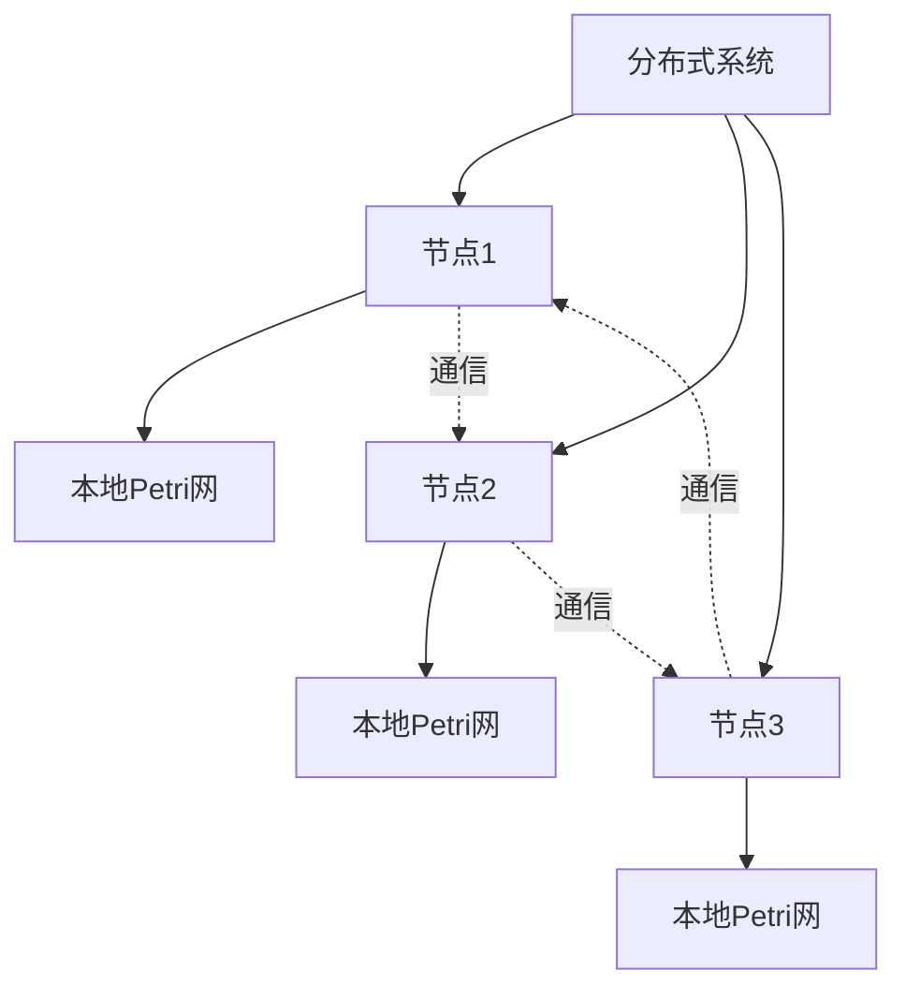
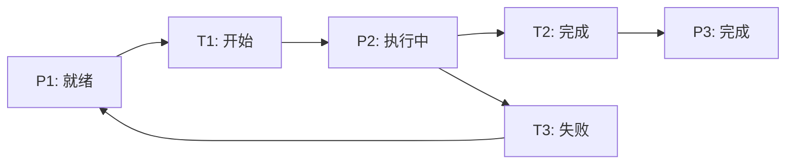
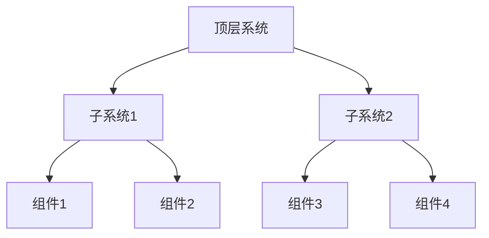
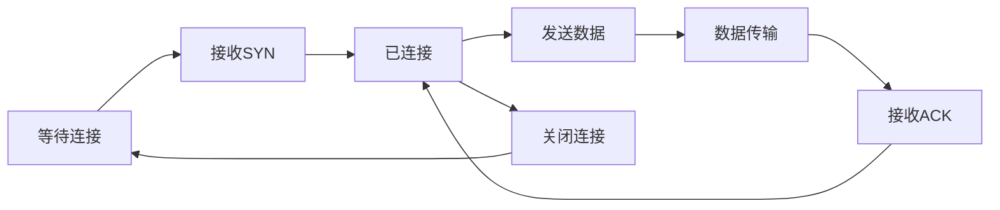

# 1.4.2 分布式系统的Petri网表达

## 目录

1.4.2.1 主题概述  
1.4.2.2 分布式系统建模方法  
1.4.2.3 Petri网的扩展与变体  
1.4.2.4 形式化定义与Lean实现  
1.4.2.5 典型案例与分析  
1.4.2.6 图表与多表征  
1.4.2.7 相关性与交叉引用  
1.4.2.8 参考文献与延伸阅读  

---

### 1.4.2.1 主题概述

Petri网可用于分布式系统的结构化建模，支持并发、同步、通信等特性分析。

### 1.4.2.2 分布式系统建模方法

#### 进程间通信建模

- **消息传递**：进程间的消息交换
- **远程过程调用**：跨节点的函数调用
- **共享内存**：节点间的共享数据

#### 资源分配建模

- **分布式资源**：跨节点的资源管理
- **资源竞争**：多节点对资源的竞争
- **资源同步**：资源访问的同步机制

#### 同步机制建模

- **分布式锁**：跨节点的锁机制
- **分布式事务**：多节点的事务协调
- **一致性协议**：数据一致性的保证

#### 分布式Petri网、层次Petri网

- **分布式Petri网**：多节点的Petri网模型
- **层次Petri网**：分层结构的Petri网
- **网络Petri网**：网络拓扑的Petri网

### 1.4.2.3 Petri网的扩展与变体

#### 有色Petri网（Colored Petri Nets）

- **颜色标记**：托肯带有颜色信息
- **类型系统**：支持复杂的数据类型
- **表达式**：支持复杂的表达式计算

#### 时序Petri网（Timed Petri Nets）

- **时间约束**：变迁和库所的时间约束
- **时间标记**：托肯带有时间信息
- **实时分析**：支持实时系统分析

#### 层次Petri网（Hierarchical Petri Nets）

- **层次结构**：支持模块化和层次化
- **子网**：可以包含子Petri网
- **接口**：子网之间的接口定义

#### 其他扩展

- **概率Petri网**：支持概率行为
- **模糊Petri网**：支持模糊逻辑
- **自适应Petri网**：支持动态调整

### 1.4.2.4 形式化定义与Lean实现

#### 分布式Petri网定义

```lean
structure DistributedPetriNet where
  nodes : Type
  localNets : nodes → PetriNet
  comm : nodes → nodes → Type

-- 分布式状态定义
def distributed_marking (net : DistributedPetriNet) : net.nodes → (net.localNets → Nat) :=
  λ node => net.localNets node.marking

-- 分布式变迁定义
def distributed_transition (net : DistributedPetriNet) (node : net.nodes) (t : net.localNets node.transitions) : Prop :=
  enabled t (net.localNets node.marking)
```

#### 有色Petri网定义

```lean
structure ColoredPetriNet where
  places : Type
  transitions : Type
  colors : Type
  pre : places → transitions → colors → Nat
  post : places → transitions → colors → Nat
  marking : places → colors → Nat

-- 颜色表达式
def color_expression (net : ColoredPetriNet) (p : net.places) (t : net.transitions) : net.colors → Nat :=
  net.pre p t
```

#### 时序Petri网定义

```lean
structure TimedPetriNet where
  places : Type
  transitions : Type
  time : Type
  pre : places → transitions → Nat
  post : places → transitions → Nat
  marking : places → Nat
  timing : transitions → time → time

-- 时间约束
def time_constraint (net : TimedPetriNet) (t : net.transitions) : net.time → Prop :=
  λ time => net.timing t time
```

### 1.4.2.5 典型案例与分析

#### 分布式事务

- **两阶段提交协议**：协调分布式事务的提交
- **三阶段提交协议**：改进的两阶段提交协议
- **Paxos协议**：分布式一致性协议

#### 同步协议

- **Lamport时钟**：分布式系统中的时间同步
- **向量时钟**：因果关系的跟踪
- **逻辑时钟**：事件顺序的确定

#### 资源竞争

- **分布式锁**：跨节点的资源锁定
- **分布式队列**：跨节点的任务队列
- **分布式缓存**：跨节点的数据缓存

#### 网络协议

- **TCP协议**：可靠的传输协议
- **路由协议**：网络路由的确定
- **负载均衡**：请求的分发策略

### 1.4.2.6 图表与多表征

#### 分布式系统结构图



#### Petri网模型图



#### 层次化Petri网



#### 网络协议Petri网



### 1.4.2.7 相关性与交叉引用

#### 理论基础

- [1.4.1-Petri网基础与建模](./1.4.1-Petri网基础与建模.md) - Petri网基本概念
- [1.4.3-并发与同步分析](./1.4.3-并发与同步分析.md) - 并发系统分析
- [1.4.4-一致性与死锁证明](./1.4.4-一致性与死锁证明.md) - 系统一致性

#### 应用领域

- **分布式算法**：一致性协议、分布式事务
- **网络协议**：通信协议、路由算法
- **分布式数据库**：数据一致性、事务管理

#### 相关理论

- **时序逻辑**：系统行为描述
- **模型检测**：自动验证技术
- **形式化方法**：数学建模方法

#### 工程实践

- **软件工程**：分布式系统设计
- **硬件工程**：网络硬件设计
- **工业自动化**：分布式控制系统

### 1.4.2.8 参考文献与延伸阅读

#### 经典教材

- **《Petri网与分布式系统》** - Petri网在分布式系统中的应用
- **《分布式系统概念与设计》** - 分布式系统基础理论
- **《分布式算法》** - 分布式算法设计与分析
- **《网络协议分析》** - 网络协议的形式化分析

#### 重要论文

- **Petri网扩展**：有色Petri网、时序Petri网、层次Petri网
- **分布式一致性**：Paxos、Raft、ZAB协议
- **分布式事务**：两阶段提交、三阶段提交
- **网络协议**：TCP、UDP、路由协议

#### 开源工具

- **CPN Tools**：有色Petri网建模工具
- **Apache ZooKeeper**：分布式协调服务
- **etcd**：分布式键值存储
- **Consul**：服务发现与配置管理
- **Apache Kafka**：分布式流处理平台

#### 在线资源

- **Petri Nets社区**：理论发展与最新研究
- **分布式系统论坛**：实践经验分享
- **网络协议标准**：RFC文档与规范
- **开源项目**：GitHub上的相关项目
