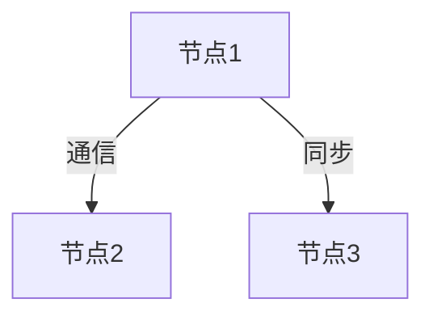

# 1.4.2 分布式系统的Petri网表达

## 目录

1.4.2.1 主题概述  
1.4.2.2 分布式系统建模方法  
1.4.2.3 Petri网的扩展与变体  
1.4.2.4 形式化定义与Lean实现  
1.4.2.5 典型案例与分析  
1.4.2.6 图表与多表征  
1.4.2.7 相关性与交叉引用  
1.4.2.8 参考文献与延伸阅读  

---

### 1.4.2.1 主题概述

Petri网可用于分布式系统的结构化建模，支持并发、同步、通信等特性分析。

### 1.4.2.2 分布式系统建模方法

- 进程间通信、资源分配、同步机制
- 分布式Petri网、层次Petri网

### 1.4.2.3 Petri网的扩展与变体

- 有色Petri网、时序Petri网、层次Petri网

### 1.4.2.4 形式化定义与Lean实现

```lean
structure DistributedPetriNet :=
  (nodes : Type)
  (localNets : nodes → PetriNet)
  (comm : nodes → nodes → Type)
```

### 1.4.2.5 典型案例与分析

- 分布式事务、同步协议、资源竞争

### 1.4.2.6 图表与多表征



### 1.4.2.7 相关性与交叉引用

- [1.4.1-Petri网基础与建模](./1.4.1-Petri网基础与建模.md)
- [1.4.3-并发与同步分析](./1.4.3-并发与同步分析.md)

### 1.4.2.8 参考文献与延伸阅读

- 《Petri网与分布式系统》
- 相关论文与开源项目
