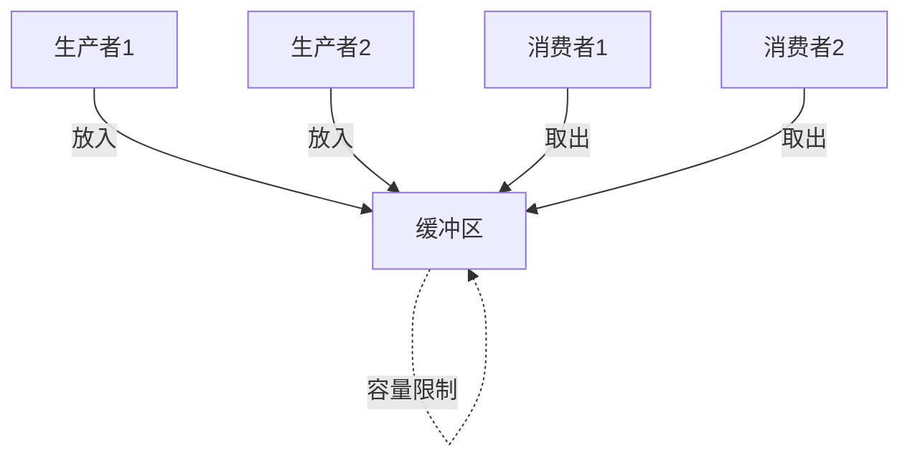
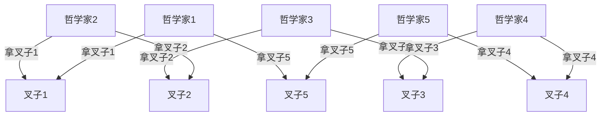
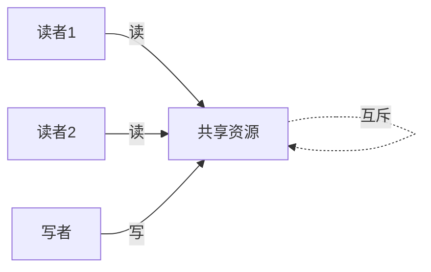
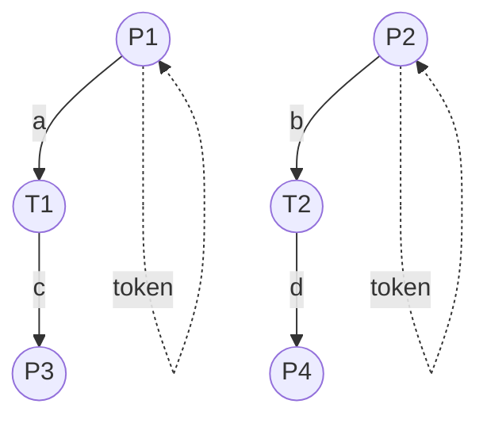

# 1.4.3 并发与同步分析

## 目录

1.4.3.1 主题概述  
1.4.3.2 并发建模方法  
1.4.3.3 同步机制与Petri网  
1.4.3.4 Petri网分析方法  
1.4.3.5 形式化定义与Lean实现  
1.4.3.6 典型案例与推理  
1.4.3.7 图表与多表征  
1.4.3.8 相关性与交叉引用  
1.4.3.9 参考文献与延伸阅读  

---

### 1.4.3.1 主题概述

Petri网是并发与同步分析的经典工具，能够直观建模和分析系统中的并发行为与同步约束。

### 1.4.3.2 并发建模方法

#### 并发进程建模

- **进程间通信**：进程之间的消息传递
- **进程同步**：进程之间的协调机制
- **进程竞争**：进程对资源的竞争

#### 资源竞争建模

- **资源分配**：资源的分配和释放
- **资源冲突**：多进程对同一资源的访问
- **资源死锁**：资源分配导致的死锁

#### 互斥与同步建模

- **互斥访问**：确保资源互斥访问
- **同步机制**：进程间的同步操作
- **条件同步**：基于条件的同步

#### Petri网的并发性表达

- **并发变迁**：可以同时发生的变迁
- **并发库所**：可以同时包含托肯的库所
- **并发行为**：系统的并发执行行为

### 1.4.3.3 同步机制与Petri网

#### 信号量机制

- **二元信号量**：互斥访问控制
- **计数信号量**：资源数量控制
- **信号量操作**：P操作和V操作

#### 互斥锁机制

- **互斥锁**：确保临界区互斥访问
- **读写锁**：区分读操作和写操作
- **自旋锁**：忙等待的锁机制

#### 条件同步机制

- **条件变量**：基于条件的同步
- **屏障同步**：多进程的同步点
- **事件同步**：基于事件的同步

#### Petri网中同步结构的建模

- **同步变迁**：需要多个输入库所的变迁
- **同步库所**：多个变迁的同步点
- **同步约束**：系统同步行为的约束

### 1.4.3.4 Petri网分析方法

#### 可达性图分析

- **状态空间构建**：构建系统的可达状态空间
- **状态转换分析**：分析状态之间的转换关系
- **状态可达性**：判断状态是否可达

#### 活性分析

- **活性定义**：系统能够无限执行的性质
- **活性检测**：检测系统是否具有活性
- **活性保证**：确保系统具有活性

#### 死锁检测

- **死锁状态识别**：识别无法继续执行的状态
- **死锁路径分析**：分析导致死锁的执行路径
- **死锁预防**：预防死锁的发生

#### 性能分析

- **吞吐量分析**：分析系统的处理能力
- **响应时间分析**：分析系统的响应性能
- **资源利用率分析**：分析资源的使用效率

### 1.4.3.5 形式化定义与Lean实现

#### 并发Petri网定义

```lean
-- 并发Petri网的Lean建模
structure ConcurrentPetriNet where
  places : Type
  transitions : Type
  pre : places → transitions → Nat
  post : places → transitions → Nat
  marking : places → Nat

-- 并发变迁定义
def concurrent_transitions (net : ConcurrentPetriNet) (t1 t2 : net.transitions) : Prop :=
  enabled t1 net.marking ∧ enabled t2 net.marking ∧ independent t1 t2

-- 同步变迁定义
def sync_transition (net : ConcurrentPetriNet) (t : net.transitions) : Prop :=
  ∃ p1 p2 : net.places, net.pre p1 t > 0 ∧ net.pre p2 t > 0
```

#### 同步机制建模

```lean
-- 信号量建模
structure Semaphore where
  value : Nat
  waiting : List Process
  operations : List SemaphoreOp

-- 互斥锁建模
structure Mutex where
  locked : Bool
  owner : Option Process
  waiting : List Process

-- 条件变量建模
structure ConditionVariable where
  waiting : List Process
  signal_count : Nat
  broadcast_count : Nat
```

#### 并发分析算法

```lean
-- 可达性分析
def reachability_analysis (net : ConcurrentPetriNet) : List (net.places → Nat) :=
  let initial := net.marking
  let reachable := [initial]
  -- 分析过程
  reachable

-- 死锁检测
def deadlock_detection (net : ConcurrentPetriNet) (m : net.places → Nat) : Bool :=
  ∀ t : net.transitions, ¬ enabled t m

-- 活性分析
def liveness_analysis (net : ConcurrentPetriNet) : Bool :=
  ∀ m : net.places → Nat, reachable m → ∃ t : net.transitions, enabled t m
```

### 1.4.3.6 典型案例与推理

#### 生产者-消费者问题

- **问题描述**：生产者向缓冲区放入数据，消费者从缓冲区取出数据
- **同步要求**：缓冲区满时生产者等待，缓冲区空时消费者等待
- **Petri网建模**：使用库所表示缓冲区状态，变迁表示生产和消费操作

#### 哲学家进餐问题

- **问题描述**：五个哲学家围坐在圆桌旁，每人需要两把叉子才能进餐
- **死锁问题**：所有哲学家同时拿起左叉子，等待右叉子
- **Petri网建模**：使用库所表示叉子状态，变迁表示拿叉子和放叉子操作

#### 读者-写者问题

- **问题描述**：多个读者可以同时读，但写者必须独占资源
- **同步要求**：读者和写者之间的互斥和同步
- **Petri网建模**：使用库所表示资源状态，变迁表示读写操作

#### 理发师问题

- **问题描述**：理发师为顾客理发，顾客在等待区等待
- **同步要求**：理发师和顾客之间的协调
- **Petri网建模**：使用库所表示理发师和顾客状态，变迁表示理发操作

### 1.4.3.7 图表与多表征

#### 生产者-消费者模型



#### 哲学家就餐问题



#### 读者-写者模型



#### 并发Petri网结构



### 1.4.3.8 相关性与交叉引用

#### 理论基础

- [1.4.1-Petri网基础与建模](./1.4.1-Petri网基础与建模.md) - Petri网的基本概念和建模方法
- [1.4.2-分布式系统的Petri网表达](./1.4.2-分布式系统的Petri网表达.md) - 分布式系统的Petri网建模
- [1.4.3-并发与同步分析](./1.4.3-并发与同步分析.md) - 并发系统的Petri网分析

#### 应用领域

- [1.4.4-一致性与死锁证明](./1.4.4-一致性与死锁证明.md) - 系统一致性和死锁的Petri网证明
- [1.4.5-典型工程案例](./1.4.5-典型工程案例.md) - Petri网在实际工程中的应用案例

#### 相关理论

- [1.3-时序逻辑与控制](../1.3-时序逻辑与控制/1.3-时序逻辑与控制.md) - 时序逻辑与Petri网的结合
- [1.2-类型理论与证明](../1.2-类型理论与证明.md) - 类型论与证明论基础

#### 工程实践

- [7.2-工程实践案例](../../7-验证与工程实践/7.2-工程实践案例.md) - 形式化验证的工程实践
- [7.1-形式化验证架构](../../7-验证与工程实践/7.1-形式化验证架构.md) - 形式化验证的整体架构

#### 并发系统理论

- **进程代数**：CCS、CSP、π-演算等进程代数理论
- **并发逻辑**：并发Hoare逻辑、分离逻辑
- **模型检测**：SPIN、NuSMV等模型检测工具

#### 同步机制理论

- **信号量理论**：Dijkstra信号量理论
- **管程理论**：Hoare管程理论
- **消息传递**：CSP消息传递理论

### 1.4.3.9 参考文献与延伸阅读

#### 核心教材

- **《Petri网与分布式系统》** - Petri网在分布式系统中的应用
- **《Petri Nets: Properties, Analysis and Applications》** - Petri网的性质、分析与应用
- **《Modeling and Analysis of Communicating Systems》**（K. Jensen）- 通信系统的建模与分析

#### 经典论文

- **Petri, C. A. (1962).** Communication with Automata. Technical Report.
- **Murata, T. (1989).** Petri Nets: Properties, Analysis and Applications. Proceedings of the IEEE.
- **Reisig, W. (1985).** Petri Nets: An Introduction. Springer-Verlag.

#### 开源工具

- **PIPE**（Platform Independent Petri net Editor）- 平台无关的Petri网编辑器
- **WoPeD**（Workflow Petri Net Designer）- 工作流Petri网设计器
- **TAPAAL**（Timed-Arc Petri Nets）- 时间弧Petri网工具

#### 在线资源

- **Petri Nets World**：<https://www.petri-nets.org/>
- **PIPE 官网**：<https://pipe2.sourceforge.net/>
- **WoPeD 官网**：<https://woped.dhbw.de/>
- **arXiv 论文检索**：<https://arxiv.org/>
