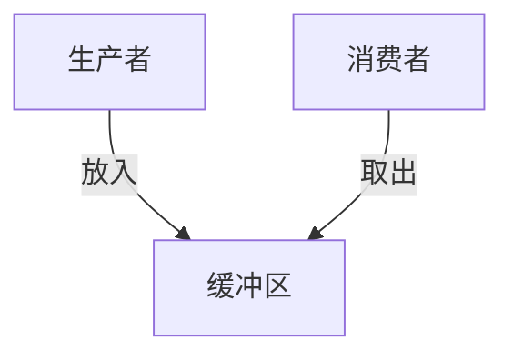

# 1.4.3 并发与同步分析

## 目录

1.4.3.1 主题概述  
1.4.3.2 并发建模方法  
1.4.3.3 同步机制与Petri网  
1.4.3.4 Petri网分析方法  
1.4.3.5 形式化定义与Lean实现  
1.4.3.6 典型案例与推理  
1.4.3.7 图表与多表征  
1.4.3.8 相关性与交叉引用  
1.4.3.9 参考文献与延伸阅读  

---

### 1.4.3.1 主题概述

Petri网是并发与同步分析的经典工具，能够直观建模和分析系统中的并发行为与同步约束。

### 1.4.3.2 并发建模方法

- 并发进程、资源竞争、互斥与同步
- Petri网的并发性表达

### 1.4.3.3 同步机制与Petri网

- 信号量、互斥锁、条件同步
- Petri网中同步结构的建模

### 1.4.3.4 Petri网分析方法

- 可达性图、活性分析、死锁检测

### 1.4.3.5 形式化定义与Lean实现

```lean
-- 并发Petri网的Lean建模（伪代码）
structure ConcurrentPetriNet :=
  (places : Type)
  (transitions : Type)
  (pre : places → transitions → ℕ)
  (post : places → transitions → ℕ)
  (marking : places → ℕ)
```

### 1.4.3.6 典型案例与推理

- 生产者-消费者问题
- 哲学家进餐问题

### 1.4.3.7 图表与多表征



### 1.4.3.8 相关性与交叉引用

- [1.4.2-分布式系统的Petri网表达](./1.4.2-分布式系统的Petri网表达.md)
- [1.4.4-一致性与死锁证明](./1.4.4-一致性与死锁证明.md)

### 1.4.3.9 参考文献与延伸阅读

- 《Petri网与分布式系统》
- 相关论文与开源项目
