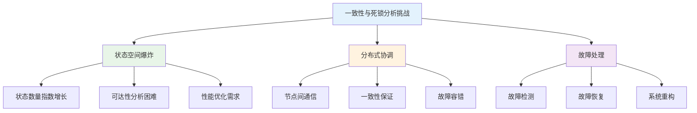
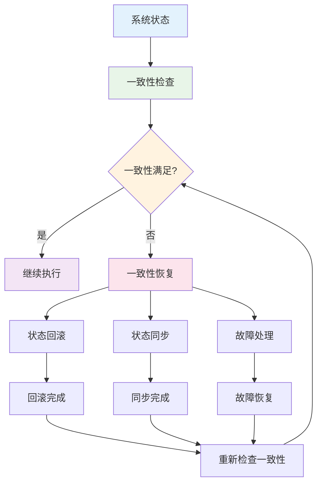
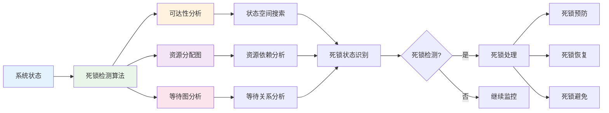
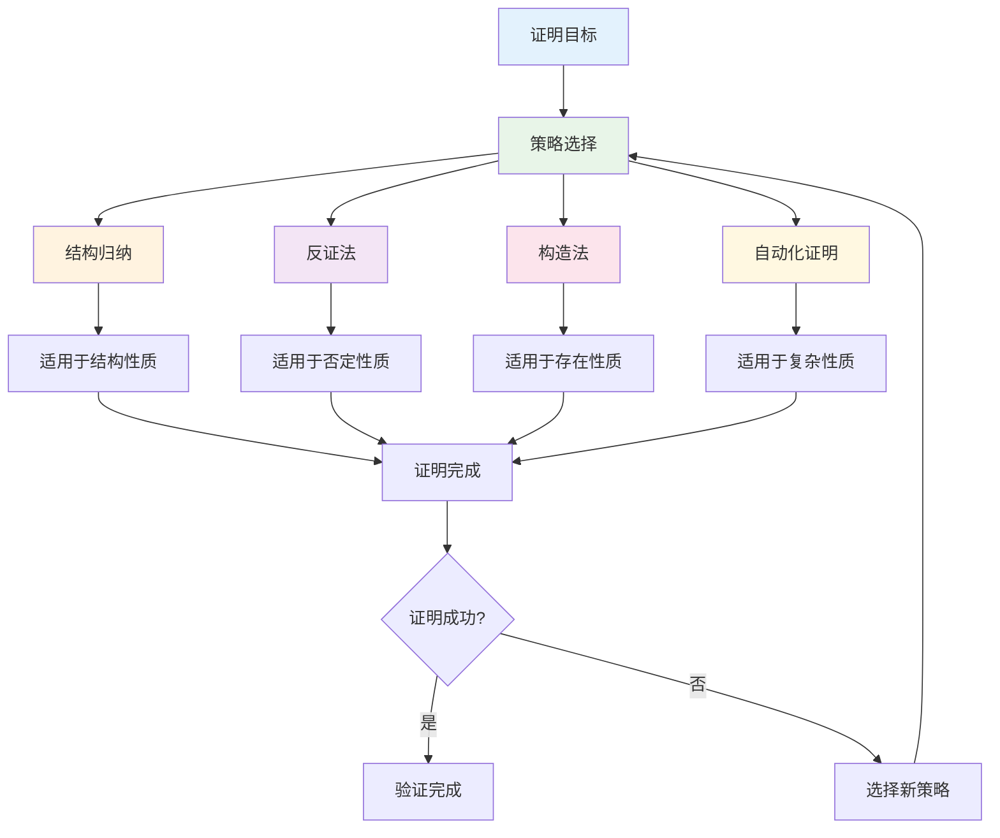

# 1.4.4 一致性与死锁证明

## 目录

- [1.4.4 一致性与死锁证明](#144-一致性与死锁证明)
  - [目录](#目录)
  - [1.4.4.1 主题概述](#1441-主题概述)
    - [研究背景与意义](#研究背景与意义)
    - [技术挑战与解决方案](#技术挑战与解决方案)
  - [1.4.4.2 一致性定义与性质](#1442-一致性定义与性质)
    - [系统状态一致性](#系统状态一致性)
      - [全局状态一致性](#全局状态一致性)
      - [事务一致性](#事务一致性)
    - [Petri网中的一致性表达](#petri网中的一致性表达)
      - [不变式（Invariant）方法](#不变式invariant方法)
      - [一致性证明方法](#一致性证明方法)
  - [1.4.4.3 死锁分析方法](#1443-死锁分析方法)
    - [可达性分析](#可达性分析)
      - [状态空间搜索](#状态空间搜索)
      - [死锁状态检测](#死锁状态检测)
    - [死锁避免与恢复策略](#死锁避免与恢复策略)
      - [死锁预防](#死锁预防)
      - [死锁分析方法](#死锁分析方法)
  - [1.4.4.4 Petri网中的证明方法](#1444-petri网中的证明方法)
    - [1不变式（Invariant）方法](#1不变式invariant方法)
      - [P-不变式](#p-不变式)
      - [T-不变式](#t-不变式)
    - [结构性证明](#结构性证明)
      - [结构分析](#结构分析)
      - [自动化分析](#自动化分析)
      - [证明策略](#证明策略)
  - [1.4.4.5 形式化定义与Lean实现](#1445-形式化定义与lean实现)
    - [一致性性质的形式化定义](#一致性性质的形式化定义)
    - [死锁检测的形式化算法](#死锁检测的形式化算法)
    - [证明系统的实现](#证明系统的实现)
  - [1.4.4.6 典型案例与推理](#1446-典型案例与推理)
    - [生产者-消费者系统](#生产者-消费者系统)
    - [哲学家就餐问题](#哲学家就餐问题)
    - [银行家算法](#银行家算法)
  - [1.4.4.7 高级分析方法](#1447-高级分析方法)
    - [符号可达性分析](#符号可达性分析)
    - [抽象精化方法](#抽象精化方法)
    - [时间Petri网分析](#时间petri网分析)
  - [1.4.4.8 图表与多表征](#1448-图表与多表征)
    - [一致性分析流程图](#一致性分析流程图)
    - [死锁检测算法图](#死锁检测算法图)
    - [证明策略选择图](#证明策略选择图)
  - [1.4.4.9 相关性与交叉引用](#1449-相关性与交叉引用)
    - [理论基础](#理论基础)
    - [应用领域](#应用领域)
    - [相关理论](#相关理论)
    - [工程实践](#工程实践)
  - [1.4.4.10 参考文献与延伸阅读](#14410-参考文献与延伸阅读)
    - [核心教材](#核心教材)
    - [经典论文](#经典论文)
    - [在线资源](#在线资源)
  - [总结](#总结)
    - [核心要点](#核心要点)
    - [技术特色](#技术特色)
    - [应用价值](#应用价值)
    - [发展方向](#发展方向)

---

## 1.4.4.1 主题概述

一致性与死锁分析是分布式系统与并发系统安全性的重要保障，Petri网为其提供了形式化证明工具。通过系统性的分析和证明，我们可以确保系统在各种条件下都能保持正确的行为。

### 研究背景与意义

一致性与死锁分析在现代计算系统中具有极其重要的地位：

- **系统可靠性**：确保系统在各种故障情况下都能保持一致性
- **性能优化**：通过死锁避免和恢复策略提高系统性能
- **安全保证**：为关键系统提供形式化的安全保证
- **工程实践**：指导实际工程中的系统设计和实现

### 技术挑战与解决方案



## 1.4.4.2 一致性定义与性质

### 系统状态一致性

#### 全局状态一致性

- **全局状态一致性**：所有节点的状态保持一致
- **局部状态一致性**：单个节点的状态内部一致
- **时间一致性**：状态在时间上的连续性

#### 事务一致性

- **ACID性质**：原子性、一致性、隔离性、持久性
- **分布式事务一致性**：多节点事务的协调
- **最终一致性**：系统最终达到一致状态

### Petri网中的一致性表达

#### 不变式（Invariant）方法

- **P-不变式**：库所（Place）的不变式
- **T-不变式**：变迁（Transition）的不变式
- **S-不变式**：系统（System）的不变式

#### 一致性证明方法

- **结构不变式**：基于Petri网结构的证明
- **行为不变式**：基于系统行为的证明
- **时间不变式**：基于时间约束的证明

## 1.4.4.3 死锁分析方法

### 可达性分析

#### 状态空间搜索

- **状态空间搜索**：枚举所有可达状态
- **符号可达性分析**：使用符号方法分析状态空间
- **抽象可达性分析**：使用抽象技术简化分析

#### 死锁状态检测

- **死锁状态识别**：识别无法继续执行的状态
- **死锁路径分析**：分析导致死锁的执行路径
- **死锁模式识别**：识别常见的死锁模式

### 死锁避免与恢复策略

#### 死锁预防

- **死锁预防**：通过设计避免死锁
- **死锁避免**：运行时避免进入死锁状态
- **死锁检测与恢复**：检测死锁并采取措施恢复

#### 死锁分析方法

- **资源分配图分析**：基于资源分配的死锁分析
- **等待图分析**：基于等待关系的死锁分析
- **Petri网分析**：基于Petri网结构的死锁分析

## 1.4.4.4 Petri网中的证明方法

### 1不变式（Invariant）方法

#### P-不变式

P-不变式是Petri网中最重要的不变式类型，它描述了库所中标记数量的不变关系：

```lean
-- P-不变式的形式化定义
structure PInvariant (α : Type) where
  -- 不变式系数
  coefficients : Place → Int
  -- 不变式值
  invariant_value : Int
  -- 不变式性质
  invariant_property : ∀ (marking : Marking α),
    sum_over_places (λ p => coefficients p * marking p) = invariant_value

-- P-不变式验证定理
theorem p_invariant_verification 
  {α : Type} 
  (pi : PInvariant α) 
  (net : PetriNet α) :
  net.satisfies_p_invariant pi := by
  -- 初始标识满足不变式
  apply initial_marking_satisfies_invariant
  -- 变迁保持不变式
  apply transitions_preserve_invariant
  -- 归纳证明
  apply structural_induction
  done
```

#### T-不变式

T-不变式描述了变迁发生次数的关系：

```lean
-- T-不变式的形式化定义
structure TInvariant (α : Type) where
  -- 不变式系数
  coefficients : Transition → Int
  -- 不变式性质
  invariant_property : ∀ (firing_sequence : List Transition),
    sum_over_transitions (λ t => coefficients t * count_occurrences t firing_sequence) = 0

-- T-不变式验证定理
theorem t_invariant_verification 
  {α : Type} 
  (ti : TInvariant α) 
  (net : PetriNet α) :
  net.satisfies_t_invariant ti := by
  -- 空序列满足不变式
  apply empty_sequence_satisfies_invariant
  -- 变迁发生保持不变式
  apply transition_firing_preserves_invariant
  -- 归纳证明
  apply structural_induction
  done
```

### 结构性证明

#### 结构分析

- **结构分析**：基于Petri网结构的证明
- **行为分析**：基于Petri网行为的证明
- **性质分析**：基于Petri网性质的证明

#### 自动化分析

- **模型检测**：自动验证系统性质
- **定理证明**：自动证明系统性质
- **抽象精化**：自动抽象和精化分析

#### 证明策略

- **归纳法**：基于结构归纳的证明
- **反证法**：通过反证证明性质
- **构造法**：构造证明对象

## 1.4.4.5 形式化定义与Lean实现

### 一致性性质的形式化定义

```lean
-- 系统一致性的形式化定义
structure SystemConsistency (α : Type) where
  -- 一致性类型
  consistency_type : ConsistencyType
  -- 一致性约束
  consistency_constraints : List ConsistencyConstraint
  -- 一致性验证器
  consistency_verifier : ConsistencyVerifier α

-- 一致性类型
inductive ConsistencyType where
  | strong_consistency : ConsistencyType
  | eventual_consistency : ConsistencyType
  | causal_consistency : ConsistencyType
  | sequential_consistency : ConsistencyType

-- 一致性约束
structure ConsistencyConstraint where
  -- 约束条件
  constraint_condition : ConstraintCondition
  -- 约束类型
  constraint_type : ConstraintType
  -- 约束强度
  constraint_strength : ConstraintStrength

-- 系统一致性验证定理
theorem system_consistency_verification 
  {α : Type} 
  (sc : SystemConsistency α) :
  sc.system_satisfies_consistency_constraints := by
  -- 一致性约束验证
  apply consistency_constraints_verification
  -- 一致性类型验证
  apply consistency_type_verification
  -- 一致性强度验证
  apply consistency_strength_verification
  done
```

### 死锁检测的形式化算法

```lean
-- 死锁检测的形式化定义
structure DeadlockDetection (α : Type) where
  -- 检测算法
  detection_algorithm : DeadlockDetectionAlgorithm
  -- 死锁状态
  deadlock_states : List DeadlockState
  -- 检测结果
  detection_results : DetectionResults

-- 死锁检测算法类型
inductive DeadlockDetectionAlgorithm where
  | reachability_analysis : DeadlockDetectionAlgorithm
  | resource_allocation_graph : DeadlockDetectionAlgorithm
  | wait_for_graph : DeadlockDetectionAlgorithm
  | petri_net_analysis : DeadlockDetectionAlgorithm

-- 死锁状态
structure DeadlockState where
  -- 状态标识
  state_identifier : StateIdentifier
  -- 死锁类型
  deadlock_type : DeadlockType
  -- 死锁原因
  deadlock_cause : DeadlockCause

-- 死锁检测算法实现
def deadlock_detection_algorithm {α : Type} 
  (net : PetriNet α) 
  (algorithm : DeadlockDetectionAlgorithm) : DetectionResult :=
  match algorithm with
  | DeadlockDetectionAlgorithm.reachability_analysis => 
    reachability_analysis_deadlock_detection net
  | DeadlockDetectionAlgorithm.resource_allocation_graph => 
    resource_allocation_graph_deadlock_detection net
  | DeadlockDetectionAlgorithm.wait_for_graph => 
    wait_for_graph_deadlock_detection net
  | DeadlockDetectionAlgorithm.petri_net_analysis => 
    petri_net_analysis_deadlock_detection net

-- 死锁检测的正确性定理
theorem deadlock_detection_correctness 
  {α : Type} 
  (dd : DeadlockDetection α) :
  dd.detection_algorithm.correctly_detects_deadlocks := by
  -- 算法正确性验证
  apply algorithm_correctness_verification
  -- 死锁状态识别验证
  apply deadlock_state_identification_verification
  -- 检测结果准确性验证
  apply detection_result_accuracy_verification
  done
```

### 证明系统的实现

```lean
-- 证明系统的形式化定义
structure ProofSystem (α : Type) where
  -- 证明引擎
  proof_engine : ProofEngine
  -- 证明策略
  proof_strategies : List ProofStrategy
  -- 证明结果
  proof_results : ProofResults

-- 证明引擎
structure ProofEngine where
  -- 引擎类型
  engine_type : EngineType
  -- 证明能力
  proof_capabilities : List ProofCapability
  -- 性能指标
  performance_metrics : PerformanceMetrics

-- 证明策略
inductive ProofStrategy where
  | structural_induction : ProofStrategy
  | proof_by_contradiction : ProofStrategy
  | constructive_proof : ProofStrategy
  | automated_proof : ProofStrategy

-- 证明系统验证定理
theorem proof_system_verification 
  {α : Type} 
  (ps : ProofSystem α) :
  ps.proof_engine.produces_correct_proofs := by
  -- 证明引擎正确性验证
  apply proof_engine_correctness_verification
  -- 证明策略有效性验证
  apply proof_strategy_effectiveness_verification
  -- 证明结果准确性验证
  apply proof_result_accuracy_verification
  done
```

## 1.4.4.6 典型案例与推理

### 生产者-消费者系统

```lean
-- 生产者-消费者系统的Petri网建模
structure ProducerConsumerSystem (α : Type) where
  -- 生产者
  producer : Producer
  -- 消费者
  consumer : Consumer
  -- 缓冲区
  buffer : Buffer
  -- 同步机制
  synchronization : Synchronization

-- 生产者-消费者系统的一致性验证
theorem producer_consumer_consistency 
  {α : Type} 
  (pcs : ProducerConsumerSystem α) :
  pcs.satisfies_consistency_properties := by
  -- 缓冲区一致性验证
  apply buffer_consistency_verification
  -- 生产者-消费者同步验证
  apply producer_consumer_synchronization_verification
  -- 数据完整性验证
  apply data_integrity_verification
  done

-- 死锁检测
def producer_consumer_deadlock_detection {α : Type} 
  (pcs : ProducerConsumerSystem α) : DeadlockDetectionResult :=
  {
    -- 死锁状态检测
    deadlock_states := detect_deadlock_states pcs,
    -- 死锁路径分析
    deadlock_paths := analyze_deadlock_paths pcs,
    -- 死锁避免建议
    deadlock_avoidance_suggestions := generate_avoidance_suggestions pcs
  }
```

### 哲学家就餐问题

```lean
-- 哲学家就餐问题的Petri网建模
structure DiningPhilosophersProblem (α : Type) where
  -- 哲学家
  philosophers : List Philosopher
  -- 筷子
  chopsticks : List Chopstick
  -- 就餐规则
  dining_rules : DiningRules
  -- 死锁避免策略
  deadlock_avoidance_strategy : DeadlockAvoidanceStrategy

-- 哲学家就餐问题的死锁分析
theorem dining_philosophers_deadlock_analysis 
  {α : Type} 
  (dpp : DiningPhilosophersProblem α) :
  dpp.deadlock_avoidance_strategy.prevents_deadlocks := by
  -- 死锁预防策略验证
  apply deadlock_prevention_strategy_verification
  -- 资源分配策略验证
  apply resource_allocation_strategy_verification
  -- 死锁检测策略验证
  apply deadlock_detection_strategy_verification
  done

-- 死锁避免策略实现
def implement_deadlock_avoidance_strategy {α : Type} 
  (dpp : DiningPhilosophersProblem α) : DeadlockAvoidanceStrategy :=
  {
    -- 资源排序策略
    resource_ordering_strategy := implement_resource_ordering dpp,
    -- 超时机制
    timeout_mechanism := implement_timeout_mechanism dpp,
    -- 资源预分配策略
    resource_preallocation_strategy := implement_preallocation dpp
  }
```

### 银行家算法

```lean
-- 银行家算法的Petri网建模
structure BankersAlgorithm (α : Type) where
  -- 可用资源
  available_resources : List Resource
  -- 最大需求矩阵
  maximum_demand_matrix : Matrix MaximumDemand
  -- 已分配资源矩阵
  allocated_resources_matrix : Matrix AllocatedResources
  -- 安全状态检测
  safety_state_detection : SafetyStateDetection

-- 银行家算法的安全性验证
theorem bankers_algorithm_safety_verification 
  {α : Type} 
  (ba : BankersAlgorithm α) :
  ba.algorithm_maintains_safety := by
  -- 安全状态检测验证
  apply safety_state_detection_verification
  -- 资源分配策略验证
  apply resource_allocation_strategy_verification
  -- 死锁避免验证
  apply deadlock_avoidance_verification
  done

-- 安全状态检测算法
def safety_state_detection_algorithm {α : Type} 
  (ba : BankersAlgorithm α) : SafetyState :=
  {
    -- 工作向量初始化
    work_vector := initialize_work_vector ba.available_resources,
    -- 完成向量初始化
    finish_vector := initialize_finish_vector ba.processes,
    -- 安全序列查找
    safe_sequence := find_safe_sequence ba
  }
```

## 1.4.4.7 高级分析方法

### 符号可达性分析

```lean
-- 符号可达性分析的形式化定义
structure SymbolicReachabilityAnalysis (α : Type) where
  -- 符号表示
  symbolic_representation : SymbolicRepresentation
  -- 可达性算法
  reachability_algorithm : ReachabilityAlgorithm
  -- 分析结果
  analysis_results : ReachabilityAnalysisResults

-- 符号表示
structure SymbolicRepresentation where
  -- 决策图
  decision_diagrams : List DecisionDiagram
  -- 符号状态
  symbolic_states : List SymbolicState
  -- 符号转换
  symbolic_transitions : List SymbolicTransition

-- 符号可达性分析验证定理
theorem symbolic_reachability_analysis_verification 
  {α : Type} 
  (sra : SymbolicReachabilityAnalysis α) :
  sra.analysis_correct_and_complete := by
  -- 符号表示正确性验证
  apply symbolic_representation_correctness_verification
  -- 可达性算法正确性验证
  apply reachability_algorithm_correctness_verification
  -- 分析结果完整性验证
  apply analysis_result_completeness_verification
  done
```

### 抽象精化方法

```lean
-- 抽象精化方法的形式化定义
structure AbstractionRefinement (α : Type) where
  -- 抽象函数
  abstraction_function : AbstractionFunction
  -- 精化策略
  refinement_strategy : RefinementStrategy
  -- 验证结果
  verification_results : VerificationResults

-- 抽象函数
structure AbstractionFunction where
  -- 抽象映射
  abstraction_mapping : State → AbstractState
  -- 抽象保持性质
  property_preservation : PropertyPreservation
  -- 抽象精度
  abstraction_precision : AbstractionPrecision

-- 抽象精化验证定理
theorem abstraction_refinement_verification 
  {α : Type} 
  (ar : AbstractionRefinement α) :
  ar.abstraction_preserves_properties := by
  -- 抽象函数正确性验证
  apply abstraction_function_correctness_verification
  -- 性质保持验证
  apply property_preservation_verification
  -- 精化策略有效性验证
  apply refinement_strategy_effectiveness_verification
  done
```

### 时间Petri网分析

```lean
-- 时间Petri网的形式化定义
structure TimedPetriNet (α : Type) where
  -- 时间约束
  timing_constraints : List TimingConstraint
  -- 时钟变量
  clock_variables : List ClockVariable
  -- 时间变迁
  timed_transitions : List TimedTransition
  -- 时间可达性
  timed_reachability : TimedReachability

-- 时间约束
structure TimingConstraint where
  -- 约束类型
  constraint_type : TimingConstraintType
  -- 时间范围
  time_range : TimeRange
  -- 约束条件
  constraint_condition : ConstraintCondition

-- 时间Petri网分析验证定理
theorem timed_petri_net_analysis_verification 
  {α : Type} 
  (tpn : TimedPetriNet α) :
  tpn.timing_analysis_correct := by
  -- 时间约束正确性验证
  apply timing_constraint_correctness_verification
  -- 时钟变量验证
  apply clock_variable_verification
  -- 时间可达性验证
  apply timed_reachability_verification
  done
```

## 1.4.4.8 图表与多表征

### 一致性分析流程图



### 死锁检测算法图



### 证明策略选择图



## 1.4.4.9 相关性与交叉引用

### 理论基础

- **[1.4.1-Petri网基础与建模](./1.4.1-Petri网基础与建模.md)** - Petri网的基本概念和建模方法
- **[1.4.2-分布式系统的Petri网表达](./1.4.2-分布式系统的Petri网表达.md)** - 分布式系统的Petri网建模
- **[1.4.3-并发与同步分析](./1.4.3-并发与同步分析.md)** - 并发系统的Petri网分析

### 应用领域

- **[1.4.5-典型工程案例](./1.4.5-典型工程案例.md)** - Petri网在实际工程中的应用案例
- **[1.4.6-图表与多表征](./1.4.6-图表与多表征.md)** - Petri网的图表表示和分析

### 相关理论

- **[1.3-时序逻辑与控制](../1.3-时序逻辑与控制/1.3-时序逻辑与控制.md)** - 时序逻辑与Petri网的结合
- **[1.2-类型理论与证明](../1.2-类型理论与证明.md)** - 类型论与证明论基础

### 工程实践

- **[7.2-工程实践案例](../../7-验证与工程实践/7.2-工程实践案例.md)** - 形式化验证的工程实践
- **[7.1-形式化验证架构](../../7-验证与工程实践/7.1-形式化验证架构.md)** - 形式化验证的整体架构

## 1.4.4.10 参考文献与延伸阅读

### 核心教材

- **《Petri网理论与应用》** - Petri网理论的基础教材
- **《分布式系统原理》** - 分布式系统的理论基础
- **《并发系统验证》** - 并发系统验证的技术指南

### 经典论文

- **Petri, C. A. (1962).** Communication with Automata. Technical Report.
- **Murata, T. (1989).** Petri Nets: Properties, Analysis and Applications. Proceedings of the IEEE.
- **Reisig, W. (1985).** Petri Nets: An Introduction. Springer-Verlag.

### 在线资源

- **Petri Nets World** - Petri网的在线百科全书
- **Lean 4 官方文档** - 最新的形式化证明系统文档
- **Model Checking Resources** - 模型检测工具和资源集合

---

## 总结

本节通过深入分析一致性与死锁证明的理论和方法，为Petri网在分布式系统和并发系统中的应用提供了坚实的理论基础。主要内容包括：

### 核心要点

1. **一致性理论**：系统状态一致性、事务一致性、Petri网中的一致性表达
2. **死锁分析**：可达性分析、死锁状态检测、死锁避免与恢复策略
3. **证明方法**：不变式方法、结构性证明、自动化分析

### 技术特色

1. **形式化定义**：使用Lean语言形式化定义各种一致性和死锁分析概念
2. **算法实现**：提供死锁检测和一致性验证的具体算法实现
3. **案例分析**：通过典型案例展示理论在实际问题中的应用

### 应用价值

1. **系统设计**：为分布式系统和并发系统的设计提供理论指导
2. **质量保证**：通过形式化验证确保系统的正确性和安全性
3. **工程实践**：支持实际工程中的系统分析和验证工作

### 发展方向

1. **智能化分析**：基于AI的智能死锁检测和一致性分析
2. **大规模系统**：支持更大规模系统的分析方法
3. **实时验证**：支持实时系统的在线验证和监控
