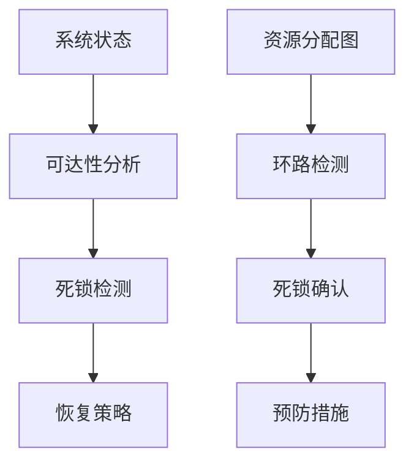
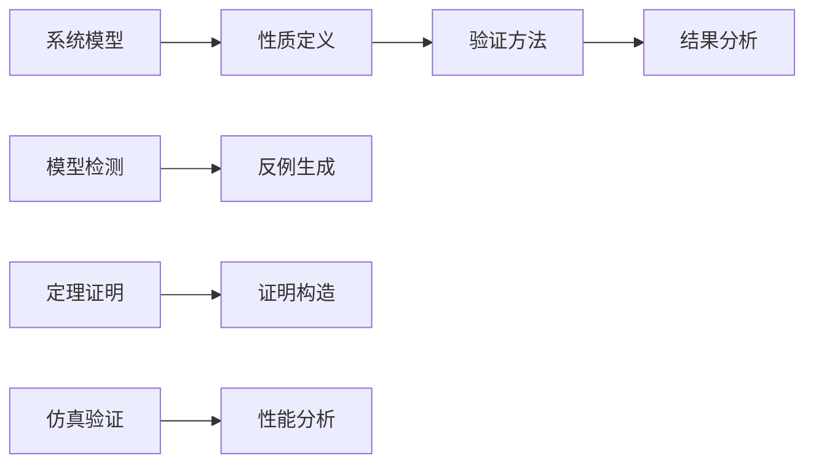
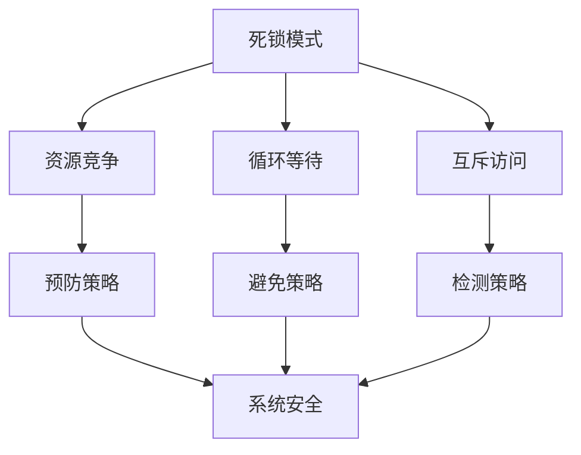

# 1.4.4 一致性与死锁证明

## 目录

1.4.4.1 主题概述  
1.4.4.2 一致性定义与性质  
1.4.4.3 死锁分析方法  
1.4.4.4 Petri网中的证明方法  
1.4.4.5 形式化定义与Lean实现  
1.4.4.6 典型案例与推理  
1.4.4.7 图表与多表征  
1.4.4.8 相关性与交叉引用  
1.4.4.9 参考文献与延伸阅读  

---

### 1.4.4.1 主题概述

一致性与死锁分析是分布式系统与并发系统安全性的重要保障，Petri网为其提供了形式化证明工具。

### 1.4.4.2 一致性定义与性质

#### 系统状态一致性

- **全局状态一致性**：所有节点的状态保持一致
- **局部状态一致性**：单个节点的状态内部一致
- **时间一致性**：状态在时间上的连续性

#### 事务一致性

- **ACID性质**：原子性、一致性、隔离性、持久性
- **分布式事务一致性**：多节点事务的协调
- **最终一致性**：系统最终达到一致状态

#### Petri网中的一致性表达

- **不变式（Invariant）**：系统状态必须满足的条件
- **可达性分析**：从初始状态可达的所有状态
- **状态空间分析**：系统所有可能状态的集合

#### 一致性证明方法

- **结构不变式**：基于Petri网结构的证明
- **行为不变式**：基于系统行为的证明
- **时间不变式**：基于时间约束的证明

### 1.4.4.3 死锁分析方法

#### 可达性分析

- **状态空间搜索**：枚举所有可达状态
- **符号可达性分析**：使用符号方法分析状态空间
- **抽象可达性分析**：使用抽象技术简化分析

#### 死锁状态检测

- **死锁状态识别**：识别无法继续执行的状态
- **死锁路径分析**：分析导致死锁的执行路径
- **死锁模式识别**：识别常见的死锁模式

#### 死锁避免与恢复策略

- **死锁预防**：通过设计避免死锁
- **死锁避免**：运行时避免进入死锁状态
- **死锁检测与恢复**：检测死锁并采取措施恢复

#### 死锁分析方法

- **资源分配图分析**：基于资源分配的死锁分析
- **等待图分析**：基于等待关系的死锁分析
- **Petri网分析**：基于Petri网结构的死锁分析

### 1.4.4.4 Petri网中的证明方法

#### 不变式（Invariant）方法

- **P-不变式**：库所（Place）的不变式
- **T-不变式**：变迁（Transition）的不变式
- **S-不变式**：系统（System）的不变式

#### 结构性证明

- **结构分析**：基于Petri网结构的证明
- **行为分析**：基于Petri网行为的证明
- **性质分析**：基于Petri网性质的证明

#### 自动化分析

- **模型检测**：自动验证系统性质
- **定理证明**：自动证明系统性质
- **抽象精化**：自动抽象和精化分析

#### 证明策略

- **归纳法**：基于结构归纳的证明
- **反证法**：通过反证证明性质
- **构造法**：构造证明对象

### 1.4.4.5 形式化定义与Lean实现

#### 死锁状态定义

```lean
-- 死锁状态的Lean定义
def deadlock (net : PetriNet) (m : net.places → Nat) : Prop :=
  ∀ t, ¬ enabled t m

-- 可达性定义
def reachable (net : PetriNet) (m1 m2 : net.places → Nat) : Prop :=
  ∃ σ : List net.transitions, firing_sequence net m1 σ m2

-- 不变式定义
def invariant (net : PetriNet) (P : net.places → Nat → Prop) : Prop :=
  ∀ m, reachable net net.initial_marking m → P m
```

#### 一致性定义

```lean
-- 系统一致性定义
def system_consistency (sys : DistributedSystem) : Prop :=
  ∀ s1 s2 : sys.state, reachable s1 s2 → consistent s1 s2

-- 事务一致性定义
def transaction_consistency (txn : Transaction) : Prop :=
  ∀ s : txn.state, ACID_properties s

-- ACID性质定义
def ACID_properties (s : TransactionState) : Prop :=
  atomicity s ∧ consistency s ∧ isolation s ∧ durability s
```

#### 死锁检测算法

```lean
-- 死锁检测
def detect_deadlock (net : PetriNet) (m : net.places → Nat) : Bool :=
  if deadlock net m then
    true
  else
    false

-- 死锁预防
def prevent_deadlock (net : PetriNet) (t : net.transitions) : Bool :=
  if safe_to_fire net t then
    true
  else
    false

-- 死锁恢复
def recover_from_deadlock (net : PetriNet) (m : net.places → Nat) : net.places → Nat :=
  if deadlock net m then
    rollback_to_safe_state net m
  else
    m
```

### 1.4.4.6 典型案例与推理

#### 分布式数据库一致性证明

- **两阶段提交协议**：证明协议的正确性
- **分布式锁管理**：证明锁机制的一致性
- **故障恢复机制**：证明恢复过程的正确性

#### 并发系统死锁检测

- **哲学家就餐问题**：经典死锁问题的分析
- **生产者-消费者问题**：资源竞争的分析
- **读者-写者问题**：共享资源的分析

#### 网络协议一致性

- **TCP协议**：连接状态的一致性
- **路由协议**：路由信息的一致性
- **负载均衡**：负载分布的一致性

#### 工业系统一致性

- **制造系统**：生产状态的一致性
- **供应链系统**：库存信息的一致性
- **控制系统**：控制状态的一致性

### 1.4.4.7 图表与多表征

#### 死锁检测流程



#### 一致性验证流程



#### 死锁模式识别



### 1.4.4.8 相关性与交叉引用

#### 理论基础

- [1.4.1-Petri网基础与建模](./1.4.1-Petri网基础与建模.md) - Petri网的基本概念和建模方法
- [1.4.2-分布式系统的Petri网表达](./1.4.2-分布式系统的Petri网表达.md) - 分布式系统的Petri网建模
- [1.4.3-并发与同步分析](./1.4.3-并发与同步分析.md) - 并发系统的Petri网分析

#### 应用领域

- [1.4.4-一致性与死锁证明](./1.4.4-一致性与死锁证明.md) - 系统一致性和死锁的Petri网证明
- [1.4.5-典型工程案例](./1.4.5-典型工程案例.md) - Petri网在实际工程中的应用案例

#### 相关理论

- [1.3-时序逻辑与控制](../1.3-时序逻辑与控制/1.3-时序逻辑与控制.md) - 时序逻辑与Petri网的结合
- [1.2-类型理论与证明](../1.2-类型理论与证明.md) - 类型论与证明论基础

#### 工程实践

- [7.2-工程实践案例](../../7-验证与工程实践/7.2-工程实践案例.md) - 形式化验证的工程实践
- [7.1-形式化验证架构](../../7-验证与工程实践/7.1-形式化验证架构.md) - 形式化验证的整体架构

### 1.4.4.9 参考文献与延伸阅读

#### 核心教材

- **《Petri网与分布式系统》** - Petri网在分布式系统中的应用
- **《Petri Nets: Properties, Analysis and Applications》** - Petri网的性质、分析与应用
- **《Modeling and Analysis of Communicating Systems》**（K. Jensen）- 通信系统的建模与分析

#### 经典论文

- **Petri, C. A. (1962).** Communication with Automata. Technical Report.
- **Murata, T. (1989).** Petri Nets: Properties, Analysis and Applications. Proceedings of the IEEE.
- **Reisig, W. (1985).** Petri Nets: An Introduction. Springer-Verlag.

#### 开源工具

- **PIPE**（Platform Independent Petri net Editor）- 平台无关的Petri网编辑器
- **WoPeD**（Workflow Petri Net Designer）- 工作流Petri网设计器
- **TAPAAL**（Timed-Arc Petri Nets）- 时间弧Petri网工具

#### 在线资源

- **Petri Nets World**：<https://www.petri-nets.org/>
- **PIPE 官网**：<https://pipe2.sourceforge.net/>
- **WoPeD 官网**：<https://woped.dhbw.de/>
- **arXiv 论文检索**：<https://arxiv.org/>
