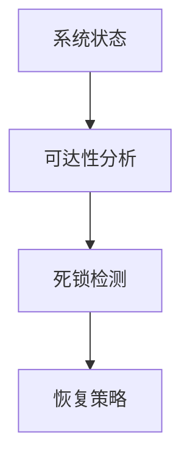

# 1.4.4 一致性与死锁证明

## 目录

1.4.4.1 主题概述  
1.4.4.2 一致性定义与性质  
1.4.4.3 死锁分析方法  
1.4.4.4 Petri网中的证明方法  
1.4.4.5 形式化定义与Lean实现  
1.4.4.6 典型案例与推理  
1.4.4.7 图表与多表征  
1.4.4.8 相关性与交叉引用  
1.4.4.9 参考文献与延伸阅读  

---

### 1.4.4.1 主题概述

一致性与死锁分析是分布式系统与并发系统安全性的重要保障，Petri网为其提供了形式化证明工具。

### 1.4.4.2 一致性定义与性质

- 系统状态一致性、事务一致性
- Petri网中的一致性表达

### 1.4.4.3 死锁分析方法

- 可达性分析、死锁状态检测
- 死锁避免与恢复策略

### 1.4.4.4 Petri网中的证明方法

- 不变式（Invariant）方法
- 结构性证明与自动化分析

### 1.4.4.5 形式化定义与Lean实现

```lean
-- 死锁状态的Lean定义（伪代码）
def deadlock (net : PetriNet) (m : net.places → ℕ) : Prop :=
  ∀ t, ¬ enabled t m
```

### 1.4.4.6 典型案例与推理

- 分布式数据库一致性证明
- 并发系统死锁检测

### 1.4.4.7 图表与多表征



### 1.4.4.8 相关性与交叉引用

- [1.4.3-并发与同步分析](./1.4.3-并发与同步分析.md)
- [7.2-工程实践案例](../../7-验证与工程实践/7.2-工程实践案例.md)

### 1.4.4.9 参考文献与延伸阅读

- 《Petri网与分布式系统》
- 相关论文与开源项目
