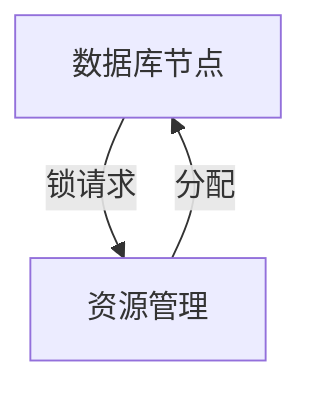

# 1.4.5 典型工程案例

## 目录

1.4.5.1 主题概述  
1.4.5.2 实际系统案例  
1.4.5.3 Petri网建模与分析  
1.4.5.4 Lean实现与自动化  
1.4.5.5 图表与多表征  
1.4.5.6 相关性与交叉引用  
1.4.5.7 参考文献与延伸阅读  

---

### 1.4.5.1 主题概述

本节选取典型工程系统，展示Petri网在实际分布式与并发系统中的建模与分析应用。

### 1.4.5.2 实际系统案例

- 分布式数据库事务管理
- 并发生产线调度
- 网络协议同步机制

### 1.4.5.3 Petri网建模与分析

- 系统结构建模、资源分配、同步与死锁分析

### 1.4.5.4 Lean实现与自动化

```lean
-- 分布式数据库事务的Petri网建模（伪代码）
structure DBTransactionNet :=
  (places : Type)
  (transitions : Type)
  (pre : places → transitions → ℕ)
  (post : places → transitions → ℕ)
  (marking : places → ℕ)
```

### 1.4.5.5 图表与多表征



### 1.4.5.6 相关性与交叉引用

- [1.4.4-一致性与死锁证明](./1.4.4-一致性与死锁证明.md)
- [7.2-工程实践案例](../../7-验证与工程实践/7.2-工程实践案例.md)

### 1.4.5.7 参考文献与延伸阅读

- 《Petri网与分布式系统》
- 相关论文与开源项目
