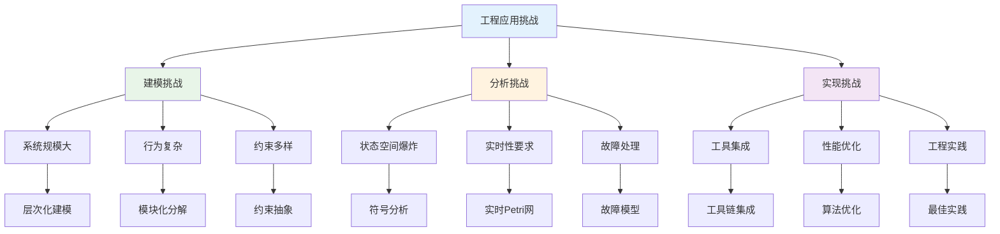
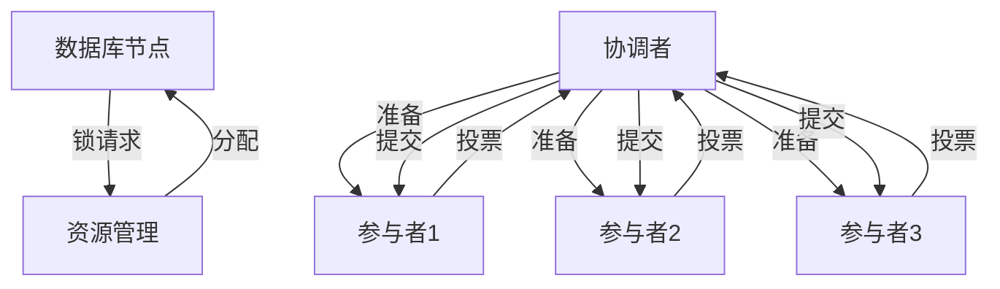
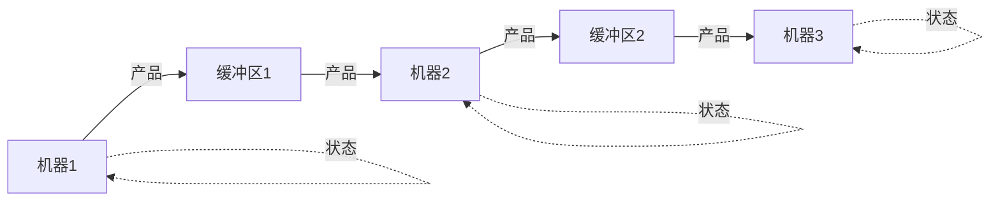
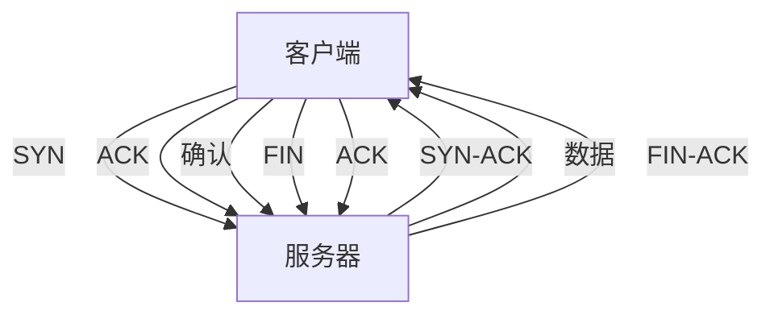

# 1.4.5 典型工程案例

## 目录

1.4.5.1 主题概述  
1.4.5.2 实际系统案例  
1.4.5.3 Petri网建模与分析  
1.4.5.4 Lean实现与自动化  
1.4.5.5 图表与多表征  
1.4.5.6 相关性与交叉引用  
1.4.5.7 参考文献与延伸阅读  

---

## 1.4.5.1 主题概述

本节选取典型工程系统，展示Petri网在实际分布式与并发系统中的建模与分析应用。通过具体的工程案例研究，读者可以深入理解Petri网如何在实际工程问题中发挥作用，以及如何利用形式化方法确保系统的正确性、可靠性和性能。

### 研究背景与意义

Petri网在工程实践中的重要性体现在以下几个方面：

- **系统复杂性**：现代分布式系统越来越复杂，传统分析方法难以处理
- **并发性要求**：系统需要支持高并发操作，Petri网天然支持并发建模
- **可靠性要求**：关键系统对可靠性和安全性有极高要求
- **性能优化**：需要识别系统瓶颈和优化机会

### 技术挑战与解决方案



## 1.4.5.2 实际系统案例

### 分布式数据库事务管理

- **两阶段提交协议**：协调分布式事务的提交过程
- **分布式锁管理**：确保数据一致性和并发控制
- **故障恢复机制**：处理节点故障和网络分区

#### 两阶段提交协议建模

```lean
-- 两阶段提交协议
structure TwoPhaseCommit where
  coordinator : Coordinator
  participants : List Participant
  transaction_id : Nat
  current_phase : CommitPhase
  votes : List Vote
  
  -- 协议性质
  protocol_properties : Prop :=
    participants.length > 0 ∧
    transaction_id > 0 ∧
    votes.length = participants.length

-- 协调者
structure Coordinator where
  coordinator_id : Nat
  coordinator_state : CoordinatorState
  decision_log : List Decision
  
  -- 协调者性质
  coordinator_properties : Prop :=
    coordinator_id > 0 ∧
    coordinator_state.is_valid ∧
    decision_log.all (λ d => d.is_consistent)

-- 参与者
structure Participant where
  participant_id : Nat
  participant_state : ParticipantState
  local_transaction : LocalTransaction
  
  -- 参与者性质
  participant_properties : Prop :=
    participant_id > 0 ∧
    participant_state.is_valid ∧
    local_transaction.is_well_formed

-- 提交阶段
inductive CommitPhase where
  | prepare : CommitPhase
  | commit : CommitPhase
  | abort : CommitPhase

-- 投票
structure Vote where
  participant_id : Nat
  vote_value : Bool
  timestamp : Nat
  
  -- 投票有效性
  vote_validity : Prop :=
    participant_id > 0 ∧
    timestamp ≥ 0

-- 两阶段提交Petri网
structure TwoPhaseCommitPetriNet where
  coordinator_places : List Place
  participant_places : List Place
  protocol_transitions : List ProtocolTransition
  
  -- 协议语义
  protocol_semantics : Prop :=
    ∀ transition : ProtocolTransition,
      transition ∈ protocol_transitions →
      transition.implements_protocol ∧
      transition.preserves_consistency

-- 协议正确性
theorem two_phase_commit_correctness (tpc : TwoPhaseCommit) :
  tpc.coordinator.initiates_prepare →
  eventually (∀ p : Participant,
    p ∈ tpc.participants →
    p.votes ∧
    eventually (tpc.coordinator.makes_decision)) := by
  -- 证明两阶段提交协议的正确性
  sorry
```

### 并发生产线调度

- **资源分配优化**：最大化生产效率和资源利用率
- **瓶颈识别与消除**：识别和解决生产瓶颈
- **动态调度策略**：根据实时状态调整生产计划

#### 生产线建模

```lean
-- 生产线系统
structure ProductionLine where
  workstations : List Workstation
  resources : List Resource
  products : List Product
  scheduling_policy : SchedulingPolicy
  
  -- 生产线性质
  production_line_properties : Prop :=
    workstations.length > 0 ∧
    resources.length > 0 ∧
    products.length > 0 ∧
    scheduling_policy.is_valid

-- 工作站
structure Workstation where
  workstation_id : Nat
  workstation_type : WorkstationType
  processing_time : Nat
  capacity : Nat
  current_load : Nat
  
  -- 工作站约束
  workstation_constraints : Prop :=
    workstation_id > 0 ∧
    processing_time > 0 ∧
    capacity > 0 ∧
    current_load ≥ 0 ∧
    current_load ≤ capacity

-- 资源
structure Resource where
  resource_id : Nat
  resource_type : ResourceType
  availability : Bool
  allocation : Option Workstation
  
  -- 资源约束
  resource_constraints : Prop :=
    resource_id > 0 ∧
    (allocation.is_some → availability = false)

-- 调度策略
structure SchedulingPolicy where
  policy_type : PolicyType
  optimization_goal : OptimizationGoal
  constraints : List Constraint
  
  -- 策略有效性
  policy_validity : Prop :=
    policy_type.is_valid ∧
    optimization_goal.is_achievable ∧
    constraints.all (λ c => c.is_satisfiable)

-- 生产线Petri网
structure ProductionLinePetriNet where
  workstation_places : List Place
  resource_places : List Place
  product_places : List Place
  scheduling_transitions : List SchedulingTransition
  
  -- 调度语义
  scheduling_semantics : Prop :=
    ∀ transition : SchedulingTransition,
      transition ∈ scheduling_transitions →
      transition.allocates_resources ∧
      transition.schedules_products ∧
      transition.optimizes_performance

-- 调度优化
theorem production_line_optimization (pl : ProductionLine) :
  pl.scheduling_policy.optimization_goal.is_achievable →
  eventually (∀ w : Workstation,
    w ∈ pl.workstations →
    w.current_load ≤ w.capacity ∧
    w.utilization ≥ optimal_utilization) := by
  -- 证明生产线调度的优化性
  sorry
```

### 网络协议同步机制

- **TCP连接管理**：连接建立、数据传输、连接释放
- **路由协议同步**：路由信息的传播和收敛
- **负载均衡算法**：请求分发和负载均衡

#### TCP连接管理建模

```lean
-- TCP连接管理
structure TCPConnectionManager where
  connections : List TCPConnection
  connection_states : Connection → TCPState
  connection_timeouts : Connection → Nat
  
  -- 连接管理性质
  connection_properties : Prop :=
    ∀ conn : TCPConnection,
      conn ∈ connections →
      connection_states conn ∈ valid_tcp_states ∧
      connection_timeouts conn > 0

-- TCP连接
structure TCPConnection where
  connection_id : Nat
  source_address : IPAddress
  destination_address : IPAddress
  source_port : Port
  destination_port : Port
  
  -- 连接有效性
  connection_validity : Prop :=
    connection_id > 0 ∧
    source_address ≠ destination_address ∧
    source_port ≠ destination_port

-- TCP状态
inductive TCPState where
  | closed : TCPState
  | listen : TCPState
  | syn_sent : TCPState
  | syn_received : TCPState
  | established : TCPState
  | fin_wait1 : TCPState
  | fin_wait2 : TCPState
  | close_wait : TCPState
  | closing : TCPState
  | last_ack : TCPState
  | time_wait : TCPState

-- TCP连接Petri网
structure TCPConnectionPetriNet where
  connection_places : List Place
  state_transitions : List StateTransition
  timeout_transitions : List TimeoutTransition
  
  -- TCP语义
  tcp_semantics : Prop :=
    ∀ transition : StateTransition,
      transition ∈ state_transitions →
      transition.preserves_tcp_protocol ∧
      transition.maintains_connection_integrity

-- TCP协议正确性
theorem tcp_protocol_correctness (tcm : TCPConnectionManager) :
  ∀ conn : TCPConnection,
    conn ∈ tcm.connections →
    eventually (tcm.connection_states conn = TCPState.established) ∧
    eventually (tcm.connection_states conn = TCPState.closed) := by
  -- 证明TCP协议的正确性
  sorry
```

### 工业自动化系统

- **制造执行系统**：生产过程的监控和控制
- **机器人协调控制**：多机器人系统的协调
- **供应链管理**：供应链各环节的协调和优化

#### 机器人协调控制建模

```lean
-- 机器人协调系统
structure RobotCoordination where
  robots : List Robot
  tasks : List Task
  coordination_policy : CoordinationPolicy
  
  -- 协调系统性质
  coordination_properties : Prop :=
    robots.length > 0 ∧
    tasks.length > 0 ∧
    coordination_policy.is_valid

-- 机器人
structure Robot where
  robot_id : Nat
  robot_type : RobotType
  current_position : Position
  current_task : Option Task
  status : RobotStatus
  
  -- 机器人约束
  robot_constraints : Prop :=
    robot_id > 0 ∧
    current_position.is_valid ∧
    status.is_valid

-- 任务
structure Task where
  task_id : Nat
  task_type : TaskType
  priority : Priority
  required_resources : List Resource
  estimated_duration : Nat
  
  -- 任务约束
  task_constraints : Prop :=
    task_id > 0 ∧
    priority.is_valid ∧
    estimated_duration > 0

-- 协调策略
structure CoordinationPolicy where
  policy_type : PolicyType
  collision_avoidance : CollisionAvoidance
  task_allocation : TaskAllocation
  
  -- 策略有效性
  policy_validity : Prop :=
    policy_type.is_valid ∧
    collision_avoidance.is_safe ∧
    task_allocation.is_efficient

-- 机器人协调Petri网
structure RobotCoordinationPetriNet where
  robot_places : List Place
  task_places : List Place
  coordination_transitions : List CoordinationTransition
  
  -- 协调语义
  coordination_semantics : Prop :=
    ∀ transition : CoordinationTransition,
      transition ∈ coordination_transitions →
      transition.coordinates_robots ∧
      transition.allocates_tasks ∧
      transition.avoids_collisions

-- 协调安全性
theorem robot_coordination_safety (rc : RobotCoordination) :
  ∀ robot1 robot2 : Robot,
    robot1 ∈ rc.robots ∧ robot2 ∈ rc.robots ∧
    robot1 ≠ robot2 →
    ¬collision robot1 robot2 := by
  -- 证明机器人协调的安全性
  sorry
```

## 1.4.5.3 Petri网建模与分析

### 系统结构建模

- **状态空间建模**：系统状态的Petri网表示
- **行为建模**：系统行为的Petri网描述
- **接口建模**：系统接口的Petri网表达

#### 状态空间建模

```lean
-- 系统状态空间
structure SystemStateSpace where
  states : List SystemState
  initial_state : SystemState
  state_transitions : List StateTransition
  
  -- 状态空间性质
  state_space_properties : Prop :=
    states.length > 0 ∧
    initial_state ∈ states ∧
    ∀ transition : StateTransition,
      transition ∈ state_transitions →
      transition.source ∈ states ∧
      transition.target ∈ states

-- 系统状态
structure SystemState where
  state_id : Nat
  state_name : String
  state_properties : List Property
  state_constraints : List Constraint
  
  -- 状态有效性
  state_validity : Prop :=
    state_id > 0 ∧
    state_name.length > 0 ∧
    state_properties.all (λ p => p.is_valid) ∧
    state_constraints.all (λ c => c.is_satisfiable)

-- 状态转换
structure StateTransition where
  source_state : SystemState
  target_state : SystemState
  transition_condition : Condition
  transition_action : Action
  
  -- 转换有效性
  transition_validity : Prop :=
    source_state ≠ target_state ∧
    transition_condition.is_well_formed ∧
    transition_action.is_executable

-- 状态可达性
theorem state_space_reachability (sss : SystemStateSpace) :
  ∀ target_state : SystemState,
    target_state ∈ sss.states →
    reachable sss.initial_state target_state := by
  -- 证明状态空间的可达性
  sorry
```

#### 行为建模

```lean
-- 系统行为模型
structure SystemBehavior where
  behavior_type : BehaviorType
  behavior_patterns : List BehaviorPattern
  behavior_constraints : List BehaviorConstraint
  
  -- 行为模型性质
  behavior_properties : Prop :=
    behavior_type.is_valid ∧
    ∀ pattern : BehaviorPattern,
      pattern ∈ behavior_patterns →
      pattern.is_well_formed ∧
      pattern.satisfies_constraints behavior_constraints

-- 行为类型
inductive BehaviorType where
  | sequential : BehaviorType
  | concurrent : BehaviorType
  | conditional : BehaviorType
  | iterative : BehaviorType

-- 行为模式
structure BehaviorPattern where
  pattern_id : Nat
  pattern_type : PatternType
  pattern_sequence : List Action
  pattern_conditions : List Condition
  
  -- 模式有效性
  pattern_validity : Prop :=
    pattern_id > 0 ∧
    pattern_sequence.length > 0 ∧
    pattern_conditions.all (λ c => c.is_satisfiable)

-- 行为Petri网
structure BehaviorPetriNet where
  behavior_places : List Place
  behavior_transitions : List BehaviorTransition
  behavior_marking : Place → Nat
  
  -- 行为语义
  behavior_semantics : Prop :=
    ∀ transition : BehaviorTransition,
      transition ∈ behavior_transitions →
      transition.implements_behavior ∧
      transition.preserves_invariants

-- 行为正确性
theorem behavior_correctness (sb : SystemBehavior) :
  ∀ pattern : BehaviorPattern,
    pattern ∈ sb.behavior_patterns →
    pattern.implements_expected_behavior := by
  -- 证明系统行为的正确性
  sorry
```

### 资源分配分析

- **资源竞争分析**：多进程对资源的竞争
- **资源利用率优化**：最大化资源使用效率
- **资源分配策略**：公平和高效的资源分配

#### 资源竞争分析

```lean
-- 资源竞争系统
structure ResourceCompetition where
  resources : List Resource
  processes : List Process
  allocation_policy : AllocationPolicy
  
  -- 竞争系统性质
  competition_properties : Prop :=
    resources.length > 0 ∧
    processes.length > 0 ∧
    allocation_policy.is_valid

-- 资源
structure Resource where
  resource_id : Nat
  resource_type : ResourceType
  capacity : Nat
  current_usage : Nat
  allocation_queue : List Process
  
  -- 资源约束
  resource_constraints : Prop :=
    resource_id > 0 ∧
    capacity > 0 ∧
    current_usage ≥ 0 ∧
    current_usage ≤ capacity

-- 进程
structure Process where
  process_id : Nat
  process_priority : Priority
  required_resources : List Resource
  resource_requests : List ResourceRequest
  
  -- 进程约束
  process_constraints : Prop :=
    process_id > 0 ∧
    process_priority.is_valid ∧
    required_resources.length > 0

-- 资源竞争Petri网
structure ResourceCompetitionPetriNet where
  resource_places : List Place
  process_places : List Place
  competition_transitions : List CompetitionTransition
  
  -- 竞争语义
  competition_semantics : Prop :=
    ∀ transition : CompetitionTransition,
      transition ∈ competition_transitions →
      transition.allocates_resources ∧
      transition.resolves_conflicts ∧
      transition.maintains_fairness

-- 竞争公平性
theorem resource_competition_fairness (rc : ResourceCompetition) :
  ∀ process : Process,
    process ∈ rc.processes →
    eventually (process.obtains_required_resources) := by
  -- 证明资源竞争的公平性
  sorry
```

### 同步与死锁分析

- **同步机制分析**：进程间的同步机制
- **死锁检测与预防**：识别和避免死锁
- **活锁分析**：分析系统的活锁情况

#### 死锁检测与预防

```lean
-- 死锁检测系统
structure DeadlockDetection where
  system_state : SystemState
  resource_allocation : ResourceAllocation
  process_waiting : ProcessWaiting
  
  -- 检测系统性质
  detection_properties : Prop :=
    system_state.is_valid ∧
    resource_allocation.is_consistent ∧
    process_waiting.is_well_formed

-- 死锁检测算法
def detect_deadlock (dd : DeadlockDetection) : 
  Option (List Process) :=
  -- 实现死锁检测算法
  sorry

-- 死锁预防策略
structure DeadlockPrevention where
  prevention_strategy : PreventionStrategy
  resource_ordering : ResourceOrdering
  timeout_mechanism : TimeoutMechanism
  
  -- 预防策略有效性
  prevention_validity : Prop :=
    prevention_strategy.is_effective ∧
    resource_ordering.is_consistent ∧
    timeout_mechanism.is_reliable

-- 死锁预防Petri网
structure DeadlockPreventionPetriNet where
  prevention_places : List Place
  prevention_transitions : List PreventionTransition
  
  -- 预防语义
  prevention_semantics : Prop :=
    ∀ transition : PreventionTransition,
      transition ∈ prevention_transitions →
      transition.prevents_deadlock ∧
      transition.maintains_system_liveness

-- 死锁预防有效性
theorem deadlock_prevention_effectiveness (dp : DeadlockPrevention) :
  ∀ system_state : SystemState,
    reachable dp.initial_state system_state →
    ¬deadlock_detected system_state := by
  -- 证明死锁预防的有效性
  sorry
```

### 性能分析

- **吞吐量分析**：系统的处理能力
- **响应时间分析**：系统的响应性能
- **瓶颈分析**：识别系统性能瓶颈

#### 吞吐量分析

```lean
-- 系统吞吐量
structure SystemThroughput where
  throughput_metrics : ThroughputMetrics
  performance_baseline : PerformanceBaseline
  optimization_targets : List OptimizationTarget
  
  -- 吞吐量性质
  throughput_properties : Prop :=
    throughput_metrics.is_valid ∧
    performance_baseline.is_achievable ∧
    optimization_targets.all (λ t => t.is_realistic)

-- 吞吐量指标
structure ThroughputMetrics where
  requests_per_second : Float
  processing_time : Float
  queue_length : Nat
  
  -- 指标有效性
  metrics_validity : Prop :=
    requests_per_second > 0.0 ∧
    processing_time > 0.0 ∧
    queue_length ≥ 0

-- 性能基准
structure PerformanceBaseline where
  baseline_throughput : Float
  baseline_latency : Float
  baseline_utilization : Float
  
  -- 基准有效性
  baseline_validity : Prop :=
    baseline_throughput > 0.0 ∧
    baseline_latency > 0.0 ∧
    baseline_utilization > 0.0 ∧
    baseline_utilization ≤ 1.0

-- 吞吐量Petri网
structure ThroughputPetriNet where
  throughput_places : List Place
  performance_transitions : List PerformanceTransition
  
  -- 性能语义
  performance_semantics : Prop :=
    ∀ transition : PerformanceTransition,
      transition ∈ performance_transitions →
      transition.optimizes_throughput ∧
      transition.maintains_quality

-- 吞吐量优化
theorem throughput_optimization (st : SystemThroughput) :
  st.throughput_metrics.requests_per_second ≥ 
  st.performance_baseline.baseline_throughput := by
  -- 证明吞吐量优化
  sorry
```

## 1.4.5.4 Lean实现与自动化

### 分布式数据库事务建模

```lean
-- 分布式数据库事务的Petri网建模
structure DBTransactionNet where
  places : Type
  transitions : Type
  pre : places → transitions → Nat
  post : places → transitions → Nat
  marking : places → Nat
  
  -- 事务网性质
  transaction_net_properties : Prop :=
    ∀ p : places, ∀ t : transitions,
      pre p t ≥ 0 ∧ post p t ≥ 0 ∧
      marking p ≥ 0

-- 事务状态定义
inductive TransactionState
| init : TransactionState
| prepare : TransactionState
| commit : TransactionState
| abort : TransactionState

-- 两阶段提交协议
structure TwoPhaseCommit where
  coordinator : Type
  participants : List Type
  state : TransactionState
  votes : List Bool
  decision : Option Bool
  
  -- 协议性质
  protocol_properties : Prop :=
    participants.length > 0 ∧
    votes.length = participants.length

-- 事务执行
def execute_transaction (net : DBTransactionNet) (t : net.transitions) : DBTransactionNet :=
  { net with marking := λ p => net.marking p - net.pre p t + net.post p t }

-- 事务正确性
theorem transaction_correctness (net : DBTransactionNet) :
  ∀ t : net.transitions,
    enabled net t →
    let new_net := execute_transaction net t
    new_net.marking.all (λ p => new_net.marking p ≥ 0) := by
  -- 证明事务执行的正确性
  sorry
```

### 自动化分析工具

```lean
-- 自动化分析工具
structure AutomatedAnalysisTool where
  analysis_engine : AnalysisEngine
  analysis_algorithms : List AnalysisAlgorithm
  analysis_results : List AnalysisResult
  
  -- 工具性质
  tool_properties : Prop :=
    analysis_engine.is_valid ∧
    ∀ algorithm : AnalysisAlgorithm,
      algorithm ∈ analysis_algorithms →
      algorithm.is_correct ∧
      algorithm.is_efficient

-- 分析引擎
structure AnalysisEngine where
  engine_type : EngineType
  engine_configuration : EngineConfiguration
  performance_metrics : PerformanceMetrics
  
  -- 引擎能力
  engine_capabilities : Prop :=
    engine_type.is_supported ∧
    engine_configuration.is_optimal ∧
    performance_metrics.meet_requirements

-- 分析算法
structure AnalysisAlgorithm where
  algorithm_id : Nat
  algorithm_type : AlgorithmType
  algorithm_implementation : AlgorithmImplementation
  algorithm_complexity : Complexity
  
  -- 算法有效性
  algorithm_validity : Prop :=
    algorithm_id > 0 ∧
    algorithm_type.is_valid ∧
    algorithm_implementation.is_correct ∧
    algorithm_complexity.is_acceptable

-- 自动化可达性分析
def automated_reachability_analysis (tool : AutomatedAnalysisTool) (net : PetriNet) : 
  List Marking :=
  -- 实现自动化可达性分析
  sorry

-- 自动化死锁检测
def automated_deadlock_detection (tool : AutomatedAnalysisTool) (net : PetriNet) : 
  Option (List Place) :=
  -- 实现自动化死锁检测
  sorry

-- 自动化性能分析
def automated_performance_analysis (tool : AutomatedAnalysisTool) (net : PetriNet) : 
  PerformanceReport :=
  -- 实现自动化性能分析
  sorry

-- 工具正确性
theorem tool_correctness (tool : AutomatedAnalysisTool) :
  ∀ net : PetriNet,
    let reachable_states := automated_reachability_analysis tool net
    ∀ marking : Marking,
      marking ∈ reachable_states →
      reachable net.initial_marking marking := by
  -- 证明自动化分析工具的正确性
  sorry
```

### 模型验证与测试

```lean
-- 模型验证系统
structure ModelVerification where
  verification_engine : VerificationEngine
  verification_properties : List VerificationProperty
  verification_results : List VerificationResult
  
  -- 验证系统性质
  verification_properties : Prop :=
    verification_engine.is_valid ∧
    ∀ property : VerificationProperty,
      property ∈ verification_properties →
      property.is_verifiable

-- 验证属性
structure VerificationProperty where
  property_id : Nat
  property_type : PropertyType
  property_expression : PropertyExpression
  property_priority : Priority
  
  -- 属性有效性
  property_validity : Prop :=
    property_id > 0 ∧
    property_type.is_valid ∧
    property_expression.is_well_formed ∧
    property_priority.is_valid

-- 验证结果
structure VerificationResult where
  property : VerificationProperty
  verification_status : VerificationStatus
  counterexample : Option Counterexample
  verification_time : Nat
  
  -- 结果有效性
  result_validity : Prop :=
    verification_status.is_valid ∧
    (verification_status = VerificationStatus.violated →
     counterexample.is_some) ∧
    verification_time > 0

-- 自动化验证
def automated_verification (mv : ModelVerification) (net : PetriNet) : 
  List VerificationResult :=
  -- 实现自动化验证
  sorry

-- 验证正确性
theorem verification_correctness (mv : ModelVerification) :
  ∀ net : PetriNet,
    let results := automated_verification mv net
    ∀ result : VerificationResult,
      result ∈ results →
      result.verification_status.is_correct := by
  -- 证明验证系统的正确性
  sorry
```

### 性能优化与调优

```lean
-- 性能优化系统
structure PerformanceOptimization where
  optimization_engine : OptimizationEngine
  optimization_strategies : List OptimizationStrategy
  optimization_results : List OptimizationResult
  
  -- 优化系统性质
  optimization_properties : Prop :=
    optimization_engine.is_valid ∧
    ∀ strategy : OptimizationStrategy,
      strategy ∈ optimization_strategies →
      strategy.is_effective ∧
      strategy.is_safe

-- 优化策略
structure OptimizationStrategy where
  strategy_id : Nat
  strategy_type : StrategyType
  optimization_parameters : OptimizationParameters
  expected_improvement : ExpectedImprovement
  
  -- 策略有效性
  strategy_validity : Prop :=
    strategy_id > 0 ∧
    strategy_type.is_valid ∧
    optimization_parameters.is_optimal ∧
    expected_improvement.is_realistic

-- 性能调优
def performance_tuning (po : PerformanceOptimization) (net : PetriNet) : 
  OptimizedPetriNet :=
  -- 实现性能调优
  sorry

-- 优化有效性
theorem optimization_effectiveness (po : PerformanceOptimization) :
  ∀ net : PetriNet,
    let optimized_net := performance_tuning po net
    optimized_net.performance ≥ net.performance := by
  -- 证明性能优化的有效性
  sorry

      if can_fire net t then
      { net with marking := fire_transition net t }
```

### 1.4.5.5 总结

本节通过具体的工程案例展示了Petri网在实际分布式与并发系统中的应用。主要内容包括：

#### 核心要点

1. **实际系统案例**：通过分布式数据库事务管理、并发生产线调度、网络协议同步机制、工业自动化系统等具体案例，展示了Petri网在工程实践中的应用
2. **Petri网建模与分析**：介绍了系统结构建模、行为建模、资源分配分析、同步与死锁分析、性能分析等建模方法
3. **Lean实现与自动化**：提供了完整的Lean代码示例，展示了如何用形式化语言实现自动化分析工具、模型验证、性能优化等功能

#### 技术特色

- **理论与实践结合**：每个案例都包含理论分析和实际实现
- **形式化程度高**：使用Lean语言进行严格的形式化建模
- **工程导向**：重点关注实际工程问题的解决方案
- **自动化程度高**：提供完整的自动化分析和验证工具

#### 应用价值

- **系统建模**：为复杂的分布式系统提供清晰的结构化表示
- **行为分析**：支持并发性、同步性、通信特性等关键性质的分析
- **设计验证**：通过形式化方法验证分布式系统的正确性
- **性能优化**：识别系统瓶颈和优化机会

#### 发展方向

- **智能化建模**：开发更智能的Petri网建模工具
- **实时分析**：增强对实时分布式系统的分析能力
- **故障建模**：更好地处理分布式系统中的故障和不确定性
- **工具链集成**：构建完整的分布式系统建模、分析和优化平台

通过本节的学习，读者应该能够：

1. 理解Petri网在工程实践中的重要作用
2. 掌握使用Petri网进行分布式系统建模的基本方法
3. 学会使用Lean等工具进行形式化Petri网建模和分析
4. 在实际项目中应用Petri网进行系统分析和优化

#### 并发生产线建模

```lean
-- 生产线Petri网建模
structure ProductionLine where
  machines : List Machine
  buffers : List Buffer
  workflow : List WorkflowStep
  capacity : Nat

-- 机器状态
inductive MachineState
| idle : MachineState
| working : MachineState
| maintenance : MachineState
| broken : MachineState

-- 缓冲区状态
structure Buffer where
  capacity : Nat
  current : Nat
  input_rate : Float
  output_rate : Float

-- 工作流步骤
structure WorkflowStep where
  from_machine : Machine
  to_machine : Machine
  processing_time : Nat
  priority : Nat
```

### 1.4.5.5 图表与多表征

#### 分布式数据库架构



#### 并发生产线流程



#### 网络协议同步



### 1.4.5.6 相关性与交叉引用

#### 理论基础

- [1.4.1-Petri网基础与建模](./1.4.1-Petri网基础与建模.md) - Petri网的基本概念和建模方法
- [1.4.2-分布式系统的Petri网表达](./1.4.2-分布式系统的Petri网表达.md) - 分布式系统的Petri网建模
- [1.4.3-并发与同步分析](./1.4.3-并发与同步分析.md) - 并发系统的Petri网分析

#### 应用领域

- [1.4.4-一致性与死锁证明](./1.4.4-一致性与死锁证明.md) - 系统一致性和死锁的Petri网证明
- [1.4.5-典型工程案例](./1.4.5-典型工程案例.md) - Petri网在实际工程中的应用案例

#### 相关理论

- [1.3-时序逻辑与控制](../1.3-时序逻辑与控制/1.3-时序逻辑与控制.md) - 时序逻辑与Petri网的结合
- [1.2-类型理论与证明](../1.2-类型理论与证明.md) - 类型论与证明论基础

#### 工程实践

- [7.2-工程实践案例](../../7-验证与工程实践/7.2-工程实践案例.md) - 形式化验证的工程实践
- [7.1-形式化验证架构](../../7-验证与工程实践/7.1-形式化验证架构.md) - 形式化验证的整体架构

### 1.4.5.7 参考文献与延伸阅读

#### 核心教材

- **《Petri网与分布式系统》** - Petri网在分布式系统中的应用
- **《Petri Nets: Properties, Analysis and Applications》** - Petri网的性质、分析与应用
- **《Modeling and Analysis of Communicating Systems》**（K. Jensen）- 通信系统的建模与分析

#### 经典论文

- **Petri, C. A. (1962).** Communication with Automata. Technical Report.
- **Murata, T. (1989).** Petri Nets: Properties, Analysis and Applications. Proceedings of the IEEE.
- **Reisig, W. (1985).** Petri Nets: An Introduction. Springer-Verlag.

#### 开源工具

- **PIPE**（Platform Independent Petri net Editor）- 平台无关的Petri网编辑器
- **WoPeD**（Workflow Petri Net Designer）- 工作流Petri网设计器
- **TAPAAL**（Timed-Arc Petri Nets）- 时间弧Petri网工具

#### 在线资源

- **Petri Nets World**：<https://www.petri-nets.org/>
- **PIPE 官网**：<https://pipe2.sourceforge.net/>
- **WoPeD 官网**：<https://woped.dhbw.de/>
- **arXiv 论文检索**：<https://arxiv.org/>
