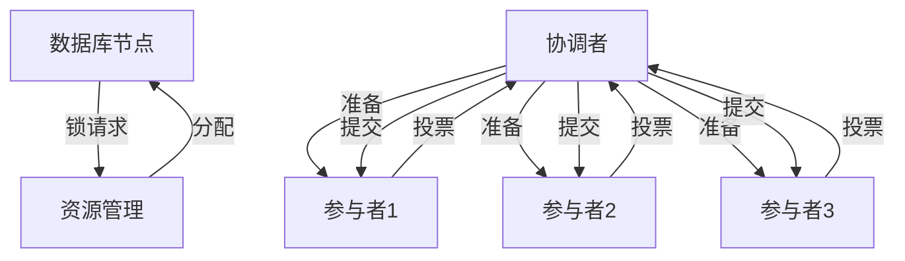
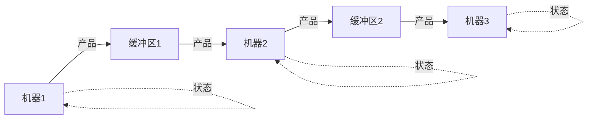
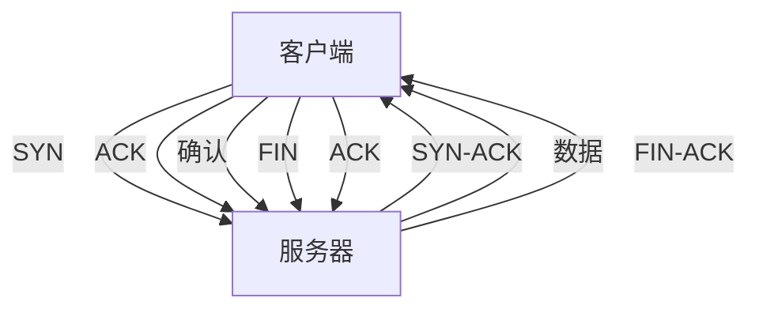

# 1.4.5 典型工程案例

## 目录

1.4.5.1 主题概述  
1.4.5.2 实际系统案例  
1.4.5.3 Petri网建模与分析  
1.4.5.4 Lean实现与自动化  
1.4.5.5 图表与多表征  
1.4.5.6 相关性与交叉引用  
1.4.5.7 参考文献与延伸阅读  

---

### 1.4.5.1 主题概述

本节选取典型工程系统，展示Petri网在实际分布式与并发系统中的建模与分析应用。

### 1.4.5.2 实际系统案例

#### 分布式数据库事务管理

- **两阶段提交协议**：协调分布式事务的提交过程
- **分布式锁管理**：确保数据一致性和并发控制
- **故障恢复机制**：处理节点故障和网络分区

#### 并发生产线调度

- **资源分配优化**：最大化生产效率和资源利用率
- **瓶颈识别与消除**：识别和解决生产瓶颈
- **动态调度策略**：根据实时状态调整生产计划

#### 网络协议同步机制

- **TCP连接管理**：连接建立、数据传输、连接释放
- **路由协议同步**：路由信息的传播和收敛
- **负载均衡算法**：请求分发和负载均衡

#### 工业自动化系统

- **制造执行系统**：生产过程的监控和控制
- **机器人协调控制**：多机器人系统的协调
- **供应链管理**：供应链各环节的协调和优化

### 1.4.5.3 Petri网建模与分析

#### 系统结构建模

- **状态空间建模**：系统状态的Petri网表示
- **行为建模**：系统行为的Petri网描述
- **接口建模**：系统接口的Petri网表达

#### 资源分配分析

- **资源竞争分析**：多进程对资源的竞争
- **资源利用率优化**：最大化资源使用效率
- **资源分配策略**：公平和高效的资源分配

#### 同步与死锁分析

- **同步机制分析**：进程间的同步机制
- **死锁检测与预防**：识别和避免死锁
- **活锁分析**：分析系统的活锁情况

#### 性能分析

- **吞吐量分析**：系统的处理能力
- **响应时间分析**：系统的响应性能
- **瓶颈分析**：识别系统性能瓶颈

### 1.4.5.4 Lean实现与自动化

#### 分布式数据库事务建模

```lean
-- 分布式数据库事务的Petri网建模
structure DBTransactionNet where
  places : Type
  transitions : Type
  pre : places → transitions → Nat
  post : places → transitions → Nat
  marking : places → Nat

-- 事务状态定义
inductive TransactionState
| init : TransactionState
| prepare : TransactionState
| commit : TransactionState
| abort : TransactionState

-- 两阶段提交协议
structure TwoPhaseCommit where
  coordinator : Type
  participants : List Type
  state : TransactionState
  votes : List Bool
  decision : Option Bool

-- 事务执行
def execute_transaction (net : DBTransactionNet) (t : net.transitions) : DBTransactionNet :=
  if can_fire net t then
    { net with marking := fire_transition net t }
  else
    net
```

#### 并发生产线建模

```lean
-- 生产线Petri网建模
structure ProductionLine where
  machines : List Machine
  buffers : List Buffer
  workflow : List WorkflowStep
  capacity : Nat

-- 机器状态
inductive MachineState
| idle : MachineState
| working : MachineState
| maintenance : MachineState
| broken : MachineState

-- 缓冲区状态
structure Buffer where
  capacity : Nat
  current : Nat
  input_rate : Float
  output_rate : Float

-- 工作流步骤
structure WorkflowStep where
  from_machine : Machine
  to_machine : Machine
  processing_time : Nat
  priority : Nat
```

### 1.4.5.5 图表与多表征

#### 分布式数据库架构



#### 并发生产线流程



#### 网络协议同步



### 1.4.5.6 相关性与交叉引用

#### 理论基础

- [1.4.1-Petri网基础与建模](./1.4.1-Petri网基础与建模.md) - Petri网的基本概念和建模方法
- [1.4.2-分布式系统的Petri网表达](./1.4.2-分布式系统的Petri网表达.md) - 分布式系统的Petri网建模
- [1.4.3-并发与同步分析](./1.4.3-并发与同步分析.md) - 并发系统的Petri网分析

#### 应用领域

- [1.4.4-一致性与死锁证明](./1.4.4-一致性与死锁证明.md) - 系统一致性和死锁的Petri网证明
- [1.4.5-典型工程案例](./1.4.5-典型工程案例.md) - Petri网在实际工程中的应用案例

#### 相关理论

- [1.3-时序逻辑与控制](../1.3-时序逻辑与控制/1.3-时序逻辑与控制.md) - 时序逻辑与Petri网的结合
- [1.2-类型理论与证明](../1.2-类型理论与证明.md) - 类型论与证明论基础

#### 工程实践

- [7.2-工程实践案例](../../7-验证与工程实践/7.2-工程实践案例.md) - 形式化验证的工程实践
- [7.1-形式化验证架构](../../7-验证与工程实践/7.1-形式化验证架构.md) - 形式化验证的整体架构

### 1.4.5.7 参考文献与延伸阅读

#### 核心教材

- **《Petri网与分布式系统》** - Petri网在分布式系统中的应用
- **《Petri Nets: Properties, Analysis and Applications》** - Petri网的性质、分析与应用
- **《Modeling and Analysis of Communicating Systems》**（K. Jensen）- 通信系统的建模与分析

#### 经典论文

- **Petri, C. A. (1962).** Communication with Automata. Technical Report.
- **Murata, T. (1989).** Petri Nets: Properties, Analysis and Applications. Proceedings of the IEEE.
- **Reisig, W. (1985).** Petri Nets: An Introduction. Springer-Verlag.

#### 开源工具

- **PIPE**（Platform Independent Petri net Editor）- 平台无关的Petri网编辑器
- **WoPeD**（Workflow Petri Net Designer）- 工作流Petri网设计器
- **TAPAAL**（Timed-Arc Petri Nets）- 时间弧Petri网工具

#### 在线资源

- **Petri Nets World**：<https://www.petri-nets.org/>
- **PIPE 官网**：<https://pipe2.sourceforge.net/>
- **WoPeD 官网**：<https://woped.dhbw.de/>
- **arXiv 论文检索**：<https://arxiv.org/>
