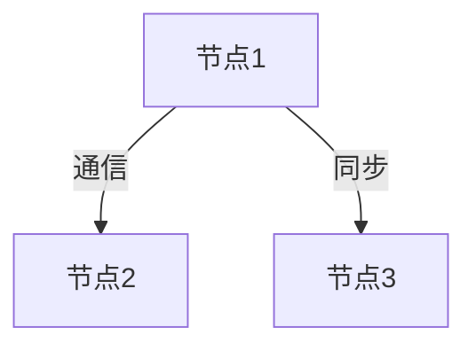
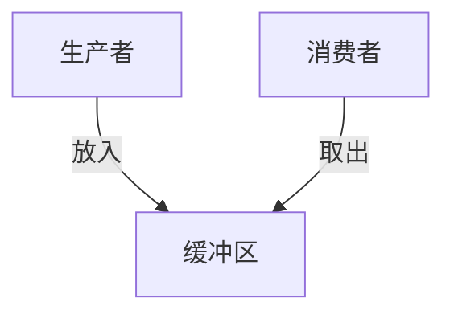
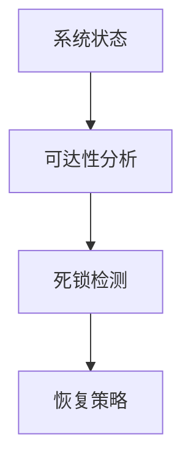

# 1.4.6 图表与多表征

## 目录

1.4.6.1 主题概述  
1.4.6.2 Petri网结构图  
1.4.6.3 分布式系统可视化  
1.4.6.4 并发与同步分析图  
1.4.6.5 死锁检测与恢复图  
1.4.6.6 相关性与交叉引用  
1.4.6.7 参考文献与延伸阅读  

---

### 1.4.6.1 主题概述

本节汇总Petri网与分布式系统相关的结构图、可视化与多表征内容，辅助理解复杂系统行为。

### 1.4.6.2 Petri网结构图

### 1.4.6.3 分布式系统可视化

### 1.4.6.4 并发与同步分析图

### 1.4.6.5 死锁检测与恢复图

### 1.4.6.6 相关性与交叉引用

- [1.4.3-并发与同步分析](./1.4.3-并发与同步分析.md)
- [1.4.4-一致性与死锁证明](./1.4.4-一致性与死锁证明.md)

### 1.4.6.7 参考文献与延伸阅读

- 《Petri网与分布式系统》
- 相关论文与开源项目
