# 1.4.6 图表与多表征

## 目录

1.4.6.1 主题概述  
1.4.6.2 Petri网结构图  
1.4.6.3 分布式系统可视化  
1.4.6.4 并发与同步分析图  
1.4.6.5 死锁检测与恢复图  
1.4.6.6 相关性与交叉引用  
1.4.6.7 参考文献与延伸阅读  

---

### 1.4.6.1 主题概述

本节汇总Petri网与分布式系统相关的结构图、可视化与多表征内容，辅助理解复杂系统行为。

### 1.4.6.2 Petri网结构图

#### 基本Petri网结构

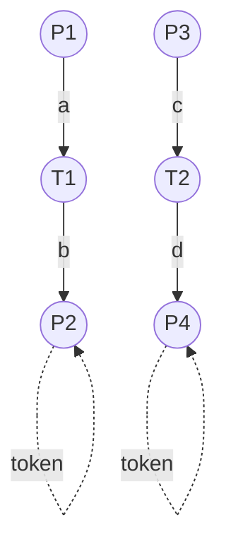

#### 并发Petri网结构

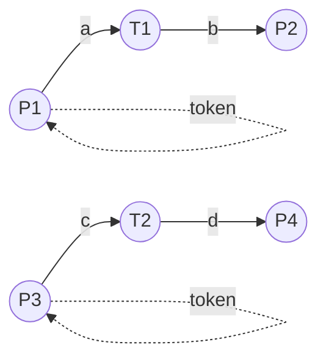

#### 同步Petri网结构

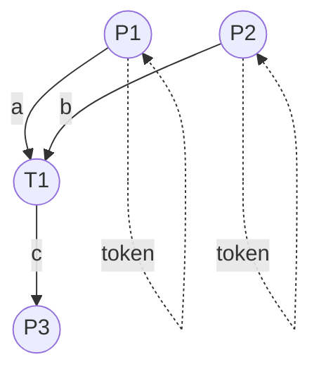

### 1.4.6.3 分布式系统可视化

#### 基本分布式系统结构

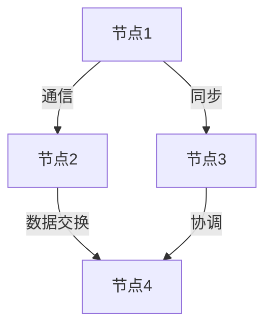

#### 分布式算法结构

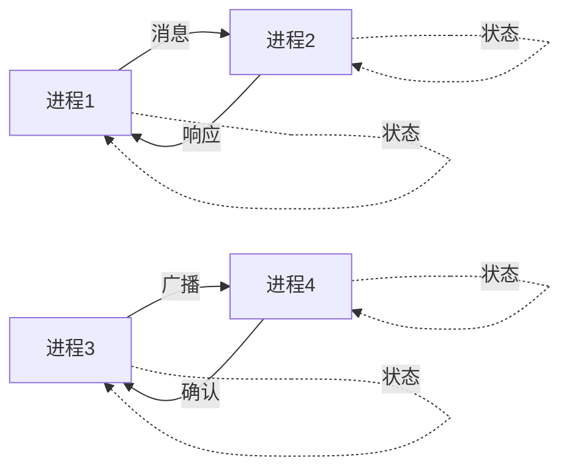

#### 分布式一致性结构

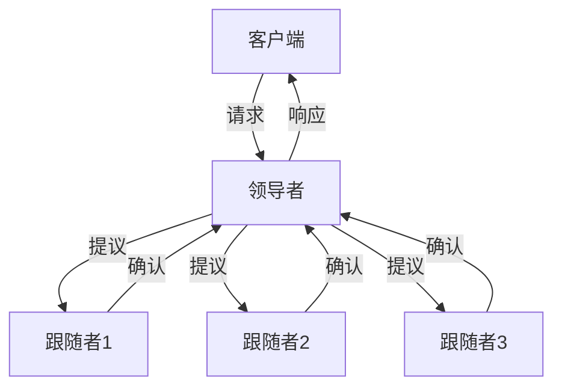

### 1.4.6.4 并发与同步分析图

#### 生产者-消费者模型

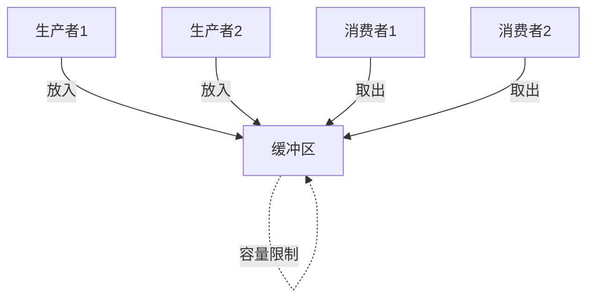

#### 读者-写者模型

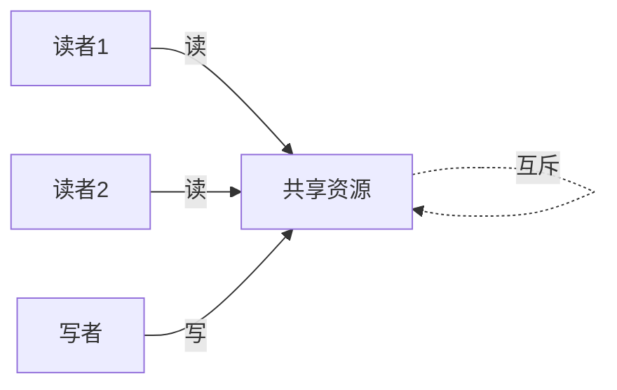

#### 哲学家就餐问题

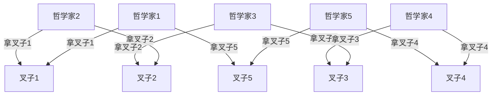

### 1.4.6.5 死锁检测与恢复图

#### 死锁检测流程

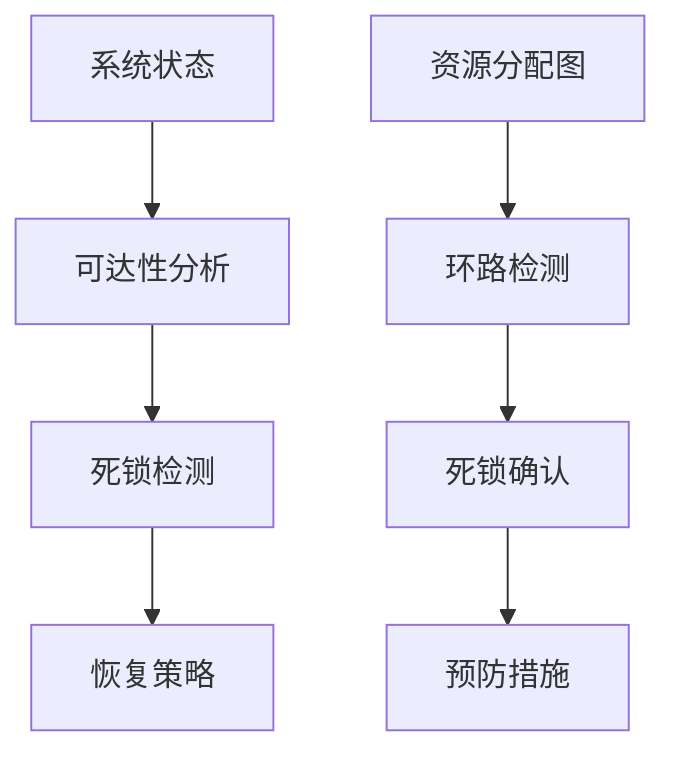

#### 资源分配图

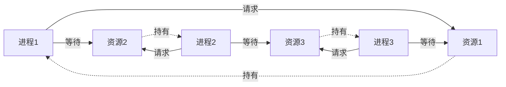

#### 死锁恢复策略

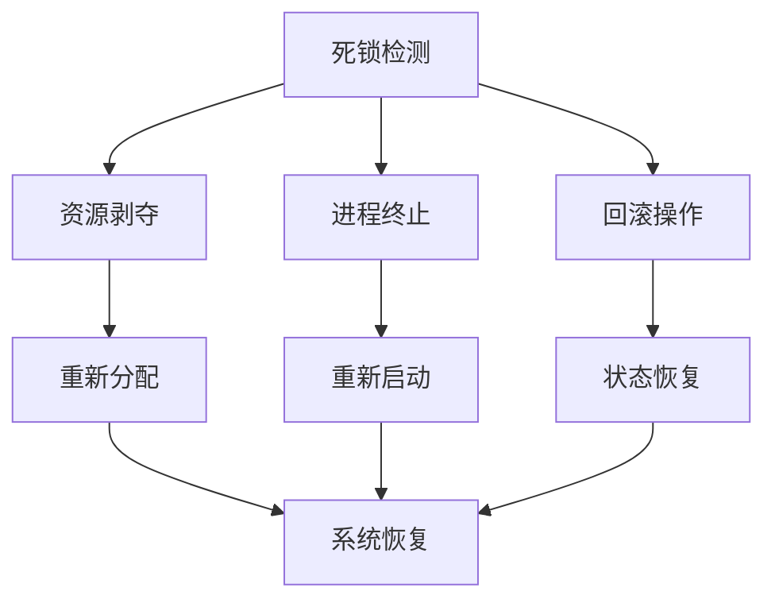

### 1.4.6.6 相关性与交叉引用

#### 理论基础

- [1.4.1-Petri网基础与建模](./1.4.1-Petri网基础与建模.md) - Petri网的基本概念和建模方法
- [1.4.2-分布式系统的Petri网表达](./1.4.2-分布式系统的Petri网表达.md) - 分布式系统的Petri网建模
- [1.4.3-并发与同步分析](./1.4.3-并发与同步分析.md) - 并发系统的Petri网分析

#### 应用领域

- [1.4.4-一致性与死锁证明](./1.4.4-一致性与死锁证明.md) - 系统一致性和死锁的Petri网证明
- [1.4.5-典型工程案例](./1.4.5-典型工程案例.md) - Petri网在实际工程中的应用案例

#### 相关理论

- [1.3-时序逻辑与控制](../1.3-时序逻辑与控制/1.3-时序逻辑与控制.md) - 时序逻辑与Petri网的结合
- [1.2-类型理论与证明](../1.2-类型理论与证明.md) - 类型论与证明论基础

#### 工程实践

- [7.2-工程实践案例](../../7-验证与工程实践/7.2-工程实践案例.md) - 形式化验证的工程实践
- [7.1-形式化验证架构](../../7-验证与工程实践/7.1-形式化验证架构.md) - 形式化验证的整体架构

### 1.4.6.7 参考文献与延伸阅读

#### 核心教材

- **《Petri网与分布式系统》** - Petri网在分布式系统中的应用
- **《Petri Nets: Properties, Analysis and Applications》** - Petri网的性质、分析与应用
- **《Modeling and Analysis of Communicating Systems》**（K. Jensen）- 通信系统的建模与分析

#### 经典论文

- **Petri, C. A. (1962).** Communication with Automata. Technical Report.
- **Murata, T. (1989).** Petri Nets: Properties, Analysis and Applications. Proceedings of the IEEE.
- **Reisig, W. (1985).** Petri Nets: An Introduction. Springer-Verlag.

#### 开源工具

- **PIPE**（Platform Independent Petri net Editor）- 平台无关的Petri网编辑器
- **WoPeD**（Workflow Petri Net Designer）- 工作流Petri网设计器
- **TAPAAL**（Timed-Arc Petri Nets）- 时间弧Petri网工具

#### 在线资源

- **Petri Nets World**：<https://www.petri-nets.org/>
- **PIPE 官网**：<https://pipe2.sourceforge.net/>
- **WoPeD 官网**：<https://woped.dhbw.de/>
- **arXiv 论文检索**：<https://arxiv.org/>
