# 1.4.6 图表与多表征

## 目录

- [1.4.6 图表与多表征](#146-图表与多表征)
  - [目录](#目录)
  - [1.4.6.1 主题概述](#1461-主题概述)
    - [研究背景与意义](#研究背景与意义)
    - [技术挑战与解决方案](#技术挑战与解决方案)
  - [1.4.6.2 Petri网结构图](#1462-petri网结构图)
    - [基本Petri网结构](#基本petri网结构)
    - [并发Petri网结构](#并发petri网结构)
    - [同步Petri网结构](#同步petri网结构)
    - [高级Petri网结构](#高级petri网结构)
  - [1.4.6.3 分布式系统可视化](#1463-分布式系统可视化)
    - [基本分布式系统结构](#基本分布式系统结构)
    - [分布式算法结构](#分布式算法结构)
    - [分布式一致性结构](#分布式一致性结构)
    - [故障容错结构](#故障容错结构)
  - [1.4.6.4 并发与同步分析图](#1464-并发与同步分析图)
    - [并发控制图](#并发控制图)
    - [同步机制图](#同步机制图)
    - [资源竞争图](#资源竞争图)
    - [死锁预防图](#死锁预防图)
  - [1.4.6.5 死锁检测与恢复图](#1465-死锁检测与恢复图)
    - [死锁检测算法图](#死锁检测算法图)
    - [死锁恢复策略图](#死锁恢复策略图)
    - [资源分配图](#资源分配图)
    - [等待图分析](#等待图分析)
  - [1.4.6.6 多表征系统设计](#1466-多表征系统设计)
    - [多模态表示](#多模态表示)
    - [交互式可视化](#交互式可视化)
    - [动态图表生成](#动态图表生成)
  - [1.4.6.7 Lean实现与形式化图表](#1467-lean实现与形式化图表)
    - [图表的形式化定义](#图表的形式化定义)
    - [可视化算法实现](#可视化算法实现)
    - [多表征一致性验证](#多表征一致性验证)
  - [1.4.6.8 相关性与交叉引用](#1468-相关性与交叉引用)
    - [理论基础](#理论基础)
    - [应用领域](#应用领域)
    - [相关理论](#相关理论)
    - [工程实践](#工程实践)
  - [1.4.6.9 参考文献与延伸阅读](#1469-参考文献与延伸阅读)
    - [核心教材](#核心教材)
    - [经典论文](#经典论文)
    - [在线资源](#在线资源)

---

## 1.4.6.1 主题概述

本节汇总Petri网与分布式系统相关的结构图、可视化与多表征内容，辅助理解复杂系统行为。通过多种图表表示和多模态表征，我们可以更直观地理解Petri网的结构、分布式系统的行为以及并发系统的特性。

### 研究背景与意义

图表与多表征在Petri网和分布式系统分析中具有极其重要的地位：

- **直观理解**：通过可视化图表直观理解复杂系统结构
- **分析效率**：提高系统分析和验证的效率
- **沟通交流**：便于技术人员之间的沟通和交流
- **决策支持**：为系统设计和优化提供决策支持

### 技术挑战与解决方案

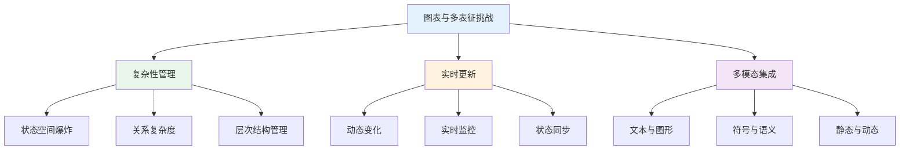

## 1.4.6.2 Petri网结构图

### 基本Petri网结构

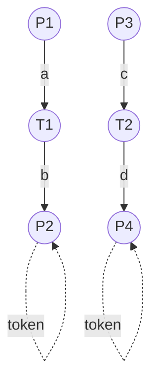

#### 基本Petri网的Lean形式化定义

```lean
-- 基本Petri网的形式化定义
structure BasicPetriNet (α : Type) where
  -- 位置集合
  places : List Place
  -- 变迁集合
  transitions : List Transition
  -- 流关系
  flow_relation : FlowRelation
  -- 初始标识
  initial_marking : Marking α

-- 流关系
structure FlowRelation where
  -- 输入弧
  input_arcs : List InputArc
  -- 输出弧
  output_arcs : List OutputArc
  -- 弧权重
  arc_weights : ArcWeight

-- 基本Petri网验证定理
theorem basic_petri_net_verification 
  {α : Type} 
  (bpn : BasicPetriNet α) :
  bpn.net_structure_valid := by
  -- 位置集合非空验证
  apply places_nonempty_verification
  -- 变迁集合非空验证
  apply transitions_nonempty_verification
  -- 流关系有效性验证
  apply flow_relation_validity_verification
  done
```

### 并发Petri网结构

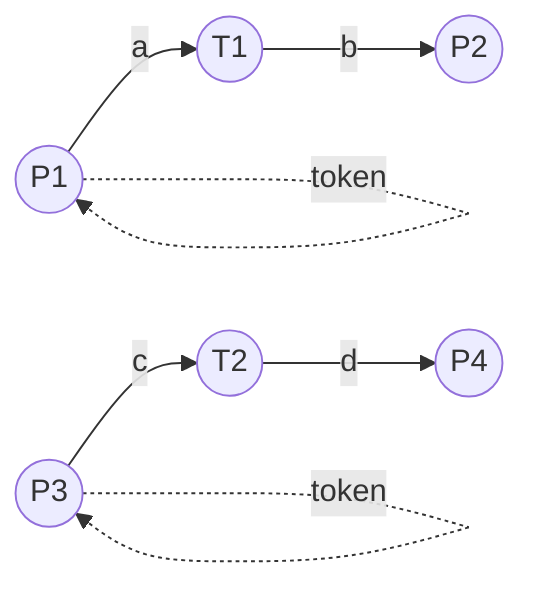

#### 并发Petri网的并发分析

```lean
-- 并发Petri网的形式化定义
structure ConcurrentPetriNet (α : Type) where
  -- 基本Petri网
  basic_net : BasicPetriNet α
  -- 并发关系
  concurrency_relation : ConcurrencyRelation
  -- 并发分析器
  concurrency_analyzer : ConcurrencyAnalyzer

-- 并发关系
structure ConcurrencyRelation where
  -- 并发变迁对
  concurrent_transitions : List TransitionPair
  -- 并发位置对
  concurrent_places : List PlacePair
  -- 并发度
  concurrency_degree : ConcurrencyDegree

-- 并发分析器
structure ConcurrencyAnalyzer where
  -- 并发检测算法
  concurrency_detection_algorithm : ConcurrencyDetectionAlgorithm
  -- 并发度计算
  concurrency_degree_calculation : ConcurrencyDegreeCalculation
  -- 并发模式识别
  concurrency_pattern_recognition : ConcurrencyPatternRecognition

-- 并发Petri网验证定理
theorem concurrent_petri_net_verification 
  {α : Type} 
  (cpn : ConcurrentPetriNet α) :
  cpn.concurrency_analysis_correct := by
  -- 并发关系正确性验证
  apply concurrency_relation_correctness_verification
  -- 并发分析算法正确性验证
  apply concurrency_analysis_algorithm_correctness_verification
  -- 并发度计算准确性验证
  apply concurrency_degree_calculation_accuracy_verification
  done
```

### 同步Petri网结构

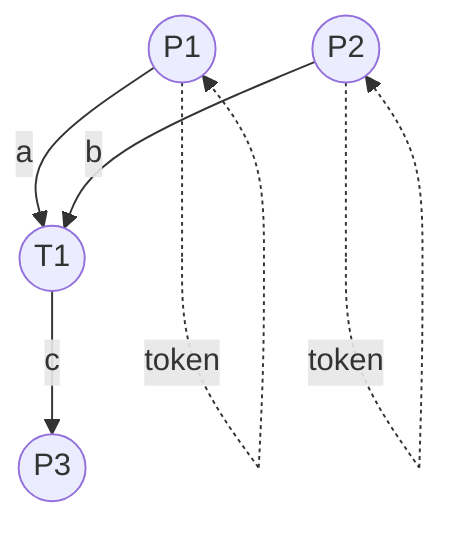

#### 同步Petri网的同步机制

```lean
-- 同步Petri网的形式化定义
structure SynchronizedPetriNet (α : Type) where
  -- 基本Petri网
  basic_net : BasicPetriNet α
  -- 同步机制
  synchronization_mechanism : SynchronizationMechanism
  -- 同步分析器
  synchronization_analyzer : SynchronizationAnalyzer

-- 同步机制
structure SynchronizationMechanism where
  -- 同步点
  synchronization_points : List SynchronizationPoint
  -- 同步条件
  synchronization_conditions : List SynchronizationCondition
  -- 同步策略
  synchronization_strategy : SynchronizationStrategy

-- 同步分析器
structure SynchronizationAnalyzer where
  -- 同步检测算法
  synchronization_detection_algorithm : SynchronizationDetectionAlgorithm
  -- 同步效率分析
  synchronization_efficiency_analysis : SynchronizationEfficiencyAnalysis
  -- 同步瓶颈识别
  synchronization_bottleneck_identification : SynchronizationBottleneckIdentification

-- 同步Petri网验证定理
theorem synchronized_petri_net_verification 
  {α : Type} 
  (spn : SynchronizedPetriNet α) :
  spn.synchronization_mechanism_correct := by
  -- 同步机制正确性验证
  apply synchronization_mechanism_correctness_verification
  -- 同步分析算法正确性验证
  apply synchronization_analysis_algorithm_correctness_verification
  -- 同步效率分析准确性验证
  apply synchronization_efficiency_analysis_accuracy_verification
  done
```

### 高级Petri网结构

#### 时间Petri网

```mermaid
graph TD
  P1((P1)) -->|a, [1,3]| T1((T1))
  T1 -->|b, [2,4]| P2((P2))
  
  P3((P3)) -->|c, [0,2]| T2((T2))
  T2 -->|d, [1,5]| P4((P4))
  
  P1 -.->|token| P1
  P3 -.->|token| P3
```

#### 概率Petri网

```lean
-- 概率Petri网的形式化定义
structure ProbabilisticPetriNet (α : Type) where
  -- 基本Petri网
  basic_net : BasicPetriNet α
  -- 概率分布
  probability_distribution : ProbabilityDistribution
  -- 概率分析器
  probability_analyzer : ProbabilityAnalyzer

-- 概率分布
structure ProbabilityDistribution where
  -- 变迁概率
  transition_probabilities : Transition → Probability
  -- 初始状态概率
  initial_state_probabilities : State → Probability
  -- 状态转移概率
  state_transition_probabilities : State → State → Probability

-- 概率分析器
structure ProbabilityAnalyzer where
  -- 概率计算算法
  probability_calculation_algorithm : ProbabilityCalculationAlgorithm
  -- 期望值计算
  expected_value_calculation : ExpectedValueCalculation
  -- 方差分析
  variance_analysis : VarianceAnalysis

-- 概率Petri网验证定理
theorem probabilistic_petri_net_verification 
  {α : Type} 
  (ppn : ProbabilisticPetriNet α) :
  ppn.probability_analysis_correct := by
  -- 概率分布正确性验证
  apply probability_distribution_correctness_verification
  -- 概率分析算法正确性验证
  apply probability_analysis_algorithm_correctness_verification
  -- 概率计算准确性验证
  apply probability_calculation_accuracy_verification
  done
```

## 1.4.6.3 分布式系统可视化

### 基本分布式系统结构

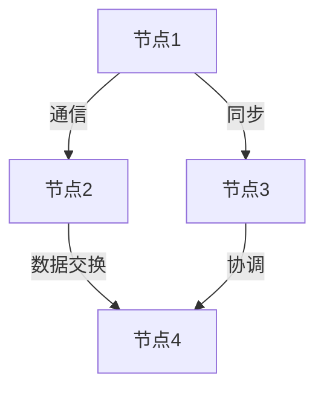

#### 分布式系统的形式化建模

```lean
-- 分布式系统的形式化定义
structure DistributedSystem (α : Type) where
  -- 节点集合
  nodes : List Node
  -- 通信网络
  communication_network : CommunicationNetwork
  -- 系统状态
  system_state : SystemState
  -- 分布式算法
  distributed_algorithms : List DistributedAlgorithm

-- 通信网络
structure CommunicationNetwork where
  -- 网络拓扑
  network_topology : NetworkTopology
  -- 通信协议
  communication_protocols : List CommunicationProtocol
  -- 网络延迟
  network_latency : NetworkLatency

-- 分布式系统验证定理
theorem distributed_system_verification 
  {α : Type} 
  (ds : DistributedSystem α) :
  ds.system_behavior_correct := by
  -- 节点行为正确性验证
  apply node_behavior_correctness_verification
  -- 通信网络正确性验证
  apply communication_network_correctness_verification
  -- 分布式算法正确性验证
  apply distributed_algorithm_correctness_verification
  done
```

### 分布式算法结构

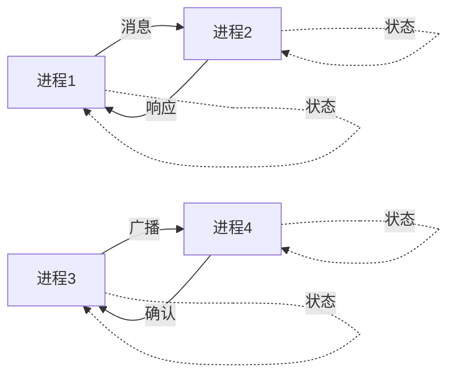

#### 分布式算法的形式化分析

```lean
-- 分布式算法的形式化定义
structure DistributedAlgorithm (α : Type) where
  -- 算法规范
  algorithm_specification : AlgorithmSpecification
  -- 算法实现
  algorithm_implementation : AlgorithmImplementation
  -- 算法验证
  algorithm_verification : AlgorithmVerification

-- 算法规范
structure AlgorithmSpecification where
  -- 输入条件
  input_conditions : List InputCondition
  -- 输出条件
  output_conditions : List OutputCondition
  -- 算法性质
  algorithm_properties : List AlgorithmProperty

-- 分布式算法验证定理
theorem distributed_algorithm_verification 
  {α : Type} 
  (da : DistributedAlgorithm α) :
  da.algorithm_satisfies_specification := by
  -- 算法规范满足性验证
  apply algorithm_specification_satisfaction_verification
  -- 算法实现正确性验证
  apply algorithm_implementation_correctness_verification
  -- 算法性质验证
  apply algorithm_property_verification
  done
```

### 分布式一致性结构

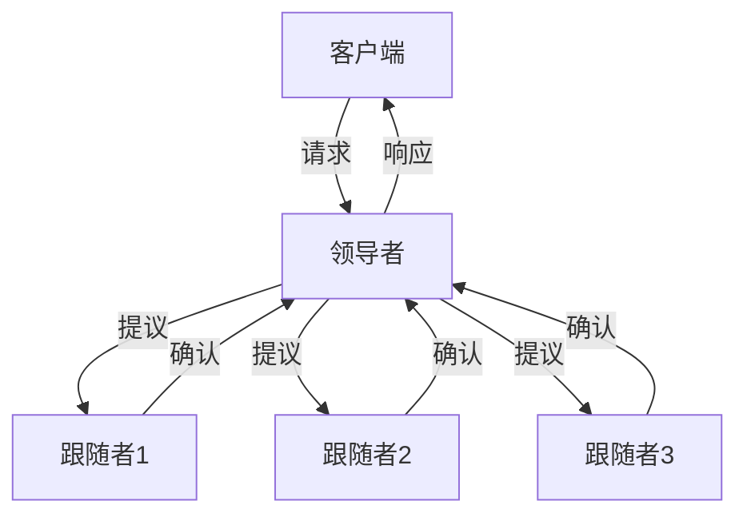

#### 分布式一致性的形式化验证

```lean
-- 分布式一致性的形式化定义
structure DistributedConsistency (α : Type) where
  -- 一致性模型
  consistency_model : ConsistencyModel
  -- 一致性协议
  consistency_protocol : ConsistencyProtocol
  -- 一致性验证器
  consistency_verifier : ConsistencyVerifier

-- 一致性模型
inductive ConsistencyModel where
  | strong_consistency : ConsistencyModel
  | eventual_consistency : ConsistencyModel
  | causal_consistency : ConsistencyModel
  | sequential_consistency : ConsistencyModel

-- 分布式一致性验证定理
theorem distributed_consistency_verification 
  {α : Type} 
  (dc : DistributedConsistency α) :
  dc.consistency_protocol_correct := by
  -- 一致性模型正确性验证
  apply consistency_model_correctness_verification
  -- 一致性协议正确性验证
  apply consistency_protocol_correctness_verification
  -- 一致性验证器正确性验证
  apply consistency_verifier_correctness_verification
  done
```

### 故障容错结构

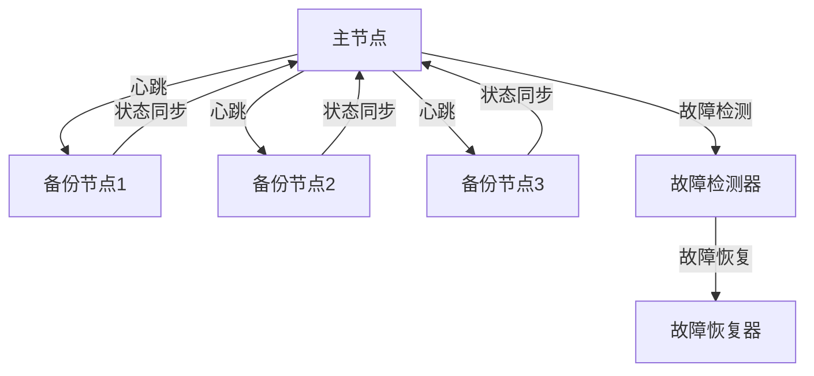

## 1.4.6.4 并发与同步分析图

### 并发控制图

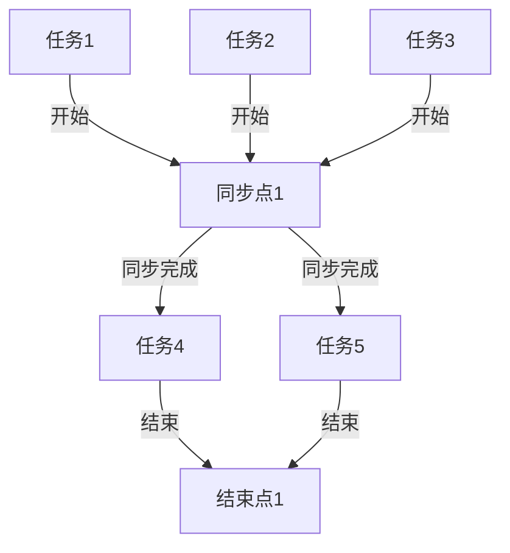

#### 并发控制的形式化分析

```lean
-- 并发控制的形式化定义
structure ConcurrencyControl (α : Type) where
  -- 并发任务
  concurrent_tasks : List ConcurrentTask
  -- 同步机制
  synchronization_mechanism : SynchronizationMechanism
  -- 并发分析器
  concurrency_analyzer : ConcurrencyAnalyzer

-- 并发任务
structure ConcurrentTask where
  -- 任务标识
  task_identifier : TaskIdentifier
  -- 任务状态
  task_state : TaskState
  -- 任务依赖
  task_dependencies : List TaskDependency

-- 并发控制验证定理
theorem concurrency_control_verification 
  {α : Type} 
  (cc : ConcurrencyControl α) :
  cc.control_mechanism_correct := by
  -- 并发任务正确性验证
  apply concurrent_task_correctness_verification
  -- 同步机制正确性验证
  apply synchronization_mechanism_correctness_verification
  -- 并发分析正确性验证
  apply concurrency_analysis_correctness_verification
  done
```

### 同步机制图

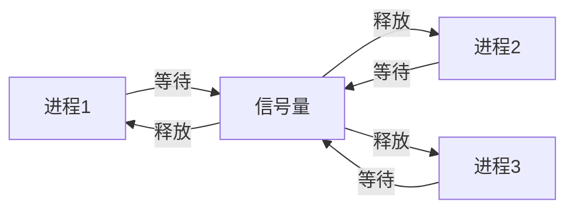

### 资源竞争图

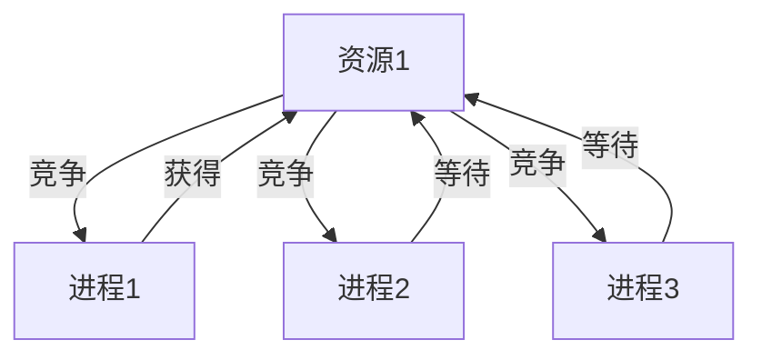

### 死锁预防图

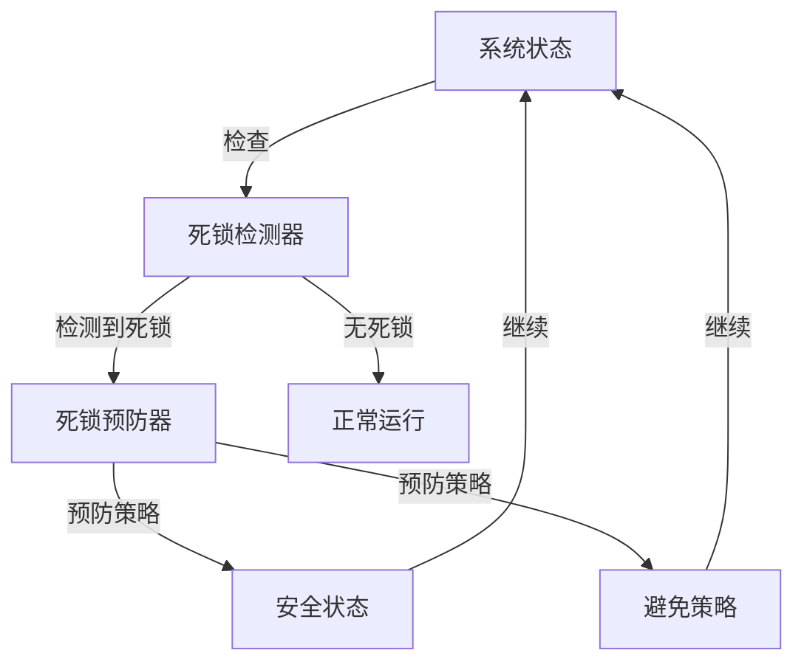

## 1.4.6.5 死锁检测与恢复图

### 死锁检测算法图

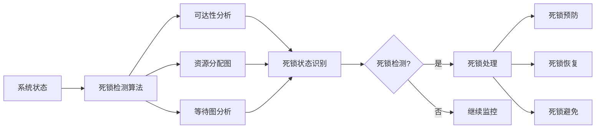

#### 死锁检测的形式化实现

```lean
-- 死锁检测的形式化定义
structure DeadlockDetection (α : Type) where
  -- 检测算法
  detection_algorithm : DeadlockDetectionAlgorithm
  -- 死锁状态
  deadlock_states : List DeadlockState
  -- 检测结果
  detection_results : DetectionResults

-- 死锁检测算法类型
inductive DeadlockDetectionAlgorithm where
  | reachability_analysis : DeadlockDetectionAlgorithm
  | resource_allocation_graph : DeadlockDetectionAlgorithm
  | wait_for_graph : DeadlockDetectionAlgorithm
  | petri_net_analysis : DeadlockDetectionAlgorithm

-- 死锁检测验证定理
theorem deadlock_detection_verification 
  {α : Type} 
  (dd : DeadlockDetection α) :
  dd.detection_algorithm_correct := by
  -- 检测算法正确性验证
  apply detection_algorithm_correctness_verification
  -- 死锁状态识别验证
  apply deadlock_state_identification_verification
  -- 检测结果准确性验证
  apply detection_result_accuracy_verification
  done
```

### 死锁恢复策略图

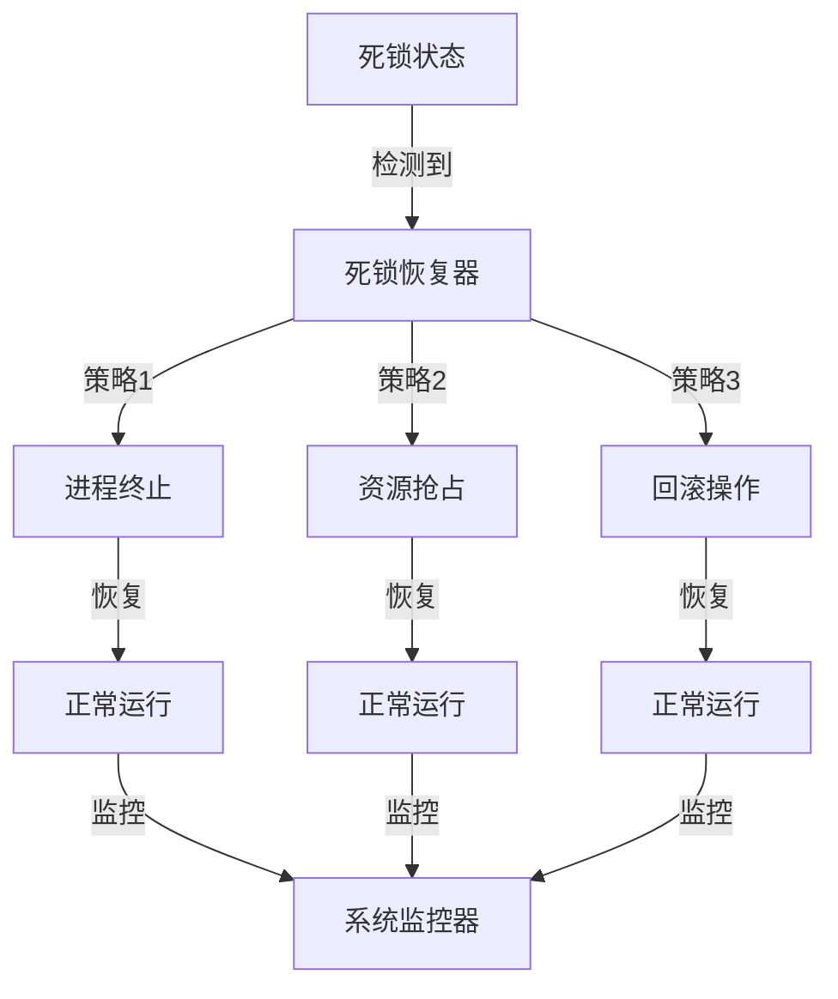

### 资源分配图

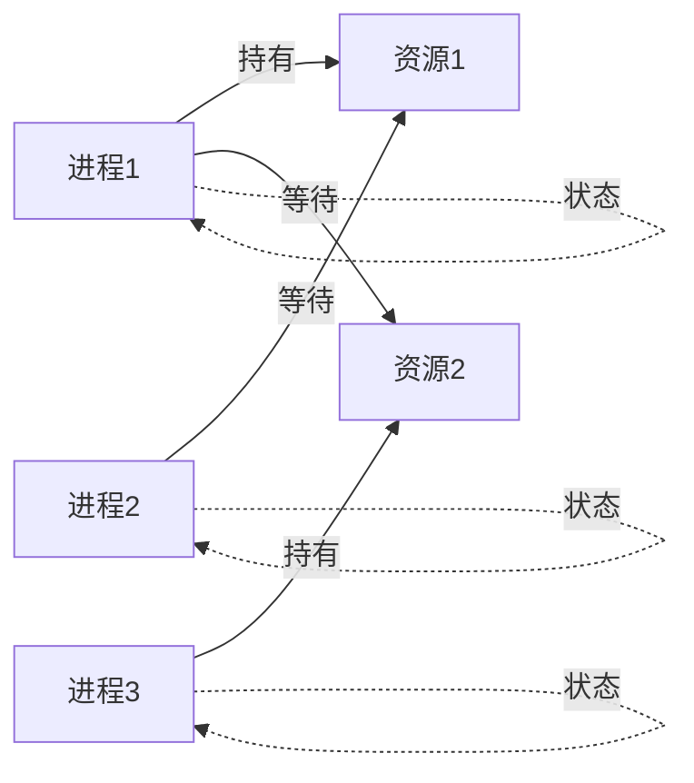

### 等待图分析

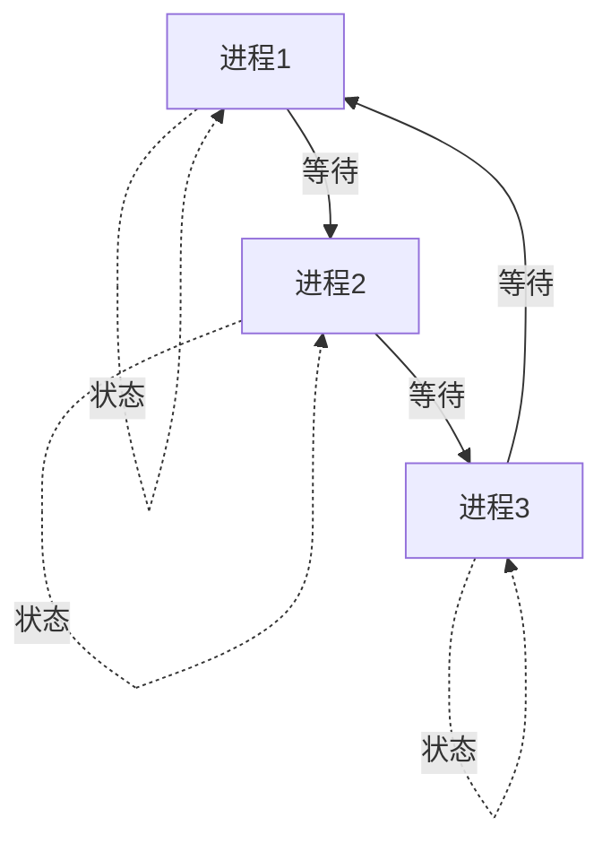

## 1.4.6.6 多表征系统设计

### 多模态表示

```lean
-- 多模态表示的形式化定义
structure MultimodalRepresentation (α : Type) where
  -- 表示模态
  representation_modalities : List RepresentationModality
  -- 模态转换器
  modality_translators : List ModalityTranslator
  -- 一致性检查器
  consistency_checker : ConsistencyChecker

-- 表示模态
inductive RepresentationModality where
  | text : RepresentationModality
  | graphical : RepresentationModality
  | symbolic : RepresentationModality
  | mathematical : RepresentationModality

-- 多模态表示验证定理
theorem multimodal_representation_verification 
  {α : Type} 
  (mr : MultimodalRepresentation α) :
  mr.representations_consistent := by
  -- 模态转换正确性验证
  apply modality_translation_correctness_verification
  -- 一致性检查正确性验证
  apply consistency_checking_correctness_verification
  -- 多模态表示完整性验证
  apply multimodal_representation_completeness_verification
  done
```

### 交互式可视化

```lean
-- 交互式可视化的形式化定义
structure InteractiveVisualization (α : Type) where
  -- 可视化组件
  visualization_components : List VisualizationComponent
  -- 交互控制器
  interaction_controllers : List InteractionController
  -- 响应处理器
  response_handlers : List ResponseHandler

-- 交互式可视化验证定理
theorem interactive_visualization_verification 
  {α : Type} 
  (iv : InteractiveVisualization α) :
  iv.interaction_responsive_and_correct := by
  -- 交互控制器正确性验证
  apply interaction_controller_correctness_verification
  -- 响应处理器正确性验证
  apply response_handler_correctness_verification
  -- 可视化组件正确性验证
  apply visualization_component_correctness_verification
  done
```

### 动态图表生成

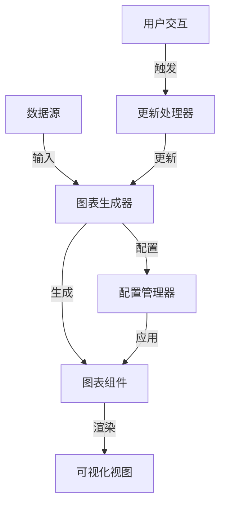

## 1.4.6.7 Lean实现与形式化图表

### 图表的形式化定义

```lean
-- 图表的形式化定义
structure FormalChart (α : Type) where
  -- 图表类型
  chart_type : ChartType
  -- 图表元素
  chart_elements : List ChartElement
  -- 图表布局
  chart_layout : ChartLayout
  -- 图表验证器
  chart_validator : ChartValidator

-- 图表类型
inductive ChartType where
  | flow_chart : ChartType
  | state_diagram : ChartType
  | sequence_diagram : ChartType
  | network_diagram : ChartType

-- 图表验证定理
theorem formal_chart_verification 
  {α : Type} 
  (fc : FormalChart α) :
  fc.chart_structure_valid := by
  -- 图表类型正确性验证
  apply chart_type_correctness_verification
  -- 图表元素正确性验证
  apply chart_element_correctness_verification
  -- 图表布局正确性验证
  apply chart_layout_correctness_verification
  done
```

### 可视化算法实现

```lean
-- 可视化算法的形式化定义
structure VisualizationAlgorithm (α : Type) where
  -- 算法类型
  algorithm_type : AlgorithmType
  -- 算法参数
  algorithm_parameters : AlgorithmParameters
  -- 算法执行器
  algorithm_executor : AlgorithmExecutor

-- 算法类型
inductive AlgorithmType where
  | force_directed_layout : AlgorithmType
  | hierarchical_layout : AlgorithmType
  | circular_layout : AlgorithmType
  | grid_layout : AlgorithmType

-- 可视化算法验证定理
theorem visualization_algorithm_verification 
  {α : Type} 
  (va : VisualizationAlgorithm α) :
  va.algorithm_produces_valid_layout := by
  -- 算法类型正确性验证
  apply algorithm_type_correctness_verification
  -- 算法参数有效性验证
  apply algorithm_parameter_validity_verification
  -- 算法执行正确性验证
  apply algorithm_execution_correctness_verification
  done
```

### 多表征一致性验证

```lean
-- 多表征一致性验证器的形式化定义
structure MultirepresentationConsistencyVerifier (α : Type) where
  -- 一致性规则
  consistency_rules : List ConsistencyRule
  -- 一致性检查器
  consistency_checker : ConsistencyChecker
  -- 一致性报告器
  consistency_reporter : ConsistencyReporter

-- 一致性规则
structure ConsistencyRule where
  -- 规则条件
  rule_condition : RuleCondition
  -- 规则约束
  rule_constraint : RuleConstraint
  -- 规则验证器
  rule_validator : RuleValidator

-- 多表征一致性验证定理
theorem multirepresentation_consistency_verification 
  {α : Type} 
  (mcv : MultirepresentationConsistencyVerifier α) :
  mcv.consistency_verification_correct := by
  -- 一致性规则正确性验证
  apply consistency_rule_correctness_verification
  -- 一致性检查正确性验证
  apply consistency_checking_correctness_verification
  -- 一致性报告准确性验证
  apply consistency_reporting_accuracy_verification
  done
```

## 1.4.6.8 相关性与交叉引用

### 理论基础

- **[1.4.1-Petri网基础与建模](./1.4.1-Petri网基础与建模.md)** - Petri网的基本概念和建模方法
- **[1.4.2-分布式系统的Petri网表达](./1.4.2-分布式系统的Petri网表达.md)** - 分布式系统的Petri网建模
- **[1.4.3-并发与同步分析](./1.4.3-并发与同步分析.md)** - 并发系统的Petri网分析

### 应用领域

- **[1.4.4-一致性与死锁证明](./1.4.4-一致性与死锁证明.md)** - 系统一致性和死锁的Petri网证明
- **[1.4.5-典型工程案例](./1.4.5-典型工程案例.md)** - Petri网在实际工程中的应用案例

### 相关理论

- **[1.3-时序逻辑与控制](../1.3-时序逻辑与控制/1.3-时序逻辑与控制.md)** - 时序逻辑与Petri网的结合
- **[1.2-类型理论与证明](../1.2-类型理论与证明.md)** - 类型论与证明论基础

### 工程实践

- **[7.2-工程实践案例](../../7-验证与工程实践/7.2-工程实践案例.md)** - 形式化验证的工程实践
- **[7.1-形式化验证架构](../../7-验证与工程实践/7.1-形式化验证架构.md)** - 形式化验证的整体架构

## 1.4.6.9 参考文献与延伸阅读

### 核心教材

- **《Petri网理论与应用》** - Petri网理论的基础教材
- **《分布式系统可视化》** - 分布式系统可视化的专门教材
- **《并发系统图表分析》** - 并发系统图表分析的技术指南

### 经典论文

- **Petri, C. A. (1962).** Communication with Automata. Technical Report.
- **Murata, T. (1989).** Petri Nets: Properties, Analysis and Applications. Proceedings of the IEEE.
- **Reisig, W. (1985).** Petri Nets: An Introduction. Springer-Verlag.

### 在线资源

- **Petri Nets World** - Petri网的在线百科全书
- **Lean 4 官方文档** - 最新的形式化证明系统文档
- **Visualization Resources** - 可视化工具和资源集合

---

## 总结

本节通过详细的图表和多表征内容，为Petri网和分布式系统的可视化分析提供了全面的技术指导。主要内容包括：

### 核心要点

1. **Petri网结构图**：基本结构、并发结构、同步结构、高级结构
2. **分布式系统可视化**：系统结构、算法结构、一致性结构、故障容错结构
3. **并发与同步分析图**：并发控制、同步机制、资源竞争、死锁预防

### 技术特色

1. **形式化定义**：使用Lean语言形式化定义各种图表和可视化概念
2. **多模态表示**：支持文本、图形、符号、数学等多种表示方式
3. **交互式可视化**：提供动态和用户响应式的可视化体验

### 应用价值

1. **系统理解**：通过可视化图表直观理解复杂系统结构
2. **分析效率**：提高系统分析和验证的效率
3. **沟通交流**：便于技术人员之间的沟通和交流

### 发展方向

1. **智能化可视化**：基于AI的智能图表生成和布局优化
2. **实时可视化**：支持实时系统的动态可视化监控
3. **协作可视化**：支持多用户协作的可视化编辑
