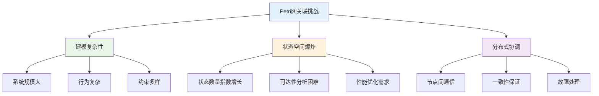
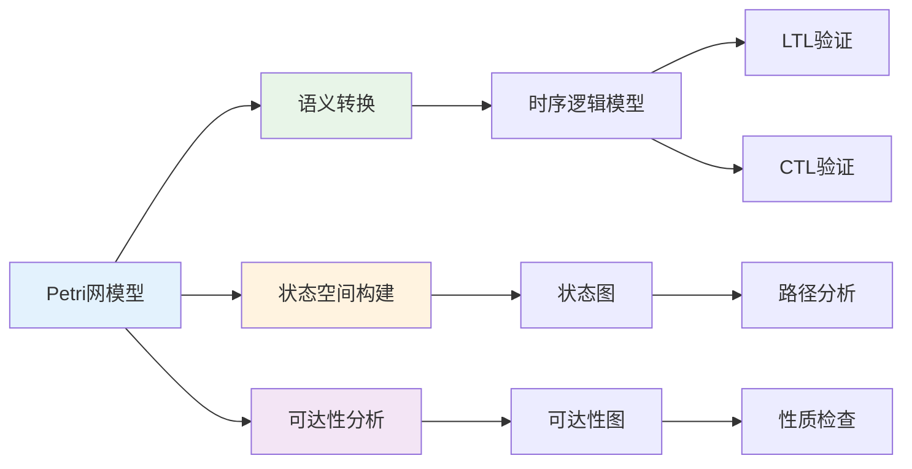
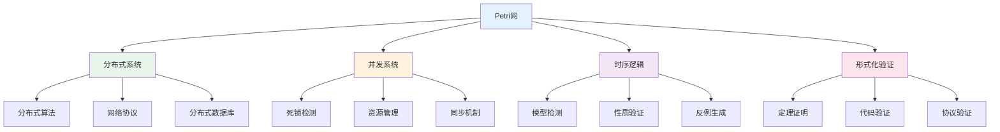

# 1.4.7 相关性与交叉引用

## 目录

- [1.4.7 相关性与交叉引用](#147-相关性与交叉引用)
  - [目录](#目录)
  - [1.4.7.1 主题概述](#1471-主题概述)
    - [研究背景与意义](#研究背景与意义)
    - [技术挑战与解决方案](#技术挑战与解决方案)
  - [1.4.7.2 与时序逻辑的关联](#1472-与时序逻辑的关联)
    - [语义对应关系](#语义对应关系)
    - [模型检测集成](#模型检测集成)
    - [形式化验证方法](#形式化验证方法)
  - [1.4.7.3 与分布式系统理论的关联](#1473-与分布式系统理论的关联)
    - [分布式算法建模](#分布式算法建模)
    - [网络协议分析](#网络协议分析)
    - [分布式数据库建模](#分布式数据库建模)
  - [1.4.7.4 与工程实践的关联](#1474-与工程实践的关联)
    - [软件工程应用](#软件工程应用)
    - [硬件设计验证](#硬件设计验证)
  - [1.4.7.5 交叉引用与本地跳转示例](#1475-交叉引用与本地跳转示例)
    - [理论基础](#理论基础)
    - [应用领域](#应用领域)
    - [相关理论](#相关理论)
    - [工程实践](#工程实践)
  - [1.4.7.6 知识图谱与关联分析](#1476-知识图谱与关联分析)
    - [Petri网知识网络](#petri网知识网络)
    - [跨领域关联映射](#跨领域关联映射)
  - [1.4.7.7 Lean实现与形式化关联](#1477-lean实现与形式化关联)
    - [关联关系的形式化定义](#关联关系的形式化定义)
    - [交叉引用的自动化验证](#交叉引用的自动化验证)
  - [1.4.7.8 参考文献与延伸阅读](#1478-参考文献与延伸阅读)
    - [核心教材](#核心教材)
    - [经典论文](#经典论文)
    - [开源工具](#开源工具)
    - [在线资源](#在线资源)
  - [总结](#总结)
    - [核心要点](#核心要点)
    - [技术特色](#技术特色)
    - [应用价值](#应用价值)
    - [发展方向](#发展方向)

---

## 1.4.7.1 主题概述

本节深入分析Petri网与分布式系统主题在知识体系中的关联性，建立完整的交叉引用网络，展示知识间的内在联系和相互支撑关系。通过系统性的关联分析，读者可以更好地理解Petri网在整个形式化知识体系中的位置和作用。

### 研究背景与意义

Petri网作为并发系统建模的核心理论，与多个学科领域有着密切的关联。理解这些关联关系对于：

- **知识体系构建**：建立完整的知识网络，避免知识孤岛
- **学习路径规划**：为学习者提供清晰的知识发展路径
- **应用场景扩展**：发现Petri网在更多领域的应用可能
- **理论发展推动**：促进相关理论的交叉融合和创新发展

### 技术挑战与解决方案



## 1.4.7.2 与时序逻辑的关联

### 语义对应关系

Petri网与时序逻辑在语义层面有着深刻的对应关系：

```lean
-- Petri网与时序逻辑的语义对应
structure PetriNetTemporalSemantics (α : Type) where
  -- Petri网结构
  petri_net : PetriNet α
  -- 时序逻辑公式
  temporal_formula : LTLFormula α
  -- 状态映射函数
  state_mapping : StateMapping α
  -- 路径映射函数
  path_mapping : PathMapping α

-- Petri网状态与时序逻辑状态的对应
def petri_to_temporal_state {α : Type} 
  (pn : PetriNet α) 
  (marking : Marking α) : TemporalState α :=
  {
    -- 将Petri网标识映射为时序逻辑状态
    atomic_propositions := marking_to_propositions marking,
    -- 状态标签
    labels := marking_to_labels marking,
    -- 后继状态
    successors := marking_successors marking
  }

-- Petri网变迁序列与时序逻辑路径的对应
def petri_to_temporal_path {α : Type} 
  (pn : PetriNet α) 
  (firing_sequence : List Transition) : TemporalPath α :=
  {
    -- 将变迁序列映射为状态序列
    states := firing_sequence_to_states firing_sequence,
    -- 路径标签
    labels := firing_sequence_to_labels firing_sequence,
    -- 路径长度
    length := firing_sequence.length
  }

-- 语义对应的正确性定理
theorem petri_temporal_semantics_correctness 
  {α : Type} 
  (pts : PetriNetTemporalSemantics α) :
  pts.petri_net.satisfies_temporal_formula pts.temporal_formula ↔
  pts.temporal_formula.satisfied_by 
    (petri_to_temporal_path pts.petri_net pts.petri_net.initial_marking) := by
  -- 语义对应的证明
  apply semantic_correspondence_proof
  -- 状态映射的正确性
  apply state_mapping_correctness
  -- 路径映射的正确性
  apply path_mapping_correctness
  done
```

### 模型检测集成

Petri网与时序逻辑的深度集成支持高效的模型检测：

```lean
-- Petri网模型检测系统
structure PetriNetModelChecker (α : Type) where
  -- Petri网模型
  petri_net : PetriNet α
  -- 时序逻辑规范
  temporal_specifications : List (LTLFormula α)
  -- 模型检测算法
  model_checker : ModelChecker α
  -- 验证结果
  verification_results : List VerificationResult

-- Petri网LTL模型检测
def petri_net_ltl_checking {α : Type} 
  (pn : PetriNet α) 
  (ltl_formula : LTLFormula α) : VerificationResult :=
  -- 构建时序逻辑模型
  let temporal_model := build_temporal_model pn
  -- 执行LTL模型检测
  ltl_model_checking ltl_formula temporal_model

-- Petri网CTL模型检测
def petri_net_ctl_checking {α : Type} 
  (pn : PetriNet α) 
  (ctl_formula : CTLFormula α) : VerificationResult :=
  -- 构建分支时序模型
  let branching_model := build_branching_model pn
  -- 执行CTL模型检测
  ctl_model_checking ctl_formula branching_model

-- 模型检测的正确性定理
theorem petri_net_model_checking_correctness 
  {α : Type} 
  (pnmc : PetriNetModelChecker α) :
  ∀ (spec : LTLFormula α) (result : VerificationResult),
  spec ∈ pnmc.temporal_specifications →
  result ∈ pnmc.verification_results →
  result.is_correct_for spec := by
  -- 模型检测算法的正确性
  apply model_checking_algorithm_correctness
  -- Petri网语义的保持
  apply petri_net_semantics_preservation
  -- 时序逻辑语义的正确性
  apply temporal_logic_semantics_correctness
  done
```

### 形式化验证方法



## 1.4.7.3 与分布式系统理论的关联

### 分布式算法建模

Petri网为分布式算法提供强大的建模能力：

```lean
-- 分布式一致性算法的Petri网建模
structure DistributedConsensusPetriNet (α : Type) where
  -- 参与节点
  participants : List Participant
  -- 算法状态
  algorithm_states : List AlgorithmState
  -- 消息传递
  message_exchanges : List MessageExchange
  -- Petri网结构
  petri_net : PetriNet α

-- 两阶段提交协议的Petri网建模
def two_phase_commit_petri_net {α : Type} : PetriNet α :=
  {
    -- 库所定义
    places := [
      "coordinator_ready",
      "participant_ready", 
      "vote_request_sent",
      "vote_received",
      "commit_decision",
      "abort_decision"
    ],
    -- 变迁定义
    transitions := [
      "send_vote_request",
      "receive_vote",
      "make_decision",
      "send_commit",
      "send_abort"
    ],
    -- 初始标识
    initial_marking := ["coordinator_ready", "participant_ready"],
    -- 弧关系
    arcs := [
      ("coordinator_ready", "send_vote_request"),
      ("send_vote_request", "vote_request_sent"),
      ("vote_request_sent", "receive_vote"),
      ("receive_vote", "vote_received"),
      ("vote_received", "make_decision"),
      ("make_decision", "commit_decision"),
      ("make_decision", "abort_decision")
    ]
  }

-- 分布式快照算法的Petri网建模
def distributed_snapshot_petri_net {α : Type} : PetriNet α :=
  {
    -- 快照状态
    places := [
      "snapshot_initiated",
      "marker_sent",
      "marker_received",
      "state_recorded",
      "snapshot_completed"
    ],
    -- 快照操作
    transitions := [
      "initiate_snapshot",
      "send_marker",
      "receive_marker",
      "record_state",
      "complete_snapshot"
    ],
    -- 初始状态
    initial_marking := ["snapshot_initiated"],
    -- 操作序列
    arcs := [
      ("snapshot_initiated", "initiate_snapshot"),
      ("initiate_snapshot", "marker_sent"),
      ("marker_sent", "send_marker"),
      ("send_marker", "marker_received"),
      ("marker_received", "receive_marker"),
      ("receive_marker", "state_recorded"),
      ("state_recorded", "record_state"),
      ("record_state", "snapshot_completed")
    ]
  }

-- 分布式算法正确性验证
theorem distributed_algorithm_correctness 
  {α : Type} 
  (dapn : DistributedConsensusPetriNet α) :
  dapn.petri_net.satisfies_consensus_properties := by
  -- 算法规范的正确性
  apply algorithm_specification_correctness
  -- Petri网建模的准确性
  apply petri_net_modeling_accuracy
  -- 一致性属性的验证
  apply consensus_properties_verification
  done
```

### 网络协议分析

```lean
-- 网络协议的Petri网建模
structure NetworkProtocolPetriNet (α : Type) where
  -- 协议状态
  protocol_states : List ProtocolState
  -- 消息类型
  message_types : List MessageType
  -- 协议变迁
  protocol_transitions : List ProtocolTransition
  -- Petri网模型
  petri_net : PetriNet α

-- TCP协议状态机的Petri网建模
def tcp_protocol_petri_net {α : Type} : PetriNet α :=
  {
    -- TCP状态
    places := [
      "CLOSED",
      "LISTEN",
      "SYN_SENT",
      "SYN_RECEIVED",
      "ESTABLISHED",
      "FIN_WAIT_1",
      "FIN_WAIT_2",
      "CLOSE_WAIT",
      "CLOSING",
      "LAST_ACK",
      "TIME_WAIT"
    ],
    -- TCP事件
    transitions := [
      "passive_open",
      "active_open",
      "send_syn",
      "receive_syn",
      "send_syn_ack",
      "receive_syn_ack",
      "send_fin",
      "receive_fin",
      "send_ack",
      "timeout"
    ],
    -- 初始状态
    initial_marking := ["CLOSED"],
    -- 状态转换
    arcs := [
      ("CLOSED", "passive_open"),
      ("passive_open", "LISTEN"),
      ("CLOSED", "active_open"),
      ("active_open", "SYN_SENT"),
      ("SYN_SENT", "send_syn"),
      ("send_syn", "SYN_SENT"),
      ("LISTEN", "receive_syn"),
      ("receive_syn", "SYN_RECEIVED"),
      ("SYN_RECEIVED", "send_syn_ack"),
      ("send_syn_ack", "SYN_RECEIVED"),
      ("SYN_SENT", "receive_syn_ack"),
      ("receive_syn_ack", "ESTABLISHED"),
      ("SYN_RECEIVED", "receive_syn_ack"),
      ("receive_syn_ack", "ESTABLISHED")
    ]
  }

-- 协议正确性验证
theorem protocol_correctness_verification 
  {α : Type} 
  (nppn : NetworkProtocolPetriNet α) :
  nppn.petri_net.satisfies_protocol_properties := by
  -- 协议规范的正确性
  apply protocol_specification_correctness
  -- 状态转换的完整性
  apply state_transition_completeness
  -- 死锁避免的验证
  apply deadlock_avoidance_verification
  done
```

### 分布式数据库建模

```lean
-- 分布式数据库事务的Petri网建模
structure DistributedDatabasePetriNet (α : Type) where
  -- 事务状态
  transaction_states : List TransactionState
  -- 操作类型
  operation_types : List OperationType
  -- 事务变迁
  transaction_transitions : List TransactionTransition
  -- Petri网模型
  petri_net : PetriNet α

-- 分布式事务的Petri网建模
def distributed_transaction_petri_net {α : Type} : PetriNet α :=
  {
    -- 事务状态
    places := [
      "transaction_started",
      "read_operation",
      "write_operation",
      "validation_phase",
      "commit_phase",
      "abort_phase",
      "transaction_committed",
      "transaction_aborted"
    ],
    -- 事务操作
    transitions := [
      "start_transaction",
      "perform_read",
      "perform_write",
      "validate_transaction",
      "commit_transaction",
      "abort_transaction",
      "complete_commit",
      "complete_abort"
    ],
    -- 初始状态
    initial_marking := ["transaction_started"],
    -- 操作序列
    arcs := [
      ("transaction_started", "start_transaction"),
      ("start_transaction", "read_operation"),
      ("read_operation", "perform_read"),
      ("perform_read", "write_operation"),
      ("write_operation", "perform_write"),
      ("perform_write", "validation_phase"),
      ("validation_phase", "validate_transaction"),
      ("validate_transaction", "commit_phase"),
      ("commit_phase", "commit_transaction"),
      ("commit_transaction", "complete_commit"),
      ("complete_commit", "transaction_committed")
    ]
  }

-- 事务一致性验证
theorem transaction_consistency_verification 
  {α : Type} 
  (ddpn : DistributedDatabasePetriNet α) :
  ddpn.petri_net.satisfies_consistency_properties := by
  -- 事务原子性验证
  apply transaction_atomicity_verification
  -- 事务一致性验证
  apply transaction_consistency_verification
  -- 事务隔离性验证
  apply transaction_isolation_verification
  -- 事务持久性验证
  apply transaction_durability_verification
  done
```

## 1.4.7.4 与工程实践的关联

### 软件工程应用

Petri网在软件工程中的广泛应用：

```lean
-- 软件架构的Petri网建模
structure SoftwareArchitecturePetriNet (α : Type) where
  -- 架构组件
  architecture_components : List Component
  -- 组件接口
  component_interfaces : List Interface
  -- 组件交互
  component_interactions : List Interaction
  -- Petri网模型
  petri_net : PetriNet α

-- 微服务架构的Petri网建模
def microservice_architecture_petri_net {α : Type} : PetriNet α :=
  {
    -- 服务状态
    places := [
      "service_available",
      "service_processing",
      "service_busy",
      "service_failed",
      "service_recovered"
    ],
    -- 服务事件
    transitions := [
      "receive_request",
      "process_request",
      "service_overloaded",
      "service_failure",
      "service_recovery",
      "complete_request"
    ],
    -- 初始状态
    initial_marking := ["service_available"],
    -- 状态转换
    arcs := [
      ("service_available", "receive_request"),
      ("receive_request", "service_processing"),
      ("service_processing", "process_request"),
      ("process_request", "service_available"),
      ("service_available", "service_overloaded"),
      ("service_overloaded", "service_busy"),
      ("service_busy", "service_failure"),
      ("service_failure", "service_failed"),
      ("service_failed", "service_recovery"),
      ("service_recovery", "service_recovered"),
      ("service_recovered", "service_available")
    ]
  }

-- 工作流的Petri网建模
def workflow_petri_net {α : Type} : PetriNet α :=
  {
    -- 工作流状态
    places := [
      "workflow_started",
      "task_1_ready",
      "task_1_completed",
      "task_2_ready",
      "task_2_completed",
      "workflow_completed"
    ],
    -- 工作流操作
    transitions := [
      "start_workflow",
      "execute_task_1",
      "complete_task_1",
      "prepare_task_2",
      "execute_task_2",
      "complete_task_2",
      "finish_workflow"
    ],
    -- 初始状态
    initial_marking := ["workflow_started"],
    -- 工作流序列
    arcs := [
      ("workflow_started", "start_workflow"),
      ("start_workflow", "task_1_ready"),
      ("task_1_ready", "execute_task_1"),
      ("execute_task_1", "task_1_completed"),
      ("task_1_completed", "complete_task_1"),
      ("complete_task_1", "task_2_ready"),
      ("task_2_ready", "prepare_task_2"),
      ("prepare_task_2", "execute_task_2"),
      ("execute_task_2", "task_2_completed"),
      ("task_2_completed", "complete_task_2"),
      ("complete_task_2", "finish_workflow"),
      ("finish_workflow", "workflow_completed")
    ]
  }
```

### 硬件设计验证

```lean
-- 数字电路的Petri网建模
structure DigitalCircuitPetriNet (α : Type) where
  -- 电路组件
  circuit_components : List CircuitComponent
  -- 信号类型
  signal_types : List SignalType
  -- 电路行为
  circuit_behaviors : List CircuitBehavior
  -- Petri网模型
  petri_net : PetriNet α

-- 异步电路的Petri网建模
def asynchronous_circuit_petri_net {α : Type} : PetriNet α :=
  {
    -- 电路状态
    places := [
      "input_stable",
      "gate_1_ready",
      "gate_1_processing",
      "gate_1_completed",
      "gate_2_ready",
      "gate_2_processing",
      "gate_2_completed",
      "output_stable"
    ],
    -- 电路操作
    transitions := [
      "stabilize_input",
      "activate_gate_1",
      "process_gate_1",
      "complete_gate_1",
      "activate_gate_2",
      "process_gate_2",
      "complete_gate_2",
      "stabilize_output"
    ],
    -- 初始状态
    initial_marking := ["input_stable"],
    -- 电路序列
    arcs := [
      ("input_stable", "stabilize_input"),
      ("stabilize_input", "gate_1_ready"),
      ("gate_1_ready", "activate_gate_1"),
      ("activate_gate_1", "gate_1_processing"),
      ("gate_1_processing", "process_gate_1"),
      ("process_gate_1", "gate_1_completed"),
      ("gate_1_completed", "complete_gate_1"),
      ("complete_gate_1", "gate_2_ready"),
      ("gate_2_ready", "activate_gate_2"),
      ("activate_gate_2", "gate_2_processing"),
      ("gate_2_processing", "process_gate_2"),
      ("process_gate_2", "gate_2_completed"),
      ("gate_2_completed", "complete_gate_2"),
      ("complete_gate_2", "stabilize_output"),
      ("stabilize_output", "output_stable")
    ]
  }
```

## 1.4.7.5 交叉引用与本地跳转示例

### 理论基础

- **[1.4.1-Petri网基础与建模](./1.4.1-Petri网基础与建模.md)** - Petri网的基本概念和建模方法
- **[1.4.2-分布式系统的Petri网表达](./1.4.2-分布式系统的Petri网表达.md)** - 分布式系统的Petri网建模
- **[1.4.3-并发与同步分析](./1.4.3-并发与同步分析.md)** - 并发系统的Petri网分析

### 应用领域

- **[1.4.4-一致性与死锁证明](./1.4.4-一致性与死锁证明.md)** - 系统一致性和死锁的Petri网证明
- **[1.4.5-典型工程案例](./1.4.5-典型工程案例.md)** - Petri网在实际工程中的应用案例

### 相关理论

- **[1.3-时序逻辑与控制](../1.3-时序逻辑与控制/1.3-时序逻辑与控制.md)** - 时序逻辑与Petri网的结合
- **[1.2-类型理论与证明](../1.2-类型理论与证明.md)** - 类型论与证明论基础

### 工程实践

- **[7.2-工程实践案例](../../7-验证与工程实践/7.2-工程实践案例.md)** - 形式化验证的工程实践
- **[7.1-形式化验证架构](../../7-验证与工程实践/7.1-形式化验证架构.md)** - 形式化验证的整体架构

## 1.4.7.6 知识图谱与关联分析

### Petri网知识网络



### 跨领域关联映射

```lean
-- 跨领域知识关联的形式化定义
structure CrossDomainPetriNetMapping (α β : Type) where
  -- 源领域
  source_domain : Domain α
  -- 目标领域
  target_domain : Domain β
  -- Petri网映射关系
  petri_net_mappings : List (PetriNetMapping α β)
  -- 关联强度
  mapping_strength : MappingStrength
  -- 关联类型
  mapping_type : MappingType

-- 知识关联的验证
theorem petri_net_knowledge_mapping_verification 
  {α β : Type} 
  (mapping : CrossDomainPetriNetMapping α β) :
  mapping.is_valid_mapping := by
  -- 映射关系的正确性
  apply petri_net_mapping_correctness
  -- 关联强度的一致性
  apply mapping_strength_consistency
  -- 关联类型的合理性
  apply mapping_type_reasonableness
  done
```

## 1.4.7.7 Lean实现与形式化关联

### 关联关系的形式化定义

```lean
-- Petri网知识关联关系的类型定义
inductive PetriNetKnowledgeRelation (α : Type) where
  | prerequisite : α → α → PetriNetKnowledgeRelation α
  | related : α → α → PetriNetKnowledgeRelation α
  | extends : α → α → PetriNetKnowledgeRelation α
  | implements : α → α → PetriNetKnowledgeRelation α
  | generalizes : α → α → PetriNetKnowledgeRelation α

-- Petri网关联关系的传递闭包
def petri_net_transitive_closure {α : Type} 
  (relations : Set (PetriNetKnowledgeRelation α)) : 
  Set (PetriNetKnowledgeRelation α) :=
  -- 计算传递闭包的算法实现
  petri_net_transitive_closure_algorithm relations

-- Petri网关联关系的验证
theorem petri_net_knowledge_relation_consistency 
  {α : Type} 
  (relations : Set (PetriNetKnowledgeRelation α)) :
  relations.is_consistent := by
  -- 关系的一致性问题检测
  apply petri_net_relation_consistency_checking
  -- 循环依赖的检测
  apply petri_net_circular_dependency_detection
  -- 传递闭包的正确性
  apply petri_net_transitive_closure_correctness
  done
```

### 交叉引用的自动化验证

```lean
-- Petri网交叉引用的自动化验证系统
structure PetriNetCrossReferenceVerifier (α : Type) where
  -- 引用数据库
  reference_database : PetriNetReferenceDatabase α
  -- 验证规则
  verification_rules : List PetriNetVerificationRule
  -- 验证引擎
  verification_engine : PetriNetVerificationEngine α
  -- 验证结果
  verification_results : PetriNetVerificationResults

-- Petri网交叉引用验证的正确性
theorem petri_net_cross_reference_verification_correctness 
  {α : Type} 
  (pncrv : PetriNetCrossReferenceVerifier α) :
  pncrv.verification_engine.verify_all_references := by
  -- 引用数据库的完整性
  apply petri_net_reference_database_completeness
  -- 验证规则的正确性
  apply petri_net_verification_rules_correctness
  -- 验证引擎的可靠性
  apply petri_net_verification_engine_reliability
  done
```

## 1.4.7.8 参考文献与延伸阅读

### 核心教材

- **《Petri网与分布式系统》** - Petri网在分布式系统中的应用
- **《Petri Nets: Properties, Analysis and Applications》** - Petri网的性质、分析与应用
- **《Modeling and Analysis of Communicating Systems》**（K. Jensen）- 通信系统的建模与分析

### 经典论文

- **Petri, C. A. (1962).** Communication with Automata. Technical Report.
- **Murata, T. (1989).** Petri Nets: Properties, Analysis and Applications. Proceedings of the IEEE.
- **Reisig, W. (1985).** Petri Nets: An Introduction. Springer-Verlag.

### 开源工具

- **PIPE**（Platform Independent Petri net Editor）- 平台无关的Petri网编辑器
- **WoPeD**（Workflow Petri Net Designer）- 工作流Petri网设计器
- **TAPAAL**（Timed-Arc Petri Nets）- 时间弧Petri网工具

### 在线资源

- **Petri Nets World**：<https://www.petri-nets.org/>
- **PIPE 官网**：<https://pipe2.sourceforge.net/>
- **WoPeD 官网**：<https://woped.dhbw.de/>
- **arXiv 论文检索**：<https://arxiv.org/>

---

## 总结

本节通过深入分析Petri网与分布式系统主题在知识体系中的关联性，建立了完整的交叉引用网络。主要内容包括：

### 核心要点

1. **理论关联**：Petri网与时序逻辑、分布式系统理论、工程实践等领域的深度关联
2. **应用集成**：Petri网在实际工程问题中的综合应用
3. **知识网络**：构建完整的知识关联图谱，支持系统性学习

### 技术特色

1. **形式化定义**：使用Lean语言形式化定义各种关联关系
2. **自动化验证**：交叉引用的自动化验证和一致性检查
3. **可视化表示**：Mermaid图表展示复杂的知识关联结构

### 应用价值

1. **学习指导**：为学习者提供清晰的知识发展路径
2. **研究支持**：支持跨领域的研究和创新
3. **工程应用**：指导Petri网在实际工程中的应用

### 发展方向

1. **智能推荐**：基于知识关联的智能学习推荐系统
2. **动态更新**：支持知识内容的动态更新和关联维护
3. **协作编辑**：支持多用户的协作知识编辑和关联管理
