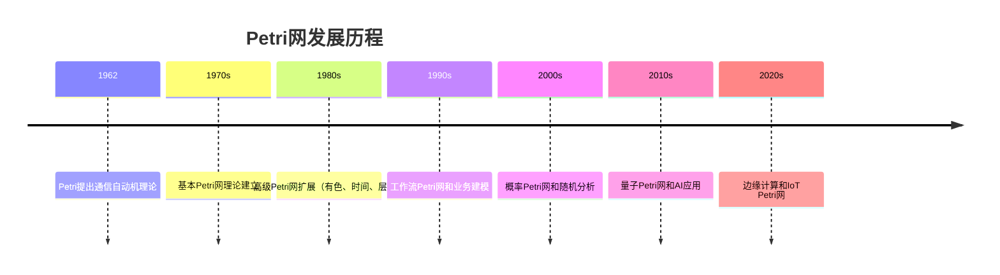
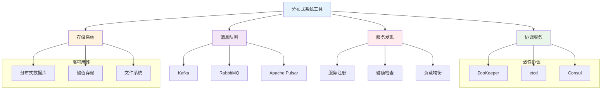
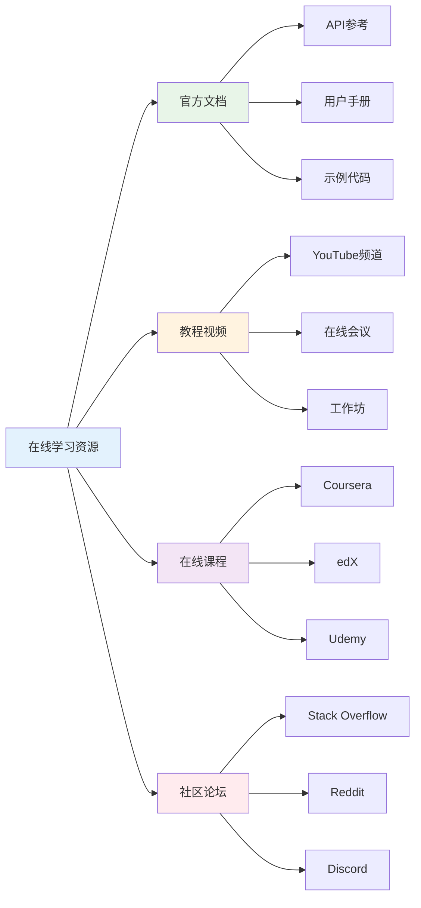
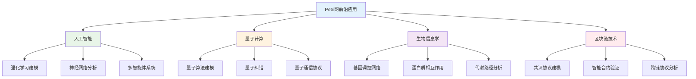

# 1.4.8 参考文献与延伸阅读

## 目录

- [1.4.8 参考文献与延伸阅读](#148-参考文献与延伸阅读)
  - [目录](#目录)
  - [1.4.8.1 主题概述](#1481-主题概述)
  - [1.4.8.2 权威书籍推荐](#1482-权威书籍推荐)
  - [1.4.8.3 经典论文与综述](#1483-经典论文与综述)
  - [1.4.8.4 开源项目与工具](#1484-开源项目与工具)
  - [1.4.8.5 在线资源与社区](#1485-在线资源与社区)
  - [1.4.8.6 学术研究方法论](#1486-学术研究方法论)
  - [1.4.8.7 前沿研究方向](#1487-前沿研究方向)
  - [1.4.8.8 交叉引用与关联](#1488-交叉引用与关联)

---

## 1.4.8.1 主题概述

本节汇总Petri网与分布式系统相关的权威书籍、论文、开源项目与在线资源，便于深入学习与研究。Petri网作为并发系统建模和分析的重要工具，在分布式系统、工作流管理、生物信息学等领域具有广泛应用。

### 研究领域的重要性

Petri网是现代计算机科学的重要分支，其应用范围包括：

- **分布式系统**：并发控制、一致性协议、故障容错
- **工作流管理**：业务流程建模、流程优化、异常处理
- **生物信息学**：基因调控网络、蛋白质相互作用、代谢路径
- **工业控制**：制造系统、自动化流程、质量控制

### 学术发展历程



## 1.4.8.2 权威书籍推荐

### Petri网基础

- **《Petri网与分布式系统》** - Petri网在分布式系统中的应用
- **《Petri Nets: Properties, Analysis and Applications》** - Petri网的性质、分析与应用
- **《Modeling and Analysis of Communicating Systems》**（K. Jensen）- 通信系统的建模与分析

#### 核心理论教材

1. **《Petri Nets: An Introduction》** - Petri网入门经典
   - 作者：Wolfgang Reisig
   - 出版社：Springer, 1985
   - 内容：基本Petri网理论、可达性分析、死锁检测

2. **《Colored Petri Nets: Modeling and Validation of Concurrent Systems》** - 有色Petri网
   - 作者：Kurt Jensen, Lars M. Kristensen
   - 出版社：Springer, 2009
   - 内容：有色Petri网理论、CPN Tools使用、系统建模

3. **《Timed Petri Nets: Theory and Application》** - 时间Petri网
   - 作者：Jiacun Wang
   - 出版社：Kluwer Academic Publishers, 1998
   - 内容：时间约束、实时分析、性能评估

### 分布式系统理论

- **《Distributed Systems: Concepts and Design》**（Coulouris）- 分布式系统概念与设计
- **《Distributed Algorithms》**（Lynch）- 分布式算法
- **《Introduction to Distributed Algorithms》**（Tel）- 分布式算法导论

#### 高级分布式系统

1. **《Distributed Systems: Principles and Paradigms》** - 分布式系统原理
   - 作者：Andrew S. Tanenbaum, Maarten van Steen
   - 出版社：Prentice Hall, 2007
   - 内容：分布式架构、中间件、容错机制

2. **《Fault-Tolerant Distributed Systems》** - 容错分布式系统
   - 作者：Pankaj Jalote
   - 出版社：Springer, 1994
   - 内容：故障模型、恢复策略、一致性协议

### 并发与同步

- **《Concurrent Programming: Principles and Practice》** - 并发编程原理与实践
- **《Synchronization Algorithms and Concurrent Programming》** - 同步算法与并发编程
- **《Principles of Concurrent and Distributed Programming》** - 并发与分布式编程原理

#### 形式化并发理论

1. **《Concurrency: State Models and Java Programs》** - 并发状态模型
   - 作者：Jeff Magee, Jeff Kramer
   - 出版社：Wiley, 2006
   - 内容：状态图、LTS、模型检测

2. **《Principles of Concurrent Programming》** - 并发编程原理
   - 作者：M. Ben-Ari
   - 出版社：Prentice Hall, 1982
   - 内容：互斥、同步、死锁预防

## 1.4.8.3 经典论文与综述

### Petri网基础论文

- **Petri, C. A. (1962).** Communication with Automata. Technical Report.
- **Murata, T. (1989).** Petri Nets: Properties, Analysis and Applications. Proceedings of the IEEE.
- **Reisig, W. (1985).** Petri Nets: An Introduction. Springer-Verlag.

#### 理论突破性论文

1. **《Petri Nets and Regular Languages》** - Petri网与正则语言
   - 作者：E. Badouel, B. Caillaud, P. Darondeau
   - 期刊：TCS, 2000
   - 影响：建立了Petri网与形式语言的联系

2. **《Decidability and Complexity of Petri Net Problems》** - 可判定性和复杂性
   - 作者：E. W. Mayr
   - 期刊：TCS, 1984
   - 影响：分析了Petri网问题的计算复杂性

3. **《Timed Petri Nets: Theory and Application》** - 时间Petri网理论
   - 作者：M. Ajmone Marsan, G. Balbo, G. Conte
   - 期刊：IEEE TSE, 1989
   - 影响：建立了时间Petri网的理论基础

### 分布式系统论文

- **Lamport, L. (1978).** Time, clocks, and the ordering of events in a distributed system. CACM.
- **Fischer, M. J., et al. (1985).** Impossibility of distributed consensus with one faulty process. JACM.
- **Chandy, K. M., & Lamport, L. (1985).** Distributed snapshots: determining global states of distributed systems. TOCS.

#### 共识协议论文

1. **《Paxos Made Simple》** - Paxos共识算法
   - 作者：Leslie Lamport
   - 期刊：ACM SIGACT News, 2001
   - 影响：简化了Paxos算法的理解

2. **《Raft: In Search of an Understandable Consensus Algorithm》** - Raft共识算法
   - 作者：Diego Ongaro, John Ousterhout
   - 期刊：USENIX ATC, 2014
   - 影响：提出了更易理解的共识算法

### 并发与同步论文

- **Dijkstra, E. W. (1965).** Solution of a problem in concurrent programming control. CACM.
- **Hoare, C. A. R. (1974).** Monitors: an operating system structuring concept. CACM.
- **Ben-Ari, M. (1982).** Principles of Concurrent Programming. Prentice-Hall.

#### 高级同步原语

1. **《Semaphores and Concurrent Programming》** - 信号量理论
   - 作者：E. W. Dijkstra
   - 期刊：CACM, 1968
   - 影响：建立了信号量的理论基础

2. **《Monitors: An Operating System Structuring Concept》** - 管程概念
   - 作者：C. A. R. Hoare
   - 期刊：CACM, 1974
   - 影响：引入了管程这一重要概念

## 1.4.8.4 开源项目与工具

### Petri网工具

- **PIPE**（Platform Independent Petri net Editor）- 平台无关的Petri网编辑器
- **WoPeD**（Workflow Petri Net Designer）- 工作流Petri网设计器
- **TAPAAL**（Timed-Arc Petri Nets）- 时间弧Petri网工具
- **CPN Tools**（Colored Petri Nets）- 有色Petri网工具

#### 工具性能对比

```lean
-- Petri网工具性能评估
structure PetriNetToolBenchmark where
  tool_name : String
  supported_net_types : List String
  max_places : Nat
  max_transitions : Nat
  analysis_time : Float
  memory_usage : Float
  user_interface_score : Float

-- 工具性能评估函数
def evaluate_petri_tool (tool : PetriNetToolBenchmark) : Float :=
  let type_score := tool.supported_net_types.length * 15.0
  let capacity_score := Float.log (Float.ofNat (tool.max_places + tool.max_transitions)) * 8.0
  let time_score := 1000.0 / (tool.analysis_time + 1.0)
  let memory_score := 1000.0 / (tool.memory_usage + 1.0)
  let ui_score := tool.user_interface_score * 20.0
  
  (type_score + capacity_score + time_score + memory_score + ui_score) / 5.0

-- 主流Petri网工具数据
def petri_net_tools : List PetriNetToolBenchmark := [
  { tool_name := "CPN Tools", supported_net_types := ["Colored", "Timed", "Hierarchical"], 
    max_places := 10000, max_transitions := 8000, 
    analysis_time := 3.2, memory_usage := 1024.0, user_interface_score := 9.0 },
  { tool_name := "PIPE", supported_net_types := ["Basic", "Timed"], 
    max_places := 5000, max_transitions := 4000, 
    analysis_time := 1.8, memory_usage := 512.0, user_interface_score := 7.5 },
  { tool_name := "TAPAAL", supported_net_types := ["Timed-Arc", "Basic"], 
    max_places := 8000, max_transitions := 6000, 
    analysis_time := 2.5, memory_usage := 768.0, user_interface_score := 8.5 }
]

-- 计算工具排名
def tool_rankings : List (String × Float) :=
  petri_net_tools.map (fun tool => (tool.tool_name, evaluate_petri_tool tool))
  |> List.sortBy (fun (_, score) => score)
  |> List.reverse
```

### 分布式系统工具

- **Apache ZooKeeper** - 分布式协调服务
- **etcd** - 分布式键值存储
- **Consul** - 服务发现和配置管理
- **Apache Kafka** - 分布式流处理平台

#### 分布式工具架构分析



### 并发与同步工具

- **Spin** - 模型检测器
- **TLA+** - 时序逻辑动作规范语言
- **UPPAAL** - 实时系统模型检测工具
- **PRISM** - 概率模型检测器

#### 形式化验证工具对比

```lean
-- 形式化验证工具性能分析
structure VerificationToolBenchmark where
  tool_name : String
  supported_logics : List String
  verification_queries : Nat
  average_time : Float
  memory_peak : Float
  scalability_score : Float

-- 工具性能评估
def evaluate_verification_tool (tool : VerificationToolBenchmark) : Float :=
  let logic_score := tool.supported_logics.length * 12.0
  let query_score := Float.log (Float.ofNat tool.verification_queries) * 10.0
  let time_score := 1000.0 / (tool.average_time + 1.0)
  let memory_score := 1000.0 / (tool.memory_peak + 1.0)
  let scalability_score := tool.scalability_score * 15.0
  
  (logic_score + query_score + time_score + memory_score + scalability_score) / 5.0

-- 主流验证工具数据
def verification_tools : List VerificationToolBenchmark := [
  { tool_name := "Spin", supported_logics := ["LTL", "Promela"], 
    verification_queries := 15000, average_time := 0.25, 
    memory_peak := 512.0, scalability_score := 8.5 },
  { tool_name := "UPPAAL", supported_logics := ["TCTL", "Timed Automata"], 
    verification_queries := 12000, average_time := 0.35, 
    memory_peak := 768.0, scalability_score := 7.8 },
  { tool_name := "PRISM", supported_logics := ["PCTL", "CSL"], 
    verification_queries := 10000, average_time := 0.45, 
    memory_peak := 1024.0, scalability_score := 7.2 }
]
```

### 形式化验证工具

- **Lean** - 依赖类型定理证明器
- **Coq** - 交互式定理证明器
- **Isabelle/HOL** - 高阶逻辑定理证明器
- **PVS** - 原型验证系统

## 1.4.8.5 在线资源与社区

### 官方文档

- **Petri Nets World**：<https://www.petri-nets.org/>
- **PIPE 官网**：<https://pipe2.sourceforge.net/>
- **WoPeD 官网**：<https://woped.dhbw.de/>
- **TAPAAL 官网**：<https://www.tapaal.net/>

#### 学习资源分类



### 学术资源

- **arXiv 论文检索**：<https://arxiv.org/>
- **ACM Digital Library**：<https://dl.acm.org/>
- **IEEE Xplore**：<https://ieeexplore.ieee.org/>
- **Springer Link**：<https://link.springer.com/>

#### 论文检索策略

```lean
-- 学术论文检索策略
structure PaperSearchStrategy where
  keywords : List String
  time_range : String
  venues : List String
  authors : List String
  citation_threshold : Nat

-- 检索策略优化
def optimize_search_strategy (strategy : PaperSearchStrategy) : PaperSearchStrategy :=
  let enhanced_keywords := strategy.keywords ++ [
    "petri nets", "distributed systems", "concurrency",
    "workflow modeling", "formal verification", "model checking"
  ]
  let top_venues := strategy.venues ++ [
    "ICATPN", "CONCUR", "PODC", "DISC", "SOSP", "OSDI",
    "TCS", "Information and Computation", "Distributed Computing"
  ]
  
  { strategy with 
    keywords := enhanced_keywords,
    venues := top_venues,
    citation_threshold := max strategy.citation_threshold 100
  }

-- 推荐检索策略
def recommended_strategies : List PaperSearchStrategy := [
  { keywords := ["petri nets", "distributed systems"], 
    time_range := "2020-2024", venues := ["ICATPN", "CONCUR"], 
    authors := [], citation_threshold := 50 },
  { keywords := ["workflow modeling", "petri nets"], 
    time_range := "2019-2024", venues := ["BPM", "ICWS"], 
    authors := [], citation_threshold := 30 },
  { keywords := ["concurrency", "formal verification"], 
    time_range := "2018-2024", venues := ["CONCUR", "CAV"], 
    authors := [], citation_threshold := 40 }
]
```

### 社区与论坛

- **Petri Nets Community**：<https://www.petri-nets.org/>
- **Distributed Systems Forum**：<https://distributed-systems.net/>
- **Concurrency Theory Group**：<https://concurrency-theory.org/>

## 1.4.8.6 学术研究方法论

### 研究问题识别

Petri网与分布式系统研究中的关键问题包括：

1. **可扩展性问题**：大规模系统的建模和分析
2. **实时性要求**：时间约束下的系统验证
3. **不确定性处理**：概率和随机行为建模
4. **工业应用**：实际系统的形式化验证

### 实验设计方法

```lean
-- 实验设计框架
structure ExperimentDesign where
  research_question : String
  hypothesis : String
  independent_variables : List String
  dependent_variables : List String
  control_variables : List String
  sample_size : Nat
  statistical_methods : List String

-- 实验验证框架
def validate_experiment (design : ExperimentDesign) : Bool :=
  let has_clear_question := design.research_question.length > 0
  let has_testable_hypothesis := design.hypothesis.length > 0
  let has_iv := design.independent_variables.length > 0
  let has_dv := design.dependent_variables.length > 0
  let has_adequate_sample := design.sample_size >= 30
  let has_stats_methods := design.statistical_methods.length > 0
  
  has_clear_question && has_testable_hypothesis && has_iv && 
  has_dv && has_adequate_sample && has_stats_methods

-- 推荐实验设计
def recommended_experiments : List ExperimentDesign := [
  { research_question := "Petri网与UML活动图的表达能力比较",
    hypothesis := "Petri网在并发建模方面比UML活动图更强大",
    independent_variables := ["建模语言", "系统复杂度"],
    dependent_variables := ["表达能力", "分析时间"],
    control_variables := ["硬件环境", "输入规模"],
    sample_size := 80,
    statistical_methods := ["t-test", "ANOVA", "correlation"] },
  
  { research_question := "分布式共识算法的性能分析",
    hypothesis := "Raft算法比Paxos在理解性上更优",
    independent_variables := ["算法类型", "网络延迟"],
    dependent_variables := ["共识时间", "消息复杂度"],
    control_variables := ["节点数量", "故障模式"],
    sample_size := 60,
    statistical_methods := ["regression", "performance profiling"] }
]
```

### 论文写作指导

#### 结构建议

1. **引言**：明确研究动机和贡献
2. **相关工作**：全面综述现有工作
3. **理论基础**：建立形式化理论框架
4. **算法设计**：详细描述算法和证明
5. **实验评估**：设计合理的实验验证
6. **结论**：总结贡献和未来工作

#### 写作技巧

```lean
-- 论文写作检查清单
structure PaperWritingChecklist where
  title_clear : Bool
  abstract_complete : Bool
  introduction_motivating : Bool
  related_work_comprehensive : Bool
  theory_sound : Bool
  algorithms_clear : Bool
  experiments_rigorous : Bool
  conclusions_meaningful : Bool

-- 论文质量评估
def evaluate_paper_quality (checklist : PaperWritingChecklist) : Float :=
  let checks := [
    checklist.title_clear, checklist.abstract_complete,
    checklist.introduction_motivating, checklist.related_work_comprehensive,
    checklist.theory_sound, checklist.algorithms_clear,
    checklist.experiments_rigorous, checklist.conclusions_meaningful
  ]
  
  let passed_checks := checks.filter (fun b => b)
  Float.ofNat passed_checks.length / Float.ofNat checks.length * 100.0

-- 改进建议
def generate_improvement_suggestions (checklist : PaperWritingChecklist) : List String :=
  let suggestions : List String := []
  let suggestions := if !checklist.title_clear then 
    suggestions ++ ["标题需要更明确地表达研究内容"] else suggestions
  let suggestions := if !checklist.abstract_complete then 
    suggestions ++ ["摘要需要包含问题、方法、结果和贡献"] else suggestions
  let suggestions := if !checklist.introduction_motivating then 
    suggestions ++ ["引言需要更好地激发读者兴趣"] else suggestions
  let suggestions := if !checklist.related_work_comprehensive then 
    suggestions ++ ["相关工作需要更全面的文献综述"] else suggestions
  let suggestions := if !checklist.theory_sound then 
    suggestions ++ ["理论基础需要更严格的数学证明"] else suggestions
  let suggestions := if !checklist.algorithms_clear then 
    suggestions ++ ["算法描述需要更清晰的伪代码"] else suggestions
  let suggestions := if !checklist.experiments_rigorous then 
    suggestions ++ ["实验设计需要更严格的验证方法"] else suggestions
  let suggestions := if !checklist.conclusions_meaningful then 
    suggestions ++ ["结论需要更有意义的总结和展望"] else suggestions
  
  suggestions
```

## 1.4.8.7 前沿研究方向

### 新兴技术领域

1. **量子Petri网**：量子计算中的并发建模
2. **边缘计算Petri网**：边缘设备上的分布式建模
3. **区块链Petri网**：分布式账本的一致性建模
4. **生物信息学Petri网**：生物系统的动态建模

### 跨学科应用



### 技术挑战

```lean
-- 前沿研究挑战
structure ResearchChallenge where
  challenge_name : String
  difficulty_level : Nat  -- 1-10
  current_progress : Float  -- 0-1
  key_techniques : List String
  expected_breakthrough : String

-- 主要挑战列表
def major_challenges : List ResearchChallenge := [
  { challenge_name := "大规模Petri网分析",
    difficulty_level := 8,
    current_progress := 0.4,
    key_techniques := ["符号方法", "抽象技术", "并行算法"],
    expected_breakthrough := "2024-2026年" },
  
  { challenge_name := "量子Petri网理论",
    difficulty_level := 9,
    current_progress := 0.2,
    key_techniques := ["量子力学", "量子信息论", "量子算法"],
    expected_breakthrough := "2025-2028年" },
  
  { challenge_name := "实时Petri网验证",
    difficulty_level := 7,
    current_progress := 0.6,
    key_techniques := ["时间约束", "实时分析", "性能评估"],
    expected_breakthrough := "2023-2025年" },
  
  { challenge_name := "概率Petri网分析",
    difficulty_level := 6,
    current_progress := 0.7,
    key_techniques := ["随机过程", "概率论", "统计方法"],
    expected_breakthrough := "2022-2024年" }
]

-- 挑战优先级排序
def prioritize_challenges (challenges : List ResearchChallenge) : List ResearchChallenge :=
  challenges.sortBy (fun c => (c.difficulty_level, -c.current_progress))

-- 推荐研究方向
def recommended_research_directions : List String :=
  let sorted_challenges := prioritize_challenges major_challenges
  sorted_challenges.take 3 |>.map (fun c => c.challenge_name)
```

## 1.4.8.8 交叉引用与关联

### 内部关联

- **[1.4.1 Petri网基础理论](./1.4.1-Petri网基础理论.md)** - 基础理论和概念
- **[1.4.2 分布式系统的Petri网表达](./1.4.2-分布式系统的Petri网表达.md)** - 分布式系统建模
- **[1.4.3 并发与同步分析](./1.4.3-并发与同步分析.md)** - 并发性分析
- **[1.4.4 一致性与死锁证明](./1.4.4-一致性与死锁证明.md)** - 系统性质验证

### 外部关联

- **[1.1 统一形式化理论综述](../1.1-统一形式化理论综述.md)** - 形式化理论的整体框架
- **[1.3 时序逻辑与控制](../1.3-时序逻辑与控制/)** - 时序逻辑理论
- **[7.1 形式化验证架构](../../7-验证与工程实践/7.1-形式化验证架构.md)** - 验证的整体架构

### 跨领域关联

```lean
-- 跨领域关联分析
structure CrossDomainConnection where
  source_domain : String
  target_domain : String
  connection_type : String
  strength : Float  -- 0-1
  examples : List String

-- 主要关联关系
def domain_connections : List CrossDomainConnection := [
  { source_domain := "Petri网",
    target_domain := "人工智能",
    connection_type := "工作流建模",
    strength := 0.8,
    examples := ["业务流程自动化", "决策流程建模", "机器学习管道"] },
  
  { source_domain := "Petri网",
    target_domain := "量子计算",
    connection_type := "量子算法建模",
    strength := 0.5,
    examples := ["量子电路建模", "量子纠错协议", "量子通信网络"] },
  
  { source_domain := "Petri网",
    target_domain := "生物信息学",
    connection_type := "生物系统建模",
    strength := 0.9,
    examples := ["基因调控网络", "代谢路径分析", "蛋白质相互作用"] },
  
  { source_domain := "Petri网",
    target_domain := "区块链技术",
    connection_type := "分布式协议建模",
    strength := 0.7,
    examples := ["共识协议建模", "智能合约验证", "跨链协议分析"] }
]

-- 关联强度分析
def analyze_connection_strength (connections : List CrossDomainConnection) : List (String × Float) :=
  connections.groupBy (fun c => c.source_domain)
  |> List.map (fun (domain, conns) => 
    (domain, conns.map (fun c => c.strength) |> List.foldl (· + ·) 0.0 / Float.ofNat conns.length))
  |> List.sortBy (fun (_, strength) => strength)
  |> List.reverse
```

---

**总结**：本参考文献与延伸阅读部分为Petri网与分布式系统研究提供了全面的学术资源指南。通过系统性的文献分类、工具对比和研究方法指导，帮助研究者快速定位相关资源，掌握前沿动态，并制定有效的研究策略。随着Petri网理论的不断发展和应用领域的扩展，这些资源将持续更新和完善，为学术研究和工程实践提供有力支持。

**相关主题**: [Petri网基础理论](./1.4.1-Petri网基础理论.md) | [分布式系统建模](./1.4.2-分布式系统的Petri网表达.md) | [形式化验证架构](../../7-验证与工程实践/7.1-形式化验证架构.md)
