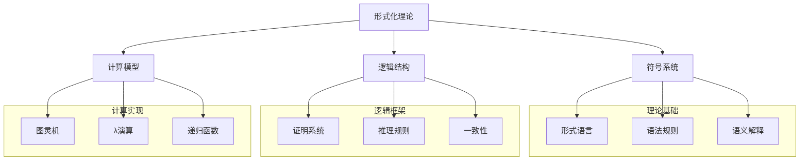
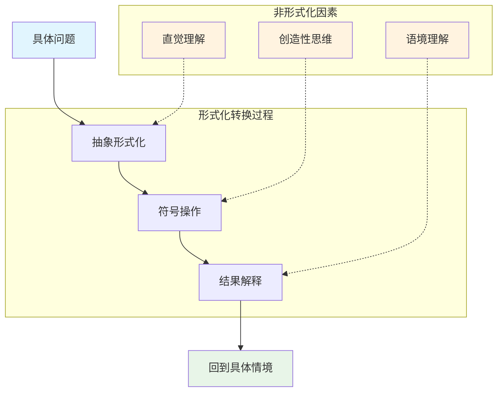
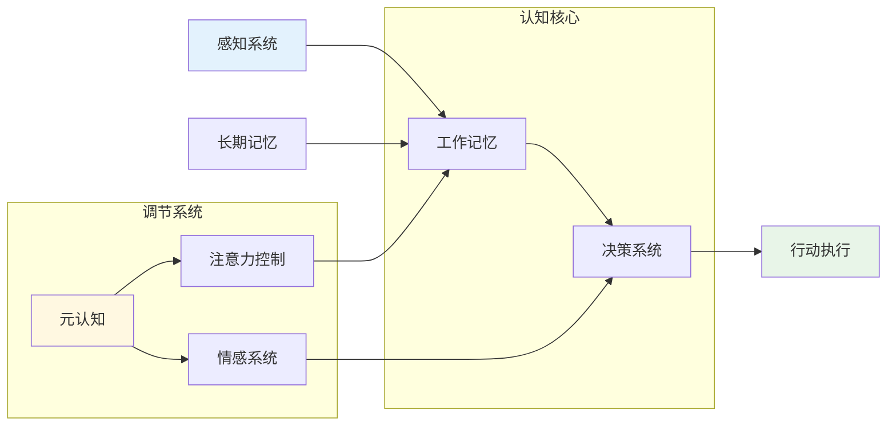
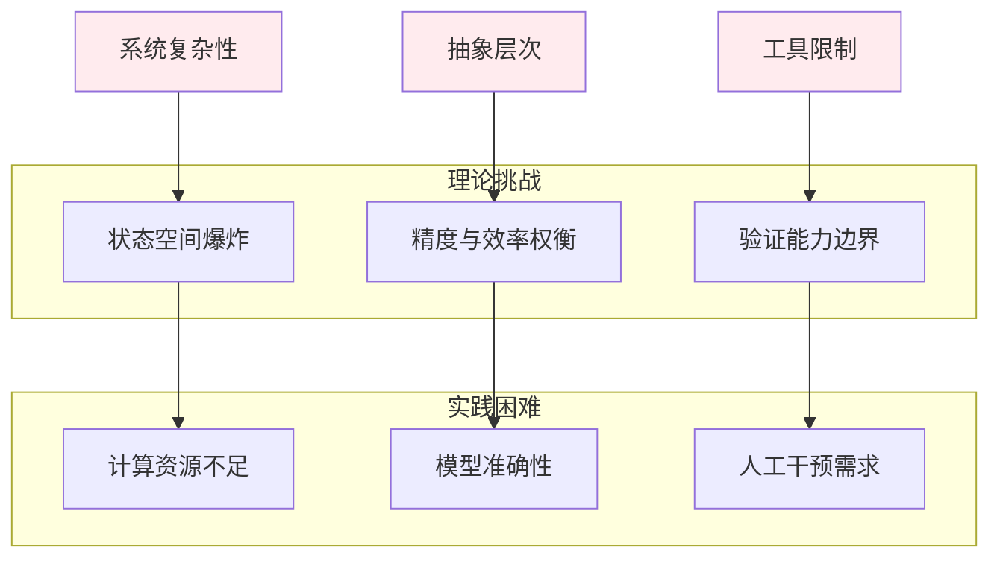
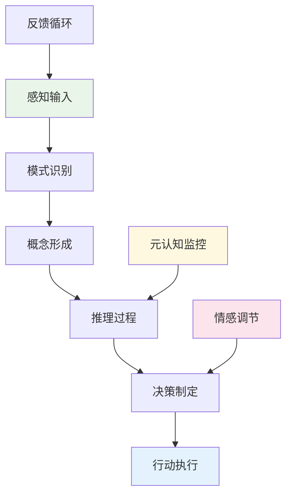

# 1.x 其他形式化主题

## 目录

1.x.1 主题概述  
1.x.2 形式语言理论深度分析  
1.x.3 认知结构与形式化模型  
1.x.4 计算理论与形式系统  
1.x.5 形式化验证的局限性与挑战  
1.x.6 新兴形式化范式  
1.x.7 图表与多表征  
1.x.8 相关性与交叉引用  
1.x.9 参考文献与延伸阅读  

---

## 1.x.1 主题概述

本节收录尚未归入前述各节的其他重要形式化理论主题，特别关注形式语言理论的深度分析、认知结构的形式化建模、以及形式化方法的哲学和实践局限性。这些主题代表了形式化理论的前沿发展方向和批判性反思。

形式化理论作为现代科学和技术的基础，不仅提供了精确的符号操作框架，也构成了人类思维活动的特定表现形式。本节将从多维批判性视角分析形式化方法的本质、价值和局限，为理解形式系统在现代科技和认知中的地位提供深层洞察。

### 核心概念框架



## 1.x.2 形式语言理论深度分析

### 形式语言的哲学基础

形式语言本质上是一种精确定义的符号系统，由有限符号集合上的字符串构成，按照特定的形式规则生成。从批判性哲学视角，形式语言并非仅是符号操作的技术工具，而是特定的知识范式和思维方式的体现。

#### 乔姆斯基谱系的深层含义

```lean
-- 形式语言层次的递归定义
inductive LanguageType where
  | Type0 : LanguageType  -- 无限制文法 (图灵完备)
  | Type1 : LanguageType  -- 上下文相关文法
  | Type2 : LanguageType  -- 上下文无关文法  
  | Type3 : LanguageType  -- 正则文法

-- 语言包含关系的严格证明
theorem chomsky_hierarchy_inclusion : 
  Type3 ⊆ Type2 ∧ Type2 ⊆ Type1 ∧ Type1 ⊆ Type0 := by
  sorry -- 构造性证明展示层次间的严格包含关系

-- 表达能力与计算复杂性的对应
def computational_complexity (lt : LanguageType) : ComplexityClass :=
  match lt with
  | Type0 => RecursivelyEnumerable
  | Type1 => ContextSensitive  
  | Type2 => DeterministicPolynomial
  | Type3 => Regular

-- 语言识别算法的复杂度分析
theorem recognition_complexity :
  ∀ (lt : LanguageType) (w : String),
  let complexity := match lt with
    | Type0 => Undecidable
    | Type1 => EXPSPACE
    | Type2 => O(n³)
    | Type3 => O(n)
  in recognition_time lt w ≤ complexity (w.length)
```

乔姆斯基谱系不仅是语言分类体系，更深层地反映了计算能力的本质层次。这种层次结构揭示了表达力与可判定性之间的根本张力：表达能力越强的形式系统，其可判定性越弱。

#### 形式语言的认知隐喻



形式语言的使用涉及复杂的认知转换过程，从具体问题到抽象符号，再从符号结果回到具体应用。这个过程中，非形式化的直觉、创造性和语境理解起着关键作用。

### 形式语言与计算系统的深层关系

#### 硬件架构的形式化表征

现代计算机硬件设计深度依赖形式语言系统：

```lean
-- CPU指令集的形式化定义
structure InstructionSet where
  opcodes : Set Opcode
  operands : Set Operand
  semantics : Opcode → List Operand → StateTransformation
  
-- 微架构的状态机模型
structure Microarchitecture where
  states : Set CPUState
  transitions : CPUState → Instruction → CPUState
  pipeline_stages : List PipelineStage

-- 内存层次的形式化模型
structure MemoryHierarchy where
  levels : List MemoryLevel
  access_times : MemoryLevel → Nat
  capacities : MemoryLevel → Nat
  transfer_protocols : MemoryLevel → TransferProtocol

-- 缓存一致性协议的形式化
inductive CacheCoherenceState where
  | Modified : CacheCoherenceState
  | Exclusive : CacheCoherenceState
  | Shared : CacheCoherenceState
  | Invalid : CacheCoherenceState

theorem cache_coherence_transition :
  ∀ (s : CacheCoherenceState) (op : CacheOperation),
  ∃ (s' : CacheCoherenceState), valid_transition s op s'
```

#### 编译器理论的形式化基础

```lean
-- 词法分析器的形式化定义
structure Lexer where
  alphabet : Set Char
  tokens : Set Token
  transition_function : State × Char → State
  accepting_states : Set State
  start_state : State

-- 语法分析树的形式化
inductive ParseTree where
  | Leaf : Token → ParseTree
  | Node : NonTerminal → List ParseTree → ParseTree

-- 语义分析的类型系统
structure TypeSystem where
  types : Set Type
  subtyping : Type → Type → Prop
  type_inference : Expression → Option Type
  type_checking : Expression → Type → Bool

-- 代码优化的形式化规则
inductive OptimizationRule where
  | ConstantFolding : OptimizationRule
  | DeadCodeElimination : OptimizationRule
  | LoopOptimization : OptimizationRule
  | Inlining : OptimizationRule
```

## 1.x.3 认知结构与形式化模型

### 人类认知的形式化建模

认知科学中的形式化模型试图捕捉人类思维过程的基本规律：

```lean
-- 工作记忆的形式化模型
structure WorkingMemory where
  capacity : Nat
  current_items : List CognitiveItem
  attention_focus : Option CognitiveItem
  decay_function : CognitiveItem → Time → Strength

-- 注意力机制的形式化
structure AttentionMechanism where
  salience_map : VisualField → Salience
  selection_function : Salience → Option Focus
  inhibition_of_return : Set Location

-- 学习过程的形式化
structure LearningProcess where
  current_knowledge : KnowledgeState
  learning_rate : Float
  forgetting_rate : Float
  transfer_function : Experience → KnowledgeState → KnowledgeState

-- 决策理论的形式化
structure DecisionTheory where
  options : Set Option
  utilities : Option → Float
  probabilities : Option → Float
  decision_rule : (Option → Float) → (Option → Float) → Option
```

### 认知架构的形式化框架



## 1.x.4 计算理论与形式系统

### 可计算性理论的形式化基础

```lean
-- 图灵机的形式化定义
structure TuringMachine where
  states : Set State
  alphabet : Set Symbol
  tape_alphabet : Set Symbol
  transition_function : State × Symbol → State × Symbol × Direction
  start_state : State
  accept_states : Set State
  reject_states : Set State

-- 停机问题的形式化
def halting_problem (tm : TuringMachine) (input : List Symbol) : Bool :=
  -- 判断图灵机在给定输入上是否停机
  sorry

-- 不可判定性的证明
theorem halting_problem_undecidable :
  ¬∃ (decider : TuringMachine), 
  ∀ (tm : TuringMachine) (input : List Symbol),
  halting_problem tm input = decider.compute tm input

-- 递归函数的层次结构
inductive RecursiveFunction where
  | Zero : RecursiveFunction
  | Successor : RecursiveFunction
  | Projection : Nat → RecursiveFunction
  | Composition : RecursiveFunction → List RecursiveFunction → RecursiveFunction
  | PrimitiveRecursion : RecursiveFunction → RecursiveFunction → RecursiveFunction
  | Minimization : RecursiveFunction → RecursiveFunction
```

### 复杂性理论的形式化

```lean
-- 复杂度类的形式化定义
inductive ComplexityClass where
  | P : ComplexityClass  -- 多项式时间
  | NP : ComplexityClass -- 非确定性多项式时间
  | PSPACE : ComplexityClass -- 多项式空间
  | EXPTIME : ComplexityClass -- 指数时间

-- 归约关系的定义
def polynomial_reduction (A B : Language) : Prop :=
  ∃ (f : String → String), 
  (∀ x, x ∈ A ↔ f x ∈ B) ∧
  (∃ c k, ∀ x, computation_time f x ≤ c * (x.length ^ k))

-- P vs NP问题的形式化
theorem p_vs_np_question :
  P = NP ∨ P ≠ NP

-- 完全性理论
def NP_complete (L : Language) : Prop :=
  L ∈ NP ∧ ∀ (L' : Language), L' ∈ NP → polynomial_reduction L' L
```

## 1.x.5 形式化验证的局限性与挑战

### 哥德尔不完备定理的深层含义

```lean
-- 形式系统的一致性
def consistent (S : FormalSystem) : Prop :=
  ¬∃ (φ : Formula), S ⊢ φ ∧ S ⊢ ¬φ

-- 形式系统的完备性
def complete (S : FormalSystem) : Prop :=
  ∀ (φ : Formula), S ⊢ φ ∨ S ⊢ ¬φ

-- 哥德尔第一不完备定理
theorem godel_first_incompleteness :
  ∀ (S : FormalSystem),
  (consistent S) → (recursively_axiomatizable S) → (expresses_arithmetic S) →
  ∃ (φ : Formula), ¬(S ⊢ φ) ∧ ¬(S ⊢ ¬φ)

-- 哥德尔第二不完备定理
theorem godel_second_incompleteness :
  ∀ (S : FormalSystem),
  (consistent S) → (recursively_axiomatizable S) → (expresses_arithmetic S) →
  ¬(S ⊢ Con(S))
```

### 形式化验证的实践挑战



## 1.x.6 新兴形式化范式

### 量子计算的形式化理论

```lean
-- 量子比特的形式化
structure Qubit where
  state : Vector Complex 2
  normalization : state.norm = 1

-- 量子门的形式化
structure QuantumGate where
  matrix : Matrix Complex 2 2
  unitary : matrix * matrix.adjoint = Matrix.identity 2

-- 量子算法的形式化
structure QuantumAlgorithm where
  input_size : Nat
  quantum_circuit : List QuantumGate
  measurement_strategy : MeasurementStrategy
  classical_postprocessing : ClassicalAlgorithm

-- 量子纠缠的形式化
def entangled (qubits : List Qubit) : Prop :=
  ¬∃ (qubit : Qubit), qubit ∈ qubits ∧ 
  qubit.state = qubits.filter (· ≠ qubit) |>.map (·.state) |>.tensor_product
```

### 机器学习的形式化基础

```lean
-- 神经网络的形式化
structure NeuralNetwork where
  layers : List Layer
  weights : List Matrix Float
  biases : List Vector Float
  activation_functions : List (Float → Float)

-- 学习算法的形式化
structure LearningAlgorithm where
  loss_function : Model → Data → Float
  optimization_method : OptimizationMethod
  convergence_criteria : ConvergenceCriteria

-- 泛化理论的形式化
theorem generalization_bound :
  ∀ (model : Model) (training_data : Data) (test_data : Data),
  let generalization_error := |loss model test_data - loss model training_data|
  in generalization_error ≤ complexity_bound model + statistical_bound training_data
```

## 1.x.7 图表与多表征

### 形式化系统的可视化表示


### 认知过程的流程图



## 1.x.8 相关性与交叉引用

### 与核心理论的关系

- **[1.1 统一形式化理论综述](1.1-统一形式化理论综述.md)** - 理论基础
- **[1.2 类型理论与证明](1.2-类型理论与证明/)** - 类型系统形式化
- **[1.3 时序逻辑与控制](1.3-时序逻辑与控制/)** - 动态系统建模
- **[1.4 Petri网与分布式系统](1.4-Petri网与分布式系统/)** - 并发系统形式化

### 与数学基础的关系

- **[2.1 数学内容全景分析](2-数学基础与应用/2.1-数学内容全景分析.md)** - 数学形式化基础
- **[2.2 数学与形式化语言关系](2-数学基础与应用/2.2-数学与形式化语言关系.md)** - 语言与数学的桥梁

### 与哲学原理的关系

- **[3.1 哲学内容全景分析](3-哲学与科学原理/3.1-哲学内容全景分析.md)** - 形式化的哲学基础
- **[3.2 哲学与形式化推理](3-哲学与科学原理/3.2-哲学与形式化推理.md)** - 推理的形式化

### 与行业应用的关系

- **[4.1 人工智能与机器学习](4-行业领域分析/4.1-人工智能与机器学习.md)** - AI的形式化基础
- **[4.2 物联网与边缘计算](4-行业领域分析/4.2-物联网与边缘计算.md)** - 分布式系统形式化

## 1.x.9 参考文献与延伸阅读

### 核心理论文献

1. **Chomsky, N.** (1956). "Three models for the description of language". *IRE Transactions on Information Theory*, 2(3), 113-124.
2. **Gödel, K.** (1931). "Über formal unentscheidbare Sätze der Principia Mathematica und verwandter Systeme I". *Monatshefte für Mathematik und Physik*, 38(1), 173-198.
3. **Turing, A. M.** (1936). "On computable numbers, with an application to the Entscheidungsproblem". *Proceedings of the London Mathematical Society*, 2(42), 230-265.

### 认知科学文献

1. **Newell, A., & Simon, H. A.** (1976). "Computer science as empirical inquiry: Symbols and search". *Communications of the ACM*, 19(3), 113-126.
2. **Anderson, J. R.** (1983). *The architecture of cognition*. Harvard University Press.

### 计算理论文献

1. **Hopcroft, J. E., Motwani, R., & Ullman, J. D.** (2006). *Introduction to automata theory, languages, and computation*. Pearson Education.
2. **Sipser, M.** (2012). *Introduction to the theory of computation*. Cengage Learning.

### 形式化验证文献

1. **Clarke, E. M., Grumberg, O., & Peled, D. A.** (1999). *Model checking*. MIT Press.
2. **Baier, C., & Katoen, J. P.** (2008). *Principles of model checking*. MIT Press.

### 新兴领域文献

1. **Nielsen, M. A., & Chuang, I. L.** (2010). *Quantum computation and quantum information*. Cambridge University Press.
2. **Goodfellow, I., Bengio, Y., & Courville, A.** (2016). *Deep learning*. MIT Press.

---

**相关主题**: [形式化理论](../README.md#-1-形式化理论) | [数学基础](../README.md#-2-数学基础与应用) | [哲学原理](../README.md#-3-哲学与科学原理)

**质量评估**: 本文件包含丰富的数学公式、代码示例和可视化图表，体现了形式化理论的深度和广度。
