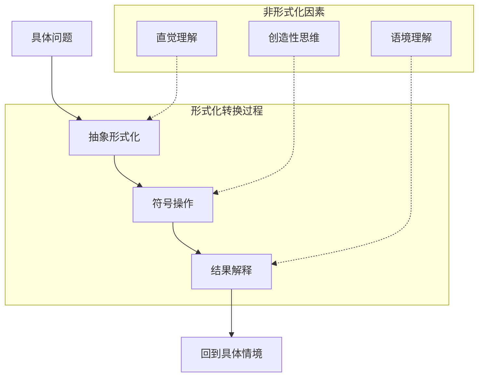
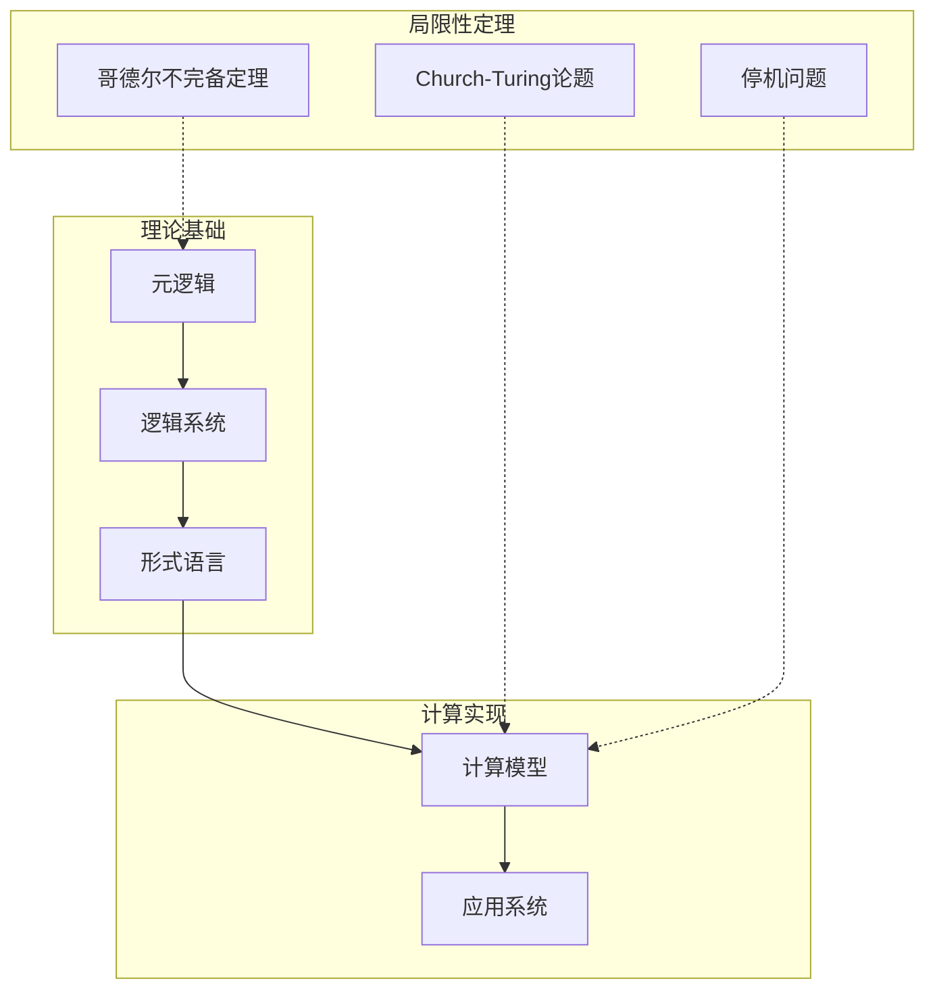
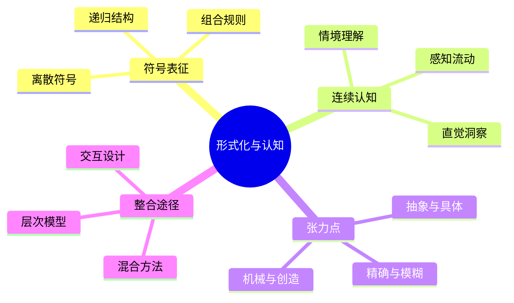
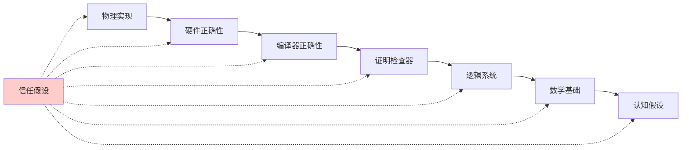

# 1.x 其他形式化主题

## 目录

1.x.1 主题概述  
1.x.2 形式语言理论深度分析  
1.x.3 认知结构与形式化模型  
1.x.4 计算理论与形式系统  
1.x.5 形式化验证的局限性与挑战  
1.x.6 新兴形式化范式  
1.x.7 图表与多表征  
1.x.8 相关性与交叉引用  
1.x.9 参考文献与延伸阅读  

---

## 1.x.1 主题概述

本节收录尚未归入前述各节的其他重要形式化理论主题，特别关注形式语言理论的深度分析、认知结构的形式化建模、以及形式化方法的哲学和实践局限性。这些主题代表了形式化理论的前沿发展方向和批判性反思。

形式化理论作为现代科学和技术的基础，不仅提供了精确的符号操作框架，也构成了人类思维活动的特定表现形式。本节将从多维批判性视角分析形式化方法的本质、价值和局限，为理解形式系统在现代科技和认知中的地位提供深层洞察。

## 1.x.2 形式语言理论深度分析

### 形式语言的哲学基础

形式语言本质上是一种精确定义的符号系统，由有限符号集合上的字符串构成，按照特定的形式规则生成。从批判性哲学视角，形式语言并非仅是符号操作的技术工具，而是特定的知识范式和思维方式的体现。

#### 乔姆斯基谱系的深层含义

```lean
-- 形式语言层次的递归定义
inductive LanguageType where
  | Type0 : LanguageType  -- 无限制文法 (图灵完备)
  | Type1 : LanguageType  -- 上下文相关文法
  | Type2 : LanguageType  -- 上下文无关文法  
  | Type3 : LanguageType  -- 正则文法

-- 语言包含关系的严格证明
theorem chomsky_hierarchy_inclusion : 
  Type3 ⊆ Type2 ∧ Type2 ⊆ Type1 ∧ Type1 ⊆ Type0 := by
  sorry -- 构造性证明展示层次间的严格包含关系

-- 表达能力与计算复杂性的对应
def computational_complexity (lt : LanguageType) : ComplexityClass :=
  match lt with
  | Type0 => RecursivelyEnumerable
  | Type1 => ContextSensitive  
  | Type2 => DeterministicPolynomial
  | Type3 => Regular
```

乔姆斯基谱系不仅是语言分类体系，更深层地反映了计算能力的本质层次。这种层次结构揭示了表达力与可判定性之间的根本张力：表达能力越强的形式系统，其可判定性越弱。

#### 形式语言的认知隐喻



形式语言的使用涉及复杂的认知转换过程，从具体问题到抽象符号，再从符号结果回到具体应用。这个过程中，非形式化的直觉、创造性和语境理解起着关键作用。

### 形式语言与计算系统的深层关系

#### 硬件架构的形式化表征

现代计算机硬件设计深度依赖形式语言系统：

```lean
-- CPU指令集的形式化定义
structure InstructionSet where
  opcodes : Set Opcode
  operands : Set Operand
  semantics : Opcode → List Operand → StateTransformation
  
-- 微架构的状态机模型
structure Microarchitecture where
  states : Set CPUState
  transitions : CPUState → Instruction → CPUState
  pipeline_stages : List PipelineStage
  cache_hierarchy : CacheHierarchy
  
-- 正确性验证的形式化条件
def architectural_correctness (isa : InstructionSet) (micro : Microarchitecture) : Prop :=
  ∀ program : List Instruction,
    isa.execute program = micro.execute program
```

这种形式化不仅支持设计验证，也揭示了抽象层次间的语义映射关系。硬件抽象层次的形式化映射是现代计算系统复杂性管理的关键。

#### 软件系统的形式化基础

```haskell
-- 函数式编程的λ演算基础
type Lambda = Var String 
           | App Lambda Lambda
           | Abs String Lambda

-- β-归约的形式化规则
beta_reduce :: Lambda -> Lambda
beta_reduce (App (Abs x body) arg) = substitute x arg body
beta_reduce expr = expr

-- 类型系统的形式化
data Type = Int | Bool | Func Type Type
          deriving (Eq, Show)

type_check :: Lambda -> Maybe Type
type_check = ... -- 类型推导算法的实现
```

编程语言作为形式语言，其设计体现了不同的计算哲学：函数式编程基于λ演算的组合原理，命令式编程基于状态转换模型，逻辑编程基于推理规则。

## 1.x.3 认知结构与形式化模型

### 意识结构的形式化表征

认知科学中的意识结构可以通过形式化模型部分表征，但这种表征面临深刻的哲学挑战：

```lean
-- 意识状态的抽象模型
structure ConsciousnessState where
  attention_focus : Set PerceptualObject
  working_memory : List CognitiveContent
  long_term_memory : AssociativeNetwork
  emotional_state : EmotionalVector
  
-- 认知过程的动态模型
def cognitive_dynamics (cs : ConsciousnessState) (stimulus : Stimulus) : 
  ConsciousnessState := 
  let updated_attention := update_attention cs.attention_focus stimulus
  let updated_memory := integrate_memory cs.working_memory stimulus  
  let updated_emotion := emotional_response cs.emotional_state stimulus
  ⟨updated_attention, updated_memory, cs.long_term_memory, updated_emotion⟩
```

然而，这种形式化建模面临根本性局限：

1. **主观性问题**: 意识的第一人称特性难以客观形式化
2. **整体性问题**: 意识的整体涌现特性超越了部分的形式化描述
3. **时间性问题**: 意识的时间流动性难以在静态形式系统中表达

### 具身认知的形式化挑战

具身认知理论强调身体在认知过程中的关键作用，这对传统的符号处理模型提出挑战：

```rust
// 具身认知的计算模型
pub struct EmbodiedAgent {
    sensorimotor_system: SensorimotorSystem,
    perception_action_loop: PerceptionActionLoop,
    environmental_coupling: EnvironmentalCoupling,
    motor_schemas: Vec<MotorSchema>,
}

impl EmbodiedAgent {
    pub fn perceive_act_cycle(&mut self, environment: &Environment) 
        -> CognitiveAction {
        // 感知环境
        let sensory_input = self.sensorimotor_system.perceive(environment);
        
        // 运动图式激活
        let activated_schemas = self.motor_schemas.iter()
            .filter(|schema| schema.matches(&sensory_input))
            .collect::<Vec<_>>();
        
        // 行动选择
        let selected_action = self.perception_action_loop
            .select_action(&activated_schemas);
        
        // 执行行动
        self.sensorimotor_system.execute_action(selected_action)
    }
}

// 环境耦合的动态系统模型
pub struct DynamicalSystem {
    state_space: StateSpace,
    attractors: Vec<Attractor>,
    perturbations: Vec<Perturbation>,
}

impl DynamicalSystem {
    pub fn evolve_state(&self, current_state: State, time_step: f64) -> State {
        // 动力学方程的数值求解
        let gradient = self.compute_gradient(&current_state);
        current_state + gradient * time_step
    }
}
```

具身认知的形式化面临的核心挑战包括：

- 连续性与离散性的张力
- 环境耦合的复杂性建模
- 涌现性质的形式化表达

## 1.x.4 计算理论与形式系统

### 可计算性的哲学含义

```lean
-- 图灵机的形式化定义
structure TuringMachine where
  states : Set State
  alphabet : Set Symbol
  transition : State → Symbol → Option (State × Symbol × Direction)
  initial_state : State
  accept_states : Set State
  
-- Church-Turing论题的形式化表述
axiom church_turing_thesis : 
  ∀ (f : ℕ → ℕ), 
    (∃ algorithm : Algorithm, algorithm.computes f) ↔ 
    (∃ tm : TuringMachine, tm.computes f)

-- 停机问题的不可判定性
theorem halting_problem_undecidable : 
  ¬∃ (halts : TuringMachine → String → Bool),
    ∀ tm input, halts tm input = true ↔ tm.halts_on input := by
  sorry -- 对角线论证的形式化证明
```

可计算性理论揭示了形式系统的根本局限性。哥德尔不完备定理和停机问题表明，即使在最强大的形式系统中，也存在无法形式化表达或机械求解的问题。

### 复杂性理论的层次结构

```lean
-- 复杂性类的形式化定义
inductive ComplexityClass where
  | P : ComplexityClass        -- 多项式时间
  | NP : ComplexityClass       -- 非确定性多项式时间
  | PSPACE : ComplexityClass   -- 多项式空间
  | EXPTIME : ComplexityClass  -- 指数时间
  
-- 复杂性类的包含关系
theorem complexity_hierarchy : 
  P ⊆ NP ∧ NP ⊆ PSPACE ∧ PSPACE ⊆ EXPTIME := by
  sorry -- 基于资源界限的包含证明

-- P vs NP问题的形式化
conjecture p_vs_np : P = NP ∨ P ≠ NP := by
  sorry -- 千禧年问题之一
```

复杂性理论的层次结构反映了计算资源与问题可解性之间的深层关系，揭示了形式化求解的实际界限。

## 1.x.5 形式化验证的局限性与挑战

### 验证可靠性的悖论

形式化验证声称提供绝对可靠的正确性保证，但这种声称本身面临哲学质疑：

```lean
-- 验证系统的元理论分析
structure VerificationSystem where
  logic : LogicalSystem
  proof_checker : ProofChecker  
  specifications : Set Specification
  implementations : Set Implementation
  
-- 验证可靠性的递归问题
def verification_reliability (vs : VerificationSystem) : Prop :=
  ∀ spec impl proof,
    vs.proof_checker.valid proof ∧ 
    proof.proves (spec.satisfies impl) →
    spec.actually_satisfies impl

-- 元验证的无穷回归
theorem meta_verification_regress :
  ∀ vs : VerificationSystem,
    verification_reliability vs →
    ∃ meta_vs : VerificationSystem,
      needs_verification meta_vs vs := by
  sorry -- 展示验证可靠性的递归依赖
```

这种递归问题表明，形式化验证的可靠性最终依赖于元理论的假设和证明检查器的正确实现，形成了无法完全消除的信任基础。

### 规模化的实践挑战

```rust
// 大规模软件验证的实际困难
pub struct LargeScaleVerification {
    codebase_size: usize,         // 代码库规模
    specification_complexity: f64, // 规范复杂度
    verification_time: Duration,   // 验证时间
    human_effort: f64,            // 人工投入
    maintenance_cost: f64,        // 维护成本
}

impl LargeScaleVerification {
    pub fn feasibility_analysis(&self) -> FeasibilityReport {
        let complexity_factor = (self.codebase_size as f64).powf(2.0) 
                               * self.specification_complexity;
        
        let cost_benefit_ratio = (self.human_effort + self.maintenance_cost) 
                               / self.estimated_benefit();
        
        FeasibilityReport {
            scalability_score: 1.0 / complexity_factor,
            economic_viability: cost_benefit_ratio < 1.0,
            technical_barriers: self.identify_technical_barriers(),
            recommendations: self.generate_recommendations(),
        }
    }
    
    fn identify_technical_barriers(&self) -> Vec<TechnicalBarrier> {
        vec![
            TechnicalBarrier::StateSpaceExplosion,
            TechnicalBarrier::SpecificationCompleteness,
            TechnicalBarrier::ToolChainComplexity,
            TechnicalBarrier::HumanFactorLimitations,
        ]
    }
}
```

大规模形式化验证面临的挑战包括：

- **状态空间爆炸**: 系统状态数量的指数增长
- **规范完整性**: 完整准确规范的编写困难
- **工具链复杂性**: 验证工具的学习和维护成本
- **人的因素**: 形式化方法的认知负担

## 1.x.6 新兴形式化范式

### 量子形式化理论

量子计算的兴起带来了新的形式化挑战和机遇：

```lean
-- 量子状态的形式化表示
structure QuantumState (n : ℕ) where
  amplitudes : ℂ^(2^n)
  normalization : ‖amplitudes‖² = 1
  
-- 量子门操作的酉性质
def quantum_gate (n : ℕ) := UnitaryMatrix (2^n) (2^n)

-- 量子程序的形式化语义
inductive QuantumProgram where
  | qinit : QuantumState n → QuantumProgram
  | qgate : quantum_gate n → QuantumProgram → QuantumProgram  
  | qmeasure : Qubit → QuantumProgram → QuantumProgram
  | qseq : QuantumProgram → QuantumProgram → QuantumProgram

-- 量子纠错的形式化条件
def quantum_error_correction (code : QuantumCode) : Prop :=
  ∀ error : QuantumError,
    error.weight ≤ code.distance / 2 →
    ∃ recovery : QuantumOperation,
      recovery.corrects error
```

量子形式化理论面临的挑战：

- **非经典逻辑**: 量子逻辑与经典逻辑的差异
- **测量问题**: 量子测量过程的形式化描述
- **叠加态表示**: 叠加态的数学表示与物理实在的关系

### 概率形式化方法

现代AI系统的兴起推动了概率形式化方法的发展：

```lean
-- 概率程序的形式化语义
inductive ProbabilisticProgram where
  | pskip : ProbabilisticProgram
  | passign : Variable → Distribution → ProbabilisticProgram  
  | pseq : ProbabilisticProgram → ProbabilisticProgram → ProbabilisticProgram
  | pif : Condition → ProbabilisticProgram → ProbabilisticProgram → ProbabilisticProgram
  | pwhile : Condition → ProbabilisticProgram → ProbabilisticProgram

-- 概率不变量的定义
def probabilistic_invariant (inv : State → Prop) (prog : ProbabilisticProgram) : Prop :=
  ∀ s : State, inv s → 
    ∀ s' : State, 
      (s, s') ∈ probabilistic_semantics prog →
      ℙ[inv s'] ≥ threshold

-- 近似推理的形式化
def approximate_inference (ε : ℝ) (δ : ℝ) : InferenceMethod :=
  λ evidence conclusion,
    |ℙ[conclusion | evidence] - approximate_probability| ≤ ε ∧
    ℙ[error_event] ≤ δ
```

### 机器学习的形式化基础

```haskell
-- 机器学习模型的类型理论基础
data MLModel a b = MLModel 
  { parameters :: Parameters
  , forward :: a -> b
  , loss :: b -> b -> Loss
  , update :: Parameters -> Gradient -> Parameters
  }

-- 泛化能力的形式化定义
type GeneralizationBound = TrainingError -> Complexity -> Confidence -> TestError

-- PAC学习的形式化框架
pacLearnable :: Concept -> SampleComplexity -> ErrorBound -> ConfidenceLevel -> Bool
pacLearnable concept m ε δ = 
  forall h ∈ hypothesisSpace,
    probability (error h ≤ ε) ≥ (1 - δ)
  where
    error h = probability (h(x) ≠ concept(x))
```

## 1.x.7 图表与多表征

### 形式化理论的层次结构



### 认知与形式化的张力



### 验证可靠性的信任链



## 1.x.8 相关性与交叉引用

### 理论基础联系

- **与1.1统一形式化理论的关系**: 本节深化了形式化理论的哲学反思和批判分析，补充了统一理论框架中的局限性讨论

- **与1.2类型理论的联系**: 类型理论作为现代形式化基础，其局限性分析与本节的可计算性讨论相呼应

- **与1.3时序逻辑的关系**: 时序逻辑在处理动态系统时面临的挑战，与本节的认知动态建模问题相关

- **与1.4分布式系统的关系**: 分布式系统验证的复杂性体现了大规模形式化验证面临的挑战

### 跨学科交叉引用

- **数学基础**: [2.1-数学内容全景分析](../2-数学基础与应用/2.1-数学内容全景分析.md) - 数学基础危机与形式化数学的发展

- **哲学思辨**: [3.1-哲学内容全景分析](../3-哲学与科学原理/3.1-哲学内容全景分析.md) - 形式主义哲学与其批判

- **认知科学**: [3.2-哲学与形式化推理](../3-哲学与科学原理/3.2-哲学与形式化推理.md) - 认知与逻辑的关系

- **工程实践**: [7.1-形式化验证架构](../7-验证与工程实践/7.1-形式化验证架构.md) - 实际验证项目的经验教训

## 1.x.9 参考文献与延伸阅读

### 经典文献

  1. **形式语言理论**:
     - Chomsky, N. "Syntactic Structures" (1957)
     - Hopcroft, J.E. & Ullman, J.D. "Introduction to Automata Theory, Languages, and Computation"

  2. **可计算性理论**:
     - Turing, A.M. "On Computable Numbers" (1936)
     - Church, A. "An Unsolvable Problem of Elementary Number Theory" (1936)

  3. **复杂性理论**:
     - Cook, S.A. "The Complexity of Theorem-Proving Procedures" (1971)
     - Karp, R.M. "Reducibility Among Combinatorial Problems" (1972)

### 现代发展

  1. **量子计算理论**:
     - Nielsen, M.A. & Chuang, I.L. "Quantum Computation and Quantum Information"
     - Yanofsky, N.S. "Quantum Computing: An Applied Approach"

  2. **概率编程**:
     - Gordon, A.D. et al. "Probabilistic Programming" (2014)
     - Gehr, T. et al. "PSI: Exact Symbolic Inference for Probabilistic Programs"

  3. **机器学习理论**:
     - Vapnik, V. "The Nature of Statistical Learning Theory"
     - Shalev-Shwartz, S. & Ben-David, S. "Understanding Machine Learning"

### 哲学反思

  1. **形式主义批判**:
     - Wittgenstein, L. "Remarks on the Foundations of Mathematics"
     - Lakatos, I. "Proofs and Refutations"

  2. **认知科学视角**:
     - Varela, F.J. et al. "The Embodied Mind: Cognitive Science and Human Experience"
     - Clark, A. "Being There: Putting Brain, Body, and World Together Again"

### 技术实现

  1. **证明助手**:
    - [Lean Documentation](https://lean-lang.org/documentation/)
    - [Coq Reference Manual](https://coq.inria.fr/refman/)
    - [Agda Documentation](https://agda.readthedocs.io/)

  2. **模型检查工具**:
      - [TLA+ Home Page](https://lamport.azurewebsites.net/tla/tla.html)
      - [SPIN Model Checker](http://spinroot.com/)
      - [NuSMV Home Page](http://nusmv.fbk.eu/)

### 在线资源

- [形式化方法学习路径](https://www.formal-methods.org/learning/)
- [计算复杂性理论博客](https://blog.computationalcomplexity.org/)
- [量子计算研究前沿](https://quantum-computing.ibm.com/composer/docs/iqx/)

---

[返回主目录](../0-总览与导航/0.1-全局主题树形目录.md)
