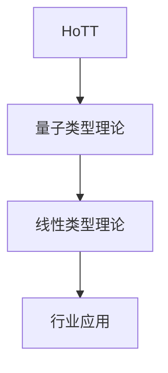

# 1.x 其他形式化主题

## 目录

1.x.1 主题概述  
1.x.2 相关前沿理论  
1.x.3 典型模型与方法  
1.x.4 形式化定义与证明  
1.x.5 行业应用与案例  
1.x.6 图表与多表征  
1.x.7 相关性与交叉引用  
1.x.8 参考文献与延伸阅读  

---

### 1.x.1 主题概述

本节收录尚未归入前述各节的其他重要形式化理论主题，如同伦类型理论、量子类型理论、线性/仿射类型理论等。

### 1.x.2 相关前沿理论

- 同伦类型理论（HoTT）
- 量子类型理论
- 线性类型与仿射类型理论

### 1.x.3 典型模型与方法

- 高阶范畴、拓扑空间、量子计算模型等

### 1.x.4 形式化定义与证明

#### HoTT中的等价类型（Lean 代码示例）

```lean
structure Equiv (A B : Type) :=
  (to_fun : A → B)
  (inv_fun : B → A)
  (left_inv : ∀ x, inv_fun (to_fun x) = x)
  (right_inv : ∀ y, to_fun (inv_fun y) = y)
```

#### 量子比特的LaTeX表达

$$
|\psi\rangle = \alpha|0\rangle + \beta|1\rangle,\ \alpha,\beta \in \mathbb{C},\ |\alpha|^2 + |\beta|^2 = 1
$$

### 1.x.5 行业应用与案例

- 量子计算、同伦推理、资源敏感型系统等

### 1.x.6 图表与多表征



### 1.x.7 相关性与交叉引用

- [1.1-统一形式化理论综述](./1.1-统一形式化理论综述.md)
- [2.1-数学内容全景分析](../2-数学基础与应用/2.1-数学内容全景分析.md)

### 1.x.8 参考文献与延伸阅读

- 《同伦类型理论导论》
- 《量子计算与类型理论》
- 相关论文与开源项目
