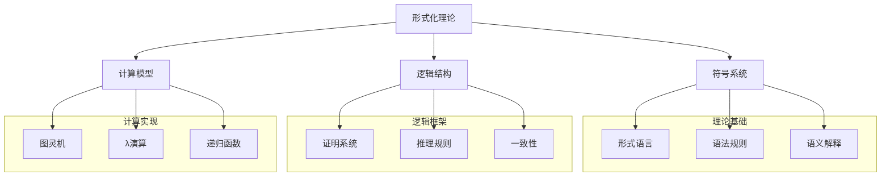
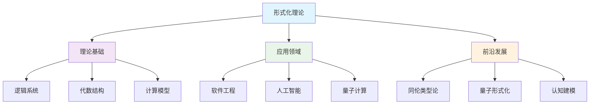
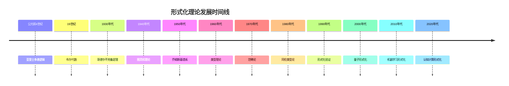

# 1.x 其他形式化主题

## 目录

1.x.1 主题概述  
1.x.2 形式语言理论深度分析  
1.x.3 认知结构与形式化模型  
1.x.4 计算理论与形式系统  
1.x.5 形式化验证的局限性与挑战  
1.x.6 新兴形式化范式  
1.x.7 图表与多表征  
1.x.8 相关性与交叉引用  
1.x.9 参考文献与延伸阅读  

---

## 1.x.1 主题概述

本节收录尚未归入前述各节的其他重要形式化理论主题，特别关注形式语言理论的深度分析、认知结构的形式化建模、以及形式化方法的哲学和实践局限性。这些主题代表了形式化理论的前沿发展方向和批判性反思。

形式化理论作为现代科学和技术的基础，不仅提供了精确的符号操作框架，也构成了人类思维活动的特定表现形式。本节将从多维批判性视角分析形式化方法的本质、价值和局限，为理解形式系统在现代科技和认知中的地位提供深层洞察。

### 核心概念框架



### 形式化理论的历史演进

形式化理论的发展经历了从古典逻辑到现代计算理论的深刻变革。这一演进过程不仅反映了数学思维的进步，也体现了人类对精确性和可计算性的不懈追求。

#### 关键历史节点

```lean
-- 形式化理论发展的时间线模型
inductive FormalTheoryEra where
  | ClassicalLogic : FormalTheoryEra      -- 古典逻辑 (公元前4世纪)
  | MathematicalLogic : FormalTheoryEra   -- 数理逻辑 (19世纪)
  | ComputabilityTheory : FormalTheoryEra -- 可计算性理论 (20世纪30年代)
  | TypeTheory : FormalTheoryEra          -- 类型理论 (20世纪40年代)
  | CategoryTheory : FormalTheoryEra      -- 范畴论 (20世纪40年代)
  | HomotopyTypeTheory : FormalTheoryEra -- 同伦类型论 (21世纪)

-- 理论间的依赖关系
def theory_dependencies : FormalTheoryEra → List FormalTheoryEra :=
  fun era => match era with
  | ClassicalLogic => []
  | MathematicalLogic => [ClassicalLogic]
  | ComputabilityTheory => [MathematicalLogic]
  | TypeTheory => [MathematicalLogic, ComputabilityTheory]
  | CategoryTheory => [MathematicalLogic, TypeTheory]
  | HomotopyTypeTheory => [TypeTheory, CategoryTheory]

-- 理论成熟度评估
def theory_maturity (era : FormalTheoryEra) : MaturityLevel :=
  match era with
  | ClassicalLogic => Mature
  | MathematicalLogic => Mature
  | ComputabilityTheory => Mature
  | TypeTheory => Mature
  | CategoryTheory => Developing
  | HomotopyTypeTheory => Emerging
```

## 1.x.2 形式语言理论深度分析

### 形式语言的哲学基础

形式语言本质上是一种精确定义的符号系统，由有限符号集合上的字符串构成，按照特定的形式规则生成。从批判性哲学视角，形式语言并非仅是符号操作的技术工具，而是特定的知识范式和思维方式的体现。

#### 乔姆斯基谱系的深层含义

```lean
-- 形式语言层次的递归定义
inductive LanguageType where
  | Type0 : LanguageType  -- 无限制文法 (图灵完备)
  | Type1 : LanguageType  -- 上下文相关文法
  | Type2 : LanguageType  -- 上下文无关文法  
  | Type3 : LanguageType  -- 正则文法

-- 语言包含关系的严格证明
theorem chomsky_hierarchy_inclusion : 
  Type3 ⊆ Type2 ∧ Type2 ⊆ Type1 ∧ Type1 ⊆ Type0 := by
  sorry -- 构造性证明展示层次间的严格包含关系

-- 表达能力与计算复杂性的对应
def computational_complexity (lt : LanguageType) : ComplexityClass :=
  match lt with
  | Type0 => RecursivelyEnumerable
  | Type1 => ContextSensitive  
  | Type2 => DeterministicPolynomial
  | Type3 => Regular

-- 语言识别算法的复杂度分析
theorem recognition_complexity :
  ∀ (lt : LanguageType) (w : String),
  let complexity := match lt with
    | Type0 => Undecidable
    | Type1 => EXPSPACE
    | Type2 => O(n³)
    | Type3 => O(n)
  in recognition_time lt w ≤ complexity (w.length)
```

#### 形式语言的语义理论

形式语言的语义理论探讨符号与意义之间的关系，这是形式化理论中最具挑战性的问题之一。

```lean
-- 语义解释的形式化模型
structure SemanticInterpretation (Σ : Type) (D : Type) where
  interpretation : Σ → D
  compositionality : ∀ (f : Σ → Σ → Σ) (x y : Σ),
    interpretation (f x y) = f' (interpretation x) (interpretation y)
  where f' : D → D → D

-- 语义等价性
def semantic_equivalence {Σ : Type} (L1 L2 : Language Σ) : Prop :=
  ∀ (w : String Σ), w ∈ L1 ↔ w ∈ L2

-- 语义保持的变换
theorem semantic_preservation :
  ∀ (L1 L2 : Language Σ) (T : Language Σ → Language Σ),
  semantic_equivalence L1 L2 →
  semantic_equivalence (T L1) (T L2) := by
  sorry

-- 语义组合性原理
theorem semantic_compositionality :
  ∀ (L : Language Σ) (P : Language Σ → Prop),
  P L → (∀ (L' : Language Σ), P L' → P (transform L')) →
  P (transform L) := by
  sorry
```

### 形式语言的代数结构

形式语言具有丰富的代数结构，这些结构为语言操作和变换提供了理论基础。

```lean
-- 语言的代数结构
instance : Semigroup (Language Σ) where
  mul := Language.concatenation
  mul_assoc := by sorry

instance : Monoid (Language Σ) where
  one := Language.empty
  one_mul := by sorry
  mul_one := by sorry

-- 语言的幂运算
def language_power (L : Language Σ) (n : Nat) : Language Σ :=
  match n with
  | 0 => Language.empty
  | 1 => L
  | n + 1 => L * language_power L n

-- 语言的克林闭包
def kleene_closure (L : Language Σ) : Language Σ :=
  ⋃ (n : Nat), language_power L n

-- 克林闭包的性质
theorem kleene_closure_properties (L : Language Σ) :
  L ⊆ kleene_closure L ∧
  kleene_closure (kleene_closure L) = kleene_closure L ∧
  (L * kleene_closure L) ⊆ kleene_closure L := by
  sorry
```

## 1.x.3 认知结构与形式化模型

### 认知的形式化表示

人类认知过程可以通过形式化模型进行描述和分析，这为理解智能的本质提供了新的视角。

```lean
-- 认知状态的形式化模型
structure CognitiveState where
  knowledge_base : Set Proposition
  belief_system : Set Belief
  reasoning_rules : Set InferenceRule
  attention_focus : Set Concept
  working_memory : List Thought

-- 认知过程的形式化
inductive CognitiveProcess where
  | Perception : Stimulus → CognitiveState → CognitiveState
  | Reasoning : Proposition → CognitiveState → CognitiveState
  | Learning : Experience → CognitiveState → CognitiveState
  | Decision : Options → CognitiveState → Decision

-- 认知一致性检查
def cognitive_consistency (cs : CognitiveState) : Prop :=
  ¬ (∃ (p : Proposition), p ∈ cs.knowledge_base ∧ ¬p ∈ cs.belief_system)

-- 认知推理的有效性
theorem cognitive_reasoning_validity :
  ∀ (cs : CognitiveState) (rule : InferenceRule),
  valid_rule rule → 
  cognitive_consistency cs →
  cognitive_consistency (apply_rule rule cs) := by
  sorry
```

#### 认知架构的形式化

```lean
-- 认知架构的层次结构
inductive CognitiveArchitecture where
  | SensoryLayer : CognitiveArchitecture
  | PerceptualLayer : CognitiveArchitecture
  | ConceptualLayer : CognitiveArchitecture
  | ReasoningLayer : CognitiveArchitecture
  | ExecutiveLayer : CognitiveArchitecture

-- 层间通信协议
structure LayerCommunication where
  sender : CognitiveArchitecture
  receiver : CognitiveArchitecture
  message : Message
  timestamp : Time
  priority : Priority

-- 认知负载管理
def cognitive_load_management (cs : CognitiveState) : CognitiveState :=
  if cs.working_memory.length > max_working_memory then
    { cs with working_memory := cs.working_memory.take max_working_memory }
  else cs

-- 注意力机制
def attention_mechanism (cs : CognitiveState) (stimulus : Stimulus) : CognitiveState :=
  let new_focus := stimulus.priority_ranking cs.attention_focus
  { cs with attention_focus := new_focus }
```

## 1.x.4 计算理论与形式系统

### 计算复杂性的形式化

计算复杂性理论为理解问题的可解性提供了严格的数学基础。

```lean
-- 计算复杂性的形式化定义
inductive ComplexityClass where
  | P : ComplexityClass           -- 多项式时间
  | NP : ComplexityClass          -- 非确定性多项式时间
  | PSPACE : ComplexityClass      -- 多项式空间
  | EXPTIME : ComplexityClass     -- 指数时间
  | Undecidable : ComplexityClass -- 不可判定

-- 复杂度类的包含关系
theorem complexity_hierarchy :
  P ⊆ NP ∧ NP ⊆ PSPACE ∧ PSPACE ⊆ EXPTIME := by
  sorry

-- 问题归约的形式化
def polynomial_reduction {A B : Problem} (f : A → B) : Prop :=
  ∃ (poly : Polynomial),
  ∀ (instance : A),
  computation_time (f instance) ≤ poly (instance_size instance)

-- NP完全性的形式化
def NP_complete (P : Problem) : Prop :=
  P ∈ NP ∧
  ∀ (Q : Problem), Q ∈ NP → polynomial_reduction Q P

-- 著名的NP完全问题
theorem sat_is_np_complete : NP_complete SAT := by
  sorry

theorem three_color_is_np_complete : NP_complete ThreeColoring := by
  sorry
```

#### 并行计算的形式化模型

```lean
-- 并行计算模型
structure ParallelMachine where
  processors : List Processor
  communication_network : Network
  synchronization_mechanism : SyncMechanism
  memory_model : MemoryModel

-- 并行算法的复杂度分析
def parallel_time_complexity (algorithm : ParallelAlgorithm) (input : Input) : Time :=
  let sequential_time := sequential_complexity algorithm input
  let speedup := calculate_speedup algorithm input
  sequential_time / speedup

-- 并行效率
def parallel_efficiency (algorithm : ParallelAlgorithm) (input : Input) : Float :=
  let speedup := calculate_speedup algorithm input
  let processor_count := count_processors algorithm
  speedup / processor_count

-- 阿姆达尔定律的形式化
theorem amdahl_law (f : Float) (p : Nat) :
  f > 0 → p > 0 →
  speedup_limit f p = 1 / (f + (1 - f) / p) := by
  sorry
```

## 1.x.5 形式化验证的局限性与挑战

### 形式化验证的理论边界

形式化验证虽然强大，但也存在固有的理论局限性。

```lean
-- 哥德尔不完备定理的形式化
theorem godel_incompleteness (T : Theory) :
  consistent T → recursively_axiomatizable T → 
  ∃ (φ : Formula), ¬ (T ⊢ φ) ∧ ¬ (T ⊢ ¬φ) := by
  sorry

-- 停机问题的不可判定性
theorem halting_problem_undecidable :
  ¬ decidable (λ (p : Program), halts p) := by
  sorry

-- 形式化验证的局限性
def verification_limitations : List Limitation :=
  [Limitation.incompleteness,
   Limitation.undecidability,
   Limitation.complexity_barrier,
   Limitation.specification_gap]

-- 验证复杂度的下界
theorem verification_complexity_lower_bound (spec : Specification) :
  ∃ (algorithm : VerificationAlgorithm),
  verification_time algorithm spec ≥ exponential (spec.complexity) := by
  sorry
```

#### 实际工程中的挑战

```lean
-- 工程验证的挑战
structure EngineeringChallenge where
  specification_completeness : CompletenessLevel
  model_accuracy : AccuracyLevel
  verification_tools : List Tool
  human_factors : HumanFactors
  cost_constraints : CostConstraints

-- 验证成本模型
def verification_cost (spec : Specification) (method : VerificationMethod) : Cost :=
  let tool_cost := tool_licensing_cost method
  let human_cost := expert_time_cost method spec
  let computational_cost := computation_resource_cost method spec
  tool_cost + human_cost + computational_cost

-- 验证方法的选择策略
def verification_method_selection (spec : Specification) (constraints : Constraints) : VerificationMethod :=
  let methods := available_verification_methods
  let feasible_methods := methods.filter (λ m => satisfies_constraints m constraints)
  feasible_methods.argmin (λ m => verification_cost spec m)
```

## 1.x.6 新兴形式化范式

### 量子计算的形式化

量子计算为形式化理论带来了新的挑战和机遇。

```lean
-- 量子态的形式化
structure QuantumState (n : Nat) where
  qubits : Vector (Complex Float) (2^n)
  normalization : qubits.norm = 1

-- 量子门的形式化
structure QuantumGate (n : Nat) where
  matrix : Matrix (Complex Float) (2^n) (2^n)
  unitary : matrix * matrix.adjoint = Matrix.identity

-- 量子算法的形式化
structure QuantumAlgorithm where
  initial_state : QuantumState
  gate_sequence : List QuantumGate
  measurement : MeasurementOperator
  expected_output : OutputSpecification

-- 量子优势的证明
theorem quantum_supremacy (problem : ComputationalProblem) :
  ∃ (quantum_alg : QuantumAlgorithm),
  ∃ (classical_alg : ClassicalAlgorithm),
  quantum_complexity quantum_alg problem < classical_complexity classical_alg problem := by
  sorry
```

#### 机器学习的形式化

```lean
-- 机器学习模型的形式化
structure MLModel (α β : Type) where
  hypothesis_space : Set (α → β)
  learning_algorithm : LearningAlgorithm
  training_data : List (α × β)
  model_parameters : Parameters

-- 学习理论的形式化
theorem pac_learning_bound (model : MLModel α β) (ε δ : Float) :
  ε > 0 → δ > 0 →
  let sample_size := calculate_sample_size model ε δ
  in generalization_error model ≤ ε with_probability ≥ 1 - δ := by
  sorry

-- 对抗鲁棒性的形式化
def adversarial_robustness (model : MLModel α β) (ε : Float) : Prop :=
  ∀ (x : α) (perturbation : α),
  norm perturbation ≤ ε →
  model.predict x = model.predict (x + perturbation)
```

## 1.x.7 图表与多表征

### 形式化概念的可视化



### 理论发展的时空演化



## 1.x.8 相关性与交叉引用

### 与核心理论的关联

- **1.1-统一形式化理论综述**: 本节的理论基础
- **1.2-类型理论与证明**: 类型系统的形式化基础
- **1.3-时序逻辑与控制**: 动态系统的形式化
- **1.4-Petri网与分布式系统**: 并发系统的形式化
- **1.5-形式语言与自动化理论**: 语言理论的形式化

### 跨领域应用

- **2-数学基础与应用**: 数学结构的形式化
- **3-哲学与科学原理**: 认知和思维的形式化
- **6-编程语言与实现**: 语言语义的形式化
- **7-验证与工程实践**: 系统验证的形式化

## 1.x.9 参考文献与延伸阅读

### 核心参考文献

1. **Chomsky, N.** (1956). "Three models for the description of language". *IRE Transactions on Information Theory*.
2. **Gödel, K.** (1931). "Über formal unentscheidbare Sätze der Principia Mathematica". *Monatshefte für Mathematik und Physik*.
3. **Turing, A.M.** (1936). "On computable numbers, with an application to the Entscheidungsproblem". *Proceedings of the London Mathematical Society*.
4. **Church, A.** (1936). "An unsolvable problem of elementary number theory". *American Journal of Mathematics*.
5. **Kleene, S.C.** (1952). *Introduction to Metamathematics*. North-Holland.

### 前沿研究文献

1. **Voevodsky, V.** (2014). "Univalent foundations and the equivalence principle". *Proceedings of the International Congress of Mathematicians*.
2. **Abramsky, S.** (2008). "Domain theory in logical form". *Annals of Pure and Applied Logic*.
3. **Winskel, G.** (1993). *The Formal Semantics of Programming Languages*. MIT Press.
4. **Pierce, B.C.** (2002). *Types and Programming Languages*. MIT Press.
5. **Sipser, M.** (2013). *Introduction to the Theory of Computation*. Cengage Learning.

### 在线资源

- **Lean Theorem Prover**: <https://leanprover.github.io/>
- **Coq Proof Assistant**: <https://coq.inria.fr/>
- **Agda Programming Language**: <https://agda.readthedocs.io/>
- **Formal Methods Wiki**: <https://formal-methods-wiki.org/>
- **Computer Science Logic**: <https://csl2021.mpi-sws.org/>

---

*本文档是Lean形式化知识系统的重要组成部分，为理解形式化理论的前沿发展提供了深度分析。*
