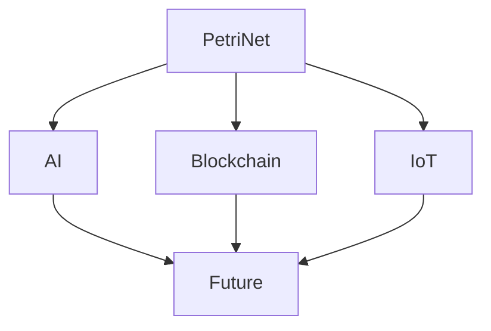

# 1.4.6 Future of Petri Net and Distributed Systems

[Back to Parent](../1.4-petri-net-and-distributed-systems.md) | [中文版](../../1-formal-theory/1.4-petri-net-and-distributed-systems/1.4.6-Petri网与分布式系统的未来展望.md)

## Table of Contents

- [1.4.6 Future of Petri Net and Distributed Systems](#146-future-of-petri-net-and-distributed-systems)
  - [Table of Contents](#table-of-contents)
  - [1.4.6.1 Future Research Directions](#1461-future-research-directions)
  - [1.4.6.2 Typical Application Prospects](#1462-typical-application-prospects)
  - [1.4.6.3 Cross-domain Integration](#1463-cross-domain-integration)
  - [1.4.6.4 Mermaid Diagram Example](#1464-mermaid-diagram-example)
  - [1.4.6.5 Code Example](#1465-code-example)
  - [1.4.6.6 References](#1466-references)

---

## 1.4.6.1 Future Research Directions

TODO: Petri nets in AI, blockchain, IoT, etc.

## 1.4.6.2 Typical Application Prospects

TODO: Applications in future industry, smart manufacturing, distributed systems.

## 1.4.6.3 Cross-domain Integration

TODO: Integration with formal verification, automated reasoning, cybersecurity, etc.

## 1.4.6.4 Mermaid Diagram Example



## 1.4.6.5 Code Example

```lean
-- Lean pseudo-code example
structure PetriNet :=
  (places : Type)
  (transitions : Type)
  (pre : transitions → places → ℕ)
  (post : transitions → places → ℕ)
```

```rust
// Rust pseudo-code example
struct PetriNet {
    places: Vec<String>,
    transitions: Vec<String>,
}
```

## 1.4.6.6 References

- [Petri Nets: Properties, Analysis and Applications](https://en.wikipedia.org/wiki/Petri_net)
- TODO: More authoritative references

---

[Back to Tree](../../0-Overview-and-Navigation/0.1-Global-Topic-Tree.md)
