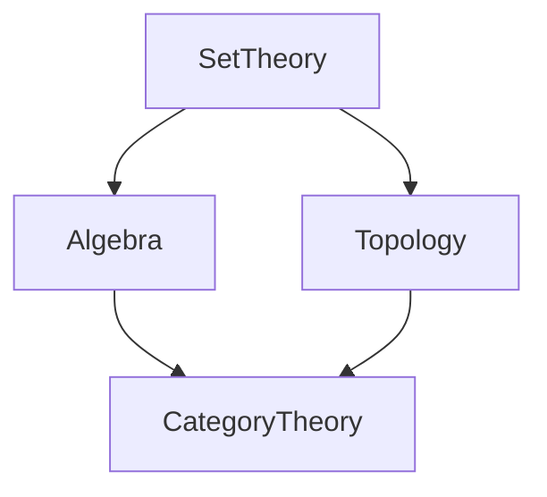

# 2.1 数学内容全景分析

[返回上级](../2-数学基础与应用.md) | [English Version](../2-mathematics-and-applications/2.1-mathematical-content-panoramic-analysis.md)

## 目录

- [2.1 数学内容全景分析](#21-数学内容全景分析)
  - [目录](#目录)
  - [2.1.1 数学基础结构图](#211-数学基础结构图)
  - [2.1.2 典型定理与证明](#212-典型定理与证明)
  - [2.1.3 代码示例](#213-代码示例)
  - [2.1.4 参考文献](#214-参考文献)

---

## 2.1.1 数学基础结构图



## 2.1.2 典型定理与证明

\[
\forall A, B \in \mathbb{N},\; A + B = B + A
\]

```lean
-- Lean 伪代码：加法交换律
example (A B : ℕ) : A + B = B + A := add_comm A B
```

## 2.1.3 代码示例

```rust
// Rust 伪代码：加法交换律
fn add_comm(a: u32, b: u32) -> bool {
    a + b == b + a
}
```

## 2.1.4 参考文献

- 《数学原理》
- [Wikipedia: Mathematics](https://en.wikipedia.org/wiki/Mathematics)
- TODO: 更多权威文献

---

[返回目录](../0-总览与导航/0.1-全局主题树形目录.md)
