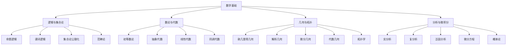
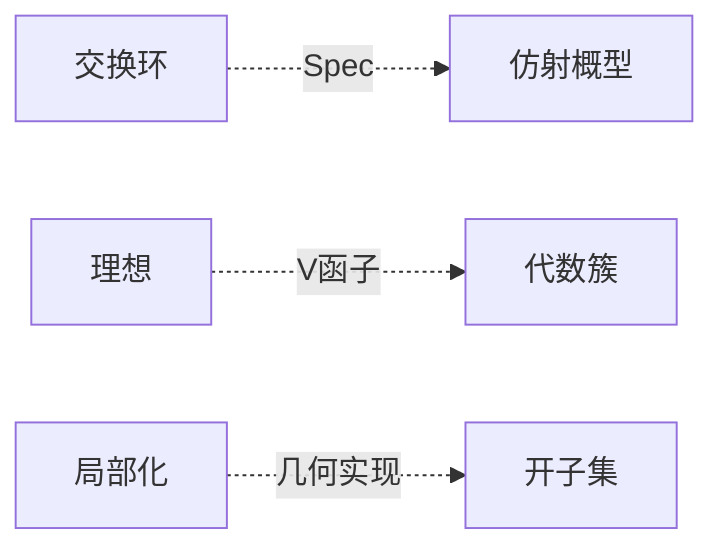
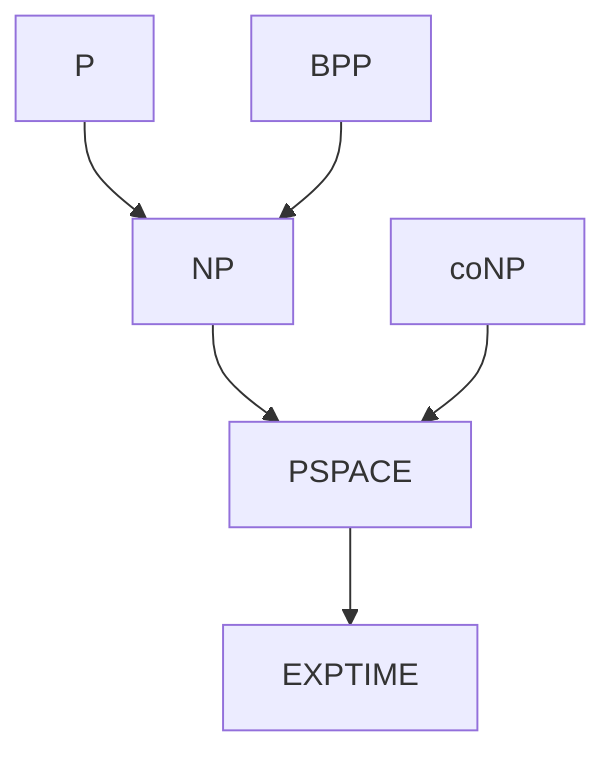
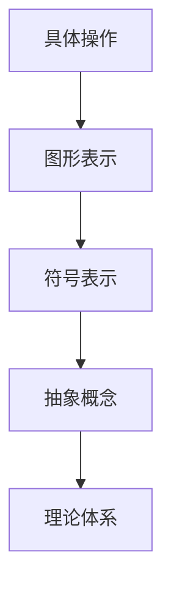

# 2.1 数学内容全景分析

[返回上级](../2-数学基础与应用.md) | [English Version](../2-mathematics-and-applications/2.1-mathematical-content-panoramic-analysis.md)

## 目录

- [2.1 数学内容全景分析](#21-数学内容全景分析)
  - [目录](#目录)
  - [2.1.1 数学体系的整体架构](#211-数学体系的整体架构)
    - [2.1.1.1 数学的层次结构](#2111-数学的层次结构)
    - [2.1.1.2 数学统一性的哲学基础](#2112-数学统一性的哲学基础)
  - [2.1.2 核心数学分支详细分析](#212-核心数学分支详细分析)
    - [2.1.2.1 代数学体系](#2121-代数学体系)
      - [基本代数结构](#基本代数结构)
      - [线性代数核心](#线性代数核心)
    - [2.1.2.2 分析学体系](#2122-分析学体系)
      - [实分析基础](#实分析基础)
      - [复分析理论](#复分析理论)
      - [泛函分析核心](#泛函分析核心)
    - [2.1.2.3 几何学体系](#2123-几何学体系)
      - [微分几何](#微分几何)
      - [代数几何](#代数几何)
      - [拓扑学](#拓扑学)
    - [2.1.2.4 数论体系](#2124-数论体系)
      - [解析数论](#解析数论)
      - [代数数论](#代数数论)
  - [2.1.3 数学分支间的深层关联](#213-数学分支间的深层关联)
    - [2.1.3.1 代数-几何对应](#2131-代数-几何对应)
    - [2.1.3.2 分析-拓扑联系](#2132-分析-拓扑联系)
    - [2.1.3.3 数论-分析融合](#2133-数论-分析融合)
  - [2.1.4 数学与计算科学的接口](#214-数学与计算科学的接口)
    - [2.1.4.1 计算复杂性理论](#2141-计算复杂性理论)
    - [2.1.4.2 密码学数学基础](#2142-密码学数学基础)
    - [2.1.4.3 机器学习的数学基础](#2143-机器学习的数学基础)
  - [2.1.5 数学的应用领域分析](#215-数学的应用领域分析)
    - [2.1.5.1 物理学中的数学](#2151-物理学中的数学)
    - [2.1.5.2 工程学中的数学应用](#2152-工程学中的数学应用)
    - [2.1.5.3 生物学中的数学建模](#2153-生物学中的数学建模)
  - [2.1.6 现代数学的发展趋势](#216-现代数学的发展趋势)
    - [2.1.6.1 计算机辅助证明](#2161-计算机辅助证明)
    - [2.1.6.2 数据科学与统计](#2162-数据科学与统计)
    - [2.1.6.3 跨学科数学应用](#2163-跨学科数学应用)
  - [2.1.7 数学教育与认知](#217-数学教育与认知)
    - [2.1.7.1 数学概念的认知发展](#2171-数学概念的认知发展)
    - [2.1.7.2 数学思维模式](#2172-数学思维模式)
    - [2.1.7.3 数学学习的认知障碍](#2173-数学学习的认知障碍)
  - [2.1.8 数学哲学反思](#218-数学哲学反思)
    - [2.1.8.1 数学本体论问题](#2181-数学本体论问题)
    - [2.1.8.2 数学真理的性质](#2182-数学真理的性质)
    - [2.1.8.3 数学与现实的关系](#2183-数学与现实的关系)
  - [2.1.9 总结与展望](#219-总结与展望)
    - [2.1.9.1 未来发展方向](#2191-未来发展方向)
    - [2.1.9.2 技术革命对数学的影响](#2192-技术革命对数学的影响)
  - [交叉引用](#交叉引用)
    - [相关主题](#相关主题)
    - [本地导航](#本地导航)
    - [参考文献](#参考文献)
      - [权威文献](#权威文献)
      - [在线资源](#在线资源)
      - [延伸阅读](#延伸阅读)

---

## 2.1.1 数学体系的整体架构

### 2.1.1.1 数学的层次结构

数学作为一个统一的知识体系，呈现出清晰的层次结构和内在关联：



### 2.1.1.2 数学统一性的哲学基础

数学的统一性体现在多个层面：

1. **结构统一性**：不同数学分支共享相似的代数结构
2. **方法统一性**：证明技巧和推理模式的共通性
3. **概念统一性**：核心概念在不同领域的重现
4. **哲学统一性**：数学对象的本体论地位

**数学结构的层次对应**：
$$\text{集合} \subset \text{群} \subset \text{环} \subset \text{域} \subset \text{向量空间} \subset \text{代数}$$

## 2.1.2 核心数学分支详细分析

### 2.1.2.1 代数学体系

#### 基本代数结构

**群论基础**：
群$(G, \cdot)$满足：

1. **结合律**：$(a \cdot b) \cdot c = a \cdot (b \cdot c)$
2. **单位元**：$\exists e \in G, \forall a \in G: e \cdot a = a \cdot e = a$
3. **逆元**：$\forall a \in G, \exists a^{-1} \in G: a \cdot a^{-1} = a^{-1} \cdot a = e$

**环论结构**：
环$(R, +, \cdot)$是群$(R, +)$加上乘法运算，满足：

- 乘法结合律
- 分配律：$a(b + c) = ab + ac$

**域论特性**：
域是每个非零元都有乘法逆元的交换环。

```lean
-- Lean中的代数结构定义示例
class Group (G : Type*) extends Mul G, One G, Inv G where
  mul_assoc : ∀ a b c : G, (a * b) * c = a * (b * c)
  one_mul : ∀ a : G, 1 * a = a
  mul_left_inv : ∀ a : G, a⁻¹ * a = 1

class Ring (R : Type*) extends AddCommGroup R, Monoid R, Distrib R
```

#### 线性代数核心

**向量空间理论**：
向量空间$V$在域$F$上定义，满足：

- 向量加法：$(V, +)$构成阿贝尔群
- 标量乘法：$F \times V \to V$满足分配律

**矩阵理论**：

- **特征值理论**：$Av = \lambda v$
- **奇异值分解**：$A = U\Sigma V^T$
- **谱理论**：对称矩阵的对角化

```python
# 数值线性代数示例
import numpy as np

def matrix_decomposition_analysis():
    """矩阵分解的数学理论实现"""
    A = np.random.randn(100, 100)
    
    # 特征值分解
    eigenvals, eigenvecs = np.linalg.eig(A)
    
    # 奇异值分解
    U, sigma, Vt = np.linalg.svd(A)
    
    # QR分解
    Q, R = np.linalg.qr(A)
    
    return {
        'eigenvalue_spectrum': eigenvals,
        'singular_values': sigma,
        'condition_number': np.linalg.cond(A)
    }
```

### 2.1.2.2 分析学体系

#### 实分析基础

**测度论**：
勒贝格测度$\mu$满足：

1. **非负性**：$\mu(E) \geq 0$
2. **空集测度**：$\mu(\emptyset) = 0$
3. **可数可加性**：$\mu(\bigcup_{i=1}^{\infty} E_i) = \sum_{i=1}^{\infty} \mu(E_i)$

**积分理论**：
勒贝格积分：$\int_E f d\mu = \lim_{n \to \infty} \int_E f_n d\mu$

```lean
-- 勒贝格积分的形式化定义
def lebesgue_integral (μ : Measure α) (f : α → ℝ≥0∞) : ℝ≥0∞ :=
  ⨆ (φ : α →ₛ ℝ≥0∞) (h : φ ≤ f), φ.integral μ
```

#### 复分析理论

**解析函数**：
函数$f(z)$在区域$D$内解析当且仅当：
$$\frac{\partial f}{\partial \bar{z}} = 0 \quad \text{（柯西-黎曼方程）}$$

**留数定理**：
$$\oint_C f(z) dz = 2\pi i \sum \text{Res}(f, z_k)$$

#### 泛函分析核心

**巴拿赫空间**：
完备的赋范向量空间$(X, \|\cdot\|)$

**希尔伯特空间**：
具有内积的完备向量空间$(H, \langle \cdot, \cdot \rangle)$

**算子理论**：
有界线性算子$T: X \to Y$满足：
$$\|T\| = \sup_{\|x\|=1} \|Tx\|$$

### 2.1.2.3 几何学体系

#### 微分几何

**流形理论**：
$n$维流形$M$局部同胚于$\mathbb{R}^n$

**黎曼几何**：
黎曼度量$g$定义了切空间上的内积：
$$ds^2 = g_{ij}dx^i dx^j$$

**曲率理论**：

- **高斯曲率**：$K = \frac{R_{1212}}{g_{11}g_{22} - g_{12}^2}$
- **平均曲率**：$H = \frac{1}{2}\text{tr}(\text{II})$

```lean
-- 微分几何的形式化表示
structure RiemannianManifold (M : Type*) [TopologicalSpace M] where
  metric : TensorField M (0, 2)
  positive_definite : ∀ p : M, ∀ v : TangentSpace M p, 
    metric p v v > 0 ∨ v = 0
```

#### 代数几何

**概型理论**：
概型$(X, \mathcal{O}_X)$由拓扑空间和结构层组成

**上同调理论**：
层上同调$H^i(X, \mathcal{F})$测量层的"缺陷"

#### 拓扑学

**点集拓扑**：
拓扑空间$(X, \tau)$其中$\tau$满足：

1. $\emptyset, X \in \tau$
2. 任意并集属于$\tau$
3. 有限交集属于$\tau$

**代数拓扑**：

- **基本群**：$\pi_1(X, x_0)$
- **同调群**：$H_n(X)$
- **上同调群**：$H^n(X)$

### 2.1.2.4 数论体系

#### 解析数论

**质数定理**：
$$\pi(x) \sim \frac{x}{\ln x} \quad \text{当} \quad x \to \infty$$

**黎曼$\zeta$函数**：
$$\zeta(s) = \sum_{n=1}^{\infty} \frac{1}{n^s} = \prod_p \frac{1}{1-p^{-s}}$$

#### 代数数论

**代数数域**：
$K = \mathbb{Q}(\alpha)$其中$\alpha$是代数数

**理想理论**：
整数环$\mathcal{O}_K$中的理想分解

```lean
-- 代数数论的形式化
def algebraic_integer (α : ℂ) : Prop :=
  ∃ (n : ℕ) (a : Fin n → ℤ), 
    (∑ i, a i * α ^ (i : ℕ)) = 0 ∧ a (n - 1) = 1
```

## 2.1.3 数学分支间的深层关联

### 2.1.3.1 代数-几何对应

**代数几何基本定理**：
$\mathbb{C}$上的多项式理想与代数簇之间的对应关系

**环与几何对象**：



### 2.1.3.2 分析-拓扑联系

**德拉姆上同调**：
微分形式的上同调与拓扑不变量的关系

**指标定理**：
$$\text{index}(D) = \int_M \text{ch}(\sigma(D)) \wedge \text{Td}(M)$$

### 2.1.3.3 数论-分析融合

**L函数理论**：
数论对象与复分析的深度结合

**模形式**：
$$f(\gamma z) = (cz + d)^k f(z) \quad \forall \gamma = \begin{pmatrix} a & b \\ c & d \end{pmatrix} \in SL_2(\mathbb{Z})$$

## 2.1.4 数学与计算科学的接口

### 2.1.4.1 计算复杂性理论

**复杂性类层次**：



**算法分析的数学工具**：

- **渐近分析**：$O, \Omega, \Theta$记号
- **概率方法**：随机算法分析
- **代数方法**：群论在算法设计中的应用

### 2.1.4.2 密码学数学基础

**数论在密码学中的应用**：

```python
# RSA加密的数学基础
def rsa_key_generation():
    """RSA密钥生成的数学原理"""
    p, q = generate_large_primes()  # 大质数
    n = p * q                       # 模数
    phi_n = (p - 1) * (q - 1)      # 欧拉函数
    e = 65537                       # 公钥指数
    d = mod_inverse(e, phi_n)       # 私钥指数
    
    return (n, e), (n, d)  # 公钥，私钥

# 椭圆曲线密码学
class EllipticCurve:
    """椭圆曲线的数学表示"""
    def __init__(self, a, b, p):
        self.a = a  # 曲线参数
        self.b = b  # 曲线参数
        self.p = p  # 有限域特征
        
    def point_addition(self, P, Q):
        """椭圆曲线上的点加法"""
        # 实现群运算
        pass
```

### 2.1.4.3 机器学习的数学基础

**优化理论**：
梯度下降法的收敛性分析：
$$x_{k+1} = x_k - \alpha_k \nabla f(x_k)$$

**概率论与统计**：
贝叶斯定理：
$$P(H|E) = \frac{P(E|H)P(H)}{P(E)}$$

**线性代数在深度学习中**：

```python
# 神经网络的数学基础
def neural_network_forward(X, weights, biases):
    """神经网络前向传播的矩阵计算"""
    activations = [X]
    
    for W, b in zip(weights, biases):
        # 线性变换
        z = activations[-1] @ W + b
        # 激活函数
        a = sigmoid(z)
        activations.append(a)
    
    return activations

def backpropagation(activations, weights, target):
    """反向传播算法的微积分基础"""
    # 链式法则的应用
    gradients = []
    delta = activations[-1] - target
    
    for i in reversed(range(len(weights))):
        grad = activations[i].T @ delta
        gradients.append(grad)
        delta = delta @ weights[i].T * sigmoid_derivative(activations[i])
    
    return gradients[::-1]
```

## 2.1.5 数学的应用领域分析

### 2.1.5.1 物理学中的数学

**量子力学的数学框架**：
希尔伯特空间中的态向量：
$$|\psi\rangle = \sum_i c_i |i\rangle$$

薛定谔方程：
$$i\hbar \frac{\partial}{\partial t}|\psi\rangle = \hat{H}|\psi\rangle$$

**广义相对论的几何化**：
爱因斯坦场方程：
$$G_{\mu\nu} = \frac{8\pi G}{c^4} T_{\mu\nu}$$

### 2.1.5.2 工程学中的数学应用

**控制理论**：
状态空间表示：
$$\dot{x} = Ax + Bu$$
$$y = Cx + Du$$

**信号处理**：
傅里叶变换：
$$\hat{f}(\xi) = \int_{-\infty}^{\infty} f(x) e^{-2\pi i x \xi} dx$$

### 2.1.5.3 生物学中的数学建模

**种群动力学**：
Lotka-Volterra方程：
$$\frac{dx}{dt} = ax - bxy$$
$$\frac{dy}{dt} = -cy + dxy$$

**生物信息学**：
序列比对的动态规划算法

## 2.1.6 现代数学的发展趋势

### 2.1.6.1 计算机辅助证明

**形式化数学**：
使用定理证明器进行数学证明：

```lean
-- 费马小定理的形式化证明
theorem fermat_little_theorem (p : ℕ) (a : ℤ) (hp : Prime p) (ha : ¬ p ∣ a) :
  a ^ (p - 1) ≡ 1 [MOD p] := by
  -- 证明过程
  sorry
```

### 2.1.6.2 数据科学与统计

**大数据分析的数学基础**：

- **高维统计**：维数诅咒的数学分析
- **机器学习理论**：PAC学习框架
- **信息理论**：熵与互信息

### 2.1.6.3 跨学科数学应用

**网络科学**：
图论在复杂网络分析中的应用

**金融数学**：
随机微分方程在期权定价中的应用：
$$dS_t = \mu S_t dt + \sigma S_t dW_t$$

## 2.1.7 数学教育与认知

### 2.1.7.1 数学概念的认知发展

**抽象化过程**：



### 2.1.7.2 数学思维模式

**数学推理类型**：

1. **演绎推理**：从一般到特殊
2. **归纳推理**：从特殊到一般
3. **类比推理**：结构相似性
4. **直觉推理**：模式识别

### 2.1.7.3 数学学习的认知障碍

**常见概念误区**：

- 无穷概念的理解困难
- 抽象结构的认知负荷
- 形式化语言的语义理解

## 2.1.8 数学哲学反思

### 2.1.8.1 数学本体论问题

**数学对象的存在性**：

- **柏拉图主义**：数学对象客观存在
- **形式主义**：数学是符号操作
- **直觉主义**：数学是心智构造

### 2.1.8.2 数学真理的性质

**数学知识的特殊性**：

1. **必然性**：数学真理的不变性
2. **普遍性**：跨文化的数学一致性
3. **确定性**：数学证明的绝对性

### 2.1.8.3 数学与现实的关系

**数学的不合理有效性**：
为什么数学在描述自然现象方面如此有效？

## 2.1.9 总结与展望

数学作为人类理性思维的最高形式，呈现出以下特征：

1. **统一性**：不同分支的内在关联
2. **普遍性**：跨领域的适用性
3. **发展性**：持续的概念创新
4. **实用性**：解决实际问题的能力

### 2.1.9.1 未来发展方向

**数学研究的新趋势**：

- **计算数学**：算法与数学理论的融合
- **应用数学**：跨学科问题的数学建模
- **形式化数学**：计算机辅助的数学研究

### 2.1.9.2 技术革命对数学的影响

**人工智能时代的数学**：

- 自动定理证明
- 数学发现的机器学习
- 大规模数值计算

---

## 交叉引用

### 相关主题

- [2.2 数学与形式化语言关系](2.2-数学与形式化语言关系.md) - 数学形式化理论
- [1.2 类型理论与证明](../1-形式化理论/1.2-类型理论与证明.md) - 数学证明的形式化
- [6.1 Lean语言与形式化证明](../6-编程语言与实现/6.1-lean语言与形式化证明.md) - 数学的计算实现
- [3.2 哲学与形式化推理](../3-哲学与科学原理/3.2-哲学与形式化推理.md) - 数学哲学

### 本地导航

- **上一节**: [2.0 数学基础与应用概述](../README.md)
- **下一节**: [2.2 数学与形式化语言关系](2.2-数学与形式化语言关系.md)
- **返回上级**: [2 数学基础与应用](../README.md)
- **返回根目录**: [分析主目录](../../README.md)

### 参考文献

#### 权威文献

1. Mac Lane, S. "Mathematics: Form and Function" - 数学的统一性分析
2. Atiyah, M., MacDonald, I. "Introduction to Commutative Algebra" - 代数几何基础
3. Rudin, W. "Real and Complex Analysis" - 分析学经典教材
4. Hartshorne, R. "Algebraic Geometry" - 现代代数几何

#### 在线资源

1. [Math Overflow](https://mathoverflow.net/) - 专业数学讨论平台
2. [nLab](https://ncatlab.org/) - 范畴论和高等数学wiki
3. [Lean Mathematical Library](https://leanprover-community.github.io/mathlib_docs/) - 形式化数学

#### 延伸阅读

1. Davis, P., Hersh, R. "The Mathematical Experience" - 数学哲学思考
2. Thurston, W. "On Proof and Progress in Mathematics" - 数学发现的认知过程
3. Voevodsky, V. "Foundations of Mathematics and Homotopy Type Theory" - 数学基础新发展

[返回目录](../0-总览与导航/0.1-全局主题树形目录.md)
