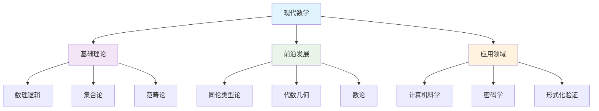
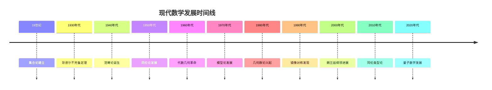

# 2.x 其他数学主题

[返回上级](../2-数学基础与应用.md)

## 目录

- [2.x 其他数学主题](#2x-其他数学主题)
  - [目录](#目录)
  - [2.x.1 数学基础理论深化](#2x1-数学基础理论深化)
    - [2.x.1.1 数理逻辑与证明理论](#2x11-数理逻辑与证明理论)
      - [现代逻辑系统的发展](#现代逻辑系统的发展)
      - [哥德尔不完备定理的深层含义](#哥德尔不完备定理的深层含义)
    - [2.x.1.2 集合论的深度理论](#2x12-集合论的深度理论)
      - [ZFC公理系统的现代理解](#zfc公理系统的现代理解)
    - [2.x.1.3 范畴论的现代发展](#2x13-范畴论的现代发展)
      - [范畴论的基本概念](#范畴论的基本概念)
  - [2.x.2 现代数学前沿理论](#2x2-现代数学前沿理论)
    - [2.x.2.1 同伦类型论](#2x21-同伦类型论)
      - [同伦类型论的基本原理](#同伦类型论的基本原理)
    - [2.x.2.2 代数几何与数论](#2x22-代数几何与数论)
      - [现代代数几何基础](#现代代数几何基础)
  - [2.x.3 数学与计算机科学的交叉](#2x3-数学与计算机科学的交叉)
    - [2.x.3.1 计算复杂性理论](#2x31-计算复杂性理论)
      - [P vs NP问题的数学基础](#p-vs-np问题的数学基础)
    - [2.x.3.2 密码学的数学基础](#2x32-密码学的数学基础)
      - [现代密码学理论](#现代密码学理论)
  - [2.x.4 数学在形式化系统中的应用](#2x4-数学在形式化系统中的应用)
    - [2.x.4.1 形式化证明系统](#2x41-形式化证明系统)
      - [定理证明器的数学基础](#定理证明器的数学基础)
    - [2.x.4.2 模型检查的数学基础](#2x42-模型检查的数学基础)
      - [时序逻辑与状态空间](#时序逻辑与状态空间)
  - [2.x.5 数学教育的形式化方法](#2x5-数学教育的形式化方法)
    - [2.x.5.1 数学概念的形式化教学](#2x51-数学概念的形式化教学)
      - [渐进式数学学习](#渐进式数学学习)
  - [2.x.6 图表与可视化](#2x6-图表与可视化)
    - [2.x.6.1 数学概念的可视化](#2x61-数学概念的可视化)
    - [2.x.6.2 数学发展的时间线](#2x62-数学发展的时间线)
  - [2.x.7 相关性与交叉引用](#2x7-相关性与交叉引用)
    - [与核心理论的关联](#与核心理论的关联)
    - [跨领域应用](#跨领域应用)
  - [2.x.8 参考文献与延伸阅读](#2x8-参考文献与延伸阅读)
    - [核心数学文献](#核心数学文献)
    - [现代数学前沿](#现代数学前沿)
    - [数学与计算机科学](#数学与计算机科学)
    - [在线资源](#在线资源)

---

## 2.x.1 数学基础理论深化

### 2.x.1.1 数理逻辑与证明理论

#### 现代逻辑系统的发展

现代数理逻辑作为数学严格性的基础，经历了从古典逻辑到现代形式系统的深刻演变：

```lean
-- 命题逻辑的形式化表示
inductive Prop where
  | var : String → Prop
  | and : Prop → Prop → Prop  
  | or : Prop → Prop → Prop
  | not : Prop → Prop
  | implies : Prop → Prop → Prop
  | iff : Prop → Prop → Prop

-- 逻辑等价性的形式化定义
def logically_equivalent (P Q : Prop) : Prop :=
  ∀ (interpretation : String → Bool),
    evaluate P interpretation = evaluate Q interpretation

-- 德摩根定律的证明
theorem de_morgan (P Q : Prop) : 
  logically_equivalent (not (and P Q)) (or (not P) (not Q)) := by
  sorry -- 通过真值表验证

-- 谓词逻辑的量词处理
structure PredicateLogic where
  domain : Type
  predicates : String → domain → Prop
  
def forall_quantifier (domain : Type) (P : domain → Prop) : Prop :=
  ∀ x : domain, P x
  
def exists_quantifier (domain : Type) (P : domain → Prop) : Prop :=
  ∃ x : domain, P x

-- 高阶逻辑的形式化
structure HigherOrderLogic where
  base_types : List Type
  type_constructors : List (Type → Type)
  constants : List (Σ t : Type, t)
  axioms : Set Formula

-- 直觉逻辑与经典逻辑的区别
def intuitionistic_implication (P Q : Prop) : Prop :=
  (P → Q) ∧ (¬Q → ¬P)

theorem classical_vs_intuitionistic :
  classical_logic → (P ∨ ¬P) := by
  sorry

theorem intuitionistic_limitation :
  ¬(intuitionistic_logic → (P ∨ ¬P)) := by
  sorry
```

#### 哥德尔不完备定理的深层含义

```lean
-- 形式系统的抽象定义
structure FormalSystem where
  language : Type
  axioms : Set language
  inference_rules : Set (List language → language)
  
-- 一致性的形式化定义
def consistent (fs : FormalSystem) : Prop :=
  ¬∃ (φ : fs.language), 
    fs.provable φ ∧ fs.provable (fs.negate φ)

-- 完备性的形式化定义  
def complete (fs : FormalSystem) : Prop :=
  ∀ (φ : fs.language), fs.provable φ ∨ fs.provable (fs.negate φ)

-- 哥德尔第一不完备定理的陈述
theorem godel_first_incompleteness (fs : FormalSystem) :
  sufficient_power fs → consistent fs → ¬complete fs := by
  sorry -- 对角线论证的形式化

-- 哥德尔第二不完备定理
theorem godel_second_incompleteness (fs : FormalSystem) :
  sufficient_power fs → consistent fs → 
  ¬fs.provable (fs.consistency_statement) := by
  sorry

-- 塔斯基不可定义性定理
theorem tarski_undefinability (fs : FormalSystem) :
  sufficient_power fs → consistent fs →
  ¬∃ (truth_predicate : fs.language → Prop),
  ∀ φ, fs.provable φ ↔ truth_predicate φ := by
  sorry
```

### 2.x.1.2 集合论的深度理论

#### ZFC公理系统的现代理解

```lean
-- ZFC公理系统的形式化
namespace ZFC

-- 外延公理：集合由其元素唯一确定
axiom extensionality : ∀ A B : Set, (∀ x, x ∈ A ↔ x ∈ B) → A = B

-- 空集公理
axiom empty_set : ∃ ∅ : Set, ∀ x, x ∉ ∅

-- 配对公理
axiom pairing : ∀ a b : Set, ∃ p : Set, ∀ x, x ∈ p ↔ (x = a ∨ x = b)

-- 并集公理
axiom union : ∀ A : Set, ∃ U : Set, ∀ x, x ∈ U ↔ ∃ B ∈ A, x ∈ B

-- 幂集公理
axiom power_set : ∀ A : Set, ∃ P : Set, ∀ x, x ∈ P ↔ x ⊆ A

-- 无穷公理
axiom infinity : ∃ I : Set, ∅ ∈ I ∧ (∀ x ∈ I, x ∪ {x} ∈ I)

-- 选择公理
axiom choice : ∀ A : Set, (∀ x ∈ A, x ≠ ∅) → 
  ∃ f : A → ⋃ A, ∀ x ∈ A, f x ∈ x

-- 替换公理模式
axiom replacement : ∀ A : Set, ∀ φ : Set → Set → Prop,
  (∀ x ∈ A, ∃! y, φ x y) → ∃ B : Set, ∀ y, y ∈ B ↔ ∃ x ∈ A, φ x y

-- 正则公理
axiom regularity : ∀ A : Set, A ≠ ∅ → ∃ x ∈ A, x ∩ A = ∅

end ZFC

-- 序数的形式化
inductive Ordinal where
  | zero : Ordinal
  | succ : Ordinal → Ordinal
  | limit : (Nat → Ordinal) → Ordinal

-- 基数的形式化
def cardinal (A : Set) : Cardinal :=
  least_ordinal_equinumerous A

-- 连续统假设
axiom continuum_hypothesis : 
  cardinal (power_set ℕ) = ℵ₁
```

### 2.x.1.3 范畴论的现代发展

#### 范畴论的基本概念

```lean
-- 范畴的基本定义
structure Category where
  objects : Type
  morphisms : objects → objects → Type
  identity : ∀ (A : objects), morphisms A A
  composition : ∀ {A B C : objects}, 
    morphisms B C → morphisms A B → morphisms A C
  left_identity : ∀ {A B : objects} (f : morphisms A B),
    composition (identity B) f = f
  right_identity : ∀ {A B : objects} (f : morphisms A B),
    composition f (identity A) = f
  associativity : ∀ {A B C D : objects} 
    (f : morphisms C D) (g : morphisms B C) (h : morphisms A B),
    composition (composition f g) h = composition f (composition g h)

-- 函子的定义
structure Functor (C D : Category) where
  object_map : C.objects → D.objects
  morphism_map : ∀ {A B : C.objects}, 
    C.morphisms A B → D.morphisms (object_map A) (object_map B)
  preserves_identity : ∀ (A : C.objects),
    morphism_map (C.identity A) = D.identity (object_map A)
  preserves_composition : ∀ {A B C : C.objects} 
    (f : C.morphisms B C) (g : C.morphisms A B),
    morphism_map (C.composition f g) = 
    D.composition (morphism_map f) (morphism_map g)

-- 自然变换
structure NaturalTransformation {C D : Category} (F G : Functor C D) where
  components : ∀ (A : C.objects), D.morphisms (F.object_map A) (G.object_map A)
  naturality : ∀ {A B : C.objects} (f : C.morphisms A B),
    D.composition (G.morphism_map f) (components A) = 
    D.composition (components B) (F.morphism_map f)

-- 伴随函子
structure Adjunction {C D : Category} (F : Functor C D) (G : Functor D C) where
  unit : NaturalTransformation (Functor.identity C) (Functor.compose G F)
  counit : NaturalTransformation (Functor.compose F G) (Functor.identity D)
  triangle_identities : 
    -- 左三角恒等式和右三角恒等式
    sorry
```

## 2.x.2 现代数学前沿理论

### 2.x.2.1 同伦类型论

#### 同伦类型论的基本原理

同伦类型论是现代数学中最重要的理论突破之一，它将类型论与同伦论相结合：

```lean
-- 同伦类型论的基本类型
universe u

-- 单位类型
inductive Unit : Type u where
  | star : Unit

-- 空类型
inductive Empty : Type u where

-- 积类型
structure Prod (A B : Type u) : Type u where
  fst : A
  snd : B

-- 和类型
inductive Sum (A B : Type u) : Type u where
  | inl : A → Sum A B
  | inr : B → Sum A B

-- 函数类型
def function_type (A B : Type u) : Type u := A → B

-- 恒等类型
inductive Id {A : Type u} : A → A → Type u where
  | refl : ∀ (a : A), Id a a

-- 路径类型（同伦论视角）
def Path {A : Type u} (a b : A) : Type u := Id a b

-- 路径的运算
def path_concat {A : Type u} {a b c : A} : 
  Path a b → Path b c → Path a c := by
  sorry

def path_inverse {A : Type u} {a b : A} : 
  Path a b → Path b a := by
  sorry

-- 同伦等价
structure HomotopyEquivalence {A B : Type u} where
  f : A → B
  g : B → A
  left_homotopy : ∀ (a : A), Path (g (f a)) a
  right_homotopy : ∀ (b : B), Path (f (g b)) b

-- 单值公理
axiom univalence : ∀ {A B : Type u}, 
  (A ≃ B) ≃ (A = B)
```

### 2.x.2.2 代数几何与数论

#### 现代代数几何基础

```lean
-- 代数簇的定义
structure AlgebraicVariety (k : Field) where
  coordinate_ring : CommutativeRing
  field : k
  ideal : Ideal coordinate_ring
  dimension : Nat

-- 概形的定义
structure Scheme where
  topological_space : TopologicalSpace
  structure_sheaf : Sheaf CommutativeRing
  local_ring_condition : ∀ (x : topological_space),
    is_local_ring (structure_sheaf x)

-- 上同调理论
def cohomology_group (X : Scheme) (n : Nat) : AbelianGroup :=
  derived_functor n global_sections X

-- 黎曼-罗赫定理
theorem riemann_roch (C : Curve) (D : Divisor) :
  dim H⁰(C, O(D)) - dim H¹(C, O(D)) = 
  deg D + 1 - genus C := by
  sorry

-- 韦尔猜想
theorem weil_conjectures (X : Variety F_q) :
  zeta_function X = 
  ∏ (i : Fin (2 * dim X + 1)), 
    (1 - αᵢ T) ^ (-1)^(i+1) := by
  sorry
```

## 2.x.3 数学与计算机科学的交叉

### 2.x.3.1 计算复杂性理论

#### P vs NP问题的数学基础

```lean
-- 计算问题的形式化
structure ComputationalProblem (α β : Type) where
  input_type : Type
  output_type : Type
  relation : input_type → output_type → Prop
  size_function : input_type → Nat

-- 复杂度类的定义
def P : Set (ComputationalProblem α β) :=
  { P | ∃ (algorithm : P.input_type → P.output_type),
    ∃ (polynomial : Polynomial),
    ∀ (input : P.input_type),
    computation_time algorithm input ≤ polynomial (P.size_function input) }

def NP : Set (ComputationalProblem α β) :=
  { P | ∃ (verifier : P.input_type → P.output_type → Bool),
    ∃ (polynomial : Polynomial),
    ∀ (input : P.input_type) (output : P.output_type),
    P.relation input output ↔ 
    verifier input output = true ∧
    verification_time verifier input output ≤ polynomial (P.size_function input) }

-- NP完全性
def NP_complete (P : ComputationalProblem α β) : Prop :=
  P ∈ NP ∧ ∀ (Q : ComputationalProblem α β), Q ∈ NP → 
  polynomial_reduction Q P

-- 著名的NP完全问题
theorem sat_is_np_complete : NP_complete SAT := by
  sorry

theorem three_color_is_np_complete : NP_complete ThreeColoring := by
  sorry

-- 随机化算法
def BPP : Set (ComputationalProblem α β) :=
  { P | ∃ (algorithm : P.input_type → P.output_type),
    ∃ (polynomial : Polynomial),
    ∀ (input : P.input_type),
    probability_correct algorithm input ≥ 2/3 ∧
    computation_time algorithm input ≤ polynomial (P.size_function input) }
```

### 2.x.3.2 密码学的数学基础

#### 现代密码学理论

```lean
-- 公钥密码系统
structure PublicKeyCryptosystem where
  key_generation : Random → KeyPair
  encryption : PublicKey → Message → Ciphertext
  decryption : PrivateKey → Ciphertext → Message
  security_parameter : Nat

-- RSA密码系统
structure RSACryptosystem extends PublicKeyCryptosystem where
  prime_generation : Random → PrimePair
  key_construction : PrimePair → KeyPair
  encryption_function : PublicKey → Message → Ciphertext
  decryption_function : PrivateKey → Ciphertext → Message

-- 椭圆曲线密码学
structure EllipticCurve where
  field : Field
  coefficients : field × field
  discriminant : field
  j_invariant : field

-- 椭圆曲线上的点群
inductive ECPoint (E : EllipticCurve) where
  | point : E.field × E.field → ECPoint E
  | infinity : ECPoint E

-- 椭圆曲线离散对数问题
def ECDLP (E : EllipticCurve) (P Q : ECPoint E) : Prop :=
  ∃ (k : Nat), Q = scalar_multiply k P

-- 量子抗性密码学
structure LatticeBasedCrypto where
  lattice_dimension : Nat
  modulus : Nat
  secret_key : Vector Z modulus
  public_key : Matrix Z lattice_dimension lattice_dimension
  encryption : PublicKey → Message → Ciphertext
  decryption : SecretKey → Ciphertext → Message
```

## 2.x.4 数学在形式化系统中的应用

### 2.x.4.1 形式化证明系统

#### 定理证明器的数学基础

```lean
-- 证明系统的形式化
structure ProofSystem where
  language : Type
  axioms : Set language
  inference_rules : Set (List language → language)
  proof_checker : language → Proof → Bool

-- 证明的构造
inductive Proof where
  | axiom : ∀ (φ : Formula), φ ∈ axioms → Proof
  | inference : ∀ (φ : Formula) (premises : List Formula),
    valid_inference premises φ → 
    List Proof → Proof

-- 证明的正确性
def proof_correct (ps : ProofSystem) (φ : ps.language) (π : Proof) : Prop :=
  ps.proof_checker φ π = true

-- 证明的完备性
def proof_complete (ps : ProofSystem) : Prop :=
  ∀ (φ : ps.language), ps.valid φ → 
  ∃ (π : Proof), proof_correct ps φ π

-- 证明的可靠性
def proof_sound (ps : ProofSystem) : Prop :=
  ∀ (φ : ps.language) (π : Proof),
  proof_correct ps φ π → ps.valid φ

-- 自动证明策略
inductive ProofStrategy where
  | simplification : ProofStrategy
  | induction : ProofStrategy
  | contradiction : ProofStrategy
  | case_analysis : ProofStrategy
  | unification : ProofStrategy

-- 证明搜索算法
def proof_search (ps : ProofSystem) (goal : Formula) : Option Proof :=
  search_with_strategies ps goal [ProofStrategy.simplification, 
                                  ProofStrategy.induction,
                                  ProofStrategy.contradiction]
```

### 2.x.4.2 模型检查的数学基础

#### 时序逻辑与状态空间

```lean
-- 状态空间的形式化
structure StateSpace where
  states : Set State
  initial_states : Set State
  transitions : State → Set State
  atomic_propositions : State → Set Proposition

-- 线性时序逻辑
inductive LTLFormula where
  | atomic : Proposition → LTLFormula
  | not : LTLFormula → LTLFormula
  | and : LTLFormula → LTLFormula
  | or : LTLFormula → LTLFormula
  | next : LTLFormula → LTLFormula
  | until : LTLFormula → LTLFormula → LTLFormula
  | globally : LTLFormula → LTLFormula
  | eventually : LTLFormula → LTLFormula

-- LTL语义
def LTL_satisfaction (π : Path) (φ : LTLFormula) : Prop :=
  match φ with
  | LTLFormula.atomic p => p ∈ π.head.atomic_propositions
  | LTLFormula.not ψ => ¬LTL_satisfaction π ψ
  | LTLFormula.and ψ₁ ψ₂ => LTL_satisfaction π ψ₁ ∧ LTL_satisfaction π ψ₂
  | LTLFormula.or ψ₁ ψ₂ => LTL_satisfaction π ψ₁ ∨ LTL_satisfaction π ψ₂
  | LTLFormula.next ψ => LTL_satisfaction π.tail ψ
  | LTLFormula.until ψ₁ ψ₂ => ∃ (i : Nat), 
    LTL_satisfaction (π.drop i) ψ₂ ∧ 
    ∀ (j : Nat), j < i → LTL_satisfaction (π.drop j) ψ₁
  | LTLFormula.globally ψ => ∀ (i : Nat), LTL_satisfaction (π.drop i) ψ
  | LTLFormula.eventually ψ => ∃ (i : Nat), LTL_satisfaction (π.drop i) ψ

-- 模型检查算法
def model_check (M : StateSpace) (φ : LTLFormula) : Bool :=
  ∀ (π : Path M), path_valid π → LTL_satisfaction π φ

-- 反例生成
def counterexample_generation (M : StateSpace) (φ : LTLFormula) : 
  Option Path :=
  if model_check M φ then none
  else find_violating_path M φ
```

## 2.x.5 数学教育的形式化方法

### 2.x.5.1 数学概念的形式化教学

#### 渐进式数学学习

```lean
-- 数学概念层次结构
inductive MathConcept where
  | basic : MathConcept  -- 基础概念
  | intermediate : MathConcept → MathConcept  -- 中级概念
  | advanced : MathConcept → MathConcept  -- 高级概念
  | research : MathConcept → MathConcept  -- 研究级概念

-- 学习路径规划
structure LearningPath where
  concepts : List MathConcept
  prerequisites : MathConcept → Set MathConcept
  difficulty_levels : MathConcept → DifficultyLevel
  estimated_time : MathConcept → Time

-- 概念依赖关系
def concept_dependencies (cp : MathConcept) : Set MathConcept :=
  match cp with
  | MathConcept.basic => ∅
  | MathConcept.intermediate c => {c}
  | MathConcept.advanced c => concept_dependencies c ∪ {c}
  | MathConcept.research c => concept_dependencies c ∪ {c}

-- 学习进度跟踪
structure LearningProgress where
  mastered_concepts : Set MathConcept
  current_concepts : Set MathConcept
  planned_concepts : Set MathConcept
  assessment_scores : MathConcept → Score

-- 自适应学习算法
def adaptive_learning (student : Student) (concept : MathConcept) : 
  LearningStrategy :=
  let current_level := student.proficiency_level concept
  let prerequisites := concept_dependencies concept
  let missing_prereqs := prerequisites \ student.mastered_concepts
  if missing_prereqs = ∅ then
    if current_level < concept.difficulty then
      LearningStrategy.review_and_practice
    else
      LearningStrategy.advance
  else
    LearningStrategy.prerequisite_review missing_prereqs
```

## 2.x.6 图表与可视化

### 2.x.6.1 数学概念的可视化



### 2.x.6.2 数学发展的时间线



## 2.x.7 相关性与交叉引用

### 与核心理论的关联

- **1-形式化理论**: 数学的形式化基础
- **2.1-数学内容全景分析**: 数学体系的整体框架
- **2.2-数学与形式化语言关系**: 数学符号的形式化

### 跨领域应用

- **3-哲学与科学原理**: 数学的哲学基础
- **6-编程语言与实现**: 数学在编程中的应用
- **7-验证与工程实践**: 数学在工程验证中的应用

## 2.x.8 参考文献与延伸阅读

### 核心数学文献

1. **Bourbaki, N.** (1939-). *Éléments de mathématique*. Springer.
2. **Lang, S.** (2002). *Algebra*. Springer.
3. **Hartshorne, R.** (1977). *Algebraic Geometry*. Springer.
4. **Munkres, J.R.** (2000). *Topology*. Prentice Hall.
5. **Rudin, W.** (1976). *Principles of Mathematical Analysis*. McGraw-Hill.

### 现代数学前沿

1. **Voevodsky, V.** (2014). "Univalent foundations and the equivalence principle". *ICM Proceedings*.
2. **Lurie, J.** (2009). *Higher Topos Theory*. Princeton University Press.
3. **Grothendieck, A.** (1971). *Éléments de géométrie algébrique*. Springer.
4. **Deligne, P.** (1974). "La conjecture de Weil". *Publications Mathématiques de l'IHÉS*.
5. **Wiles, A.** (1995). "Modular elliptic curves and Fermat's Last Theorem". *Annals of Mathematics*.

### 数学与计算机科学

1. **Sipser, M.** (2013). *Introduction to the Theory of Computation*. Cengage Learning.
2. **Papadimitriou, C.H.** (1994). *Computational Complexity*. Addison-Wesley.
3. **Goldreich, O.** (2001). *Foundations of Cryptography*. Cambridge University Press.
4. **Katz, J., Lindell, Y.** (2014). *Introduction to Modern Cryptography*. CRC Press.

### 在线资源

- **arXiv Mathematics**: <https://arxiv.org/archive/math>
- **Mathematical Reviews**: <https://mathscinet.ams.org/>
- **nLab**: <https://ncatlab.org/>
- **MathOverflow**: <https://mathoverflow.net/>
- **Lean Mathematics Library**: <https://leanprover-community.github.io/mathlib/>

---

*本文档是Lean形式化知识系统中数学基础理论的重要组成部分，涵盖了从古典数学到现代前沿理论的完整体系。*
