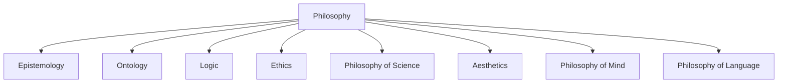
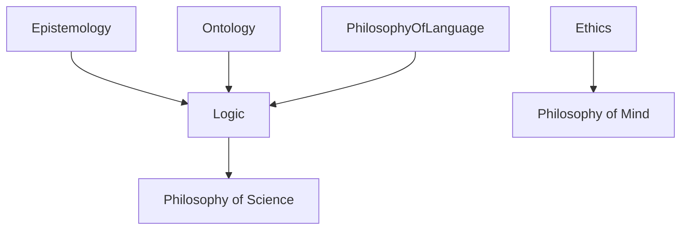
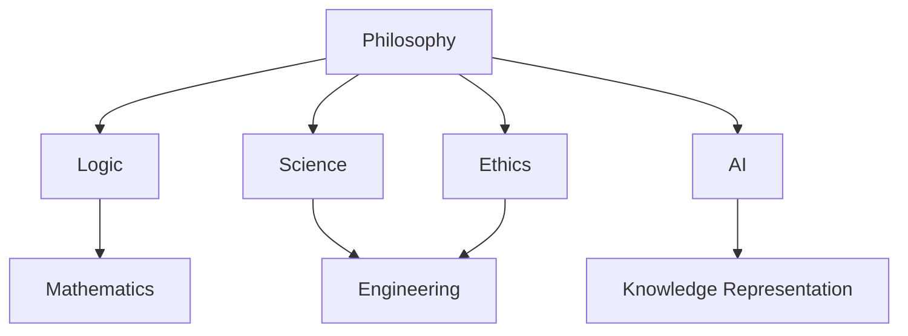
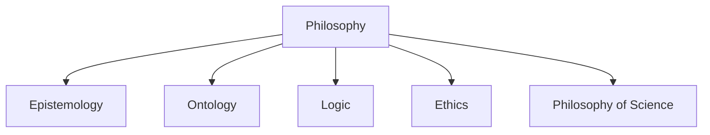

# 3.1 Philosophy Content Panoramic Analysis

## 目录

3.1.1 Topic Overview  
3.1.2 Structure of Philosophical Content  
3.1.3 Key Philosophical Domains  
3.1.4 Cross-domain Connections  
3.1.5 Lean/Haskell/Rust Code Examples  
3.1.6 Diagrams and Multi-representations  
3.1.7 Relevance and Cross-references  
3.1.8 References and Further Reading  

---

### 3.1.1 Topic Overview

This section provides a panoramic analysis of philosophical content, focusing on its structure, key domains, and relevance to formalization and scientific principles.

### 3.1.2 Structure of Philosophical Content

#### 3.1.2.1 Overview

This section details the hierarchical and networked structure of major philosophical branches, emphasizing their relevance to formalization and scientific principles.

#### 3.1.2.2 Main Branches of Philosophy

- **Epistemology**: Theory of knowledge, justification, skepticism
- **Ontology (Metaphysics)**: Nature of being, existence, reality
- **Logic**: Principles of valid reasoning, formal systems
- **Ethics**: Moral philosophy, normative theories, applied ethics
- **Philosophy of Science**: Scientific method, explanation, demarcation
- **Aesthetics**: Philosophy of art, beauty, taste
- **Philosophy of Mind**: Consciousness, mental states, cognition
- **Philosophy of Language**: Meaning, reference, language structure

#### 3.1.2.3 Tree Structure Diagram



#### 3.1.2.4 Cross-references

- See [3.1.3](#313-key-philosophical-domains) for domain details
- See [../1-formal-theory/README.md](../1-formal-theory/README.md) for logic and formalization
- See [../2-mathematics-and-applications/README.md](../2-mathematics-and-applications/README.md) for mathematical logic

#### 3.1.2.5 Example: Formalization of Epistemic Logic (LaTeX)

\[
K_a \varphi \equiv \text{Agent } a \text{ knows proposition } \varphi
\]

### 3.1.3 Key Philosophical Domains

#### 3.1.3.1 Epistemology

- Knowledge, belief, justification, skepticism
- Example: Gettier problem, Bayesian epistemology
- Lean code (pseudo-code):

```lean
structure knowledge (A : Type) (P : Prop) :=
  (justified : A → Prop)
  (true : P)
  (believed : A → Prop)
```

#### 3.1.3.2 Ontology (Metaphysics)

- Being, existence, substance, universals, particulars
- Example: Formal ontology in AI (OWL, description logic)
- Haskell code (pseudo-code):

```haskell
data Entity = Particular String | Universal String
```

#### 3.1.3.3 Logic

- Deductive, inductive, modal, non-classical logics
- Example: Modal logic, temporal logic, paraconsistent logic
- Lean code (pseudo-code):

```lean
inductive modal : Type
| box : modal → modal
| diamond : modal → modal
| atom : string → modal
```

#### 3.1.3.4 Ethics

- Normative ethics, meta-ethics, applied ethics
- Example: Utilitarianism, deontology, virtue ethics
- Rust code (pseudo-code):

```rust
enum EthicalTheory {
    Utilitarianism,
    Deontology,
    VirtueEthics,
}
```

#### 3.1.3.5 Philosophy of Science

- Scientific method, explanation, realism vs. anti-realism
- Example: Falsifiability, paradigm shifts (Kuhn)
- Lean code (pseudo-code):

```lean
def falsifiable (T : Type) (P : T → Prop) : Prop := ∃ x, ¬ P x
```

#### 3.1.3.6 Aesthetics

- Art, beauty, taste, interpretation
- Example: Formal models of aesthetic judgment

#### 3.1.3.7 Philosophy of Mind

- Consciousness, intentionality, mental causation
- Example: Turing test, Chinese room argument

#### 3.1.3.8 Philosophy of Language

- Meaning, reference, truth, language games
- Example: Formal semantics, speech act theory

#### 3.1.3.9 Mermaid Diagram: Domain Interconnections



#### 3.1.3.10 Cross-references

- See [3.1.2](#312-structure-of-philosophical-content) for structure
- See [../1-formal-theory/README.md](../1-formal-theory/README.md) for logic and formalization
- See [../2-mathematics-and-applications/README.md](../2-mathematics-and-applications/README.md) for mathematical logic

### 3.1.4 Cross-domain Connections

#### 3.1.4.1 Overview

This section explores the interconnections between philosophy and other domains, highlighting typical cross-disciplinary areas and their formalization or engineering applications.

#### 3.1.4.2 Philosophy and Mathematics

- Logic as a bridge: foundations of mathematics, set theory, proof theory
- Example: Gödel's incompleteness theorems
- Lean reference: [mathlib/logic](https://leanprover-community.github.io/mathlib_docs/logic/)

#### 3.1.4.3 Philosophy and Science

- Philosophy of science: scientific method, explanation, realism vs. anti-realism
- Example: Falsifiability, paradigm shifts (Kuhn)
- Lean code (pseudo-code):

```lean
def falsifiable (T : Type) (P : T → Prop) : Prop := ∃ x, ¬ P x
```

#### 3.1.4.4 Philosophy and Engineering

- Ethics in engineering: safety, responsibility, AI ethics
- Example: Formal models of ethical decision-making
- Rust code (pseudo-code):

```rust
enum EthicalPrinciple {
    Safety,
    Responsibility,
    Transparency,
}
```

#### 3.1.4.5 Philosophy and Artificial Intelligence

- Epistemology and knowledge representation, ontology in AI, logic programming
- Example: Description logic, knowledge graphs
- Haskell code (pseudo-code):

```haskell
data Knowledge = Fact String | Rule String [Knowledge]
```

#### 3.1.4.6 Mermaid Diagram: Cross-domain Connections



#### 3.1.4.7 Cross-references

- See [../1-formal-theory/README.md](../1-formal-theory/README.md) for logic and formalization
- See [../2-mathematics-and-applications/README.md](../2-mathematics-and-applications/README.md) for mathematical logic
- See [../5-architecture-and-design-patterns/README.md](../5-architecture-and-design-patterns/README.md) for engineering applications

### 3.1.5 Lean/Haskell/Rust Code Examples

#### 3.1.5.1 Epistemic Logic (Knowledge Representation)

```lean
-- Lean: epistemic logic (pseudo-code)
inductive knows (A : Type) (P : Prop) : Prop
| base : P → knows
| knows : knows → knows
```

```haskell
-- Haskell: epistemic logic
data Knows a p = Base p | Knows (Knows a p)
```

```rust
// Rust: epistemic logic
enum Knows<P> {
    Base(P),
    Knows(Box<Knows<P>>),
}
```

#### 3.1.5.2 Modal Logic (Possibility and Necessity)

```lean
-- Lean: modal logic (pseudo-code)
inductive modal : Type
| box : modal → modal
| diamond : modal → modal
| atom : string → modal
```

```haskell
-- Haskell: modal logic
data Modal = Box Modal | Diamond Modal | Atom String
```

```rust
// Rust: modal logic
enum Modal {
    Box(Box<Modal>),
    Diamond(Box<Modal>),
    Atom(String),
}
```

#### 3.1.5.3 Ethics in Engineering (Decision Models)

```lean
-- Lean: ethical principle (pseudo-code)
inductive ethical_principle
| safety
| responsibility
| transparency
```

```rust
// Rust: ethical principle
enum EthicalPrinciple {
    Safety,
    Responsibility,
    Transparency,
}
```

---

- See [3.1.4](#314-cross-domain-connections) for cross-domain context
- See [../1-formal-theory/README.md](../1-formal-theory/README.md) for logic and formalization
- See [../2-mathematics-and-applications/README.md](../2-mathematics-and-applications/README.md) for mathematical logic

### 3.1.6 Diagrams and Multi-representations



### 3.1.7 Relevance and Cross-references

- [3.2-philosophy-and-formal-reasoning.md](./3.2-philosophy-and-formal-reasoning.md)
- [../1-formal-theory/README.md](../1-formal-theory/README.md)
- [../2-mathematics-and-applications/README.md](../2-mathematics-and-applications/README.md)

### 3.1.8 References and Further Reading

- Standard philosophy textbooks, formal epistemology, philosophy of science literature
