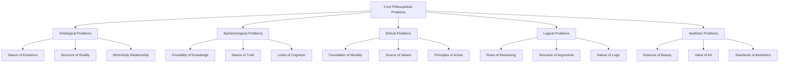
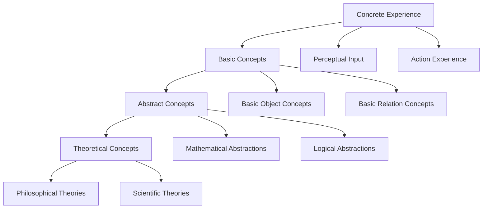

# 3.1 Philosophy Content Panoramic Analysis

[Back to Parent](../3-philosophy-and-scientific-principles.md) | [中文版本](../3-哲学与科学原理/3.1-哲学内容全景分析.md)

## Table of Contents

- [3.1 Philosophy Content Panoramic Analysis](#31-philosophy-content-panoramic-analysis)
  - [Table of Contents](#table-of-contents)
  - [3.1.1 Overall Architecture of Philosophical Systems](#311-overall-architecture-of-philosophical-systems)
    - [3.1.1.1 Core Domains of Philosophy](#3111-core-domains-of-philosophy)
    - [3.1.1.2 Interrelationships Among Philosophical Branches](#3112-interrelationships-among-philosophical-branches)
  - [3.1.2 In-depth Analysis of Core Philosophical Branches](#312-in-depth-analysis-of-core-philosophical-branches)
    - [3.1.2.1 Ontology: Philosophy of Existence](#3121-ontology-philosophy-of-existence)
      - [Traditional Ontological Problems](#traditional-ontological-problems)
      - [Modern Ontological Developments](#modern-ontological-developments)
    - [3.1.2.2 Epistemology: Philosophy of Knowledge](#3122-epistemology-philosophy-of-knowledge)
      - [Nature of Knowledge](#nature-of-knowledge)
      - [Modern Epistemological Problems](#modern-epistemological-problems)
    - [3.1.2.3 Ethics: Philosophy of Morality](#3123-ethics-philosophy-of-morality)
      - [Normative Ethical Theories](#normative-ethical-theories)
      - [Applied Ethics](#applied-ethics)
    - [3.1.2.4 Logic: Philosophy of Reasoning](#3124-logic-philosophy-of-reasoning)
      - [Formal Logic Systems](#formal-logic-systems)
      - [Non-Classical Logic](#non-classical-logic)
  - [3.1.3 Intersection of Modern Technology and Philosophy](#313-intersection-of-modern-technology-and-philosophy)
    - [3.1.3.1 Philosophy of Computing](#3131-philosophy-of-computing)
      - [Computationalism](#computationalism)
      - [Algorithmic Ethics](#algorithmic-ethics)
    - [3.1.3.2 Philosophy of Information](#3132-philosophy-of-information)
      - [Ontological Status of Information](#ontological-status-of-information)
      - [Digital Ontology](#digital-ontology)
    - [3.1.3.3 Philosophy of Biology](#3133-philosophy-of-biology)
      - [Definition of Life](#definition-of-life)
      - [Evolutionary Philosophy](#evolutionary-philosophy)
  - [3.1.4 Formalized Philosophical Methods](#314-formalized-philosophical-methods)
    - [3.1.4.1 Logical Analysis Philosophy](#3141-logical-analysis-philosophy)
      - [Conceptual Analysis](#conceptual-analysis)
      - [Argument Structure Analysis](#argument-structure-analysis)
    - [3.1.4.2 Formal Epistemology](#3142-formal-epistemology)
      - [Knowledge Logic](#knowledge-logic)
    - [3.1.4.3 Deontic Logic](#3143-deontic-logic)
      - [Formalization of Moral Reasoning](#formalization-of-moral-reasoning)
  - [3.1.5 Interdisciplinary Philosophical Integration](#315-interdisciplinary-philosophical-integration)
    - [3.1.5.1 Cognitive Philosophy](#3151-cognitive-philosophy)
      - [Computational Theory of Mind](#computational-theory-of-mind)
      - [Embodied Cognition](#embodied-cognition)
    - [3.1.5.2 Philosophy of Science](#3152-philosophy-of-science)
      - [Scientific Methodology](#scientific-methodology)
      - [Scientific Realism](#scientific-realism)
    - [3.1.5.3 Philosophy of Technology](#3153-philosophy-of-technology)
      - [Social Construction of Technology](#social-construction-of-technology)
  - [3.1.6 Contemporary Philosophical Problems](#316-contemporary-philosophical-problems)
    - [3.1.6.1 Artificial Intelligence Philosophy](#3161-artificial-intelligence-philosophy)
      - [Machine Consciousness Problem](#machine-consciousness-problem)
      - [Superintelligence Risks](#superintelligence-risks)
    - [3.1.6.2 Biotechnology Ethics](#3162-biotechnology-ethics)
      - [Enhancement Technologies](#enhancement-technologies)
      - [Gene Editing Ethics](#gene-editing-ethics)
    - [3.1.6.3 Environmental Philosophy](#3163-environmental-philosophy)
      - [Intrinsic Value of Nature](#intrinsic-value-of-nature)
  - [3.1.7 Cognitive Foundations of Philosophical Thinking](#317-cognitive-foundations-of-philosophical-thinking)
    - [3.1.7.1 Mechanisms of Concept Formation](#3171-mechanisms-of-concept-formation)
      - [Abstraction Process](#abstraction-process)
      - [Metaphorical Thinking](#metaphorical-thinking)
    - [3.1.7.2 Psychology of Argumentation](#3172-psychology-of-argumentation)
      - [Reasoning Biases](#reasoning-biases)
  - [3.1.8 Summary and Prospects](#318-summary-and-prospects)
    - [3.1.8.1 Continued Relevance of Philosophy](#3181-continued-relevance-of-philosophy)
    - [3.1.8.2 Future Development Directions](#3182-future-development-directions)
  - [Cross-References](#cross-references)
    - [Related Topics](#related-topics)
    - [Local Navigation](#local-navigation)
    - [References](#references)
      - [Authoritative Literature](#authoritative-literature)
      - [Online Resources](#online-resources)
      - [Extended Reading](#extended-reading)

---

## 3.1.1 Overall Architecture of Philosophical Systems

### 3.1.1.1 Core Domains of Philosophy



### 3.1.1.2 Interrelationships Among Philosophical Branches

**Foundational Relationships**:

- Ontology provides existential foundations for other branches
- Epistemology provides methodological frameworks for knowledge acquisition
- Logic provides reasoning tools for philosophical argumentation

**Applied Relationships**:

- Ethics applies value theory to behavioral norms
- Political philosophy applies ethical theory to social organization
- Philosophy of science applies epistemology to scientific methodology

## 3.1.2 In-depth Analysis of Core Philosophical Branches

### 3.1.2.1 Ontology: Philosophy of Existence

#### Traditional Ontological Problems

**Substance and Properties**:

```lean
-- Formal representation of substance-property relations
structure Entity where
  substance : Type
  properties : List Property
  relations : List (Entity × Relation × Entity)

def has_property (e : Entity) (p : Property) : Prop :=
  p ∈ e.properties
```

**Levels of Existence**:

1. **Physical Existence**: Material objects and physical processes
2. **Mental Existence**: Conscious states and mental phenomena
3. **Abstract Existence**: Mathematical objects and logical structures
4. **Social Existence**: Institutions, culture, and social reality

#### Modern Ontological Developments

**Informational Ontology**:
Theory that views information as fundamental reality:

```python
class InformationalOntology:
    """Basic framework of informational ontology"""
    
    def __init__(self):
        self.information_states = {}
        self.processing_rules = {}
        
    def define_entity(self, entity_id, information_pattern):
        """Define entity as information pattern"""
        self.information_states[entity_id] = information_pattern
        
    def process_information(self, input_info, rules):
        """Ontological significance of information processing"""
        return apply_rules(input_info, rules)
```

**Computational Ontology**:

- Computational processes as fundamental forms of existence
- Universe as computational system metaphor
- Philosophical foundations of digital physics

### 3.1.2.2 Epistemology: Philosophy of Knowledge

#### Nature of Knowledge

**Classical Definition**:
Knowledge as "justified true belief" (JTB):
$$K(S, p) \iff B(S, p) \land T(p) \land J(S, p)$$

Where:

- $K(S, p)$: Subject S knows proposition p
- $B(S, p)$: Subject S believes proposition p
- $T(p)$: Proposition p is true
- $J(S, p)$: Subject S's belief in p is rationally justified

**Gettier Problem**:
Challenge to JTB theory, showing that justified true belief doesn't necessarily constitute knowledge.

#### Modern Epistemological Problems

**Externalism vs. Internalism**:

- **Externalism**: Justification depends on external factors
- **Internalism**: Justification depends on factors accessible to consciousness

**Virtue Epistemology**:
Knowledge as product of intellectual virtues rather than mere justification.

### 3.1.2.3 Ethics: Philosophy of Morality

#### Normative Ethical Theories

**Deontological Ethics** (Kant):

```python
class DeontologicalEthics:
    """Kantian deontological framework"""
    
    def __init__(self):
        self.categorical_imperative = self.define_categorical_imperative()
    
    def moral_evaluation(self, action, intention):
        """Evaluate action based on duty and intention"""
        return self.test_universalizability(action) and \
               self.test_humanity_formula(action)
    
    def test_universalizability(self, action):
        """Test if action can be universalized"""
        return self.can_will_universal_law(action)
```

**Consequentialism** (Utilitarianism):

```python
class UtilitarianEthics:
    """Utilitarian ethical framework"""
    
    def __init__(self):
        self.utility_function = self.define_utility()
    
    def moral_evaluation(self, action, consequences):
        """Evaluate action based on consequences"""
        total_utility = sum(self.utility_function(c) for c in consequences)
        return total_utility > self.baseline_utility()
```

#### Applied Ethics

**Bioethics**: Ethical issues in medicine and biology
**Environmental Ethics**: Moral obligations toward nature
**Computer Ethics**: Ethical issues in information technology

### 3.1.2.4 Logic: Philosophy of Reasoning

#### Formal Logic Systems

**Propositional Logic**:
Basic logical connectives and truth tables

**Predicate Logic**:
Quantifiers and predicates for more complex reasoning

**Modal Logic**:
Logical operators for necessity and possibility

#### Non-Classical Logic

**Intuitionistic Logic**: Rejection of excluded middle
**Relevant Logic**: Relevance conditions for implication
**Paraconsistent Logic**: Handling contradictions without explosion

## 3.1.3 Intersection of Modern Technology and Philosophy

### 3.1.3.1 Philosophy of Computing

#### Computationalism

**Computational Theory of Mind**:
The mind as information processing system

```python
class ComputationalMind:
    """Computational model of mind"""
    
    def __init__(self):
        self.cognitive_processes = {}
        self.memory_systems = {}
        
    def process_information(self, input_data, cognitive_operation):
        """Model cognitive processes as computation"""
        return self.apply_cognitive_algorithm(input_data, cognitive_operation)
        
    def simulate_consciousness(self, global_workspace):
        """Global workspace theory implementation"""
        return self.integrate_information_globally(global_workspace)
```

#### Algorithmic Ethics

**Algorithmic Bias**: How algorithms can perpetuate unfairness
**Transparency**: The right to algorithmic explanation
**Accountability**: Responsibility for algorithmic decisions

### 3.1.3.2 Philosophy of Information

#### Ontological Status of Information

**Information as Fourth Kind of Reality**:
Alongside matter, energy, and space-time

**It from Bit Hypothesis**: Reality emerges from information processing

#### Digital Ontology

**Virtual Entities**: Ontological status of digital objects
**Augmented Reality**: Blending physical and digital existence

### 3.1.3.3 Philosophy of Biology

#### Definition of Life

**Biological vs. Functional Definitions**:
Life as biological process vs. functional organization

#### Evolutionary Philosophy

**Evolution and Ethics**: Whether evolution provides moral guidance
**Extended Phenotype**: Broader conception of biological influence

## 3.1.4 Formalized Philosophical Methods

### 3.1.4.1 Logical Analysis Philosophy

#### Conceptual Analysis

**Method of Logical Analysis**:
Breaking down complex concepts into simpler components

#### Argument Structure Analysis

**Formal Argument Representation**:

```lean
structure Argument where
  premises : List Proposition
  conclusion : Proposition
  inference_rule : InferenceRule

def valid_argument (arg : Argument) : Prop :=
  arg.inference_rule.applies arg.premises arg.conclusion
```

### 3.1.4.2 Formal Epistemology

#### Knowledge Logic

**Epistemic Logic Systems**:

```lean
-- Knowledge operator
def K (agent : Agent) (p : Proposition) : Proposition :=
  Knowledge.knows agent p

-- Knowledge axioms
axiom knowledge_factivity : ∀ a p, K a p → p
axiom knowledge_introspection : ∀ a p, K a p → K a (K a p)
```

### 3.1.4.3 Deontic Logic

#### Formalization of Moral Reasoning

```lean
-- Deontic logic formalization
inductive DeonticOperator where
  | obligation : Prop → DeonticOperator
  | permission : Prop → DeonticOperator
  | prohibition : Prop → DeonticOperator

def O (p : Prop) := DeonticOperator.obligation p  -- Obligatory
def P (p : Prop) := DeonticOperator.permission p  -- Permitted
def F (p : Prop) := DeonticOperator.prohibition p -- Forbidden

-- Deontic principles
axiom deontic_consistency : ∀ p : Prop, ¬(O p ∧ F p)
axiom permission_def : ∀ p : Prop, P p ↔ ¬F p
```

## 3.1.5 Interdisciplinary Philosophical Integration

### 3.1.5.1 Cognitive Philosophy

#### Computational Theory of Mind

**Mind as Information Processing System**:

```python
class CognitiveMind:
    """Cognitive model based on information processing"""
    
    def __init__(self):
        self.working_memory = WorkingMemory()
        self.long_term_memory = LongTermMemory()
        self.attention_system = AttentionSystem()
        
    def cognitive_process(self, stimulus, task):
        """Model cognitive processing"""
        attended_info = self.attention_system.filter(stimulus)
        processed_info = self.working_memory.process(attended_info, task)
        return self.long_term_memory.integrate(processed_info)
```

#### Embodied Cognition

**Body's Role in Cognition**:
How physical embodiment shapes cognitive processes

### 3.1.5.2 Philosophy of Science

#### Scientific Methodology

**Hypothetico-Deductive Method**:
Science as hypothesis formation and testing

**Inference to Best Explanation**:
Scientific reasoning as explanatory inference

#### Scientific Realism

**Realism vs. Anti-Realism Debate**:
Whether scientific theories describe reality

### 3.1.5.3 Philosophy of Technology

#### Social Construction of Technology

**Technology as Socially Shaped**:
How social factors influence technological development

## 3.1.6 Contemporary Philosophical Problems

### 3.1.6.1 Artificial Intelligence Philosophy

#### Machine Consciousness Problem

**Hard Problem of Machine Consciousness**:
Whether machines can have subjective experiences

```python
class ConsciousnessTheory:
    """Framework for analyzing machine consciousness"""
    
    def __init__(self):
        self.consciousness_criteria = {
            'phenomenal_consciousness': self.test_qualia,
            'access_consciousness': self.test_global_access,
            'self_awareness': self.test_meta_cognition,
            'intentionality': self.test_aboutness
        }
    
    def assess_machine_consciousness(self, ai_system):
        """Evaluate consciousness in AI systems"""
        results = {}
        for criterion, test in self.consciousness_criteria.items():
            results[criterion] = test(ai_system)
        return results
```

#### Superintelligence Risks

**Control Problem**:
How to ensure advanced AI systems align with human values?

```python
class AIAlignmentProblem:
    """AI alignment challenge framework"""
    
    def __init__(self):
        self.human_values = self.extract_human_values()
        self.ai_objectives = {}
    
    def value_alignment_challenge(self, ai_system):
        """Value alignment challenges"""
        challenges = {
            'value_specification': self.specify_complex_values(),
            'value_learning': self.learn_from_behavior(),
            'robustness': self.handle_distribution_shift(),
            'corrigibility': self.maintain_human_control()
        }
        return challenges
```

### 3.1.6.2 Biotechnology Ethics

#### Enhancement Technologies

**Moral Boundaries of Human Enhancement**:

- Distinction between therapy and enhancement
- Considerations of fairness and justice
- Protection of human nature

#### Gene Editing Ethics

**Ethical Issues in CRISPR Technology**:

```python
class GeneEditingEthics:
    """Gene editing ethics framework"""
    
    def __init__(self):
        self.ethical_principles = {
            'safety': self.assess_safety_risks,
            'autonomy': self.respect_informed_consent,
            'justice': self.ensure_equitable_access,
            'human_dignity': self.protect_human_worth
        }
    
    def evaluate_gene_edit(self, intervention, target_population):
        """Evaluate gene editing intervention"""
        if intervention.affects_germline:
            return self.assess_heritable_modifications(intervention)
        else:
            return self.assess_somatic_modifications(intervention)
```

### 3.1.6.3 Environmental Philosophy

#### Intrinsic Value of Nature

**Ecological Holism vs. Individualism**:

- Moral status of ecosystems
- Ethical foundation of species conservation
- Philosophical basis of sustainable development

## 3.1.7 Cognitive Foundations of Philosophical Thinking

### 3.1.7.1 Mechanisms of Concept Formation

#### Abstraction Process

**Conceptual Hierarchy**:



#### Metaphorical Thinking

**Role of Conceptual Metaphors**:

- Concrete understanding of abstract concepts
- Cognitive mechanism of cross-domain mapping
- Use of metaphors in philosophical argumentation

### 3.1.7.2 Psychology of Argumentation

#### Reasoning Biases

**Common Cognitive Biases**:

1. **Confirmation Bias**: Seeking supportive evidence
2. **Availability Heuristic**: Over-relying on easily recalled information
3. **Anchoring Effect**: Being influenced by initial information

```python
class CognitiveBiasDetection:
    """Cognitive bias detection in reasoning"""
    
    def __init__(self):
        self.bias_patterns = {
            'confirmation_bias': self.detect_confirmation_bias,
            'availability_heuristic': self.detect_availability_bias,
            'anchoring_effect': self.detect_anchoring
        }
    
    def analyze_reasoning(self, argument_chain):
        """Analyze biases in reasoning process"""
        detected_biases = []
        for bias_type, detector in self.bias_patterns.items():
            if detector(argument_chain):
                detected_biases.append(bias_type)
        return detected_biases
```

## 3.1.8 Summary and Prospects

### 3.1.8.1 Continued Relevance of Philosophy

Philosophy remains important in an era of rapid technological development:

1. **Conceptual Clarification**: Providing conceptual frameworks for emerging technologies
2. **Value Reflection**: Evaluating ethical significance of technological development
3. **Critical Thinking**: Questioning assumptions and implicit premises
4. **Holistic Perspective**: Interdisciplinary synthetic thinking

### 3.1.8.2 Future Development Directions

**Development of Formalized Philosophy**:

- More precise conceptual analysis tools
- Expansion of computational philosophy methods
- AI-assisted philosophical research

**Expansion of Applied Philosophy**:

- Ethical analysis of emerging technologies
- Philosophical understanding of complex systems
- Philosophical thinking on globalization issues

---

## Cross-References

### Related Topics

- [3.2 Philosophy and Formalized Reasoning](3.2-philosophy-and-formalized-reasoning.md) - Formalized methods in philosophy
- [1.1 Unified Formal Theory Overview](../1-formal-theory/1.1-unified-formal-theory-overview.md) - Philosophical foundations of formal systems
- [2.1 Mathematical Content Panoramic Analysis](../2-mathematics-and-applications/2.1-mathematical-content-panoramic-analysis.md) - Philosophy of mathematics
- [4.1 Artificial Intelligence and Machine Learning](../4-industry-domains-analysis/4.1-artificial-intelligence-and-machine-learning.md) - Philosophical issues in AI

### Local Navigation

- **Previous Section**: [3.0 Philosophy and Scientific Principles Overview](../README.md)
- **Next Section**: [3.2 Philosophy and Formalized Reasoning](3.2-philosophy-and-formalized-reasoning.md)
- **Back to Parent**: [3 Philosophy and Scientific Principles](../README.md)
- **Back to Root**: [Analysis Directory](../../README.md)

### References

#### Authoritative Literature

1. Russell, B. "The Problems of Philosophy" - Basic philosophical problems
2. Dennett, D. "Consciousness Explained" - Philosophy of consciousness
3. Floridi, L. "The Ethics of Information" - Information philosophy
4. Chalmers, D. "The Conscious Mind" - Philosophy of mind

#### Online Resources

1. [Stanford Encyclopedia of Philosophy](https://plato.stanford.edu/) - Authoritative philosophy encyclopedia
2. [PhilPapers](https://philpapers.org/) - Philosophy papers database
3. [Internet Encyclopedia of Philosophy](https://iep.utm.edu/) - Philosophy encyclopedia

#### Extended Reading

1. Nagel, T. "What Is It Like to Be a Bat?" - Subjectivity of consciousness
2. Putnam, H. "The Meaning of 'Meaning'" - Theory of meaning
3. Searle, J. "Minds, Brains, and Programs" - Chinese room argument

[Back to Contents](../0-Overview-and-Navigation/0.1-Global-Topic-Tree.md)
