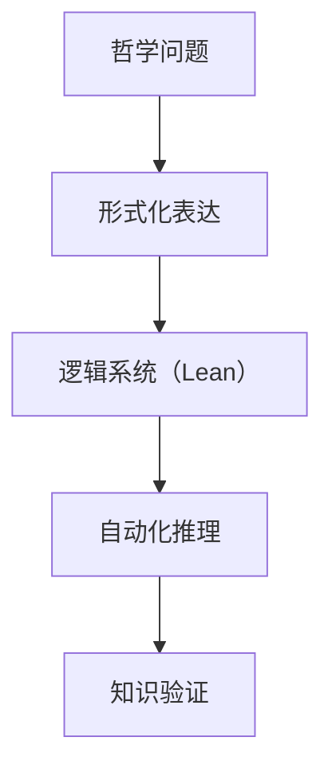

# 3.2 哲学与形式化推理 Philosophy and Formal Reasoning

[返回上级目录](../3-philosophy-and-scientific-principles/README.md)

## 3.2.1 主题概览 Overview

- 本节探讨哲学与形式化推理的交叉，包括分析哲学、逻辑实证主义、数理逻辑、认知哲学等与形式化语言（如 Lean）的结合。
- 重点关注哲学问题的形式化表达、推理范式、以及与现代形式化工具的互动。

## 3.2.2 主要理论与模型 Key Theories and Models

### 3.2.2.1 分析哲学与逻辑实证主义

- 逻辑语言哲学、命题逻辑、可证性理论。

### 3.2.2.2 数理逻辑与形式系统

- 公理化方法、元数学、哥德尔不完备性。

### 3.2.2.3 认知哲学与推理范式

- 认知科学中的形式化推理模型。

## 3.2.3 形式化表达与示例 Formalization Examples

### 3.2.3.1 LaTeX 公式示例

$$
\forall x (P(x) \rightarrow Q(x))
$$

### 3.2.3.2 Lean 代码示例

```lean
variables {P Q : Prop}
theorem modus_ponens (h₁ : P → Q) (h₂ : P) : Q := h₁ h₂
```

### 3.2.3.3 Mermaid 概念关系图



## 3.2.4 交叉引用与扩展 Cross-References & Extensions

- 参见 [1.2 类型理论与证明](../../1-formal-theory/1.2-type-theory-and-proof/1.2.1-history-of-type-theory.md)
- 参见 [2.2 数学与形式化语言关系](../../2-mathematics-and-applications/2.2-mathematics-and-formal-language.md)

## 3.2.5 参考文献 References

- Carnap, R. (1937). The Logical Syntax of Language.
- Tarski, A. (1944). The Semantic Conception of Truth.
- Church, A. (1936). An Unsolvable Problem of Elementary Number Theory.

---

## 3.2.x 递归扩展与未来研究 Recursive Extensions & Future Work

- 预留：认知科学与AI哲学的形式化推理
- 预留：跨学科哲学主题的形式化建模
