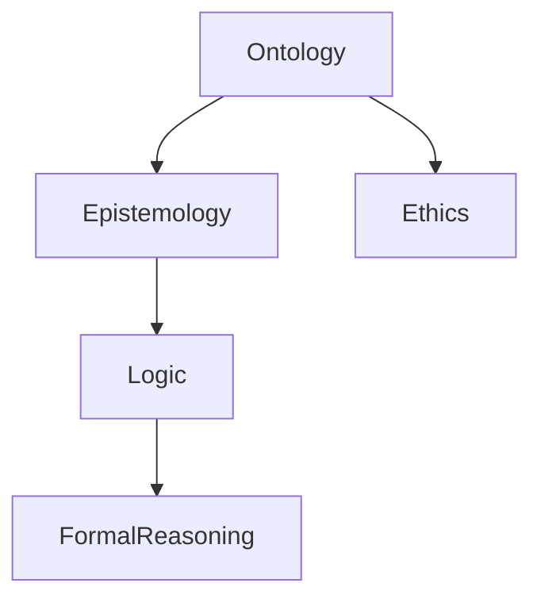

# 3.1 哲学内容全景分析

[返回上级](../3-哲学与科学原理.md) | [English Version](../3-philosophy-and-scientific-principles/3.1-philosophy-content-panoramic-analysis.md)

## 目录

- [3.1 哲学内容全景分析](#31-哲学内容全景分析)
  - [目录](#目录)
  - [3.1.1 哲学基础结构图](#311-哲学基础结构图)
  - [3.1.2 典型哲学理论](#312-典型哲学理论)
  - [3.1.3 代码示例](#313-代码示例)
  - [3.1.4 参考文献](#314-参考文献)

---

## 3.1.1 哲学基础结构图



## 3.1.2 典型哲学理论

\[
\text{存在论：} \forall x \exists y (x = y \land \text{存在}(x))
\]

```lean
-- Lean 伪代码：存在论基础
axiom existence : ∀ x : Type, ∃ y : x, true
```

## 3.1.3 代码示例

```rust
// Rust 伪代码：哲学概念建模
struct Ontology {
    entities: Vec<String>,
    relations: Vec<(String, String)>,
}
```

## 3.1.4 参考文献

- 《哲学导论》
- [Stanford Encyclopedia of Philosophy](https://plato.stanford.edu/)
- TODO: 更多权威文献

---

[返回目录](../0-总览与导航/0.1-全局主题树形目录.md)
