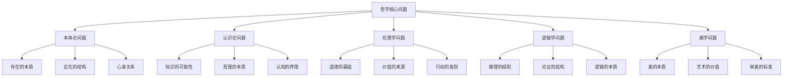
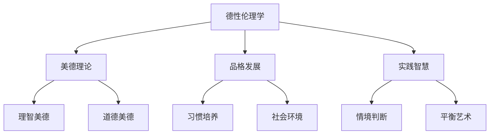
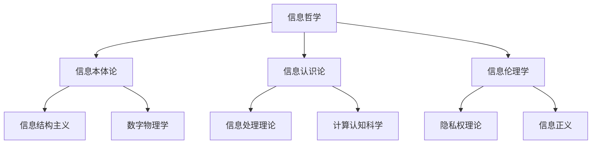
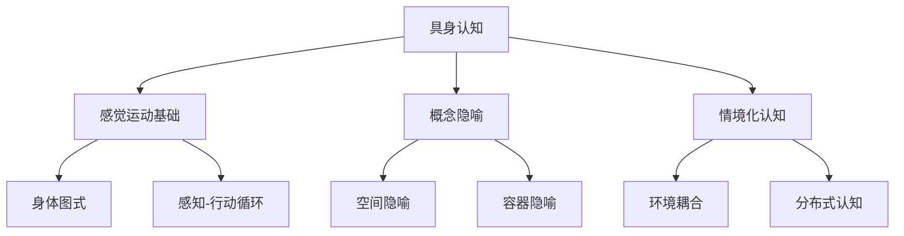
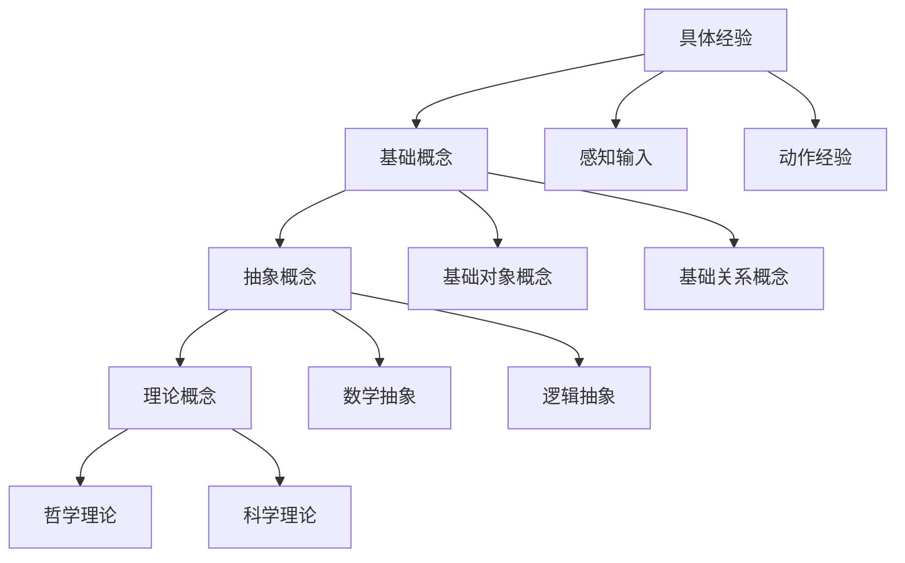

# 3.1 哲学内容全景分析

[返回上级](../3-哲学与科学原理.md) | [English Version](../3-philosophy-and-scientific-principles/3.1-philosophy-content-panoramic-analysis.md)

## 目录

- [3.1 哲学内容全景分析](#31-哲学内容全景分析)
  - [目录](#目录)
  - [3.1.1 哲学体系的整体架构](#311-哲学体系的整体架构)
  - [3.1.2 核心哲学分支深度分析](#312-核心哲学分支深度分析)
  - [3.1.3 现代科技与哲学的交汇](#313-现代科技与哲学的交汇)
  - [3.1.4 形式化哲学方法](#314-形式化哲学方法)
  - [3.1.5 跨学科哲学整合](#315-跨学科哲学整合)
  - [3.1.6 当代哲学问题](#316-当代哲学问题)
  - [3.1.7 哲学思维的认知基础](#317-哲学思维的认知基础)

---

## 3.1.1 哲学体系的整体架构

### 3.1.1.1 哲学的核心问题域



### 3.1.1.2 哲学分支的相互关系

**基础性关系**：
- 本体论为其他分支提供存在论基础
- 认识论为知识获取提供方法论框架
- 逻辑学为哲学论证提供推理工具

**应用性关系**：
- 伦理学应用价值理论到行为规范
- 政治哲学应用伦理理论到社会组织
- 科学哲学应用认识论到科学方法

## 3.1.2 核心哲学分支深度分析

### 3.1.2.1 本体论：存在的哲学

#### 传统本体论问题

**实体与属性**：
```lean
-- 实体-属性关系的形式化表示
structure Entity where
  substance : Type
  properties : List Property
  relations : List (Entity × Relation × Entity)

def has_property (e : Entity) (p : Property) : Prop :=
  p ∈ e.properties
```

**存在的层次**：
1. **物理存在**：物质对象和物理过程
2. **心理存在**：意识状态和心理现象
3. **抽象存在**：数学对象和逻辑结构
4. **社会存在**：制度、文化和社会实在

#### 现代本体论发展

**信息本体论**：
将信息视为基础实在的理论：

```python
class InformationalOntology:
    """信息本体论的基本框架"""
    
    def __init__(self):
        self.information_states = {}
        self.processing_rules = {}
        
    def define_entity(self, entity_id, information_pattern):
        """将实体定义为信息模式"""
        self.information_states[entity_id] = information_pattern
        
    def process_information(self, input_info, rules):
        """信息处理的本体论意义"""
        return apply_rules(input_info, rules)
```

**计算本体论**：
- 计算过程作为存在的基本形式
- 宇宙作为计算系统的隐喻
- 数字物理学的哲学基础

### 3.1.2.2 认识论：知识的哲学

#### 知识的本质

**经典定义**：
知识作为"有理证成的真信念"(JTB)：
$$K(S, p) \iff B(S, p) \land T(p) \land J(S, p)$$

其中：
- $K(S, p)$：主体S知道命题p
- $B(S, p)$：主体S相信命题p
- $T(p)$：命题p为真
- $J(S, p)$：主体S对p的信念有合理证成

**葛梯尔问题**：
对JTB理论的挑战，表明证成的真信念未必构成知识。

#### 现代认识论问题

**贝叶斯认识论**：
使用概率理论分析信念更新：

```python
def bayesian_update(prior_belief, evidence, likelihood):
    """贝叶斯信念更新"""
    posterior = (likelihood * prior_belief) / marginal_likelihood(evidence)
    return posterior

class EpistemicAgent:
    """认识主体的贝叶斯模型"""
    
    def __init__(self, prior_beliefs):
        self.beliefs = prior_beliefs
        
    def update_belief(self, proposition, evidence):
        """根据证据更新信念"""
        self.beliefs[proposition] = bayesian_update(
            self.beliefs[proposition], 
            evidence, 
            self.likelihood_function(evidence, proposition)
        )
```

**认知闭合**：
人类认知能力的固有限制：

```lean
-- 认知闭合的形式化
def cognitive_closure (mind : CognitiveSystem) (problem : Problem) : Prop :=
  ¬∃ (method : Method), mind.can_solve problem method
```

### 3.1.2.3 伦理学：道德的哲学

#### 规范伦理学理论

**功利主义**：
最大化整体福祉的伦理理论：
$$U(a) = \sum_{i} u_i(a)$$

其中$U(a)$是行动a的道德价值，$u_i(a)$是行动a对个体i的效用。

**义务论**：
基于规则和义务的伦理理论：

```lean
-- 道德义务的逻辑结构
structure MoralDuty where
  rule : Action → Prop
  universalizability : ∀ a : Action, rule a → (∀ agent : Agent, should_do agent a)
  categorical : ∀ a : Action, rule a → ¬depends_on_consequences a
```

**德性伦理学**：
基于品格和美德的伦理理论：



#### 应用伦理学

**生命伦理学**：
- 生命的开始与结束
- 医疗决策的伦理框架
- 增强技术的道德界限

**AI伦理学**：
```python
class AIEthicsFramework:
    """AI伦理的基本框架"""
    
    def __init__(self):
        self.principles = {
            'autonomy': self.respect_human_autonomy,
            'beneficence': self.maximize_human_welfare,
            'non_maleficence': self.avoid_harm,
            'justice': self.ensure_fairness,
            'transparency': self.provide_explainability
        }
    
    def evaluate_ai_system(self, system, context):
        """评估AI系统的伦理性"""
        scores = {}
        for principle, evaluator in self.principles.items():
            scores[principle] = evaluator(system, context)
        return scores
```

### 3.1.2.4 逻辑学：推理的哲学

#### 形式逻辑系统

**命题逻辑**：
基本逻辑运算：
- 合取：$p \land q$
- 析取：$p \lor q$
- 蕴含：$p \to q$
- 否定：$\neg p$

**谓词逻辑**：
量化推理：
- 全称量化：$\forall x. P(x)$
- 存在量化：$\exists x. P(x)$

**模态逻辑**：
必然性和可能性：
- 必然：$\square p$
- 可能：$\diamond p$

#### 非经典逻辑

**模糊逻辑**：
处理不确定性的逻辑：

```python
class FuzzyLogic:
    """模糊逻辑系统"""
    
    def and_operation(self, a, b):
        return min(a, b)
    
    def or_operation(self, a, b):
        return max(a, b)
    
    def not_operation(self, a):
        return 1 - a
    
    def implication(self, a, b):
        return max(1 - a, b)
```

**相关逻辑**：
避免"前件谬误"的逻辑系统。

**直觉主义逻辑**：
拒绝排中律的构造性逻辑。

## 3.1.3 现代科技与哲学的交汇

### 3.1.3.1 计算哲学

#### 计算主义

**强计算主义**：
心理就是计算过程的理论。

```lean
-- 计算主义的形式化表达
structure ComputationalMind where
  states : Type
  transition : states → Input → states
  output : states → Output
  
def mental_process (mind : ComputationalMind) : Process :=
  computation mind.transition mind.output
```

**弱计算主义**：
计算模型有助于理解心理过程。

#### 算法伦理

**算法偏见**：
```python
def detect_algorithmic_bias(algorithm, dataset, protected_attributes):
    """检测算法偏见"""
    predictions = algorithm.predict(dataset)
    
    bias_metrics = {}
    for attribute in protected_attributes:
        bias_metrics[attribute] = calculate_disparate_impact(
            predictions, dataset[attribute]
        )
    
    return bias_metrics

def fairness_constraints(predictions, sensitive_attributes):
    """公平性约束"""
    # 人口统计平等
    demographic_parity = check_demographic_parity(predictions, sensitive_attributes)
    
    # 机会均等
    equal_opportunity = check_equal_opportunity(predictions, sensitive_attributes)
    
    return demographic_parity and equal_opportunity
```

### 3.1.3.2 信息哲学

#### 信息的本体论地位

**信息作为基础实在**：
- Floridi的信息结构现实主义
- Wheeler的"it from bit"假说
- 数字物理学的哲学基础

**信息处理与意识**：


#### 数字存在论

**虚拟实在的地位**：
- 虚拟世界中的存在问题
- 数字身份的同一性
- 网络空间的本体论结构

### 3.1.3.3 生物哲学

#### 生命的定义

**生命的特征**：
1. **自我组织**：系统的自主构建
2. **自我复制**：信息的遗传传递
3. **代谢**：能量和物质的转换
4. **适应性**：环境变化的响应

```python
class LifeDefinition:
    """生命定义的计算模型"""
    
    def __init__(self):
        self.criteria = {
            'self_organization': self.check_self_organization,
            'reproduction': self.check_reproduction,
            'metabolism': self.check_metabolism,
            'adaptation': self.check_adaptation
        }
    
    def is_alive(self, system):
        """判断系统是否具有生命特征"""
        scores = []
        for criterion, check_function in self.criteria.items():
            scores.append(check_function(system))
        
        return all(scores) or sum(scores) >= threshold
```

#### 进化哲学

**自然选择的哲学意义**：
- 目的论与机械论的争论
- 适应性功能的规范性质
- 进化伦理学的可能性

## 3.1.4 形式化哲学方法

### 3.1.4.1 逻辑分析哲学

#### 概念分析

**分析与综合**：
- 分析命题：概念包含的真理
- 综合命题：需要经验确认的真理

```lean
-- 概念分析的形式化
structure ConceptAnalysis where
  concept : Concept
  necessary_conditions : List Condition
  sufficient_conditions : List Condition
  
def analytical_truth (proposition : Proposition) : Prop :=
  follows_from_concept_alone proposition
```

#### 论证结构分析

**论证的形式化**：
```lean
structure Argument where
  premises : List Proposition
  conclusion : Proposition
  inference_rules : List InferenceRule
  
def valid_argument (arg : Argument) : Prop :=
  ∀ interpretation, 
    (∀ p ∈ arg.premises, true_in interpretation p) →
    true_in interpretation arg.conclusion
```

### 3.1.4.2 形式认识论

#### 知识逻辑

**知识算子**：
- $K_a p$：主体a知道p
- $B_a p$：主体a相信p
- $C_G p$：群体G共同知道p

**知识逻辑公理**：
1. **知识蕴含真理**：$K_a p \to p$
2. **知识分配律**：$K_a(p \to q) \to (K_a p \to K_a q)$
3. **内省原理**：$K_a p \to K_a K_a p$

### 3.1.4.3 道义逻辑

#### 道德推理的形式化

**道义算子**：
- $O p$：义务p（p是必须的）
- $P p$：允许p（p是可以的）
- $F p$：禁止p（p是不可以的）

**道义逻辑原理**：
```lean
-- 道义逻辑的基本原理
axiom obligation_implies_permission : ∀ p, O p → P p
axiom permission_consistency : ∀ p, P p ↔ ¬F p
axiom ought_implies_can : ∀ p, O p → ◊p  -- 应该蕴含能够
```

## 3.1.5 跨学科哲学整合

### 3.1.5.1 认知哲学

#### 心智的计算理论

**功能主义**：
心理状态由其功能角色定义：

```python
class FunctionalistMind:
    """功能主义心智模型"""
    
    def __init__(self):
        self.mental_states = {}
        self.transition_functions = {}
        self.input_functions = {}
        self.output_functions = {}
    
    def realize_mental_state(self, state_type, physical_substrate):
        """心理状态的多重实现"""
        if self.has_correct_functional_role(state_type, physical_substrate):
            return MentalState(state_type, physical_substrate)
        return None
```

#### 具身认知

**身体在认知中的作用**：
- 感觉运动基础的概念形成
- 空间认知的身体映射
- 情感的身体表达



### 3.1.5.2 科学哲学

#### 科学方法论

**假设-演绎模型**：
1. 形成假设
2. 推导可检验预测
3. 实验检验
4. 确认或反驳假设

**贝叶斯确证理论**：
$$P(H|E) = \frac{P(E|H) \cdot P(H)}{P(E)}$$

其中：
- $P(H|E)$：给定证据E的假设H的后验概率
- $P(E|H)$：假设H下证据E的似然性
- $P(H)$：假设H的先验概率

#### 科学实在论

**理论实体的存在问题**：
```lean
-- 科学实在论的形式化
structure ScientificTheory where
  theoretical_entities : Set Entity
  observable_entities : Set Entity
  laws : Set Law
  
def scientific_realism (theory : ScientificTheory) : Prop :=
  ∀ entity ∈ theory.theoretical_entities, exists_independently entity
```

### 3.1.5.3 技术哲学

#### 技术的社会建构

**技术与社会的相互塑造**：
- 技术影响社会结构
- 社会需求驱动技术发展
- 价值观嵌入技术设计

```python
class TechnologySocietyInteraction:
    """技术-社会互动模型"""
    
    def __init__(self):
        self.technologies = {}
        self.social_structures = {}
        self.values = {}
    
    def analyze_co_evolution(self, tech, society):
        """分析技术与社会的协同演化"""
        tech_influence = self.assess_tech_impact(tech, society)
        social_influence = self.assess_social_shaping(society, tech)
        
        return {
            'bidirectional_causation': tech_influence and social_influence,
            'value_embedding': self.detect_embedded_values(tech),
            'unintended_consequences': self.identify_side_effects(tech, society)
        }
```

## 3.1.6 当代哲学问题

### 3.1.6.1 人工智能哲学

#### 机器意识问题

**意识的困难问题**：
为什么信息处理伴随着主观体验？

```lean
-- 意识问题的形式化
structure ConsciousnessTheory where
  neural_correlates : BrainState → ConsciousState
  integration_theory : InformationIntegration → Consciousness
  global_workspace : GlobalAccess → AwarenessState
  
def hard_problem : Prop :=
  ∀ (theory : ConsciousnessTheory), 
    ¬explains_subjective_experience theory
```

#### 超级智能的风险

**控制问题**：
如何确保高级AI系统与人类价值对齐？

```python
class AIAlignmentProblem:
    """AI对齐问题"""
    
    def __init__(self):
        self.human_values = self.extract_human_values()
        self.ai_objectives = {}
    
    def value_alignment_challenge(self, ai_system):
        """价值对齐挑战"""
        challenges = {
            'value_specification': self.specify_complex_values(),
            'value_learning': self.learn_from_behavior(),
            'robustness': self.handle_distribution_shift(),
            'corrigibility': self.maintain_human_control()
        }
        return challenges
```

### 3.1.6.2 生物技术伦理

#### 增强技术

**人类增强的道德界限**：
- 治疗与增强的区别
- 公平与正义的考虑
- 人类本性的保护

#### 基因编辑伦理

**CRISPR技术的伦理问题**：
```python
class GeneEditingEthics:
    """基因编辑伦理框架"""
    
    def __init__(self):
        self.ethical_principles = {
            'safety': self.assess_safety_risks,
            'autonomy': self.respect_informed_consent,
            'justice': self.ensure_equitable_access,
            'human_dignity': self.protect_human_worth
        }
    
    def evaluate_gene_edit(self, intervention, target_population):
        """评估基因编辑干预"""
        if intervention.affects_germline:
            return self.assess_heritable_modifications(intervention)
        else:
            return self.assess_somatic_modifications(intervention)
```

### 3.1.6.3 环境哲学

#### 自然的内在价值

**生态整体主义 vs 个体主义**：
- 生态系统的道德地位
- 物种保护的伦理基础
- 可持续发展的哲学基础

## 3.1.7 哲学思维的认知基础

### 3.1.7.1 概念形成的机制

#### 抽象化过程

**概念层次结构**：


#### 隐喻思维

**概念隐喻的作用**：
- 抽象概念的具体化理解
- 跨域映射的认知机制
- 哲学论证中的隐喻使用

### 3.1.7.2 论证的心理学

#### 推理偏误

**常见认知偏误**：
1. **确认偏误**：寻找支持性证据
2. **可得性启发**：过度依赖易回忆信息
3. **锚定效应**：被初始信息影响

```python
class CognitiveBiasDetection:
    """认知偏误检测"""
    
    def __init__(self):
        self.bias_patterns = {
            'confirmation_bias': self.detect_confirmation_bias,
            'availability_heuristic': self.detect_availability_bias,
            'anchoring_effect': self.detect_anchoring
        }
    
    def analyze_reasoning(self, argument_chain):
        """分析推理过程中的偏误"""
        detected_biases = []
        for bias_type, detector in self.bias_patterns.items():
            if detector(argument_chain):
                detected_biases.append(bias_type)
        return detected_biases
```

## 3.1.8 总结与展望

### 3.1.8.1 哲学的持续相关性

哲学在技术快速发展的时代仍然具有重要意义：

1. **概念澄清**：为新兴技术提供概念框架
2. **价值反思**：评估技术发展的伦理意义
3. **批判思维**：质疑假设和隐含前提
4. **整体视角**：跨学科的综合思考

### 3.1.8.2 未来发展方向

**形式化哲学的发展**：
- 更精确的概念分析工具
- 计算哲学方法的扩展
- 人工智能辅助的哲学研究

**应用哲学的扩展**：
- 新兴技术的伦理分析
- 复杂系统的哲学理解
- 全球化问题的哲学思考

---

## 交叉引用

### 相关主题
- [3.2 哲学与形式化推理](3.2-哲学与形式化推理.md) - 哲学中的形式化方法
- [1.1 统一形式化理论综述](../1-形式化理论/1.1-统一形式化理论综述.md) - 形式系统的哲学基础
- [2.1 数学内容全景分析](../2-数学基础与应用/2.1-数学内容全景分析.md) - 数学哲学
- [4.1 人工智能与机器学习](../4-行业领域分析/4.1-人工智能与机器学习.md) - AI哲学问题

### 本地导航
- **上一节**: [3.0 哲学与科学原理概述](../README.md)
- **下一节**: [3.2 哲学与形式化推理](3.2-哲学与形式化推理.md)
- **返回上级**: [3 哲学与科学原理](../README.md)
- **返回根目录**: [分析主目录](../../README.md)

### 参考文献

#### 权威文献
1. Russell, B. "The Problems of Philosophy" - 哲学基本问题
2. Dennett, D. "Consciousness Explained" - 意识哲学
3. Floridi, L. "The Ethics of Information" - 信息哲学
4. Chalmers, D. "The Conscious Mind" - 心智哲学

#### 在线资源
1. [Stanford Encyclopedia of Philosophy](https://plato.stanford.edu/) - 权威哲学百科
2. [PhilPapers](https://philpapers.org/) - 哲学论文数据库
3. [Internet Encyclopedia of Philosophy](https://iep.utm.edu/) - 哲学百科全书

#### 延伸阅读
1. Nagel, T. "What Is It Like to Be a Bat?" - 意识的主观性
2. Putnam, H. "The Meaning of 'Meaning'" - 意义理论
3. Searle, J. "Minds, Brains, and Programs" - 中文房间论证

[返回目录](../0-总览与导航/0.1-全局主题树形目录.md)
