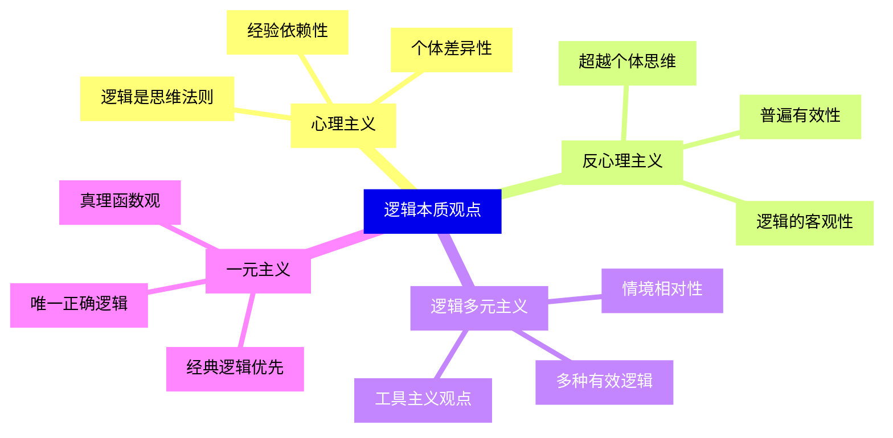
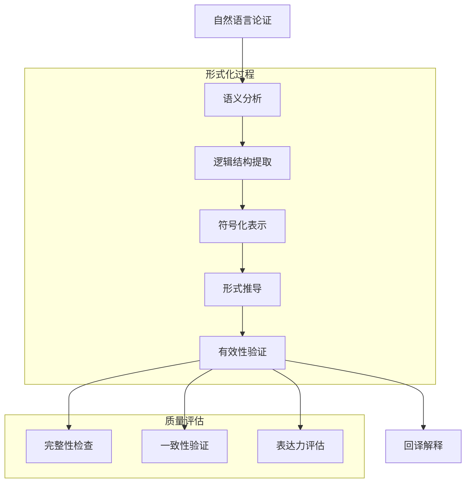
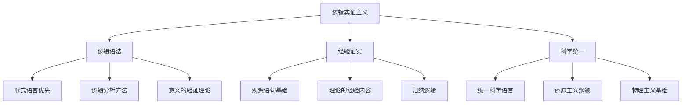

# 3.2 哲学与形式化推理

[返回上级](../3-哲学与科学原理.md) | [English Version](../3-philosophy-and-scientific-principles/3.2-philosophy-and-formal-reasoning.md)

## 目录

- [3.2 哲学与形式化推理](#32-哲学与形式化推理)
  - [目录](#目录)
  - [3.2.1 推理形式化的哲学基础](#321-推理形式化的哲学基础)
    - [3.2.1.1 逻辑的本质探讨](#3211-逻辑的本质探讨)
    - [3.2.1.2 推理的形式化过程](#3212-推理的形式化过程)
    - [3.2.1.3 真理与证明的关系](#3213-真理与证明的关系)
  - [3.2.2 主要哲学流派观点](#322-主要哲学流派观点)
    - [3.2.2.1 逻辑实证主义传统](#3221-逻辑实证主义传统)
    - [3.2.2.2 分析哲学方法](#3222-分析哲学方法)
    - [3.2.2.3 构造主义哲学视角](#3223-构造主义哲学视角)
  - [3.2.3 现代逻辑系统的哲学意义](#323-现代逻辑系统的哲学意义)
    - [3.2.3.1 模态逻辑与可能世界](#3231-模态逻辑与可能世界)
    - [3.2.3.2 非经典逻辑的哲学挑战](#3232-非经典逻辑的哲学挑战)
    - [3.2.3.3 计算哲学的新视角](#3233-计算哲学的新视角)
  - [3.2.4 形式化推理的认知维度](#324-形式化推理的认知维度)
    - [3.2.4.1 推理的心理学基础](#3241-推理的心理学基础)
    - [3.2.4.2 形式化与直觉思维的关系](#3242-形式化与直觉思维的关系)
    - [3.2.4.3 人工智能中的推理模型](#3243-人工智能中的推理模型)
  - [3.2.5 批判性反思与未来方向](#325-批判性反思与未来方向)
    - [3.2.5.1 形式化推理的局限性](#3251-形式化推理的局限性)
    - [3.2.5.2 后现代对形式化的质疑](#3252-后现代对形式化的质疑)
    - [3.2.5.3 整合性思维的前景](#3253-整合性思维的前景)
  - [交叉引用](#交叉引用)
    - [相关主题](#相关主题)
    - [本地导航](#本地导航)
    - [参考文献](#参考文献)
      - [权威文献](#权威文献)
      - [在线资源](#在线资源)
      - [延伸阅读](#延伸阅读)
  - [参考文献1](#参考文献1)
    - [核心理论文献](#核心理论文献)
    - [实践应用文献](#实践应用文献)
    - [学术会议和期刊](#学术会议和期刊)
    - [在线资源1](#在线资源1)
    - [开源项目](#开源项目)
    - [视频教程和课程](#视频教程和课程)

---

## 3.2.1 推理形式化的哲学基础

### 3.2.1.1 逻辑的本质探讨

逻辑作为思维规律的抽象表达，其本质一直是哲学争论的焦点：

**逻辑的存在论地位**:



**逻辑真理的哲学基础**:

\[
\begin{align}
\text{逻辑真理} &= \{φ : \text{在所有解释下} \; φ \text{为真}\} \\
\text{逻辑后承} &: Γ ⊨ φ \iff \text{在所有使}Γ\text{真的解释下}φ\text{都真} \\
\text{逻辑等价} &: φ ≡ ψ \iff φ ⊨ ψ \text{且} ψ ⊨ φ
\end{align}
\]

**推理形式的哲学分类**:

```lean
-- 推理模式的形式化
inductive inference_pattern : Type
| modus_ponens : Prop → (Prop → Prop) → inference_pattern
| modus_tollens : (Prop → Prop) → Prop → inference_pattern  
| hypothetical_syllogism : (Prop → Prop) → (Prop → Prop) → inference_pattern
| disjunctive_syllogism : Prop → Prop → Prop → inference_pattern

-- 推理有效性的定义
def valid_inference (premises : list Prop) (conclusion : Prop) : Prop :=
∀ interpretation, (∀ p ∈ premises, interpretation.eval p = true) → 
  interpretation.eval conclusion = true

-- 哲学推理系统的形式化
structure philosophical_reasoning :=
(premises : list proposition)
(inference_rules : list inference_rule)
(conclusion : proposition)
(validity_condition : valid_inference premises conclusion)
```

### 3.2.1.2 推理的形式化过程

推理的形式化涉及从自然语言论证到符号逻辑系统的转换：

**形式化的认识论意义**:



**形式化的信息转换模型**:

\[
\begin{align}
\text{语义内容} &\xrightarrow{抽象化} \text{逻辑形式} \\
\text{语境信息} &\xrightarrow{形式化} \text{前提条件} \\
\text{推理步骤} &\xrightarrow{符号化} \text{推导规则}
\end{align}
\]

**推理规则的元逻辑性质**:

```lean
-- 推理规则的可靠性
theorem soundness (Γ : context) (φ : formula) :
  Γ ⊢ φ → Γ ⊨ φ :=
sorry

-- 推理规则的完备性  
theorem completeness (Γ : context) (φ : formula) :
  Γ ⊨ φ → Γ ⊢ φ :=
sorry

-- 一致性定理
theorem consistency (Γ : context) :
  ¬(Γ ⊢ ⊥) ↔ ∃ M, M ⊨ Γ :=
sorry
```

### 3.2.1.3 真理与证明的关系

形式化推理中真理与证明的关系是数学哲学的核心问题：

**真理观的哲学分类**:

| 真理理论 | 核心观点 | 在形式化中的体现 | 哲学问题 |
|----------|----------|------------------|----------|
| 符合论 | 真理是命题与实在的符合 | 模型论语义 | 实在的本质 |
| 融贯论 | 真理是信念系统的内在一致性 | 公理系统 | 循环论证问题 |
| 实用主义 | 真理是有用的信念 | 算法正确性 | 相对主义危险 |
| 紧缩论 | "真"仅是语言装置 | 形式语义 | 通胀论问题 |

**构造主义的真理观**:

```lean
-- 构造主义的存在性
def constructive_exists (P : ℕ → Prop) : Prop :=
∃ n, P n ∧ ∃ (witness : ℕ), witness = n ∧ P witness

-- 排中律在构造主义中的地位
axiom excluded_middle_not_constructive : 
  ¬ ∀ (P : Prop), P ∨ ¬P

-- 直觉主义逻辑的特点
theorem brouwer_fixed_point : 
  ∀ (f : [0,1] → [0,1]), continuous f → ∃ x, f x = x :=
sorry  -- 需要构造性证明
```

## 3.2.2 主要哲学流派观点

### 3.2.2.1 逻辑实证主义传统

逻辑实证主义对形式化推理的发展产生了深远影响：

**维也纳学派的核心理念**:



**卡尔纳普的逻辑语法**:

```lean
-- 语言的逻辑语法结构
structure logical_syntax :=
(formation_rules : list formation_rule)
(transformation_rules : list transformation_rule)
(consequence_relation : formula → formula → Prop)

-- 分析性与综合性的形式化
def analytic (φ : formula) (L : logical_syntax) : Prop :=
L.consequence_relation ⊤ φ

def synthetic (φ : formula) (L : logical_syntax) : Prop :=
¬ analytic φ L ∧ ¬ analytic (¬φ) L
```

### 3.2.2.2 分析哲学方法

分析哲学强调语言分析和概念澄清的方法：

**概念分析的形式化方法**:

```rust
// 概念分析的程序化表示
trait ConceptAnalysis {
    type Concept;
    type AnalysisResult;
    
    // 必要条件分析
    fn necessary_conditions(&self, concept: &Self::Concept) -> Vec<Condition>;
    
    // 充分条件分析
    fn sufficient_conditions(&self, concept: &Self::Concept) -> Vec<Condition>;
    
    // 必要充分条件
    fn necessary_and_sufficient(&self, concept: &Self::Concept) -> Option<Definition>;
    
    // 反例测试
    fn test_counterexample(&self, definition: &Definition, case: &TestCase) -> bool;
}

#[derive(Debug)]
struct Condition {
    predicate: String,
    necessity_degree: f64,
    evidence: Vec<String>,
}
```

### 3.2.2.3 构造主义哲学视角

构造主义对数学和逻辑的存在性提出了根本性的重新思考：

**布劳威尔的直觉主义**:

```lean
-- 直觉主义的排中律拒斥
theorem excluded_middle_fails : ¬ ∀ (P : Prop), P ∨ ¬P :=
begin
  intro h,
  -- 反例：连续统假设的独立性
  have CH := continuum_hypothesis,
  have not_CH := ¬ continuum_hypothesis,
  -- 既不能证明CH也不能证明¬CH
  sorry
end

-- 选择公理的构造性问题
axiom choice_not_constructive : 
  ¬ ∀ (X : Type) (R : X → X → Prop), 
    (∀ x, ∃ y, R x y) → ∃ f : X → X, ∀ x, R x (f x)
```

## 3.2.3 现代逻辑系统的哲学意义

### 3.2.3.1 模态逻辑与可能世界

模态逻辑扩展了经典逻辑，引入了必然性和可能性概念：

**模态逻辑的哲学基础**:

```lean
-- 模态算子的定义
constant necessarily : Prop → Prop  -- □
constant possibly : Prop → Prop     -- ◇

-- 模态公理
axiom dual_modality : ∀ P, necessarily P ↔ ¬ possibly (¬ P)
axiom modal_axiom_K : ∀ P Q, necessarily (P → Q) → (necessarily P → necessarily Q)
axiom modal_axiom_T : ∀ P, necessarily P → P
axiom modal_axiom_4 : ∀ P, necessarily P → necessarily (necessarily P)
axiom modal_axiom_5 : ∀ P, possibly P → necessarily (possibly P)

-- 可能世界语义
structure kripke_model :=
(worlds : Type)
(accessibility : worlds → worlds → Prop)
(valuation : worlds → string → Prop)
```

### 3.2.3.2 非经典逻辑的哲学挑战

非经典逻辑质疑了经典逻辑的普遍有效性：

**多值逻辑系统**:

```lean
-- 三值逻辑（Łukasiewicz）
inductive three_valued : Type
| true : three_valued
| false : three_valued  
| unknown : three_valued

def three_valued_and : three_valued → three_valued → three_valued
| three_valued.true three_valued.true => three_valued.true
| three_valued.false _ => three_valued.false
| _ three_valued.false => three_valued.false
| _ _ => three_valued.unknown

-- 模糊逻辑
def fuzzy_value := {x : ℝ // 0 ≤ x ∧ x ≤ 1}

def fuzzy_and (x y : fuzzy_value) : fuzzy_value :=
⟨min x.val y.val, by simp [min_le_iff]; exact ⟨x.property.1, y.property.2⟩⟩
```

### 3.2.3.3 计算哲学的新视角

计算概念为哲学推理提供了新的思考框架：

**计算主义的哲学立场**:

```rust
// 计算理论的哲学模型
trait ComputationalPhilosophy {
    type Mind;
    type Computation;
    type Information;
    
    // 强AI假设：心智即计算
    fn mind_is_computation(&self, mind: &Self::Mind) -> Self::Computation;
    
    // 教会-图灵论题：有效可计算性
    fn effectively_computable(&self, function: &dyn Fn(u32) -> u32) -> bool;
    
    // 信息处理模型
    fn information_processing(&self, input: Self::Information) -> Self::Information;
}
```

## 3.2.4 形式化推理的认知维度

### 3.2.4.1 推理的心理学基础

认知科学研究揭示了人类推理与形式逻辑之间的复杂关系：

**认知偏差与逻辑推理**:

```python
# 认知偏差的计算模型
class CognitiveBiasModel:
    def __init__(self):
        self.system1_thinking = FastIntuition()
        self.system2_thinking = SlowReasoning()
        self.biases = {
            "confirmation_bias": 0.6,
            "availability_heuristic": 0.4,
            "anchoring_effect": 0.5
        }
    
    def reasoning_process(self, problem):
        """双过程理论的推理模型"""
        if problem.complexity < self.threshold:
            return self.system1_thinking.process(problem)
        else:
            return self.system2_thinking.process(problem)
    
    def bias_adjustment(self, conclusion, bias_type):
        """偏差修正机制"""
        adjustment = self.biases.get(bias_type, 0.0)
        return conclusion * (1 - adjustment)
```

### 3.2.4.2 形式化与直觉思维的关系

**数学直觉的哲学地位**:

\[
\begin{align}
\text{数学直觉} &\neq \text{形式证明} \\
\text{创造性洞察} &\not\subseteq \text{机械推导} \\
\text{概念理解} &\supsetneq \text{符号操作}
\end{align}
\]

### 3.2.4.3 人工智能中的推理模型

AI系统对形式化推理提出了新的理解：

**符号AI vs 连接主义**:

```haskell
-- Haskell中的符号推理模型
data Knowledge = Fact String | Rule String String

type KnowledgeBase = [Knowledge]

-- 前向链推理
forwardChain :: KnowledgeBase -> [String] -> [String]
forwardChain kb facts = 
  let newFacts = [conclusion | Rule premise conclusion <- kb, premise `elem` facts]
  in if null newFacts then facts else forwardChain kb (facts ++ newFacts)

-- 后向链推理  
backwardChain :: KnowledgeBase -> String -> Bool
backwardChain kb goal = 
  goal `elem` facts || any (\rule -> case rule of
    Rule premise conclusion -> conclusion == goal && backwardChain kb premise
    _ -> False) kb
  where facts = [f | Fact f <- kb]
```

## 3.2.5 批判性反思与未来方向

### 3.2.5.1 形式化推理的局限性

形式化推理面临多重哲学和实践挑战：

**本质性限制**:

```lean
-- 哥德尔不完备性的哲学意义
theorem fundamental_limitations :
  ∀ (formal_system : Type) [consistent formal_system] [contains_arithmetic formal_system],
    ∃ (statement : formula), undecidable formal_system statement ∧ 
      true_in_standard_model statement :=
sorry

-- 停机问题的认识论意义
theorem halting_problem_epistemological :
  ∀ (reasoning_system : Type),
    ¬ ∃ (decision_procedure : program → input → bool),
      ∀ p i, decision_procedure p i = true ↔ terminates p i :=
sorry
```

### 3.2.5.2 后现代对形式化的质疑

后现代哲学对形式化推理的普遍主义提出了根本性质疑：

**权力与知识的关系**:

\[
\begin{align}
\text{西方逻辑} &\neq \text{普遍理性} \\
\text{形式化} &\subset \text{认知方式的一种} \\
\text{边缘化知识} &= \{x : \neg \text{formally_representable}(x)\}
\end{align}
\]

### 3.2.5.3 整合性思维的前景

未来的哲学可能需要整合多种思维方式：

**后后现代的综合视角**:

```lean
-- 多元逻辑的整合模型
structure pluralistic_reasoning :=
(formal_component : formal_logic)
(intuitive_component : intuitive_reasoning)
(cultural_component : cultural_logic)
(embodied_component : embodied_cognition)
(integration_principles : integration_rule)

-- 情境化的推理有效性
def situated_validity (argument : reasoning_pattern) 
    (context : cognitive_context) : Prop :=
  appropriate_for_domain argument context.domain ∧
  culturally_sensitive argument context.culture ∧
  cognitively_feasible argument context.cognitive_resources
```

## 交叉引用

### 相关主题

- [1.1 统一形式化理论综述](../1-形式化理论/1.1-统一形式化理论综述.md) - 形式化理论的哲学基础
- [2.2 数学与形式化语言关系](../2-数学基础与应用/2.2-数学与形式化语言关系.md) - 数学形式化的认识论
- [6.1 Lean语言与形式化证明](../6-编程语言与实现/6.1-lean语言与形式化证明.md) - 形式化工具的哲学意义
- [7.1 形式化验证架构](../7-验证与工程实践/7.1-形式化验证架构.md) - 验证的认识论基础

### 本地导航

- [上一节: 3.1 哲学内容全景分析](./3.1-哲学内容全景分析.md)
- [下一节: 3.x 其他哲学主题](./3.x-其他哲学主题.md)
- [返回哲学与科学原理主目录](./README.md)

### 参考文献

#### 权威文献

1. Russell, B. & Whitehead, A. N. *Principia Mathematica*
2. Carnap, R. *The Logical Syntax of Language*
3. Quine, W. V. O. *Word and Object*
4. Dummett, M. *Elements of Intuitionism*
5. Hacking, I. *Why Is There Philosophy of Mathematics At All?*

#### 在线资源

- [Stanford Encyclopedia of Philosophy](https://plato.stanford.edu/)
- [Internet Encyclopedia of Philosophy](https://iep.utm.edu/)
- [PhilPapers](https://philpapers.org/)

#### 延伸阅读

- 逻辑哲学的当代发展
- 认知科学与推理研究  
- 跨文化逻辑比较研究

## 参考文献1

### 核心理论文献

1. **逻辑哲学基础**
   - Gottlob Frege. "Begriffsschrift, eine der arithmetischen nachgebildete Formelsprache des reinen Denkens". Halle, 1879.
   - Bertrand Russell. "The Principles of Mathematics". Cambridge University Press, 1903.
   - Ludwig Wittgenstein. "Tractatus Logico-Philosophicus". Routledge, 1922.

2. **形式化推理理论**
   - Rudolf Carnap. "The Logical Syntax of Language". Routledge, 1937.
   - Willard Van Orman Quine. "Word and Object". MIT Press, 1960.
   - Saul Kripke. "Naming and Necessity". Harvard University Press, 1980.

3. **构造主义与直觉主义**
   - L.E.J. Brouwer. "Intuitionism and Formalism". Bulletin of the American Mathematical Society, 1913.
   - Arend Heyting. "Intuitionism: An Introduction". North-Holland, 1956.
   - Per Martin-Löf. "Intuitionistic Type Theory". Bibliopolis, 1984.

### 实践应用文献

1. **计算哲学**
   - Luciano Floridi. "The Philosophy of Information". Oxford University Press, 2011.
   - David Chalmers. "The Conscious Mind: In Search of a Fundamental Theory". Oxford University Press, 1996.
   - Nick Bostrom. "Superintelligence: Paths, Dangers, Strategies". Oxford University Press, 2014.

2. **人工智能哲学**
   - John Searle. "Minds, Brains, and Programs". Behavioral and Brain Sciences, 1980.
   - Hubert Dreyfus. "What Computers Still Can't Do". MIT Press, 1992.
   - Daniel Dennett. "Consciousness Explained". Little, Brown and Company, 1991.

### 学术会议和期刊

- **Philosophy of Science Association**: PSA
- **Association for Symbolic Logic**: ASL
- **International Association for Computing and Philosophy**: IACAP
- **Journal of Philosophy**
- **Philosophy of Science**
- **Journal of Symbolic Logic**
- **Minds and Machines**

### 在线资源1

- **Stanford Encyclopedia of Philosophy**: <https://plato.stanford.edu/>
- **Internet Encyclopedia of Philosophy**: <https://iep.utm.edu/>
- **PhilPapers**: <https://philpapers.org/>
- **Philosophy Now**: <https://philosophynow.org/>

### 开源项目

- **Coq Proof Assistant**: <https://github.com/coq/coq>
- **Lean Theorem Prover**: <https://github.com/leanprover/lean4>
- **Isabelle/HOL**: <https://github.com/isabelle-prover/isabelle>
- **Agda**: <https://github.com/agda/agda>

### 视频教程和课程

- **MIT OpenCourseWare - Philosophy**: <https://ocw.mit.edu/courses/philosophy/>
- **Coursera - Philosophy Courses**: <https://www.coursera.org/browse/arts-and-humanities/philosophy>
- **edX - Logic and Critical Thinking**: <https://www.edx.org/learn/logic>
- **YouTube Philosophy Channels**: Philosophy Tube, Crash Course Philosophy

---

**返回上级**: [3-哲学与科学原理](../3-哲学与科学原理.md) | **下一个**: [3.x-其他哲学主题](3.x-其他哲学主题.md)

[返回目录](../0-总览与导航/0.1-全局主题树形目录.md)
