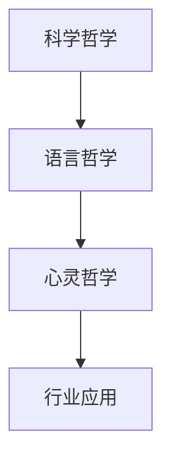

# 3.x 其他哲学主题

## 目录

3.x.1 主题概述  
3.x.2 相关前沿哲学理论  
3.x.3 典型模型与方法  
3.x.4 形式化定义与分析  
3.x.5 行业应用与案例  
3.x.6 图表与多表征  
3.x.7 相关性与交叉引用  
3.x.8 参考文献与延伸阅读  

---

### 3.x.1 主题概述

本节收录尚未归入前述各节的其他重要哲学主题，如科学哲学、语言哲学、心灵哲学等。

### 3.x.2 相关前沿哲学理论

- 科学哲学（Philosophy of Science）
- 语言哲学（Philosophy of Language）
- 心灵哲学（Philosophy of Mind）

### 3.x.3 典型模型与方法

- 科学解释模型
- 语言分析与语义学
- 意识与认知模型

### 3.x.4 形式化定义与分析

#### 科学理论的结构（LaTeX表达）

$$
T = (A, R, D)\ \text{，其中}A\text{为公理集}, R\text{为推理规则}, D\text{为定义集}
$$

#### 语言哲学中的语义分析（Lean伪代码）

```lean
structure Sentence :=
  (content : string)
  (meaning : string)
```

### 3.x.5 行业应用与案例

- 科学理论的工程实现
- 认知科学与人工智能

### 3.x.6 图表与多表征



### 3.x.7 相关性与交叉引用

- [3.1-哲学内容全景分析](./3.1-哲学内容全景分析.md)
- [1.x-其他形式化主题](../1-形式化理论/1.x-其他形式化主题.md)

### 3.x.8 参考文献与延伸阅读

- 《科学哲学导论》
- 《语言哲学》
- 相关论文与开源项目
