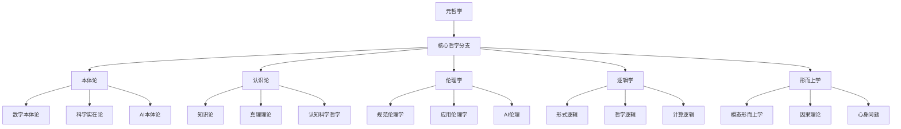
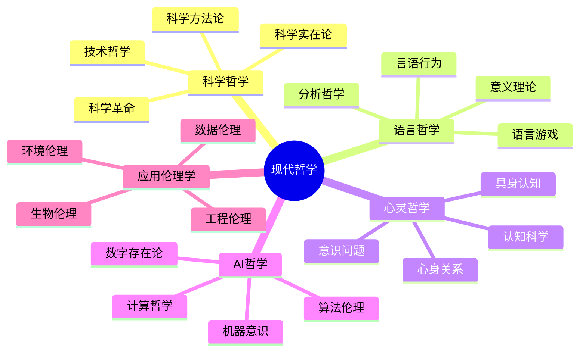
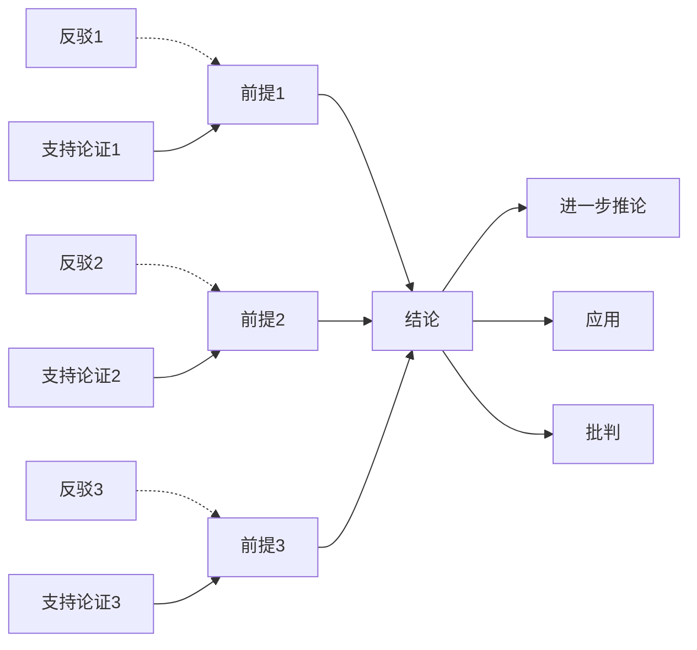

# 3.x 其他哲学主题

[返回上级](../3-哲学与科学原理.md)

## 目录

- [3.x 其他哲学主题](#3x-其他哲学主题)
  - [目录](#目录)
  - [3.x.1 科学哲学与技术哲学](#3x1-科学哲学与技术哲学)
    - [科学实在论与反实在论的现代争论](#科学实在论与反实在论的现代争论)
    - [库恩的科学革命理论](#库恩的科学革命理论)
    - [技术哲学的伦理维度](#技术哲学的伦理维度)
  - [3.x.2 语言哲学与分析哲学](#3x2-语言哲学与分析哲学)
    - [意义理论的发展](#意义理论的发展)
    - [语言游戏与生活形式](#语言游戏与生活形式)
    - [言语行为理论](#言语行为理论)
  - [3.x.3 心灵哲学与认知科学哲学](#3x3-心灵哲学与认知科学哲学)
    - [心身问题的现代形式](#心身问题的现代形式)
    - [意识的困难问题](#意识的困难问题)
    - [具身认知理论](#具身认知理论)
  - [3.x.4 形而上学的现代发展](#3x4-形而上学的现代发展)
    - [模态形而上学](#模态形而上学)
    - [新本质主义](#新本质主义)
    - [因果理论](#因果理论)
  - [3.x.5 AI哲学与计算哲学](#3x5-ai哲学与计算哲学)
    - [强人工智能与弱人工智能](#强人工智能与弱人工智能)
    - [机器意识问题](#机器意识问题)
    - [算法偏见与公平性](#算法偏见与公平性)
  - [3.x.6 信息哲学与数字存在论](#3x6-信息哲学与数字存在论)
    - [信息作为基础实在](#信息作为基础实在)
    - [数字存在的本体论地位](#数字存在的本体论地位)
  - [3.x.7 应用伦理学的前沿发展](#3x7-应用伦理学的前沿发展)
    - [生物伦理学的新挑战](#生物伦理学的新挑战)
    - [环境伦理学与可持续发展](#环境伦理学与可持续发展)
    - [数据伦理与隐私哲学](#数据伦理与隐私哲学)
  - [3.x.8 图表与多表征](#3x8-图表与多表征)
    - [哲学问题的层次结构](#哲学问题的层次结构)
    - [跨学科哲学网络](#跨学科哲学网络)
    - [哲学论证的形式结构](#哲学论证的形式结构)
  - [3.x.9 相关性与交叉引用](#3x9-相关性与交叉引用)
    - [理论基础联系](#理论基础联系)
    - [跨学科交叉引用](#跨学科交叉引用)
    - [方法论联系](#方法论联系)
  - [3.x.10 参考文献与延伸阅读](#3x10-参考文献与延伸阅读)
    - [科学哲学](#科学哲学)
    - [语言哲学](#语言哲学)
    - [心灵哲学](#心灵哲学)
    - [AI哲学](#ai哲学)
    - [应用伦理学](#应用伦理学)
    - [在线资源](#在线资源)

---

## 3.x.1 科学哲学与技术哲学

### 科学实在论与反实在论的现代争论

科学哲学的核心问题之一是科学理论的实在性地位。现代科学实在论与反实在论的争论具有重要的哲学和实践意义：

```lean
-- 科学实在论的形式化表述
structure ScientificRealism where
  unobservable_entities_exist : ∀ (entity : TheoreticalEntity), 
    scientifically_postulated entity → exists_independently entity
  theories_approximately_true : ∀ (theory : ScientificTheory),
    empirically_successful theory → approximately_true theory
  scientific_progress : ∀ (t₁ t₂ : ScientificTheory),
    t₂.succeeds t₁ → t₂.closer_to_truth t₁

-- 反实在论的构造经验论立场
structure ConstructiveEmpiricism where
  empirical_adequacy_suffices : ∀ (theory : ScientificTheory),
    empirically_adequate theory → no_truth_commitment_needed theory
  observable_distinction : distinguishable Observable UnobservableEntity
  agnostic_about_unobservables : ∀ (entity : UnobservableEntity),
    no_commitment (exists entity)
```

### 库恩的科学革命理论

```lean
-- 范式概念的形式化
structure Paradigm where
  exemplars : Set ExemplarySolutions
  symbolic_generalizations : Set LawStatements  
  metaphysical_commitments : Set OntologicalBeliefs
  values : Set EpistemicValues
  
-- 科学革命的结构
inductive ScientificRevolution where
  | normal_science : Paradigm → Period → ScientificRevolution
  | crisis : Paradigm → Set Anomaly → ScientificRevolution  
  | revolution : Paradigm → Paradigm → IncommensurabilityRelation → ScientificRevolution
  | new_normal : Paradigm → ScientificRevolution

-- 范式不可通约性
def incommensurable (p₁ p₂ : Paradigm) : Prop :=
  ¬∃ (neutral_language : Language), 
    translatable p₁.language neutral_language ∧ 
    translatable p₂.language neutral_language
```

### 技术哲学的伦理维度

现代技术哲学面临的核心挑战是如何在快速技术发展中保持人文价值：

```rust
// 技术伦理评估框架
pub struct TechnologyEthicsFramework {
    consequentialist_analysis: ConsequentialistEthics,
    deontological_principles: DeontologicalEthics,
    virtue_ethics_approach: VirtueEthics,
    care_ethics_perspective: CareEthics,
}

impl TechnologyEthicsFramework {
    pub fn evaluate_technology(&self, tech: &Technology) -> EthicalAssessment {
        let consequences = self.consequentialist_analysis.analyze(&tech.impacts);
        let duties = self.deontological_principles.check_duties(&tech.design);
        let virtues = self.virtue_ethics_approach.assess_character(&tech.developers);
        let care = self.care_ethics_perspective.evaluate_relationships(&tech.effects);
        
        EthicalAssessment::synthesize(consequences, duties, virtues, care)
    }
    
    pub fn recommend_design_principles(&self, domain: &TechnologyDomain) 
        -> Vec<DesignPrinciple> {
        match domain {
            TechnologyDomain::ArtificialIntelligence => vec![
                DesignPrinciple::Transparency,
                DesignPrinciple::Fairness,
                DesignPrinciple::HumanAgency,
                DesignPrinciple::PrivacyProtection,
            ],
            TechnologyDomain::Biotechnology => vec![
                DesignPrinciple::HumanDignity,
                DesignPrinciple::InformedConsent,
                DesignPrinciple::Beneficence,
                DesignPrinciple::Justice,
            ],
            _ => self.derive_principles_from_analysis(domain)
        }
    }
}
```

## 3.x.2 语言哲学与分析哲学

### 意义理论的发展

从弗雷格到当代，意义理论经历了深刻的发展：

```lean
-- 弗雷格的意义-指称区分
structure FregeanSemantics where
  sense : Expression → Sense
  reference : Expression → Reference  
  compositionality : ∀ (e₁ e₂ : Expression), 
    sense (combine e₁ e₂) = combine (sense e₁) (sense e₂)
  cognitive_significance : ∀ (e₁ e₂ : Expression),
    sense e₁ ≠ sense e₂ → cognitively_distinct e₁ e₂

-- 奎因的本体论承诺
def ontological_commitment (theory : Theory) : Set Entity :=
  {e : Entity | ∃ (variable : Variable), 
    quantifies_over theory variable ∧ ranges_over variable e}

-- 戴维森的真值条件语义学
structure TruthConditionalSemantics where
  truth_conditions : Sentence → Set PossibleWorld → Prop
  meaning_as_truth_conditions : ∀ (s : Sentence),
    meaning s = truth_conditions s
  compositionality : ∀ (s : Sentence),
    truth_conditions s = compose (parts s)
```

### 语言游戏与生活形式

维特根斯坦后期哲学的核心概念：

```lean
-- 语言游戏的概念
structure LanguageGame where
  linguistic_moves : Set LinguisticAct
  rules : Set GameRule
  life_form : LifeForm
  participants : Set Agent
  context : SocialContext
  
-- 生活形式与语言使用
def life_form_determines_meaning (lf : LifeForm) (expr : Expression) : Meaning :=
  let games := language_games_in lf
  let uses := uses_of expr games
  meaning_from_use uses

-- 遵循规则的悖论
theorem rule_following_paradox : 
  ∀ (rule : Rule) (action : Action),
    ¬∃ (facts : Set Fact), determines facts (follows rule action) := by
  sorry -- 维特根斯坦的私人语言论证
```

### 言语行为理论

```lean
-- 奥斯汀的言语行为分类
inductive SpeechAct where
  | locutionary : Proposition → SpeechAct  -- 语句行为
  | illocutionary : Force → Proposition → SpeechAct  -- 语力行为  
  | perlocutionary : Effect → SpeechAct  -- 语效行为

-- 塞尔的言语行为条件
structure SpeechActConditions where
  propositional_content : PropositionalContent
  preparatory_conditions : Set Condition
  sincerity_condition : SincerityCondition  
  essential_condition : EssentialCondition

-- 成功的言语行为
def successful_speech_act (act : SpeechAct) (context : Context) : Prop :=
  satisfies context act.preparatory_conditions ∧
  satisfies context act.sincerity_condition ∧
  satisfies context act.essential_condition
```

## 3.x.3 心灵哲学与认知科学哲学

### 心身问题的现代形式

心身问题在认知科学时代获得了新的表达形式：

```lean
-- 物理主义的各种形式
inductive Physicalism where
  | type_identity : ∀ (mental_type : MentalType), 
      ∃ (physical_type : PhysicalType), identical mental_type physical_type
  | token_identity : ∀ (mental_event : MentalEvent),
      ∃ (physical_event : PhysicalEvent), identical mental_event physical_event  
  | functionalism : ∀ (mental_state : MentalState),
      ∃ (functional_role : FunctionalRole), realizes functional_role mental_state
  | eliminativism : ∀ (mental_concept : MentalConcept),
      ¬∃ (real_phenomenon : Phenomenon), refers_to mental_concept real_phenomenon

-- 多重实现论证
theorem multiple_realizability : 
  ∀ (mental_property : MentalProperty),
    ∃ (physical_bases : Set PhysicalProperty),
      cardinality physical_bases > 1 ∧
      ∀ p ∈ physical_bases, realizes p mental_property := by
  sorry -- 针对类型同一论的论证
```

### 意识的困难问题

```lean
-- 查尔默斯的意识区分
structure ConsciousnessDistinction where
  phenomenal_consciousness : Set QualitativeExperience  -- 现象意识
  access_consciousness : Set CognitiveAccess  -- 通达意识
  explanatory_gap : phenomenal_consciousness ≠ access_consciousness
  
-- 质感的不可还原性
def irreducible_qualia (experience : QualitativeExperience) : Prop :=
  ¬∃ (physical_description : PhysicalDescription),
    captures physical_description (what_its_like experience)

-- 僵尸论证
theorem zombie_argument : 
  conceivable PhilosophicalZombie → 
  metaphysically_possible PhilosophicalZombie →
  ¬physicalism := by
  sorry -- 概念可能性到形而上学可能性的推理
```

### 具身认知理论

```rust
// 具身认知的计算模型
pub struct EmbodiedCognition {
    sensorimotor_system: SensorimotorSystem,
    body_schema: BodySchema,
    action_repertoire: ActionRepertoire,
    environmental_coupling: EnvironmentCoupling,
}

impl EmbodiedCognition {
    pub fn perceive_act_cycle(&mut self, environment: &Environment) 
        -> CognitiveDynamics {
        
        // 感知-行动循环
        let sensory_input = self.sensorimotor_system.perceive(environment);
        let body_state = self.body_schema.update(&sensory_input);
        let affordances = environment.detect_affordances(&body_state);
        let selected_action = self.action_repertoire.select(&affordances);
        let motor_output = self.sensorimotor_system.act(&selected_action);
        
        CognitiveDynamics {
            perception: sensory_input,
            action: motor_output,
            coupling: self.environmental_coupling.strength(),
            emergent_cognition: self.compute_emergent_properties(),
        }
    }
    
    // 认知的涌现性质
    fn compute_emergent_properties(&self) -> EmergentCognition {
        let sensorimotor_patterns = self.sensorimotor_system.extract_patterns();
        let environmental_regularities = self.environmental_coupling.regularities();
        
        EmergentCognition::from_interaction(sensorimotor_patterns, environmental_regularities)
    }
}

// 4E认知理论的整合
pub struct FourECognition {
    embodied: EmbodiedCognition,
    embedded: EmbeddedCognition,
    enacted: EnactiveCognition,
    extended: ExtendedCognition,
}
```

## 3.x.4 形而上学的现代发展

### 模态形而上学

可能世界语义学对形而上学的革命性影响：

```lean
-- 可能世界的形式化
structure PossibleWorld where
  entities : Set Entity
  properties : Entity → Set Property
  relations : Set Relation
  facts : Set Fact
  
-- 模态性质的定义
def necessarily (proposition : Prop) : Prop :=
  ∀ (w : PossibleWorld), accessible actual_world w → proposition.holds_in w

def possibly (proposition : Prop) : Prop :=
  ∃ (w : PossibleWorld), accessible actual_world w ∧ proposition.holds_in w

-- 德·雷的必然后验
theorem necessary_a_posteriori_exists : 
  ∃ (statement : Statement), 
    necessary statement ∧ knowable_only_a_posteriori statement := by
  use "water is H2O"
  sorry -- 通过自然种类词的分析

-- 刚性指示词理论
def rigid_designator (term : Term) : Prop :=
  ∀ (w : PossibleWorld), ∃ (object : Entity),
    designates_in_world term object w ∧
    ∀ (w' : PossibleWorld), designates_in_world term object w'
```

### 新本质主义

```lean
-- 本质属性与偶然属性
def essential_property (entity : Entity) (property : Property) : Prop :=
  ∀ (w : PossibleWorld), 
    exists_in entity w → has_property entity property w

def accidental_property (entity : Entity) (property : Property) : Prop :=
  ∃ (w : PossibleWorld), 
    exists_in entity w ∧ ¬has_property entity property w

-- 种类本质主义
structure KindEssentialism where
  natural_kinds : Set NaturalKind
  essential_properties : NaturalKind → Set Property
  kind_membership : Entity → NaturalKind → Prop
  
  kind_determines_essence : ∀ (e : Entity) (k : NaturalKind),
    kind_membership e k → 
    ∀ p ∈ essential_properties k, essential_property e p
```

### 因果理论

```lean
-- 因果关系的反事实分析
def causation (event1 event2 : Event) : Prop :=
  occurs event1 ∧ occurs event2 ∧
  counterfactual_dependence event2 event1

def counterfactual_dependence (effect cause : Event) : Prop :=
  ∀ (w : PossibleWorld), 
    closest_world w (¬occurs cause) → ¬occurs_in effect w

-- 因果排斥问题
theorem causal_exclusion_problem :
  ∀ (mental_cause : MentalEvent) (physical_effect : PhysicalEvent),
    causes mental_cause physical_effect →
    ∃ (physical_cause : PhysicalEvent),
      causes physical_cause physical_effect ∧
      excludes physical_cause mental_cause := by
  sorry -- 因果完备性原理的应用
```

## 3.x.5 AI哲学与计算哲学

### 强人工智能与弱人工智能

```lean
-- 塞尔的中文房间论证
structure ChineseRoomArgument where
  syntax_not_semantics : SyntacticManipulation ≠ SemanticUnderstanding
  intentionality_requires_consciousness : Understanding → Consciousness
  computers_only_syntax : ∀ (computer : Computer), operates_on computer Syntax
  
theorem computers_cannot_understand : 
  ∀ (ai_system : AISystem), ¬has_understanding ai_system := by
  apply ChineseRoomArgument.syntax_not_semantics
  sorry

-- 图灵测试的哲学分析
structure TuringTest where
  behavioral_criterion : BehaviorEquivalence → Intelligence
  imitation_game : Conversation → JudgmentTask
  anthropomorphic_bias : HumanLikeBehavior ≠ Intelligence
```

### 机器意识问题

```rust
// 机器意识的评估框架
pub struct MachineConsciousnessFramework {
    phenomenal_indicators: Vec<PhenomenalIndicator>,
    access_consciousness_tests: Vec<AccessTest>,
    integrated_information: IntegratedInformationMeasure,
    global_workspace: GlobalWorkspaceArchitecture,
}

impl MachineConsciousnessFramework {
    pub fn assess_consciousness(&self, system: &AISystem) -> ConsciousnessLevel {
        let phenomenal_score = self.evaluate_phenomenal_indicators(system);
        let access_score = self.evaluate_access_consciousness(system);
        let integration_score = self.integrated_information.calculate(system);
        let workspace_score = self.global_workspace.evaluate(system);
        
        ConsciousnessLevel::from_scores(
            phenomenal_score,
            access_score, 
            integration_score,
            workspace_score
        )
    }
    
    pub fn design_conscious_architecture(&self) -> ArchitectureBlueprint {
        ArchitectureBlueprint {
            phenomenal_layer: self.design_phenomenal_layer(),
            access_layer: self.design_access_layer(),
            integration_layer: self.design_integration_layer(),
            metacognitive_layer: self.design_metacognitive_layer(),
        }
    }
}

// 人工意识的伦理含义
pub struct ArtificialConsciousnessEthics {
    moral_status_criteria: MoralStatusCriteria,
    rights_framework: RightsFramework,
    responsibility_attribution: ResponsibilityFramework,
}
```

### 算法偏见与公平性

```lean
-- 算法公平性的形式化定义
structure AlgorithmicFairness where
  demographic_parity : ∀ (group1 group2 : DemographicGroup),
    P(positive_outcome | group1) = P(positive_outcome | group2)
  equalized_odds : ∀ (group1 group2 : DemographicGroup),
    P(positive_prediction | positive_outcome, group1) = 
    P(positive_prediction | positive_outcome, group2)
  individual_fairness : ∀ (individual1 individual2 : Individual),
    similar individual1 individual2 → 
    similar (algorithm_output individual1) (algorithm_output individual2)

-- 公平性标准的不相容性
theorem fairness_impossibility : 
  ¬∃ (algorithm : Algorithm),
    satisfies algorithm demographic_parity ∧
    satisfies algorithm equalized_odds ∧
    satisfies algorithm individual_fairness := by
  sorry -- 公平性的数学限制
```

## 3.x.6 信息哲学与数字存在论

### 信息作为基础实在

```lean
-- 信息本体论的基本假设
structure InformationOntology where
  information_as_fundamental : Information = BaseReality
  digital_physics : Universe ≃ ComputationalProcess
  it_from_bit : ∀ (physical_entity : PhysicalEntity),
    ∃ (information_pattern : InformationPattern),
      realizes information_pattern physical_entity

-- 信息处理的层次
inductive InformationLevel where
  | syntactic : SyntacticInformation → InformationLevel
  | semantic : SemanticInformation → InformationLevel  
  | pragmatic : PragmaticInformation → InformationLevel
  | ethical : EthicalInformation → InformationLevel

-- 信息复杂性与意义
def meaningful_information (info : Information) : Prop :=
  has_semantic_content info ∧ 
  has_pragmatic_value info ∧
  computable_in_polynomial_time (extract_meaning info)
```

### 数字存在的本体论地位

```rust
// 数字实体的存在论分析
pub struct DigitalOntology {
    virtual_objects: Set<VirtualObject>,
    digital_persons: Set<DigitalPerson>,
    computational_processes: Set<ComputationalProcess>,
    information_structures: Set<InformationStructure>,
}

impl DigitalOntology {
    pub fn analyze_existence_status(&self, entity: &DigitalEntity) 
        -> ExistenceStatus {
        match entity {
            DigitalEntity::VirtualObject(obj) => {
                if obj.has_causal_powers() && obj.persists_across_contexts() {
                    ExistenceStatus::RealVirtualExistence
                } else {
                    ExistenceStatus::MereSimulation
                }
            }
            DigitalEntity::DigitalPerson(person) => {
                if person.has_consciousness() && person.has_autonomy() {
                    ExistenceStatus::DigitalPersonhood
                } else {
                    ExistenceStatus::SophisticatedSimulation  
                }
            }
            DigitalEntity::AIAgent(agent) => {
                self.assess_agent_ontology(agent)
            }
        }
    }
    
    // 数字伦理学的基础
    pub fn digital_ethics_framework(&self) -> DigitalEthicsFramework {
        DigitalEthicsFramework {
            virtual_rights: self.derive_virtual_rights(),
            digital_dignity: self.conceptualize_digital_dignity(),
            computational_responsibility: self.define_computational_responsibility(),
            information_justice: self.develop_information_justice(),
        }
    }
}
```

## 3.x.7 应用伦理学的前沿发展

### 生物伦理学的新挑战

```lean
-- CRISPR基因编辑的伦理分析
structure GeneEditingEthics where
  therapeutic_vs_enhancement : TherapeuticUse ≠ HumanEnhancement
  germline_modification_concerns : GermlineEdit → FutureGenerationEffects
  justice_considerations : ∀ (therapy : GeneTherapy),
    accessible therapy → just_distribution therapy
  human_dignity_principle : ∀ (modification : GeneticModification),
    preserves modification HumanDignity

-- 个人化医疗的伦理框架
structure PersonalizedMedicineEthics where
  privacy_genetic_data : GeneticData → PrivacyRights
  informed_consent_complexity : ∀ (treatment : PersonalizedTreatment),
    requires treatment EnhancedInformedConsent
  algorithmic_bias_healthcare : ∀ (algorithm : MedicalAlgorithm),
    fair algorithm ∧ unbiased algorithm
```

### 环境伦理学与可持续发展

```rust
// 环境伦理的计算模型
pub struct EnvironmentalEthics {
    intrinsic_value_nature: IntrinsicValueTheory,
    intergenerational_justice: IntergenerationalJustice,
    ecological_integrity: EcologicalIntegrity,
    sustainability_metrics: SustainabilityMetrics,
}

impl EnvironmentalEthics {
    pub fn evaluate_environmental_action(&self, action: &EnvironmentalAction) 
        -> EthicalAssessment {
        
        let intrinsic_impact = self.intrinsic_value_nature.assess(action);
        let future_impact = self.intergenerational_justice.evaluate(action);
        let ecological_impact = self.ecological_integrity.measure(action);
        let sustainability_score = self.sustainability_metrics.calculate(action);
        
        EthicalAssessment::synthesize([
            intrinsic_impact,
            future_impact,
            ecological_impact,
            sustainability_score.into()
        ])
    }
    
    pub fn design_sustainable_policies(&self, domain: &PolicyDomain) 
        -> Vec<SustainabilityPolicy> {
        
        let stakeholder_analysis = self.analyze_stakeholders(domain);
        let environmental_constraints = self.identify_constraints(domain);
        let ethical_principles = self.derive_principles(domain);
        
        self.optimize_policies(stakeholder_analysis, environmental_constraints, ethical_principles)
    }
}

// 气候伦理的多层次框架
pub struct ClimateEthics {
    individual_responsibility: IndividualLevel,
    collective_action: CollectiveLevel,
    institutional_obligations: InstitutionalLevel,
    global_governance: GlobalLevel,
}
```

### 数据伦理与隐私哲学

```lean
-- 隐私权的哲学基础
structure PrivacyPhilosophy where
  informational_self_determination : ∀ (person : Person),
    controls person (personal_information person)
  contextual_integrity : ∀ (context : InformationContext),
    appropriate_norms context → privacy_preserved context
  differential_privacy_guarantee : ∀ (dataset : Dataset),
    privacy_preserving (add_noise dataset)

-- 数据所有权的概念分析
def data_ownership (data : PersonalData) (person : Person) : Prop :=
  generated_by person data ∧
  controls person (use_of data) ∧
  benefits_from person (value_of data)

-- 算法透明度要求
structure AlgorithmicTransparency where
  explainability : ∀ (decision : AlgorithmicDecision),
    ∃ (explanation : Explanation), 
      understandable_by_affected_person explanation
  auditability : ∀ (algorithm : Algorithm),
    accessible_for_review (decision_process algorithm)
  accountability : ∀ (harm : AlgorithmicHarm),
    ∃ (responsible_party : ResponsibleParty),
      accountable responsible_party harm
```

## 3.x.8 图表与多表征

### 哲学问题的层次结构



### 跨学科哲学网络



### 哲学论证的形式结构



## 3.x.9 相关性与交叉引用

### 理论基础联系

- **与3.1哲学内容全景分析的关系**: 本节深化了哲学主要分支的现代发展，补充了全景分析中的前沿主题

- **与3.2哲学与形式化推理的联系**: 形式化推理方法在本节的各个哲学分支中都有重要应用

- **与1.x其他形式化主题的关系**: 形式化方法在现代哲学中的应用体现了形式化理论的哲学意义

### 跨学科交叉引用

- **数学哲学**: [2.1-数学内容全景分析](../2-数学基础与应用/2.1-数学内容全景分析.md) - 数学基础与哲学反思

- **科学哲学**: [4.1-人工智能与机器学习](../4-行业领域分析/4.1-人工智能与机器学习.md) - AI科学的哲学问题

- **技术哲学**: [5.1-架构设计与形式化分析](../5-架构与设计模式/5.1-架构设计与形式化分析.md) - 技术设计的哲学考量

- **伦理学应用**: [7.2-工程实践案例](../7-验证与工程实践/7.2-工程实践案例.md) - 工程实践中的伦理问题

### 方法论联系

- **形式化方法**: [6.1-lean语言与形式化证明](../6-编程语言与实现/6.1-lean语言与形式化证明.md) - 哲学论证的形式化

- **计算方法**: [6.2-rust_haskell代码实践](../6-编程语言与实现/6.2-rust_haskell代码实践.md) - 哲学概念的计算实现

## 3.x.10 参考文献与延伸阅读

### 科学哲学

1. **科学实在论**:
   - Boyd, R. "Scientific Realism and Naturalistic Epistemology" (1988)
   - Psillos, S. "Scientific Realism: How Science Tracks Truth" (1999)

2. **科学革命**:
   - Kuhn, T.S. "The Structure of Scientific Revolutions" (1962)
   - Laudan, L. "Progress and Its Problems" (1977)

3. **技术哲学**:
   - Winner, L. "The Whale and the Reactor" (1986)
   - Feenberg, A. "Democratic Rationalization" (1991)

### 语言哲学

4. **分析哲学传统**:
   - Frege, G. "Sense and Reference" (1892)
   - Russell, B. "On Denoting" (1905)
   - Quine, W.V.O. "Two Dogmas of Empiricism" (1951)

5. **后期维特根斯坦**:
   - Wittgenstein, L. "Philosophical Investigations" (1953)
   - Kripke, S. "Wittgenstein on Rules and Private Language" (1982)

6. **言语行为理论**:
   - Austin, J.L. "How to Do Things with Words" (1962)
   - Searle, J.R. "Speech Acts" (1969)

### 心灵哲学

7. **意识问题**:
   - Chalmers, D. "The Conscious Mind" (1996)
   - Dennett, D. "Consciousness Explained" (1991)

8. **具身认知**:
   - Varela, F.J. et al. "The Embodied Mind" (1991)
   - Clark, A. "Being There" (1997)

### AI哲学

9. **人工智能哲学**:
   - Searle, J. "Minds, Brains, and Programs" (1980)
   - Dennett, D. "Can Machines Think?" (1985)

10. **机器伦理**:
    - Wallach, W. & Allen, C. "Moral Machines" (2009)
    - Russell, S. "Human Compatible" (2019)

### 应用伦理学

11. **生物伦理学**:
    - Beauchamp, T.L. & Childress, J.F. "Principles of Biomedical Ethics" (2019)
    - Savulescu, J. "Enhancing Human Capacities" (2011)

12. **环境伦理学**:
    - Rolston III, H. "Environmental Ethics" (1988)
    - Light, A. & Rolston, H. "Environmental Ethics" (2003)

13. **数据伦理**:
    - Floridi, L. "The Ethics of Information" (2013)
    - Barocas, S. et al. "Fairness and Machine Learning" (2019)

### 在线资源

- [Stanford Encyclopedia of Philosophy](https://plato.stanford.edu/) - 权威哲学百科
- [PhilPapers](https://philpapers.org/) - 哲学论文数据库
- [Internet Encyclopedia of Philosophy](https://iep.utm.edu/) - 网络哲学百科
- [Philosophy Compass](https://onlinelibrary.wiley.com/journal/17479991) - 哲学综述期刊

---

[返回目录](../0-总览与导航/0.1-全局主题树形目录.md)
