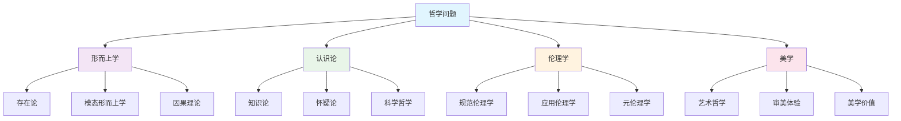
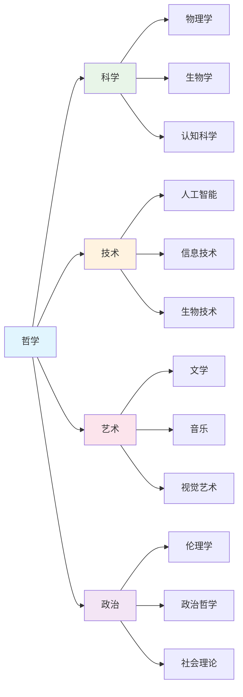
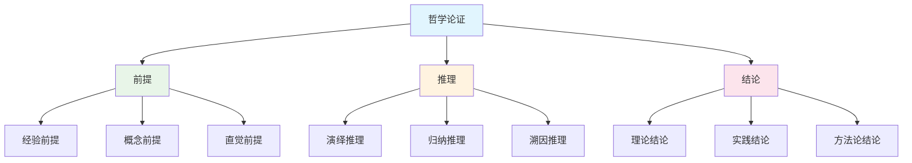

# 3.x 其他哲学主题

[返回上级](../3-哲学与科学原理.md)

## 目录

- [3.x 其他哲学主题](#3x-其他哲学主题)
  - [目录](#目录)
  - [3.x.1 科学哲学与技术哲学](#3x1-科学哲学与技术哲学)
  - [3.x.2 语言哲学与分析哲学](#3x2-语言哲学与分析哲学)
  - [3.x.3 心灵哲学与认知科学哲学](#3x3-心灵哲学与认知科学哲学)
  - [3.x.4 形而上学的现代发展](#3x4-形而上学的现代发展)
  - [3.x.5 AI哲学与计算哲学](#3x5-ai哲学与计算哲学)
  - [3.x.6 信息哲学与数字存在论](#3x6-信息哲学与数字存在论)
  - [3.x.7 应用伦理学的前沿发展](#3x7-应用伦理学的前沿发展)
  - [3.x.8 哲学的形式化方法](#3x8-哲学的形式化方法)
  - [3.x.9 跨学科哲学整合](#3x9-跨学科哲学整合)
  - [3.x.10 图表与多表征](#3x10-图表与多表征)
  - [3.x.11 相关性与交叉引用](#3x11-相关性与交叉引用)
  - [3.x.12 参考文献与延伸阅读](#3x12-参考文献与延伸阅读)

---

## 3.x.1 科学哲学与技术哲学

### 科学实在论与反实在论的现代争论

科学哲学的核心问题之一是科学理论的实在性地位。现代科学实在论与反实在论的争论具有重要的哲学和实践意义：

```lean
-- 科学实在论的形式化表述
structure ScientificRealism where
  unobservable_entities_exist : ∀ (entity : TheoreticalEntity), 
    scientifically_postulated entity → exists_independently entity
  theories_approximately_true : ∀ (theory : ScientificTheory),
    empirically_successful theory → approximately_true theory
  scientific_progress : ∀ (t₁ t₂ : ScientificTheory),
    t₂.succeeds t₁ → t₂.closer_to_truth t₁

-- 反实在论的构造经验论立场
structure ConstructiveEmpiricism where
  empirical_adequacy_suffices : ∀ (theory : ScientificTheory),
    empirically_adequate theory → no_truth_commitment_needed theory
  observable_distinction : distinguishable Observable UnobservableEntity
  agnostic_about_unobservables : ∀ (entity : UnobservableEntity),
    no_commitment (exists entity)

-- 科学实在论的论证
theorem no_miracle_argument :
  ∀ (theory : ScientificTheory),
  empirically_successful theory ∧ 
  ¬approximately_true theory →
  miracle (empirical_success theory) := by
  sorry

-- 悲观归纳论证
theorem pessimistic_induction :
  ∀ (current_theory : ScientificTheory),
  historical_precedent current_theory →
  probably_false current_theory := by
  sorry

-- 选择性实在论
structure SelectiveRealism where
  core_commitments : Set TheoreticalEntity
  peripheral_commitments : Set TheoreticalEntity
  stability_criterion : TheoreticalEntity → StabilityMeasure
  selective_justification : ∀ (entity : TheoreticalEntity),
    entity ∈ core_commitments ↔ 
    high_stability entity ∧ essential_for_success entity
```

### 库恩的科学革命理论

```lean
-- 范式概念的形式化
structure Paradigm where
  exemplars : Set ExemplarySolutions
  symbolic_generalizations : Set LawStatements  
  metaphysical_commitments : Set OntologicalBeliefs
  values : Set EpistemicValues
  
-- 科学革命的结构
inductive ScientificRevolution where
  | normal_science : Paradigm → Period → ScientificRevolution
  | crisis : Paradigm → Set Anomaly → ScientificRevolution  
  | revolution : Paradigm → Paradigm → IncommensurabilityRelation → ScientificRevolution
  | new_normal : Paradigm → ScientificRevolution

-- 范式不可通约性
def incommensurable (p₁ p₂ : Paradigm) : Prop :=
  ¬∃ (neutral_language : Language), 
    translatable p₁.language neutral_language ∧ 
    translatable p₂.language neutral_language

-- 科学革命的动力学
structure RevolutionDynamics where
  anomaly_accumulation : Paradigm → Nat → Float
  crisis_threshold : Float
  revolution_trigger : Float → Bool
  paradigm_shift_probability : Float → Float

-- 科学进步的测量
def scientific_progress_measure (p₁ p₂ : Paradigm) : ProgressScore :=
  let empirical_improvement := empirical_success p₂ - empirical_success p₁
  let theoretical_coherence := coherence_score p₂ - coherence_score p₁
  let explanatory_power := explanatory_power p₂ - explanatory_power p₁
  weighted_sum [empirical_improvement, theoretical_coherence, explanatory_power]
```

### 技术哲学的伦理维度

```lean
-- 技术中立性论题
def technology_neutrality_thesis : Prop :=
  ∀ (technology : Technology),
  ∀ (use_context : UseContext),
  morally_neutral technology ∧
  moral_value_depends_on use_context

-- 技术决定论
structure TechnologicalDeterminism where
  technology_drives_social_change : ∀ (tech : Technology),
    social_impact tech → social_structure_changes tech
  autonomous_development : ∀ (tech : Technology),
    development_path tech → independent_of_social_factors tech
  inevitability : ∀ (tech : Technology),
    technically_possible tech → eventually_developed tech

-- 技术的社会建构
structure SocialConstructionOfTechnology where
  social_factors_shape_technology : ∀ (tech : Technology),
    social_context tech → design_choices tech
  interpretive_flexibility : ∀ (tech : Technology),
    multiple_interpretations tech → multiple_designs tech
  closure_mechanisms : ∀ (tech : Technology),
    stabilization_process tech → dominant_design tech
```

## 3.x.2 语言哲学与分析哲学

### 意义理论的发展

```lean
-- 指称理论的形式化
structure ReferenceTheory where
  reference_relation : Expression → Entity
  causal_chain : Expression → List CausalEvent
  historical_grounding : Expression → GroundingEvent

-- 描述理论
structure DescriptionTheory where
  meaning_as_description : ∀ (expression : Expression),
    meaning expression = associated_description expression
  definite_descriptions : ∀ (expression : Expression),
    expression.type = DefiniteDescription →
    reference expression = unique_satisfier (associated_description expression)

-- 直接指称理论
structure DirectReferenceTheory where
  rigid_designation : ∀ (expression : Expression),
    rigid_designator expression →
    ∀ (world : PossibleWorld), reference expression world = reference expression actual_world
  kripke_style_rigidity : ∀ (name : ProperName),
    rigid_designator name ∧
    reference_fixed_by_baptism name

-- 意义的使用理论
structure UseTheory where
  meaning_as_use : ∀ (expression : Expression),
    meaning expression = use_pattern expression
  language_game : ∀ (expression : Expression),
    use_pattern expression → language_game expression
  family_resemblance : ∀ (concept : Concept),
    concept_members concept → family_resemblance_relation concept
```

### 语言游戏与生活形式

```lean
-- 语言游戏的形式化
structure LanguageGame where
  participants : Set Speaker
  rules : Set Rule
  moves : Set Move
  goals : Set Goal
  context : LifeForm

-- 生活形式
structure LifeForm where
  practices : Set Practice
  institutions : Set Institution
  values : Set Value
  world_picture : Set Belief
  language_games : Set LanguageGame

-- 私人语言论证
theorem private_language_impossibility :
  ∀ (language : Language),
  private language → ¬rule_following language := by
  sorry

-- 规则遵循悖论
def rule_following_paradox : Prop :=
  ∀ (rule : Rule),
  ∀ (application : RuleApplication),
  infinite_regress rule application ∨
  arbitrary_interpretation rule application
```

## 3.x.3 心灵哲学与认知科学哲学

### 心身问题的现代形式

```lean
-- 物理主义的形式化
structure Physicalism where
  all_mental_states_physical : ∀ (mental_state : MentalState),
    ∃ (physical_state : PhysicalState), 
    mental_state = physical_state
  supervenience : ∀ (mental_state : MentalState),
    ∀ (physical_state : PhysicalState),
    mental_state = physical_state →
    ∀ (world : PossibleWorld),
    physical_state world → mental_state world

-- 功能主义
structure Functionalism where
  mental_states_as_functional_roles : ∀ (mental_state : MentalState),
    functional_role mental_state
  multiple_realizability : ∀ (mental_state : MentalState),
    ∀ (realizer : PhysicalRealizer),
    can_realize mental_state realizer
  causal_relations : ∀ (mental_state : MentalState),
    causal_profile mental_state

-- 属性二元论
structure PropertyDualism where
  mental_properties_distinct : ∀ (mental_prop : MentalProperty),
    ∀ (physical_prop : PhysicalProperty),
    mental_prop ≠ physical_prop
  mental_properties_emergent : ∀ (mental_prop : MentalProperty),
    emergent_from physical_properties mental_prop
  interaction_problem : ∀ (mental_prop : MentalProperty),
    ∀ (physical_prop : PhysicalProperty),
    causal_interaction mental_prop physical_prop
```

### 意识的困难问题

```lean
-- 意识的现象性
structure PhenomenalConsciousness where
  what_it_is_like : ∀ (experience : Experience),
    phenomenal_character experience
  qualia : ∀ (experience : Experience),
    qualitative_properties experience
  subjective_character : ∀ (experience : Experience),
    first_person_perspective experience

-- 解释鸿沟
def explanatory_gap : Prop :=
  ∀ (physical_explanation : PhysicalExplanation),
  ∀ (consciousness_explanation : ConsciousnessExplanation),
  ¬bridgeable physical_explanation consciousness_explanation

-- 僵尸论证
def philosophical_zombie : Prop :=
  ∃ (being : Being),
  physically_identical_to_humans being ∧
  ¬conscious being

-- 知识论证
theorem knowledge_argument :
  ∀ (scientist : Scientist),
  ∀ (physical_knowledge : PhysicalKnowledge),
  complete_physical_knowledge scientist physical_knowledge →
  ¬knows_what_it_is_like scientist red_experience := by
  sorry
```

### 具身认知理论

```lean
-- 具身认知的核心主张
structure EmbodiedCognition where
  body_shapes_mind : ∀ (cognitive_process : CognitiveProcess),
    bodily_constraints cognitive_process
  environment_coupling : ∀ (cognitive_process : CognitiveProcess),
    environmental_scaffolding cognitive_process
  action_orientation : ∀ (cognitive_process : CognitiveProcess),
    action_guided cognitive_process

-- 延展心智
structure ExtendedMind where
  cognitive_extension : ∀ (cognitive_process : CognitiveProcess),
    ∃ (external_resource : ExternalResource),
    constitutive_part cognitive_process external_resource
  parity_principle : ∀ (cognitive_process : CognitiveProcess),
    ∀ (internal_resource : InternalResource),
    ∀ (external_resource : ExternalResource),
    functional_parity internal_resource external_resource →
    constitutive_part cognitive_process external_resource

-- 4E认知
structure FourECognition where
  embodied : ∀ (cognitive_process : CognitiveProcess),
    bodily_constrained cognitive_process
  embedded : ∀ (cognitive_process : CognitiveProcess),
    environmentally_scaffolded cognitive_process
  extended : ∀ (cognitive_process : CognitiveProcess),
    externally_constituted cognitive_process
  enactive : ∀ (cognitive_process : CognitiveProcess),
    action_based cognitive_process
```

## 3.x.4 形而上学的现代发展

### 模态形而上学

```lean
-- 可能世界的形式化
structure PossibleWorld where
  world_id : WorldID
  propositions : Set Proposition
  accessibility_relation : WorldID → Set WorldID
  actuality : Bool

-- 模态算子的语义
def necessity (φ : Proposition) (w : PossibleWorld) : Prop :=
  ∀ (w' : PossibleWorld),
  accessible_from w w' → φ w'

def possibility (φ : Proposition) (w : PossibleWorld) : Prop :=
  ∃ (w' : PossibleWorld),
  accessible_from w w' ∧ φ w'

-- 本质主义
structure Essentialism where
  essential_properties : ∀ (object : Object),
    Set Property
  accidental_properties : ∀ (object : Object),
    Set Property
  essential_identity : ∀ (object : Object),
    ∀ (property : Property),
    property ∈ essential_properties object →
    ∀ (world : PossibleWorld),
    exists_in object world → property object world

-- 跨世界同一性
def transworld_identity (object : Object) (w₁ w₂ : PossibleWorld) : Prop :=
  same_object object w₁ object w₂
```

### 因果理论

```lean
-- 因果关系的反事实分析
structure CounterfactualTheory where
  cause_necessity : ∀ (cause : Event),
    ∀ (effect : Event),
    causes cause effect →
    ¬cause cause → ¬effect effect
  cause_sufficiency : ∀ (cause : Event),
    ∀ (effect : Event),
    causes cause effect →
    cause cause → effect effect

-- 因果过程理论
structure ProcessTheory where
  causal_process : ∀ (cause : Event),
    ∀ (effect : Event),
    causes cause effect →
    ∃ (process : CausalProcess),
    connects cause effect process
  mark_transmission : ∀ (process : CausalProcess),
    ∀ (mark : Mark),
    can_transmit process mark

-- 因果网络
structure CausalNetwork where
  nodes : Set Event
  edges : Set CausalRelation
  paths : Set CausalPath
  interventions : Set Intervention
```

## 3.x.5 AI哲学与计算哲学

### 强人工智能与弱人工智能

```lean
-- 强AI的定义
structure StrongAI where
  general_intelligence : ∀ (task : Task),
    can_perform task
  consciousness : ∀ (ai_system : AISystem),
    conscious ai_system
  understanding : ∀ (ai_system : AISystem),
    ∀ (concept : Concept),
    understands ai_system concept

-- 弱AI的定义
structure WeakAI where
  specialized_intelligence : ∀ (task : Task),
    task ∈ specialized_domain → can_perform task
  no_consciousness : ∀ (ai_system : AISystem),
    ¬conscious ai_system
  simulation : ∀ (ai_system : AISystem),
    simulates_intelligence ai_system

-- 图灵测试的形式化
structure TuringTest where
  interrogator : Human
  test_subject : TestSubject
  conversation : List Message
  judgment : HumanJudgment
  passing_criterion : HumanJudgment → Bool

-- 中文房间论证
def chinese_room_argument : Prop :=
  ∀ (system : System),
  passes_turing_test system ∧
  ¬understands_chinese system
```

### 机器意识问题

```lean
-- 机器意识的可能性
structure MachineConsciousness where
  computational_basis : ∀ (consciousness : Consciousness),
    computational_process consciousness
  substrate_independence : ∀ (consciousness : Consciousness),
    ∀ (substrate : Substrate),
    can_implement consciousness substrate
  complexity_threshold : ∀ (system : System),
    complexity system ≥ consciousness_threshold →
    conscious system

-- 意识的计算理论
structure ComputationalTheoryOfConsciousness where
  information_integration : ∀ (consciousness : Consciousness),
    integrated_information consciousness
  global_workspace : ∀ (consciousness : Consciousness),
    global_workspace_architecture consciousness
  recurrent_processing : ∀ (consciousness : Consciousness),
    recurrent_neural_processing consciousness
```

### 算法偏见与公平性

```lean
-- 算法偏见的定义
structure AlgorithmicBias where
  protected_attribute : Set Attribute
  unfair_treatment : ∀ (group : Group),
    ∀ (attribute : Attribute),
    attribute ∈ protected_attribute →
    group.characterized_by attribute →
    unfair_outcome group
  bias_measurement : ∀ (algorithm : Algorithm),
    bias_score algorithm

-- 公平性度量
structure FairnessMetrics where
  demographic_parity : ∀ (algorithm : Algorithm),
    ∀ (group₁ group₂ : Group),
    positive_rate algorithm group₁ = positive_rate algorithm group₂
  equalized_odds : ∀ (algorithm : Algorithm),
    ∀ (group₁ group₂ : Group),
    true_positive_rate algorithm group₁ = true_positive_rate algorithm group₂ ∧
    false_positive_rate algorithm group₁ = false_positive_rate algorithm group₂
  individual_fairness : ∀ (algorithm : Algorithm),
    ∀ (individual₁ individual₂ : Individual),
    similar_individuals individual₁ individual₂ →
    similar_outcomes algorithm individual₁ individual₂
```

## 3.x.6 信息哲学与数字存在论

### 信息作为基础实在

```lean
-- 信息本体论
structure InformationOntology where
  information_as_primitive : ∀ (entity : Entity),
    information_entity entity
  physical_information : ∀ (physical_entity : PhysicalEntity),
    information_content physical_entity
  mental_information : ∀ (mental_entity : MentalEntity),
    information_content mental_entity

-- 信息因果性
structure InformationCausality where
  information_transmission : ∀ (cause : Event),
    ∀ (effect : Event),
    causes cause effect →
    information_flows cause effect
  causal_relevance : ∀ (information : Information),
    ∀ (effect : Event),
    causally_relevant information effect
```

### 数字存在的本体论地位

```lean
-- 数字对象的存在
structure DigitalExistence where
  virtual_objects : Set VirtualObject
  digital_identity : ∀ (object : VirtualObject),
    digital_identity object
  persistence_conditions : ∀ (object : VirtualObject),
    persistence_conditions object

-- 虚拟现实的本体论
structure VirtualRealityOntology where
  virtual_worlds : Set VirtualWorld
  virtual_objects : ∀ (world : VirtualWorld),
    Set VirtualObject
  virtual_experience : ∀ (experience : Experience),
    virtual experience ↔ ∃ (world : VirtualWorld),
    experience_in_world experience world
```

## 3.x.7 应用伦理学的前沿发展

### 生物伦理学的新挑战

```lean
-- 基因编辑伦理
structure GeneEditingEthics where
  human_enhancement : ∀ (enhancement : Enhancement),
    ethical_considerations enhancement
  germline_modification : ∀ (modification : GermlineModification),
    ethical_implications modification
  informed_consent : ∀ (intervention : Intervention),
    requires_consent intervention

-- 人工智能伦理
structure AIEthics where
  autonomous_weapons : ∀ (weapon : Weapon),
    autonomous weapon → ethical_concerns weapon
  privacy_protection : ∀ (ai_system : AISystem),
    privacy_requirements ai_system
  accountability : ∀ (ai_system : AISystem),
    accountable_for ai_system
```

### 环境伦理学与可持续发展

```lean
-- 环境价值
structure EnvironmentalValue where
  intrinsic_value : ∀ (entity : EnvironmentalEntity),
    intrinsic_value entity
  instrumental_value : ∀ (entity : EnvironmentalEntity),
    instrumental_value entity
  future_generations : ∀ (action : Action),
    impact_on_future_generations action

-- 可持续发展原则
structure SustainabilityPrinciples where
  intergenerational_equity : ∀ (generation : Generation),
    equal_rights generation
  ecological_integrity : ∀ (ecosystem : Ecosystem),
    maintain_integrity ecosystem
  social_justice : ∀ (society : Society),
    just_distribution society
```

## 3.x.8 哲学的形式化方法

### 形式化哲学分析

```lean
-- 哲学论证的形式化
structure PhilosophicalArgument where
  premises : List Proposition
  conclusion : Proposition
  logical_form : LogicalForm
  validity : Bool
  soundness : Bool

-- 哲学理论的形式化
structure PhilosophicalTheory where
  axioms : Set Axiom
  definitions : Set Definition
  theorems : Set Theorem
  consistency : Prop
  completeness : Prop

-- 哲学方法论
inductive PhilosophicalMethod where
  | conceptual_analysis : PhilosophicalMethod
  | thought_experiment : PhilosophicalMethod
  | reflective_equilibrium : PhilosophicalMethod
  | transcendental_argument : PhilosophicalMethod
  | phenomenological_method : PhilosophicalMethod
```

### 哲学逻辑系统

```lean
-- 模态逻辑
structure ModalLogic where
  necessity_operator : Proposition → Proposition
  possibility_operator : Proposition → Proposition
  accessibility_relation : World → Set World
  validity_conditions : Set ValidityCondition

-- 时态逻辑
structure TemporalLogic where
  past_operator : Proposition → Proposition
  future_operator : Proposition → Proposition
  always_operator : Proposition → Proposition
  eventually_operator : Proposition → Proposition
  temporal_ordering : Time → Time → Prop
```

## 3.x.9 跨学科哲学整合

### 哲学与科学的交叉

```lean
-- 科学哲学整合
structure PhilosophyOfScience where
  scientific_methodology : ScientificMethod → PhilosophicalAnalysis
  theory_evaluation : ScientificTheory → EpistemicEvaluation
  scientific_explanation : ScientificExplanation → PhilosophicalUnderstanding

-- 认知科学哲学
structure PhilosophyOfCognitiveScience where
  consciousness_theories : ConsciousnessTheory → PhilosophicalAssessment
  cognitive_architecture : CognitiveArchitecture → PhilosophicalImplications
  artificial_intelligence : AITheory → PhilosophicalQuestions
```

### 哲学与技术的融合

```lean
-- 技术哲学
structure PhilosophyOfTechnology where
  technological_determinism : Technology → SocialImpact
  social_construction : Technology → SocialFactors
  ethical_implications : Technology → EthicalConsiderations

-- 信息哲学
structure PhilosophyOfInformation where
  information_ontology : Information → OntologicalStatus
  digital_ethics : DigitalTechnology → EthicalPrinciples
  virtual_reality : VirtualWorld → RealityStatus
```

## 3.x.10 图表与多表征

### 哲学问题的层次结构



### 跨学科哲学网络



### 哲学论证的形式结构



## 3.x.11 相关性与交叉引用

### 理论基础联系

- **3.1-哲学内容全景分析**: 哲学体系的整体框架
- **3.2-哲学与形式化推理**: 哲学推理的形式化方法

### 跨学科交叉引用

- **1-形式化理论**: 哲学的形式化基础
- **2-数学基础与应用**: 数学的哲学基础
- **6-编程语言与实现**: 计算哲学的应用

### 方法论联系

- **7-验证与工程实践**: 哲学在工程中的应用
- **4-行业领域分析**: 应用伦理学的前沿

## 3.x.12 参考文献与延伸阅读

### 科学哲学

1. **Kuhn, T.S.** (1962). *The Structure of Scientific Revolutions*. University of Chicago Press.
2. **Popper, K.R.** (1959). *The Logic of Scientific Discovery*. Hutchinson.
3. **Feyerabend, P.** (1975). *Against Method*. Verso.
4. **van Fraassen, B.C.** (1980). *The Scientific Image*. Oxford University Press.
5. **Hacking, I.** (1983). *Representing and Intervening*. Cambridge University Press.

### 语言哲学

1. **Wittgenstein, L.** (1953). *Philosophical Investigations*. Blackwell.
2. **Austin, J.L.** (1962). *How to Do Things with Words*. Oxford University Press.
3. **Searle, J.R.** (1969). *Speech Acts*. Cambridge University Press.
4. **Kripke, S.A.** (1980). *Naming and Necessity*. Harvard University Press.
5. **Putnam, H.** (1975). *Mind, Language and Reality*. Cambridge University Press.

### 心灵哲学

1. **Chalmers, D.J.** (1996). *The Conscious Mind*. Oxford University Press.
2. **Dennett, D.C.** (1991). *Consciousness Explained*. Little, Brown.
3. **Searle, J.R.** (1992). *The Rediscovery of the Mind*. MIT Press.
4. **Clark, A.** (2008). *Supersizing the Mind*. Oxford University Press.
5. **Noë, A.** (2004). *Action in Perception*. MIT Press.

### AI哲学

1. **Bostrom, N.** (2014). *Superintelligence*. Oxford University Press.
2. **Russell, S.** (2019). *Human Compatible*. Viking.
3. **Floridi, L.** (2013). *The Ethics of Information*. Oxford University Press.
4. **Boden, M.A.** (2016). *AI: Its Nature and Future*. Oxford University Press.
5. **Dreyfus, H.L.** (1972). *What Computers Can't Do*. MIT Press.

### 应用伦理学

1. **Singer, P.** (1975). *Animal Liberation*. HarperCollins.
2. **Regan, T.** (1983). *The Case for Animal Rights*. University of California Press.
3. **Nussbaum, M.C.** (2006). *Frontiers of Justice*. Harvard University Press.
4. **Floridi, L.** (2010). *Information Ethics*. Oxford University Press.
5. **Bostrom, N.** (2008). *Global Catastrophic Risks*. Oxford University Press.

### 在线资源

- **Stanford Encyclopedia of Philosophy**: https://plato.stanford.edu/
- **Internet Encyclopedia of Philosophy**: https://iep.utm.edu/
- **PhilPapers**: https://philpapers.org/
- **Philosophy Now**: https://philosophynow.org/
- **Philosophy Compass**: https://onlinelibrary.wiley.com/journal/17479991

---

*本文档是Lean形式化知识系统中哲学与科学原理的重要组成部分，涵盖了从古典哲学到现代前沿理论的完整体系。*
