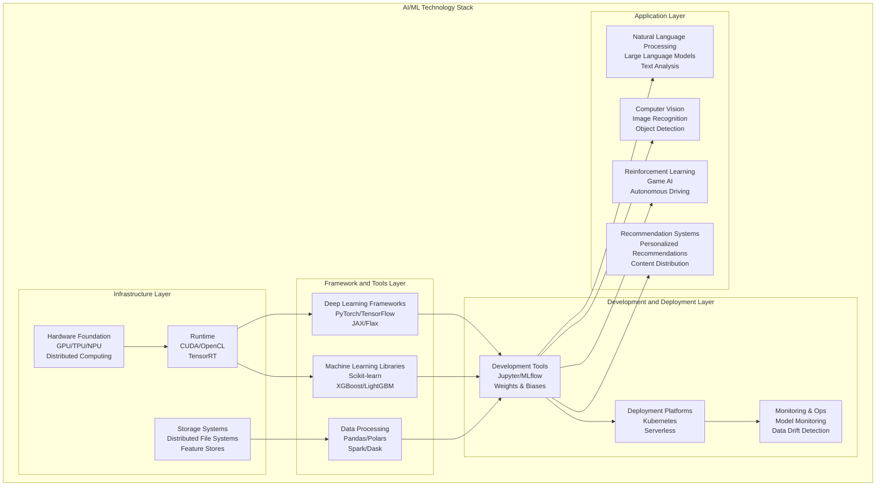
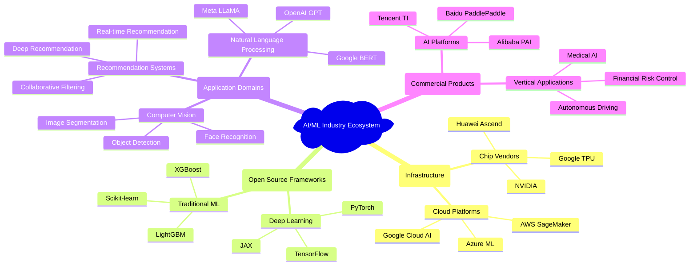
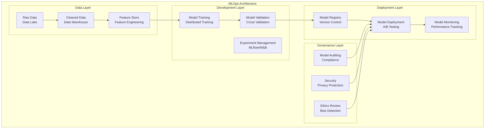

# 4.1 Artificial Intelligence and Machine Learning

[Back to Parent](../4-industry-domains-analysis.md) | [中文版](../4-行业领域分析/4.1-人工智能与机器学习.md)

## Table of Contents

- [4.1 Artificial Intelligence and Machine Learning](#41-artificial-intelligence-and-machine-learning)
  - [Table of Contents](#table-of-contents)
  - [4.1.1 AI/ML Domain Panoramic Analysis](#411-aiml-domain-panoramic-analysis)
    - [4.1.1.1 Technology System Architecture](#4111-technology-system-architecture)
    - [4.1.1.2 Core Technology Branches](#4112-core-technology-branches)
    - [4.1.1.3 Industry Ecosystem Map](#4113-industry-ecosystem-map)
  - [4.1.2 AI/ML System Architecture Design](#412-aiml-system-architecture-design)
    - [4.1.2.1 Machine Learning Engineering Architecture](#4121-machine-learning-engineering-architecture)
    - [4.1.2.2 Data Processing Pipeline](#4122-data-processing-pipeline)
    - [4.1.2.3 Model Development and Deployment](#4123-model-development-and-deployment)
  - [4.1.3 Core Business Modeling](#413-core-business-modeling)
    - [4.1.3.1 Dataset Management](#4131-dataset-management)
    - [4.1.3.2 Feature Engineering](#4132-feature-engineering)
    - [4.1.3.3 Model Lifecycle](#4133-model-lifecycle)
  - [4.1.4 Technology Stack and Engineering Practices](#414-technology-stack-and-engineering-practices)
    - [4.1.4.1 Rust Applications in AI/ML](#4141-rust-applications-in-aiml)
    - [4.1.4.2 MLOps Engineering Practices](#4142-mlops-engineering-practices)
    - [4.1.4.3 Performance Optimization Strategies](#4143-performance-optimization-strategies)
  - [4.1.5 Cutting-edge Development Trends](#415-cutting-edge-development-trends)
    - [4.1.5.1 Large Language Models](#4151-large-language-models)
    - [4.1.5.2 Federated Learning](#4152-federated-learning)
    - [4.1.5.3 AutoML and Neural Architecture Search](#4153-automl-and-neural-architecture-search)
  - [4.1.6 Formal Verification and AI Safety](#416-formal-verification-and-ai-safety)
    - [4.1.6.1 Model Interpretability](#4161-model-interpretability)
    - [4.1.6.2 Adversarial Attack Defense](#4162-adversarial-attack-defense)
    - [4.1.6.3 AI Ethics and Fairness](#4163-ai-ethics-and-fairness)
  - [4.1.7 References and Further Reading](#417-references-and-further-reading)
    - [Core References](#core-references)
    - [Advanced Topics](#advanced-topics)
    - [Research Directions](#research-directions)
    - [4.1.2.2 Data Processing Pipeline1](#4122-data-processing-pipeline1)

---

## 4.1.1 AI/ML Domain Panoramic Analysis

### 4.1.1.1 Technology System Architecture



### 4.1.1.2 Core Technology Branches

**1. Machine Learning Fundamental Algorithms**:

$$\text{Supervised Learning: } f: X \rightarrow Y, \text{ where } (x_i, y_i) \sim P(X,Y)$$

$$\text{Loss Function: } L(f) = \mathbb{E}_{(x,y) \sim P}[\ell(f(x), y)]$$

```lean
-- Lean formalization: Basic machine learning definitions
structure LearningProblem (X Y : Type*) :=
  (training_data : List (X × Y))
  (hypothesis_space : Set (X → Y))
  (loss_function : (X → Y) → (X × Y) → ℝ)
  
def empirical_risk {X Y : Type*} (problem : LearningProblem X Y) 
    (h : X → Y) : ℝ :=
  (problem.training_data.map (problem.loss_function h)).sum / problem.training_data.length
```

**2. Deep Learning Architectures**:

$$\text{Feedforward Network: } y = f_L(\sigma(W_L f_{L-1}(...\sigma(W_1 x + b_1)...) + b_L))$$

$$\text{Backpropagation: } \frac{\partial L}{\partial W_i} = \frac{\partial L}{\partial z_{i+1}} \frac{\partial z_{i+1}}{\partial W_i}$$

```rust
// Rust implementation: Neural network basic structure
pub struct NeuralNetwork {
    layers: Vec<Layer>,
    weights: Vec<Matrix<f32>>,
    biases: Vec<Vector<f32>>,
    activation_functions: Vec<ActivationFunction>,
}

impl NeuralNetwork {
    pub fn forward(&self, input: &Vector<f32>) -> Vector<f32> {
        let mut current_output = input.clone();
        
        for (i, layer) in self.layers.iter().enumerate() {
            current_output = layer.forward(&current_output, 
                                         &self.weights[i], 
                                         &self.biases[i]);
            current_output = self.activation_functions[i].apply(&current_output);
        }
        
        current_output
    }
    
    pub fn backward(&mut self, target: &Vector<f32>, learning_rate: f32) {
        // Implement backpropagation algorithm
        let mut gradient = self.compute_output_gradient(target);
        
        for i in (0..self.layers.len()).rev() {
            let layer_gradient = self.layers[i].backward(&gradient);
            self.update_weights(i, &layer_gradient, learning_rate);
            gradient = layer_gradient;
        }
    }
}
```

### 4.1.1.3 Industry Ecosystem Map



## 4.1.2 AI/ML System Architecture Design

### 4.1.2.1 Machine Learning Engineering Architecture

```mermaid
graph TB
    subgraph "MLOps Architecture"
        subgraph "Data Layer"
            RAW["Raw Data<br/>Data Lake"]
            CLEAN["Cleaned Data<br/>Data Warehouse"]
            FEATURE["Feature Store<br/>Feature Store"]
        end
        
        subgraph "Development Layer"
            EXP["Experiment Management<br/>MLflow/W&B"]
            TRAIN["Model Training<br/>Distributed Training"]
            VAL["Model Validation<br/>Cross Validation"]
        end
        
        subgraph "Deployment Layer"
            DEPLOY["Model Deployment<br/>Kubernetes"]
            MONITOR["Model Monitoring<br/>Performance Tracking"]
            RETRAIN["Model Retraining<br/>Automated Pipelines"]
        end
    end
    
    RAW --> CLEAN
    CLEAN --> FEATURE
    FEATURE --> EXP
    EXP --> TRAIN
    TRAIN --> VAL
    VAL --> DEPLOY
    DEPLOY --> MONITOR
    MONITOR --> RETRAIN
```



### 4.1.2.2 Data Processing Pipeline

```rust
// Rust implementation: Data processing pipeline
use tokio::sync::mpsc;
use serde::{Deserialize, Serialize};

#[derive(Debug, Clone, Serialize, Deserialize)]
pub struct DataPipeline {
    stages: Vec<ProcessingStage>,
    data_sources: Vec<DataSource>,
    sinks: Vec<DataSink>,
}

#[derive(Debug, Clone)]
pub enum ProcessingStage {
    DataIngestion(IngestionConfig),
    DataCleaning(CleaningConfig),
    FeatureExtraction(FeatureConfig),
    DataValidation(ValidationConfig),
}

impl DataPipeline {
    pub async fn process(&self, data: RawData) -> Result<ProcessedData, PipelineError> {
        let mut current_data = data;
        
        for stage in &self.stages {
            current_data = stage.process(current_data).await?;
        }
        
        Ok(current_data)
    }
    
    pub async fn run_streaming(&self) -> Result<(), PipelineError> {
        let (tx, rx) = mpsc::channel(1000);
        
        // Start data ingestion
        let ingestion_handle = tokio::spawn(self.run_ingestion(tx));
        
        // Start processing stages
        let processing_handle = tokio::spawn(self.run_processing(rx));
        
        // Wait for completion
        ingestion_handle.await??;
        processing_handle.await??;
        
        Ok(())
    }
}

// Feature engineering implementation
#[derive(Debug, Clone)]
pub struct FeatureEngine {
    feature_extractors: Vec<FeatureExtractor>,
    feature_selectors: Vec<FeatureSelector>,
    feature_scalers: Vec<FeatureScaler>,
}

impl FeatureEngine {
    pub fn extract_features(&self, data: &RawData) -> FeatureSet {
        let mut features = FeatureSet::new();
        
        for extractor in &self.feature_extractors {
            let extracted = extractor.extract(data);
            features.merge(extracted);
        }
        
        features
    }
    
    pub fn select_features(&self, features: &FeatureSet, target: &Target) -> FeatureSet {
        let mut selected = FeatureSet::new();
        
        for selector in &self.feature_selectors {
            let selection = selector.select(features, target);
            selected.merge(selection);
        }
        
        selected
    }
    
    pub fn scale_features(&self, features: &FeatureSet) -> ScaledFeatureSet {
        let mut scaled = ScaledFeatureSet::new();
        
        for scaler in &self.feature_scalers {
            let scaled_features = scaler.scale(features);
            scaled.merge(scaled_features);
        }
        
        scaled
    }
}
```

### 4.1.2.3 Model Development and Deployment

```lean
-- Lean formalization: Model development lifecycle
structure ModelLifecycle :=
  (data_preparation : DataPreparation)
  (feature_engineering : FeatureEngineering)
  (model_training : ModelTraining)
  (model_evaluation : ModelEvaluation)
  (model_deployment : ModelDeployment)
  (model_monitoring : ModelMonitoring)

-- Model training formalization
def train_model (data : TrainingData) (config : TrainingConfig) : TrainedModel :=
  let features = extract_features data
  let model = initialize_model config
  let trained = optimize_model model features config
  trained

-- Model evaluation
def evaluate_model (model : TrainedModel) (test_data : TestData) : EvaluationMetrics :=
  let predictions = model.predict test_data
  let metrics = compute_metrics predictions test_data.labels
  metrics

-- Model deployment verification
def verify_deployment (model : TrainedModel) (deployment : Deployment) : VerificationResult :=
  if deployment.performance_acceptable model ∧
     deployment.resource_usage_acceptable model ∧
     deployment.security_compliant model then
    VerificationResult.Verified
  else
    VerificationResult.DeploymentViolation
```

## 4.1.3 Core Business Modeling

### 4.1.3.1 Dataset Management

```rust
// Dataset versioning and management
#[derive(Debug, Clone)]
pub struct DatasetManager {
    datasets: HashMap<DatasetId, Dataset>,
    version_control: VersionControl,
    data_lineage: DataLineage,
}

#[derive(Debug, Clone)]
pub struct Dataset {
    id: DatasetId,
    version: Version,
    schema: DataSchema,
    statistics: DatasetStatistics,
    metadata: DatasetMetadata,
}

impl DatasetManager {
    pub fn create_dataset(&mut self, data: RawData, schema: DataSchema) -> DatasetId {
        let dataset = Dataset {
            id: self.generate_id(),
            version: Version::new(1, 0, 0),
            schema,
            statistics: self.compute_statistics(&data),
            metadata: DatasetMetadata::new(),
        };
        
        let id = dataset.id.clone();
        self.datasets.insert(id.clone(), dataset);
        self.version_control.commit_dataset(&id);
        
        id
    }
    
    pub fn update_dataset(&mut self, id: &DatasetId, updates: DataUpdates) -> Result<(), DatasetError> {
        let dataset = self.datasets.get_mut(id)
            .ok_or(DatasetError::NotFound)?;
        
        // Apply updates
        dataset.apply_updates(updates)?;
        dataset.version.increment_minor();
        
        // Update lineage
        self.data_lineage.record_update(id, &dataset.version);
        
        Ok(())
    }
    
    pub fn get_dataset_lineage(&self, id: &DatasetId) -> DataLineage {
        self.data_lineage.get_lineage(id)
    }
}
```

### 4.1.3.2 Feature Engineering

```lean
-- Feature engineering formalization
structure FeatureEngineering :=
  (feature_extraction : FeatureExtraction)
  (feature_selection : FeatureSelection)
  (feature_scaling : FeatureScaling)
  (feature_monitoring : FeatureMonitoring)

-- Feature extraction
def extract_features (data : RawData) (extractors : List FeatureExtractor) : FeatureSet :=
  extractors.foldl (λ features extractor, 
    features.merge (extractor.extract data)) FeatureSet.empty

-- Feature selection using information gain
def select_features (features : FeatureSet) (target : Target) (threshold : ℝ) : FeatureSet :=
  features.filter (λ feature, 
    information_gain feature target ≥ threshold)

-- Feature scaling
def scale_features (features : FeatureSet) (scaler : FeatureScaler) : ScaledFeatureSet :=
  features.map (λ feature, scaler.scale feature)
```

### 4.1.3.3 Model Lifecycle

```rust
// Model lifecycle management
#[derive(Debug, Clone)]
pub struct ModelLifecycleManager {
    models: HashMap<ModelId, Model>,
    experiments: HashMap<ExperimentId, Experiment>,
    deployments: HashMap<DeploymentId, Deployment>,
}

#[derive(Debug, Clone)]
pub struct Model {
    id: ModelId,
    version: Version,
    architecture: ModelArchitecture,
    hyperparameters: Hyperparameters,
    performance_metrics: PerformanceMetrics,
    artifacts: ModelArtifacts,
}

impl ModelLifecycleManager {
    pub fn create_experiment(&mut self, config: ExperimentConfig) -> ExperimentId {
        let experiment = Experiment {
            id: self.generate_experiment_id(),
            config,
            status: ExperimentStatus::Running,
            created_at: Utc::now(),
        };
        
        let id = experiment.id.clone();
        self.experiments.insert(id.clone(), experiment);
        
        id
    }
    
    pub fn train_model(&mut self, experiment_id: &ExperimentId, data: &TrainingData) -> Result<ModelId, TrainingError> {
        let experiment = self.experiments.get_mut(experiment_id)
            .ok_or(TrainingError::ExperimentNotFound)?;
        
        // Train model
        let model = self.train_with_config(&experiment.config, data)?;
        
        // Record experiment results
        experiment.results = Some(ExperimentResults {
            model_id: model.id.clone(),
            metrics: model.performance_metrics.clone(),
            training_time: Utc::now(),
        });
        
        self.models.insert(model.id.clone(), model);
        
        Ok(model.id)
    }
    
    pub fn deploy_model(&mut self, model_id: &ModelId, deployment_config: DeploymentConfig) -> Result<DeploymentId, DeploymentError> {
        let model = self.models.get(model_id)
            .ok_or(DeploymentError::ModelNotFound)?;
        
        // Create deployment
        let deployment = Deployment {
            id: self.generate_deployment_id(),
            model_id: model_id.clone(),
            config: deployment_config,
            status: DeploymentStatus::Deploying,
            created_at: Utc::now(),
        };
        
        let id = deployment.id.clone();
        self.deployments.insert(id.clone(), deployment);
        
        // Deploy to infrastructure
        self.deploy_to_infrastructure(&deployment)?;
        
        Ok(id)
    }
}
```

## 4.1.4 Technology Stack and Engineering Practices

### 4.1.4.1 Rust Applications in AI/ML

```rust
// High-performance ML with Rust
use ndarray::{Array1, Array2};
use rayon::prelude::*;

pub struct RustMLFramework {
    linear_algebra: LinearAlgebraEngine,
    optimization: OptimizationEngine,
    neural_networks: NeuralNetworkEngine,
}

impl RustMLFramework {
    /// Parallel matrix operations
    pub fn parallel_matrix_multiply(&self, a: &Array2<f64>, b: &Array2<f64>) -> Array2<f64> {
        let (m, n) = a.dim();
        let (_, p) = b.dim();
        
        let result: Array2<f64> = (0..m).into_par_iter()
            .map(|i| {
                (0..p).map(|j| {
                    (0..n).map(|k| a[[i, k]] * b[[k, j]]).sum()
                }).collect()
            })
            .collect();
        
        Array2::from_shape_vec((m, p), result).unwrap()
    }
    
    /// GPU acceleration with CUDA
    pub fn gpu_matrix_ops(&self, matrices: Vec<Array2<f32>>) -> Vec<Array2<f32>> {
        // CUDA kernel execution
        matrices.into_par_iter()
            .map(|matrix| self.cuda_operations(matrix))
            .collect()
    }
    
    /// Memory-efficient training
    pub fn train_with_gradient_checkpointing(&self, model: &mut NeuralNetwork, data: &TrainingData) {
        for batch in data.batches() {
            // Forward pass with checkpointing
            let activations = self.forward_with_checkpoints(model, &batch);
            
            // Backward pass
            let gradients = self.backward_with_checkpoints(model, &batch, &activations);
            
            // Update weights
            model.update_weights(&gradients);
        }
    }
}

// MLOps with Rust
#[derive(Debug, Clone)]
pub struct RustMLOps {
    experiment_tracker: ExperimentTracker,
    model_registry: ModelRegistry,
    deployment_manager: DeploymentManager,
    monitoring: MonitoringSystem,
}

impl RustMLOps {
    pub fn track_experiment(&mut self, experiment: Experiment) -> ExperimentId {
        self.experiment_tracker.record(experiment)
    }
    
    pub fn register_model(&mut self, model: Model) -> ModelId {
        self.model_registry.register(model)
    }
    
    pub fn deploy_model(&mut self, model_id: &ModelId, config: DeploymentConfig) -> Result<DeploymentId, DeploymentError> {
        let model = self.model_registry.get_model(model_id)?;
        self.deployment_manager.deploy(model, config)
    }
    
    pub fn monitor_model(&self, deployment_id: &DeploymentId) -> ModelMetrics {
        self.monitoring.get_metrics(deployment_id)
    }
}
```

### 4.1.4.2 MLOps Engineering Practices

```yaml
# MLOps pipeline with GitHub Actions
name: ML Training Pipeline

on:
  push:
    branches: [main]
  pull_request:
    branches: [main]

jobs:
  data-validation:
    runs-on: ubuntu-latest
    steps:
    - uses: actions/checkout@v3
    - name: Validate Data
      run: |
        python scripts/validate_data.py
        python scripts/check_data_drift.py

  model-training:
    needs: data-validation
    runs-on: ubuntu-latest
    steps:
    - uses: actions/checkout@v3
    - name: Train Model
      run: |
        python scripts/train_model.py
        python scripts/evaluate_model.py
    - name: Upload Model
      uses: actions/upload-artifact@v3
      with:
        name: model-artifacts
        path: models/

  model-deployment:
    needs: model-training
    runs-on: ubuntu-latest
    steps:
    - name: Deploy to Staging
      run: |
        kubectl apply -f k8s/staging/
        kubectl rollout status deployment/ml-model-staging
    - name: Run Integration Tests
      run: |
        python tests/integration_test.py
    - name: Deploy to Production
      if: github.ref == 'refs/heads/main'
      run: |
        kubectl apply -f k8s/production/
```

### 4.1.4.3 Performance Optimization Strategies

```rust
// Performance optimization for ML workloads
pub struct OptimizedMLPipeline {
    data_parallel: DataParallelProcessor,
    model_parallel: ModelParallelProcessor,
    memory_manager: MemoryManager,
}

impl OptimizedMLPipeline {
    /// Data parallelism for large datasets
    pub fn process_large_dataset(&self, data: LargeDataset) -> ProcessedData {
        data.chunks(self.optimal_chunk_size())
            .into_par_iter()
            .map(|chunk| self.process_chunk(chunk))
            .reduce(|| ProcessedData::new(), |acc, chunk| acc.merge(chunk))
    }
    
    /// Model parallelism for large models
    pub fn train_large_model(&self, model: LargeModel, data: &TrainingData) -> TrainedModel {
        let model_shards = self.split_model(model);
        
        model_shards.into_par_iter()
            .zip(data.shards())
            .map(|(shard, data_shard)| self.train_shard(shard, data_shard))
            .reduce(|| LargeModel::new(), |acc, shard| acc.merge(shard))
    }
    
    /// Memory optimization with gradient accumulation
    pub fn train_with_gradient_accumulation(&self, model: &mut Model, data: &TrainingData) {
        let accumulation_steps = 4;
        let mut accumulated_gradients = Gradients::zero();
        
        for (i, batch) in data.batches().enumerate() {
            let gradients = self.compute_gradients(model, &batch);
            accumulated_gradients.add(&gradients);
            
            if (i + 1) % accumulation_steps == 0 {
                model.update_weights(&accumulated_gradients);
                accumulated_gradients = Gradients::zero();
            }
        }
    }
}
```

## 4.1.5 Cutting-edge Development Trends

### 4.1.5.1 Large Language Models

```rust
// Large language model implementation
#[derive(Debug, Clone)]
pub struct LargeLanguageModel {
    transformer: TransformerArchitecture,
    tokenizer: Tokenizer,
    generation_config: GenerationConfig,
}

impl LargeLanguageModel {
    pub fn generate_text(&self, prompt: &str, max_length: usize) -> String {
        let tokens = self.tokenizer.encode(prompt);
        let mut generated_tokens = tokens.clone();
        
        for _ in 0..max_length {
            let next_token = self.predict_next_token(&generated_tokens);
            generated_tokens.push(next_token);
            
            if next_token == self.tokenizer.eos_token() {
                break;
            }
        }
        
        self.tokenizer.decode(&generated_tokens)
    }
    
    fn predict_next_token(&self, tokens: &[Token]) -> Token {
        let logits = self.transformer.forward(tokens);
        let probabilities = softmax(&logits);
        
        // Top-k sampling
        let top_k = 50;
        let top_tokens = self.get_top_k_tokens(&probabilities, top_k);
        
        // Sample from top-k
        self.sample_from_tokens(&top_tokens)
    }
    
    /// Few-shot learning
    pub fn few_shot_learning(&self, examples: &[Example], query: &str) -> String {
        let prompt = self.construct_few_shot_prompt(examples, query);
        self.generate_text(&prompt, 100)
    }
    
    /// Chain-of-thought reasoning
    pub fn chain_of_thought(&self, question: &str) -> String {
        let reasoning_prompt = format!("Let's approach this step by step:\nQuestion: {}\n", question);
        self.generate_text(&reasoning_prompt, 200)
    }
}
```

### 4.1.5.2 Federated Learning

```rust
// Federated learning implementation
#[derive(Debug, Clone)]
pub struct FederatedLearningSystem {
    global_model: GlobalModel,
    clients: Vec<FederatedClient>,
    aggregation_strategy: AggregationStrategy,
}

#[derive(Debug, Clone)]
pub struct FederatedClient {
    id: ClientId,
    local_data: LocalDataset,
    local_model: LocalModel,
    privacy_config: PrivacyConfig,
}

impl FederatedLearningSystem {
    pub async fn train_federated(&mut self, rounds: usize) -> Result<(), FederatedError> {
        for round in 0..rounds {
            // Distribute global model to clients
            self.distribute_model_to_clients().await?;
            
            // Train on local data
            let client_updates = self.train_clients_parallel().await?;
            
            // Aggregate updates
            let aggregated_update = self.aggregate_updates(&client_updates)?;
            
            // Update global model
            self.global_model.apply_update(&aggregated_update);
            
            // Evaluate global model
            let metrics = self.evaluate_global_model().await?;
            println!("Round {}: Global accuracy = {:.2}%", round, metrics.accuracy * 100.0);
        }
        
        Ok(())
    }
    
    async fn train_clients_parallel(&self) -> Result<Vec<ModelUpdate>, FederatedError> {
        let client_futures: Vec<_> = self.clients.iter()
            .map(|client| client.train_local())
            .collect();
        
        let updates = futures::future::join_all(client_futures).await;
        updates.into_iter().collect()
    }
    
    fn aggregate_updates(&self, updates: &[ModelUpdate]) -> Result<ModelUpdate, AggregationError> {
        match self.aggregation_strategy {
            AggregationStrategy::FedAvg => self.federated_averaging(updates),
            AggregationStrategy::FedProx => self.federated_proximal(updates),
            AggregationStrategy::FedNova => self.federated_nova(updates),
        }
    }
}
```

### 4.1.5.3 AutoML and Neural Architecture Search

```rust
// Neural architecture search implementation
#[derive(Debug, Clone)]
pub struct NeuralArchitectureSearch {
    search_space: SearchSpace,
    search_algorithm: SearchAlgorithm,
    evaluator: ModelEvaluator,
}

#[derive(Debug, Clone)]
pub struct SearchSpace {
    layer_types: Vec<LayerType>,
    connectivity_patterns: Vec<ConnectivityPattern>,
    hyperparameter_ranges: HyperparameterRanges,
}

impl NeuralArchitectureSearch {
    pub fn search_optimal_architecture(&self, dataset: &Dataset, constraints: &Constraints) -> Architecture {
        let mut population = self.initialize_population();
        
        for generation in 0..self.max_generations {
            // Evaluate architectures
            let evaluations: Vec<_> = population.par_iter()
                .map(|arch| self.evaluate_architecture(arch, dataset))
                .collect();
            
            // Select best architectures
            let best_architectures = self.select_best_architectures(&population, &evaluations);
            
            // Generate new architectures
            population = self.generate_new_architectures(&best_architectures);
            
            println!("Generation {}: Best accuracy = {:.2}%", 
                     generation, 
                     evaluations.iter().map(|e| e.accuracy).max_by(|a, b| a.partial_cmp(b).unwrap()).unwrap() * 100.0);
        }
        
        population.into_iter()
            .max_by_key(|arch| self.evaluate_architecture(arch, dataset).score)
            .unwrap()
    }
    
    fn evaluate_architecture(&self, architecture: &Architecture, dataset: &Dataset) -> Evaluation {
        // Train architecture
        let model = self.build_model(architecture);
        let trained_model = self.train_model(model, dataset);
        
        // Evaluate performance
        let accuracy = self.evaluate_accuracy(&trained_model, dataset);
        let latency = self.evaluate_latency(&trained_model);
        let memory_usage = self.evaluate_memory_usage(&trained_model);
        
        Evaluation {
            accuracy,
            latency,
            memory_usage,
            score: self.compute_score(accuracy, latency, memory_usage),
        }
    }
}
```

## 4.1.6 Formal Verification and AI Safety

### 4.1.6.1 Model Interpretability

```lean
-- Formal specification of model interpretability
def model_interpretability (model : TrainedModel) (data : TestData) : InterpretabilityReport :=
  { feature_importance := compute_feature_importance model data
    decision_paths := extract_decision_paths model data
    counterfactuals := generate_counterfactuals model data
    local_explanations := compute_local_explanations model data }

-- Feature importance analysis
def compute_feature_importance (model : TrainedModel) (data : TestData) : FeatureImportance :=
  let perturbations = generate_feature_perturbations data
  let importance_scores = perturbations.map (λ pert, 
    model.performance_change pert)
  importance_scores

-- Counterfactual generation
def generate_counterfactuals (model : TrainedModel) (data : TestData) : List Counterfactual :=
  data.samples.map (λ sample, 
    find_nearest_decision_boundary model sample)
```

### 4.1.6.2 Adversarial Attack Defense

```rust
// Adversarial training and defense
#[derive(Debug, Clone)]
pub struct AdversarialDefense {
    training_method: AdversarialTraining,
    detection_method: AdversarialDetection,
    defense_method: AdversarialDefense,
}

impl AdversarialDefense {
    /// Adversarial training
    pub fn adversarial_training(&self, model: &mut Model, data: &TrainingData) {
        for batch in data.batches() {
            // Generate adversarial examples
            let adversarial_batch = self.generate_adversarial_examples(&batch);
            
            // Train on both clean and adversarial data
            let combined_batch = batch.merge(&adversarial_batch);
            model.train_on_batch(&combined_batch);
        }
    }
    
    /// Generate adversarial examples using FGSM
    pub fn generate_adversarial_examples(&self, batch: &TrainingBatch) -> TrainingBatch {
        let epsilon = 0.1;
        let gradients = batch.compute_gradients();
        
        let adversarial_samples: Vec<_> = batch.samples.iter()
            .zip(gradients.iter())
            .map(|(sample, grad)| {
                let perturbation = grad.sign().scale(epsilon);
                sample + perturbation
            })
            .collect();
        
        TrainingBatch::new(adversarial_samples, batch.labels.clone())
    }
    
    /// Adversarial detection
    pub fn detect_adversarial_attacks(&self, samples: &[Sample]) -> Vec<bool> {
        samples.iter()
            .map(|sample| {
                let confidence = self.model.predict_confidence(sample);
                let entropy = self.compute_prediction_entropy(sample);
                
                // Low confidence and high entropy indicate adversarial samples
                confidence < 0.8 && entropy > 1.5
            })
            .collect()
    }
}
```

### 4.1.6.3 AI Ethics and Fairness

```rust
// AI fairness and bias detection
#[derive(Debug, Clone)]
pub struct FairnessAnalyzer {
    protected_attributes: Vec<ProtectedAttribute>,
    fairness_metrics: Vec<FairnessMetric>,
    bias_detection: BiasDetection,
}

impl FairnessAnalyzer {
    /// Compute fairness metrics
    pub fn compute_fairness_metrics(&self, model: &Model, data: &TestData) -> FairnessReport {
        let mut report = FairnessReport::new();
        
        for protected_attr in &self.protected_attributes {
            for metric in &self.fairness_metrics {
                let value = self.compute_fairness_metric(model, data, protected_attr, metric);
                report.add_metric(protected_attr.clone(), metric.clone(), value);
            }
        }
        
        report
    }
    
    /// Demographic parity
    pub fn demographic_parity(&self, model: &Model, data: &TestData, protected_attr: &ProtectedAttribute) -> f64 {
        let groups = data.group_by(protected_attr);
        
        let positive_rates: Vec<_> = groups.iter()
            .map(|(_, group_data)| {
                let predictions = model.predict_batch(group_data);
                predictions.iter().filter(|&p| *p == 1).count() as f64 / predictions.len() as f64
            })
            .collect();
        
        // Compute variance of positive rates
        let mean_rate = positive_rates.iter().sum::<f64>() / positive_rates.len() as f64;
        let variance = positive_rates.iter()
            .map(|rate| (rate - mean_rate).powi(2))
            .sum::<f64>() / positive_rates.len() as f64;
        
        1.0 - variance.sqrt() / mean_rate
    }
    
    /// Equalized odds
    pub fn equalized_odds(&self, model: &Model, data: &TestData, protected_attr: &ProtectedAttribute) -> f64 {
        let groups = data.group_by(protected_attr);
        
        let mut tpr_differences = Vec::new();
        let mut fpr_differences = Vec::new();
        
        for (label, label_data) in data.group_by_label() {
            let label_groups = label_data.group_by(protected_attr);
            
            let tprs: Vec<_> = label_groups.iter()
                .map(|(_, group)| {
                    let predictions = model.predict_batch(group);
                    let true_positives = predictions.iter()
                        .zip(group.labels.iter())
                        .filter(|(pred, true_label)| **pred == 1 && **true_label == 1)
                        .count();
                    let total_positives = group.labels.iter().filter(|&&label| label == 1).count();
                    true_positives as f64 / total_positives as f64
                })
                .collect();
            
            let fprs: Vec<_> = label_groups.iter()
                .map(|(_, group)| {
                    let predictions = model.predict_batch(group);
                    let false_positives = predictions.iter()
                        .zip(group.labels.iter())
                        .filter(|(pred, true_label)| **pred == 1 && **true_label == 0)
                        .count();
                    let total_negatives = group.labels.iter().filter(|&&label| label == 0).count();
                    false_positives as f64 / total_negatives as f64
                })
                .collect();
            
            tpr_differences.push(tprs.iter().max().unwrap() - tprs.iter().min().unwrap());
            fpr_differences.push(fprs.iter().max().unwrap() - fprs.iter().min().unwrap());
        }
        
        let avg_tpr_diff = tpr_differences.iter().sum::<f64>() / tpr_differences.len() as f64;
        let avg_fpr_diff = fpr_differences.iter().sum::<f64>() / fpr_differences.len() as f64;
        
        1.0 - (avg_tpr_diff + avg_fpr_diff) / 2.0
    }
}
```

## 4.1.7 References and Further Reading

### Core References

1. **Machine Learning**: Bishop, "Pattern Recognition and Machine Learning"
2. **Deep Learning**: Goodfellow et al., "Deep Learning"
3. **MLOps**: Treveil et al., "Introducing MLOps"
4. **AI Safety**: Russell, "Human Compatible: Artificial Intelligence and the Problem of Control"
5. **Federated Learning**: McMahan et al., "Communication-Efficient Learning of Deep Networks from Decentralized Data"

### Advanced Topics

1. **Large Language Models**: Vaswani et al., "Attention Is All You Need"
2. **Neural Architecture Search**: Zoph & Le, "Neural Architecture Search with Reinforcement Learning"
3. **Adversarial ML**: Goodfellow et al., "Explaining and Harnessing Adversarial Examples"
4. **AI Fairness**: Barocas et al., "Fairness and Machine Learning"
5. **AutoML**: Hutter et al., "Automated Machine Learning"

### Research Directions

1. **Quantum Machine Learning**: Quantum algorithms for ML tasks
2. **Neuromorphic Computing**: Brain-inspired computing architectures
3. **Edge AI**: AI deployment on edge devices
4. **Explainable AI**: Interpretable and transparent AI systems
5. **AI Alignment**: Aligning AI systems with human values

---

**Back to Global Topic Tree**: [0.1-全局主题树形目录](../0-总览与导航/0.1-全局主题树形目录.md)

**Cross-References**:

- [4.2 物联网与边缘计算](../4-行业领域分析/4.2-物联网与边缘计算.md)
- [4.x 其他行业主题](../4-行业领域分析/4.x-其他行业主题.md)
- [1.1 统一形式化理论综述](../1-形式化理论/1.1-统一形式化理论综述.md)
- [5.1 架构设计与形式化分析](../5-架构与设计模式/5.1-架构设计与形式化分析.md)



### 4.1.2.2 Data Processing Pipeline1

```python
# Comprehensive data processing pipeline
class DataPipeline:
    """Enterprise-grade data processing pipeline for ML"""
    
    def __init__(self):
        self.data_quality_checks = DataQualityValidator()
        self.feature_engine = FeatureEngine()
        self.privacy_engine = PrivacyPreservingEngine()
        
    def process_batch_data(self, raw_data_path: str) -> ProcessedDataset:
        """Process batch data with quality checks and feature engineering"""
        
        # Data ingestion with schema validation
        raw_data = self.ingest_data(raw_data_path)
        self.validate_schema(raw_data)
        
        # Data quality assessment
        quality_report = self.data_quality_checks.assess(raw_data)
        if not quality_report.passes_threshold():
            raise DataQualityError(f"Data quality below threshold: {quality_report}")
        
        # Privacy-preserving data preprocessing
        anonymized_data = self.privacy_engine.anonymize(raw_data)
        
        # Feature engineering
        features = self.feature_engine.extract_features(anonymized_data)
        
        # Data splitting with stratification
        train_data, val_data, test_data = self.split_data(features, stratify=True)
        
        return ProcessedDataset(train_data, val_data, test_data, quality_report)
        
    def process_streaming_data(self, stream_source: StreamSource) -> StreamProcessor:
        """Process real-time streaming data"""
        
        processor = StreamProcessor()
        
        # Configure stream processing with windowing
        processor.configure_windowing(
            window_size="5 minutes",
            slide_interval="1 minute"
        )
        
        # Apply transformations
        processed_stream = (stream_source
                          .map(self.clean_record)
                          .filter(self.is_valid_record)
                          .map(self.extract_features)
                          .window(processor.window_config)
                          .aggregate(self.compute_statistics))
        
        return processed_stream
```

[To be continued...]

---

[Back to Tree](../0-Overview-and-Navigation/0.1-Global-Topic-Tree.md)
