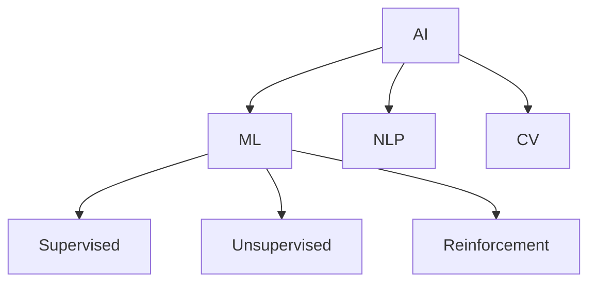

# 4.1 Artificial Intelligence and Machine Learning

[Back to Parent](../4-industry-domains-analysis.md) | [中文版](../4-行业领域分析/4.1-人工智能与机器学习.md)

## Table of Contents

- [4.1 Artificial Intelligence and Machine Learning](#41-artificial-intelligence-and-machine-learning)
  - [Table of Contents](#table-of-contents)
  - [4.1.1 AI/ML Domain Panorama](#411-aiml-domain-panorama)
  - [4.1.2 Typical Algorithms and Models](#412-typical-algorithms-and-models)
  - [4.1.3 Code Example](#413-code-example)
  - [4.1.4 References](#414-references)

---

## 4.1.1 AI/ML Domain Panorama



## 4.1.2 Typical Algorithms and Models

\[
\text{Gradient Descent: } \theta_{t+1} = \theta_t - \alpha \nabla J(\theta_t)
\]

```lean
-- Lean pseudo-code: gradient descent
def gradient_descent (f : ℝ → ℝ) (x₀ : ℝ) (α : ℝ) : ℝ :=
  x₀ - α * derivative f x₀
```

## 4.1.3 Code Example

```rust
// Rust pseudo-code: neural network
struct NeuralNetwork {
    layers: Vec<Layer>,
    weights: Vec<Matrix>,
}
```

## 4.1.4 References

- "Artificial Intelligence: A Modern Approach"
- [Machine Learning Mastery](https://machinelearningmastery.com/)
- TODO: More authoritative references

---

[Back to Tree](../0-Overview-and-Navigation/0.1-Global-Topic-Tree.md)
