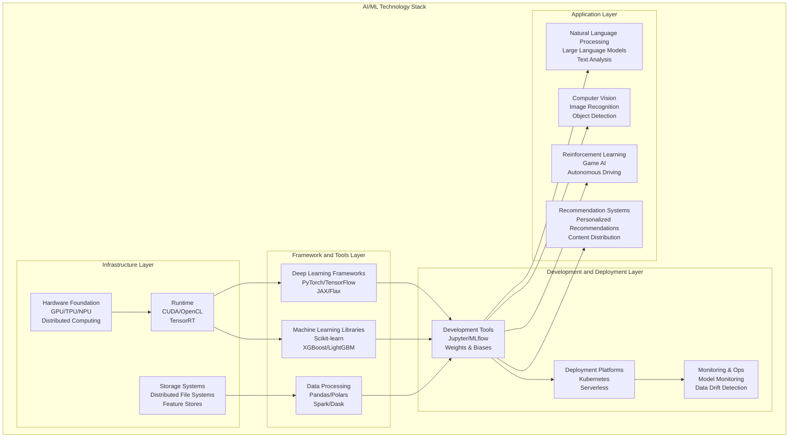
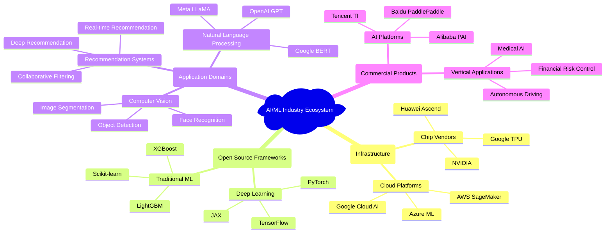
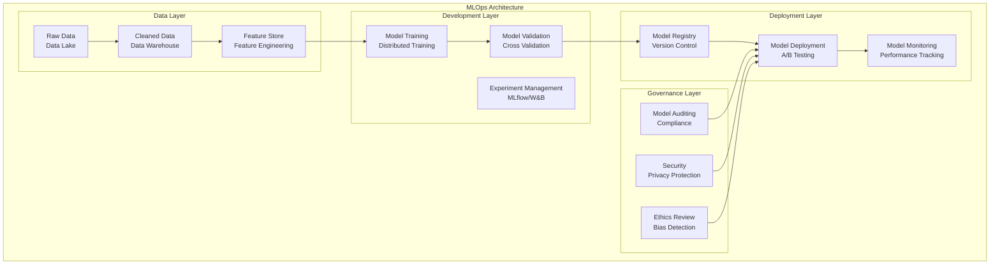

# 4.1 Artificial Intelligence and Machine Learning

[Back to Parent](../4-industry-domains-analysis.md) | [中文版](../4-行业领域分析/4.1-人工智能与机器学习.md)

## Table of Contents

- [4.1 Artificial Intelligence and Machine Learning](#41-artificial-intelligence-and-machine-learning)
  - [Table of Contents](#table-of-contents)
  - [4.1.1 AI/ML Domain Panoramic Analysis](#411-aiml-domain-panoramic-analysis)
    - [4.1.1.1 Technology System Architecture](#4111-technology-system-architecture)
    - [4.1.1.2 Core Technology Branches](#4112-core-technology-branches)
    - [4.1.1.3 Industry Ecosystem Map](#4113-industry-ecosystem-map)
  - [4.1.2 AI/ML System Architecture Design](#412-aiml-system-architecture-design)
    - [4.1.2.1 Machine Learning Engineering Architecture](#4121-machine-learning-engineering-architecture)
    - [4.1.2.2 Data Processing Pipeline](#4122-data-processing-pipeline)
    - [4.1.2.3 Model Development and Deployment](#4123-model-development-and-deployment)
  - [4.1.3 Core Business Modeling](#413-core-business-modeling)
    - [4.1.3.1 Dataset Management](#4131-dataset-management)
    - [4.1.3.2 Feature Engineering](#4132-feature-engineering)
    - [4.1.3.3 Model Lifecycle](#4133-model-lifecycle)
  - [4.1.4 Technology Stack and Engineering Practices](#414-technology-stack-and-engineering-practices)
    - [4.1.4.1 Rust Applications in AI/ML](#4141-rust-applications-in-aiml)
    - [4.1.4.2 MLOps Engineering Practices](#4142-mlops-engineering-practices)
    - [4.1.4.3 Performance Optimization Strategies](#4143-performance-optimization-strategies)
  - [4.1.5 Cutting-edge Development Trends](#415-cutting-edge-development-trends)
    - [4.1.5.1 Large Language Models](#4151-large-language-models)
    - [4.1.5.2 Federated Learning](#4152-federated-learning)
    - [4.1.5.3 AutoML and Neural Architecture Search](#4153-automl-and-neural-architecture-search)
  - [4.1.6 Formal Verification and AI Safety](#416-formal-verification-and-ai-safety)
    - [4.1.6.1 Model Interpretability](#4161-model-interpretability)
    - [4.1.6.2 Adversarial Attack Defense](#4162-adversarial-attack-defense)
    - [4.1.6.3 AI Ethics and Fairness](#4163-ai-ethics-and-fairness)
  - [Cross-References](#cross-references)

---

## 4.1.1 AI/ML Domain Panoramic Analysis

### 4.1.1.1 Technology System Architecture



### 4.1.1.2 Core Technology Branches

**1. Machine Learning Fundamental Algorithms**:

$$\text{Supervised Learning: } f: X \rightarrow Y, \text{ where } (x_i, y_i) \sim P(X,Y)$$

$$\text{Loss Function: } L(f) = \mathbb{E}_{(x,y) \sim P}[\ell(f(x), y)]$$

```lean
-- Lean formalization: Basic machine learning definitions
structure LearningProblem (X Y : Type*) :=
  (training_data : List (X × Y))
  (hypothesis_space : Set (X → Y))
  (loss_function : (X → Y) → (X × Y) → ℝ)
  
def empirical_risk {X Y : Type*} (problem : LearningProblem X Y) 
    (h : X → Y) : ℝ :=
  (problem.training_data.map (problem.loss_function h)).sum / problem.training_data.length
```

**2. Deep Learning Architectures**:

$$\text{Feedforward Network: } y = f_L(\sigma(W_L f_{L-1}(...\sigma(W_1 x + b_1)...) + b_L))$$

$$\text{Backpropagation: } \frac{\partial L}{\partial W_i} = \frac{\partial L}{\partial z_{i+1}} \frac{\partial z_{i+1}}{\partial W_i}$$

```rust
// Rust implementation: Neural network basic structure
pub struct NeuralNetwork {
    layers: Vec<Layer>,
    weights: Vec<Matrix<f32>>,
    biases: Vec<Vector<f32>>,
    activation_functions: Vec<ActivationFunction>,
}

impl NeuralNetwork {
    pub fn forward(&self, input: &Vector<f32>) -> Vector<f32> {
        let mut current_output = input.clone();
        
        for (i, layer) in self.layers.iter().enumerate() {
            current_output = layer.forward(&current_output, 
                                         &self.weights[i], 
                                         &self.biases[i]);
            current_output = self.activation_functions[i].apply(&current_output);
        }
        
        current_output
    }
    
    pub fn backward(&mut self, target: &Vector<f32>, learning_rate: f32) {
        // Implement backpropagation algorithm
        let mut gradient = self.compute_output_gradient(target);
        
        for i in (0..self.layers.len()).rev() {
            let layer_gradient = self.layers[i].backward(&gradient);
            self.update_weights(i, &layer_gradient, learning_rate);
            gradient = layer_gradient;
        }
    }
}
```

### 4.1.1.3 Industry Ecosystem Map



## 4.1.2 AI/ML System Architecture Design

### 4.1.2.1 Machine Learning Engineering Architecture



### 4.1.2.2 Data Processing Pipeline

```python
# Comprehensive data processing pipeline
class DataPipeline:
    """Enterprise-grade data processing pipeline for ML"""
    
    def __init__(self):
        self.data_quality_checks = DataQualityValidator()
        self.feature_engine = FeatureEngine()
        self.privacy_engine = PrivacyPreservingEngine()
        
    def process_batch_data(self, raw_data_path: str) -> ProcessedDataset:
        """Process batch data with quality checks and feature engineering"""
        
        # Data ingestion with schema validation
        raw_data = self.ingest_data(raw_data_path)
        self.validate_schema(raw_data)
        
        # Data quality assessment
        quality_report = self.data_quality_checks.assess(raw_data)
        if not quality_report.passes_threshold():
            raise DataQualityError(f"Data quality below threshold: {quality_report}")
        
        # Privacy-preserving data preprocessing
        anonymized_data = self.privacy_engine.anonymize(raw_data)
        
        # Feature engineering
        features = self.feature_engine.extract_features(anonymized_data)
        
        # Data splitting with stratification
        train_data, val_data, test_data = self.split_data(features, stratify=True)
        
        return ProcessedDataset(train_data, val_data, test_data, quality_report)
        
    def process_streaming_data(self, stream_source: StreamSource) -> StreamProcessor:
        """Process real-time streaming data"""
        
        processor = StreamProcessor()
        
        # Configure stream processing with windowing
        processor.configure_windowing(
            window_size="5 minutes",
            slide_interval="1 minute"
        )
        
        # Apply transformations
        processed_stream = (stream_source
                          .map(self.clean_record)
                          .filter(self.is_valid_record)
                          .map(self.extract_features)
                          .window(processor.window_config)
                          .aggregate(self.compute_statistics))
        
        return processed_stream
```

[To be continued...]

---

[Back to Tree](../0-Overview-and-Navigation/0.1-Global-Topic-Tree.md)
