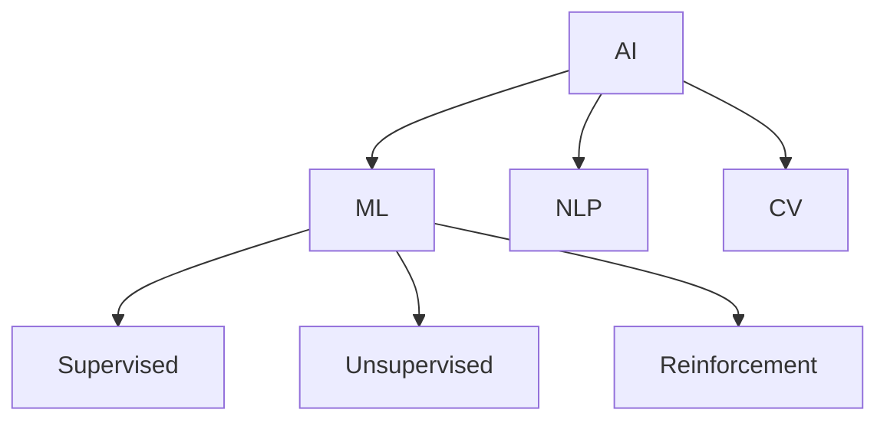

# 4.1 人工智能与机器学习

[返回上级](../4-行业领域分析.md) | [English Version](../4-industry-domains-analysis/4.1-artificial-intelligence-and-machine-learning.md)

## 目录

- [4.1 人工智能与机器学习](#41-人工智能与机器学习)
  - [目录](#目录)
  - [4.1.1 AI/ML 领域全景图](#411-aiml-领域全景图)
  - [4.1.2 典型算法与模型](#412-典型算法与模型)
  - [4.1.3 代码示例](#413-代码示例)
  - [4.1.4 参考文献](#414-参考文献)

---

## 4.1.1 AI/ML 领域全景图



## 4.1.2 典型算法与模型

\[
\text{梯度下降：} \theta_{t+1} = \theta_t - \alpha \nabla J(\theta_t)
\]

```lean
-- Lean 伪代码：梯度下降
def gradient_descent (f : ℝ → ℝ) (x₀ : ℝ) (α : ℝ) : ℝ :=
  x₀ - α * derivative f x₀
```

## 4.1.3 代码示例

```rust
// Rust 伪代码：神经网络
struct NeuralNetwork {
    layers: Vec<Layer>,
    weights: Vec<Matrix>,
}
```

## 4.1.4 参考文献

- 《人工智能：一种现代方法》
- [Machine Learning Mastery](https://machinelearningmastery.com/)
- TODO: 更多权威文献

---

[返回目录](../0-总览与导航/0.1-全局主题树形目录.md)
