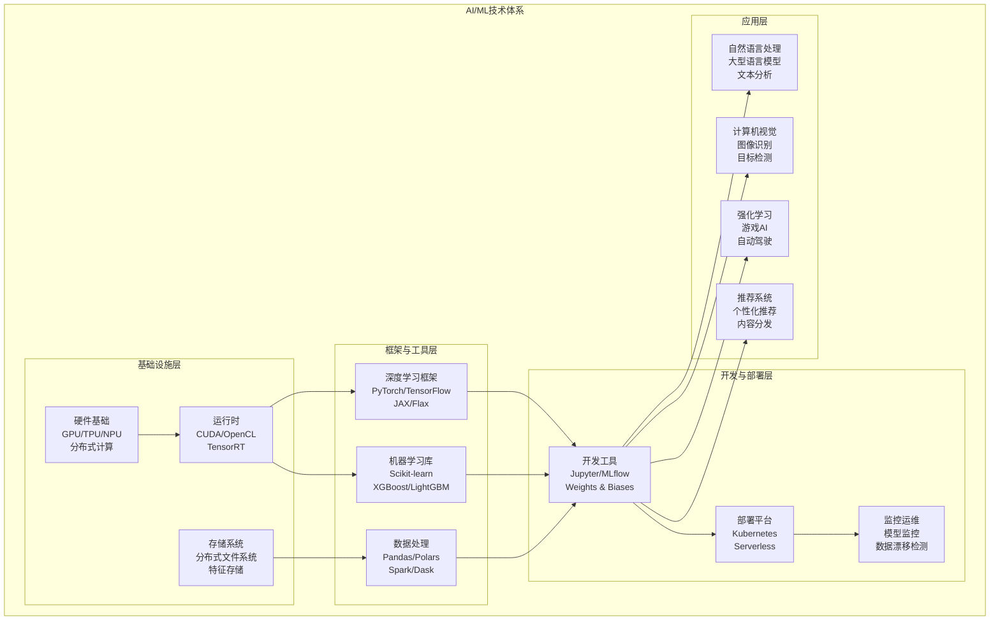
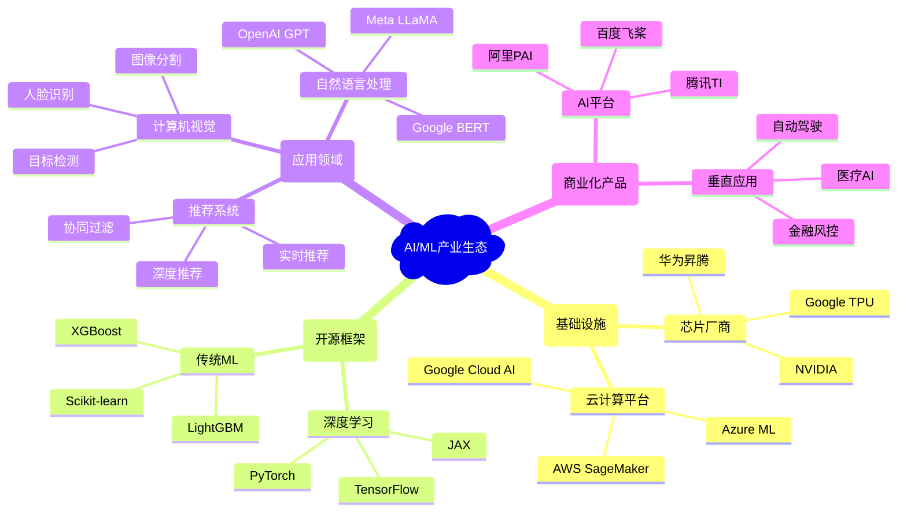
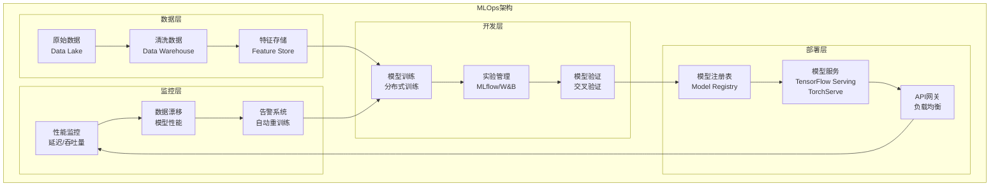
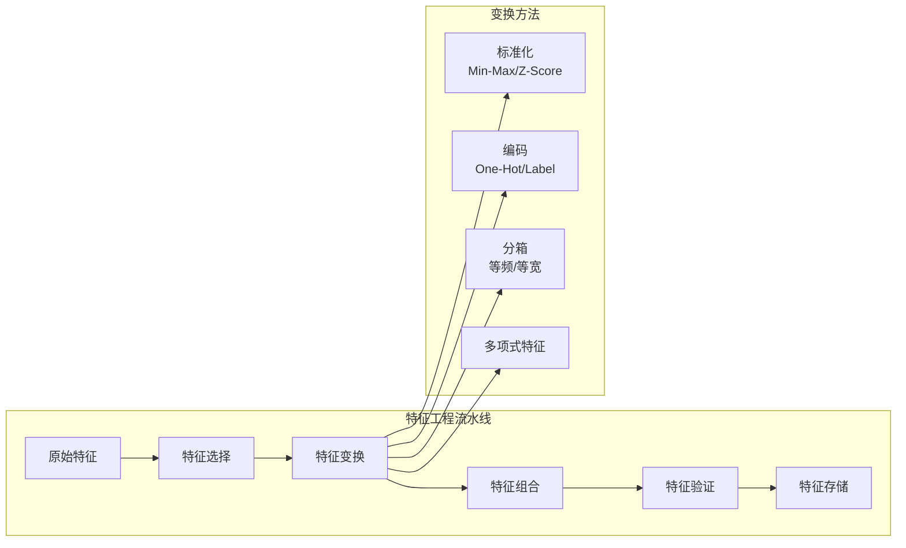
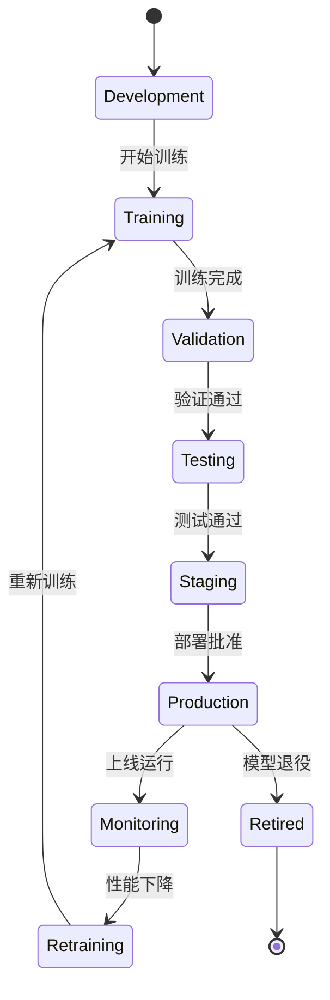
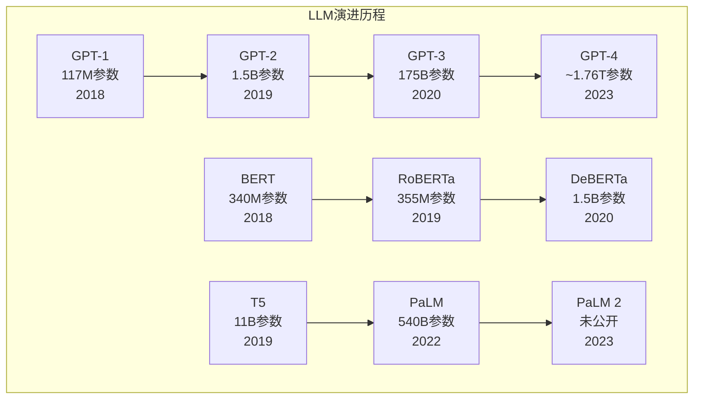
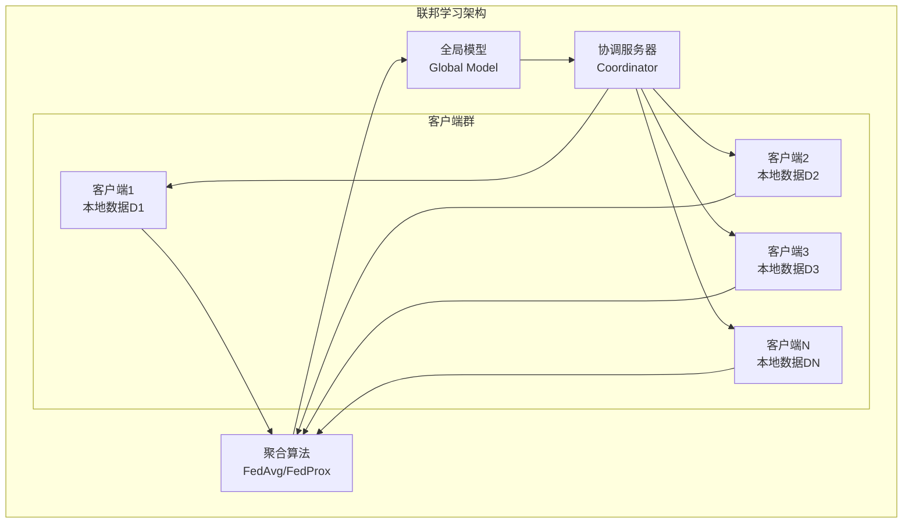
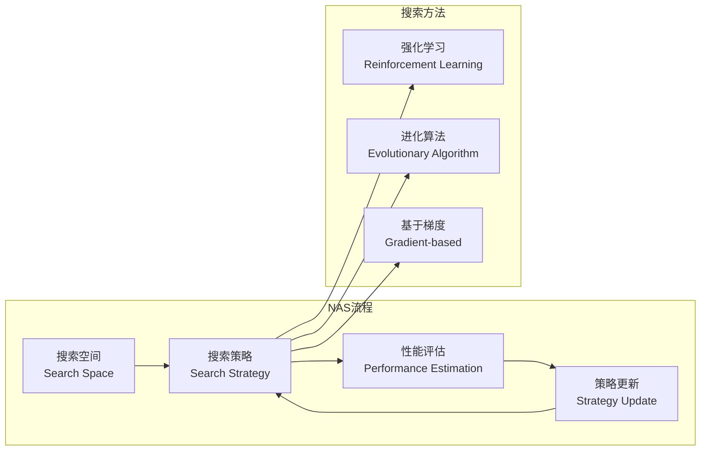

# 4.1 人工智能与机器学习

[返回上级](../4-行业领域分析.md) | [English Version](../4-industry-domains-analysis/4.1-artificial-intelligence-and-machine-learning.md)

## 目录

- [4.1 人工智能与机器学习](#41-人工智能与机器学习)
  - [目录](#目录)
  - [4.1.1 AI/ML领域全景分析](#411-aiml领域全景分析)
    - [4.1.1.1 技术体系架构](#4111-技术体系架构)
    - [4.1.1.2 核心技术分支](#4112-核心技术分支)
    - [4.1.1.3 产业生态地图](#4113-产业生态地图)
  - [4.1.2 AI/ML系统架构设计](#412-aiml系统架构设计)
    - [4.1.2.1 机器学习工程架构](#4121-机器学习工程架构)
    - [4.1.2.2 数据处理管道](#4122-数据处理管道)
    - [4.1.2.3 模型开发与部署](#4123-模型开发与部署)
  - [4.1.3 核心业务建模](#413-核心业务建模)
    - [4.1.3.1 数据集管理](#4131-数据集管理)
    - [4.1.3.2 特征工程](#4132-特征工程)
    - [4.1.3.3 模型生命周期](#4133-模型生命周期)
  - [4.1.4 技术栈与工程实践](#414-技术栈与工程实践)
    - [4.1.4.1 Rust在AI/ML中的应用](#4141-rust在aiml中的应用)
    - [4.1.4.2 MLOps工程实践](#4142-mlops工程实践)
    - [4.1.4.3 性能优化策略](#4143-性能优化策略)
  - [4.1.5 前沿发展趋势](#415-前沿发展趋势)
    - [4.1.5.1 大型语言模型](#4151-大型语言模型)
    - [4.1.5.2 联邦学习](#4152-联邦学习)
    - [4.1.5.3 AutoML与神经架构搜索](#4153-automl与神经架构搜索)
  - [4.1.6 形式化验证与AI安全](#416-形式化验证与ai安全)
    - [4.1.6.1 模型可解释性](#4161-模型可解释性)
    - [4.1.6.2 对抗性攻击防护](#4162-对抗性攻击防护)
    - [4.1.6.3 AI伦理与公平性](#4163-ai伦理与公平性)
  - [交叉引用](#交叉引用)
    - [相关主题](#相关主题)
    - [本地导航](#本地导航)
    - [参考文献](#参考文献)

---

## 4.1.1 AI/ML领域全景分析

### 4.1.1.1 技术体系架构



### 4.1.1.2 核心技术分支

**1. 机器学习基础算法**

\[
\text{监督学习：} f: X \rightarrow Y, \text{其中} (x_i, y_i) \sim P(X,Y)
\]

\[
\text{损失函数：} L(f) = \mathbb{E}_{(x,y) \sim P}[\ell(f(x), y)]
\]

```lean
-- Lean 形式化：机器学习基本定义
structure LearningProblem (X Y : Type*) :=
  (training_data : List (X × Y))
  (hypothesis_space : Set (X → Y))
  (loss_function : (X → Y) → (X × Y) → ℝ)
  
def empirical_risk {X Y : Type*} (problem : LearningProblem X Y) 
    (h : X → Y) : ℝ :=
  (problem.training_data.map (problem.loss_function h)).sum / problem.training_data.length
```

**2. 深度学习架构**

\[
\text{前馈网络：} y = f_L(\sigma(W_L f_{L-1}(...\sigma(W_1 x + b_1)...) + b_L))
\]

\[
\text{反向传播：} \frac{\partial L}{\partial W_i} = \frac{\partial L}{\partial z_{i+1}} \frac{\partial z_{i+1}}{\partial W_i}
\]

```rust
// Rust 实现：神经网络基础结构
pub struct NeuralNetwork {
    layers: Vec<Layer>,
    weights: Vec<Matrix>,
}
```

### 4.1.1.3 产业生态地图



## 4.1.2 AI/ML系统架构设计

### 4.1.2.1 机器学习工程架构



### 4.1.2.2 数据处理管道

**数据处理管道设计**

```rust
// Rust 实现：数据处理管道
use polars::prelude::*;
use serde::{Deserialize, Serialize};

#[derive(Debug, Clone, Serialize, Deserialize)]
pub struct DataPipeline {
    pub steps: Vec<ProcessingStep>,
    pub config: PipelineConfig,
}

#[derive(Debug, Clone, Serialize, Deserialize)]
pub enum ProcessingStep {
    LoadData { source: DataSource },
    CleanData { rules: Vec<CleaningRule> },
    TransformFeatures { transforms: Vec<Transform> },
    ValidateData { validators: Vec<Validator> },
    SaveData { destination: DataDestination },
}

impl DataPipeline {
    pub async fn execute(&self, context: &PipelineContext) -> Result<DataFrame, PipelineError> {
        let mut data = DataFrame::empty();
        
        for step in &self.steps {
            data = match step {
                ProcessingStep::LoadData { source } => {
                    self.load_data(source, context).await?
                }
                ProcessingStep::CleanData { rules } => {
                    self.clean_data(&data, rules)?
                }
                ProcessingStep::TransformFeatures { transforms } => {
                    self.transform_features(&data, transforms)?
                }
                ProcessingStep::ValidateData { validators } => {
                    self.validate_data(&data, validators)?;
                    data
                }
                ProcessingStep::SaveData { destination } => {
                    self.save_data(&data, destination, context).await?;
                    data
                }
            };
        }
        
        Ok(data)
    }
    
    fn transform_features(&self, data: &DataFrame, transforms: &[Transform]) -> Result<DataFrame, PipelineError> {
        let mut result = data.clone();
        
        for transform in transforms {
            result = match transform {
                Transform::Normalize { column, method } => {
                    self.normalize_column(&result, column, method)?
                }
                Transform::Encode { column, method } => {
                    self.encode_column(&result, column, method)?
                }
                Transform::Scale { column, min, max } => {
                    self.scale_column(&result, column, *min, *max)?
                }
                Transform::CreateFeature { name, expression } => {
                    self.create_feature(&result, name, expression)?
                }
            };
        }
        
        Ok(result)
    }
}
```

### 4.1.2.3 模型开发与部署

**模型生命周期管理**

\[
\text{模型版本：} M_v = (θ_v, \mathcal{A}_v, \mathcal{D}_v, \mathcal{P}_v)
\]

其中：
- \(θ_v\)：模型参数
- \(\mathcal{A}_v\)：模型架构
- \(\mathcal{D}_v\)：训练数据
- \(\mathcal{P}_v\)：性能指标

```rust
// 模型部署服务
pub struct ModelService {
    model: Box<dyn Model>,
    preprocessor: Box<dyn Preprocessor>,
    postprocessor: Box<dyn Postprocessor>,
    metrics: ModelMetrics,
}

impl ModelService {
    pub async fn predict(&mut self, input: &PredictionRequest) -> Result<PredictionResponse, ModelError> {
        let start_time = Instant::now();
        
        // 预处理
        let processed_input = self.preprocessor.transform(&input.data)?;
        
        // 模型推理
        let model_output = self.model.predict(&processed_input).await?;
        
        // 后处理
        let result = self.postprocessor.transform(&model_output)?;
        
        // 记录指标
        let inference_time = start_time.elapsed();
        self.metrics.record_prediction(inference_time, &result);
        
        Ok(PredictionResponse {
            prediction: result,
            confidence: model_output.confidence,
            latency_ms: inference_time.as_millis() as u64,
        })
    }
}
```

## 4.1.3 核心业务建模

### 4.1.3.1 数据集管理

**数据集聚合根设计**

```rust
#[derive(Debug, Clone)]
pub struct Dataset {
    pub id: DatasetId,
    pub name: String,
    pub description: String,
    pub version: String,
    pub schema: DataSchema,
    pub size_bytes: u64,
    pub record_count: u64,
    pub created_at: DateTime<Utc>,
    pub updated_at: DateTime<Utc>,
    pub status: DatasetStatus,
    pub metadata: DatasetMetadata,
}

#[derive(Debug, Clone)]
pub struct DataSchema {
    pub columns: Vec<ColumnDefinition>,
    pub primary_key: Option<String>,
    pub foreign_keys: Vec<ForeignKey>,
}

impl Dataset {
    pub fn is_ready_for_training(&self) -> bool {
        self.status == DatasetStatus::Validated && 
        self.record_count > 0 &&
        self.metadata.quality_score > 0.7
    }
    
    pub fn validate_schema(&self, data: &DataFrame) -> Result<ValidationResult, ValidationError> {
        let mut errors = Vec::new();
        
        for column in &self.schema.columns {
            if !data.has_column(&column.name) {
                errors.push(format!("Missing column: {}", column.name));
                continue;
            }
            
            let data_type = data.get_column_type(&column.name)?;
            if data_type != column.data_type {
                errors.push(format!(
                    "Column {} has type {:?}, expected {:?}",
                    column.name, data_type, column.data_type
                ));
            }
        }
        
        Ok(ValidationResult {
            is_valid: errors.is_empty(),
            errors,
            warnings: Vec::new(),
        })
    }
}
```

### 4.1.3.2 特征工程

**特征变换系统**



### 4.1.3.3 模型生命周期

**模型状态机**



## 4.1.4 技术栈与工程实践

### 4.1.4.1 Rust在AI/ML中的应用

**Rust ML生态系统**

```rust
// Rust ML库使用示例
use candle_core::{Tensor, Device, DType};
use candle_nn::{Linear, Module};
use tch::{nn, Device as TchDevice, Tensor as TchTensor};

// 使用Candle框架
pub struct MLPCandle {
    layer1: Linear,
    layer2: Linear,
    layer3: Linear,
}

impl MLPCandle {
    pub fn new(vs: nn::VarStore) -> Self {
        let layer1 = Linear::new(784, 128);
        let layer2 = Linear::new(128, 64);
        let layer3 = Linear::new(64, 10);
        
        Self { layer1, layer2, layer3 }
    }
    
    pub fn forward(&self, input: &Tensor) -> candle_core::Result<Tensor> {
        let x = self.layer1.forward(input)?;
        let x = x.relu()?;
        let x = self.layer2.forward(&x)?;
        let x = x.relu()?;
        let x = self.layer3.forward(&x)?;
        Ok(x)
    }
}

// 高性能数据处理
use polars::prelude::*;

pub fn process_ml_data(df: DataFrame) -> PolarsResult<DataFrame> {
    df.lazy()
        .with_columns([
            // 特征标准化
            ((col("feature1") - col("feature1").mean()) / col("feature1").std(1))
                .alias("feature1_normalized"),
            // 分类编码
            col("category").cast(DataType::Categorical(None))
                .to_physical()
                .alias("category_encoded"),
            // 时间特征提取
            col("timestamp").dt().hour().alias("hour"),
            col("timestamp").dt().weekday().alias("weekday"),
        ])
        .filter(col("target").is_not_null())
        .collect()
}
```

### 4.1.4.2 MLOps工程实践

**CI/CD for ML**

```yaml
# ML模型CI/CD流水线
name: ML Pipeline
on:
  push:
    branches: [main]
  pull_request:
    branches: [main]

jobs:
  data-validation:
    runs-on: ubuntu-latest
    steps:
      - uses: actions/checkout@v3
      - name: Validate Data Schema
        run: |
          python scripts/validate_data.py --config config/data_validation.yaml
      
  model-training:
    needs: data-validation
    runs-on: ubuntu-latest
    steps:
      - name: Train Model
        run: |
          python train.py --config config/training.yaml
      - name: Evaluate Model
        run: |
          python evaluate.py --model-path models/latest
      
  model-testing:
    needs: model-training
    runs-on: ubuntu-latest
    steps:
      - name: Performance Tests
        run: |
          python test_performance.py --threshold 0.95
      - name: Bias Detection
        run: |
          python test_fairness.py --model models/latest
      
  deployment:
    needs: model-testing
    runs-on: ubuntu-latest
    if: github.ref == 'refs/heads/main'
    steps:
      - name: Deploy to Staging
        run: |
          kubectl apply -f k8s/staging/
      - name: Health Check
        run: |
          python health_check.py --endpoint staging.ml-service.com
```

### 4.1.4.3 性能优化策略

**模型优化技术**

\[
\text{量化：} Q(x) = \text{round}\left(\frac{x - z}{s}\right), \quad s = \frac{x_{\max} - x_{\min}}{2^b - 1}
\]

\[
\text{剪枝：} W' = W \odot M, \quad M_{ij} = \begin{cases} 1 & \text{if } |W_{ij}| > \tau \\ 0 & \text{otherwise} \end{cases}
\]

```rust
// 模型优化实现
pub struct ModelOptimizer {
    pruning_ratio: f32,
    quantization_bits: u8,
}

impl ModelOptimizer {
    pub fn optimize(&self, model: &mut dyn Model) -> Result<OptimizationStats, OptimizerError> {
        let original_size = model.parameter_count();
        
        // 权重剪枝
        let pruned_params = self.prune_weights(model)?;
        
        // 量化
        let quantized_params = self.quantize_weights(model)?;
        
        let final_size = model.parameter_count();
        let compression_ratio = original_size as f32 / final_size as f32;
        
        Ok(OptimizationStats {
            original_parameters: original_size,
            final_parameters: final_size,
            compression_ratio,
            pruned_parameters: pruned_params,
            quantized_parameters: quantized_params,
        })
    }
    
    fn prune_weights(&self, model: &mut dyn Model) -> Result<usize, OptimizerError> {
        let mut pruned_count = 0;
        
        for layer in model.layers_mut() {
            let weights = layer.weights_mut();
            let threshold = self.calculate_pruning_threshold(weights, self.pruning_ratio);
            
            for weight in weights.iter_mut() {
                if weight.abs() < threshold {
                    *weight = 0.0;
                    pruned_count += 1;
                }
            }
        }
        
        Ok(pruned_count)
    }
}
```

## 4.1.5 前沿发展趋势

### 4.1.5.1 大型语言模型

**Transformer架构演进**

\[
\text{Self-Attention：} \text{Attention}(Q,K,V) = \text{softmax}\left(\frac{QK^T}{\sqrt{d_k}}\right)V
\]

\[
\text{Multi-Head：} \text{MultiHead}(Q,K,V) = \text{Concat}(\text{head}_1,...,\text{head}_h)W^O
\]



### 4.1.5.2 联邦学习

**联邦学习系统架构**



**联邦学习算法**

\[
\text{FedAvg：} w_{t+1} = \sum_{k=1}^K \frac{n_k}{n} w_k^{(t+1)}
\]

其中 \(w_k^{(t+1)}\) 是客户端 \(k\) 的本地更新，\(n_k\) 是客户端 \(k\) 的数据量。

### 4.1.5.3 AutoML与神经架构搜索

**神经架构搜索流程**



## 4.1.6 形式化验证与AI安全

### 4.1.6.1 模型可解释性

**SHAP值计算**

\[
\phi_i = \sum_{S \subseteq F \setminus \{i\}} \frac{|S|!(|F|-|S|-1)!}{|F|!}[f(S \cup \{i\}) - f(S)]
\]

```lean
-- Lean 形式化：SHAP值定义
def shap_value {F : Finset ℕ} (f : Finset ℕ → ℝ) (i : ℕ) (hi : i ∈ F) : ℝ :=
  ∑ S in (F.erase i).powerset, 
    (Nat.factorial S.card * Nat.factorial (F.card - S.card - 1) : ℝ) / 
    Nat.factorial F.card * 
    (f (S ∪ {i}) - f S)
```

### 4.1.6.2 对抗性攻击防护

**对抗性训练**

\[
\min_\theta \mathbb{E}_{(x,y) \sim \mathcal{D}} \left[ \max_{\|\delta\| \leq \epsilon} L(f_\theta(x + \delta), y) \right]
\]

```rust
// 对抗性训练实现
pub struct AdversarialTrainer {
    model: Box<dyn Model>,
    attack: Box<dyn Attack>,
    epsilon: f32,
    alpha: f32,
    steps: usize,
}

impl AdversarialTrainer {
    pub fn train_step(&mut self, batch: &Batch) -> Result<LossValue, TrainingError> {
        // 生成对抗样本
        let adversarial_examples = self.attack.generate(&batch.inputs, &batch.targets, self.epsilon)?;
        
        // 混合训练
        let mixed_inputs = self.mix_examples(&batch.inputs, &adversarial_examples);
        let mixed_targets = self.repeat_targets(&batch.targets);
        
        // 前向传播
        let predictions = self.model.forward(&mixed_inputs)?;
        let loss = self.loss_function.compute(&predictions, &mixed_targets)?;
        
        // 反向传播
        let gradients = loss.backward()?;
        self.optimizer.step(&gradients)?;
        
        Ok(loss)
    }
}
```

### 4.1.6.3 AI伦理与公平性

**公平性度量**

\[
\text{Demographic Parity：} P(\hat{Y} = 1 | S = 0) = P(\hat{Y} = 1 | S = 1)
\]

\[
\text{Equalized Odds：} P(\hat{Y} = 1 | Y = y, S = s) \text{ independent of } s
\]

```rust
// 公平性评估
pub struct FairnessEvaluator {
    protected_attributes: Vec<String>,
    metrics: Vec<FairnessMetric>,
}

impl FairnessEvaluator {
    pub fn evaluate(&self, predictions: &[f64], targets: &[f64], 
                   attributes: &DataFrame) -> FairnessReport {
        let mut report = FairnessReport::new();
        
        for attr in &self.protected_attributes {
            let groups = self.split_by_attribute(attributes, attr);
            
            for metric in &self.metrics {
                let score = match metric {
                    FairnessMetric::DemographicParity => {
                        self.demographic_parity(predictions, &groups)
                    }
                    FairnessMetric::EqualizedOdds => {
                        self.equalized_odds(predictions, targets, &groups)
                    }
                    FairnessMetric::CalibrationError => {
                        self.calibration_error(predictions, targets, &groups)
                    }
                };
                
                report.add_metric(attr, metric, score);
            }
        }
        
        report
    }
}
```

## 交叉引用

### 相关主题

- [1.1-统一形式化理论综述](../1-形式化理论/1.1-统一形式化理论综述.md) - 形式化方法在AI中的应用
- [2.1-数学内容全景分析](../2-数学基础与应用/2.1-数学内容全景分析.md) - AI/ML的数学基础
- [6.2-rust_haskell代码实践](../6-编程语言与实现/6.2-rust_haskell代码实践.md) - Rust在ML中的系统编程应用
- [7.1-形式化验证架构](../7-验证与工程实践/7.1-形式化验证架构.md) - AI系统的形式化验证

### 本地导航

- [4.2-物联网与边缘计算](./4.2-物联网与边缘计算.md)
- [4.x-其他行业主题](./4.x-其他行业主题.md)
- [返回行业领域分析主页](../4-行业领域分析.md)

### 参考文献

#### 权威文献

1. Goodfellow, I., Bengio, Y., & Courville, A. (2016). *Deep Learning*. MIT Press.
2. Bishop, C. M. (2006). *Pattern Recognition and Machine Learning*. Springer.
3. Hastie, T., Tibshirani, R., & Friedman, J. (2009). *The Elements of Statistical Learning*. Springer.
4. Mitchell, T. M. (1997). *Machine Learning*. McGraw-Hill.
5. Russell, S., & Norvig, P. (2020). *Artificial Intelligence: A Modern Approach* (4th ed.). Pearson.

#### 在线资源

- [Papers With Code](https://paperswithcode.com/) - ML论文和代码库
- [Distill](https://distill.pub/) - 机器学习可视化解释
- [Towards Data Science](https://towardsdatascience.com/) - 数据科学社区
- [MLOps Community](https://mlops.community/) - MLOps最佳实践
- [Hugging Face](https://huggingface.co/) - 预训练模型和工具

#### 延伸阅读

- Sculley, D., et al. (2015). "Hidden Technical Debt in Machine Learning Systems." NIPS.
- Breck, E., et al. (2017). "The ML Test Score: A Rubric for ML Production Readiness." 
- Paleyes, A., et al. (2020). "Challenges in Deploying Machine Learning: A Survey of Case Studies."
- Polyzotis, N., et al. (2017). "Data Management Challenges in Production Machine Learning."

---

[返回目录](../0-总览与导航/0.1-全局主题树形目录.md)
