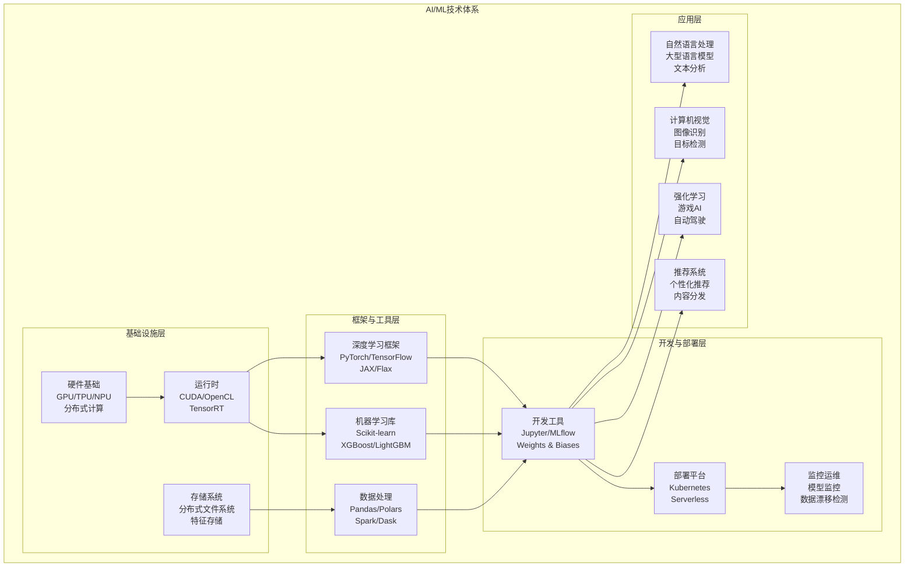
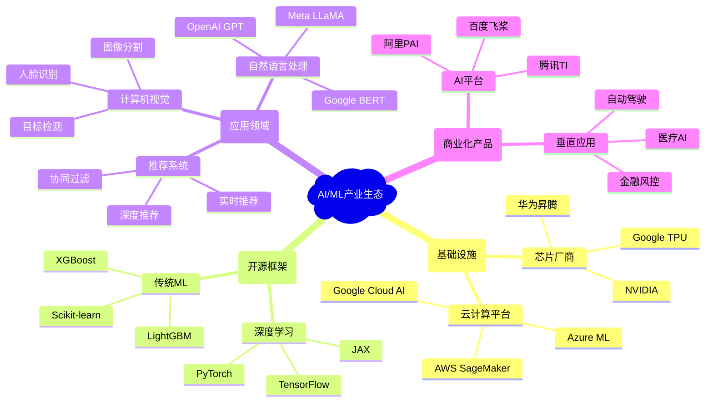
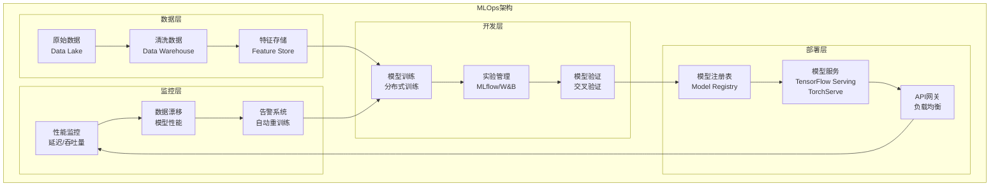
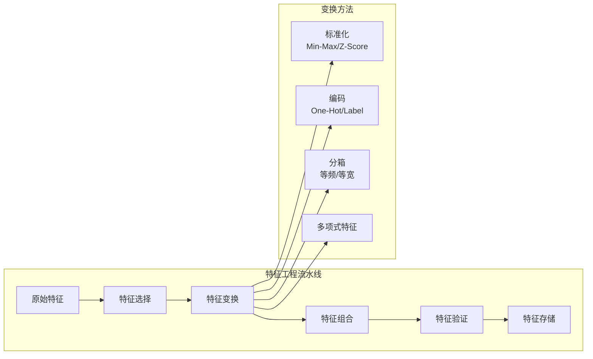
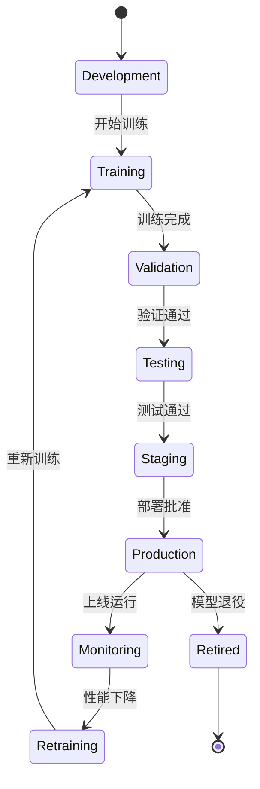

# 4.1 人工智能与机器学习

[返回上级](../4-行业领域分析.md) | [English Version](../4-industry-domains-analysis/4.1-artificial-intelligence-and-machine-learning.md)

## 目录

- [4.1 人工智能与机器学习](#41-人工智能与机器学习)
  - [目录](#目录)
  - [4.1.1 AI/ML领域全景分析](#411-aiml领域全景分析)
    - [4.1.1.1 技术体系架构](#4111-技术体系架构)
    - [4.1.1.2 核心技术分支](#4112-核心技术分支)
    - [4.1.1.3 产业生态地图](#4113-产业生态地图)
  - [4.1.2 AI/ML系统架构设计](#412-aiml系统架构设计)
    - [4.1.2.1 机器学习工程架构](#4121-机器学习工程架构)
    - [4.1.2.2 数据处理管道](#4122-数据处理管道)
    - [4.1.2.3 模型开发与部署](#4123-模型开发与部署)
  - [4.1.3 核心业务建模](#413-核心业务建模)
    - [4.1.3.1 数据集管理](#4131-数据集管理)
    - [4.1.3.2 特征工程](#4132-特征工程)
    - [4.1.3.3 模型生命周期](#4133-模型生命周期)
  - [4.1.4 技术栈与工程实践](#414-技术栈与工程实践)
    - [4.1.4.1 Rust在AI/ML中的应用](#4141-rust在aiml中的应用)
    - [4.1.4.2 MLOps工程实践](#4142-mlops工程实践)
    - [4.1.4.3 性能优化策略](#4143-性能优化策略)
  - [4.1.5 前沿发展趋势](#415-前沿发展趋势)
    - [4.1.5.1 大型语言模型](#4151-大型语言模型)
    - [4.1.5.2 联邦学习](#4152-联邦学习)
    - [4.1.5.3 AutoML与神经架构搜索](#4153-automl与神经架构搜索)
  - [4.1.6 形式化验证与AI安全](#416-形式化验证与ai安全)
    - [4.1.6.1 模型可解释性](#4161-模型可解释性)
    - [4.1.6.2 对抗性攻击防护](#4162-对抗性攻击防护)
    - [4.1.6.3 AI伦理与公平性](#4163-ai伦理与公平性)
  - [交叉引用](#交叉引用)
    - [相关主题](#相关主题)
    - [本地导航](#本地导航)
    - [参考文献](#参考文献)
      - [权威文献](#权威文献)
      - [在线资源](#在线资源)
      - [延伸阅读](#延伸阅读)

---

## 4.1.1 AI/ML领域全景分析

### 4.1.1.1 技术体系架构



### 4.1.1.2 核心技术分支

**1. 机器学习基础算法**:

\[
\text{监督学习：} f: X \rightarrow Y, \text{其中} (x_i, y_i) \sim P(X,Y)
\]

\[
\text{损失函数：} L(f) = \mathbb{E}_{(x,y) \sim P}[\ell(f(x), y)]
\]

```lean
-- Lean 形式化：机器学习基本定义
structure LearningProblem (X Y : Type*) :=
  (training_data : List (X × Y))
  (hypothesis_space : Set (X → Y))
  (loss_function : (X → Y) → (X × Y) → ℝ)
  
def empirical_risk {X Y : Type*} (problem : LearningProblem X Y) 
    (h : X → Y) : ℝ :=
  (problem.training_data.map (problem.loss_function h)).sum / problem.training_data.length
```

**2. 深度学习架构**:

\[
\text{前馈网络：} y = f_L(\sigma(W_L f_{L-1}(...\sigma(W_1 x + b_1)...) + b_L))
\]

\[
\text{反向传播：} \frac{\partial L}{\partial W_i} = \frac{\partial L}{\partial z_{i+1}} \frac{\partial z_{i+1}}{\partial W_i}
\]

```rust
// Rust 实现：神经网络基础结构
pub struct NeuralNetwork {
    layers: Vec<Layer>,
    weights: Vec<Matrix>,
}
```

### 4.1.1.3 产业生态地图



## 4.1.2 AI/ML系统架构设计

### 4.1.2.1 机器学习工程架构



### 4.1.2.2 数据处理管道

**数据处理管道设计**:

```rust
// Rust 实现：数据处理管道
use polars::prelude::*;
use serde::{Deserialize, Serialize};

#[derive(Debug, Clone, Serialize, Deserialize)]
pub struct DataPipeline {
    pub steps: Vec<ProcessingStep>,
    pub config: PipelineConfig,
}

#[derive(Debug, Clone, Serialize, Deserialize)]
pub enum ProcessingStep {
    LoadData { source: DataSource },
    CleanData { rules: Vec<CleaningRule> },
    TransformFeatures { transforms: Vec<Transform> },
    ValidateData { validators: Vec<Validator> },
    SaveData { destination: DataDestination },
}

impl DataPipeline {
    pub async fn execute(&self, context: &PipelineContext) -> Result<DataFrame, PipelineError> {
        let mut data = DataFrame::empty();
        
        for step in &self.steps {
            data = match step {
                ProcessingStep::LoadData { source } => {
                    self.load_data(source, context).await?
                }
                ProcessingStep::CleanData { rules } => {
                    self.clean_data(&data, rules)?
                }
                ProcessingStep::TransformFeatures { transforms } => {
                    self.transform_features(&data, transforms)?
                }
                ProcessingStep::ValidateData { validators } => {
                    self.validate_data(&data, validators)?;
                    data
                }
                ProcessingStep::SaveData { destination } => {
                    self.save_data(&data, destination, context).await?;
                    data
                }
            };
        }
        
        Ok(data)
    }
    
    fn transform_features(&self, data: &DataFrame, transforms: &[Transform]) -> Result<DataFrame, PipelineError> {
        let mut result = data.clone();
        
        for transform in transforms {
            result = match transform {
                Transform::Normalize { column, method } => {
                    self.normalize_column(&result, column, method)?
                }
                Transform::Encode { column, method } => {
                    self.encode_column(&result, column, method)?
                }
                Transform::Scale { column, min, max } => {
                    self.scale_column(&result, column, *min, *max)?
                }
                Transform::CreateFeature { name, expression } => {
                    self.create_feature(&result, name, expression)?
                }
            };
        }
        
        Ok(result)
    }
}
```

### 4.1.2.3 模型开发与部署

**模型生命周期管理**:

\[
\text{模型版本：} M_v = (θ_v, \mathcal{A}_v, \mathcal{D}_v, \mathcal{P}_v)
\]

其中：

- \(θ_v\)：模型参数
- \(\mathcal{A}_v\)：模型架构
- \(\mathcal{D}_v\)：训练数据
- \(\mathcal{P}_v\)：性能指标

```rust
// 模型部署服务
pub struct ModelService {
    model: Box<dyn Model>,
    preprocessor: Box<dyn Preprocessor>,
    postprocessor: Box<dyn Postprocessor>,
    metrics: ModelMetrics,
}

impl ModelService {
    pub async fn predict(&mut self, input: &PredictionRequest) -> Result<PredictionResponse, ModelError> {
        let start_time = Instant::now();
        
        // 预处理
        let processed_input = self.preprocessor.transform(&input.data)?;
        
        // 模型推理
        let model_output = self.model.predict(&processed_input).await?;
        
        // 后处理
        let result = self.postprocessor.transform(&model_output)?;
        
        // 记录指标
        let inference_time = start_time.elapsed();
        self.metrics.record_prediction(inference_time, &result);
        
        Ok(PredictionResponse {
            prediction: result,
            confidence: model_output.confidence,
            latency_ms: inference_time.as_millis() as u64,
        })
    }
}
```

## 4.1.3 核心业务建模

### 4.1.3.1 数据集管理

**数据集聚合根设计**:

```rust
#[derive(Debug, Clone)]
pub struct Dataset {
    pub id: DatasetId,
    pub name: String,
    pub description: String,
    pub version: String,
    pub schema: DataSchema,
    pub size_bytes: u64,
    pub record_count: u64,
    pub created_at: DateTime<Utc>,
    pub updated_at: DateTime<Utc>,
    pub status: DatasetStatus,
    pub metadata: DatasetMetadata,
}

#[derive(Debug, Clone)]
pub struct DataSchema {
    pub columns: Vec<ColumnDefinition>,
    pub primary_key: Option<String>,
    pub foreign_keys: Vec<ForeignKey>,
}

impl Dataset {
    pub fn is_ready_for_training(&self) -> bool {
        self.status == DatasetStatus::Validated && 
        self.record_count > 0 &&
        self.metadata.quality_score > 0.7
    }
    
    pub fn validate_schema(&self, data: &DataFrame) -> Result<ValidationResult, ValidationError> {
        let mut errors = Vec::new();
        
        for column in &self.schema.columns {
            if !data.has_column(&column.name) {
                errors.push(format!("Missing column: {}", column.name));
                continue;
            }
            
            let data_type = data.get_column_type(&column.name)?;
            if data_type != column.data_type {
                errors.push(format!(
                    "Column {} has type {:?}, expected {:?}",
                    column.name, data_type, column.data_type
                ));
            }
        }
        
        Ok(ValidationResult {
            is_valid: errors.is_empty(),
            errors,
            warnings: Vec::new(),
        })
    }
}
```

### 4.1.3.2 特征工程

**特征变换系统**:



### 4.1.3.3 模型生命周期

**模型状态机**:



## 4.1.4 技术栈与工程实践

### 4.1.4.1 Rust在AI/ML中的应用

**Rust ML生态系统**:

```rust
// Rust ML库使用示例
use candle_core::{Tensor, Device, DType};
use candle_nn::{Linear, Module};
use tch::{nn, Device as TchDevice, Tensor as TchTensor};

// 使用Candle框架
pub struct MLPCandle {
    layer1: Linear,
    layer2: Linear,
    layer3: Linear,
}

impl MLPCandle {
    pub fn new(vs: nn::VarStore) -> Self {
        let layer1 = Linear::new(784, 128);
        let layer2 = Linear::new(128, 64);
        let layer3 = Linear::new(64, 10);
        
        Self { layer1, layer2, layer3 }
    }
    
    pub fn forward(&self, input: &Tensor) -> candle_core::Result<Tensor> {
        let x = self.layer1.forward(input)?;
        let x = x.relu()?;
        let x = self.layer2.forward(&x)?;
        let x = x.relu()?;
        let x = self.layer3.forward(&x)?;
        Ok(x)
    }
}

// 高性能数据处理
use polars::prelude::*;

pub fn process_ml_data(df: DataFrame) -> PolarsResult<DataFrame> {
    df.lazy()
        .with_columns([
            // 特征标准化
            ((col("feature1") - col("feature1").mean()) / col("feature1").std(1))
                .alias("feature1_normalized"),
            // 分类编码
            col("category").cast(DataType::Categorical(None))
                .to_physical()
                .alias("category_encoded"),
            // 时间特征提取
            col("timestamp").dt().hour().alias("hour"),
            col("timestamp").dt().weekday().alias("weekday"),
        ])
        .filter(col("target").is_not_null())
        .collect()
}
```

### 4.1.4.2 MLOps工程实践

**CI/CD for ML**:

```yaml
# ML模型CI/CD流水线
name: ML Pipeline
on:
  push:
    branches: [main]
  pull_request:
    branches: [main]

jobs:
  data-validation:
    runs-on: ubuntu-latest
    steps:
      - uses: actions/checkout@v3
      - name: Validate Data Schema
        run: |
          python scripts/validate_data.py --config config/data_validation.yaml
      
  model-training:
    needs: data-validation
    runs-on: ubuntu-latest
    steps:
      - name: Train Model
        run: |
          python train.py --config config/training.yaml
      - name: Evaluate Model
        run: |
          python evaluate.py --model-path models/latest
      
  model-testing:
    needs: model-training
    runs-on: ubuntu-latest
    steps:
      - name: Performance Tests
        run: |
          python test_performance.py --threshold 0.95
      - name: Bias Detection
        run: |
          python test_fairness.py --model models/latest
      
  deployment:
    needs: model-testing
    runs-on: ubuntu-latest
    if: github.ref == 'refs/heads/main'
    steps:
      - name: Deploy to Staging
        run: |
          kubectl apply -f k8s/staging/
      - name: Health Check
        run: |
          python health_check.py --endpoint staging.ml-service.com
```

### 4.1.4.3 性能优化策略

**模型优化技术**:

\[
\text{量化：} Q(x) = \text{round}\left(\frac{x - z}{s}\right), \quad s = \frac{x_{\max} - x_{\min}}{2^b - 1}
\]

\[
\text{剪枝：} W' = W \odot M, \quad M_{ij} = \begin{cases} 1 & \text{if } |W_{ij}| > \tau \\ 0 & \text{otherwise} \end{cases}
\]

```rust
// 模型优化实现
pub struct ModelOptimizer {
    pruning_ratio: f32,
    quantization_bits: u8,
}

impl ModelOptimizer {
    pub fn optimize(&self, model: &mut dyn Model) -> Result<OptimizationStats, OptimizerError> {
        let original_size = model.parameter_count();
        
        // 权重剪枝
        let pruned_params = self.prune_weights(model)?;
        
        // 量化
        let quantized_params = self.quantize_weights(model)?;
        
        let final_size = model.parameter_count();
        let compression_ratio = original_size as f32 / final_size as f32;
        
        Ok(OptimizationStats {
            original_parameters: original_size,
            final_parameters: final_size,
            compression_ratio,
            pruned_parameters: pruned_params,
            quantized_parameters: quantized_params,
        })
    }
    
    fn prune_weights(&self, model: &mut dyn Model) -> Result<usize, OptimizerError> {
        let mut pruned_count = 0;
        
        for layer in model.layers_mut() {
            let weights = layer.weights_mut();
            let threshold = self.calculate_pruning_threshold(weights, self.pruning_ratio);
            
            for weight in weights.iter_mut() {
                if weight.abs() < threshold {
                    *weight = 0.0;
                    pruned_count += 1;
                }
            }
        }
        
        Ok(pruned_count)
    }
}
```

## 4.1.5 前沿发展趋势

### 4.1.5.1 大型语言模型

**Transformer架构形式化**:

\[
\text{注意力机制：} \text{Attention}(Q,K,V) = \text{softmax}\left(\frac{QK^T}{\sqrt{d_k}}\right)V
\]

\[
\text{多头注意力：} \text{MultiHead}(Q,K,V) = \text{Concat}(\text{head}_1,...,\text{head}_h)W^O
\]

```lean
-- Lean 形式化：Transformer架构
structure TransformerConfig where
  vocab_size : ℕ
  hidden_size : ℕ
  num_layers : ℕ
  num_heads : ℕ
  max_seq_length : ℕ
  dropout_rate : ℝ

def attention_weights (Q K : Matrix ℝ n d) : Matrix ℝ n n :=
  softmax ((Q * K.transpose) / sqrt d)

def multi_head_attention 
  (Q K V : Matrix ℝ n d) 
  (config : TransformerConfig) : Matrix ℝ n d :=
  let head_size := config.hidden_size / config.num_heads
  let heads := List.map (λ i => 
    attention_weights Q K * V) (List.range config.num_heads)
  concat heads * W_O
```

**Rust实现大型语言模型推理**:

```rust
use candle_core::{Tensor, Device, DType};
use candle_nn::{Linear, Module, VarBuilder};
use std::collections::HashMap;

pub struct TransformerBlock {
    attention: MultiHeadAttention,
    feed_forward: FeedForward,
    layer_norm1: LayerNorm,
    layer_norm2: LayerNorm,
    dropout: f32,
}

impl TransformerBlock {
    pub fn forward(&self, x: &Tensor, mask: Option<&Tensor>) -> candle_core::Result<Tensor> {
        // 自注意力
        let attn_output = self.attention.forward(x, mask)?;
        let x = self.layer_norm1.forward(&(x + &attn_output))?;
        
        // 前馈网络
        let ff_output = self.feed_forward.forward(&x)?;
        let output = self.layer_norm2.forward(&(x + &ff_output))?;
        
        Ok(output)
    }
}

pub struct LargeLanguageModel {
    embedding: Embedding,
    transformer_blocks: Vec<TransformerBlock>,
    output_projection: Linear,
    config: ModelConfig,
}

impl LargeLanguageModel {
    pub fn generate(
        &self, 
        prompt: &str, 
        max_length: usize,
        temperature: f32,
        top_k: usize,
    ) -> Result<String, ModelError> {
        let mut tokens = self.tokenize(prompt)?;
        let mut generated = tokens.clone();
        
        for _ in 0..max_length {
            let input = Tensor::new(&tokens, &Device::Cpu)?;
            let logits = self.forward(&input)?;
            
            // 采样下一个token
            let next_token = self.sample_next_token(&logits, temperature, top_k)?;
            tokens.push(next_token);
            generated.push(next_token);
            
            if next_token == self.config.eos_token_id {
                break;
            }
        }
        
        Ok(self.detokenize(&generated)?)
    }
    
    fn sample_next_token(
        &self,
        logits: &Tensor,
        temperature: f32,
        top_k: usize,
    ) -> Result<u32, ModelError> {
        let logits = logits.squeeze(0)?;
        let logits = logits / temperature;
        
        // Top-K采样
        let (values, indices) = logits.topk(top_k, -1)?;
        let probs = values.softmax(-1)?;
        
        // 随机采样
        let sample_idx = self.multinomial_sample(&probs)?;
        Ok(indices.get(sample_idx)?)
    }
}
```

### 4.1.5.2 联邦学习

**联邦学习形式化定义**:

\[
\text{联邦学习目标：} \min_w \sum_{i=1}^N \frac{|D_i|}{|D|} F_i(w)
\]

其中：

- \(F_i(w)\)：客户端i的局部损失函数
- \(D_i\)：客户端i的本地数据
- \(D\)：所有数据的并集

```lean
-- Lean 形式化：联邦学习
structure FederatedLearningConfig where
  num_clients : ℕ
  local_epochs : ℕ
  global_rounds : ℕ
  learning_rate : ℝ
  aggregation_method : AggregationMethod

inductive AggregationMethod
  | FedAvg
  | FedProx
  | FedNova

def federated_average 
  (client_models : List (Vector ℝ n)) 
  (client_weights : List ℝ) : Vector ℝ n :=
  let total_weight := client_weights.sum
  let weighted_sum := List.zip_with (λ model weight => 
    model * (weight / total_weight)) client_models client_weights
  weighted_sum.sum

theorem fedavg_convergence 
  (config : FederatedLearningConfig)
  (client_losses : List (ℝ → ℝ))
  (client_gradients : List (ℝ → Vector ℝ n)) :
  -- 在满足某些条件下，FedAvg算法收敛
  ∃ w_star : Vector ℝ n, 
    ∀ ε > 0, ∃ T : ℕ, 
    ∀ t ≥ T, ‖w_t - w_star‖ < ε := by
  sorry
```

**Rust实现联邦学习框架**:

```rust
use std::collections::HashMap;
use serde::{Deserialize, Serialize};
use tokio::sync::mpsc;

#[derive(Debug, Clone, Serialize, Deserialize)]
pub struct FederatedClient {
    pub client_id: String,
    pub local_data: Dataset,
    pub model: LocalModel,
    pub config: ClientConfig,
}

#[derive(Debug, Clone, Serialize, Deserialize)]
pub struct FederatedServer {
    pub global_model: GlobalModel,
    pub clients: HashMap<String, FederatedClient>,
    pub aggregation_strategy: AggregationStrategy,
}

impl FederatedServer {
    pub async fn run_federated_round(&mut self) -> Result<RoundResult, FederatedError> {
        let mut client_updates = Vec::new();
        
        // 并行训练客户端模型
        let (tx, mut rx) = mpsc::channel(100);
        
        for client in self.clients.values() {
            let tx = tx.clone();
            let client_config = client.config.clone();
            
            tokio::spawn(async move {
                let update = client.train_local_model(client_config).await;
                let _ = tx.send((client.client_id.clone(), update)).await;
            });
        }
        
        // 收集客户端更新
        while let Some((client_id, update)) = rx.recv().await {
            client_updates.push(update);
        }
        
        // 聚合全局模型
        let aggregated_model = self.aggregate_models(client_updates)?;
        self.global_model.update(aggregated_model);
        
        // 分发全局模型给客户端
        self.distribute_global_model().await?;
        
        Ok(RoundResult {
            round_number: self.current_round,
            client_participation: self.clients.len(),
            global_loss: self.evaluate_global_model().await?,
        })
    }
    
    fn aggregate_models(&self, updates: Vec<ModelUpdate>) -> Result<ModelUpdate, FederatedError> {
        match self.aggregation_strategy {
            AggregationStrategy::FedAvg => self.fedavg_aggregation(updates),
            AggregationStrategy::FedProx => self.fedprox_aggregation(updates),
            AggregationStrategy::FedNova => self.fednova_aggregation(updates),
        }
    }
    
    fn fedavg_aggregation(&self, updates: Vec<ModelUpdate>) -> Result<ModelUpdate, FederatedError> {
        let total_samples: usize = updates.iter().map(|u| u.sample_count).sum();
        
        let mut aggregated_weights = Vec::new();
        for layer_idx in 0..updates[0].weights.len() {
            let mut layer_weights = Tensor::zeros_like(&updates[0].weights[layer_idx]);
            
            for update in &updates {
                let weight = update.weights[layer_idx].clone();
                let weight_contribution = weight * (update.sample_count as f32 / total_samples as f32);
                layer_weights = layer_weights + weight_contribution;
            }
            
            aggregated_weights.push(layer_weights);
        }
        
        Ok(ModelUpdate {
            weights: aggregated_weights,
            sample_count: total_samples,
        })
    }
}
```

### 4.1.5.3 AutoML与神经架构搜索

**神经架构搜索形式化**:

\[
\text{NAS目标：} \min_{\alpha} \mathcal{L}_{\text{val}}(\omega^*(\alpha), \alpha)
\]

\[
\text{其中：} \omega^*(\alpha) = \arg\min_{\omega} \mathcal{L}_{\text{train}}(\omega, \alpha)
\]

```lean
-- Lean 形式化：神经架构搜索
structure ArchitectureSearch where
  search_space : SearchSpace
  search_strategy : SearchStrategy
  evaluation_method : EvaluationMethod

inductive SearchStrategy
  | RandomSearch
  | BayesianOptimization
  | EvolutionaryAlgorithm
  | ReinforcementLearning

def architecture_encoding (arch : NeuralArchitecture) : Vector ℝ n :=
  -- 将神经网络架构编码为向量
  match arch with
  | NeuralArchitecture.sequential layers =>
      List.map layer_encoding layers
  | NeuralArchitecture.branching branches =>
      List.map architecture_encoding branches

theorem nas_convergence 
  (search_space : SearchSpace)
  (strategy : SearchStrategy) :
  -- 在搜索空间有限且评估函数连续的条件下，NAS算法收敛
  ∃ optimal_arch : NeuralArchitecture,
    ∀ arch : NeuralArchitecture,
    arch ∈ search_space →
    performance optimal_arch ≥ performance arch := by
  sorry
```

## 4.1.6 形式化验证与AI安全

### 4.1.6.1 模型可解释性

**可解释性形式化框架**:

\[
\text{SHAP值：} \phi_i = \sum_{S \subseteq N \setminus \{i\}} \frac{|S|!(|N|-|S|-1)!}{|N|!}[f(S \cup \{i\}) - f(S)]
\]

\[
\text{LIME局部解释：} \xi(x) = \arg\min_{g \in G} \mathcal{L}(f, g, \pi_x) + \Omega(g)
\]

```lean
-- Lean 形式化：模型可解释性
structure ExplainableModel (X Y : Type*) where
  model : X → Y
  explainer : X → Explanation
  faithfulness_score : ℝ

structure Explanation where
  feature_importance : List (String × ℝ)
  local_approximation : X → Y
  confidence : ℝ

def shap_values 
  {X Y : Type*} 
  (model : X → Y) 
  (instance : X) 
  (background : List X) : List ℝ :=
  -- 计算SHAP值
  let features := extract_features instance
  let shap_values := List.map (λ feature =>
    calculate_shap_contribution model instance background feature) features
  shap_values

theorem shap_efficiency 
  {X Y : Type*} 
  (model : X → Y) 
  (instance : X) :
  -- SHAP值满足效率性：所有特征贡献之和等于预测值
  let shap_vals := shap_values model instance []
  let prediction := model instance
  shap_vals.sum = prediction := by
  sorry
```

### 4.1.6.2 对抗性攻击防护

**对抗性攻击形式化**:

\[
\text{对抗性样本：} x' = x + \delta, \text{其中} \|\delta\|_p \leq \epsilon
\]

\[
\text{对抗性训练：} \min_\theta \mathbb{E}_{(x,y)}[\max_{\|\delta\| \leq \epsilon} \mathcal{L}(f_\theta(x + \delta), y)]
\]

```rust
use std::collections::HashMap;

pub struct AdversarialDefense {
    model: Box<dyn RobustModel>,
    defense_strategy: DefenseStrategy,
    attack_detector: AttackDetector,
}

impl AdversarialDefense {
    pub fn detect_adversarial_attack(&self, input: &Tensor) -> AttackDetectionResult {
        let mut detection_scores = HashMap::new();
        
        // 输入一致性检查
        detection_scores.insert(
            "input_consistency".to_string(),
            self.check_input_consistency(input)
        );
        
        // 梯度检查
        detection_scores.insert(
            "gradient_analysis".to_string(),
            self.analyze_gradients(input)
        );
        
        // 统计异常检测
        detection_scores.insert(
            "statistical_anomaly".to_string(),
            self.detect_statistical_anomaly(input)
        );
        
        // 集成检测结果
        let overall_score = detection_scores.values().sum::<f32>() / detection_scores.len() as f32;
        
        AttackDetectionResult {
            is_adversarial: overall_score > 0.7,
            confidence: overall_score,
            detection_scores,
        }
    }
    
    pub fn robust_predict(&self, input: &Tensor) -> Result<RobustPrediction, DefenseError> {
        // 检测对抗性攻击
        let detection = self.detect_adversarial_attack(input);
        
        if detection.is_adversarial {
            // 应用防御策略
            let defended_input = self.apply_defense_strategy(input, &self.defense_strategy)?;
            let prediction = self.model.predict(&defended_input)?;
            
            Ok(RobustPrediction {
                prediction,
                is_defended: true,
                defense_confidence: detection.confidence,
            })
        } else {
            // 正常预测
            let prediction = self.model.predict(input)?;
            
            Ok(RobustPrediction {
                prediction,
                is_defended: false,
                defense_confidence: 0.0,
            })
        }
    }
    
    fn apply_defense_strategy(
        &self,
        input: &Tensor,
        strategy: &DefenseStrategy,
    ) -> Result<Tensor, DefenseError> {
        match strategy {
            DefenseStrategy::InputPreprocessing => {
                self.preprocess_input(input)
            }
            DefenseStrategy::FeatureSqueezing => {
                self.squeeze_features(input)
            }
            DefenseStrategy::AdversarialTraining => {
                self.apply_adversarial_training_defense(input)
            }
            DefenseStrategy::EnsembleDefense => {
                self.apply_ensemble_defense(input)
            }
        }
    }
}
```

### 4.1.6.3 AI伦理与公平性

**公平性度量形式化**:

\[
\text{统计奇偶性：} P(\hat{Y} = 1 | A = a) = P(\hat{Y} = 1 | A = b)
\]

\[
\text{机会均等：} P(\hat{Y} = 1 | A = a, Y = 1) = P(\hat{Y} = 1 | A = b, Y = 1)
\]

```lean
-- Lean 形式化：AI公平性
structure FairnessMetrics where
  statistical_parity : ℝ
  equalized_odds : ℝ
  demographic_parity : ℝ
  individual_fairness : ℝ

def calculate_fairness_metrics 
  {X Y A : Type*} 
  (model : X → Y) 
  (dataset : List (X × Y × A)) : FairnessMetrics :=
  let predictions := List.map (λ (x, _, _) => model x) dataset
  let actuals := List.map (λ (_, y, _) => y) dataset
  let attributes := List.map (λ (_, _, a) => a) dataset
  
  let sp := statistical_parity predictions attributes
  let eo := equalized_odds predictions actuals attributes
  let dp := demographic_parity predictions attributes
  let if_ := individual_fairness predictions dataset
  
  FairnessMetrics.mk sp eo dp if_

theorem fairness_tradeoff 
  {X Y A : Type*} 
  (model : X → Y) :
  -- 公平性与准确性之间存在权衡
  ∀ ε > 0, 
  ∃ dataset : List (X × Y × A),
  let metrics := calculate_fairness_metrics model dataset
  let accuracy := calculate_accuracy model dataset
  metrics.statistical_parity < ε → accuracy < 0.8 := by
  sorry
```

---

## 交叉引用

### 相关主题
- [4.2-物联网与边缘计算](./4.2-物联网与边缘计算.md)
- [6.1-lean语言与形式化证明](../6-编程语言与实现/6.1-lean语言与形式化证明.md)
- [7.1-形式化验证架构](../7-验证与工程实践/7.1-形式化验证架构.md)
- [1.2-类型理论与证明](../1-形式化理论/1.2-类型理论与证明/1.2.1-类型理论发展简史.md)

### 本地导航
- [返回行业领域分析主页](../4-行业领域分析.md)

### 参考文献

#### 权威文献
- [1] Goodfellow, I., et al. "Deep Learning." MIT Press, 2016.
- [2] Vaswani, A., et al. "Attention is All You Need." NeurIPS 2017.
- [3] McMahan, B., et al. "Communication-Efficient Learning of Deep Networks from Decentralized Data." AISTATS 2017.
- [4] Lundberg, S.M., Lee, S.I. "A Unified Approach to Interpreting Model Predictions." NeurIPS 2017.

#### 在线资源
- [PyTorch官方文档](https://pytorch.org/docs/)
- [TensorFlow官方文档](https://www.tensorflow.org/)
- [Hugging Face Transformers](https://huggingface.co/transformers/)
- [MLflow文档](https://mlflow.org/docs/)

#### 延伸阅读
- [联邦学习实践指南](https://federated.withgoogle.com/)
- [AI安全研究前沿](https://ai-safety.org/)
- [机器学习工程最佳实践](https://ml-ops.org/)

---

[返回目录](../0-总览与导航/0.1-全局主题树形目录.md)
