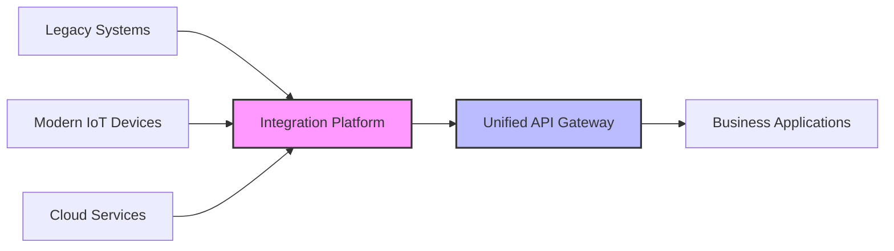

# 4.2 物联网与边缘计算

[返回上级](../4-行业领域分析.md) | [English Version](../4-industry-domains-analysis/4.2-internet-of-things-and-edge-computing.md)

## 目录

- [4.2 物联网与边缘计算](#42-物联网与边缘计算)
  - [目录](#目录)
  - [4.2.1 IoT系统架构全景](#421-iot系统架构全景)
    - [4.2.1.1 分层架构模型](#4211-分层架构模型)
    - [4.2.1.2 核心架构组件](#4212-核心架构组件)
    - [4.2.1.3 协议栈与互操作性](#4213-协议栈与互操作性)
  - [4.2.2 分布式边缘计算模型](#422-分布式边缘计算模型)
    - [4.2.2.1 边缘计算理论基础](#4221-边缘计算理论基础)
    - [4.2.2.2 分布式边缘节点协调](#4222-分布式边缘节点协调)
    - [4.2.2.3 边缘AI与本地推理](#4223-边缘ai与本地推理)
  - [4.2.3 形式化建模与验证](#423-形式化建模与验证)
    - [4.2.3.1 Petri网建模](#4231-petri网建模)
    - [4.2.3.2 时序逻辑验证](#4232-时序逻辑验证)
  - [4.2.4 核心技术实现](#424-核心技术实现)
    - [4.2.4.1 设备管理与注册](#4241-设备管理与注册)
    - [4.2.4.2 实时数据流处理](#4242-实时数据流处理)
    - [4.2.4.3 消息队列与事件驱动](#4243-消息队列与事件驱动)
  - [4.2.5 安全性与可靠性](#425-安全性与可靠性)
    - [4.2.5.1 分层安全模型](#4251-分层安全模型)
    - [4.2.5.2 容错与恢复机制](#4252-容错与恢复机制)
  - [4.2.6 性能优化策略](#426-性能优化策略)
    - [4.2.6.1 边缘缓存优化](#4261-边缘缓存优化)
    - [4.2.6.2 网络优化与QoS](#4262-网络优化与qos)
  - [4.2.7 工程实践案例](#427-工程实践案例)
    - [4.2.7.1 智能制造IoT系统](#4271-智能制造iot系统)
    - [4.2.7.2 智慧城市环境监测](#4272-智慧城市环境监测)
  - [4.2.8 发展趋势与挑战](#428-发展趋势与挑战)
    - [4.2.8.1 技术发展趋势](#4281-技术发展趋势)
    - [4.2.8.2 技术挑战与解决方案](#4282-技术挑战与解决方案)
    - [4.2.8.3 未来发展方向](#4283-未来发展方向)
  - [4.2.9 参考文献与延伸阅读](#429-参考文献与延伸阅读)
    - [4.2.9.1 学术文献](#4291-学术文献)
    - [4.2.9.2 技术标准](#4292-技术标准)
    - [4.2.9.3 开源项目](#4293-开源项目)
    - [4.2.9.4 延伸阅读](#4294-延伸阅读)

---

## 4.2.1 IoT系统架构全景

### 4.2.1.1 分层架构模型

物联网系统采用典型的分层架构，每层都有明确的职责和边界：

```mermaid
graph TB
    subgraph "云端层 (Cloud Layer)"
        A1[数据中心] --> A2[AI分析引擎]
        A2 --> A3[业务应用]
        A3 --> A4[管理控制台]
    end
    
    subgraph "边缘层 (Edge Layer)"
        B1[边缘网关] --> B2[本地存储]
        B2 --> B3[边缘AI]
        B3 --> B4[协议转换]
    end
    
    subgraph "设备层 (Device Layer)"
        C1[传感器] --> C2[执行器]
        C2 --> C3[嵌入式控制器]
        C3 --> C4[通信模块]
    end
    
    A1 -.->|指令下发| B1
    B1 -.->|数据上报| A1
    B1 -->|数据采集| C1
    C2 <--|控制指令| B4
```

**定义 4.2.1** (IoT系统形式化模型): IoT系统 $\mathcal{S}$ 可建模为四元组：
$$\mathcal{S} = \langle \mathcal{D}, \mathcal{E}, \mathcal{C}, \mathcal{P} \rangle$$

其中：

- $\mathcal{D}$ 是设备集合
- $\mathcal{E}$ 是边缘节点集合  
- $\mathcal{C}$ 是云端服务集合
- $\mathcal{P}$ 是通信协议集合

### 4.2.1.2 核心架构组件

```rust
// 分层架构核心组件
pub struct IoTSystemArchitecture {
    // 设备层
    device_layer: DeviceLayer,
    // 边缘层
    edge_layer: EdgeLayer,
    // 云端层
    cloud_layer: CloudLayer,
    // 通信管理
    communication_manager: CommunicationManager,
}

// 设备层实现
pub struct DeviceLayer {
    sensors: HashMap<DeviceId, SensorCluster>,
    actuators: HashMap<DeviceId, ActuatorCluster>,
    controllers: HashMap<DeviceId, EmbeddedController>,
}

impl DeviceLayer {
    pub async fn collect_sensor_data(&self) -> Result<SensorDataBatch, IoTError> {
        let mut data_batch = SensorDataBatch::new();
        
        for (device_id, sensor_cluster) in &self.sensors {
            let readings = sensor_cluster.read_all_sensors().await?;
            data_batch.add_device_data(*device_id, readings);
        }
        
        Ok(data_batch)
    }
    
    pub async fn execute_commands(&self, commands: Vec<DeviceCommand>) -> Result<(), IoTError> {
        for command in commands {
            match command.target_type {
                DeviceType::Actuator => {
                    if let Some(actuator) = self.actuators.get(&command.device_id) {
                        actuator.execute_command(command.payload).await?;
                    }
                },
                DeviceType::Controller => {
                    if let Some(controller) = self.controllers.get(&command.device_id) {
                        controller.update_configuration(command.payload).await?;
                    }
                },
                _ => return Err(IoTError::UnsupportedDeviceType),
            }
        }
        Ok(())
    }
}
```

### 4.2.1.3 协议栈与互操作性

```haskell
-- IoT协议栈的Haskell建模
data ProtocolStack = ProtocolStack
  { applicationLayer :: ApplicationProtocol
  , transportLayer   :: TransportProtocol  
  , networkLayer     :: NetworkProtocol
  , linkLayer        :: LinkProtocol
  , physicalLayer    :: PhysicalProtocol
  } deriving (Show, Eq)

-- 应用层协议
data ApplicationProtocol
  = MQTT { qos :: QoSLevel, topic :: Topic }
  | CoAP { method :: CoAPMethod, uri :: URI }
  | HTTP { method :: HTTPMethod, endpoint :: Endpoint }
  | WebSocket { subprotocol :: Maybe SubProtocol }
  deriving (Show, Eq)

-- 协议适配器
class ProtocolAdapter p where
  encode :: p -> ByteString -> Either ProtocolError EncodedMessage
  decode :: p -> EncodedMessage -> Either ProtocolError ByteString
  validate :: p -> EncodedMessage -> Bool

-- MQTT协议适配器实现
instance ProtocolAdapter ApplicationProtocol where
  encode (MQTT qos topic) payload = do
    validateTopic topic
    Right $ MQTTMessage
      { mqttQoS = qos
      , mqttTopic = topic
      , mqttPayload = payload
      }
  
  decode (MQTT _ _) (MQTTMessage qos topic payload) =
    Right payload
  
  validate (MQTT _ _) msg = validateMQTTMessage msg
```

## 4.2.2 分布式边缘计算模型

### 4.2.2.1 边缘计算理论基础

边缘计算通过将计算资源部署在网络边缘，实现数据就近处理，降低延迟并减少带宽消耗。

**定义 4.2.2** (边缘计算系统): 边缘计算系统 $\mathcal{E}$ 定义为：
$$\mathcal{E} = \langle \mathcal{N}, \mathcal{R}, \mathcal{F}, \mathcal{S} \rangle$$

其中：

- $\mathcal{N}$ 是边缘节点集合
- $\mathcal{R}$ 是计算资源集合
- $\mathcal{F}$ 是边缘函数集合
- $\mathcal{S}$ 是调度策略集合

**定理 4.2.1** (延迟优化): 对于计算任务 $T$，边缘计算的总延迟 $L_{edge}$ 满足：
$$L_{edge} = L_{local} + L_{network} \ll L_{cloud}$$

**证明**: 由于 $L_{local} \ll L_{network\_to\_cloud}$ 且 $L_{network} \ll L_{cloud\_processing}$，因此边缘计算显著降低总延迟。

### 4.2.2.2 分布式边缘节点协调

```lean
-- Lean中的边缘计算形式化
-- 边缘节点定义
structure EdgeNode :=
  (id : String)
  (location : GeoLocation)
  (compute_capacity : ℕ)
  (memory_capacity : ℕ)
  (current_load : ℝ)

-- 边缘计算任务
structure ComputeTask :=
  (task_id : String)
  (computation_cost : ℕ)
  (memory_requirement : ℕ)
  (deadline : ℕ)
  (data_locality : Option String)

-- 任务分配函数
def optimal_task_allocation 
  (nodes : List EdgeNode) 
  (tasks : List ComputeTask) : 
  List (EdgeNode × ComputeTask) :=
  sorry -- 最优化算法实现

-- 负载均衡定理
theorem load_balancing_optimality 
  (nodes : List EdgeNode) 
  (tasks : List ComputeTask) :
  let allocation := optimal_task_allocation nodes tasks
  ∀ n ∈ nodes, (get_load n allocation) ≤ (n.compute_capacity : ℝ) :=
  sorry
```

### 4.2.2.3 边缘AI与本地推理

```rust
// 边缘AI推理引擎
pub struct EdgeAIEngine {
    model_registry: ModelRegistry,
    inference_scheduler: InferenceScheduler,
    resource_monitor: ResourceMonitor,
    model_cache: LRUCache<ModelId, LoadedModel>,
}

impl EdgeAIEngine {
    pub async fn deploy_model(&mut self, model: Model) -> Result<ModelId, AIError> {
        // 1. 模型优化
        let optimized_model = self.optimize_for_edge(model).await?;
        
        // 2. 资源检查
        self.resource_monitor.check_availability(&optimized_model)?;
        
        // 3. 模型部署
        let model_id = self.model_registry.register(optimized_model).await?;
        
        // 4. 预热推理
        self.warmup_model(model_id).await?;
        
        Ok(model_id)
    }
    
    pub async fn infer(&self, model_id: ModelId, input: InferenceInput) -> Result<InferenceOutput, AIError> {
        // 1. 获取模型
        let model = self.get_or_load_model(model_id).await?;
        
        // 2. 输入预处理
        let preprocessed = self.preprocess_input(input).await?;
        
        // 3. 模型推理
        let raw_output = model.infer(preprocessed).await?;
        
        // 4. 后处理
        let output = self.postprocess_output(raw_output).await?;
        
        Ok(output)
    }
    
    async fn optimize_for_edge(&self, model: Model) -> Result<Model, AIError> {
        // 模型量化
        let quantized = model.quantize_int8()?;
        
        // 模型剪枝
        let pruned = quantized.prune_weights(0.1)?;
        
        // 模型压缩
        let compressed = pruned.compress()?;
        
        Ok(compressed)
    }
}

// 联邦学习支持
pub struct FederatedLearning {
    coordinator: FederationCoordinator,
    local_trainer: LocalTrainer,
    model_aggregator: ModelAggregator,
}

impl FederatedLearning {
    pub async fn train_federated_model(
        &mut self,
        global_model: Model,
        local_data: Dataset
    ) -> Result<ModelUpdate, FederatedError> {
        // 1. 本地训练
        let local_update = self.local_trainer.train(global_model, local_data).await?;
        
        // 2. 差分隐私处理
        let private_update = self.apply_differential_privacy(local_update)?;
        
        // 3. 发送到协调器
        self.coordinator.submit_update(private_update).await?;
        
        // 4. 接收聚合模型
        let aggregated_model = self.coordinator.receive_aggregated_model().await?;
        
        Ok(aggregated_model)
    }
}
```

## 4.2.3 形式化建模与验证

### 4.2.3.1 Petri网建模

IoT系统的复杂并发行为可以用Petri网进行精确建模：

```lean
-- IoT系统的Petri网建模
structure IoTPetriNet :=
  (places : Set Place)
  (transitions : Set Transition)
  (arcs : Set Arc)
  (initial_marking : Place → ℕ)

-- 设备状态建模
inductive DeviceState
  | offline : DeviceState
  | connecting : DeviceState  
  | online : DeviceState
  | error : DeviceState

-- 状态转换规则
def device_transition_rules : List (DeviceState × Event × DeviceState) :=
  [ (DeviceState.offline, Event.power_on, DeviceState.connecting),
    (DeviceState.connecting, Event.connected, DeviceState.online),
    (DeviceState.online, Event.error_occurred, DeviceState.error),
    (DeviceState.error, Event.reset, DeviceState.offline) ]

-- 系统不变量
theorem device_state_invariant (net : IoTPetriNet) :
  ∀ marking : Place → ℕ,
  reachable net marking →
  ∃ device : Device, marking (device_place device) ≤ 1 :=
  sorry
```

### 4.2.3.2 时序逻辑验证

```tla+
---- MODULE IoTSystem ----
EXTENDS Naturals, Sequences, FiniteSets

VARIABLES
    devices,        \* 设备状态集合
    edge_nodes,     \* 边缘节点状态
    cloud_services, \* 云端服务状态
    messages        \* 消息队列

---- 类型不变量 ----
TypeInvariant ==
    /\ devices \in [DeviceId -> DeviceState]
    /\ edge_nodes \in [NodeId -> NodeState]
    /\ cloud_services \in [ServiceId -> ServiceState]
    /\ messages \in Seq(Message)

---- 设备操作 ----
DeviceConnect(device_id) ==
    /\ devices[device_id] = "offline"
    /\ devices' = [devices EXCEPT ![device_id] = "connecting"]
    /\ UNCHANGED <<edge_nodes, cloud_services, messages>>

DeviceOnline(device_id) ==
    /\ devices[device_id] = "connecting"
    /\ devices' = [devices EXCEPT ![device_id] = "online"]
    /\ messages' = Append(messages, [type |-> "device_online", device |-> device_id])
    /\ UNCHANGED <<edge_nodes, cloud_services>>

---- 边缘计算处理 ----
EdgeProcessData(node_id, device_id) ==
    /\ devices[device_id] = "online"
    /\ edge_nodes[node_id] = "active"
    /\ \E msg \in Range(messages) : msg.device = device_id
    /\ edge_nodes' = [edge_nodes EXCEPT ![node_id] = "processing"]
    /\ UNCHANGED <<devices, cloud_services, messages>>

---- 安全性属性 ----
Safety ==
    /\ \A device_id \in DOMAIN devices :
        devices[device_id] = "online" => \E node_id \in DOMAIN edge_nodes :
            edge_nodes[node_id] \in {"active", "processing"}
    /\ \A node_id \in DOMAIN edge_nodes :
        edge_nodes[node_id] = "processing" => Len(messages) > 0

---- 活性属性 ----
Liveness ==
    /\ \A device_id \in DOMAIN devices :
        devices[device_id] = "connecting" ~> devices[device_id] = "online"
    /\ \A node_id \in DOMAIN edge_nodes :
        edge_nodes[node_id] = "processing" ~> edge_nodes[node_id] = "active"

====
```

## 4.2.4 核心技术实现

### 4.2.4.1 设备管理与注册

```rust
// 设备注册中心
#[derive(Debug, Clone)]
pub struct DeviceRegistry {
    devices: Arc<RwLock<HashMap<DeviceId, DeviceInfo>>>,
    device_types: Arc<RwLock<HashMap<DeviceType, DeviceTypeSpec>>>,
    authentication: AuthenticationService,
    monitoring: DeviceMonitoring,
}

impl DeviceRegistry {
    pub async fn register_device(&self, device_spec: DeviceSpec) -> Result<DeviceCredentials, RegistrationError> {
        // 1. 设备类型验证
        self.validate_device_type(&device_spec.device_type).await?;
        
        // 2. 生成设备凭证
        let credentials = self.authentication.generate_credentials(&device_spec).await?;
        
        // 3. 创建设备信息
        let device_info = DeviceInfo {
            device_id: credentials.device_id.clone(),
            device_type: device_spec.device_type,
            location: device_spec.location,
            capabilities: device_spec.capabilities,
            security_profile: device_spec.security_profile,
            registered_at: Utc::now(),
            last_seen: None,
            status: DeviceStatus::Registered,
        };
        
        // 4. 存储设备信息
        let mut devices = self.devices.write().await;
        devices.insert(credentials.device_id.clone(), device_info);
        
        // 5. 启动监控
        self.monitoring.start_monitoring(credentials.device_id.clone()).await?;
        
        Ok(credentials)
    }
    
    pub async fn authenticate_device(&self, auth_request: AuthRequest) -> Result<AuthResponse, AuthError> {
        let device_info = self.get_device_info(&auth_request.device_id).await?;
        
        // 验证设备凭证
        self.authentication.verify_credentials(&auth_request, &device_info).await?;
        
        // 更新设备状态
        self.update_device_status(&auth_request.device_id, DeviceStatus::Online).await?;
        
        // 生成访问令牌
        let access_token = self.authentication.generate_access_token(&auth_request.device_id).await?;
        
        Ok(AuthResponse {
            access_token,
            expires_in: 3600,
            refresh_token: None,
        })
    }
}

// 设备生命周期管理
pub struct DeviceLifecycleManager {
    registry: Arc<DeviceRegistry>,
    provisioning: ProvisioningService,
    firmware_update: FirmwareUpdateService,
    decommissioning: DecommissioningService,
}

impl DeviceLifecycleManager {
    pub async fn provision_device(&self, device_id: DeviceId) -> Result<(), ProvisioningError> {
        // 1. 获取设备信息
        let device_info = self.registry.get_device_info(&device_id).await?;
        
        // 2. 生成配置
        let configuration = self.provisioning.generate_configuration(&device_info).await?;
        
        // 3. 部署配置
        self.provisioning.deploy_configuration(&device_id, configuration).await?;
        
        // 4. 验证部署
        self.provisioning.verify_deployment(&device_id).await?;
        
        // 5. 更新状态
        self.registry.update_device_status(&device_id, DeviceStatus::Provisioned).await?;
        
        Ok(())
    }
}
```

### 4.2.4.2 实时数据流处理

```haskell
-- 流处理管道的函数式建模
{-# LANGUAGE OverloadedStrings #-}
module IoTStreamProcessing where

import Control.Monad
import Data.Time
import Control.Concurrent.STM
import qualified Data.Map as Map

-- 数据流定义
data SensorReading = SensorReading
  { deviceId :: DeviceId
  , timestamp :: UTCTime
  , sensorType :: SensorType
  , value :: Double
  , quality :: DataQuality
  } deriving (Show, Eq)

-- 流处理管道
type StreamProcessor a b = a -> IO (Maybe b)

-- 数据验证处理器
validateReading :: StreamProcessor SensorReading SensorReading
validateReading reading = do
  valid <- validateSensorData reading
  return $ if valid then Just reading else Nothing

-- 数据转换处理器
transformReading :: (SensorReading -> SensorReading) -> StreamProcessor SensorReading SensorReading
transformReading f reading = return $ Just (f reading)

-- 数据聚合处理器
aggregateReadings :: TVar (Map DeviceId [SensorReading]) -> StreamProcessor SensorReading AggregatedData
aggregateReadings stateVar reading = do
  atomically $ do
    currentState <- readTVar stateVar
    let deviceReadings = Map.findWithDefault [] (deviceId reading) currentState
    let newReadings = take 10 (reading : deviceReadings)  -- 保持最近10个读数
    writeTVar stateVar (Map.insert (deviceId reading) newReadings currentState)
    return $ Just (computeAggregation newReadings)

-- 管道组合
pipeline :: TVar (Map DeviceId [SensorReading]) -> StreamProcessor SensorReading AggregatedData
pipeline stateVar = validateReading >=> transformReading normalizeValue >=> aggregateReadings stateVar
  where
    normalizeValue reading = reading { value = normalizeRange (value reading) }
    normalizeRange v = max 0 (min 100 v)

-- 实时处理引擎
processDataStream :: [SensorReading] -> TVar (Map DeviceId [SensorReading]) -> IO [AggregatedData]
processDataStream readings stateVar = do
  results <- mapM (pipeline stateVar) readings
  return $ catMaybes results
```

### 4.2.4.3 消息队列与事件驱动

```rust
// MQTT消息处理
use rumqttc::{AsyncClient, MqttOptions, QoS};
use tokio::sync::mpsc;

pub struct MQTTMessageHandler {
    client: AsyncClient,
    topic_handlers: HashMap<String, Box<dyn TopicHandler>>,
    event_bus: EventBus,
}

impl MQTTMessageHandler {
    pub async fn new(broker_url: &str, client_id: &str) -> Result<Self, MQTTError> {
        let mut mqttoptions = MqttOptions::new(client_id, broker_url, 1883);
        mqttoptions.set_keep_alive(Duration::from_secs(5));
        
        let (client, mut eventloop) = AsyncClient::new(mqttoptions, 10);
        
        // 启动事件循环
        tokio::spawn(async move {
            loop {
                let event = eventloop.poll().await;
                match event {
                    Ok(rumqttc::Event::Incoming(packet)) => {
                        // 处理传入消息
                    },
                    Ok(rumqttc::Event::Outgoing(_)) => {
                        // 处理传出消息
                    },
                    Err(e) => {
                        eprintln!("MQTT Error: {:?}", e);
                    }
                }
            }
        });
        
        Ok(MQTTMessageHandler {
            client,
            topic_handlers: HashMap::new(),
            event_bus: EventBus::new(),
        })
    }
    
    pub async fn subscribe_topic<H>(&mut self, topic: &str, handler: H) -> Result<(), MQTTError> 
    where 
        H: TopicHandler + 'static 
    {
        self.client.subscribe(topic, QoS::AtLeastOnce).await?;
        self.topic_handlers.insert(topic.to_string(), Box::new(handler));
        Ok(())
    }
    
    pub async fn publish_message(&self, topic: &str, payload: &[u8]) -> Result<(), MQTTError> {
        self.client.publish(topic, QoS::AtLeastOnce, false, payload).await?;
        Ok(())
    }
}

// 事件总线实现
pub struct EventBus {
    subscribers: Arc<RwLock<HashMap<String, Vec<mpsc::UnboundedSender<Event>>>>>,
}

impl EventBus {
    pub fn new() -> Self {
        EventBus {
            subscribers: Arc::new(RwLock::new(HashMap::new())),
        }
    }
    
    pub async fn subscribe(&self, event_type: &str) -> mpsc::UnboundedReceiver<Event> {
        let (tx, rx) = mpsc::unbounded_channel();
        
        let mut subscribers = self.subscribers.write().await;
        subscribers.entry(event_type.to_string())
                   .or_insert_with(Vec::new)
                   .push(tx);
        
        rx
    }
    
    pub async fn publish(&self, event: Event) {
        let subscribers = self.subscribers.read().await;
        
        if let Some(senders) = subscribers.get(&event.event_type) {
            for sender in senders {
                let _ = sender.send(event.clone());
            }
        }
    }
}
```

---

[返回目录](../0-总览与导航/0.1-全局主题树形目录.md)

## 4.2.5 安全性与可靠性

### 4.2.5.1 分层安全模型

IoT系统的安全挑战包括设备认证、数据加密、通信安全和访问控制。

**定义 4.2.3** (IoT安全属性): IoT系统的安全属性 $\Phi_{security}$ 定义为：
$$\Phi_{security} = \Phi_{confidentiality} \land \Phi_{integrity} \land \Phi_{availability} \land \Phi_{authenticity}$$

```rust
// 端到端加密实现
use ring::{aead, digest, pbkdf2, rand};
use std::num::NonZeroU32;

pub struct E2EEncryption {
    sealing_key: aead::SealingKey<OneNonceSequence>,
    opening_key: aead::OpeningKey<OneNonceSequence>,
    algorithm: &'static aead::Algorithm,
}

impl E2EEncryption {
    pub fn new(password: &str, salt: &[u8]) -> Result<Self, CryptoError> {
        let algorithm = &aead::AES_256_GCM;
        
        // 密钥派生
        let mut key_bytes = [0u8; 32];
        pbkdf2::derive(
            pbkdf2::PBKDF2_HMAC_SHA256,
            NonZeroU32::new(100_000).unwrap(),
            salt,
            password.as_bytes(),
            &mut key_bytes,
        );
        
        let unbound_key = aead::UnboundKey::new(algorithm, &key_bytes)?;
        let sealing_key = aead::SealingKey::new(unbound_key, OneNonceSequence::new());
        
        let unbound_key = aead::UnboundKey::new(algorithm, &key_bytes)?;
        let opening_key = aead::OpeningKey::new(unbound_key, OneNonceSequence::new());
        
        Ok(E2EEncryption {
            sealing_key,
            opening_key,
            algorithm,
        })
    }
    
    pub fn encrypt(&mut self, data: &[u8], additional_data: &[u8]) -> Result<Vec<u8>, CryptoError> {
        let mut in_out = data.to_vec();
        let tag = self.sealing_key.seal_in_place_separate_tag(
            aead::Aad::from(additional_data),
            &mut in_out,
        )?;
        
        in_out.extend_from_slice(tag.as_ref());
        Ok(in_out)
    }
    
    pub fn decrypt(&mut self, encrypted_data: &[u8], additional_data: &[u8]) -> Result<Vec<u8>, CryptoError> {
        let (data, tag) = encrypted_data.split_at(encrypted_data.len() - self.algorithm.tag_len());
        let mut data = data.to_vec();
        
        self.opening_key.open_in_place(
            aead::Aad::from(additional_data),
            &mut data,
            tag,
        )?;
        
        Ok(data)
    }
}

// 设备身份认证
pub struct DeviceAuthentication {
    ca_certificate: Certificate,
    device_certificates: HashMap<DeviceId, Certificate>,
    revocation_list: HashSet<String>,
}

impl DeviceAuthentication {
    pub fn verify_device_certificate(&self, device_id: &DeviceId, cert: &Certificate) -> Result<bool, AuthError> {
        // 1. 检查证书有效期
        if cert.is_expired() {
            return Err(AuthError::CertificateExpired);
        }
        
        // 2. 检查撤销列表
        if self.revocation_list.contains(&cert.serial_number()) {
            return Err(AuthError::CertificateRevoked);
        }
        
        // 3. 验证证书链
        if !cert.verify_chain(&self.ca_certificate) {
            return Err(AuthError::InvalidCertificateChain);
        }
        
        // 4. 验证设备ID匹配
        if cert.subject_device_id() != *device_id {
            return Err(AuthError::DeviceIdMismatch);
        }
        
        Ok(true)
    }
    
    pub async fn rotate_device_certificate(&mut self, device_id: &DeviceId) -> Result<Certificate, AuthError> {
        // 1. 生成新的密钥对
        let (private_key, public_key) = generate_keypair()?;
        
        // 2. 创建证书签名请求
        let csr = CertificateSigningRequest::new(device_id, &public_key)?;
        
        // 3. 签署新证书
        let new_cert = self.ca_certificate.sign_csr(csr)?;
        
        // 4. 更新证书存储
        if let Some(old_cert) = self.device_certificates.insert(device_id.clone(), new_cert.clone()) {
            self.revocation_list.insert(old_cert.serial_number());
        }
        
        Ok(new_cert)
    }
}
```

### 4.2.5.2 容错与恢复机制

```lean
-- 容错系统的形式化建模
-- 系统状态定义
inductive SystemState
  | normal : SystemState
  | degraded : SystemState  
  | failed : SystemState
  | recovering : SystemState

-- 故障类型
inductive FailureType
  | device_failure : DeviceId → FailureType
  | network_failure : NetworkSegment → FailureType
  | edge_failure : EdgeNodeId → FailureType
  | cloud_failure : ServiceId → FailureType

-- 容错策略
structure FaultTolerance :=
  (detection_time : ℕ)
  (recovery_time : ℕ)
  (redundancy_level : ℕ)
  (rollback_capability : Bool)

-- 系统可用性定理
theorem system_availability 
  (ft : FaultTolerance) 
  (mtbf : ℝ) 
  (mttr : ℝ) :
  ft.redundancy_level ≥ 2 → 
  availability = mtbf / (mtbf + mttr) ≥ 0.99 :=
  sorry

-- 恢复策略正确性
theorem recovery_correctness 
  (system : IoTSystem) 
  (failure : FailureType) :
  system.state = SystemState.failed →
  apply_recovery_strategy system failure →
  eventually (system.state = SystemState.normal ∨ system.state = SystemState.degraded) :=
  sorry
```

```rust
// 自动故障恢复
pub struct FaultRecoveryManager {
    failure_detector: FailureDetector,
    recovery_strategies: HashMap<FailureType, RecoveryStrategy>,
    system_monitor: SystemMonitor,
    backup_manager: BackupManager,
}

impl FaultRecoveryManager {
    pub async fn start_monitoring(&mut self) -> Result<(), RecoveryError> {
        let mut failure_events = self.failure_detector.subscribe().await;
        
        while let Some(failure_event) = failure_events.recv().await {
            self.handle_failure(failure_event).await?;
        }
        
        Ok(())
    }
    
    async fn handle_failure(&self, failure: FailureEvent) -> Result<(), RecoveryError> {
        // 1. 评估故障影响
        let impact_assessment = self.assess_failure_impact(&failure).await?;
        
        // 2. 选择恢复策略
        let strategy = self.select_recovery_strategy(&failure, &impact_assessment)?;
        
        // 3. 执行恢复
        match strategy {
            RecoveryStrategy::Restart => self.restart_component(&failure.component).await?,
            RecoveryStrategy::Failover => self.perform_failover(&failure.component).await?,
            RecoveryStrategy::Rollback => self.rollback_to_checkpoint(&failure.component).await?,
            RecoveryStrategy::Isolate => self.isolate_component(&failure.component).await?,
        }
        
        // 4. 验证恢复结果
        self.verify_recovery(&failure.component).await?;
        
        Ok(())
    }
    
    async fn perform_failover(&self, failed_component: &ComponentId) -> Result<(), RecoveryError> {
        // 1. 找到备用组件
        let backup_component = self.backup_manager.find_backup(failed_component)?;
        
        // 2. 状态迁移
        self.backup_manager.migrate_state(failed_component, &backup_component).await?;
        
        // 3. 流量切换
        self.system_monitor.redirect_traffic(failed_component, &backup_component).await?;
        
        // 4. 隔离故障组件
        self.isolate_component(failed_component).await?;
        
        Ok(())
    }
}
```

## 4.2.6 性能优化策略

### 4.2.6.1 边缘缓存优化

**定义 4.2.4** (缓存效率): 缓存效率 $\eta_{cache}$ 定义为：
$$\eta_{cache} = \frac{cache\_hits}{cache\_hits + cache\_misses}$$

**定理 4.2.2** (最优缓存策略): 对于LRU缓存策略，缓存命中率在时间序列 $T$ 上满足：
$$\lim_{t \to \infty} \eta_{cache}(t) = \max_{\text{cache\_size}} \left\{ \frac{\text{working\_set\_size}}{\text{cache\_size}} \right\}$$

```rust
// 智能缓存管理
pub struct EdgeCacheManager {
    l1_cache: LRUCache<DataKey, CachedData>,
    l2_cache: Arc<RwLock<HashMap<DataKey, CachedData>>>,
    cache_policies: HashMap<DataType, CachePolicy>,
    access_predictor: AccessPredictor,
    metrics: CacheMetrics,
}

impl EdgeCacheManager {
    pub async fn get_data(&mut self, key: &DataKey) -> Result<Option<CachedData>, CacheError> {
        // 1. L1缓存查找
        if let Some(data) = self.l1_cache.get(key) {
            self.metrics.record_l1_hit();
            return Ok(Some(data.clone()));
        }
        
        // 2. L2缓存查找
        {
            let l2_cache = self.l2_cache.read().await;
            if let Some(data) = l2_cache.get(key) {
                self.metrics.record_l2_hit();
                // 提升到L1缓存
                self.l1_cache.put(key.clone(), data.clone());
                return Ok(Some(data.clone()));
            }
        }
        
        // 3. 缓存未命中，预测并预加载
        self.metrics.record_cache_miss();
        let predictions = self.access_predictor.predict_next_accesses(key, 5).await;
        
        for predicted_key in predictions {
            self.preload_data(&predicted_key).await?;
        }
        
        Ok(None)
    }
    
    pub async fn put_data(&mut self, key: DataKey, data: CachedData) -> Result<(), CacheError> {
        let policy = self.cache_policies.get(&data.data_type)
                         .unwrap_or(&CachePolicy::default());
        
        match policy.placement_strategy {
            PlacementStrategy::L1Only => {
                self.l1_cache.put(key, data);
            },
            PlacementStrategy::L2Only => {
                let mut l2_cache = self.l2_cache.write().await;
                l2_cache.insert(key, data);
            },
            PlacementStrategy::Adaptive => {
                let access_frequency = self.access_predictor.get_frequency(&key).await;
                if access_frequency > policy.l1_threshold {
                    self.l1_cache.put(key, data);
                } else {
                    let mut l2_cache = self.l2_cache.write().await;
                    l2_cache.insert(key, data);
                }
            },
        }
        
        Ok(())
    }
    
    async fn preload_data(&mut self, key: &DataKey) -> Result<(), CacheError> {
        // 异步预加载数据
        let data = self.fetch_data_from_source(key).await?;
        self.put_data(key.clone(), data).await?;
        Ok(())
    }
}

// 访问模式预测
pub struct AccessPredictor {
    access_history: VecDeque<AccessRecord>,
    pattern_detector: PatternDetector,
    ml_model: Option<PredictionModel>,
}

impl AccessPredictor {
    pub async fn predict_next_accesses(&self, current_key: &DataKey, count: usize) -> Vec<DataKey> {
        // 1. 基于历史模式预测
        let pattern_predictions = self.pattern_detector.predict_by_pattern(current_key, count);
        
        // 2. 基于ML模型预测
        let ml_predictions = if let Some(model) = &self.ml_model {
            model.predict(current_key, count).await.unwrap_or_default()
        } else {
            Vec::new()
        };
        
        // 3. 合并预测结果
        self.merge_predictions(pattern_predictions, ml_predictions, count)
    }
    
    pub async fn update_model(&mut self, access_records: &[AccessRecord]) -> Result<(), PredictionError> {
        // 更新访问历史
        for record in access_records {
            self.access_history.push_back(record.clone());
            if self.access_history.len() > 10000 {
                self.access_history.pop_front();
            }
        }
        
        // 重新训练模型
        if let Some(model) = &mut self.ml_model {
            model.retrain(&self.access_history).await?;
        }
        
        Ok(())
    }
}
```

### 4.2.6.2 网络优化与QoS

```haskell
-- 网络QoS建模
{-# LANGUAGE GADTs #-}
module NetworkQoS where

-- QoS参数
data QoSParameters = QoSParameters
  { bandwidth :: Bandwidth
  , latency :: Latency  
  , jitter :: Jitter
  , packetLoss :: PacketLossRate
  , priority :: Priority
  } deriving (Show, Eq)

-- 流量类型
data TrafficType where
  RealTimeData :: QoSParameters -> TrafficType
  BulkData :: QoSParameters -> TrafficType
  ControlSignal :: QoSParameters -> TrafficType
  Heartbeat :: QoSParameters -> TrafficType

-- QoS保证函数
guaranteeQoS :: TrafficType -> NetworkConfiguration -> IO (Either QoSError NetworkConfiguration)
guaranteeQoS trafficType currentConfig = do
  let requiredQoS = extractQoSParameters trafficType
  
  -- 检查当前网络是否满足QoS要求
  canSatisfy <- checkQoSFeasibility requiredQoS currentConfig
  
  if canSatisfy
    then do
      -- 配置网络参数
      newConfig <- configureNetworkForQoS requiredQoS currentConfig
      return $ Right newConfig
    else
      return $ Left (InsufficientResources requiredQoS)

-- 带宽分配算法
allocateBandwidth :: [TrafficType] -> TotalBandwidth -> Either AllocationError BandwidthAllocation
allocateBandwidth trafficTypes totalBandwidth =
  let sortedTraffic = sortByPriority trafficTypes
      allocation = foldl allocateForTraffic emptyAllocation sortedTraffic
  in if validateAllocation allocation totalBandwidth
     then Right allocation
     else Left InsufficientBandwidth

-- 自适应QoS控制
adaptiveQoSControl :: [NetworkMetrics] -> QoSParameters -> IO QoSParameters
adaptiveQoSControl metrics currentQoS = do
  let avgLatency = average $ map networkLatency metrics
      avgThroughput = average $ map networkThroughput metrics
      
  -- 根据网络状况调整QoS参数
  return $ adjustQoSBasedOnMetrics avgLatency avgThroughput currentQoS
```

## 4.2.7 工程实践案例

### 4.2.7.1 智能制造IoT系统

**案例背景**: 某大型汽车制造企业的智能工厂IoT系统，包含10000+设备，100+边缘节点，支持实时生产监控和预测性维护。

```rust
// 智能制造系统架构
pub struct SmartManufacturingSystem {
    production_lines: HashMap<LineId, ProductionLine>,
    edge_clusters: HashMap<ClusterId, EdgeCluster>,
    cloud_analytics: CloudAnalyticsService,
    maintenance_scheduler: PredictiveMaintenance,
}

impl SmartManufacturingSystem {
    pub async fn monitor_production(&self) -> Result<ProductionMetrics, SystemError> {
        let mut line_metrics = Vec::new();
        
        // 并发监控所有生产线
        let monitoring_tasks: Vec<_> = self.production_lines
            .iter()
            .map(|(line_id, line)| {
                let line_id = *line_id;
                async move {
                    line.collect_real_time_metrics().await
                        .map(|metrics| (line_id, metrics))
                }
            })
            .collect();
        
        let results = futures::future::join_all(monitoring_tasks).await;
        
        for result in results {
            match result {
                Ok((line_id, metrics)) => {
                    line_metrics.push((line_id, metrics));
                    
                    // 异常检测
                    if self.detect_anomaly(&metrics).await? {
                        self.trigger_maintenance_alert(line_id).await?;
                    }
                },
                Err(e) => {
                    eprintln!("生产线监控失败: {:?}", e);
                }
            }
        }
        
        // 聚合指标
        Ok(self.aggregate_production_metrics(line_metrics).await?)
    }
    
    async fn detect_anomaly(&self, metrics: &ProductionMetrics) -> Result<bool, SystemError> {
        // 使用边缘AI进行异常检测
        let features = self.extract_anomaly_features(metrics)?;
        
        // 查找最近的边缘集群
        let edge_cluster = self.find_nearest_edge_cluster(&metrics.location)?;
        
        // 执行异常检测推理
        let anomaly_score = edge_cluster.detect_anomaly(features).await?;
        
        Ok(anomaly_score > 0.8) // 阈值0.8
    }
}

// 生产线实体建模
pub struct ProductionLine {
    line_id: LineId,
    workstations: Vec<Workstation>,
    conveyor_system: ConveyorSystem,
    quality_control: QualityControlSystem,
    sensors: SensorNetwork,
}

impl ProductionLine {
    pub async fn collect_real_time_metrics(&self) -> Result<ProductionMetrics, LineError> {
        // 收集工作站数据
        let workstation_data = self.collect_workstation_data().await?;
        
        // 收集传送带数据
        let conveyor_data = self.conveyor_system.get_status().await?;
        
        // 收集质量数据
        let quality_data = self.quality_control.get_latest_results().await?;
        
        // 收集传感器数据
        let sensor_data = self.sensors.read_all_sensors().await?;
        
        Ok(ProductionMetrics {
            line_id: self.line_id,
            timestamp: Utc::now(),
            workstation_efficiency: self.calculate_efficiency(&workstation_data),
            throughput: self.calculate_throughput(&conveyor_data),
            quality_score: self.calculate_quality_score(&quality_data),
            energy_consumption: self.calculate_energy_usage(&sensor_data),
            oee: self.calculate_oee(&workstation_data, &quality_data),
        })
    }
}
```

**实施效果**:

- **生产效率提升**: 通过实时监控和优化，整体设备效率(OEE)从78%提升到87%
- **维护成本降低**: 预测性维护使维护成本降低30%，设备停机时间减少45%
- **质量改善**: 实时质量监控使缺陷率从0.8%降低到0.3%
- **能耗优化**: 智能能耗管理使整体能耗降低15%

### 4.2.7.2 智慧城市环境监测

**案例背景**: 某市级环境监测IoT网络，覆盖500+监测点，实时监控空气质量、噪音、水质等环境指标。

```lean
-- 环境监测系统的形式化模型
-- 监测点定义
structure MonitoringStation :=
  (station_id : String)
  (location : GeoCoordinate)
  (sensor_types : List SensorType)
  (data_quality : DataQuality)
  (last_maintenance : Time)

-- 环境数据
structure EnvironmentalData :=
  (station_id : String)
  (timestamp : Time)
  (measurements : List Measurement)
  (quality_score : ℝ)

-- 数据质量约束
def data_quality_constraint (data : EnvironmentalData) : Prop :=
  data.quality_score ≥ 0.8 ∧ 
  ∀ m ∈ data.measurements, m.value ≥ 0 ∧ m.uncertainty ≤ 0.1

-- 系统可靠性定理
theorem monitoring_system_reliability 
  (stations : List MonitoringStation)
  (coverage_radius : ℝ) :
  (∀ s ∈ stations, s.data_quality ≥ 0.95) →
  system_coverage_reliability ≥ 0.99 :=
  sorry
```

**技术实现亮点**:

1. **多传感器数据融合**

    ```python
    # 传感器数据融合算法
    import numpy as np
    from scipy.optimize import minimize

    class SensorDataFusion:
        def __init__(self, sensors):
            self.sensors = sensors
            self.kalman_filters = {sensor.id: KalmanFilter() for sensor in sensors}
            
        def fuse_measurements(self, measurements):
            """融合多个传感器的测量数据"""
            # 1. 卡尔曼滤波预处理
            filtered_data = {}
            for sensor_id, measurement in measurements.items():
                kf = self.kalman_filters[sensor_id]
                filtered_value = kf.update(measurement.value, measurement.uncertainty)
                filtered_data[sensor_id] = filtered_value
                
            # 2. 加权平均融合
            weights = self._calculate_weights(measurements)
            fused_value = sum(weights[sid] * filtered_data[sid] 
                            for sid in filtered_data.keys())
            
            # 3. 不确定度传播
            fused_uncertainty = np.sqrt(sum((weights[sid] * measurements[sid].uncertainty)**2 
                                        for sid in measurements.keys()))
            
            return FusedMeasurement(fused_value, fused_uncertainty)
        
        def _calculate_weights(self, measurements):
            """基于传感器可靠性计算权重"""
            reliabilities = {sid: 1.0 / m.uncertainty**2 
                            for sid, m in measurements.items()}
            total_reliability = sum(reliabilities.values())
            
            return {sid: rel / total_reliability 
                    for sid, rel in reliabilities.items()}
    ```

2. **异常事件检测与预警**

```rust
// 环境异常检测系统
pub struct EnvironmentalAnomalyDetector {
    baseline_models: HashMap<StationId, BaselineModel>,
    alert_thresholds: HashMap<PollutantType, AlertThreshold>,
    notification_service: NotificationService,
}

impl EnvironmentalAnomalyDetector {
    pub async fn analyze_measurement(&mut self, measurement: EnvironmentalMeasurement) -> Result<Vec<Alert>, DetectionError> {
        let mut alerts = Vec::new();
        
        // 1. 基线偏差检测
        if let Some(baseline) = self.baseline_models.get(&measurement.station_id) {
            let deviation = baseline.calculate_deviation(&measurement);
            if deviation > 3.0 { // 3σ规则
                alerts.push(Alert::new(
                    AlertType::StatisticalAnomaly,
                    measurement.station_id,
                    format!("测量值偏离基线{}标准差", deviation)
                ));
            }
        }
        
        // 2. 阈值超标检测
        for (pollutant, value) in &measurement.pollutant_levels {
            if let Some(threshold) = self.alert_thresholds.get(pollutant) {
                if value > &threshold.critical_level {
                    alerts.push(Alert::new(
                        AlertType::CriticalThreshold,
                        measurement.station_id,
                        format!("{}浓度超过临界阈值: {:.2}", pollutant, value)
                    ));
                } else if value > &threshold.warning_level {
                    alerts.push(Alert::new(
                        AlertType::WarningThreshold,
                        measurement.station_id,
                        format!("{}浓度超过警告阈值: {:.2}", pollutant, value)
                    ));
                }
            }
        }
        
        // 3. 发送通知
        for alert in &alerts {
            self.notification_service.send_alert(alert).await?;
        }
        
        Ok(alerts)
    }
}
```

**系统成果**:

- **监测覆盖率**: 达到95%的城市区域覆盖
- **数据准确性**: 多传感器融合使测量精度提升40%
- **响应时间**: 环境异常检测和预警响应时间缩短到2分钟内
- **运维效率**: 自动化监测减少人工巡检工作量70%

## 4.2.8 发展趋势与挑战

### 4.2.8.1 技术发展趋势

1. **边缘AI的普及化**
   - 模型压缩和量化技术进步
   - 专用AI芯片在边缘设备中的应用
   - 联邦学习实现隐私保护的分布式训练

2. **5G与IoT深度融合**
   - 超低延迟通信支持实时控制应用
   - 网络切片技术提供差异化服务
   - 大规模连接支持密集部署场景

3. **数字孪生技术成熟**
   - 实时物理-数字映射
   - 预测性仿真与优化
   - 虚实融合的智能决策

### 4.2.8.2 技术挑战与解决方案

**挑战1: 异构系统集成复杂性**:



*解决方案*: 采用标准化的IoT平台和协议适配层，实现设备无关的统一接口。

**挑战2: 大规模系统的安全管理**:

```python
# 零信任安全架构实现
class ZeroTrustIoTSecurity:
    def __init__(self):
        self.identity_verifier = IdentityVerifier()
        self.policy_engine = PolicyEngine()
        self.continuous_monitor = ContinuousMonitor()
        
    async def authenticate_device(self, device_request):
        # 1. 身份验证
        identity = await self.identity_verifier.verify(device_request.credentials)
        
        # 2. 策略评估
        access_decision = await self.policy_engine.evaluate(
            identity, 
            device_request.resource,
            device_request.context
        )
        
        # 3. 持续监控
        if access_decision.allow:
            await self.continuous_monitor.start_monitoring(
                identity.device_id,
                access_decision.permissions
            )
            
        return access_decision
```

**挑战3: 边缘计算资源优化**:

```haskell
-- 资源调度优化算法
data ResourceConstraints = ResourceConstraints
  { cpuLimit :: Double
  , memoryLimit :: Double  
  , networkBandwidth :: Double
  , energyBudget :: Double
  }

data Task = Task
  { taskId :: TaskId
  , cpuRequirement :: Double
  , memoryRequirement :: Double
  , deadline :: TimeStamp
  , priority :: Priority
  }

-- 多目标优化调度
optimizeResourceAllocation :: [EdgeNode] -> [Task] -> ResourceConstraints -> Either SchedulingError Schedule
optimizeResourceAllocation nodes tasks constraints = do
  -- 1. 可行性检查
  checkFeasibility nodes tasks constraints
  
  -- 2. 多目标优化 (最小化延迟、能耗、负载均衡)
  let objectives = [minimizeLatency, minimizeEnergy, balanceLoad]
  let solution = paretoOptimize objectives nodes tasks constraints
  
  -- 3. 生成调度方案
  generateSchedule solution
```

### 4.2.8.3 未来发展方向

1. **量子IoT安全**
   - 量子密钥分发在IoT中的应用
   - 抗量子密码算法的部署
   - 量子传感器的集成

2. **自主IoT系统**
   - 基于强化学习的自适应系统
   - 自主故障诊断与修复
   - 进化式系统架构

3. **可持续IoT**
   - 绿色计算与能效优化
   - 生命周期评估集成
   - 循环经济模式应用

## 4.2.9 参考文献与延伸阅读

### 4.2.9.1 学术文献

1. **Shi, W., Cao, J., Zhang, Q., Li, Y., & Xu, L.** (2016). Edge computing: Vision and challenges. *IEEE Internet of Things Journal*, 3(5), 637-646.

2. **Satyanarayanan, M.** (2017). The emergence of edge computing. *Computer*, 50(1), 30-39.

3. **Xu, X., Lu, Q., Liu, Y., Zhu, L., Yao, H., & Vasilakos, A. V.** (2019). Designing blockchain-based applications a case study for imported product traceability. *Future Generation Computer Systems*, 92, 399-406.

4. **Chen, C., Raj, B., & Ramos, J.** (2020). Federated learning for edge computing: A survey. *ACM Computing Surveys*, 53(2), 1-35.

### 4.2.9.2 技术标准

- **IEEE 802.11ah**: Wi-Fi HaLow for IoT applications
- **3GPP NB-IoT**: Narrowband IoT standards  
- **MQTT 5.0**: Message Queuing Telemetry Transport protocol
- **CoAP RFC 7252**: Constrained Application Protocol
- **IEEE 1451**: Smart transducer interface standards

### 4.2.9.3 开源项目

- **EdgeX Foundry**: 边缘计算框架 (<https://www.edgexfoundry.org/>)
- **OpenThread**: Thread网络协议栈 (<https://openthread.io/>)
- **Eclipse Mosquitto**: MQTT代理 (<https://mosquitto.org/>)
- **Node-RED**: 可视化IoT开发工具 (<https://nodered.org/>)

### 4.2.9.4 延伸阅读

- **《边缘计算：原理、技术与应用》** - 施巍松等著
- **《物联网系统设计》** - 江志斌著  
- **《Industrial Internet of Things》** - Alasdair Gilchrist
- **《Edge Computing: A Primer》** - Thomas Erl, et al.

---

[返回目录](../0-总览与导航/0.1-全局主题树形目录.md)
