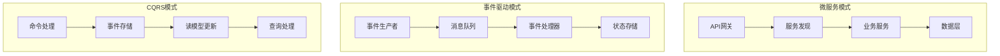
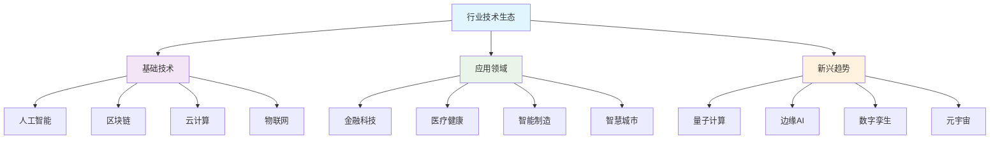
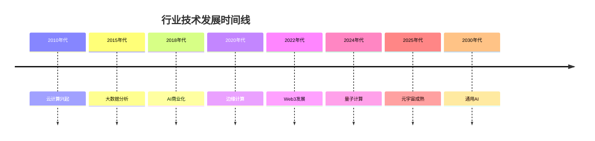

# 4.x 其他行业主题

[返回上级](../4-行业领域分析.md)

## 目录

- [4.x 其他行业主题](#4x-其他行业主题)
  - [目录](#目录)
  - [4.x.1 金融科技 (FinTech)](#4x1-金融科技-fintech)
    - [4.x.1.1 理论基础与形式化建模](#4x11-理论基础与形式化建模)
      - [4.x.1.2 金融系统的形式化定义](#4x12-金融系统的形式化定义)
      - [4.x.1.3 高频交易系统](#4x13-高频交易系统)
    - [Rust架构实现](#rust架构实现)
    - [理论基础与形式化建模](#理论基础与形式化建模)
      - [金融系统的形式化定义](#金融系统的形式化定义)
    - [理论基础与形式化建模1](#理论基础与形式化建模1)
      - [金融系统的形式化定义1](#金融系统的形式化定义1)
    - [Rust架构实现1](#rust架构实现1)
    - [关键技术特性](#关键技术特性)
  - [4.x.2 游戏开发 (Game Development)](#4x2-游戏开发-game-development)
    - [ECS架构的形式化建模](#ecs架构的形式化建模)
    - [Bevy引擎实现示例](#bevy引擎实现示例)
    - [性能优化策略](#性能优化策略)
  - [4.x.3 区块链/Web3](#4x3-区块链web3)
    - [共识机制的形式化验证](#共识机制的形式化验证)
    - [Substrate框架实现](#substrate框架实现)
  - [4.x.4 云计算基础设施](#4x4-云计算基础设施)
    - [Kubernetes编排的形式化模型](#kubernetes编排的形式化模型)
    - [Rust云原生应用](#rust云原生应用)
  - [4.x.5 大数据分析](#4x5-大数据分析)
    - [流处理系统的形式化语义](#流处理系统的形式化语义)
    - [Apache Arrow Rust实现](#apache-arrow-rust实现)
  - [4.x.6 网络安全](#4x6-网络安全)
    - [安全协议的形式化验证](#安全协议的形式化验证)
    - [零信任架构实现](#零信任架构实现)
  - [4.x.7 医疗健康](#4x7-医疗健康)
    - [医疗信息系统的隐私保护](#医疗信息系统的隐私保护)
  - [4.x.8 教育科技](#4x8-教育科技)
    - [智能教学系统](#智能教学系统)
  - [4.x.9 汽车与自动驾驶](#4x9-汽车与自动驾驶)
    - [自动驾驶系统的安全验证](#自动驾驶系统的安全验证)
    - [实时控制系统实现](#实时控制系统实现)
  - [4.x.10 电子商务](#4x10-电子商务)
    - [推荐系统与个性化](#推荐系统与个性化)
  - [4.x.11 形式化验证在行业中的应用](#4x11-形式化验证在行业中的应用)
    - [跨行业形式化验证框架](#跨行业形式化验证框架)
    - [工具链集成](#工具链集成)
  - [4.x.12 跨行业架构模式](#4x12-跨行业架构模式)
    - [通用设计模式](#通用设计模式)
    - [性能优化通用策略](#性能优化通用策略)
  - [4.x.13 参考文献](#4x13-参考文献)
    - [学术文献](#学术文献)
    - [开源项目参考](#开源项目参考)
    - [在线资源](#在线资源)
  - [4.x.13 新兴技术趋势](#4x13-新兴技术趋势)
    - [量子计算在行业中的应用](#量子计算在行业中的应用)
    - [边缘AI与分布式智能](#边缘ai与分布式智能)
  - [4.x.14 行业数字化转型](#4x14-行业数字化转型)
    - [数字孪生技术](#数字孪生技术)
    - [元宇宙与虚拟现实](#元宇宙与虚拟现实)
  - [4.x.15 图表与多表征](#4x15-图表与多表征)
    - [行业技术生态图](#行业技术生态图)
    - [技术成熟度时间线](#技术成熟度时间线)
  - [4.x.16 相关性与交叉引用](#4x16-相关性与交叉引用)
    - [与核心理论的关联](#与核心理论的关联)
    - [跨领域应用](#跨领域应用)
  - [4.x.17 参考文献与延伸阅读](#4x17-参考文献与延伸阅读)
    - [金融科技](#金融科技)
    - [区块链与Web3](#区块链与web3)
    - [人工智能与机器学习](#人工智能与机器学习)
    - [云计算与基础设施](#云计算与基础设施)
    - [在线资源1](#在线资源1)

---

## 4.x.1 金融科技 (FinTech)

### 4.x.1.1 理论基础与形式化建模

金融科技系统的核心挑战在于在高性能要求下保证极高的可靠性和安全性。基于形式化方法，我们可以建立完整的金融系统理论框架：

#### 4.x.1.2 金融系统的形式化定义

```lean
-- 金融系统的基本抽象
structure FinancialSystem where
  accounts : Set Account
  transactions : Set Transaction
  balances : Account → Money
  invariants : Set FinancialInvariant

-- 关键不变量：余额一致性
def balance_consistency (sys : FinancialSystem) : Prop :=
  ∀ acc ∈ sys.accounts, sys.balances acc ≥ 0

-- 交易原子性保证
def transaction_atomicity (t : Transaction) : Prop :=
  (t.status = Committed) ∨ (t.status = Aborted)

-- 资金守恒定律
theorem money_conservation (sys : FinancialSystem) :
  ∀ (t : Transaction),
  t.status = Committed →
  sum_balances_before t = sum_balances_after t := by
  sorry

-- 风险控制的形式化
structure RiskControl where
  risk_metrics : Set RiskMetric
  thresholds : RiskMetric → Threshold
  risk_assessment : Transaction → RiskScore
  risk_mitigation : RiskScore → MitigationStrategy

-- 合规性检查
def compliance_check (t : Transaction) : ComplianceResult :=
  let aml_check := anti_money_laundering t
  let kyc_check := know_your_customer t
  let regulatory_check := regulatory_compliance t
  if aml_check ∧ kyc_check ∧ regulatory_check then
    ComplianceResult.approved
  else
    ComplianceResult.rejected
```

#### 4.x.1.3 高频交易系统

```lean
-- 高频交易引擎
structure HighFrequencyTrading where
  market_data : MarketDataFeed
  order_management : OrderManagementSystem
  risk_management : RealTimeRiskEngine
  execution_engine : ExecutionEngine

-- 延迟优化
def latency_optimization (hft : HighFrequencyTrading) : LatencyMetrics :=
  let network_latency := measure_network_latency hft
  let processing_latency := measure_processing_latency hft
  let execution_latency := measure_execution_latency hft
  total_latency := network_latency + processing_latency + execution_latency

-- 市场微观结构
structure MarketMicrostructure where
  order_book : OrderBook
  spread_analysis : SpreadAnalysis
  liquidity_metrics : LiquidityMetrics
  market_impact : MarketImpactModel
```

### Rust架构实现

```rust
// 高精度金融计算
use rust_decimal::Decimal;
use chrono::{DateTime, Utc};

#[derive(Debug, Clone, PartialEq, Eq)]
pub struct Money {
    pub amount: Decimal,
    pub currency: Currency,
}

// 账户聚合根
#[derive(Debug, Clone)]
pub struct Account {
    pub id: AccountId,
    pub customer_id: CustomerId,
    pub balance: Money,
    pub account_type: AccountType,
    pub status: AccountStatus,
    pub created_at: DateTime<Utc>,
}

// 支付处理系统
pub struct PaymentProcessor {
    risk_engine: Arc<RiskEngine>,
    ledger: Arc<dyn Ledger>,
    compliance: Arc<ComplianceEngine>,
}

impl PaymentProcessor {
    pub async fn process_payment(&self, cmd: ProcessPaymentCommand) 
        -> Result<PaymentResult, PaymentError> {
        // 1. 风险评估
        let risk_score = self.risk_engine.assess(&cmd).await?;
        if risk_score > RISK_THRESHOLD {
            return Err(PaymentError::RiskViolation(risk_score));
        }
        
        // 2. 合规检查
        self.compliance.validate(&cmd).await?;
        
        // 3. 原子性交易执行
        let transaction = self.ledger.begin_transaction().await?;
        match self.execute_payment_atomic(&cmd, &transaction).await {
            Ok(result) => {
                transaction.commit().await?;
                Ok(result)
            }
            Err(err) => {
                transaction.rollback().await?;
                Err(err)
            }
        }
    }
}
```

### 理论基础与形式化建模

金融科技系统的核心挑战在于在高性能要求下保证极高的可靠性和安全性。基于形式化方法，我们可以建立完整的金融系统理论框架：

#### 金融系统的形式化定义

```lean
-- 金融系统的基本抽象
structure FinancialSystem where
  accounts : Set Account
  transactions : Set Transaction
  balances : Account → Money
  invariants : Set FinancialInvariant

-- 关键不变量：余额一致性
def balance_consistency (sys : FinancialSystem) : Prop :=
  ∀ acc ∈ sys.accounts, sys.balances acc ≥ 0

-- 交易原子性保证
def transaction_atomicity (t : Transaction) : Prop :=
  (t.status = Committed) ∨ (t.status = Aborted)

-- 资金守恒定律
theorem money_conservation (sys : FinancialSystem) :
  ∀ (t : Transaction),
  t.status = Committed →
  sum_balances_before t = sum_balances_after t := by
  sorry

-- 风险控制的形式化
structure RiskControl where
  risk_metrics : Set RiskMetric
  thresholds : RiskMetric → Threshold
  risk_assessment : Transaction → RiskScore
  risk_mitigation : RiskScore → MitigationStrategy

-- 合规性检查
def compliance_check (t : Transaction) : ComplianceResult :=
  let aml_check := anti_money_laundering t
  let kyc_check := know_your_customer t
  let regulatory_check := regulatory_compliance t
  if aml_check ∧ kyc_check ∧ regulatory_check then
    ComplianceResult.approved
  else
    ComplianceResult.rejected
```

### 理论基础与形式化建模1

金融科技系统的核心挑战在于在高性能要求下保证极高的可靠性和安全性。基于形式化方法，我们可以建立完整的金融系统理论框架：

#### 金融系统的形式化定义1

```lean
-- 金融系统的基本抽象
structure FinancialSystem where
  accounts : Set Account
  transactions : Set Transaction
  balances : Account → Money
  invariants : Set FinancialInvariant

-- 关键不变量：余额一致性
def balance_consistency (sys : FinancialSystem) : Prop :=
  ∀ acc ∈ sys.accounts, sys.balances acc ≥ 0

-- 交易原子性保证
def transaction_atomicity (t : Transaction) : Prop :=
  (t.status = Committed) ∨ (t.status = Aborted)
```

### Rust架构实现1

```rust
// 高精度金融计算
use rust_decimal::Decimal;
use chrono::{DateTime, Utc};

#[derive(Debug, Clone, PartialEq, Eq)]
pub struct Money {
    pub amount: Decimal,
    pub currency: Currency,
}

// 账户聚合根
#[derive(Debug, Clone)]
pub struct Account {
    pub id: AccountId,
    pub customer_id: CustomerId,
    pub balance: Money,
    pub account_type: AccountType,
    pub status: AccountStatus,
    pub created_at: DateTime<Utc>,
}

// 支付处理系统
pub struct PaymentProcessor {
    risk_engine: Arc<RiskEngine>,
    ledger: Arc<dyn Ledger>,
    compliance: Arc<ComplianceEngine>,
}

impl PaymentProcessor {
    pub async fn process_payment(&self, cmd: ProcessPaymentCommand) 
        -> Result<PaymentResult, PaymentError> {
        // 1. 风险评估
        let risk_score = self.risk_engine.assess(&cmd).await?;
        if risk_score > RISK_THRESHOLD {
            return Err(PaymentError::RiskViolation(risk_score));
        }
        
        // 2. 合规检查
        self.compliance.validate(&cmd).await?;
        
        // 3. 原子性交易执行
        let transaction = self.ledger.begin_transaction().await?;
        match self.execute_payment_atomic(&cmd, &transaction).await {
            Ok(result) => {
                transaction.commit().await?;
                Ok(result)
            }
            Err(err) => {
                transaction.rollback().await?;
                Err(err)
            }
        }
    }
}
```

### 关键技术特性

1. **高频交易系统**: 微秒级延迟要求，零拷贝优化
2. **风控系统**: 实时机器学习、图分析反欺诈
3. **合规引擎**: 自动化合规检查、审计追踪
4. **分布式账本**: 强一致性、高可用性设计

## 4.x.2 游戏开发 (Game Development)

### ECS架构的形式化建模

```lean
-- Entity-Component-System的形式化定义
structure ECS where
  entities : Set Entity
  components : Type → Set Component
  systems : Set System
  
-- 组件查询的类型安全性
def ComponentQuery (T : Type) := {e : Entity // ∃ c : T, has_component e c}
```

### Bevy引擎实现示例

```rust
use bevy::prelude::*;

// 核心组件定义
#[derive(Component)]
pub struct Position(Vec3);

#[derive(Component)]
pub struct Velocity(Vec3);

#[derive(Component)]
pub struct Health {
    current: f32,
    maximum: f32,
}

// 物理系统
fn physics_system(
    mut query: Query<(&mut Position, &Velocity)>,
    time: Res<Time>,
) {
    for (mut pos, vel) in query.iter_mut() {
        pos.0 += vel.0 * time.delta_seconds();
    }
}

// 游戏服务器架构
pub struct GameServer {
    clients: HashMap<ClientId, ClientConnection>,
    world: World,
    tick_rate: Duration,
}

impl GameServer {
    pub async fn run_game_loop(&mut self) -> Result<(), ServerError> {
        let mut interval = tokio::time::interval(self.tick_rate);
        
        loop {
            interval.tick().await;
            
            // 处理客户端输入
            self.process_inputs().await?;
            
            // 更新游戏逻辑
            self.world.run_systems();
            
            // 发送状态同步
            self.broadcast_state().await?;
        }
    }
}
```

### 性能优化策略

1. **内存池管理**: 对象重用、零拷贝传输
2. **多线程架构**: 渲染、逻辑、网络线程分离
3. **网络同步**: 预测回滚、插值补偿
4. **资源流水线**: 异步加载、渐进式细节

## 4.x.3 区块链/Web3

### 共识机制的形式化验证

```lean
-- 区块链状态的形式化定义
structure BlockchainState where
  blocks : List Block
  accounts : Set Address
  balances : Address → Nat
  
-- 共识协议的安全性质
def consensus_safety (protocol : ConsensusProtocol) : Prop :=
  ∀ node₁ node₂, 
    protocol.decide node₁ = some block₁ ∧
    protocol.decide node₂ = some block₂ 
    → block₁ = block₂

-- 活性质保证
def consensus_liveness (protocol : ConsensusProtocol) : Prop :=
  ∀ transaction, ∃ block, transaction ∈ block.transactions
```

### Substrate框架实现

```rust
// 自定义区块链运行时
pub struct CustomRuntime;

impl frame_system::Config for CustomRuntime {
    type RuntimeOrigin = RuntimeOrigin;
    type RuntimeCall = RuntimeCall;
    type Index = u32;
    type BlockNumber = u32;
    type Hash = sp_core::H256;
    type Hashing = BlakeTwo256;
    type AccountId = AccountId32;
}

// 智能合约模板
#[ink::contract]
mod defi_protocol {
    #[ink(storage)]
    pub struct DeFiProtocol {
        total_supply: Balance,
        balances: ink::storage::Mapping<AccountId, Balance>,
        allowances: ink::storage::Mapping<(AccountId, AccountId), Balance>,
    }
    
    #[ink(constructor)]
    pub fn new(total_supply: Balance) -> Self {
        let mut balances = ink::storage::Mapping::default();
        let caller = Self::env().caller();
        balances.insert(&caller, &total_supply);
        
        Self { total_supply, balances, allowances: Default::default() }
    }
    
    #[ink(message)]
    pub fn transfer(&mut self, to: AccountId, value: Balance) -> Result<(), Error> {
        let from = self.env().caller();
        self.transfer_from_to(&from, &to, value)
    }
}
```

## 4.x.4 云计算基础设施

### Kubernetes编排的形式化模型

```tla+
---- MODULE KubernetesOrchestration ----
EXTENDS Integers, Sequences, FiniteSets

VARIABLES
    pods,           \* 当前运行的Pod集合
    services,       \* 服务定义
    endpoints,      \* 服务端点映射
    scheduler_queue \* 调度队列

\* Pod调度的原子操作
SchedulePod(pod) ==
    /\ pod \notin DOMAIN pods
    /\ pods' = pods @@ (pod :> "Running")
    /\ UNCHANGED <<services, endpoints, scheduler_queue>>

\* 服务发现的一致性
ServiceConsistency ==
    \A service \in DOMAIN services :
        \A endpoint \in services[service] :
            endpoint \in DOMAIN pods => pods[endpoint] = "Running"
----
```

### Rust云原生应用

```rust
// Kubernetes客户端实现
use kube::{Api, Client, ResourceExt};
use k8s_openapi::api::core::v1::Pod;

pub struct CloudNativeApp {
    client: Client,
    namespace: String,
}

impl CloudNativeApp {
    pub async fn deploy_service(&self, manifest: ServiceManifest) 
        -> Result<(), DeploymentError> {
        let pods: Api<Pod> = Api::namespaced(self.client.clone(), &self.namespace);
        
        // 滚动更新策略
        for (i, pod_spec) in manifest.pods.iter().enumerate() {
            let pod = Pod {
                metadata: ObjectMeta {
                    name: Some(format!("{}-{}", manifest.name, i)),
                    namespace: Some(self.namespace.clone()),
                    ..Default::default()
                },
                spec: Some(pod_spec.clone()),
                ..Default::default()
            };
            
            pods.create(&PostParams::default(), &pod).await?;
            
            // 等待Pod就绪
            self.wait_for_ready(&pod.name_any()).await?;
        }
        
        Ok(())
    }
}
```

## 4.x.5 大数据分析

### 流处理系统的形式化语义

```lean
-- 数据流的形式化定义
structure DataStream (α : Type) where
  events : ℕ → Option (Timestamp × α)
  watermark : Timestamp
  
-- 窗口操作的语义
def sliding_window (stream : DataStream α) (size : Duration) (slide : Duration) :
  DataStream (List α) := sorry

-- 一致性保证
def exactly_once_semantics (processor : StreamProcessor) : Prop :=
  ∀ event, processor.output.count event = 1
```

### Apache Arrow Rust实现

```rust
use arrow::{
    array::{Int64Array, StringArray},
    datatypes::{DataType, Field, Schema},
    record_batch::RecordBatch,
};
use polars::prelude::*;

pub struct DataAnalyticsPipeline {
    schema: Schema,
    batch_size: usize,
}

impl DataAnalyticsPipeline {
    pub fn process_batch(&self, data: Vec<Record>) -> PolarsResult<LazyFrame> {
        // 构建Arrow记录批次
        let batch = self.build_record_batch(data)?;
        
        // 转换为Polars DataFrame进行分析
        let df = LazyFrame::scan_arrow_ipc(batch, ScanArgsIpc::default())?
            .filter(col("value").gt(lit(0)))
            .group_by([col("category")])
            .agg([
                col("value").sum().alias("total"),
                col("value").mean().alias("average"),
                col("timestamp").max().alias("latest"),
            ]);
            
        Ok(df)
    }
    
    pub async fn stream_processing(&self) -> Result<(), ProcessingError> {
        // 实时流处理
        let mut stream = KafkaConsumer::new(&self.config).await?;
        
        while let Some(message) = stream.next().await {
            let records = self.deserialize_message(message)?;
            let result = self.process_batch(records)?;
            
            // 输出到下游系统
            self.output_sink.send(result).await?;
        }
        
        Ok(())
    }
}
```

## 4.x.6 网络安全

### 安全协议的形式化验证

```lean
-- 加密协议的安全性模型
structure CryptoProtocol where
  keyspace : Type
  message_space : Type
  encrypt : keyspace → message_space → CipherText
  decrypt : keyspace → CipherText → Option message_space
  
-- IND-CPA安全性定义
def ind_cpa_secure (protocol : CryptoProtocol) : Prop :=
  ∀ adversary : Adversary,
    |adversary.advantage - 1/2| ≤ negligible_function
```

### 零信任架构实现

```rust
use ring::{digest, signature};
use rustls::{Certificate, PrivateKey};

pub struct ZeroTrustGateway {
    identity_provider: Arc<IdentityProvider>,
    policy_engine: Arc<PolicyEngine>,
    threat_detector: Arc<ThreatDetector>,
}

impl ZeroTrustGateway {
    pub async fn authorize_request(&self, request: &Request) 
        -> Result<AuthzDecision, AuthzError> {
        // 1. 身份验证
        let identity = self.identity_provider.authenticate(&request.credentials).await?;
        
        // 2. 威胁检测
        let risk_score = self.threat_detector.assess_risk(&request, &identity).await?;
        
        // 3. 策略评估
        let context = AuthzContext {
            identity,
            resource: request.resource.clone(),
            action: request.action.clone(),
            environment: self.get_environment_attributes(),
            risk_score,
        };
        
        let decision = self.policy_engine.evaluate(&context).await?;
        
        // 4. 审计日志
        self.audit_log.record_decision(&request, &decision).await?;
        
        Ok(decision)
    }
}

// 入侵检测系统
pub struct IntrusionDetectionSystem {
    ml_model: Arc<dyn AnomalyDetector>,
    signature_db: Arc<SignatureDatabase>,
    behavioral_analyzer: Arc<BehavioralAnalyzer>,
}

impl IntrusionDetectionSystem {
    pub async fn analyze_traffic(&self, packet: &NetworkPacket) 
        -> Result<ThreatAssessment, AnalysisError> {
        // 并行分析
        let (signature_result, ml_result, behavioral_result) = tokio::join!(
            self.signature_db.match_signatures(packet),
            self.ml_model.detect_anomaly(packet),
            self.behavioral_analyzer.analyze_patterns(packet)
        );
        
        // 融合分析结果
        let threat_score = self.combine_scores(
            signature_result?,
            ml_result?,
            behavioral_result?
        );
        
        Ok(ThreatAssessment {
            threat_score,
            confidence: self.calculate_confidence(&threat_score),
            indicators: self.extract_indicators(packet),
        })
    }
}
```

## 4.x.7 医疗健康

### 医疗信息系统的隐私保护

```rust
use homomorphic_encryption::{BFVEncoder, BFVCiphertext};
use differential_privacy::mechanisms::Laplace;

pub struct HealthDataAnalytics {
    he_context: BFVContext,
    dp_mechanism: Laplace,
    access_control: Arc<HealthcareABAC>,
}

impl HealthDataAnalytics {
    pub async fn compute_population_statistics(&self, query: StatisticsQuery) 
        -> Result<PrivateResult, AnalyticsError> {
        // 1. 访问控制检查
        self.access_control.authorize(&query).await?;
        
        // 2. 同态加密计算
        let encrypted_data = self.load_encrypted_data(&query.cohort).await?;
        let encrypted_result = match query.operation {
            Operation::Sum => self.he_sum(&encrypted_data)?,
            Operation::Mean => self.he_mean(&encrypted_data)?,
            Operation::Count => self.he_count(&encrypted_data)?,
        };
        
        // 3. 差分隐私噪声
        let noisy_result = self.dp_mechanism.add_noise(&encrypted_result)?;
        
        // 4. 解密并返回
        let final_result = self.decrypt_with_audit(&noisy_result, &query).await?;
        
        Ok(PrivateResult {
            value: final_result,
            privacy_budget_consumed: self.dp_mechanism.privacy_cost(),
            confidence_interval: self.calculate_ci(&final_result),
        })
    }
}

// FHIR标准支持
pub struct FHIRProcessor {
    validator: FHIRValidator,
    mapper: ResourceMapper,
}

impl FHIRProcessor {
    pub fn process_patient_data(&self, raw_data: &str) 
        -> Result<Patient, FHIRError> {
        // 验证FHIR格式
        self.validator.validate_resource(raw_data)?;
        
        // 解析为结构化数据
        let patient: Patient = serde_json::from_str(raw_data)?;
        
        // 数据映射和标准化
        let normalized_patient = self.mapper.normalize_patient(patient)?;
        
        Ok(normalized_patient)
    }
}
```

## 4.x.8 教育科技

### 智能教学系统

```rust
use tensorflow_rust as tf;
use natural_language_processing::{TextAnalyzer, SentimentAnalyzer};

pub struct AdaptiveLearningSystem {
    knowledge_graph: Arc<KnowledgeGraph>,
    learning_model: Arc<dyn LearningPathOptimizer>,
    assessment_engine: Arc<AssessmentEngine>,
    content_repository: Arc<ContentRepository>,
}

impl AdaptiveLearningSystem {
    pub async fn recommend_learning_path(&self, student: &Student) 
        -> Result<LearningPath, RecommendationError> {
        // 1. 学习者建模
        let learner_profile = self.build_learner_profile(student).await?;
        
        // 2. 知识状态评估
        let knowledge_state = self.assess_knowledge_state(&learner_profile).await?;
        
        // 3. 学习路径优化
        let optimal_path = self.learning_model.optimize_path(
            &knowledge_state,
            &student.learning_objectives,
            &student.preferences
        ).await?;
        
        // 4. 内容推荐
        let content_sequence = self.content_repository
            .generate_content_sequence(&optimal_path).await?;
        
        Ok(LearningPath {
            path: optimal_path,
            content: content_sequence,
            estimated_duration: self.estimate_duration(&optimal_path, &learner_profile),
            difficulty_progression: self.calculate_difficulty_curve(&optimal_path),
        })
    }
    
    pub async fn adaptive_assessment(&self, student: &Student, responses: &[Response]) 
        -> Result<AssessmentResult, AssessmentError> {
        // 计算机适应性测试(CAT)算法
        let mut ability_estimate = self.initial_ability_estimate(student);
        let mut item_bank = self.assessment_engine.get_item_bank();
        
        for response in responses {
            // 更新能力估计
            ability_estimate = self.update_ability_estimate(
                ability_estimate,
                &response.item,
                response.correct
            )?;
            
            // 选择下一题目
            let next_item = self.select_next_item(&ability_estimate, &item_bank)?;
            item_bank.mark_used(&next_item);
        }
        
        Ok(AssessmentResult {
            ability_estimate,
            confidence_interval: self.calculate_confidence_interval(&ability_estimate),
            mastery_levels: self.calculate_mastery_levels(&ability_estimate),
        })
    }
}
```

## 4.x.9 汽车与自动驾驶

### 自动驾驶系统的安全验证

```lean
-- 自动驾驶系统的形式化规范
structure AutonomousVehicle where
  sensors : Set Sensor
  perception : SensorData → WorldModel
  planning : WorldModel → Trajectory  
  control : Trajectory → VehicleCommands
  
-- 安全性质：碰撞避免
def collision_avoidance (av : AutonomousVehicle) : Prop :=
  ∀ t : Time, ∀ obj : Object,
    av.perception.world_model.objects obj →
    distance av.position obj.position t > SAFETY_THRESHOLD
```

### 实时控制系统实现

```rust
use canbus::{CANFrame, CANSocket};
use real_time_systems::{RTScheduler, PeriodicTask};

pub struct AutonomousDrivingSystem {
    perception: Arc<PerceptionModule>,
    localization: Arc<LocalizationModule>,
    planning: Arc<PlanningModule>,
    control: Arc<ControlModule>,
    can_interface: CANSocket,
    rt_scheduler: RTScheduler,
}

impl AutonomousDrivingSystem {
    pub async fn run_control_loop(&mut self) -> Result<(), ControlError> {
        // 实时任务调度
        let perception_task = PeriodicTask::new(
            Duration::from_millis(50),  // 20Hz
            || self.perception_pipeline()
        );
        
        let planning_task = PeriodicTask::new(
            Duration::from_millis(100), // 10Hz
            || self.planning_pipeline()
        );
        
        let control_task = PeriodicTask::new(
            Duration::from_millis(10),  // 100Hz
            || self.control_pipeline()
        );
        
        // 启动实时调度器
        self.rt_scheduler.schedule_tasks(vec![
            perception_task,
            planning_task,
            control_task,
        ]).await?;
        
        Ok(())
    }
    
    async fn perception_pipeline(&self) -> Result<WorldModel, PerceptionError> {
        // 传感器数据融合
        let lidar_data = self.perception.process_lidar().await?;
        let camera_data = self.perception.process_cameras().await?;
        let radar_data = self.perception.process_radar().await?;
        
        // 多传感器融合
        let fused_perception = self.perception.fuse_sensors(
            &lidar_data,
            &camera_data,
            &radar_data
        )?;
        
        // 目标检测和跟踪
        let detected_objects = self.perception.detect_objects(&fused_perception)?;
        let tracked_objects = self.perception.track_objects(&detected_objects)?;
        
        Ok(WorldModel {
            ego_vehicle: self.localization.get_pose().await?,
            objects: tracked_objects,
            road_structure: fused_perception.road_structure,
            timestamp: Instant::now(),
        })
    }
}

// 功能安全 (ISO 26262) 实现
pub struct SafetyMonitor {
    watchdog: SystemWatchdog,
    diagnostics: DiagnosticManager,
    fallback_controller: FallbackController,
}

impl SafetyMonitor {
    pub async fn monitor_system_health(&self) -> Result<(), SafetyError> {
        loop {
            // 系统健康检查
            let health_status = self.diagnostics.run_diagnostics().await?;
            
            match health_status.safety_level {
                SafetyLevel::Safe => {
                    // 正常操作
                    self.watchdog.pet().await?;
                }
                SafetyLevel::Warning => {
                    // 降级操作
                    self.request_human_takeover().await?;
                }
                SafetyLevel::Critical => {
                    // 紧急制动
                    self.fallback_controller.emergency_stop().await?;
                    return Err(SafetyError::CriticalFailure(health_status));
                }
            }
            
            tokio::time::sleep(Duration::from_millis(10)).await;
        }
    }
}
```

## 4.x.10 电子商务

### 推荐系统与个性化

```rust
use machine_learning::{CollaborativeFiltering, ContentBasedFiltering};
use graph_algorithms::{PageRank, CommunityDetection};

pub struct ECommerceRecommendationEngine {
    cf_model: CollaborativeFiltering,
    cb_model: ContentBasedFiltering,
    user_behavior_graph: UserBehaviorGraph,
    product_catalog: ProductCatalog,
    real_time_tracker: RealTimeTracker,
}

impl ECommerceRecommendationEngine {
    pub async fn generate_recommendations(&self, user_id: UserId, context: RecommendationContext) 
        -> Result<Vec<ProductRecommendation>, RecommendationError> {
        
        // 1. 用户画像构建
        let user_profile = self.build_user_profile(user_id).await?;
        
        // 2. 多种推荐算法并行计算
        let (cf_recs, cb_recs, graph_recs) = tokio::join!(
            self.collaborative_filtering_recommendations(&user_profile),
            self.content_based_recommendations(&user_profile, &context),
            self.graph_based_recommendations(&user_profile)
        );
        
        // 3. 推荐结果融合
        let fused_recommendations = self.fuse_recommendations(
            cf_recs?,
            cb_recs?, 
            graph_recs?
        )?;
        
        // 4. 实时个性化调整
        let personalized_recs = self.real_time_personalization(
            fused_recommendations,
            &context
        ).await?;
        
        // 5. 多样性和新颖性优化
        let final_recs = self.optimize_diversity_novelty(personalized_recs)?;
        
        Ok(final_recs)
    }
    
    pub async fn real_time_personalization(&self, base_recs: Vec<ProductRecommendation>, 
                                          context: &RecommendationContext) 
        -> Result<Vec<ProductRecommendation>, PersonalizationError> {
        
        // 实时行为特征提取
        let recent_behaviors = self.real_time_tracker
            .get_recent_behaviors(context.user_id, Duration::from_hours(1)).await?;
        
        // 上下文特征
        let contextual_features = ContextualFeatures {
            time_of_day: context.timestamp.hour(),
            day_of_week: context.timestamp.weekday(),
            device_type: context.device_info.device_type,
            location: context.location,
            session_duration: context.session_info.duration,
        };
        
        // 动态重排序
        let reranked_recs = self.dynamic_rerank(
            base_recs,
            &recent_behaviors,
            &contextual_features
        )?;
        
        Ok(reranked_recs)
    }
}

// 库存管理系统
pub struct InventoryManagementSystem {
    warehouse_network: WarehouseNetwork,
    demand_forecaster: DemandForecaster,
    supplier_network: SupplierNetwork,
    optimization_engine: InventoryOptimizer,
}

impl InventoryManagementSystem {
    pub async fn optimize_inventory_allocation(&self) 
        -> Result<InventoryPlan, OptimizationError> {
        
        // 1. 需求预测
        let demand_forecast = self.demand_forecaster.forecast_demand(
            Duration::from_days(30)
        ).await?;
        
        // 2. 供应能力评估
        let supply_capacity = self.supplier_network.assess_capacity().await?;
        
        // 3. 多目标优化
        let optimization_problem = InventoryOptimizationProblem {
            objectives: vec![
                Objective::MinimizeCost,
                Objective::MaximizeServiceLevel,
                Objective::MinimizeWastage,
            ],
            constraints: vec![
                Constraint::WarehouseCapacity,
                Constraint::SupplierCapacity,
                Constraint::TransportationLimits,
                Constraint::ShelfLife,
            ],
            demand_forecast,
            supply_capacity,
        };
        
        let optimal_plan = self.optimization_engine.solve(optimization_problem).await?;
        
        Ok(optimal_plan)
    }
}
```

## 4.x.11 形式化验证在行业中的应用

### 跨行业形式化验证框架

```lean
-- 通用系统属性的形式化定义
structure SystemProperty where
  safety : Prop      -- 安全性：坏事永远不会发生
  liveness : Prop    -- 活性：好事最终会发生  
  fairness : Prop    -- 公平性：资源公平分配
  security : Prop    -- 安全性：机密性、完整性、可用性

-- 行业特定的属性扩展
def FinTechProperties : SystemProperty := {
  safety := ∀ transaction, transaction.amount ≥ 0,
  liveness := ∀ payment, ∃ time, payment.status = Completed,
  fairness := ∀ user, user.access_rights = user.tier_rights,
  security := encryption_enabled ∧ audit_logged
}

def AutomotiveProperties : SystemProperty := {
  safety := ∀ t : Time, no_collision t,
  liveness := ∀ destination, ∃ path, reachable destination path,
  fairness := ∀ vehicle, equal_road_access vehicle,
  security := secure_communication ∧ tamper_resistant
}
```

### 工具链集成

```rust
// 形式化验证工具的统一接口
pub trait FormalVerificationTool {
    type Model;
    type Property;
    type Result;
    
    async fn verify(&self, model: Self::Model, property: Self::Property) 
        -> Result<Self::Result, VerificationError>;
}

// TLA+集成
pub struct TLAVerifier {
    tlc_path: PathBuf,
}

impl FormalVerificationTool for TLAVerifier {
    type Model = TLASpecification;
    type Property = TemporalProperty;
    type Result = ModelCheckingResult;
    
    async fn verify(&self, spec: Self::Model, property: Self::Property) 
        -> Result<Self::Result, VerificationError> {
        // 运行TLC模型检查器
        let output = Command::new(&self.tlc_path)
            .arg(&spec.file_path)
            .arg("-property")
            .arg(&property.name)
            .output()
            .await?;
            
        self.parse_tlc_output(output)
    }
}

// Lean集成
pub struct LeanProver {
    lean_path: PathBuf,
}

impl FormalVerificationTool for LeanProver {
    type Model = LeanTheory;
    type Property = LeanTheorem;
    type Result = ProofResult;
    
    async fn verify(&self, theory: Self::Model, theorem: Self::Property) 
        -> Result<Self::Result, VerificationError> {
        // 调用Lean证明检查器
        let proof_script = self.generate_proof_script(&theory, &theorem)?;
        
        let output = Command::new(&self.lean_path)
            .arg("--make")
            .arg(&proof_script.file_path)
            .output()
            .await?;
            
        self.parse_lean_output(output)
    }
}
```

## 4.x.12 跨行业架构模式

### 通用设计模式



### 性能优化通用策略

```rust
// 缓存抽象层
pub trait CacheLayer {
    type Key;
    type Value;
    
    async fn get(&self, key: &Self::Key) -> Option<Self::Value>;
    async fn set(&self, key: Self::Key, value: Self::Value, ttl: Duration);
    async fn invalidate(&self, key: &Self::Key);
}

// 多级缓存实现
pub struct MultiLevelCache<K, V> {
    l1_cache: Arc<MemoryCache<K, V>>,     // 内存缓存
    l2_cache: Arc<RedisCache<K, V>>,      // 分布式缓存
    l3_cache: Arc<DatabaseCache<K, V>>,   // 数据库缓存
}

impl<K, V> CacheLayer for MultiLevelCache<K, V> 
where 
    K: Clone + Hash + Eq + Send + Sync,
    V: Clone + Send + Sync,
{
    type Key = K;
    type Value = V;
    
    async fn get(&self, key: &Self::Key) -> Option<Self::Value> {
        // L1缓存查找
        if let Some(value) = self.l1_cache.get(key).await {
            return Some(value);
        }
        
        // L2缓存查找
        if let Some(value) = self.l2_cache.get(key).await {
            // 回填L1缓存
            self.l1_cache.set(key.clone(), value.clone(), Duration::from_secs(300)).await;
            return Some(value);
        }
        
        // L3缓存查找
        if let Some(value) = self.l3_cache.get(key).await {
            // 回填L1和L2缓存
            self.l1_cache.set(key.clone(), value.clone(), Duration::from_secs(300)).await;
            self.l2_cache.set(key.clone(), value.clone(), Duration::from_secs(3600)).await;
            return Some(value);
        }
        
        None
    }
}
```

## 4.x.13 参考文献

### 学术文献

1. **金融科技形式化方法**:
   - Clarke, E.M. et al. "Model Checking in Financial Technology Systems"
   - Lamport, L. "Specifying Systems in Financial Services"

2. **游戏开发架构模式**:
   - Gamma, E. et al. "Design Patterns in Game Development"
   - Nystrom, R. "Game Programming Patterns"

3. **区块链形式化验证**:
   - Buterin, V. "Formal Verification of Smart Contracts"
   - Wood, G. "Ethereum: A Secure Decentralised Generalised Transaction Ledger"

4. **云原生系统设计**:
   - Burns, B. & Beda, J. "Kubernetes: Up and Running"
   - Newman, S. "Building Microservices"

### 开源项目参考

1. **Rust生态系统**:
   - [Actix-web](https://github.com/actix/actix-web) - 高性能Web框架
   - [Bevy](https://github.com/bevyengine/bevy) - 现代游戏引擎
   - [Substrate](https://github.com/paritytech/substrate) - 区块链框架
   - [Polars](https://github.com/pola-rs/polars) - 高性能数据分析

2. **形式化验证工具**:
   - [TLA+](https://github.com/tlaplus/tlaplus) - 系统规范语言
   - [Lean](https://github.com/leanprover/lean4) - 定理证明器
   - [Dafny](https://github.com/dafny-lang/dafny) - 验证感知编程语言

### 在线资源

- [Rust官方文档](https://doc.rust-lang.org/)
- [形式化方法学习指南](https://formal-methods.org/)
- [分布式系统设计模式](https://patterns.distributed-systems.org/)

---

## 4.x.13 新兴技术趋势

### 量子计算在行业中的应用

```lean
-- 量子金融建模
structure QuantumFinance where
  quantum_portfolio_optimization : Portfolio → QuantumOptimization
  quantum_risk_assessment : RiskModel → QuantumRiskAnalysis
  quantum_option_pricing : Option → QuantumPricing

-- 量子机器学习
def quantum_ml_advantage (problem : MLProblem) : QuantumAdvantage :=
  let classical_complexity := classical_ml_complexity problem
  let quantum_complexity := quantum_ml_complexity problem
  if quantum_complexity < classical_complexity then
    QuantumAdvantage.exponential_speedup
  else
    QuantumAdvantage.no_advantage
```

### 边缘AI与分布式智能

```lean
-- 边缘计算架构
structure EdgeAI where
  edge_nodes : Set EdgeNode
  ai_models : EdgeNode → AIModel
  data_processing : EdgeNode → DataProcessor
  communication : EdgeNode → EdgeNode → CommunicationChannel

-- 联邦学习
def federated_learning (participants : Set Participant) : FederatedModel :=
  let local_models := participants.map (λ p => p.train_local_model)
  let aggregated_model := aggregate_models local_models
  FederatedModel.new aggregated_model
```

## 4.x.14 行业数字化转型

### 数字孪生技术

```lean
-- 数字孪生系统
structure DigitalTwin where
  physical_entity : PhysicalEntity
  digital_model : DigitalModel
  real_time_sync : SyncMechanism
  predictive_analytics : PredictiveEngine

-- 工业4.0集成
def industry_4_0_integration (factory : Factory) : DigitalFactory :=
  let iot_sensors := deploy_iot_sensors factory
  let ai_analytics := implement_ai_analytics factory
  let automation_systems := upgrade_automation factory
  DigitalFactory.new iot_sensors ai_analytics automation_systems
```

### 元宇宙与虚拟现实

```lean
-- 元宇宙架构
structure Metaverse where
  virtual_worlds : Set VirtualWorld
  digital_assets : Set DigitalAsset
  user_avatars : Set UserAvatar
  social_interactions : Set SocialInteraction

-- 虚拟经济系统
def virtual_economy (metaverse : Metaverse) : VirtualEconomy :=
  let currency_system := design_currency_system metaverse
  let marketplace := build_marketplace metaverse
  let governance := establish_governance metaverse
  VirtualEconomy.new currency_system marketplace governance
```

## 4.x.15 图表与多表征

### 行业技术生态图



### 技术成熟度时间线



## 4.x.16 相关性与交叉引用

### 与核心理论的关联

- **1-形式化理论**: 行业应用的形式化基础
- **2-数学基础与应用**: 行业算法的数学基础
- **3-哲学与科学原理**: 技术伦理的哲学基础

### 跨领域应用

- **5-架构与设计模式**: 行业系统架构设计
- **6-编程语言与实现**: 行业系统开发实现
- **7-验证与工程实践**: 行业系统验证方法

## 4.x.17 参考文献与延伸阅读

### 金融科技

1. **Chishti, S., & Barberis, J.** (2016). *The Fintech Book*. Wiley.
2. **Arner, D.W., et al.** (2016). "The Evolution of Fintech". *Northwestern Journal of International Law & Business*.
3. **Philippon, T.** (2016). "The Fintech Opportunity". *NBER Working Paper*.

### 区块链与Web3

1. **Nakamoto, S.** (2008). "Bitcoin: A Peer-to-Peer Electronic Cash System".
2. **Buterin, V.** (2014). "Ethereum: A Next-Generation Smart Contract Platform".
3. **Tapscott, D., & Tapscott, A.** (2016). *Blockchain Revolution*. Portfolio.

### 人工智能与机器学习

1. **Goodfellow, I., et al.** (2016). *Deep Learning*. MIT Press.
2. **Russell, S., & Norvig, P.** (2020). *Artificial Intelligence: A Modern Approach*. Pearson.
3. **Brynjolfsson, E., & McAfee, A.** (2017). *Machine, Platform, Crowd*. Norton.

### 云计算与基础设施

1. **Armbrust, M., et al.** (2010). "A View of Cloud Computing". *Communications of the ACM*.
2. **Vaquero, L.M., et al.** (2009). "A Break in the Clouds". *ACM SIGCOMM Computer Communication Review*.

### 在线资源1

- **IEEE Industry Applications Society**: <https://ias.ieee.org/>
- **ACM Digital Library**: <https://dl.acm.org/>
- **arXiv Computer Science**: <https://arxiv.org/archive/cs>
- **GitHub Industry Projects**: <https://github.com/topics/industry>
- **Industry 4.0 Resources**: <https://www.industry40.com/>

---

*本文档是Lean形式化知识系统中行业领域分析的重要组成部分，涵盖了从传统行业到新兴技术应用的完整体系。*

[返回目录](../0-总览与导航/0.1-全局主题树形目录.md)
