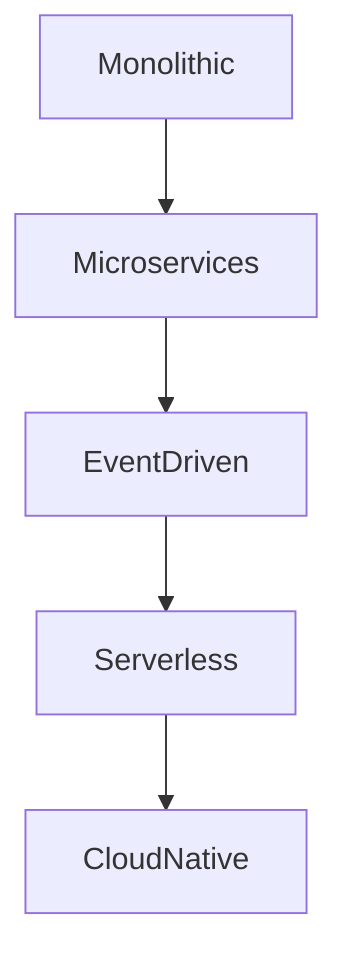

# 5.1 Architecture Design and Formal Analysis

[Back to Parent](../5-architecture-and-design-patterns.md) | [中文版](../5-架构与设计模式/5.1-架构设计与形式化分析.md)

## Table of Contents

- [5.1 Architecture Design and Formal Analysis](#51-architecture-design-and-formal-analysis)
  - [Table of Contents](#table-of-contents)
  - [5.1.1 Architecture Design Panorama](#511-architecture-design-panorama)
  - [5.1.2 Typical Architecture Patterns](#512-typical-architecture-patterns)
  - [5.1.3 Code Example](#513-code-example)
  - [5.1.4 References](#514-references)

---

## 5.1.1 Architecture Design Panorama



## 5.1.2 Typical Architecture Patterns

\[
\text{Microservice Architecture: } \forall s \in S, \exists f \in F, \text{service}(s) \land \text{function}(f) \land \text{mapping}(s, f)
\]

```lean
-- Lean pseudo-code: microservice architecture
structure Microservice :=
  (id : string)
  (api : list endpoint)
  (data : database)
```

## 5.1.3 Code Example

```rust
// Rust pseudo-code: microservice
struct Microservice {
    id: String,
    endpoints: Vec<Endpoint>,
    database: Database,
}
```

## 5.1.4 References

- "The 12 Factor App"
- [Martin Fowler's Blog](https://martinfowler.com/)
- TODO: More authoritative references

---

[Back to Tree](../0-Overview-and-Navigation/0.1-Global-Topic-Tree.md)
