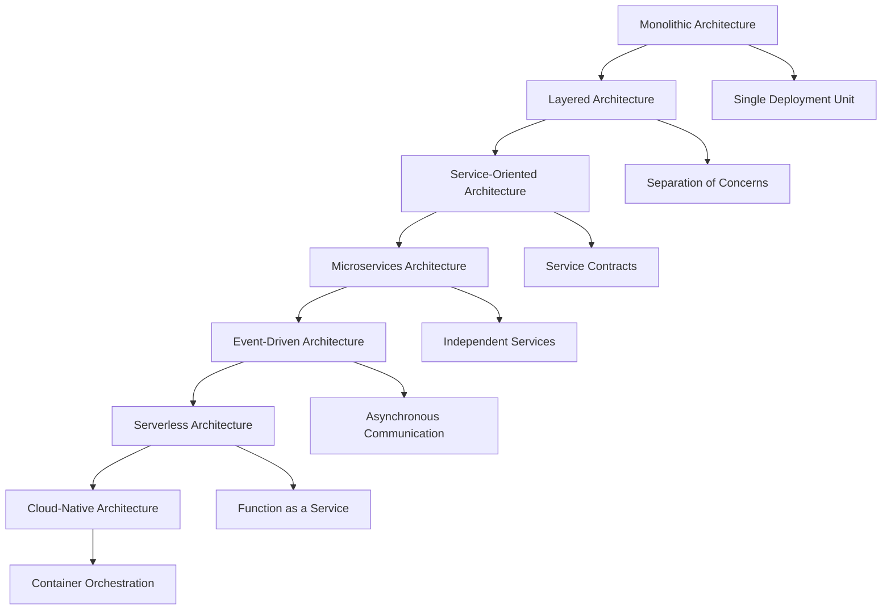

# 5.1 Architecture Design and Formal Analysis

[Back to Parent](../5-architecture-and-design-patterns.md) | [中文版](../5-架构与设计模式/5.1-架构设计与形式化分析.md)

## Table of Contents

- [5.1 Architecture Design and Formal Analysis](#51-architecture-design-and-formal-analysis)
  - [Table of Contents](#table-of-contents)
  - [5.1.1 Software Architecture Evolution and Theory](#511-software-architecture-evolution-and-theory)
    - [From Monolithic to Cloud-Native Architecture](#from-monolithic-to-cloud-native-architecture)
    - [Formal Architecture Description Languages](#formal-architecture-description-languages)
  - [5.1.2 Architecture Pattern Formalization](#512-architecture-pattern-formalization)
    - [Microservices Architecture Modeling](#microservices-architecture-modeling)
    - [Event-Driven Architecture Verification](#event-driven-architecture-verification)
  - [5.1.3 Quality Attribute Analysis](#513-quality-attribute-analysis)
    - [Performance and Scalability](#performance-and-scalability)
    - [Reliability and Fault Tolerance](#reliability-and-fault-tolerance)
  - [5.1.4 Modern Architecture Implementation](#514-modern-architecture-implementation)
    - [Service Mesh and Infrastructure](#service-mesh-and-infrastructure)
    - [Containerization and Orchestration](#containerization-and-orchestration)
  - [5.1.5 Architecture Evaluation and Evolution](#515-architecture-evaluation-and-evolution)
    - [Evolution Strategies](#evolution-strategies)
    - [Migration Techniques](#migration-techniques)
  - [5.1.6 References and Further Reading](#516-references-and-further-reading)
    - [Core Architecture References](#core-architecture-references)
    - [Formal Methods and Verification](#formal-methods-and-verification)
    - [Online Resources](#online-resources)

---

## 5.1.1 Software Architecture Evolution and Theory

### From Monolithic to Cloud-Native Architecture

The evolution of software architecture reflects the changing requirements of modern distributed systems:



### Formal Architecture Description Languages

```lean
-- Formal specification of software architecture
structure SoftwareArchitecture where
  components : Set Component
  connectors : Set Connector
  configuration : Configuration
  constraints : Set ArchitecturalConstraint

-- Component definition with interfaces
structure Component where
  id : ComponentId
  interfaces : Set Interface
  behavior : ComponentBehavior
  properties : Set Property

-- Connector for component interaction
structure Connector where
  id : ConnectorId
  roles : Set Role
  glue : ConnectorBehavior
  protocol : CommunicationProtocol

-- Architectural constraint specification
inductive ArchitecturalConstraint where
  | topology : TopologyConstraint → ArchitecturalConstraint
  | interaction : InteractionConstraint → ArchitecturalConstraint  
  | resource : ResourceConstraint → ArchitecturalConstraint
  | quality : QualityConstraint → ArchitecturalConstraint

-- Quality attribute formalization
def satisfies_quality_attribute (arch : SoftwareArchitecture) 
  (attr : QualityAttribute) : Prop :=
  match attr with
  | QualityAttribute.performance threshold => 
      ∀ c ∈ arch.components, response_time c ≤ threshold
  | QualityAttribute.scalability factor =>
      scalable arch factor
  | QualityAttribute.reliability availability =>
      system_availability arch ≥ availability
```

## 5.1.2 Architecture Pattern Formalization

### Microservices Architecture Modeling

```rust
// Formal modeling of microservices architecture
use serde::{Deserialize, Serialize};
use std::collections::HashMap;

#[derive(Debug, Clone, Serialize, Deserialize)]
pub struct MicroserviceArchitecture {
    services: HashMap<ServiceId, Microservice>,
    communication: CommunicationTopology,
    data_consistency: ConsistencyModel,
    service_discovery: ServiceDiscoveryMechanism,
}

#[derive(Debug, Clone)]
pub struct Microservice {
    id: ServiceId,
    domain: BusinessDomain,
    api: ServiceAPI,
    data_store: DataStore,
    dependencies: Vec<ServiceId>,
    deployment: DeploymentConfiguration,
}

// Service interaction patterns
#[derive(Debug, Clone)]
pub enum CommunicationPattern {
    RequestResponse(SynchronousCall),
    EventDriven(AsynchronousEvent),
    StreamProcessing(DataStream),
    GraphQL(QueryInterface),
}

impl MicroserviceArchitecture {
    /// Verify architectural constraints
    pub fn verify_constraints(&self) -> ArchitectureVerificationResult {
        let mut violations = Vec::new();
        
        // Check service autonomy
        for (id, service) in &self.services {
            if !self.is_autonomous(service) {
                violations.push(ConstraintViolation::LackOfAutonomy(*id));
            }
        }
        
        // Verify data consistency boundaries
        if !self.verify_data_boundaries() {
            violations.push(ConstraintViolation::DataBoundaryViolation);
        }
        
        // Check communication patterns
        if !self.verify_communication_patterns() {
            violations.push(ConstraintViolation::CommunicationAntipattern);
        }
        
        if violations.is_empty() {
            ArchitectureVerificationResult::Valid
        } else {
            ArchitectureVerificationResult::Invalid(violations)
        }
    }
    
    fn is_autonomous(&self, service: &Microservice) -> bool {
        // Service should own its data and business logic
        service.data_store.is_exclusive() && 
        service.domain.is_cohesive() &&
        !self.has_tight_coupling(service)
    }
    
    /// Analyze service mesh topology
    pub fn analyze_service_mesh(&self) -> ServiceMeshAnalysis {
        let connectivity = self.compute_connectivity_matrix();
        let latency_profile = self.analyze_latency_characteristics();
        let failure_modes = self.identify_failure_modes();
        
        ServiceMeshAnalysis {
            connectivity,
            latency_profile,
            failure_modes,
            recommendations: self.generate_optimization_recommendations(),
        }
    }
}

// Event-driven architecture specification
#[derive(Debug, Clone)]
pub struct EventDrivenArchitecture {
    event_sources: HashMap<String, EventSource>,
    event_processors: HashMap<String, EventProcessor>,
    event_stores: HashMap<String, EventStore>,
    topology: EventTopology,
}

// Event sourcing pattern
#[derive(Debug, Clone, Serialize, Deserialize)]
pub struct EventSourcingAggregate {
    id: AggregateId,
    version: Version,
    uncommitted_events: Vec<DomainEvent>,
}

impl EventSourcingAggregate {
    pub fn apply_event(&mut self, event: DomainEvent) {
        self.uncommitted_events.push(event.clone());
        self.version += 1;
    }
    
    pub fn commit_events(&mut self) -> Vec<DomainEvent> {
        let events = self.uncommitted_events.clone();
        self.uncommitted_events.clear();
        events
    }
    
    pub fn replay_events(&mut self, events: Vec<DomainEvent>) {
        for event in events {
            self.apply_event(event);
        }
    }
}

// CQRS pattern implementation
#[derive(Debug, Clone)]
pub struct CQRSArchitecture {
    command_side: CommandModel,
    query_side: QueryModel,
    event_store: EventStore,
    projection_handlers: Vec<ProjectionHandler>,
}

impl CQRSArchitecture {
    /// Process command and generate events
    pub fn process_command(&self, command: Command) -> Result<Vec<DomainEvent>, CommandError> {
        let aggregate = self.command_side.load_aggregate(command.aggregate_id)?;
        let events = aggregate.handle_command(command)?;
        Ok(events)
    }
    
    /// Update query model from events
    pub fn update_query_model(&self, events: Vec<DomainEvent>) -> Result<(), QueryError> {
        for event in events {
            for handler in &self.projection_handlers {
                handler.handle_event(&event)?;
            }
        }
        Ok(())
    }
}
```

### Event-Driven Architecture Verification

```lean
-- Event-driven architecture formal verification
structure EventDrivenSystem where
  events : Set Event
  handlers : Set EventHandler  
  ordering : Event → Event → Prop
  causality : Event → Set Event

-- Event ordering properties
def eventually_consistent (eds : EventDrivenSystem) : Prop :=
  ∀ e₁ e₂ : Event, e₁ ∈ eds.events → e₂ ∈ eds.events →
    eds.ordering e₁ e₂ → ∃ t : Time, 
      state_at eds t e₁ = state_at eds t e₂

-- Causal consistency verification
def causal_consistency (eds : EventDrivenSystem) : Prop :=
  ∀ e₁ e₂ : Event, e₁ ∈ eds.causality e₂ →
    ∀ node : Node, sees node e₂ → sees node e₁

-- Event handler properties
def idempotent_handler (h : EventHandler) : Prop :=
  ∀ e : Event, ∀ s : State,
    h.apply (h.apply s e) e = h.apply s e

-- Saga pattern for distributed transactions
structure SagaPattern where
  steps : List SagaStep
  compensations : SagaStep → Option SagaStep
  coordinator : SagaCoordinator

def saga_correctness (saga : SagaPattern) : Prop :=
  ∀ execution : SagaExecution,
    (successful execution → all_steps_committed execution) ∧
    (failed execution → all_steps_compensated execution)
```

## 5.1.3 Quality Attribute Analysis

### Performance and Scalability

```lean
-- Formal specification of performance attributes
def performance_model (arch : SoftwareArchitecture) : PerformanceModel :=
  { response_time := λ c, compute_response_time arch c
    throughput := λ c, compute_throughput arch c
    resource_utilization := λ c, compute_utilization arch c
    scalability_factor := compute_scalability arch }

-- Scalability analysis
theorem horizontal_scalability (arch : MicroserviceArchitecture) :
  ∀ service ∈ arch.services, 
    arch.scalable service ↔ 
    service.stateless ∧ service.data_partitioned := by
  sorry -- Scalability theorem

-- Performance verification
def verify_performance (arch : SoftwareArchitecture) 
  (requirements : PerformanceRequirements) : VerificationResult :=
  let model = performance_model arch
  if model.response_time ≤ requirements.max_response_time ∧
     model.throughput ≥ requirements.min_throughput then
    VerificationResult.Verified
  else
    VerificationResult.PerformanceViolation model
```

### Reliability and Fault Tolerance

```rust
// Fault tolerance patterns
#[derive(Debug, Clone)]
pub struct CircuitBreaker {
    failure_threshold: u32,
    timeout_duration: Duration,
    state: CircuitState,
    failure_count: u32,
    last_failure_time: Option<Instant>,
}

#[derive(Debug, Clone)]
pub enum CircuitState {
    Closed,
    Open,
    HalfOpen,
}

impl CircuitBreaker {
    pub fn new(failure_threshold: u32, timeout_duration: Duration) -> Self {
        CircuitBreaker {
            failure_threshold,
            timeout_duration,
            state: CircuitState::Closed,
            failure_count: 0,
            last_failure_time: None,
        }
    }
    
    pub fn call<F, T, E>(&mut self, f: F) -> Result<T, CircuitBreakerError<E>>
    where
        F: FnOnce() -> Result<T, E>,
    {
        match self.state {
            CircuitState::Closed => {
                match f() {
                    Ok(result) => {
                        self.failure_count = 0;
                        Ok(result)
                    }
                    Err(e) => {
                        self.failure_count += 1;
                        if self.failure_count >= self.failure_threshold {
                            self.state = CircuitState::Open;
                            self.last_failure_time = Some(Instant::now());
                        }
                        Err(CircuitBreakerError::ServiceError(e))
                    }
                }
            }
            CircuitState::Open => {
                if let Some(last_failure) = self.last_failure_time {
                    if Instant::now().duration_since(last_failure) >= self.timeout_duration {
                        self.state = CircuitState::HalfOpen;
                        return self.call(f);
                    }
                }
                Err(CircuitBreakerError::CircuitOpen)
            }
            CircuitState::HalfOpen => {
                match f() {
                    Ok(result) => {
                        self.state = CircuitState::Closed;
                        self.failure_count = 0;
                        Ok(result)
                    }
                    Err(e) => {
                        self.state = CircuitState::Open;
                        self.last_failure_time = Some(Instant::now());
                        Err(CircuitBreakerError::ServiceError(e))
                    }
                }
            }
        }
    }
}

// Retry pattern with exponential backoff
#[derive(Debug, Clone)]
pub struct RetryPolicy {
    max_attempts: u32,
    base_delay: Duration,
    max_delay: Duration,
    backoff_multiplier: f64,
}

impl RetryPolicy {
    pub fn with_exponential_backoff(
        max_attempts: u32,
        base_delay: Duration,
        max_delay: Duration,
    ) -> Self {
        RetryPolicy {
            max_attempts,
            base_delay,
            max_delay,
            backoff_multiplier: 2.0,
        }
    }
    
    pub fn execute<F, T, E>(&self, f: F) -> Result<T, E>
    where
        F: Fn() -> Result<T, E>,
    {
        let mut attempt = 0;
        let mut delay = self.base_delay;
        
        loop {
            match f() {
                Ok(result) => return Ok(result),
                Err(e) => {
                    attempt += 1;
                    if attempt >= self.max_attempts {
                        return Err(e);
                    }
                    
                    thread::sleep(delay);
                    delay = min(
                        delay.mul_f64(self.backoff_multiplier),
                        self.max_delay,
                    );
                }
            }
        }
    }
}
```

## 5.1.4 Modern Architecture Implementation

### Service Mesh and Infrastructure

```yaml
# Istio service mesh configuration
apiVersion: networking.istio.io/v1alpha3
kind: VirtualService
metadata:
  name: user-service
spec:
  hosts:
  - user-service
  http:
  - route:
    - destination:
        host: user-service
        subset: v1
      weight: 90
    - destination:
        host: user-service
        subset: v2
      weight: 10
    retries:
      attempts: 3
      perTryTimeout: 2s
    timeout: 5s
    fault:
      delay:
        percentage:
          value: 5
        fixedDelay: 2s
```

### Containerization and Orchestration

```dockerfile
# Multi-stage Docker build for microservices
FROM rust:1.70 as builder

WORKDIR /app
COPY Cargo.toml Cargo.lock ./
COPY src ./src

RUN cargo build --release

FROM debian:bullseye-slim
RUN apt-get update && apt-get install -y ca-certificates && rm -rf /var/lib/apt/lists/*

WORKDIR /app
COPY --from=builder /app/target/release/user-service .

EXPOSE 8080
CMD ["./user-service"]
```

```yaml
# Kubernetes deployment with health checks
apiVersion: apps/v1
kind: Deployment
metadata:
  name: user-service
spec:
  replicas: 3
  selector:
    matchLabels:
      app: user-service
  template:
    metadata:
      labels:
        app: user-service
    spec:
      containers:
      - name: user-service
        image: user-service:latest
        ports:
        - containerPort: 8080
        livenessProbe:
          httpGet:
            path: /health
            port: 8080
          initialDelaySeconds: 30
          periodSeconds: 10
        readinessProbe:
          httpGet:
            path: /ready
            port: 8080
          initialDelaySeconds: 5
          periodSeconds: 5
        resources:
          requests:
            memory: "128Mi"
            cpu: "100m"
          limits:
            memory: "256Mi"
            cpu: "200m"
```

## 5.1.5 Architecture Evaluation and Evolution

### Evolution Strategies

```lean
-- Architecture evolution formalization
def evolution_strategy (current : SoftwareArchitecture) 
  (target : SoftwareArchitecture) : EvolutionPlan :=
  { phases := compute_evolution_phases current target
    migration_steps := compute_migration_steps current target
    risk_assessment := assess_evolution_risks current target
    rollback_plan := compute_rollback_plan current }

-- Migration techniques
def strangler_fig_pattern (legacy : LegacySystem) 
  (new : NewSystem) : MigrationStrategy :=
  { gradual_replacement := λ t, 
      legacy.functions t ∩ new.functions t = ∅
    parallel_operation := λ t, 
      legacy.operational t ∧ new.operational t
    traffic_routing := λ t, 
      route_traffic legacy new t }

-- Architecture assessment
def architecture_assessment (arch : SoftwareArchitecture) : AssessmentResult :=
  { maintainability := assess_maintainability arch
    testability := assess_testability arch
    deployability := assess_deployability arch
    observability := assess_observability arch
    security := assess_security arch }
```

### Migration Techniques

```rust
// Strangler Fig pattern implementation
#[derive(Debug, Clone)]
pub struct StranglerFigMigration {
    legacy_system: LegacySystem,
    new_system: NewSystem,
    traffic_router: TrafficRouter,
    migration_progress: f64,
}

impl StranglerFigMigration {
    pub fn new(legacy: LegacySystem, new: NewSystem) -> Self {
        StranglerFigMigration {
            legacy_system: legacy,
            new_system: new,
            traffic_router: TrafficRouter::new(),
            migration_progress: 0.0,
        }
    }
    
    /// Gradually migrate functionality
    pub fn migrate_feature(&mut self, feature: Feature) -> Result<(), MigrationError> {
        // Implement feature in new system
        self.new_system.implement_feature(&feature)?;
        
        // Update traffic routing
        self.traffic_router.route_feature_to_new_system(&feature);
        
        // Verify functionality
        self.verify_feature_migration(&feature)?;
        
        self.migration_progress += feature.complexity();
        Ok(())
    }
    
    /// Route traffic between systems
    pub fn route_traffic(&self, request: Request) -> Response {
        if self.traffic_router.should_route_to_new_system(&request) {
            self.new_system.handle_request(request)
        } else {
            self.legacy_system.handle_request(request)
        }
    }
    
    /// Monitor migration progress
    pub fn get_migration_status(&self) -> MigrationStatus {
        MigrationStatus {
            progress: self.migration_progress,
            legacy_traffic_percentage: 1.0 - self.migration_progress,
            new_traffic_percentage: self.migration_progress,
            health_metrics: self.get_health_metrics(),
        }
    }
}

// Blue-green deployment pattern
#[derive(Debug, Clone)]
pub struct BlueGreenDeployment {
    blue_environment: Environment,
    green_environment: Environment,
    active_environment: EnvironmentType,
    switchover_strategy: SwitchoverStrategy,
}

impl BlueGreenDeployment {
    pub fn deploy_new_version(&mut self, version: Version) -> Result<(), DeploymentError> {
        let inactive_env = match self.active_environment {
            EnvironmentType::Blue => &mut self.green_environment,
            EnvironmentType::Green => &mut self.blue_environment,
        };
        
        // Deploy to inactive environment
        inactive_env.deploy_version(version)?;
        
        // Run health checks
        if !inactive_env.is_healthy() {
            return Err(DeploymentError::HealthCheckFailed);
        }
        
        // Switch traffic
        self.switch_traffic()?;
        
        // Update active environment
        self.active_environment = match self.active_environment {
            EnvironmentType::Blue => EnvironmentType::Green,
            EnvironmentType::Green => EnvironmentType::Blue,
        };
        
        Ok(())
    }
    
    fn switch_traffic(&mut self) -> Result<(), SwitchoverError> {
        match self.switchover_strategy {
            SwitchoverStrategy::Instant => self.instant_switchover(),
            SwitchoverStrategy::Gradual(percentage) => self.gradual_switchover(percentage),
            SwitchoverStrategy::Canary(duration) => self.canary_switchover(duration),
        }
    }
}
```

## 5.1.6 References and Further Reading

### Core Architecture References

**Software Architecture Fundamentals**:

- Bass, L., Clements, P. & Kazman, R. "Software Architecture in Practice" (2021)
- Fowler, M. "Patterns of Enterprise Application Architecture" (2002)
- Evans, E. "Domain-Driven Design" (2003)

**Microservices and Distributed Systems**:

- Newman, S. "Building Microservices" (2021)
- Richardson, C. "Microservices Patterns" (2018)
- Kleppmann, M. "Designing Data-Intensive Applications" (2017)

**Cloud-Native Architecture**:

- Burns, B. & Beda, J. "Kubernetes: Up and Running" (2022)
- Ibryam, B. & Huß, R. "Kubernetes Patterns" (2019)
- Indrasiri, K. & Siriwardena, P. "Microservices for the Enterprise" (2018)

### Formal Methods and Verification

**Architecture Description Languages**:

- Medvidovic, N. & Taylor, R.N. "A Classification and Comparison Framework for Software Architecture Description Languages" (2000)
- Garlan, D. "Software Architecture: a Roadmap" (2000)

**Reliability Engineering**:

- Blankinship, J. "Site Reliability Engineering" (2016)
- Beyer, B. "The Site Reliability Workbook" (2018)
- Casey, R. "Chaos Engineering" (2020)

### Online Resources

- [Martin Fowler's Blog](https://martinfowler.com/) - Architecture patterns and practices
- [High Scalability](http://highscalability.com/) - Architecture case studies
- [The Architecture of Open Source Applications](https://aosabook.org/) - Real-world architecture examples
- [Microsoft Architecture Center](https://docs.microsoft.com/en-us/azure/architecture/) - Cloud architecture guidance
- [AWS Architecture Center](https://aws.amazon.com/architecture/) - AWS reference architectures

---

**Back to Global Topic Tree**: [0.1-全局主题树形目录](../0-总览与导航/0.1-全局主题树形目录.md)

**Cross-References**:

- [5.2 设计模式与代码实践](5.2-design-patterns-and-code-practice.md)
- [5.x 其他架构主题](5.x-other-architecture-topics.md)
- [1.1 统一形式化理论综述](../1-形式化理论/1.1-统一形式化理论综述.md)
- [7.1 形式化验证架构](../7-验证与工程实践/7.1-形式化验证架构.md)
