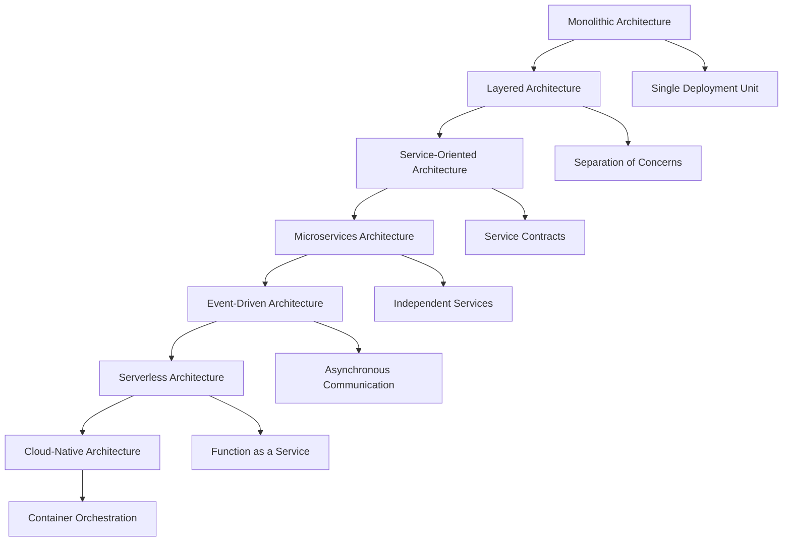

# 5.1 Architecture Design and Formal Analysis

[Back to Parent](../5-architecture-and-design-patterns.md) | [中文版](../5-架构与设计模式/5.1-架构设计与形式化分析.md)

## Table of Contents

- [5.1 Architecture Design and Formal Analysis](#51-architecture-design-and-formal-analysis)
  - [Table of Contents](#table-of-contents)
  - [5.1.1 Software Architecture Evolution and Theory](#511-software-architecture-evolution-and-theory)
    - [From Monolithic to Cloud-Native Architecture](#from-monolithic-to-cloud-native-architecture)
    - [Formal Architecture Description Languages](#formal-architecture-description-languages)
  - [5.1.2 Architecture Pattern Formalization](#512-architecture-pattern-formalization)
    - [Microservices Architecture Modeling](#microservices-architecture-modeling)
    - [Event-Driven Architecture Verification](#event-driven-architecture-verification)
  - [5.1.3 Quality Attribute Analysis](#513-quality-attribute-analysis)
    - [Performance and Scalability](#performance-and-scalability)
    - [Reliability and Fault Tolerance](#reliability-and-fault-tolerance)
  - [5.1.4 Modern Architecture Implementation](#514-modern-architecture-implementation)
    - [Service Mesh and Infrastructure](#service-mesh-and-infrastructure)
    - [Containerization and Orchestration](#containerization-and-orchestration)
  - [5.1.5 Architecture Evaluation and Evolution](#515-architecture-evaluation-and-evolution)
    - [Evolution Strategies](#evolution-strategies)
    - [Migration Techniques](#migration-techniques)
  - [5.1.6 References and Further Reading](#516-references-and-further-reading)

---

## 5.1.1 Software Architecture Evolution and Theory

### From Monolithic to Cloud-Native Architecture

The evolution of software architecture reflects the changing requirements of modern distributed systems:



### Formal Architecture Description Languages

```lean
-- Formal specification of software architecture
structure SoftwareArchitecture where
  components : Set Component
  connectors : Set Connector
  configuration : Configuration
  constraints : Set ArchitecturalConstraint

-- Component definition with interfaces
structure Component where
  id : ComponentId
  interfaces : Set Interface
  behavior : ComponentBehavior
  properties : Set Property

-- Connector for component interaction
structure Connector where
  id : ConnectorId
  roles : Set Role
  glue : ConnectorBehavior
  protocol : CommunicationProtocol

-- Architectural constraint specification
inductive ArchitecturalConstraint where
  | topology : TopologyConstraint → ArchitecturalConstraint
  | interaction : InteractionConstraint → ArchitecturalConstraint  
  | resource : ResourceConstraint → ArchitecturalConstraint
  | quality : QualityConstraint → ArchitecturalConstraint

-- Quality attribute formalization
def satisfies_quality_attribute (arch : SoftwareArchitecture) 
  (attr : QualityAttribute) : Prop :=
  match attr with
  | QualityAttribute.performance threshold => 
      ∀ c ∈ arch.components, response_time c ≤ threshold
  | QualityAttribute.scalability factor =>
      scalable arch factor
  | QualityAttribute.reliability availability =>
      system_availability arch ≥ availability
```

## 5.1.2 Architecture Pattern Formalization

### Microservices Architecture Modeling

```rust
// Formal modeling of microservices architecture
use serde::{Deserialize, Serialize};
use std::collections::HashMap;

#[derive(Debug, Clone, Serialize, Deserialize)]
pub struct MicroserviceArchitecture {
    services: HashMap<ServiceId, Microservice>,
    communication: CommunicationTopology,
    data_consistency: ConsistencyModel,
    service_discovery: ServiceDiscoveryMechanism,
}

#[derive(Debug, Clone)]
pub struct Microservice {
    id: ServiceId,
    domain: BusinessDomain,
    api: ServiceAPI,
    data_store: DataStore,
    dependencies: Vec<ServiceId>,
    deployment: DeploymentConfiguration,
}

// Service interaction patterns
#[derive(Debug, Clone)]
pub enum CommunicationPattern {
    RequestResponse(SynchronousCall),
    EventDriven(AsynchronousEvent),
    StreamProcessing(DataStream),
    GraphQL(QueryInterface),
}

impl MicroserviceArchitecture {
    /// Verify architectural constraints
    pub fn verify_constraints(&self) -> ArchitectureVerificationResult {
        let mut violations = Vec::new();
        
        // Check service autonomy
        for (id, service) in &self.services {
            if !self.is_autonomous(service) {
                violations.push(ConstraintViolation::LackOfAutonomy(*id));
            }
        }
        
        // Verify data consistency boundaries
        if !self.verify_data_boundaries() {
            violations.push(ConstraintViolation::DataBoundaryViolation);
        }
        
        // Check communication patterns
        if !self.verify_communication_patterns() {
            violations.push(ConstraintViolation::CommunicationAntipattern);
        }
        
        if violations.is_empty() {
            ArchitectureVerificationResult::Valid
        } else {
            ArchitectureVerificationResult::Invalid(violations)
        }
    }
    
    fn is_autonomous(&self, service: &Microservice) -> bool {
        // Service should own its data and business logic
        service.data_store.is_exclusive() && 
        service.domain.is_cohesive() &&
        !self.has_tight_coupling(service)
    }
    
    /// Analyze service mesh topology
    pub fn analyze_service_mesh(&self) -> ServiceMeshAnalysis {
        let connectivity = self.compute_connectivity_matrix();
        let latency_profile = self.analyze_latency_characteristics();
        let failure_modes = self.identify_failure_modes();
        
        ServiceMeshAnalysis {
            connectivity,
            latency_profile,
            failure_modes,
            recommendations: self.generate_optimization_recommendations(),
        }
    }
}

// Event-driven architecture specification
#[derive(Debug, Clone)]
pub struct EventDrivenArchitecture {
    event_sources: HashMap<String, EventSource>,
    event_processors: HashMap<String, EventProcessor>,
    event_stores: HashMap<String, EventStore>,
    topology: EventTopology,
}

// Event sourcing pattern
#[derive(Debug, Clone, Serialize, Deserialize)]
pub struct EventSourcingAggregate {
    id: AggregateId,
    version: Version,
    uncommitted_events: Vec<DomainEvent>,
}

impl EventSourcingAggregate {
    pub fn apply_event(&mut self, event: DomainEvent) {
        self.uncommitted_events.push(event.clone());
        self.when(event);
        self.version += 1;
    }
    
    pub fn load_from_history(events: Vec<DomainEvent>) -> Self {
        let mut aggregate = Self::new();
        for event in events {
            aggregate.when(event);
            aggregate.version += 1;
        }
        aggregate
    }
    
    fn when(&mut self, event: DomainEvent) {
        // Apply event to update aggregate state
        match event.event_type {
            EventType::Created => self.handle_created(event),
            EventType::Updated => self.handle_updated(event),
            EventType::Deleted => self.handle_deleted(event),
        }
    }
}
```

### Event-Driven Architecture Verification

```lean
-- Event-driven architecture formal verification
structure EventDrivenSystem where
  events : Set Event
  handlers : Set EventHandler  
  ordering : Event → Event → Prop
  causality : Event → Set Event

-- Event ordering properties
def eventually_consistent (eds : EventDrivenSystem) : Prop :=
  ∀ e₁ e₂ : Event, e₁ ∈ eds.events → e₂ ∈ eds.events →
    eds.ordering e₁ e₂ → ∃ t : Time, 
      state_at eds t e₁ = state_at eds t e₂

-- Causal consistency verification
def causal_consistency (eds : EventDrivenSystem) : Prop :=
  ∀ e₁ e₂ : Event, e₁ ∈ eds.causality e₂ →
    ∀ node : Node, sees node e₂ → sees node e₁

-- Event handler properties
def idempotent_handler (h : EventHandler) : Prop :=
  ∀ e : Event, ∀ s : State,
    h.apply (h.apply s e) e = h.apply s e

-- Saga pattern for distributed transactions
structure SagaPattern where
  steps : List SagaStep
  compensations : SagaStep → Option SagaStep
  coordinator : SagaCoordinator

def saga_correctness (saga : SagaPattern) : Prop :=
  ∀ execution : SagaExecution,
    (successful execution → all_steps_committed execution) ∧
    (failed execution → all_steps_compensated execution)
```

## 5.1.3 Quality Attribute Analysis

### Performance and Scalability

```haskell
-- Performance modeling and analysis
module PerformanceAnalysis where

import Control.Monad.State
import Data.Map as Map

-- System performance model
data PerformanceModel = PerformanceModel
  { components :: Map ComponentId Component
  , workload :: WorkloadModel  
  , resources :: ResourceModel
  , constraints :: [PerformanceConstraint]
  }

-- Component performance characteristics
data Component = Component
  { processingTime :: Distribution Double
  , throughput :: Double
  , resourceUsage :: ResourceUsage
  , scalabilityFactor :: Double
  }

-- Workload modeling
data WorkloadModel = WorkloadModel
  { arrivalRate :: Double -> Double  -- Time-dependent arrival rate
  , requestSize :: Distribution Int
  , sessionality :: SessionModel
  }

-- Performance analysis
analyzePerformance :: PerformanceModel -> PerformanceMetrics
analyzePerformance model = 
  let responseTime = computeResponseTime model
      throughput = computeThroughput model  
      utilization = computeUtilization model
      scalability = analyzeScalability model
  in PerformanceMetrics responseTime throughput utilization scalability

-- Scalability analysis using queueing theory
analyzeScalability :: PerformanceModel -> ScalabilityAnalysis
analyzeScalability model = 
  let currentCapacity = sum $ Map.elems $ Map.map throughput (components model)
      bottlenecks = identifyBottlenecks model
      scalingFactors = Map.map scalabilityFactor (components model)
  in ScalabilityAnalysis currentCapacity bottlenecks scalingFactors

-- Capacity planning
planCapacity :: PerformanceModel -> GrowthProjection -> CapacityPlan  
planCapacity model projection =
  let futureLoad = projectWorkload (workload model) projection
      requiredCapacity = computeRequiredCapacity futureLoad
      currentCapacity = getCurrentCapacity model
      gap = requiredCapacity - currentCapacity
  in CapacityPlan gap (recommendScaling gap model)
```

### Reliability and Fault Tolerance

```rust
// Reliability engineering and fault tolerance
pub struct ReliabilityModel {
    components: HashMap<ComponentId, ComponentReliability>,
    failure_modes: Vec<FailureMode>,
    recovery_strategies: HashMap<FailureType, RecoveryStrategy>,
    sla_requirements: ServiceLevelAgreements,
}

#[derive(Debug, Clone)]
pub struct ComponentReliability {
    mtbf: Duration,  // Mean Time Between Failures
    mttr: Duration,  // Mean Time To Recovery
    availability: f64,
    failure_rate: f64,
}

impl ReliabilityModel {
    /// Calculate system-wide availability
    pub fn calculate_availability(&self) -> f64 {
        // For components in series: A_system = A1 * A2 * ... * An
        // For components in parallel: A_system = 1 - (1-A1) * (1-A2) * ... * (1-An)
        
        let component_availabilities: Vec<f64> = self.components
            .values()
            .map(|c| c.availability)
            .collect();
            
        // Simplified calculation for series components
        component_availabilities.iter().product()
    }
    
    /// Failure Mode and Effects Analysis (FMEA)
    pub fn conduct_fmea(&self) -> FMEAReport {
        let mut failure_analysis = Vec::new();
        
        for failure_mode in &self.failure_modes {
            let impact = self.assess_failure_impact(failure_mode);
            let probability = self.calculate_failure_probability(failure_mode);
            let risk_priority = impact * probability;
            
            failure_analysis.push(FailureAnalysis {
                mode: failure_mode.clone(),
                impact,
                probability,
                risk_priority,
                mitigation: self.recommend_mitigation(failure_mode),
            });
        }
        
        // Sort by risk priority
        failure_analysis.sort_by(|a, b| b.risk_priority.partial_cmp(&a.risk_priority).unwrap());
        
        FMEAReport { analyses: failure_analysis }
    }
    
    /// Circuit breaker pattern implementation
    pub fn implement_circuit_breaker(&self, component: ComponentId) -> CircuitBreaker {
        let reliability = &self.components[&component];
        
        CircuitBreaker::new(CircuitBreakerConfig {
            failure_threshold: 5,
            timeout: Duration::from_secs(60),
            success_threshold: 3,
            failure_rate_threshold: reliability.failure_rate * 2.0,
        })
    }
}

// Chaos engineering for resilience testing
pub struct ChaosEngineeringFramework {
    experiments: Vec<ChaosExperiment>,
    metrics: Vec<ResilienceMetric>,
    safety_guards: Vec<SafetyGuard>,
}

#[derive(Debug, Clone)]
pub enum ChaosExperiment {
    ServiceFailure { target: ServiceId, duration: Duration },
    NetworkPartition { affected_nodes: Vec<NodeId> },
    ResourceExhaustion { resource: ResourceType, percentage: f64 },
    LatencyInjection { target: ServiceId, delay: Duration },
}

impl ChaosEngineeringFramework {
    pub fn execute_experiment(&mut self, experiment: ChaosExperiment) -> ExperimentResult {
        // Verify safety guards before execution
        if !self.verify_safety_guards(&experiment) {
            return ExperimentResult::Aborted("Safety guards failed".to_string());
        }
        
        let baseline_metrics = self.collect_baseline_metrics();
        
        // Execute the chaos experiment
        let experiment_handle = self.inject_failure(&experiment);
        
        // Monitor system behavior
        let during_metrics = self.monitor_during_experiment(&experiment);
        
        // Clean up and restore
        self.cleanup_experiment(experiment_handle);
        
        let recovery_metrics = self.collect_recovery_metrics();
        
        ExperimentResult::Completed {
            baseline: baseline_metrics,
            during: during_metrics,
            recovery: recovery_metrics,
            insights: self.analyze_resilience_insights(&experiment),
        }
    }
}
```

## 5.1.4 Modern Architecture Implementation

### Service Mesh and Infrastructure

```yaml
# Istio service mesh configuration
apiVersion: networking.istio.io/v1alpha3
kind: VirtualService
metadata:
  name: microservice-routing
spec:
  hosts:
  - user-service
  http:
  - match:
    - headers:
        version:
          exact: v2
    route:
    - destination:
        host: user-service
        subset: v2
      weight: 100
  - route:
    - destination:
        host: user-service  
        subset: v1
      weight: 80
    - destination:
        host: user-service
        subset: v2
      weight: 20

---
apiVersion: networking.istio.io/v1alpha3
kind: DestinationRule
metadata:
  name: user-service-destination
spec:
  host: user-service
  trafficPolicy:
    circuitBreaker:
      consecutiveErrors: 3
      interval: 30s
      baseEjectionTime: 30s
  subsets:
  - name: v1
    labels:
      version: v1
    trafficPolicy:
      portLevelSettings:
      - port:
          number: 8080
        connectionPool:
          tcp:
            maxConnections: 100
          http:
            http1MaxPendingRequests: 100
            maxRequestsPerConnection: 2
  - name: v2
    labels:
      version: v2
```

### Containerization and Orchestration

```rust
// Kubernetes controller for custom resources
use kube::{Api, Client, CustomResource};
use serde::{Deserialize, Serialize};
use tokio;

#[derive(CustomResource, Debug, Clone, Deserialize, Serialize)]
#[kube(group = "architecture.io", version = "v1", kind = "MicroserviceArchitecture")]
#[kube(status = "MicroserviceArchitectureStatus")]
pub struct MicroserviceArchitectureSpec {
    pub services: Vec<ServiceSpec>,
    pub communication: CommunicationSpec,
    pub observability: ObservabilitySpec,
}

#[derive(Debug, Clone, Deserialize, Serialize)]
pub struct ServiceSpec {
    pub name: String,
    pub image: String,
    pub replicas: i32,
    pub resources: ResourceRequirements,
    pub health_checks: HealthCheckSpec,
}

#[derive(Debug, Clone, Deserialize, Serialize)]
pub struct MicroserviceArchitectureStatus {
    pub phase: String,
    pub services_ready: i32,
    pub services_total: i32,
    pub conditions: Vec<Condition>,
}

// Custom controller implementation
pub struct MicroserviceController {
    client: Client,
    service_api: Api<Service>,
    deployment_api: Api<Deployment>,
}

impl MicroserviceController {
    pub async fn reconcile(&self, architecture: &MicroserviceArchitecture) -> Result<(), Error> {
        // Ensure all services are deployed
        for service_spec in &architecture.spec.services {
            self.ensure_service_deployment(service_spec).await?;
        }
        
        // Configure service mesh
        self.configure_service_mesh(&architecture.spec.communication).await?;
        
        // Setup observability
        self.setup_observability(&architecture.spec.observability).await?;
        
        // Update status
        self.update_status(architecture).await?;
        
        Ok(())
    }
    
    async fn ensure_service_deployment(&self, spec: &ServiceSpec) -> Result<(), Error> {
        let deployment = self.create_deployment_spec(spec);
        self.deployment_api.patch(&spec.name, &PatchParams::apply("controller"), &Patch::Apply(deployment)).await?;
        
        let service = self.create_service_spec(spec);
        self.service_api.patch(&spec.name, &PatchParams::apply("controller"), &Patch::Apply(service)).await?;
        
        Ok(())
    }
}

#[tokio::main]
async fn main() -> Result<(), Box<dyn std::error::Error>> {
    let client = Client::try_default().await?;
    let controller = MicroserviceController::new(client);
    
    // Start controller loop
    controller.run().await?;
    
    Ok(())
}
```

## 5.1.5 Architecture Evaluation and Evolution

### Evolution Strategies

```lean
-- Architecture evolution formalization
structure ArchitectureEvolution where
  source : SoftwareArchitecture
  target : SoftwareArchitecture  
  migration_path : List MigrationStep
  constraints : Set EvolutionConstraint

-- Migration step definition
inductive MigrationStep where
  | decompose : Component → List Component → MigrationStep
  | extract : Component → Service → MigrationStep
  | merge : List Component → Component → MigrationStep
  | replace : Component → Component → MigrationStep
  | introduce : Component → MigrationStep

-- Evolution constraints
inductive EvolutionConstraint where
  | zero_downtime : EvolutionConstraint
  | data_consistency : EvolutionConstraint
  | rollback_capability : EvolutionConstraint
  | performance_preservation : EvolutionConstraint

-- Correctness of evolution
def evolution_preserves_semantics (evo : ArchitectureEvolution) : Prop :=
  ∀ behavior : SystemBehavior,
    semantics evo.source behavior ↔ semantics evo.target behavior

-- Migration safety
def safe_migration (evo : ArchitectureEvolution) : Prop :=
  ∀ step ∈ evo.migration_path, ∀ constraint ∈ evo.constraints,
    satisfies step constraint

-- Strangler Fig pattern formalization
structure StranglerFigPattern where
  legacy_system : LegacySystem
  new_system : ModernSystem
  facade : ProxyLayer
  migration_rules : Set MigrationRule

def strangler_fig_invariant (sfp : StranglerFigPattern) : Prop :=
  ∀ request : Request,
    (routed_to_legacy sfp.facade request → 
     handles sfp.legacy_system request) ∧
    (routed_to_new sfp.facade request → 
     handles sfp.new_system request)
```

### Migration Techniques

```haskell
-- Database migration strategies
module DatabaseMigration where

import Control.Monad.State
import Data.Time

-- Database schema evolution
data SchemaEvolution = SchemaEvolution
  { currentSchema :: Schema
  , targetSchema :: Schema
  , migrationSteps :: [MigrationStep]
  , rollbackPlan :: RollbackPlan
  }

data MigrationStep 
  = AddTable TableDefinition
  | DropTable TableName
  | AddColumn TableName ColumnDefinition
  | DropColumn TableName ColumnName
  | ModifyColumn TableName ColumnName ColumnDefinition
  | CreateIndex IndexDefinition
  | DropIndex IndexName
  | DataMigration DataTransformation

-- Zero-downtime migration strategies
executeZeroDowntimeMigration :: SchemaEvolution -> IO MigrationResult
executeZeroDowntimeMigration evolution = do
  -- Phase 1: Additive changes
  executeAdditiveChanges evolution
  
  -- Phase 2: Dual writing phase
  enableDualWriting evolution
  
  -- Phase 3: Backfill historical data
  backfillData evolution
  
  -- Phase 4: Switch reads to new schema
  switchReads evolution
  
  -- Phase 5: Remove old schema (cleanup)
  cleanupOldSchema evolution

-- Parallel change pattern
data ParallelChange = ParallelChange
  { oldImplementation :: Implementation
  , newImplementation :: Implementation
  , trafficSplitter :: TrafficSplitter
  , consistencyChecker :: ConsistencyChecker
  }

executeParallelChange :: ParallelChange -> Percentage -> IO ()
executeParallelChange change percentage = do
  -- Gradually shift traffic to new implementation
  updateTrafficSplit (trafficSplitter change) percentage
  
  -- Monitor consistency between implementations
  consistency <- checkConsistency (consistencyChecker change)
  
  -- Rollback if inconsistencies detected
  when (not consistency) $ rollbackTraffic change
```

## 5.1.6 References and Further Reading

### Core Architecture References

**Software Architecture Fundamentals**:
- Bass, L., Clements, P. & Kazman, R. "Software Architecture in Practice" (2021)
- Fowler, M. "Patterns of Enterprise Application Architecture" (2002)
- Evans, E. "Domain-Driven Design" (2003)

**Microservices and Distributed Systems**:
- Newman, S. "Building Microservices" (2021)
- Richardson, C. "Microservices Patterns" (2018)
- Kleppmann, M. "Designing Data-Intensive Applications" (2017)

**Cloud-Native Architecture**:
- Burns, B. & Beda, J. "Kubernetes: Up and Running" (2022)
- Ibryam, B. & Huß, R. "Kubernetes Patterns" (2019)
- Indrasiri, K. & Siriwardena, P. "Microservices for the Enterprise" (2018)

### Formal Methods and Verification

**Architecture Description Languages**:
- Medvidovic, N. & Taylor, R.N. "A Classification and Comparison Framework for Software Architecture Description Languages" (2000)
- Garlan, D. "Software Architecture: a Roadmap" (2000)

**Reliability Engineering**:
- Blankinship, J. "Site Reliability Engineering" (2016)
- Beyer, B. "The Site Reliability Workbook" (2018)
- Casey, R. "Chaos Engineering" (2020)

### Online Resources

- [Martin Fowler's Blog](https://martinfowler.com/) - Architecture patterns and practices
- [High Scalability](http://highscalability.com/) - Architecture case studies
- [The Architecture of Open Source Applications](https://aosabook.org/) - Real-world architecture examples
- [Microsoft Architecture Center](https://docs.microsoft.com/en-us/azure/architecture/) - Cloud architecture guidance
- [AWS Architecture Center](https://aws.amazon.com/architecture/) - AWS reference architectures

---

[Back to Tree](../0-Overview-and-Navigation/0.1-Global-Topic-Tree.md)
